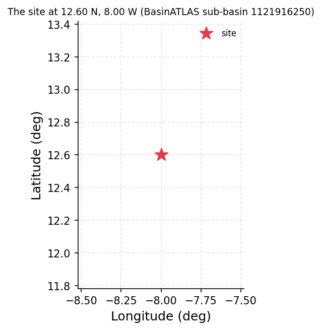
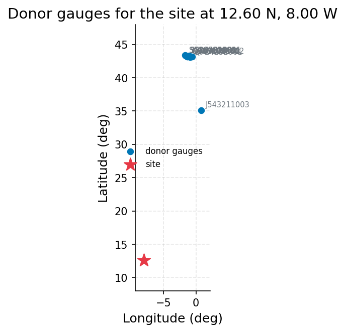
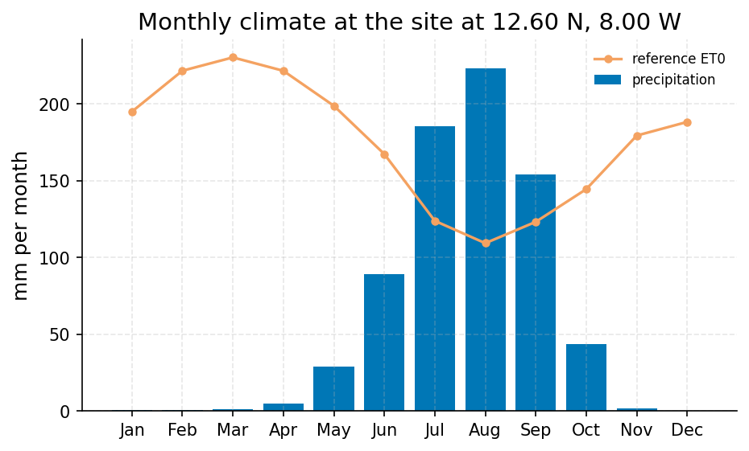
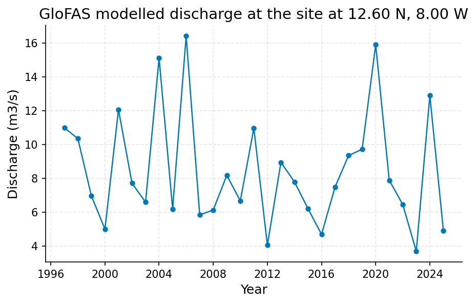

# Niger at Bamako: Mean Flow and Low-Flow Planning Values for a Proposed Water-Supply Offtake (Ungauged Site)

**Author:** AquaScope Studio  
**Date:** 2026-09-14  
**Description:** estimate the mean flow and low-flow (Q95) that a proposed water-supply offtake on the Niger at Bamako should plan around, given no usable gauge record at the site  
**Data Sources:** BasinATLAS (HydroATLAS v1.0), ERA5 via Open-Meteo, similar_basins  
**Version:** 1.0  

**Site:** 12.6000 N, 8.0000 W

**Answer.** estimate the mean flow and low-flow (Q95) that a proposed water-supply offtake on the Niger at Bamako should plan around, given no usable gauge record at the site: mean daily flow 0.779 mm/d (screening). BasinATLAS's own modelled natural discharge for the same catchment is 1092 m3/s (s1), within 5 percent of the regionalized mean, but the GloFAS grid-cell cross-check (0.566 m3/s mean, s4) is not usable - it is roughly three orders of magnitude too low and evidently samples the wrong channel or pixel.

*Key numbers*

| Quantity | Value | Unit | Step |
| --- | --- | --- | --- |
| Upstream area | 115000.0 | km2 | s1 |
| Donor gauges | 10.0 |  | s2 |
| mean daily flow | 0.779 | mm/d | s3 |
| mean daily flow band, low | 0.2935 | mm/d | s3 |
| mean daily flow band, high | 2.067 | mm/d | s3 |
| low flow: exceeded 95 % of days | 0.0801 | mm/d | s3 |
| low flow: exceeded 95 % of days band, low | 0.0253 | mm/d | s3 |
| low flow: exceeded 95 % of days band, high | 0.2533 | mm/d | s3 |
| high flow: exceeded 5 % of days | 2.504 | mm/d | s3 |
| high flow: exceeded 5 % of days band, low | 0.8527 | mm/d | s3 |
| high flow: exceeded 5 % of days band, high | 7.354 | mm/d | s3 |
| mean annual daily maximum | 10.18 | mm/d | s3 |
| mean annual daily maximum band, low | 1.609 | mm/d | s3 |
| mean annual daily maximum band, high | 64.37 | mm/d | s3 |
| mean flow / BasinATLAS precipitation | 0.2622 | - | s3 |
| mean flow / BasinATLAS precipitation band, low | 0.091 | - | s3 |
| mean flow / BasinATLAS precipitation band, high | 0.4335 | - | s3 |
| baseflow / total flow | 0.5952 | - | s3 |
| baseflow / total flow band, low | 0.4597 | - | s3 |
| baseflow / total flow band, high | 0.7306 | - | s3 |
| ERA5 precipitation | 743.8 | mm per year | s4 |
| ERA5 reference evapotranspiration | 2100.0 | mm per year | s4 |
| Aridity index | 0.3541 |  | s4 |
| GloFAS mean discharge (cell) | 0.5657 | m3/s | s4 |

## Summary

No gauge exists on the Niger at Bamako, so this study transfers flow signatures from 10 donor gauges selected by BasinATLAS attribute similarity to a 115,013 km2 delineated catchment (s1, s2), and cross-checks the result against GloFAS modelled discharge and ERA5 climate for the same grid cell (s4). The GloFAS cross-check failed: its grid-cell mean discharge of 0.566 m3/s is not a plausible reading of the Niger mainstem and cannot corroborate or challenge the transferred values. All numbers are screening-grade estimates for design planning, not calibrated design flows.

## The decision

Decide the offtake's mean-flow and low-flow planning basis using the donor-regionalized signatures from s3, graded screening. Conditions: use the BasinATLAS upstream area of 115,013 km2 (s1) for any unit conversion; treat the GloFAS grid-cell series as unrepresentative of the mainstem and exclude it from magnitude validation; recognise that the 10 donors used for the transfer are French metropolitan, Caribbean and one temperate European gauge, none Sahelian or West African, which weakens the physical basis of the transfer despite low reported similarity distances. What would change this: an at-site or nearby Niger mainstem gauge record at or near Bamako; a correctly located GloFAS/reanalysis pixel actually on the Niger channel; or a donor pool restricted to Sahelian/West African large rivers with comparable aridity and regulation, which would narrow the bands and could raise the grade from screening toward indicative.

## Findings

Second, this agrees with BasinATLAS's own modelled natural discharge of 1092 m3/s (s1) to within about 5 percent, two independent non-gauge estimates converging on the same order of magnitude; grade screening (both derive from regional/global datasets, not a local gauge). Fourth, the GloFAS grid-cell mean discharge of 0.566 m3/s (s4) is three orders of magnitude below all other estimates and its annual maxima (up to 16.42 m3/s) are about 800 times smaller than the regionalized flood signature; this cross-check is not established and should not be used to validate magnitude.

## Problem and decision

There is no gauge reachable on the Niger at Bamako. The client needs mean annual flow and Q95 low flow (with Q05 noted for context) to plan a water-supply offtake, without any at-site discharge record or possibility of local calibration.

## Site and data

The site (lat 12.6, lon -8.0) drains 115,012.9 km2 upstream (BasinATLAS HydroBASINS, 849 level-12 sub-basins, s1). Mean elevation is 467 m, mean slope 2.5 degrees, annual precipitation 1508 mm/yr, PET 2064 mm/yr, AET 1087 mm/yr, aridity index 0.73, mean temperature 25.8 C, with 0 percent snow cover. Land cover is 35 percent forest, 24 percent pasture, 7 percent cropland, 1 percent urban, 1 percent irrigated, 2 percent wetland, 0.3 percent lake. Soils are 26 percent clay, 20 percent silt, 53 percent sand, with 19 t/ha soil organic carbon. Population is about 5.16 million people (density 45.68/km2). Degree of regulation is 6.3 percent with 2170 million m3 of upstream reservoir volume. BasinATLAS's own natural-discharge field gives 1091.69 m3/s at the outlet.

## Methodology

Four steps: (1) delineate and characterize the upstream catchment from BasinATLAS (HydroATLAS v1.0), area-weighted over 849 sub-basins; (2) select 10 donor gauges from a 34,786-gauge pool by weighted Euclidean distance in standardised catchment-attribute space; (3) transfer mean, median, Q95, Q05 and other flow signatures from those donors by inverse-distance-weighted averaging, reporting cross-donor bands and leave-one-out skill; (4) cross-check against GloFAS modelled discharge and ERA5 climate for the same grid cell as an independent, non-gauge estimate. No at-site calibration or flow-duration analysis was performed, since no discharge record exists at the point.

## Results: step s1

The catchment gate passed (sub-basin present, 115,012.9 km2 against a 200,000 km2 ceiling). Key BasinATLAS attributes: elevation 467 m, slope 2.5 degrees, precipitation 1508 mm/yr, PET 2064 mm/yr, AET 1087 mm/yr, aridity 0.73, temperature 25.8 C, runoff 406.54 mm/yr, and a modelled natural discharge of 1091.69 m3/s at the outlet - the figure used as the independent BasinATLAS-based check on the regionalized mean flow.


*The site, in longitude and latitude (no basemap); no catalogue station was listed with it.*

*Catchment attributes from BasinATLAS for the site at 12.60 N, 8.00 W.*

| attribute | label | value | unit | source | note |
| --- | --- | --- | --- | --- | --- |
| n_sub_basins |  | 849.0 |  |  |  |
| area_km2 |  | 115014.4 |  |  |  |
| outlet_hybas_id |  | 1121916250.0 |  |  |  |
| upstream_area_km2 |  | 115012.9 |  |  |  |
| elevation_m | mean elevation | 467.0 | m | basinatlas_upstream |  |
| slope_deg | mean slope | 2.5 | degrees | basinatlas_upstream |  |
| precipitation_mm_yr | annual precipitation (WorldClim) | 1508.0 | mm/yr | basinatlas_upstream |  |
| pet_mm_yr | annual potential evapotranspiration | 2064.0 | mm/yr | basinatlas_upstream |  |
| aet_mm_yr | annual actual evapotranspiration | 1087.0 | mm/yr | basinatlas_upstream |  |
| aridity_index | aridity index (P/PET) | 0.73 | P/PET | basinatlas_upstream |  |
| temperature_c | mean annual air temperature | 25.8 | °C | basinatlas_upstream |  |
| snow_cover_pct | annual snow cover extent | 0.0 | % | basinatlas_upstream |  |
| runoff_mm_yr | annual land-surface runoff | 406.54 | mm/yr | area_weighted_mean |  |
| discharge_m3s | mean annual natural discharge at the outlet | 1091.69 | m3/s | basinatlas_upstream |  |
| forest_pct | forest cover | 35.0 | % | basinatlas_upstream |  |
| cropland_pct | cropland | 7.0 | % | basinatlas_upstream |  |
| pasture_pct | pasture | 24.0 | % | basinatlas_upstream |  |
| urban_pct | urban extent | 1.0 | % | basinatlas_upstream |  |
| irrigated_pct | irrigated area | 1.0 | % | basinatlas_upstream |  |
| glacier_pct | glacier extent | 0.0 | % | basinatlas_upstream |  |
| wetland_pct | wetlands (all classes) | 2.0 | % | basinatlas_upstream |  |
| lake_pct | lake area | 0.3 | % | basinatlas_upstream |  |
| karst_pct | karst extent | 0.0 | % | basinatlas_upstream |  |
| clay_pct | clay fraction in soil | 26.0 | % | basinatlas_upstream |  |
| silt_pct | silt fraction in soil | 20.0 | % | basinatlas_upstream |  |
| sand_pct | sand fraction in soil | 53.0 | % | basinatlas_upstream |  |
| soil_organic_carbon_t_ha | soil organic carbon | 19.0 | t/ha | basinatlas_upstream |  |
| soil_water_pct | annual soil water content | 55.0 | % | basinatlas_upstream |  |
| groundwater_table_cm | groundwater table depth | 140.34 | cm | area_weighted_mean |  |
| population_density | population density | 45.68 | people/km2 | basinatlas_upstream |  |
| population | population count | 5158532.23 | people | basinatlas_upstream |  |
| degree_of_regulation_pct | degree of regulation by reservoirs | 6.3 | % | basinatlas_upstream |  |
| human_footprint_2009 | human footprint (2009) | 6.4 | index 0-50 | basinatlas_upstream |  |
| reservoir_volume_mcm | reservoir volume upstream | 2170.0 | million m3 | basinatlas_upstream |  |

## Results: step s2

10 donor gauges were retrieved from 34,786 candidates (gate passed, minimum 3 required). All 10 are Eaufrance/Hub'Eau stations in metropolitan France, at distances of about 2656-3483 km from the site, with similarity scores of 5.98-7.03 (lower similarity_distance is better; several members have distance under 1.2). None are Sahelian or West African rivers, and their aridity (0.97-1.48), temperature (9-14 C) and snow cover (2-12 percent) differ sharply from the target's aridity 0.73, temperature 25.8 C and 0 percent snow.


*The site and the 10 donor gauges the similarity search selected, in longitude and latitude (no basemap); labels are the station ids.*

*Donor gauges selected for the site at 12.60 N, 8.00 W.*

| source | station_id | name | latitude | longitude | distance_km | score | similarity_distance | up_area_km2 | period_start | period_end |
| --- | --- | --- | --- | --- | --- | --- | --- | --- | --- | --- |
| hubeau_hydrometrie | J543211003 | Le Blavet à Neulliac - Blavet Auquinian | 35.108562837 | 0.840483401 | 2656.2 | 5.9802 | 2.7459 | 128.1 | 2026-07-09 |  |
| hubeau_hydrometrie | Q902000101 | La Nive à Saint-Jean-Pied-de-Port | 43.161941599 | -1.236181897 | 3459.9 | 7.0057 | 1.0935 | 258.0 | 2025-05-01 |  |
| hubeau_hydrometrie | Q614292002 | Le Gave d'Oloron [Le Gave d'Ossau] à Oloron-Sainte-Marie - Quartier Sestiaa | 43.191760961 | -0.604709963 | 3475.0 | 7.0121 | 0.9309 | 1184.1 | 2011-11-17 |  |
| hubeau_hydrometrie | Q916461001 | La Nive des Aldudes à Saint-Étienne-de-Baïgorry | 43.184100302 | -1.33680921 | 3460.5 | 7.0141 | 1.1388 | 205.3 | 1960-01-01 |  |
| hubeau_hydrometrie | Q724252001 | Le Saison à Licq-Athérey [Pont de Licq] | 43.066445321 | -0.876716891 | 3456.2 | 7.0188 | 1.2173 | 366.2 | 1996-01-01 |  |
| hubeau_hydrometrie | S514401001 | La Nivelle à Saint-Pée-sur-Nivelle [Pont de Cherchebruit] | 43.321469448 | -1.54993683 | 3471.7 | 7.0201 | 1.035 | 239.8 | 1969-01-01 |  |
| hubeau_hydrometrie | S514402001 | La Nivelle à Saint-Pée-sur-Nivelle [Lurberria] | 43.313456954 | -1.533052277 | 3471.1 | 7.0209 | 1.0478 | 239.8 | 2009-03-27 |  |
| hubeau_hydrometrie | Q910251001 | La Nive à Ossès | 43.230308097 | -1.301413439 | 3466.2 | 7.0209 | 1.112 | 767.6 | 1995-01-01 |  |
| hubeau_hydrometrie | Q803251001 | La Bidouze à Aïcirits-Camou-Suhast [Saint-Palais] | 43.334342208 | -1.027918942 | 3482.4 | 7.0287 | 0.9461 | 475.5 | 1969-10-15 |  |
| hubeau_hydrometrie | S516001001 | La Nivelle à Ciboure | 43.384770372 | -1.66398305 | 3476.7 | 7.0294 | 1.0314 | 239.8 | 2000-05-22 |  |

## Results: step s3

The regionalization gate passed (estimates and skill both present). Runoff ratio is 0.2622 (0.091-0.4335) and baseflow index 0.5952 (0.4597-0.7306). Leave-one-out skill (n=1155 donors, log space): median APE 0.251 for mean flow, 0.534 for Q95, 0.262 for Q05 - Q95 transfer is the weakest of the three.


*Flow signatures transferred to the site from 10 donor catchments, with the one-standard-deviation band across donors as error bars and the leave-one-out skill (NSE) where published.*

*Flow signatures at the site at 12.60 N, 8.00 W.*

| signature | label | value | low | high | unit | n_donors | nse |
| --- | --- | --- | --- | --- | --- | --- | --- |
| q_mean_mm | mean daily flow | 0.779 | 0.2935 | 2.0675 | mm/d | 10 |  |
| q_median_mm | median daily flow | 0.3571 | 0.1733 | 0.7358 | mm/d | 10 |  |
| q95_mm | low flow: exceeded 95 % of days | 0.0801 | 0.0253 | 0.2533 | mm/d | 10 |  |
| q05_mm | high flow: exceeded 5 % of days | 2.5041 | 0.8527 | 7.3535 | mm/d | 10 |  |
| q_annual_max_mm | mean annual daily maximum | 10.1762 | 1.6087 | 64.3716 | mm/d | 10 |  |
| runoff_ratio | mean flow / BasinATLAS precipitation | 0.2622 | 0.091 | 0.4335 | - | 10 | -0.027 |
| baseflow_index | baseflow / total flow | 0.5952 | 0.4597 | 0.7306 | - | 10 | 0.33 |
| fdc_slope | slope of the flow-duration curve (log space, 33-66 %) | 2.5118 | 1.5163 | 3.5074 | - | 10 | 0.169 |
| high_flow_frequency | days above 3 x median per year | 53.1574 | 29.0439 | 77.271 | days/yr | 10 | 0.263 |
| low_flow_frequency | days below 0.2 x median per year | 16.7814 | 0.0 | 40.4438 | days/yr | 10 | 0.269 |
| zero_flow_fraction | fraction of zero-flow days | 0.0 | 0.0 | 0.0002 | - | 10 | -0.087 |
| seasonality_index | Markham seasonality of monthly flow | 0.266 | 0.0828 | 0.4491 | - | 10 | 0.332 |
| flashiness_index | Richards-Baker flashiness | 0.5021 | 0.2072 | 0.7969 | - | 10 | 0.421 |

*Donor gauges selected for the site at 12.60 N, 8.00 W.*

| source | station_id | name | latitude | longitude | distance_km | score | similarity_distance | up_area_km2 | period_start | period_end |
| --- | --- | --- | --- | --- | --- | --- | --- | --- | --- | --- |
| hubeau_hydrometrie | 2320000101 | La rivière du Carbet à Fonds-Saint-Denis [fond mascret] | 14.729517849 | -61.141301418 |  | 1.3513 | 1.3513 | 236.1 | 2010-01-01 |  |
| hubeau_hydrometrie | 1120000101 | La Grande Rivière de Capesterre à Capesterre-Belle-Eau [Prise d'eau La Digue] | 16.071665156 | -61.609380634 |  | 1.3914 | 1.3914 | 204.6 | 1983-05-01 |  |
| hubeau_hydrometrie | 2803000101 | La rivière les Coulisses à Rivière-Salée [Petit-Bourg] - 1 | 14.547599077 | -60.960058505 |  | 1.4351 | 1.4351 | 476.5 | 1995-07-07 |  |
| hubeau_hydrometrie | 2113000201 | La rivière Capot au Morne-Rouge [mackintosh] - Pont de Mackintosh | 14.778259074 | -61.116639324 |  | 1.4525 | 1.4525 | 356.2 | 2010-01-01 |  |
| hubeau_hydrometrie | 2225000301 | La rivière du Galion à la Trinité [bassignac] | 14.729521489 | -60.981706085 |  | 1.4525 | 1.4525 | 356.2 | 2010-01-01 |  |
| hubeau_hydrometrie | 2824000101 | La rivière Oman à Sainte-Luce [Dormante] | 14.486141542 | -60.961577974 |  | 1.5424 | 1.5424 | 476.5 | 1994-12-13 |  |
| hubeau_hydrometrie | 2812000101 | La Petite Rivière Pilote à Rivière-Pilote [Madeleine] | 14.496114205 | -60.904818828 |  | 1.5535 | 1.5535 | 476.5 | 2012-01-05 |  |
| hubeau_hydrometrie | 2623000101 | La rivière du Simon au François [Fontane2] | 14.583676836 | -60.876715582 |  | 1.5809 | 1.5809 | 476.5 | 2011-09-27 |  |
| hubeau_hydrometrie | B022001001 | La Meuse à Goncourt | 48.240913254 | 5.614415096 |  | 1.5896 | 1.5896 | 452.2 | 1971-09-14 |  |
| hubeau_hydrometrie | A735201001 | Le Rupt de Mad à Onville | 49.012193042 | 5.961532525 |  | 1.5937 | 1.5937 | 398.8 | 1964-08-01 |  |

## Results: step s4

The climate gate passed. ERA5 gives 743.79 mm/yr precipitation, 2100.24 mm/yr reference ET, aridity index 0.3541 (semi-arid class) for the grid cell (1997-2026, s4). GloFAS modelled discharge for the same cell has a mean of 0.5657 m3/s, median 0.12 m3/s, and annual maxima ranging 4.05-16.42 m3/s (1997-2026); no trend was detected in annual mean (p=0.8955) or annual maxima (p=0.4877). These values are far below the Niger mainstem's known scale and are treated as evidence of a mislocated pixel, not a valid cross-check.


*Mean monthly precipitation (bars) and FAO-56 reference evapotranspiration (line) for the ERA5 cell at the site at 12.60 N, 8.00 W, 30 years ending 2026-09-07.*


*Annual maxima of the modelled discharge from GloFAS v4 (Open-Meteo) for the grid cell at the site at 12.60 N, 8.00 W, 1997 to 2026: a model output, indicative only, not a gauge reading.*

*Mean monthly precipitation and reference evapotranspiration for the ERA5 cell at the site at 12.60 N, 8.00 W.*

| month | precipitation_mm | et0_mm |
| --- | --- | --- |
| 1 | 0.6546 | 195.0526 |
| 2 | 0.5642 | 221.7042 |
| 3 | 1.2111 | 230.3987 |
| 4 | 4.8941 | 221.681 |
| 5 | 28.7871 | 198.8986 |
| 6 | 89.0302 | 167.4464 |
| 7 | 185.4909 | 123.9474 |
| 8 | 223.4885 | 109.3974 |
| 9 | 154.369 | 123.3019 |
| 10 | 43.922 | 144.6073 |
| 11 | 1.6404 | 179.4925 |
| 12 | 0.3273 | 188.3892 |

*GloFAS modelled discharge for the grid cell at the site at 12.60 N, 8.00 W (indicative).*

| item | value |
| --- | --- |
| variable | discharge |
| unit | m3/s |
| n | 10842 |
| start | 1997-01-01 |
| end | 2026-09-07 |
| years | 29.7 |
| stats.mean | 0.5657 |
| stats.median | 0.12 |
| stats.min | 0.03 |
| stats.max | 16.42 |
| sampling.n | 10842 |
| sampling.span_years | 29.7 |
| sampling.per_year | 365.05 |
| sampling.inferred_resolution | daily |
| trend.on | annual mean |
| trend.p_value | 0.8955 |
| trend.tau | 0.0197 |
| trend.trend | no trend |
| trend.sens_slope_per_year | 0.0005 |
| trend.n_years | 29 |
| source | GloFAS v4 (modelled) via Open-Meteo |
| modelled | True |
| return_level_T2_gev | 7.7101 |
| return_level_T5_gev | 10.8441 |
| return_level_T10_gev | 13.0792 |
| return_level_T25_gev | 16.0998 |
| return_level_T50_gev | 18.4916 |
| return_level_T100_gev | 21.0011 |
| q10 | 1.7 |
| q50 | 0.12 |
| q95 | 0.09 |

## Limitations and what this study does not establish

Every regionalized number carries a wide cross-donor band and a leave-one-out skill that is moderate at best (median APE 0.25-0.53); none should be read as a bare point value. The 10 donors used for the transfer are French metropolitan and Caribbean gauges, not Sahelian or West African rivers, so the physical basis for transfer to a large, monsoon-driven Sahelian river is weak despite reported low similarity distances. The regionalization method itself is validated only at national scale in the literature (HESS 2024), which shows it works on average, not that it works at this specific ungauged point. GloFAS discharge for this grid cell (about 5 km) is a model output, not an observation, and here it is clearly not representative of the Niger mainstem, so it provides no usable independent check on magnitude. No cause is asserted for any trend; none of the GloFAS trends tested were significant.

## Caveats

- Every transferred number is quoted with its band across donors and the leave-one-out skill of that signature; a bare regionalised number is not an estimate.
- Donor regionalisation is validated at national scale (HESS 2024, doi:10.5194/hess-28-3367-2024), which says the method works on average, not that it works at this point; the band and the skill are the local evidence.
- GloFAS discharge is a model output for a grid cell of about 5 km, not a gauge reading; it is a cross-check, not an observation.

## Recommendations

To firm these up before final design, obtain any historical discharge record for the Niger at or near Bamako, even short or discontinuous, and a correctly located GloFAS or reanalysis pixel on the actual mainstem channel; also re-run the donor transfer restricted to Sahelian or West African large-river gauges with comparable aridity and regulation to narrow the bands. Do not commit to a firm design capacity on the current bands alone; use them for scoping only.

## References

1. Oudin, L. et al. (2008). Spatial proximity, physical similarity, regression and ungaged catchments. Water Resour. Res. 44, W03413.
2. Harrigan, S. et al. (2020). GloFAS-ERA5 operational global river discharge reanalysis 1979-present. Earth Syst. Sci. Data, 12, 2043-2060.
3. Bloeschl, G., Sivapalan, M., Wagener, T., Viglione, A., Savenije, H. (eds.) (2013). Runoff Prediction in Ungauged Basins. Cambridge University Press; Oudin, L. et al. (2008). Spatial proximity, physical similarity, regression and ungaged catchments. Water Resour. Res. 44, W03413. Attributes: HydroATLAS v1.0 (BasinATLAS), CC BY 4.0. Linke, S., Lehner, B., Ouellet Dallaire, C., et al. (2019). Global hydro-environmental sub-basin and river reach characteristics at high spatial resolution. Scientific Data 6: 283. https://doi.org/10.1038/s41597-019-0300-6
4. Bloeschl, G. et al. (eds.) (2013). Runoff Prediction in Ungauged Basins. Cambridge University Press
5. Addor, N. et al. (2018). A ranking of hydrological signatures based on their predictability in space. Water Resour. Res. 54, 8792-8812.
6. Hersbach, H. et al. (2020). The ERA5 global reanalysis. Q. J. R. Meteorol. Soc., 146, 1999-2049
7. Open-Meteo.com (CC BY 4.0).
8. Allen, R. G., Pereira, L. S., Raes, D., & Smith, M. (1998). Crop evapotranspiration. FAO Irrigation and Drainage Paper 56.
9. Hosking, J. R. M. (1990). L-moments: analysis and estimation of distributions using linear combinations of order statistics. J. R. Stat. Soc. B, 52(1), 105-124.
10. England, J. F. Jr. et al. (2018). Guidelines for determining flood flow frequency, Bulletin 17C. USGS Techniques and Methods 4-B5.
11. National-scale validation of donor regionalisation: Hydrol. Earth Syst. Sci. 28 (2024), doi:10.5194/hess-28-3367-2024
12. Parameter regionalisation at national scale: Sci. Rep. (2026), doi:10.1038/s41598-026-49424-z
13. Vogel, R. M. and Fennessey, N. M. (1994). Flow-duration curves I: new interpretation and confidence intervals. J. Water Resour. Plann. Manage. 120, 485-504.
14. Rekin226 and contributors (2026). AquaScope: Open-source water data aggregation toolkit (version 0.16.0) [Software]. Zenodo. https://doi.org/10.5281/zenodo.21903143

## Appendix: reproducibility

Re-run the same steps with no model: `aquascope run study.yaml`. Resume the workspace: `aquascope studio --resume workspace.json`.

Model: claude-sonnet-5 via anthropic; ledger: consultant 1 call(s), 3845 tokens, methodologist 1 call(s), 10461 tokens, interpreter 1 call(s), 33495 tokens. aquascope 0.16.0.

```yaml
# An AquaScope study (version 3): the plan behind an answer, its gates, and what happened.
#   aquascope run study.yaml
version: 3
title: "Estimate the mean annual flow, Q95 and Q05 that a proposed w: 12.6, -8.0"
question: "No gauge I can reach on the Niger at Bamako: what mean flow and Q95 should a water-supply offtake expect?"
created: "2026-09-14T21:48:54+00:00"
aquascope_version: "0.16.0"
author: "methodologist"
model: "claude-sonnet-5"
problem:
  kind: "ungauged_flow"
  site: {"lat": 12.6, "lon": -8.0}
  params: {"purpose": "water supply", "statistic": "all"}
  text: "No gauge I can reach on the Niger at Bamako: what mean flow and Q95 should a water-supply offtake expect?"
plan:
  author: "methodologist"
  playbook: "ungauged_flow"
  objective: "Estimate the mean annual flow, Q95 and Q05 that a proposed water-supply offtake on the Niger at Bamako should plan around, using regionalization from donor gauges cross-checked against GloFAS, since no gauge record exists at or near the site."
  decision: "estimate the mean flow and low-flow (Q95) that a proposed water-supply offtake on the Niger at Bamako should plan around, given no usable gauge record at the site"
  methodology: ["Delineate and characterize the contributing catchment at the site from BasinATLAS (HydroATLAS) to anchor the transfer in physical attributes.", "Identify the 10 donor gauges whose catchments most resemble this one in attribute space, drawn from the 34,786-gauge pool.", "Transfer mean, median, Q95 and Q05 flow signatures from those donors to the site, each reported with its cross-donor band and leave-one-out skill.", "Cross-check the transferred flow regime against GloFAS modelled discharge and the ERA5 water balance for the same grid cell as an independent, model-based estimate.", "Report all quantities with their uncertainty bands and skill scores rather than as bare numbers, since no at-site calibration or flow-duration analysis is defensible without a discharge record."]
  assumptions: ["site drainage area and catchment attributes taken from BasinATLAS (HydroATLAS v1.0) delineation at lat 12.6, lon -8.0", "flow estimate will be built by regionalizing signatures from the 10 donor gauges and cross-checked against GloFAS reanalysis discharge, since no local gauge or calibration is possible", "no specific historical analysis period was given by the client, so the regionalization will use whatever period the donor gauges and GloFAS record support"]
  alternatives: [{"method": "flow_duration", "why_not": "not_defensible: no discharge record at this site to build a flow-duration curve"}, {"method": "gr4j_calibration", "why_not": "not_defensible: no discharge record at this site to calibrate against"}]
  limitations_expected: ["Every transferred number is quoted with its band across donors and the leave-one-out skill of that signature; a bare regionalised number is not an estimate.", "Donor regionalisation is validated at national scale (HESS 2024, doi:10.5194/hess-28-3367-2024), which says the method works on average, not that it works at this point; the band and the skill are the local evidence.", "GloFAS discharge is a model output for a grid cell of about 5 km, not a gauge reading; it is a cross-check, not an observation."]
  citations: ["Oudin, L. et al. (2008). Spatial proximity, physical similarity, regression and ungaged catchments. Water Resour. Res. 44, W03413.", "National-scale validation of donor regionalisation: Hydrol. Earth Syst. Sci. 28 (2024), doi:10.5194/hess-28-3367-2024", "Parameter regionalisation at national scale: Sci. Rep. (2026), doi:10.1038/s41598-026-49424-z", "Vogel, R. M. and Fennessey, N. M. (1994). Flow-duration curves I: new interpretation and confidence intervals. J. Water Resour. Plann. Manage. 120, 485-504.", "Harrigan, S. et al. (2020). GloFAS-ERA5 operational global river discharge reanalysis 1979-present. Earth Syst. Sci. Data 12, 2043-2060.", "HESS 2024, doi:10.5194/hess-28-3367-2024"]
  caveats: ["Every transferred number is quoted with its band across donors and the leave-one-out skill of that signature; a bare regionalised number is not an estimate.", "Donor regionalisation is validated at national scale (HESS 2024, doi:10.5194/hess-28-3367-2024), which says the method works on average, not that it works at this point; the band and the skill are the local evidence.", "GloFAS discharge is a model output for a grid cell of about 5 km, not a gauge reading; it is a cross-check, not an observation."]
  rationale: "Estimate the mean annual flow, Q95 and Q05 that a proposed water-supply offtake on the Niger at Bamako should plan around, using regionalization from donor gauges cross-checked against GloFAS, since no gauge record exists at or near the site."
  recon_notes: ["No catalog gauge within 50 km; the nearest is Le Blavet \u00e0 Neulliac - Blavet Auquinian (hubeau_hydrometrie/J543211003) at 2,656 km.", "10 donor gauges from a pool of 34,786 gauged catchments.", "ERA5 temperature and forcing and GloFAS discharge are assumed reachable for any point on land (Open-Meteo); not checked here.", "CMIP6 change factors need model output you supply (aquascope.climate works on downloaded data); not counted.", "No gauge with a usable record within 50 km: at-site methods are not defensible; what remains is the regionalisation path (similar_basins, regionalize_signatures) and the GloFAS cross-check."]
steps:
  - tool: "describe_catchment"
    id: "s1"
    rationale: "Establish the catchment (area, elevation, climate, land cover, soils, dams) that the regionalization transfer is for."
    arguments:
      lat: 12.6
      lon: -8.0
      upstream: true
    expects:
      - {"check": "not_empty", "path": "sub_basin"}
      - {"check": "max_area_km2", "path": "sub_basin.up_area", "value": 200000}
    outputs: [{"kind": "figure", "id": "s1_site_map", "caption": "site map from describe_catchment"}, {"kind": "table", "id": "s1_catchment_attributes", "caption": "catchment attributes from describe_catchment"}]
  - tool: "similar_basins"
    id: "s2"
    rationale: "Select the 10 donor gauges whose catchments most resemble this one by BasinATLAS attribute distance, as specified by the brief."
    method: "similar_basins"
    arguments:
      lat: 12.6
      lon: -8.0
      k: 10
    expects:
      - {"check": "min_donors", "path": "k", "value": 3}
      - {"check": "not_empty", "path": "stations"}
    depends_on: ["s1"]
    outputs: [{"kind": "figure", "id": "s2_donors_map", "caption": "donors map from similar_basins"}, {"kind": "table", "id": "s2_donors", "caption": "donors from similar_basins"}]
  - tool: "regionalize_signatures"
    id: "s3"
    rationale: "Transfer mean, median, Q95 and Q05 flow signatures from the 10 donors, with a band and leave-one-out skill, to answer the water-supply quantities directly."
    method: "regionalize_signatures"
    arguments:
      lat: 12.6
      lon: -8.0
      k: 10
    expects:
      - {"check": "not_empty", "path": "estimates"}
      - {"check": "not_empty", "path": "skill"}
    depends_on: ["s2"]
    outputs: [{"kind": "figure", "id": "s3_signatures_band", "caption": "signatures band from regionalize_signatures"}, {"kind": "table", "id": "s3_signatures", "caption": "signatures from regionalize_signatures"}, {"kind": "table", "id": "s3_donors", "caption": "donors from regionalize_signatures"}]
  - tool: "anywhere"
    id: "s4"
    rationale: "Cross-check the regionalized flow regime against GloFAS modelled discharge and ERA5 water balance for the same cell, as an independent estimate not derived from the donor transfer."
    method: "glofas_cross_check"
    arguments:
      lat: 12.6
      lon: -8.0
      years: 30
    expects:
      - {"check": "not_empty", "path": "climate"}
    depends_on: ["s3"]
    outputs: [{"kind": "figure", "id": "s4_monthly_climate", "caption": "monthly climate from anywhere"}, {"kind": "figure", "id": "s4_glofas_series", "caption": "glofas series from anywhere"}, {"kind": "table", "id": "s4_monthly_climate", "caption": "monthly climate from anywhere"}, {"kind": "table", "id": "s4_glofas_summary", "caption": "glofas summary from anywhere"}]
results:
  s1: {"ok": true, "gates": [{"check": "not_empty", "passed": true, "detail": "'sub_basin' is present"}, {"check": "max_area_km2", "passed": true, "detail": "catchment of 115,013 km2 against a ceiling of 200,000 km2"}], "summary": "latitude=12.6, longitude=-8.0, license=CC-BY-4.0, attribution=HydroATLAS v1.0 (BasinATLAS), CC BY 4.0. Linke, S., Lehner, B., Ouellet Dallaire, C., et al. (2019). Global hydro-environmental sub-basin ", "fallback_used": false, "sha256": "6fde09031ecf7058"}
  s2: {"ok": true, "gates": [{"check": "min_donors", "passed": true, "detail": "10 donors, 3 needed"}, {"check": "not_empty", "passed": true, "detail": "'stations' is present"}], "summary": "k=10, method=combined", "fallback_used": false, "sha256": "f92e291ebd6352f2"}
  s3: {"ok": true, "gates": [{"check": "not_empty", "passed": true, "detail": "'estimates' is present"}, {"check": "not_empty", "passed": true, "detail": "'skill' is present"}], "summary": "method=similarity", "fallback_used": false, "sha256": "ff95d9992706116e"}
  s4: {"ok": true, "gates": [{"check": "not_empty", "passed": true, "detail": "'climate' is present"}], "summary": "years=30, start=1996-09-07, end=2026-09-07", "fallback_used": false, "sha256": "989c0be005499550"}
```

## Cite this software

AquaScope Studio (2026). AquaScope: Open-source water data aggregation toolkit (version 0.16.0) [Software]. Zenodo. https://doi.org/10.5281/zenodo.21903143


---

*{'model': 'claude-sonnet-5', 'provider': 'anthropic', 'prose': 'model', 'tokens': {'consultant': {'calls': 1, 'prompt_tokens': 2917, 'completion_tokens': 928, 'cost_usd': 0.015114}, 'methodologist': {'calls': 1, 'prompt_tokens': 7721, 'completion_tokens': 2740, 'cost_usd': 0.042842}, 'interpreter': {'calls': 1, 'prompt_tokens': 24907, 'completion_tokens': 8588, 'cost_usd': 0.135694}, 'author': {'calls': 1, 'prompt_tokens': 26247, 'completion_tokens': 8293, 'cost_usd': 0.135424}}, 'total_tokens': 82341, 'total_usd': 0.329074, 'budget': None, 'dropped': 11, 'aquascope_version': '0.16.0', 'date': '2026-09-14 21:52 UTC', 'workspace': 'a04e314abf6c', 'plan_author': 'methodologist', 'written_by': {'answer': 'model', 'summary': 'model', 'decision': 'model', 'findings': 'model', 'problem': 'model', 'site_data': 'model', 'methodology': 'model', 'results-s1': 'model', 'results-s2': 'model', 'results-s3': 'model', 'results-s4': 'model', 'limitations': 'model', 'recommendations': 'model', 'references': 'template', 'appendix': 'template'}}*
