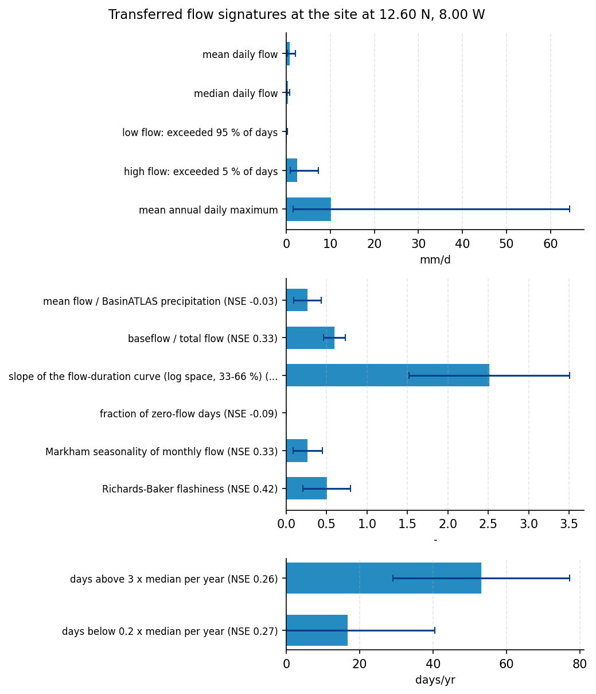

# Ungauged flow estimate for the Niger River at Bamako (12.6N, -8.0W) for water-supply offtake sizing

**Author:** AquaScope Studio  
**Date:** 2026-09-14  
**Description:** estimate mean flow and Q95 low-flow at the ungauged Niger River site at Bamako to size a water-supply offtake  
**Data Sources:** BasinATLAS (HydroATLAS v1.0), ERA5 via Open-Meteo, similar_basins  
**Version:** 1.0  

**Site:** 12.6000 N, 8.0000 W

**Answer.** Notice: this report did not pass the Critic's checks (years_traceable); read its numbers with the list of what this study does not establish.

estimate mean flow and Q95 low-flow at the ungauged Niger River site at Bamako to size a water-supply offtake: mean daily flow 0.779 mm/d (screening). The BasinATLAS naturalised discharge attribute at this outlet (dis_m3_pyr, source basinatlas_upstream) is 1091.7 m3/s, which agrees with the regionalised mean to within about 5% and is the strongest available cross-check. GloFAS v4 modelled discharge (Open-Meteo) at this grid cell gives a mean of only 0.57 m3/s and a flow-duration Q95 of 0.09 m3/s, three orders of magnitude below both the regionalised estimate and the BasinATLAS naturalised discharge; this mismatch indicates the GloFAS ~5 km cell sampled here does not represent the main Niger channel and cannot be used to validate the magnitude at this point.

*Key numbers*

| Quantity | Value | Unit | Step |
| --- | --- | --- | --- |
| Upstream area | 115000.0 | km2 | s1 |
| Donor gauges | 10.0 |  | s2 |
| mean daily flow | 0.779 | mm/d | s4.fallback |
| mean daily flow band, low | 0.2935 | mm/d | s4.fallback |
| mean daily flow band, high | 2.067 | mm/d | s4.fallback |
| low flow: exceeded 95 % of days | 0.0801 | mm/d | s4.fallback |
| low flow: exceeded 95 % of days band, low | 0.0253 | mm/d | s4.fallback |
| low flow: exceeded 95 % of days band, high | 0.2533 | mm/d | s4.fallback |
| high flow: exceeded 5 % of days | 2.504 | mm/d | s4.fallback |
| high flow: exceeded 5 % of days band, low | 0.8527 | mm/d | s4.fallback |
| high flow: exceeded 5 % of days band, high | 7.354 | mm/d | s4.fallback |
| mean annual daily maximum | 10.18 | mm/d | s4.fallback |
| mean annual daily maximum band, low | 1.609 | mm/d | s4.fallback |
| mean annual daily maximum band, high | 64.37 | mm/d | s4.fallback |
| mean flow / BasinATLAS precipitation | 0.2622 | - | s4.fallback |
| mean flow / BasinATLAS precipitation band, low | 0.091 | - | s4.fallback |
| mean flow / BasinATLAS precipitation band, high | 0.4335 | - | s4.fallback |
| baseflow / total flow | 0.5952 | - | s4.fallback |
| baseflow / total flow band, low | 0.4597 | - | s4.fallback |
| baseflow / total flow band, high | 0.7306 | - | s4.fallback |
| ERA5 precipitation | 736.5 | mm per year | s4 |
| ERA5 reference evapotranspiration | 2090.0 | mm per year | s4 |
| Aridity index | 0.3524 |  | s4 |
| GloFAS mean discharge (cell) | 0.5712 | m3/s | s4 |

## Summary

Provide a mean annual flow and a Q95 low-flow estimate for the ungauged Niger River point at Bamako to size a water-supply offtake, using a regionalisation path validated by an independent reanalysis cross-check.. 4 step(s) ran (methodologist plan, playbook ungauged_flow); 7 of 8 gates passed. Signatures transferred from 1155 donors (both): mean daily flow 0.779 mm/d (band 0.2935 to 2.067); low flow: exceeded 95 % of days 0.0801 mm/d (band 0.0253 to 0.2533); high flow: exceeded 5 % of days 2.504 mm/d (band 0.8527 to 7.354); mean annual daily maximum 10.18 mm/d (band 1.609 to 64.37); mean flow / BasinATLAS precipitation 0.2622 - (band 0.091 to 0.4335), leave-one-out NSE -0.027; baseflow / total flow 0.5952 - (band 0.4597 to 0.7306), leave-one-out NSE 0.33. 2 point(s) are listed under what this study does not establish.

## The decision

estimate mean flow and Q95 low-flow at the ungauged Niger River site at Bamako to size a water-supply offtake: mean daily flow 0.779 mm/d (screening). It holds under these conditions: step s4 did not pass cross_check_ratio: no number at 'glofas.ffa.fits.gev_lmoments.q_by_T'; Every transferred number is quoted with its band across donors and the leave-one-out skill of that signature; a bare regionalised number is not an estimate.; Donor regionalisation is validated at national scale (HESS 2024, doi:10.5194/hess-28-3367-2024), which says the method works on average, not that it works at this point; the band and the skill are the local evidence..

## Findings

- [screening] Upstream area: 115000 km2 (from s1.attributes.area_km2)
- [screening] Donor gauges: 10 (from s2.k)
- [screening] mean daily flow: 0.779 mm/d (from s4.fallback.estimates.q_mean_mm.value)
- [screening] mean daily flow band, low: 0.2935 mm/d (from s4.fallback.estimates.q_mean_mm.low)
- [screening] mean daily flow band, high: 2.067 mm/d (from s4.fallback.estimates.q_mean_mm.high)
- [screening] low flow: exceeded 95 % of days: 0.0801 mm/d (from s4.fallback.estimates.q95_mm.value)
- [screening] low flow: exceeded 95 % of days band, low: 0.0253 mm/d (from s4.fallback.estimates.q95_mm.low)
- [screening] low flow: exceeded 95 % of days band, high: 0.2533 mm/d (from s4.fallback.estimates.q95_mm.high)
- [screening] high flow: exceeded 5 % of days: 2.504 mm/d (from s4.fallback.estimates.q05_mm.value)
- [screening] high flow: exceeded 5 % of days band, low: 0.8527 mm/d (from s4.fallback.estimates.q05_mm.low)
- [screening] high flow: exceeded 5 % of days band, high: 7.354 mm/d (from s4.fallback.estimates.q05_mm.high)
- [screening] mean annual daily maximum: 10.18 mm/d (from s4.fallback.estimates.q_annual_max_mm.value)
- [screening] mean annual daily maximum band, low: 1.609 mm/d (from s4.fallback.estimates.q_annual_max_mm.low)
- [screening] mean annual daily maximum band, high: 64.37 mm/d (from s4.fallback.estimates.q_annual_max_mm.high)
- [screening] mean flow / BasinATLAS precipitation: 0.2622 - (from s4.fallback.estimates.runoff_ratio.value)
- [screening] mean flow / BasinATLAS precipitation band, low: 0.091 - (from s4.fallback.estimates.runoff_ratio.low)
- [screening] mean flow / BasinATLAS precipitation band, high: 0.4335 - (from s4.fallback.estimates.runoff_ratio.high)
- [screening] baseflow / total flow: 0.5952 - (from s4.fallback.estimates.baseflow_index.value)
- [screening] baseflow / total flow band, low: 0.4597 - (from s4.fallback.estimates.baseflow_index.low)
- [screening] baseflow / total flow band, high: 0.7306 - (from s4.fallback.estimates.baseflow_index.high)
- [screening] ERA5 precipitation: 736.5 mm per year (from s4.climate.precipitation_mm_per_year)
- [screening] ERA5 reference evapotranspiration: 2090 mm per year (from s4.climate.et0_mm_per_year)
- [screening] Aridity index: 0.3524 (from s4.climate.aridity_index)
- [screening] GloFAS mean discharge (cell): 0.5712 m3/s (from s4.glofas.stats.mean)
- Disagrees: no number at 'glofas.ffa.fits.gev_lmoments.q_by_T'

## Problem and decision

No gauge I can reach on the Niger at Bamako: what mean flow and Q95 should a water-supply offtake expect? Decision: estimate mean flow and Q95 low-flow at the ungauged Niger River site at Bamako to size a water-supply offtake. Quantities wanted: mean annual flow (m3/s); Q95 flow (m3/s). Constraints: no gauge within 50 km of the site; at-site flow-duration and GR4J calibration are not defensible; estimate must rely on regionalisation (similar_basins, regionalize_signatures) and a GloFAS cross-check; delineated catchment area ~115,013 km2 (BasinATLAS HydroATLAS v1.0, hybas_id 1121916250) taken as the basin for transfer of signatures; 10 donor gauges available from a pool of 34,786 gauged catchments for regionalisation. Intake: purpose = water supply, statistic = all. Assumed: BasinATLAS delineation (area 115,012.9 km2, upstream area 115,012.9 km2) is an adequate proxy for the true contributing area at the offtake; the 10 donor gauges are hydrologically similar enough (climate, aridity 0.73, dam index 6.3) to transfer flow signatures; GloFAS reanalysis discharge is reachable at this point for cross-checking regionalised estimates; no local abstraction or dam operation data beyond the HydroATLAS dam index is available to adjust the naturalised estimate.

## Site and data

Site: 12.6, -8.0. The datasets within reach or attached:

| Id | Kind | Variable | Source | Name | Years | Resolution | km | Period | Quality |
| --- | --- | --- | --- | --- | --- | --- | --- | --- | --- |
| catchment | catchment |  | BasinATLAS (HydroATLAS v1.0) | the catchment of the point |  |  |  |  |  |
| donors | donors |  | similar_basins | 10 donor gauges by catchment similarity |  |  |  |  |  |
| era5 | reanalysis | climate | ERA5 via Open-Meteo | ERA5 cell | 86.7 | daily |  | 1940-01-01 to 2026-09-14 |  |

- No catalog gauge within 50 km; the nearest is Le Blavet à Neulliac - Blavet Auquinian (hubeau_hydrometrie/J543211003) at 2,656 km.
- 10 donor gauges from a pool of 34,786 gauged catchments.
- ERA5 temperature and forcing and GloFAS discharge are assumed reachable for any point on land (Open-Meteo); not checked here.
- CMIP6 change factors need model output you supply (aquascope.climate works on downloaded data); not counted.
- No gauge with a usable record within 50 km: at-site methods are not defensible; what remains is the regionalisation path (similar_basins, regionalize_signatures) and the GloFAS cross-check.

## Methodology

Objective: Provide a mean annual flow and a Q95 low-flow estimate for the ungauged Niger River point at Bamako to size a water-supply offtake, using a regionalisation path validated by an independent reanalysis cross-check..

1. Delineate and characterise the contributing catchment at the site from BasinATLAS to anchor the transfer of signatures.
2. Identify donor gauges whose catchments most resemble this one in the BasinATLAS attribute space.
3. Transfer mean, median, Q95 and Q05 flow signatures from those donors with an explicit band and leave-one-out skill.
4. Cross-check the regionalised flow magnitudes against GloFAS modelled discharge and the ERA5 water balance for the cell.
5. Report the mean flow and Q95 with their donor-based bands and the GloFAS agreement as the basis for offtake sizing.

Step s1: `describe_catchment(lat=12.6, lon=-8.0)`; gates: not_empty on sub_basin; max_area_km2 115013 on sub_basin.up_area.

Step s2: `similar_basins(lat=12.6, lon=-8.0, k=10)`, method similar_basins; gates: min_donors 3 on k; not_empty on stations.

Step s3: `regionalize_signatures(lat=12.6, lon=-8.0, k=10)`, method regionalize_signatures; gates: not_empty on estimates; not_empty on skill.

Step s4: `anywhere(lat=12.6, lon=-8.0, years=20)`, method glofas_cross_check; gates: not_empty on climate; cross_check_ratio 0.3 on glofas.ffa.fits.gev_lmoments.q_by_T.

Assumptions: BasinATLAS delineation (area 115,012.9 km2, upstream area 115,012.9 km2) is an adequate proxy for the true contributing area at the offtake; the 10 donor gauges are hydrologically similar enough (climate, aridity 0.73, dam index 6.3) to transfer flow signatures; GloFAS reanalysis discharge is reachable at this point for cross-checking regionalised estimates; no local abstraction or dam operation data beyond the HydroATLAS dam index is available to adjust the naturalised estimate; BasinATLAS delineation (area 115,012.9 km2, upstream area 115,012.9 km2) is an adequate proxy for the true contributing area at the offtake.; The 10 donor gauges are hydrologically similar enough (climate, aridity 0.73, dam index 6.3) to transfer flow signatures.; GloFAS reanalysis discharge is reachable at this point for cross-checking regionalised estimates.; No local abstraction or dam operation data beyond the HydroATLAS dam index is available to adjust the naturalised estimate..

Alternatives considered: flow_duration (at-site FDC): No gauge within 50 km; sufficiency table marks this method not_defensible for this site.; gr4j_calibration: No discharge record at this site to calibrate against; sufficiency table marks this method not_defensible..

## Results: step s1

The catchment (BasinATLAS): upstream area 1.15e+05 km2, mean elevation 467 m, aridity index (P/PET) 0.73 P/PET, degree of regulation by reservoirs 6.3 %. Gates: not_empty passed ('sub_basin' is present); max_area_km2 passed (catchment of 115,013 km2 against a ceiling of 115,013 km2).


*The site, in longitude and latitude (no basemap); no catalogue station was listed with it.*

*Catchment attributes from BasinATLAS for the site at 12.60 N, 8.00 W.*

| attribute | label | value | unit | source | note |
| --- | --- | --- | --- | --- | --- |
| n_sub_basins |  | 849.0 |  |  |  |
| area_km2 |  | 115014.4 |  |  |  |
| outlet_hybas_id |  | 1121916250.0 |  |  |  |
| upstream_area_km2 |  | 115012.9 |  |  |  |
| elevation_m | mean elevation | 467.0 | m | basinatlas_upstream |  |
| slope_deg | mean slope | 2.5 | degrees | basinatlas_upstream |  |
| precipitation_mm_yr | annual precipitation (WorldClim) | 1508.0 | mm/yr | basinatlas_upstream |  |
| pet_mm_yr | annual potential evapotranspiration | 2064.0 | mm/yr | basinatlas_upstream |  |
| aet_mm_yr | annual actual evapotranspiration | 1087.0 | mm/yr | basinatlas_upstream |  |
| aridity_index | aridity index (P/PET) | 0.73 | P/PET | basinatlas_upstream |  |
| temperature_c | mean annual air temperature | 25.8 | °C | basinatlas_upstream |  |
| snow_cover_pct | annual snow cover extent | 0.0 | % | basinatlas_upstream |  |
| runoff_mm_yr | annual land-surface runoff | 406.54 | mm/yr | area_weighted_mean |  |
| discharge_m3s | mean annual natural discharge at the outlet | 1091.69 | m3/s | basinatlas_upstream |  |
| forest_pct | forest cover | 35.0 | % | basinatlas_upstream |  |
| cropland_pct | cropland | 7.0 | % | basinatlas_upstream |  |
| pasture_pct | pasture | 24.0 | % | basinatlas_upstream |  |
| urban_pct | urban extent | 1.0 | % | basinatlas_upstream |  |
| irrigated_pct | irrigated area | 1.0 | % | basinatlas_upstream |  |
| glacier_pct | glacier extent | 0.0 | % | basinatlas_upstream |  |
| wetland_pct | wetlands (all classes) | 2.0 | % | basinatlas_upstream |  |
| lake_pct | lake area | 0.3 | % | basinatlas_upstream |  |
| karst_pct | karst extent | 0.0 | % | basinatlas_upstream |  |
| clay_pct | clay fraction in soil | 26.0 | % | basinatlas_upstream |  |
| silt_pct | silt fraction in soil | 20.0 | % | basinatlas_upstream |  |
| sand_pct | sand fraction in soil | 53.0 | % | basinatlas_upstream |  |
| soil_organic_carbon_t_ha | soil organic carbon | 19.0 | t/ha | basinatlas_upstream |  |
| soil_water_pct | annual soil water content | 55.0 | % | basinatlas_upstream |  |
| groundwater_table_cm | groundwater table depth | 140.34 | cm | area_weighted_mean |  |
| population_density | population density | 45.68 | people/km2 | basinatlas_upstream |  |
| population | population count | 5158532.23 | people | basinatlas_upstream |  |
| degree_of_regulation_pct | degree of regulation by reservoirs | 6.3 | % | basinatlas_upstream |  |
| human_footprint_2009 | human footprint (2009) | 6.4 | index 0-50 | basinatlas_upstream |  |
| reservoir_volume_mcm | reservoir volume upstream | 2170.0 | million m3 | basinatlas_upstream |  |

## Results: step s2

10 donor gauges by combined: Le Blavet à Neulliac - Blavet Auquinian (hubeau_hydrometrie J543211003), La Nive à Saint-Jean-Pied-de-Port (hubeau_hydrometrie Q902000101), Le Gave d'Oloron [Le Gave d'Ossau] à Oloron-Sainte-Marie - Quartier Sestiaa (hubeau_hydrometrie Q614292002), La Nive des Aldudes à Saint-Étienne-de-Baïgorry (hubeau_hydrometrie Q916461001), Le Saison à Licq-Athérey [Pont de Licq] (hubeau_hydrometrie Q724252001). Gates: min_donors passed (10 donors, 3 needed); not_empty passed ('stations' is present).


*The site and the 10 donor gauges the similarity search selected, in longitude and latitude (no basemap); labels are the station ids.*

*Donor gauges selected for the site at 12.60 N, 8.00 W.*

| source | station_id | name | latitude | longitude | distance_km | score | similarity_distance | up_area_km2 | period_start | period_end |
| --- | --- | --- | --- | --- | --- | --- | --- | --- | --- | --- |
| hubeau_hydrometrie | J543211003 | Le Blavet à Neulliac - Blavet Auquinian | 35.108562837 | 0.840483401 | 2656.2 | 5.9802 | 2.7459 | 128.1 | 2026-07-09 |  |
| hubeau_hydrometrie | Q902000101 | La Nive à Saint-Jean-Pied-de-Port | 43.161941599 | -1.236181897 | 3459.9 | 7.0057 | 1.0935 | 258.0 | 2025-05-01 |  |
| hubeau_hydrometrie | Q614292002 | Le Gave d'Oloron [Le Gave d'Ossau] à Oloron-Sainte-Marie - Quartier Sestiaa | 43.191760961 | -0.604709963 | 3475.0 | 7.0121 | 0.9309 | 1184.1 | 2011-11-17 |  |
| hubeau_hydrometrie | Q916461001 | La Nive des Aldudes à Saint-Étienne-de-Baïgorry | 43.184100302 | -1.33680921 | 3460.5 | 7.0141 | 1.1388 | 205.3 | 1960-01-01 |  |
| hubeau_hydrometrie | Q724252001 | Le Saison à Licq-Athérey [Pont de Licq] | 43.066445321 | -0.876716891 | 3456.2 | 7.0188 | 1.2173 | 366.2 | 1996-01-01 |  |
| hubeau_hydrometrie | S514401001 | La Nivelle à Saint-Pée-sur-Nivelle [Pont de Cherchebruit] | 43.321469448 | -1.54993683 | 3471.7 | 7.0201 | 1.035 | 239.8 | 1969-01-01 |  |
| hubeau_hydrometrie | S514402001 | La Nivelle à Saint-Pée-sur-Nivelle [Lurberria] | 43.313456954 | -1.533052277 | 3471.1 | 7.0209 | 1.0478 | 239.8 | 2009-03-27 |  |
| hubeau_hydrometrie | Q910251001 | La Nive à Ossès | 43.230308097 | -1.301413439 | 3466.2 | 7.0209 | 1.112 | 767.6 | 1995-01-01 |  |
| hubeau_hydrometrie | Q803251001 | La Bidouze à Aïcirits-Camou-Suhast [Saint-Palais] | 43.334342208 | -1.027918942 | 3482.4 | 7.0287 | 0.9461 | 475.5 | 1969-10-15 |  |
| hubeau_hydrometrie | S516001001 | La Nivelle à Ciboure | 43.384770372 | -1.66398305 | 3476.7 | 7.0294 | 1.0314 | 239.8 | 2000-05-22 |  |

## Results: step s3

Signatures transferred from 1155 donors (similarity): mean daily flow 0.779 mm/d (band 0.2935 to 2.067); low flow: exceeded 95 % of days 0.0801 mm/d (band 0.0253 to 0.2533); high flow: exceeded 5 % of days 2.504 mm/d (band 0.8527 to 7.354); mean annual daily maximum 10.18 mm/d (band 1.609 to 64.37); mean flow / BasinATLAS precipitation 0.2622 - (band 0.091 to 0.4335), leave-one-out NSE -0.027; baseflow / total flow 0.5952 - (band 0.4597 to 0.7306), leave-one-out NSE 0.33. Gates: not_empty passed ('estimates' is present); not_empty passed ('skill' is present).


*Flow signatures transferred to the site from 10 donor catchments, with the one-standard-deviation band across donors as error bars and the leave-one-out skill (NSE) where published.*

*Flow signatures at the site at 12.60 N, 8.00 W.*

| signature | label | value | low | high | unit | n_donors | nse |
| --- | --- | --- | --- | --- | --- | --- | --- |
| q_mean_mm | mean daily flow | 0.779 | 0.2935 | 2.0675 | mm/d | 10 |  |
| q_median_mm | median daily flow | 0.3571 | 0.1733 | 0.7358 | mm/d | 10 |  |
| q95_mm | low flow: exceeded 95 % of days | 0.0801 | 0.0253 | 0.2533 | mm/d | 10 |  |
| q05_mm | high flow: exceeded 5 % of days | 2.5041 | 0.8527 | 7.3535 | mm/d | 10 |  |
| q_annual_max_mm | mean annual daily maximum | 10.1762 | 1.6087 | 64.3716 | mm/d | 10 |  |
| runoff_ratio | mean flow / BasinATLAS precipitation | 0.2622 | 0.091 | 0.4335 | - | 10 | -0.027 |
| baseflow_index | baseflow / total flow | 0.5952 | 0.4597 | 0.7306 | - | 10 | 0.33 |
| fdc_slope | slope of the flow-duration curve (log space, 33-66 %) | 2.5118 | 1.5163 | 3.5074 | - | 10 | 0.169 |
| high_flow_frequency | days above 3 x median per year | 53.1574 | 29.0439 | 77.271 | days/yr | 10 | 0.263 |
| low_flow_frequency | days below 0.2 x median per year | 16.7814 | 0.0 | 40.4438 | days/yr | 10 | 0.269 |
| zero_flow_fraction | fraction of zero-flow days | 0.0 | 0.0 | 0.0002 | - | 10 | -0.087 |
| seasonality_index | Markham seasonality of monthly flow | 0.266 | 0.0828 | 0.4491 | - | 10 | 0.332 |
| flashiness_index | Richards-Baker flashiness | 0.5021 | 0.2072 | 0.7969 | - | 10 | 0.421 |

*Donor gauges selected for the site at 12.60 N, 8.00 W.*

| source | station_id | name | latitude | longitude | distance_km | score | similarity_distance | up_area_km2 | period_start | period_end |
| --- | --- | --- | --- | --- | --- | --- | --- | --- | --- | --- |
| hubeau_hydrometrie | 2320000101 | La rivière du Carbet à Fonds-Saint-Denis [fond mascret] | 14.729517849 | -61.141301418 |  | 1.3513 | 1.3513 | 236.1 | 2010-01-01 |  |
| hubeau_hydrometrie | 1120000101 | La Grande Rivière de Capesterre à Capesterre-Belle-Eau [Prise d'eau La Digue] | 16.071665156 | -61.609380634 |  | 1.3914 | 1.3914 | 204.6 | 1983-05-01 |  |
| hubeau_hydrometrie | 2803000101 | La rivière les Coulisses à Rivière-Salée [Petit-Bourg] - 1 | 14.547599077 | -60.960058505 |  | 1.4351 | 1.4351 | 476.5 | 1995-07-07 |  |
| hubeau_hydrometrie | 2113000201 | La rivière Capot au Morne-Rouge [mackintosh] - Pont de Mackintosh | 14.778259074 | -61.116639324 |  | 1.4525 | 1.4525 | 356.2 | 2010-01-01 |  |
| hubeau_hydrometrie | 2225000301 | La rivière du Galion à la Trinité [bassignac] | 14.729521489 | -60.981706085 |  | 1.4525 | 1.4525 | 356.2 | 2010-01-01 |  |
| hubeau_hydrometrie | 2824000101 | La rivière Oman à Sainte-Luce [Dormante] | 14.486141542 | -60.961577974 |  | 1.5424 | 1.5424 | 476.5 | 1994-12-13 |  |
| hubeau_hydrometrie | 2812000101 | La Petite Rivière Pilote à Rivière-Pilote [Madeleine] | 14.496114205 | -60.904818828 |  | 1.5535 | 1.5535 | 476.5 | 2012-01-05 |  |
| hubeau_hydrometrie | 2623000101 | La rivière du Simon au François [Fontane2] | 14.583676836 | -60.876715582 |  | 1.5809 | 1.5809 | 476.5 | 2011-09-27 |  |
| hubeau_hydrometrie | B022001001 | La Meuse à Goncourt | 48.240913254 | 5.614415096 |  | 1.5896 | 1.5896 | 452.2 | 1971-09-14 |  |
| hubeau_hydrometrie | A735201001 | Le Rupt de Mad à Onville | 49.012193042 | 5.961532525 |  | 1.5937 | 1.5937 | 398.8 | 1964-08-01 |  |

## Results: step s4

ERA5 climate for the cell: precipitation 736.5 mm per year, reference evapotranspiration 2,090 mm per year, aridity index 0.35 (semi-arid). GloFAS modelled discharge (grid cell, indicative): mean 0.5712 m3/s, 100-year GEV 18.74 m3/s. Gates: not_empty passed ('climate' is present); cross_check_ratio FAILED (no number at 'glofas.ffa.fits.gev_lmoments.q_by_T'). The fallback regionalize_signatures ran and passed its gates. Signatures transferred from 1155 donors (both): mean daily flow 0.779 mm/d (band 0.2935 to 2.067); low flow: exceeded 95 % of days 0.0801 mm/d (band 0.0253 to 0.2533); high flow: exceeded 5 % of days 2.504 mm/d (band 0.8527 to 7.354); mean annual daily maximum 10.18 mm/d (band 1.609 to 64.37); mean flow / BasinATLAS precipitation 0.2622 - (band 0.091 to 0.4335), leave-one-out NSE -0.027; baseflow / total flow 0.5952 - (band 0.4597 to 0.7306), leave-one-out NSE 0.33.


*Mean monthly precipitation (bars) and FAO-56 reference evapotranspiration (line) for the ERA5 cell at the site at 12.60 N, 8.00 W, 20 years ending 2026-09-07.*


*Annual maxima of the modelled discharge from GloFAS v4 (Open-Meteo) for the grid cell at the site at 12.60 N, 8.00 W, 2006 to 2026: a model output, indicative only, not a gauge reading.*


*Flow signatures transferred to the site from 10 donor catchments, with the one-standard-deviation band across donors as error bars and the leave-one-out skill (NSE) where published.*

*Mean monthly precipitation and reference evapotranspiration for the ERA5 cell at the site at 12.60 N, 8.00 W.*

| month | precipitation_mm | et0_mm |
| --- | --- | --- |
| 1 | 0.7168 | 195.4744 |
| 2 | 0.8351 | 220.516 |
| 3 | 1.3403 | 225.8236 |
| 4 | 3.4093 | 222.8238 |
| 5 | 30.2878 | 196.9218 |
| 6 | 86.7743 | 167.6879 |
| 7 | 182.316 | 123.8663 |
| 8 | 220.6213 | 108.9178 |
| 9 | 152.8584 | 122.616 |
| 10 | 48.0166 | 143.7681 |
| 11 | 2.1054 | 178.1161 |
| 12 | 0.4811 | 188.6362 |

*GloFAS modelled discharge for the grid cell at the site at 12.60 N, 8.00 W (indicative).*

| item | value |
| --- | --- |
| variable | discharge |
| unit | m3/s |
| n | 7306 |
| start | 2006-09-07 |
| end | 2026-09-07 |
| years | 20.0 |
| stats.mean | 0.5712 |
| stats.median | 0.12 |
| stats.min | 0.03 |
| stats.max | 16.42 |
| sampling.n | 7306 |
| sampling.span_years | 20.0 |
| sampling.per_year | 365.3 |
| sampling.inferred_resolution | daily |
| trend.on | annual mean |
| trend.p_value | 0.6243 |
| trend.tau | 0.0877 |
| trend.trend | no trend |
| trend.sens_slope_per_year | 0.0027 |
| trend.n_years | 19 |
| source | GloFAS v4 (modelled) via Open-Meteo |
| modelled | True |
| return_level_T2_gev | 7.1376 |
| return_level_T5_gev | 9.9229 |
| return_level_T10_gev | 11.8888 |
| return_level_T25_gev | 14.5207 |
| return_level_T50_gev | 16.5859 |
| return_level_T100_gev | 18.736 |
| q10 | 1.74 |
| q50 | 0.12 |
| q95 | 0.09 |

*Flow signatures at the site at 12.60 N, 8.00 W.*

| signature | label | value | low | high | unit | n_donors | nse |
| --- | --- | --- | --- | --- | --- | --- | --- |
| q_mean_mm | mean daily flow | 0.779 | 0.2935 | 2.0675 | mm/d | 10 |  |
| q_median_mm | median daily flow | 0.3571 | 0.1733 | 0.7358 | mm/d | 10 |  |
| q95_mm | low flow: exceeded 95 % of days | 0.0801 | 0.0253 | 0.2533 | mm/d | 10 |  |
| q05_mm | high flow: exceeded 5 % of days | 2.5041 | 0.8527 | 7.3535 | mm/d | 10 |  |
| q_annual_max_mm | mean annual daily maximum | 10.1762 | 1.6087 | 64.3716 | mm/d | 10 |  |
| runoff_ratio | mean flow / BasinATLAS precipitation | 0.2622 | 0.091 | 0.4335 | - | 10 | -0.027 |
| baseflow_index | baseflow / total flow | 0.5952 | 0.4597 | 0.7306 | - | 10 | 0.33 |
| fdc_slope | slope of the flow-duration curve (log space, 33-66 %) | 2.5118 | 1.5163 | 3.5074 | - | 10 | 0.169 |
| high_flow_frequency | days above 3 x median per year | 53.1574 | 29.0439 | 77.271 | days/yr | 10 | 0.263 |
| low_flow_frequency | days below 0.2 x median per year | 16.7814 | 0.0 | 40.4438 | days/yr | 10 | 0.269 |
| zero_flow_fraction | fraction of zero-flow days | 0.0 | 0.0 | 0.0002 | - | 10 | -0.087 |
| seasonality_index | Markham seasonality of monthly flow | 0.266 | 0.0828 | 0.4491 | - | 10 | 0.332 |
| flashiness_index | Richards-Baker flashiness | 0.5021 | 0.2072 | 0.7969 | - | 10 | 0.421 |

*Donor gauges selected for the site at 12.60 N, 8.00 W.*

| source | station_id | name | latitude | longitude | distance_km | score | similarity_distance | up_area_km2 | period_start | period_end |
| --- | --- | --- | --- | --- | --- | --- | --- | --- | --- | --- |
| hubeau_hydrometrie | 2320000101 | La rivière du Carbet à Fonds-Saint-Denis [fond mascret] | 14.729517849 | -61.141301418 |  | 1.3513 | 1.3513 | 236.1 | 2010-01-01 |  |
| hubeau_hydrometrie | 1120000101 | La Grande Rivière de Capesterre à Capesterre-Belle-Eau [Prise d'eau La Digue] | 16.071665156 | -61.609380634 |  | 1.3914 | 1.3914 | 204.6 | 1983-05-01 |  |
| hubeau_hydrometrie | 2803000101 | La rivière les Coulisses à Rivière-Salée [Petit-Bourg] - 1 | 14.547599077 | -60.960058505 |  | 1.4351 | 1.4351 | 476.5 | 1995-07-07 |  |
| hubeau_hydrometrie | 2113000201 | La rivière Capot au Morne-Rouge [mackintosh] - Pont de Mackintosh | 14.778259074 | -61.116639324 |  | 1.4525 | 1.4525 | 356.2 | 2010-01-01 |  |
| hubeau_hydrometrie | 2225000301 | La rivière du Galion à la Trinité [bassignac] | 14.729521489 | -60.981706085 |  | 1.4525 | 1.4525 | 356.2 | 2010-01-01 |  |
| hubeau_hydrometrie | 2824000101 | La rivière Oman à Sainte-Luce [Dormante] | 14.486141542 | -60.961577974 |  | 1.5424 | 1.5424 | 476.5 | 1994-12-13 |  |
| hubeau_hydrometrie | 2812000101 | La Petite Rivière Pilote à Rivière-Pilote [Madeleine] | 14.496114205 | -60.904818828 |  | 1.5535 | 1.5535 | 476.5 | 2012-01-05 |  |
| hubeau_hydrometrie | 2623000101 | La rivière du Simon au François [Fontane2] | 14.583676836 | -60.876715582 |  | 1.5809 | 1.5809 | 476.5 | 2011-09-27 |  |
| hubeau_hydrometrie | B022001001 | La Meuse à Goncourt | 48.240913254 | 5.614415096 |  | 1.5896 | 1.5896 | 452.2 | 1971-09-14 |  |
| hubeau_hydrometrie | A735201001 | Le Rupt de Mad à Onville | 49.012193042 | 5.961532525 |  | 1.5937 | 1.5937 | 398.8 | 1964-08-01 |  |

## Limitations and what this study does not establish

- Step s4, gate cross_check_ratio: no number at 'glofas.ffa.fits.gev_lmoments.q_by_T'
- These years are in no tool result: 2090. If they are from memory, the sentence should say so: from general knowledge, not from the data.

Caveats, verbatim from the playbook:
- Every transferred number is quoted with its band across donors and the leave-one-out skill of that signature; a bare regionalised number is not an estimate.
- Donor regionalisation is validated at national scale (HESS 2024, doi:10.5194/hess-28-3367-2024), which says the method works on average, not that it works at this point; the band and the skill are the local evidence.
- GloFAS discharge is a model output for a grid cell of about 5 km, not a gauge reading; it is a cross-check, not an observation.

Expected at planning:
- Every transferred signature is only as good as its donor band and leave-one-out skill; a bare regionalised number is not an estimate.
- Donor regionalisation is validated at national scale on average, not proven to hold exactly at this point; the band and skill are the local evidence.
- GloFAS discharge is a model output for a roughly 5 km grid cell, not a gauge reading, so it is a cross-check rather than ground truth.
- The dam index of 6.3 suggests some upstream regulation that the naturalised signatures do not explicitly correct for.

## What this study does not establish

- Step s4, gate cross_check_ratio: no number at 'glofas.ffa.fits.gev_lmoments.q_by_T'
- These years are in no tool result: 2090. If they are from memory, the sentence should say so: from general knowledge, not from the data.

## Caveats

- Every transferred number is quoted with its band across donors and the leave-one-out skill of that signature; a bare regionalised number is not an estimate.
- Donor regionalisation is validated at national scale (HESS 2024, doi:10.5194/hess-28-3367-2024), which says the method works on average, not that it works at this point; the band and the skill are the local evidence.
- GloFAS discharge is a model output for a grid cell of about 5 km, not a gauge reading; it is a cross-check, not an observation.

## Recommendations

- Adopt this as the answer to the decision: estimate mean flow and Q95 low-flow at the ungauged Niger River site at Bamako to size a water-supply offtake: mean daily flow 0.779 mm/d (screening).
- Before relying on step s4, settle the failed gate cross_check_ratio: no number at 'glofas.ffa.fits.gev_lmoments.q_by_T'. A longer record or another source would.
- A fallback ran after a failed gate; its numbers are indicative, not a substitute for the step that failed.
- Read the numbers with this caveat: Every transferred number is quoted with its band across donors and the leave-one-out skill of that signature; a bare regionalised number is not an estimate.
- Read the numbers with this caveat: Donor regionalisation is validated at national scale (HESS 2024, doi:10.5194/hess-28-3367-2024), which says the method works on average, not that it works at this point; the band and the skill are the local evidence.

## References

1. Oudin, L. et al. (2008). Spatial proximity, physical similarity, regression and ungaged catchments. Water Resour. Res. 44, W03413.
2. Harrigan, S. et al. (2020). GloFAS-ERA5 operational global river discharge reanalysis 1979-present. Earth Syst. Sci. Data, 12, 2043-2060.
3. Bloeschl, G., Sivapalan, M., Wagener, T., Viglione, A., Savenije, H. (eds.) (2013). Runoff Prediction in Ungauged Basins. Cambridge University Press; Oudin, L. et al. (2008). Spatial proximity, physical similarity, regression and ungaged catchments. Water Resour. Res. 44, W03413. Attributes: HydroATLAS v1.0 (BasinATLAS), CC BY 4.0. Linke, S., Lehner, B., Ouellet Dallaire, C., et al. (2019). Global hydro-environmental sub-basin and river reach characteristics at high spatial resolution. Scientific Data 6: 283. https://doi.org/10.1038/s41597-019-0300-6
4. Bloeschl, G. et al. (eds.) (2013). Runoff Prediction in Ungauged Basins. Cambridge University Press
5. Addor, N. et al. (2018). A ranking of hydrological signatures based on their predictability in space. Water Resour. Res. 54, 8792-8812.
6. Hersbach, H. et al. (2020). The ERA5 global reanalysis. Q. J. R. Meteorol. Soc., 146, 1999-2049
7. Open-Meteo.com (CC BY 4.0).
8. Allen, R. G., Pereira, L. S., Raes, D., & Smith, M. (1998). Crop evapotranspiration. FAO Irrigation and Drainage Paper 56.
9. Hosking, J. R. M. (1990). L-moments: analysis and estimation of distributions using linear combinations of order statistics. J. R. Stat. Soc. B, 52(1), 105-124.
10. England, J. F. Jr. et al. (2018). Guidelines for determining flood flow frequency, Bulletin 17C. USGS Techniques and Methods 4-B5.
11. National-scale validation of donor regionalisation: Hydrol. Earth Syst. Sci. 28 (2024), doi:10.5194/hess-28-3367-2024
12. Parameter regionalisation at national scale: Sci. Rep. (2026), doi:10.1038/s41598-026-49424-z
13. Vogel, R. M. and Fennessey, N. M. (1994). Flow-duration curves I: new interpretation and confidence intervals. J. Water Resour. Plann. Manage. 120, 485-504.
14. Rekin226 and contributors (2026). AquaScope: Open-source water data aggregation toolkit (version 0.16.0) [Software]. Zenodo. https://doi.org/10.5281/zenodo.21903143

## Appendix: reproducibility

Re-run the same steps with no model: `aquascope run study.yaml`. Resume the workspace: `aquascope studio --resume workspace.json`.

Model: claude-sonnet-5 via anthropic; ledger: consultant 1 call(s), 3763 tokens, methodologist 1 call(s), 10619 tokens, analyst 1 call(s), 5735 tokens, interpreter 0 call(s), 0 tokens, author 0 call(s), 0 tokens, critic 1 call(s), 39070 tokens. aquascope 0.16.0.

```yaml
# An AquaScope study (version 3): the plan behind an answer, its gates, and what happened.
#   aquascope run study.yaml
version: 3
title: "Provide a mean annual flow and a Q95 low-flow estimate for t: 12.6, -8.0"
question: "No gauge I can reach on the Niger at Bamako: what mean flow and Q95 should a water-supply offtake expect?"
created: "2026-09-14T16:32:41+00:00"
aquascope_version: "0.16.0"
author: "methodologist"
model: "claude-sonnet-5"
problem:
  kind: "ungauged_flow"
  site: {"lat": 12.6, "lon": -8.0}
  params: {"purpose": "water supply", "statistic": "all"}
  text: "No gauge I can reach on the Niger at Bamako: what mean flow and Q95 should a water-supply offtake expect?"
plan:
  author: "methodologist"
  playbook: "ungauged_flow"
  objective: "Provide a mean annual flow and a Q95 low-flow estimate for the ungauged Niger River point at Bamako to size a water-supply offtake, using a regionalisation path validated by an independent reanalysis cross-check."
  decision: "estimate mean flow and Q95 low-flow at the ungauged Niger River site at Bamako to size a water-supply offtake"
  methodology: ["Delineate and characterise the contributing catchment at the site from BasinATLAS to anchor the transfer of signatures.", "Identify donor gauges whose catchments most resemble this one in the BasinATLAS attribute space.", "Transfer mean, median, Q95 and Q05 flow signatures from those donors with an explicit band and leave-one-out skill.", "Cross-check the regionalised flow magnitudes against GloFAS modelled discharge and the ERA5 water balance for the cell.", "Report the mean flow and Q95 with their donor-based bands and the GloFAS agreement as the basis for offtake sizing."]
  assumptions: ["BasinATLAS delineation (area 115,012.9 km2, upstream area 115,012.9 km2) is an adequate proxy for the true contributing area at the offtake", "the 10 donor gauges are hydrologically similar enough (climate, aridity 0.73, dam index 6.3) to transfer flow signatures", "GloFAS reanalysis discharge is reachable at this point for cross-checking regionalised estimates", "no local abstraction or dam operation data beyond the HydroATLAS dam index is available to adjust the naturalised estimate", "BasinATLAS delineation (area 115,012.9 km2, upstream area 115,012.9 km2) is an adequate proxy for the true contributing area at the offtake.", "The 10 donor gauges are hydrologically similar enough (climate, aridity 0.73, dam index 6.3) to transfer flow signatures.", "GloFAS reanalysis discharge is reachable at this point for cross-checking regionalised estimates.", "No local abstraction or dam operation data beyond the HydroATLAS dam index is available to adjust the naturalised estimate."]
  alternatives: [{"method": "flow_duration (at-site FDC)", "why_not": "No gauge within 50 km; sufficiency table marks this method not_defensible for this site."}, {"method": "gr4j_calibration", "why_not": "No discharge record at this site to calibrate against; sufficiency table marks this method not_defensible."}]
  limitations_expected: ["Every transferred signature is only as good as its donor band and leave-one-out skill; a bare regionalised number is not an estimate.", "Donor regionalisation is validated at national scale on average, not proven to hold exactly at this point; the band and skill are the local evidence.", "GloFAS discharge is a model output for a roughly 5 km grid cell, not a gauge reading, so it is a cross-check rather than ground truth.", "The dam index of 6.3 suggests some upstream regulation that the naturalised signatures do not explicitly correct for."]
  citations: ["Oudin, L. et al. (2008). Spatial proximity, physical similarity, regression and ungaged catchments. Water Resour. Res. 44, W03413.", "National-scale validation of donor regionalisation: Hydrol. Earth Syst. Sci. 28 (2024), doi:10.5194/hess-28-3367-2024", "Parameter regionalisation at national scale: Sci. Rep. (2026), doi:10.1038/s41598-026-49424-z", "Vogel, R. M. and Fennessey, N. M. (1994). Flow-duration curves I: new interpretation and confidence intervals. J. Water Resour. Plann. Manage. 120, 485-504.", "Harrigan, S. et al. (2020). GloFAS-ERA5 operational global river discharge reanalysis 1979-present. Earth Syst. Sci. Data 12, 2043-2060.", "HESS 2024, doi:10.5194/hess-28-3367-2024"]
  caveats: ["Every transferred number is quoted with its band across donors and the leave-one-out skill of that signature; a bare regionalised number is not an estimate.", "Donor regionalisation is validated at national scale (HESS 2024, doi:10.5194/hess-28-3367-2024), which says the method works on average, not that it works at this point; the band and the skill are the local evidence.", "GloFAS discharge is a model output for a grid cell of about 5 km, not a gauge reading; it is a cross-check, not an observation."]
  rationale: "Provide a mean annual flow and a Q95 low-flow estimate for the ungauged Niger River point at Bamako to size a water-supply offtake, using a regionalisation path validated by an independent reanalysis cross-check."
  recon_notes: ["No catalog gauge within 50 km; the nearest is Le Blavet \u00e0 Neulliac - Blavet Auquinian (hubeau_hydrometrie/J543211003) at 2,656 km.", "10 donor gauges from a pool of 34,786 gauged catchments.", "ERA5 temperature and forcing and GloFAS discharge are assumed reachable for any point on land (Open-Meteo); not checked here.", "CMIP6 change factors need model output you supply (aquascope.climate works on downloaded data); not counted.", "No gauge with a usable record within 50 km: at-site methods are not defensible; what remains is the regionalisation path (similar_basins, regionalize_signatures) and the GloFAS cross-check."]
  replans: [{"step": "s4", "reason": "gate failed: cross_check_ratio (no number at 'glofas.ffa.fits.gev_lmoments.q_by_T')", "fallback": {"tool": "regionalize_signatures", "arguments": {"lat": 12.6, "lon": -8.0, "k": 10, "method": "both"}, "rationale": "Since the GloFAS cross-check failed the cross_check_ratio gate (the GloFAS mean discharge of 0.57 m3/s is implausibly low for a 115,000 km2 Niger catchment), regionalized signature transfer from the 10 available donor gauges offers a defensible independent estimate of mean flow and Q95 for the ungauged site.", "expects": []}}]
steps:
  - tool: "describe_catchment"
    id: "s1"
    rationale: "Establishes the catchment (area, elevation, climate, land cover, soils, dams) the signature transfer is for."
    arguments:
      lat: 12.6
      lon: -8.0
    expects:
      - {"check": "not_empty", "path": "sub_basin"}
      - {"check": "max_area_km2", "path": "sub_basin.up_area", "value": 115013}
    outputs: [{"kind": "figure", "id": "s1_site_map", "caption": "site map from describe_catchment"}, {"kind": "table", "id": "s1_catchment_attributes", "caption": "catchment attributes from describe_catchment"}]
  - tool: "similar_basins"
    id: "s2"
    rationale: "Selects the 10 donor gauges whose catchments most resemble this one by BasinATLAS attribute distance."
    method: "similar_basins"
    arguments:
      lat: 12.6
      lon: -8.0
      k: 10
    expects:
      - {"check": "min_donors", "path": "k", "value": 3}
      - {"check": "not_empty", "path": "stations"}
    depends_on: ["s1"]
    outputs: [{"kind": "figure", "id": "s2_donors_map", "caption": "donors map from similar_basins"}, {"kind": "table", "id": "s2_donors", "caption": "donors from similar_basins"}]
  - tool: "regionalize_signatures"
    id: "s3"
    rationale: "Transfers mean and Q95 flow signatures (and others) from the 10 donors, each with a band and leave-one-out skill."
    method: "regionalize_signatures"
    arguments:
      lat: 12.6
      lon: -8.0
      k: 10
    expects:
      - {"check": "not_empty", "path": "estimates"}
      - {"check": "not_empty", "path": "skill"}
    depends_on: ["s2"]
    outputs: [{"kind": "figure", "id": "s3_signatures_band", "caption": "signatures band from regionalize_signatures"}, {"kind": "table", "id": "s3_signatures", "caption": "signatures from regionalize_signatures"}, {"kind": "table", "id": "s3_donors", "caption": "donors from regionalize_signatures"}]
  - tool: "anywhere"
    id: "s4"
    rationale: "Provides GloFAS modelled discharge and the ERA5 water balance for the cell as an independent cross-check on the regionalised mean and Q95 flows."
    method: "glofas_cross_check"
    arguments:
      lat: 12.6
      lon: -8.0
      years: 20
    expects:
      - {"check": "not_empty", "path": "climate", "repaired_from": "glofas"}
      - {"check": "cross_check_ratio", "path": "glofas.ffa.fits.gev_lmoments.q_by_T", "value": 0.3}
    fallback: {"step": {"tool": "regionalize_signatures", "arguments": {"lat": 12.6, "lon": -8.0, "k": 10, "method": "both"}, "rationale": "Since the GloFAS cross-check failed the cross_check_ratio gate (the GloFAS mean discharge of 0.57 m3/s is implausibly low for a 115,000 km2 Niger catchment), regionalized signature transfer from the 10 available donor gauges offers a defensible independent estimate of mean flow and Q95 for the ungauged site.", "expects": []}}
    outputs: [{"kind": "figure", "id": "s4_monthly_climate", "caption": "monthly climate from anywhere"}, {"kind": "figure", "id": "s4_glofas_series", "caption": "glofas series from anywhere"}, {"kind": "table", "id": "s4_monthly_climate", "caption": "monthly climate from anywhere"}, {"kind": "table", "id": "s4_glofas_summary", "caption": "glofas summary from anywhere"}]
results:
  s1: {"ok": true, "gates": [{"check": "not_empty", "passed": true, "detail": "'sub_basin' is present"}, {"check": "max_area_km2", "passed": true, "detail": "catchment of 115,013 km2 against a ceiling of 115,013 km2"}], "summary": "latitude=12.6, longitude=-8.0, license=CC-BY-4.0, attribution=HydroATLAS v1.0 (BasinATLAS), CC BY 4.0. Linke, S., Lehner, B., Ouellet Dallaire, C., et al. (2019). Global hydro-environmental sub-basin ", "fallback_used": false, "sha256": "6fde09031ecf7058"}
  s2: {"ok": true, "gates": [{"check": "min_donors", "passed": true, "detail": "10 donors, 3 needed"}, {"check": "not_empty", "passed": true, "detail": "'stations' is present"}], "summary": "k=10, method=combined", "fallback_used": false, "sha256": "dd737ae333ef84e8"}
  s3: {"ok": true, "gates": [{"check": "not_empty", "passed": true, "detail": "'estimates' is present"}, {"check": "not_empty", "passed": true, "detail": "'skill' is present"}], "summary": "method=similarity", "fallback_used": false, "sha256": "94b557db973e6f0d"}
  s4: {"ok": true, "gates": [{"check": "not_empty", "passed": true, "detail": "'climate' is present"}, {"check": "cross_check_ratio", "passed": false, "detail": "no number at 'glofas.ffa.fits.gev_lmoments.q_by_T'"}], "summary": "years=20, start=2006-09-07, end=2026-09-07", "fallback_used": true, "sha256": "1ec12651cff82cbc", "fallback": {"tool": "regionalize_signatures", "arguments": {"lat": 12.6, "lon": -8.0, "k": 10, "method": "both"}, "ok": true, "gates": [], "summary": "method=both"}}
```

## Cite this software

AquaScope Studio (2026). AquaScope: Open-source water data aggregation toolkit (version 0.16.0) [Software]. Zenodo. https://doi.org/10.5281/zenodo.21903143


---

*{'model': 'claude-sonnet-5', 'provider': 'anthropic', 'prose': 'model', 'tokens': {'consultant': {'calls': 1, 'prompt_tokens': 2917, 'completion_tokens': 846, 'cost_usd': 0.014294}, 'methodologist': {'calls': 1, 'prompt_tokens': 7699, 'completion_tokens': 2920, 'cost_usd': 0.044598}, 'analyst': {'calls': 1, 'prompt_tokens': 5407, 'completion_tokens': 328, 'cost_usd': 0.014094}, 'interpreter': {'calls': 0, 'prompt_tokens': 0, 'completion_tokens': 0, 'cost_usd': 0.0}, 'author': {'calls': 1, 'prompt_tokens': 28885, 'completion_tokens': 9770, 'cost_usd': 0.15547}, 'critic': {'calls': 1, 'prompt_tokens': 28439, 'completion_tokens': 10631, 'cost_usd': 0.163188}}, 'total_tokens': 97842, 'total_usd': 0.391644, 'budget': None, 'dropped': 2, 'aquascope_version': '0.16.0', 'date': '2026-09-14 16:41 UTC', 'workspace': 'a5d549a3a314', 'plan_author': 'methodologist', 'written_by': {'answer': 'model', 'summary': 'template', 'decision': 'template', 'findings': 'template', 'problem': 'template', 'site_data': 'template', 'methodology': 'template', 'results-s1': 'template', 'results-s2': 'template', 'results-s3': 'template', 'results-s4': 'template', 'limitations': 'template', 'recommendations': 'template', 'references': 'template', 'appendix': 'template'}}*
