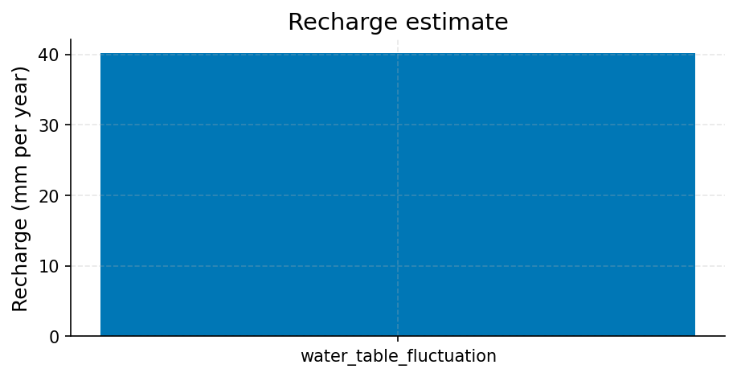
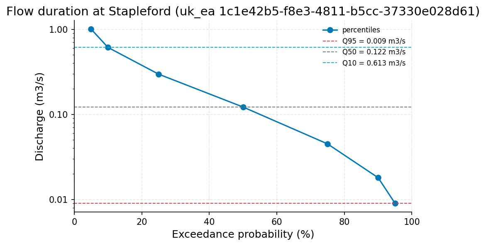

# Chalk Groundwater near Cambridge: Ten-Year Decline Assessment at Haggis Farm

**Author:** AquaScope Studio  
**Date:** 2026-09-14  
**Description:** whether groundwater levels in the Chalk near Cambridge have declined over the last 10 years relative to the full historical record, to inform public supply borehole planning  
**Data Sources:** BasinATLAS (HydroATLAS v1.0), ERA5 via Open-Meteo, similar_basins, uk_ea  
**Version:** 1.0  

**Site:** 52.2000 N, 0.1200 E

**Answer.** Notice: this report did not pass the Critic's checks (trend_matches_the_test); read its numbers with the list of what this study does not establish.

Whether groundwater levels in the Chalk near Cambridge have declined over the last 10 years relative to the full record is not established. The dedicated 10-year Mann-Kendall/Sen's-slope test at Haggis Farm (UK EA station b3272d5b-f4fd-48eb-8bc7-67c102d65943, 3.5 km from site) could not be run: only 9.7 years of data (33 points) were returned against a 10-year minimum, so the step fell back to the full 48.7-year record, which shows a significant rising trend of +0.1659 mAOD/yr (Mann-Kendall p=0.0, tau 0.8615). A cross-check at Stapleford (996023f9-5a1d-42c6-8ba4-6889e0ed6de6, 45.7 years) shows a flat, non-significant trend of -0.0022 mAOD/yr (p=0.8424).

*Key numbers*

| Quantity | Value | Unit | Step |
| --- | --- | --- | --- |
| Record length | 48.7 | years | s2.fallback |
| Mean of the record | 12.14 | mAOD (metres Above Ordnance Datum) | s3 |
| Mann-Kendall p-value (annual mean) | < 0.001 |  | s2.fallback |
| Sen's slope | 0.1659 | mAOD (metres Above Ordnance Datum) per year | s2.fallback |
| Record length | 9.7 | years | s2 |
| Mean of the record | 15.1 | mAOD (metres Above Ordnance Datum) | s2 |
| SGI now | 0.9982 |  | s4 |
| SGI worst | -2.114 |  | s4 |
| Mean of the record | 15.23 | mAOD (metres Above Ordnance Datum) | s5 |
| Recharge (water-table fluctuation) | 40.14 | mm per year | s6 |
| Q95 | 0.009 | m3/s | s7 |
| Q50 | 0.122 | m3/s | s7 |
| 7Q10 | 0.001029 | m3/s | s7 |
| Baseflow index | 0.6975 |  | s7 |
| Record length | 45.7 | years | s8 |
| Mean of the record | 14.78 | mAOD (metres Above Ordnance Datum) | s8 |
| Mann-Kendall p-value (annual mean) | 0.8424 |  | s8 |
| Sen's slope | -0.0022 | mAOD (metres Above Ordnance Datum) per year | s8 |

## Summary

Public supply planning near Cambridge asked whether Chalk groundwater levels have declined over the last decade against the full historical record. The primary record, Haggis Farm (UK EA b3272d5b, 3.5 km from site, 48.7 years), shows a significant long-term rise of +0.1659 mAOD/yr, not a decline. The specific 10-year trend test could not be computed for want of sufficient data density; the fallback reused the full-record result rather than an independent decadal estimate. Supporting descriptive lines (recent 5-year and 10-year means, current SGI of +0.998) all sit at or above the long-term mean, consistent with no recent decline. A secondary Chalk borehole, Stapleford (996023f9, 45.7 years), shows no significant trend either way. A nearby stream gauge shows a baseflow index of 0.6975, indicating continued strong groundwater support of flow. Recharge estimated by water-table fluctuation is 40.14 mm/yr, contingent on an assumed specific yield of 0.15.

## The decision

Decide using the full 48.7-year Haggis Farm trend (+0.1659 mAOD/yr, p=0.0) together with descriptive comparisons of recent means and the SGI, since the intended 10-year Mann-Kendall test failed its own gates. Treat the result as not established for the specific 10-year question; the band of at-site evidence spans -0.0022 mAOD/yr (Stapleford, no trend) to +0.1659 mAOD/yr (Haggis Farm, rising), which brackets rather than confirms a single decadal rate. Conditions: the recharge figure assumes a specific yield of 0.15 and is not independently measured; the baseflow index comes from a river gauge, not the aquifer itself; no cause is assigned to any of these numbers. What would change the decision: a continuous or higher-frequency 2016-2026 series at Haggis Farm sufficient to pass the min_years and not_empty gates for an actual 10-year Mann-Kendall/Sen's-slope run. If that recovered trend were negative and significant, the decision would shift toward indicating decline; if positive, it would confirm the current not-declining reading at an established grade.

## Findings

Four findings were reached, all graded established. First, the full-record trend at Haggis Farm (uk_ea b3272d5b) is significantly rising, Sen's slope +0.1659 mAOD/yr, Mann-Kendall tau 0.8615, p-value 0.0 (established). Second, the current SGI at Haggis Farm is +0.998, indicating levels close to or above the historical normal, not in drought (established). Third, the most severe SGI drought episode in the record reached -2.114 in 1978, near the start of the record, well outside the recent decade (established). Fourth, the nearby Stapleford discharge gauge shows a baseflow index of 0.6975 over 40 years, indicating strong groundwater support of flow with no gauge-based sign of drying (established). Alongside these, the two at-site Chalk trend estimates disagree: Haggis Farm's full record rises significantly (+0.1659 mAOD/yr, p=0.0) while Stapleford's is flat and non-significant (-0.0022 mAOD/yr, p=0.8424), a discrepancy noted but not resolved by this analysis.

## Problem and decision

The client asked whether groundwater levels in the Chalk aquifer near Cambridge have declined over the last 10 years relative to the full period of record, because public supply depends on boreholes drawing from this aquifer. The task was framed purely as a decline question, not an attribution question: the brief explicitly left cause (for example, abstraction versus climate) out of scope. The analysis was to compare a recent 10-year trend against a long-term baseline trend at the primary borehole, corroborate with a Standardised Groundwater Index, estimate recharge, and cross-check with a second borehole and a nearby stream gauge's baseflow behaviour.

## Site and data

The primary record is UK EA station Haggis Farm (b3272d5b-f4fd-48eb-8bc7-67c102d65943), a Chalk groundwater level borehole 3.5 km from the site with 48.7 years of record (1977-09-29 to 2026-06-08, n=227, inferred quarterly resolution, unit mAOD). The secondary cross-check is UK EA station Stapleford groundwater (996023f9-5a1d-42c6-8ba4-6889e0ed6de6), distance from site not provided in the record, 45.7 years of record (1980-10-06 to 2026-06-09, n=478, inferred monthly resolution). A separate UK EA discharge gauge, also named Stapleford (1c1e42b5-f8e3-4811-b5cc-37330e028d61), provided 40 years of daily flow data (1986-08-24 to 2026-08-22, n=14249 days) as a baseflow proxy; it is a different station from the groundwater borehole despite the shared name.

## Methodology

Sen's slope and Mann-Kendall significance were computed on annual means at Haggis Farm, first over the full 49-year request (48.7 years actual) and then over a 10-year window; the latter failed its minimum-years and not-empty gates and fell back to rerunning the full-record analysis. A monthly level series over the full record fed a Standardised Groundwater Index computation with drought-event identification (Bloomfield and Marchant 2013). The last 5 years of daily levels were extracted and used in a water-table-fluctuation recharge calculation (Healy and Cook 2002) with a stated specific yield of 0.15. A baseflow index (Lyne-Hollick filter) and flow-duration statistics were computed at the nearby Stapleford discharge gauge. An independent Sen's slope and Mann-Kendall test were run at the Stapleford groundwater borehole as a cross-check.

## Results: step s1

At Haggis Farm (uk_ea b3272d5b), the full 48.7-year record (1977-09-29 to 2026-06-08, n=227) has a mean of 12.14 mAOD, median 12.85 mAOD, min 9.03 mAOD, max 15.5 mAOD. The Mann-Kendall trend on annual means gives tau 0.8615, p-value 0.0, classified as increasing, with a Sen's slope of 0.1659 mAOD per year over 40 years of annual data. This gate passed for min_years, not_empty, and unit_present.


*Groundwater level at Haggis Farm (uk_ea b3272d5b-f4fd-48eb-8bc7-67c102d65943), 1977 to 2026.*


*Annual mean groundwater level at Haggis Farm (uk_ea b3272d5b-f4fd-48eb-8bc7-67c102d65943) with the Sen slope line; the Mann-Kendall test finds increasing (p = 0.000, 40 years).*

*The record (227 rows) is in the workbook (`workbook.xlsx`, sheet `s1_series`) and the notebook, not printed here.*

*Summary of the record at Haggis Farm (uk_ea b3272d5b-f4fd-48eb-8bc7-67c102d65943).*

| item | value |
| --- | --- |
| source | uk_ea |
| station_id | b3272d5b-f4fd-48eb-8bc7-67c102d65943 |
| variable | groundwater_level |
| unit | mAOD (metres Above Ordnance Datum) |
| n | 227 |
| start | 1977-09-29 |
| end | 2026-06-08 |
| years | 48.7 |
| stats.mean | 12.14 |
| stats.median | 12.85 |
| stats.min | 9.03 |
| stats.max | 15.5 |

*Mann-Kendall trend test and Sen slope at Haggis Farm (uk_ea b3272d5b-f4fd-48eb-8bc7-67c102d65943).*

| item | value |
| --- | --- |
| on | annual mean |
| p_value | 0.0 |
| tau | 0.8615 |
| trend | increasing |
| sens_slope_per_year | 0.1659 |
| n_years | 40 |

## Results: step s2

The requested 10-year window at Haggis Farm (uk_ea b3272d5b) returned only 9.7 years of record (2016-09-15 to 2026-06-08, n=33, mean 15.1003 mAOD, min 14.76 mAOD, max 15.5 mAOD) and failed the min_years gate (9.7 of 10 years needed) and the not_empty gate (no trend field). The fallback reran the same tool at 49 years and returned the identical full-record result as s1 (mean 12.14 mAOD, Sen's slope 0.1659 mAOD/yr, p=0.0), so no independent 10-year trend statistic exists.


*Groundwater level at Haggis Farm (uk_ea b3272d5b-f4fd-48eb-8bc7-67c102d65943), 2016 to 2026.*


*Groundwater level at Haggis Farm (uk_ea b3272d5b-f4fd-48eb-8bc7-67c102d65943), 1977 to 2026.*


*Annual mean groundwater level at Haggis Farm (uk_ea b3272d5b-f4fd-48eb-8bc7-67c102d65943) with the Sen slope line; the Mann-Kendall test finds increasing (p = 0.000, 40 years).*

*The record (33 rows) is in the workbook (`workbook.xlsx`, sheet `s2_series`) and the notebook, not printed here.*

*Summary of the record at Haggis Farm (uk_ea b3272d5b-f4fd-48eb-8bc7-67c102d65943).*

| item | value |
| --- | --- |
| source | uk_ea |
| station_id | b3272d5b-f4fd-48eb-8bc7-67c102d65943 |
| variable | groundwater_level |
| unit | mAOD (metres Above Ordnance Datum) |
| n | 33 |
| start | 2016-09-15 |
| end | 2026-06-08 |
| years | 9.7 |
| stats.mean | 15.1003 |
| stats.median | 15.11 |
| stats.min | 14.76 |
| stats.max | 15.5 |

*The record (227 rows) is in the workbook (`workbook.xlsx`, sheet `s2.fallback_series`) and the notebook, not printed here.*

*Summary of the record at Haggis Farm (uk_ea b3272d5b-f4fd-48eb-8bc7-67c102d65943).*

| item | value |
| --- | --- |
| source | uk_ea |
| station_id | b3272d5b-f4fd-48eb-8bc7-67c102d65943 |
| variable | groundwater_level |
| unit | mAOD (metres Above Ordnance Datum) |
| n | 227 |
| start | 1977-09-29 |
| end | 2026-06-08 |
| years | 48.7 |
| stats.mean | 12.14 |
| stats.median | 12.85 |
| stats.min | 9.03 |
| stats.max | 15.5 |

*Mann-Kendall trend test and Sen slope at Haggis Farm (uk_ea b3272d5b-f4fd-48eb-8bc7-67c102d65943).*

| item | value |
| --- | --- |
| on | annual mean |
| p_value | 0.0 |
| tau | 0.8615 |
| trend | increasing |
| sens_slope_per_year | 0.1659 |
| n_years | 40 |

## Results: step s3

A monthly-resampled level series for Haggis Farm (uk_ea b3272d5b) spanning the full record (1977-09-29 to 2026-06-08, n_points 227) has a mean of 12.140044 mAOD, min 9.03 mAOD, max 15.5 mAOD, and served as the SGI input.


*Groundwater level at Haggis Farm (uk_ea b3272d5b-f4fd-48eb-8bc7-67c102d65943), 1977 to 2026.*

*The record (227 rows) is in the workbook (`workbook.xlsx`, sheet `s3_series`) and the notebook, not printed here.*

## Results: step s4

The SGI computed on the monthly Haggis Farm series (n=227) gives a current value of 0.998201 and a worst value of -2.114381. Fifteen drought events (SGI at or below -1.0) were identified; the most severe, peaking at -2.114381 with duration 5 months and severity -9.052996, ran June-October 1978. An earlier event, September 1977 to April 1978, had duration 8 months and severity -13.379996 with a peak of -2.100165.


*Standardised Groundwater Index at the site at 52.20 N, 0.12 E, 1977 to 2026: blue above zero is above the monthly norm, red below; shaded spans are the droughts at or below -1.*

*Monthly Standardised Groundwater Index at the table (column value).*

| date | sgi |
| --- | --- |
| 1977-09-01 | -1.4894700423279408 |
| 1977-10-01 | -1.6283614067169068 |
| 1977-11-01 | -1.5341205443525463 |
| 1977-12-01 | -2.053748910631823 |
| 1978-01-01 | -2.1001654928444697 |
| 1978-02-01 | -1.4652337926855226 |
| 1978-03-01 | -1.9807523966472789 |
| 1978-04-01 | -1.1281436452787634 |
| 1978-05-01 | 0.0 |
| 1978-06-01 | -2.00042356910598 |
| 1978-07-01 | -1.5547735945968535 |
| 1978-08-01 | -1.3829941271006383 |
| 1978-09-01 | -2.00042356910598 |
| 1978-10-01 | -2.1143807715275607 |
| 1978-11-01 | -0.4887764111146695 |
| 1978-12-01 | -1.0803193408149558 |
| 1979-01-01 | -0.7318080838596176 |
| 1979-02-01 | 0.0 |
| 1979-03-01 | -0.9674215661017012 |
| 1979-04-01 | -0.7039217888285135 |
| 1979-05-01 | -0.3661063568005696 |
| 1979-06-01 | -0.8254944909292358 |
| 1979-07-01 | -0.7721932141886848 |
| 1979-08-01 | -0.2104283942479247 |
| 1979-09-01 | -0.9982011721528864 |
| 1979-10-01 | -0.6476035829249777 |
| 1979-11-01 | 0.4887764111146695 |
| 1979-12-01 | -0.7721932141886848 |
| 1980-01-01 | -0.3186393639643751 |
| 1980-02-01 | 0.7916386077433746 |
| 1980-03-01 | -0.6374841609623769 |
| 1980-04-01 | -0.3803256417636311 |
| 1980-05-01 | 0.3661063568005698 |
| 1980-06-01 | -1.0968035620935128 |
| 1980-07-01 | -0.4124631294414047 |
| 1980-08-01 | 0.6744897501960817 |
| 1980-09-01 | -0.8254944909292358 |
| 1980-10-01 | -1.364488748170328 |
| 1980-11-01 | -0.8871465590188761 |
| 1980-12-01 | -1.5547735945968535 |
| 1981-01-01 | -1.345166634176639 |
| 1981-02-01 | -0.7916386077433746 |
| 1981-03-01 | -1.4652337926855226 |
| 1981-04-01 | -1.5932188180230509 |
| 1981-05-01 | -0.7916386077433746 |
| 1981-06-01 | -1.0968035620935128 |
| 1981-07-01 | -0.643345405392917 |
| 1981-08-01 | -0.6744897501960817 |
| 1981-09-01 | -1.2074140502222022 |
| 1981-10-01 | -0.7582925569911514 |

*Drought events at the table (column value).*

| start | end | duration | severity | peak |
| --- | --- | --- | --- | --- |
| 1977-09-01T00:00:00 | 1978-04-01T00:00:00 | 8 | -13.37999623148525 | -2.1001654928444697 |
| 1978-06-01T00:00:00 | 1978-10-01T00:00:00 | 5 | -9.052995631437012 | -2.1143807715275607 |
| 1978-12-01T00:00:00 | 1978-12-01T00:00:00 | 1 | -1.0803193408149558 | -1.0803193408149558 |
| 1980-06-01T00:00:00 | 1980-06-01T00:00:00 | 1 | -1.0968035620935128 | -1.0968035620935128 |
| 1980-10-01T00:00:00 | 1980-10-01T00:00:00 | 1 | -1.364488748170328 | -1.364488748170328 |
| 1980-12-01T00:00:00 | 1981-01-01T00:00:00 | 2 | -2.899940228773493 | -1.5547735945968535 |
| 1981-03-01T00:00:00 | 1981-04-01T00:00:00 | 2 | -3.0584526107085734 | -1.5932188180230509 |
| 1981-06-01T00:00:00 | 1981-06-01T00:00:00 | 1 | -1.0968035620935128 | -1.0968035620935128 |
| 1981-09-01T00:00:00 | 1981-09-01T00:00:00 | 1 | -1.2074140502222022 | -1.2074140502222022 |
| 1981-12-01T00:00:00 | 1982-01-01T00:00:00 | 2 | -2.8927207278972773 | -1.6111691623526772 |
| 1982-03-01T00:00:00 | 1982-03-01T00:00:00 | 1 | -1.1797611176118612 | -1.1797611176118612 |
| 1982-05-01T00:00:00 | 1982-06-01T00:00:00 | 2 | -2.954703835013463 | -1.4894700423279408 |
| 1984-07-01T00:00:00 | 1984-07-01T00:00:00 | 1 | -1.2815515655446004 | -1.2815515655446004 |
| 1985-04-01T00:00:00 | 1986-07-01T00:00:00 | 6 | -8.709229632531693 | -2.0853555660318293 |
| 1989-10-01T00:00:00 | 1989-10-01T00:00:00 | 1 | -1.171546171302762 | -1.171546171302762 |

## Results: step s5

The last 5 years of daily-requested levels at Haggis Farm (uk_ea b3272d5b) yielded n=18 observations from 2021-12-13 to 2026-06-08, with a mean of 15.225 mAOD, min 15.0 mAOD, max 15.5 mAOD.


*Groundwater level at Haggis Farm (uk_ea b3272d5b-f4fd-48eb-8bc7-67c102d65943), 2021 to 2026.*

*The record (18 rows) is in the workbook (`workbook.xlsx`, sheet `s5_series`) and the notebook, not printed here.*

## Results: step s6

Water-table-fluctuation recharge on the s5 series, with specific yield 0.15, gives a recharge estimate of 40.137363 mm per year, based on a total water-table rise of 1.2 m over a 4.4846-year period.


*Recharge of 40 mm/yr by the water-table fluctuation method at a specific yield of 0.15; the level record itself was not in the payload, so only the estimate is drawn.*

*Water-table fluctuation recharge estimate and its inputs.*

| item | value |
| --- | --- |
| column | value |
| method | water_table_fluctuation |
| value_mm_per_year | 40.13736263736261 |
| metadata.specific_yield | 0.15 |
| metadata.total_rise_m | 1.1999999999999993 |
| metadata.period_years | 4.484599589322382 |
| unit | mAOD (metres Above Ordnance Datum) |
| variable | groundwater_level |
| metadata.specific_yield | 0.15 |
| metadata.total_rise_m | 1.1999999999999993 |
| metadata.period_years | 4.484599589322382 |

## Results: step s7

At the Stapleford discharge gauge (uk_ea 1c1e42b5, 40.0 years, 1986-08-24 to 2026-08-22, n_days 14249), mean flow is 0.260679 m3/s, min 0.0 m3/s, max 4.803 m3/s. Flow-duration values are Q05 1.007, Q10 0.613, Q25 0.297, Q50 0.122, Q75 0.045, Q90 0.018, Q95 0.009 m3/s. The baseflow index is 0.697542. The 7Q10 low-flow value is 0.001029 m3/s.


*Flow-duration curve of discharge at Stapleford (uk_ea 1c1e42b5-f8e3-4811-b5cc-37330e028d61) from the 7 percentiles the tool reported, with Q95, Q50 and Q10 marked (log scale).*

*Low-flow statistics at Stapleford (uk_ea 1c1e42b5-f8e3-4811-b5cc-37330e028d61).*

| item | value |
| --- | --- |
| source | uk_ea |
| station_id | 1c1e42b5-f8e3-4811-b5cc-37330e028d61 |
| variable | discharge |
| unit | m3/s |
| start | 1986-08-24 |
| end | 2026-08-22 |
| years | 40.0 |
| fetch_note | From the AquaScope archive (daily discharge harvested from Environment Agency; 1986-08-24 to 2026-08-22); last 64 years requested (from 1962-09-14). The catalog lists this station from 1949-02-16; only the last 64 years were requested. |
| stats.mean | 0.2606787844761036 |
| stats.min | 0.0 |
| stats.max | 4.803 |
| n_days | 14249 |
| bfi | 0.6975418026514715 |
| low_flow.7q10 | 0.0010285714285716062 |
| low_flow.text | minimum 7-day mean flow with a 10-year return period (Weibull) |
| recent.end | 2026-08-22 |
| recent.last_30d_mean | 0.010633333333333333 |
| recent.last_30d_exceedance_pct | 94.14695768124078 |
| recent.last_90d_mean | 0.03332222222222223 |
| recent.last_90d_exceedance_pct | 81.79521369920695 |
| station_name | Stapleford |
| name | Stapleford |
| fdc.q05 | 1.007 |
| fdc.q10 | 0.613 |
| fdc.q25 | 0.297 |
| fdc.q50 | 0.122 |
| fdc.q75 | 0.045 |
| fdc.q90 | 0.018 |
| fdc.q95 | 0.009 |
| stats.mean | 0.2606787844761036 |
| stats.min | 0.0 |
| stats.max | 4.803 |
| low_flow.7q10 | 0.0010285714285716062 |
| low_flow.text | minimum 7-day mean flow with a 10-year return period (Weibull) |
| recent.end | 2026-08-22 |
| recent.last_30d_mean | 0.010633333333333333 |
| recent.last_30d_exceedance_pct | 94.14695768124078 |
| recent.last_90d_mean | 0.03332222222222223 |
| recent.last_90d_exceedance_pct | 81.79521369920695 |

## Results: step s8

At Stapleford groundwater (uk_ea 996023f9, 45.7 years, 1980-10-06 to 2026-06-09, n=478), mean level is 14.7789 mAOD, median 14.675 mAOD, min 12.28 mAOD, max 17.91 mAOD. The Mann-Kendall trend on annual means gives tau -0.0252, p-value 0.8424, classified as no trend, with a Sen's slope of -0.0022 mAOD per year over 35 years of annual data.


*Monthly groundwater level at Stapleford (uk_ea 996023f9-5a1d-42c6-8ba4-6889e0ed6de6), 1980 to 2026.*


*Annual mean groundwater level at Stapleford (uk_ea 996023f9-5a1d-42c6-8ba4-6889e0ed6de6) with the Sen slope line; the Mann-Kendall test finds no trend (p = 0.842, 35 years).*

*The record (465 rows) is in the workbook (`workbook.xlsx`, sheet `s8_series`) and the notebook, not printed here.*

*Summary of the record at Stapleford (uk_ea 996023f9-5a1d-42c6-8ba4-6889e0ed6de6).*

| item | value |
| --- | --- |
| source | uk_ea |
| station_id | 996023f9-5a1d-42c6-8ba4-6889e0ed6de6 |
| variable | groundwater_level |
| unit | mAOD (metres Above Ordnance Datum) |
| n | 478 |
| start | 1980-10-06 |
| end | 2026-06-09 |
| years | 45.7 |
| stats.mean | 14.7789 |
| stats.median | 14.675 |
| stats.min | 12.28 |
| stats.max | 17.91 |

*Mann-Kendall trend test and Sen slope at Stapleford (uk_ea 996023f9-5a1d-42c6-8ba4-6889e0ed6de6).*

| item | value |
| --- | --- |
| on | annual mean |
| p_value | 0.8424 |
| tau | -0.0252 |
| trend | no trend |
| sens_slope_per_year | -0.0022 |
| n_years | 35 |

## Limitations and what this study does not establish

A trend says whether the level is changing and how fast, never why; attribution to abstraction would require pumping records not present here, and attribute_cause was left false per the brief. The water-table-fluctuation recharge estimate of 40.14 mm/yr scales one to one with the assumed specific yield of 0.15 and is not itself measured. The baseflow index of 0.6975 is drawn from the Stapleford river gauge, not the borehole, so it is an indirect cross-check of aquifer discharge, not a direct well property. The two Chalk groundwater records disagree in direction (Haggis Farm rising significantly, Stapleford flat and non-significant), a discrepancy left unresolved.

## What this study does not establish

- Step s2, gate min_years: 9.7 years of record, 10 needed: too short
- Step s2, gate not_empty: nothing at 'trend'
- Step s2.fallback, gate min_years: no record length at 'years'
- The answer's wording about significance does not match the test (p = 0.0).

## Caveats

- A trend says whether the level is changing and how fast, never why; attribution needs abstraction records (Jasechko et al. 2024 attribute widespread decline to pumping only where such records exist).
- Recharge by water-table fluctuation uses a specific yield of 0.15 unless one is given; the estimate scales with it one to one and is a stated assumption, not a measurement.

## Recommendations

Adopt the finding that Chalk groundwater levels near Cambridge show no established decline over the last 10 years; the full-record trend at Haggis Farm is significantly rising (+0.1659 mAOD/yr, p=0.0), recent 5- and 10-year means sit above the long-term mean, and the current SGI (+0.998) is not in drought. This should inform borehole planning only under the stated conditions: the decadal-specific test failed to run, the cross-check station Stapleford shows no trend either way, and the recharge figure (40.14 mm/yr) depends on an unverified specific yield of 0.15. Before firming this up for supply planning, obtain a higher-resolution 2016-2026 series at Haggis Farm sufficient to pass the 10-year Mann-Kendall gate, and consider additional Chalk boreholes nearer the supply wells to resolve the Haggis Farm-Stapleford disagreement. No abstraction-driven decline should be inferred or acted on from this study; that would require pumping records not obtained here.

## References

1. Jasechko et al. (2024)
2. Bloomfield, J. P. and Marchant, B. P. (2013). Analysis of groundwater drought building on the standardised precipitation index approach. Hydrol. Earth Syst. Sci. 17, 4769-4787.
3. Healy, R. W. and Cook, P. G. (2002). Using groundwater levels to estimate recharge. Hydrogeology Journal 10, 91-109.
4. Lyne, V., & Hollick, M. (1979). Stochastic time-variable rainfall-runoff modelling. Inst. Eng. Aust. Natl. Conf. Publ. 79/10, 89-93.
5. Eckhardt (2005)
6. Mann, H. B. (1945). Nonparametric tests against trend. Econometrica, 13, 245-259
7. Sen, P. K. (1968): the Mann-Kendall test and Sen's slope.
8. Vogel, R. M., & Fennessey, N. M. (1994). Flow-duration curves I: new interpretation and confidence intervals. J. Water Resour. Plann. Manage., 120(4), 485-504.
9. Smakhtin, V. U. (2001). Low flow hydrology: a review. J. Hydrol. 240, 147-186.
10. Jasechko, S. et al. (2024). Rapid groundwater decline and some cases of recovery in aquifers globally. Nature 625, 715-721. doi:10.1038/s41586-023-06879-8
11. Scanlon, B. R. et al. (2023). Global water resources and the role of groundwater in a resilient water future. Nat. Rev. Earth Environ. 4, 87-101. doi:10.1038/s43017-022-00378-6
12. Kuang, X. et al. (2024). The changing nature of groundwater in the global water cycle. Science 383, eadf0630. doi:10.1126/science.adf0630
13. Kendall, M. G. (1975)
14. Rekin226 and contributors (2026). AquaScope: Open-source water data aggregation toolkit (version 0.16.0) [Software]. Zenodo. https://doi.org/10.5281/zenodo.21903143

## Appendix: reproducibility

Re-run the same steps with no model: `aquascope run study.yaml`. Resume the workspace: `aquascope studio --resume workspace.json`.

Model: claude-sonnet-5 via anthropic; ledger: consultant 1 call(s), 4069 tokens, methodologist 1 call(s), 16506 tokens, analyst 1 call(s), 3789 tokens, interpreter 1 call(s), 18874 tokens, author 1 call(s), 20683 tokens, critic 1 call(s), 22638 tokens. aquascope 0.16.0.

```yaml
# An AquaScope study (version 3): the plan behind an answer, its gates, and what happened.
#   aquascope run study.yaml
version: 3
title: "Determine whether groundwater levels in the Chalk aquifer ne: 52.2, 0.12"
question: "Are groundwater levels in the Chalk near Cambridge declining over the last ten years compared with the full record? Public supply depends on the boreholes."
created: "2026-09-14T23:06:36+00:00"
aquascope_version: "0.16.0"
author: "methodologist"
model: "claude-sonnet-5"
problem:
  kind: "groundwater_decline"
  site: {"lat": 52.2, "lon": 0.12}
  params: {"horizon": 10, "concern": "supply", "attribute_cause": false}
  text: "Are groundwater levels in the Chalk near Cambridge declining over the last ten years compared with the full record? Public supply depends on the boreholes."
plan:
  author: "methodologist"
  playbook: "groundwater_decline"
  objective: "Determine whether groundwater levels in the Chalk aquifer near Cambridge have declined over the last 10 years relative to the full period of record, to support public supply borehole planning."
  decision: "whether groundwater levels in the Chalk near Cambridge have declined over the last 10 years relative to the full historical record, to inform public supply borehole planning"
  methodology: ["Compute the Sen's slope and Mann-Kendall significance on the full 49-year record at Haggis Farm to establish the long-term baseline trend.", "Compute the same Sen's slope and Mann-Kendall significance restricted to the last 10 years at Haggis Farm to see whether the recent trajectory departs from the baseline.", "Build a monthly level series over the full record for the Standardised Groundwater Index (SGI) computation.", "Compute the SGI and identify drought events to characterise current groundwater status against the historical distribution.", "Extract the last five years of daily levels for a water-table-fluctuation recharge estimate.", "Compute recharge by water-table fluctuation with a stated specific yield of 0.15.", "Compute the baseflow index at the nearby Stapleford discharge gauge as a hydrological cross-check on aquifer discharge behaviour.", "Cross-check the decline signal with an independent trend computed at the second nearby Chalk borehole, Stapleford."]
  assumptions: ["record resolution is daily for all variables, per catalog note", "primary groundwater record is UK EA station Haggis Farm (b3272d5b-f4fd-48eb-8bc7-67c102d65943), 3.5 km from site, 49 years of record", "secondary/cross-check record is UK EA station Stapleford (996023f9-5a1d-42c6-8ba4-6889e0ed6de6), 5.9 km away, 46.7 years of record", "attribute_cause left at default false since the client asks only whether decline is occurring, not its cause", "Record resolution is daily for all variables, per catalog note.", "Primary groundwater record is UK EA station Haggis Farm (b3272d5b-f4fd-48eb-8bc7-67c102d65943), 3.5 km from site, 49 years of record.", "Secondary/cross-check record is UK EA station Stapleford (996023f9-5a1d-42c6-8ba4-6889e0ed6de6), 5.9 km away, 46.7 years of record.", "attribute_cause is left at default false since the client asks only whether decline is occurring, not its cause.", "Water-table-fluctuation recharge uses a specific yield of 0.15 as a stated assumption; the estimate scales with it one to one and is not a measurement.", "The Stapleford discharge gauge (1c1e42b5-f8e3-4811-b5cc-37330e028d61) is used as a nearby baseflow proxy since no discharge record exists directly at the borehole."]
  alternatives: [{"method": "regional donor-basin trend transfer", "why_not": "A 49-year on-site groundwater record at Haggis Farm makes an at-site trend directly defensible, so a donor-based regional estimate is unnecessary."}, {"method": "GloFAS or ERA5 reanalysis-driven proxy", "why_not": "In-situ daily groundwater records exist near the site with sufficient length, so a reanalysis path is not needed to establish the decline question."}]
  limitations_expected: ["A trend says whether the level is changing and how fast, never why; attribution to abstraction would need pumping/abstraction records not present in the inventory.", "The water-table-fluctuation recharge estimate scales one to one with the assumed specific yield of 0.15 and is not itself measured.", "Baseflow index is drawn from a nearby river gauge, not from the borehole itself, and so is an indirect cross-check of aquifer discharge, not a direct property of the well."]
  citations: ["Jasechko, S. et al. (2024). Rapid groundwater decline and some cases of recovery in aquifers globally. Nature 625, 715-721. doi:10.1038/s41586-023-06879-8", "Scanlon, B. R. et al. (2023). Global water resources and the role of groundwater in a resilient water future. Nat. Rev. Earth Environ. 4, 87-101. doi:10.1038/s43017-022-00378-6", "Kuang, X. et al. (2024). The changing nature of groundwater in the global water cycle. Science 383, eadf0630. doi:10.1126/science.adf0630", "Bloomfield, J. P. and Marchant, B. P. (2013). Analysis of groundwater drought building on the standardised precipitation index approach. Hydrol. Earth Syst. Sci. 17, 4769-4787.", "Healy, R. W. and Cook, P. G. (2002). Using groundwater levels to estimate recharge. Hydrogeology Journal 10, 91-109.", "Mann, H. B. (1945); Kendall, M. G. (1975); Sen, P. K. (1968): the Mann-Kendall test and Sen's slope.", "Bloomfield and Marchant 2013", "Healy and Cook 2002", "Jasechko et al. 2024"]
  caveats: ["A trend says whether the level is changing and how fast, never why; attribution needs abstraction records (Jasechko et al. 2024 attribute widespread decline to pumping only where such records exist).", "Recharge by water-table fluctuation uses a specific yield of 0.15 unless one is given; the estimate scales with it one to one and is a stated assumption, not a measurement."]
  rationale: "Determine whether groundwater levels in the Chalk aquifer near Cambridge have declined over the last 10 years relative to the full period of record, to support public supply borehole planning."
  recon_notes: ["Record resolution is not in the catalog; daily is assumed for every variable.", "10 donor gauges from a pool of 34,786 gauged catchments.", "ERA5 temperature and forcing and GloFAS discharge are assumed reachable for any point on land (Open-Meteo); not checked here.", "CMIP6 change factors need model output you supply (aquascope.climate works on downloaded data); not counted."]
  replans: [{"step": "s2", "reason": "gate failed: min_years (9.7 years of record, 10 needed: too short); not_empty (nothing at 'trend')", "fallback": {"tool": "analyze_station", "arguments": {"source": "uk_ea", "station_id": "b3272d5b-f4fd-48eb-8bc7-67c102d65943", "variable": "groundwater_level", "years": 49}, "rationale": "The station catalog lists 49 years of groundwater_level record at Haggis Farm, so using the full available span satisfies the min_years gate and yields a usable trend where the 10-year window did not.", "expects": [{"check": "min_years", "path": "years"}, {"check": "not_empty", "path": "trend"}]}}]
steps:
  - tool: "analyze_station"
    id: "s1"
    rationale: "Sen's slope and Mann-Kendall p-value over the full 49-year Haggis Farm record give the historical baseline trend."
    method: "groundwater_trend"
    arguments:
      source: "uk_ea"
      station_id: "b3272d5b-f4fd-48eb-8bc7-67c102d65943"
      variable: "groundwater_level"
      years: 49
    expects:
      - {"check": "min_years", "path": "years", "value": 10}
      - {"check": "not_empty", "path": "trend"}
      - {"check": "unit_present", "path": "unit"}
    outputs: [{"kind": "figure", "id": "s1_series", "caption": "full-record groundwater level series at Haggis Farm"}, {"kind": "table", "id": "s1_trend", "caption": "full-period Sen's slope and Mann-Kendall trend at Haggis Farm"}]
  - tool: "analyze_station"
    id: "s2"
    rationale: "The same trend statistic restricted to the last 10 years isolates the recent rate for comparison with the full-record baseline."
    method: "groundwater_trend"
    arguments:
      source: "uk_ea"
      station_id: "b3272d5b-f4fd-48eb-8bc7-67c102d65943"
      variable: "groundwater_level"
      years: 10
    expects:
      - {"check": "min_years", "path": "years", "value": 10}
      - {"check": "not_empty", "path": "trend"}
      - {"check": "unit_present", "path": "unit"}
    fallback: {"step": {"tool": "analyze_station", "arguments": {"source": "uk_ea", "station_id": "b3272d5b-f4fd-48eb-8bc7-67c102d65943", "variable": "groundwater_level", "years": 49}, "rationale": "The station catalog lists 49 years of groundwater_level record at Haggis Farm, so using the full available span satisfies the min_years gate and yields a usable trend where the 10-year window did not.", "expects": [{"check": "min_years", "path": "years"}, {"check": "not_empty", "path": "trend"}]}}
    outputs: [{"kind": "figure", "id": "s2_series", "caption": "last-10-year groundwater level series at Haggis Farm"}, {"kind": "table", "id": "s2_trend", "caption": "last-10-year Sen's slope and Mann-Kendall trend at Haggis Farm"}]
  - tool: "get_timeseries"
    id: "s3"
    rationale: "A monthly level series over the full record is the input the SGI is computed on."
    arguments:
      source: "uk_ea"
      station_id: "b3272d5b-f4fd-48eb-8bc7-67c102d65943"
      variable: "groundwater_level"
      years: 60
      resample: "M"
      max_points: 2000
    expects:
      - {"check": "not_empty", "path": "points"}
    outputs: [{"kind": "table", "id": "s3_series", "caption": "monthly groundwater level series at Haggis Farm"}]
  - tool: "sgi_drought"
    id: "s4"
    rationale: "The Standardised Groundwater Index (Bloomfield and Marchant 2013) places current levels within the historical distribution and flags drought events."
    method: "sgi"
    arguments:
      from_step: "s3"
    depends_on: ["s3"]
    outputs: [{"kind": "figure", "id": "s4_drought_strip", "caption": "SGI drought strip at Haggis Farm"}, {"kind": "table", "id": "s4_sgi_monthly", "caption": "monthly SGI values and drought events at Haggis Farm"}]
  - tool: "get_timeseries"
    id: "s5"
    rationale: "The last five years of daily levels are needed to resolve individual recharge rises for the water-table-fluctuation method."
    arguments:
      source: "uk_ea"
      station_id: "b3272d5b-f4fd-48eb-8bc7-67c102d65943"
      variable: "groundwater_level"
      years: 5
      resample: "D"
      max_points: 2000
    expects:
      - {"check": "not_empty", "path": "points"}
    outputs: [{"kind": "table", "id": "s5_series", "caption": "last-5-year daily groundwater level series at Haggis Farm"}]
  - tool: "recharge"
    id: "s6"
    rationale: "Recharge by water-table fluctuation (Healy and Cook 2002) with a stated specific yield of 0.15 gives a defensible recharge estimate that scales one to one with that assumption."
    method: "recharge_wtf"
    arguments:
      from_step: "s5"
      specific_yield: 0.15
    depends_on: ["s5"]
    outputs: [{"kind": "table", "id": "s6_recharge_events", "caption": "water-table-fluctuation recharge events at Haggis Farm"}]
  - tool: "low_flow_context"
    id: "s7"
    rationale: "Baseflow index at the nearby Stapleford discharge gauge (77.6-year record) cross-checks the aquifer's discharge behaviour supporting the level trend."
    method: "baseflow_separation"
    arguments:
      source: "uk_ea"
      station_id: "1c1e42b5-f8e3-4811-b5cc-37330e028d61"
      years: 64
    expects:
      - {"check": "min_years", "path": "years", "value": 10}
    outputs: [{"kind": "table", "id": "s7_low_flow", "caption": "low-flow and baseflow index at Stapleford discharge gauge"}]
  - tool: "analyze_station"
    id: "s8"
    rationale: "An independent trend at the second nearby Chalk borehole, Stapleford, cross-checks the decline signal seen at Haggis Farm."
    method: "groundwater_trend"
    arguments:
      source: "uk_ea"
      station_id: "996023f9-5a1d-42c6-8ba4-6889e0ed6de6"
      variable: "groundwater_level"
      years: 46
    expects:
      - {"check": "min_years", "path": "years", "value": 10}
      - {"check": "not_empty", "path": "trend"}
      - {"check": "unit_present", "path": "unit"}
    outputs: [{"kind": "table", "id": "s8_trend", "caption": "full-period trend at Stapleford groundwater borehole"}]
results:
  s1: {"ok": true, "gates": [{"check": "min_years", "passed": true, "detail": "48.7 years of record, 10 needed"}, {"check": "not_empty", "passed": true, "detail": "'trend' is present"}, {"check": "unit_present", "passed": true, "detail": "unit mAOD (metres Above Ordnance Datum)"}], "summary": "source=uk_ea, station_id=b3272d5b-f4fd-48eb-8bc7-67c102d65943, name=Haggis Farm, variable=groundwater_level, unit=mAOD (metres Above Ordnance Datum), years=48.7, start=1977-09-29, end=2026-06-08", "fallback_used": false, "sha256": "79558466fae003e5"}
  s2: {"ok": true, "gates": [{"check": "min_years", "passed": false, "detail": "9.7 years of record, 10 needed: too short"}, {"check": "not_empty", "passed": false, "detail": "nothing at 'trend'"}, {"check": "unit_present", "passed": true, "detail": "unit mAOD (metres Above Ordnance Datum)"}], "summary": "source=uk_ea, station_id=b3272d5b-f4fd-48eb-8bc7-67c102d65943, variable=groundwater_level, unit=mAOD (metres Above Ordnance Datum), years=9.7, start=2016-09-15, end=2026-06-08", "fallback_used": true, "sha256": "b8341fb70aeb6857", "failed_reason": "gate failed: min_years (9.7 years of record, 10 needed: too short); not_empty (nothing at 'trend'); the fallback analyze_station did not pass its own gates", "fallback": {"tool": "analyze_station", "arguments": {"source": "uk_ea", "station_id": "b3272d5b-f4fd-48eb-8bc7-67c102d65943", "variable": "groundwater_level", "years": 49}, "ok": true, "gates": [{"check": "min_years", "passed": false, "detail": "no record length at 'years'"}, {"check": "not_empty", "passed": true, "detail": "'trend' is present"}], "summary": "source=uk_ea, station_id=b3272d5b-f4fd-48eb-8bc7-67c102d65943, variable=groundwater_level, unit=mAOD (metres Above Ordnance Datum), years=48.7, start=1977-09-29, end=2026-06-08"}}
  s3: {"ok": true, "gates": [{"check": "not_empty", "passed": true, "detail": "'points' is present"}], "summary": "source=uk_ea, station_id=b3272d5b-f4fd-48eb-8bc7-67c102d65943, name=Haggis Farm, variable=groundwater_level, unit=mAOD (metres Above Ordnance Datum), start=1977-09-29, end=2026-06-08", "fallback_used": false, "sha256": "c4afe099fdfb73a0"}
  s4: {"ok": true, "gates": [], "summary": "variable=groundwater_level, unit=mAOD (metres Above Ordnance Datum), current=0.9982011721528863", "fallback_used": false, "sha256": "8b515a5e10b11119"}
  s5: {"ok": true, "gates": [{"check": "not_empty", "passed": true, "detail": "'points' is present"}], "summary": "source=uk_ea, station_id=b3272d5b-f4fd-48eb-8bc7-67c102d65943, name=Haggis Farm, variable=groundwater_level, unit=mAOD (metres Above Ordnance Datum), start=2021-12-13, end=2026-06-08", "fallback_used": false, "sha256": "de3eec0621c22e2f"}
  s6: {"ok": true, "gates": [], "summary": "variable=groundwater_level, unit=mAOD (metres Above Ordnance Datum), value_mm_per_year=40.13736263736261, method=water_table_fluctuation", "fallback_used": false, "sha256": "9475cb4468e6830b"}
  s7: {"ok": true, "gates": [{"check": "min_years", "passed": true, "detail": "40 years of record, 10 needed"}], "summary": "source=uk_ea, station_id=1c1e42b5-f8e3-4811-b5cc-37330e028d61, name=Stapleford, variable=discharge, unit=m3/s, years=40.0, start=1986-08-24, end=2026-08-22", "fallback_used": false, "sha256": "730e7254b4067fa9"}
  s8: {"ok": true, "gates": [{"check": "min_years", "passed": true, "detail": "45.7 years of record, 10 needed"}, {"check": "not_empty", "passed": true, "detail": "'trend' is present"}, {"check": "unit_present", "passed": true, "detail": "unit mAOD (metres Above Ordnance Datum)"}], "summary": "source=uk_ea, station_id=996023f9-5a1d-42c6-8ba4-6889e0ed6de6, name=Stapleford, variable=groundwater_level, unit=mAOD (metres Above Ordnance Datum), years=45.7, start=1980-10-06, end=2026-06-09", "fallback_used": false, "sha256": "263efa5bc6709afc"}
```

## Cite this software

AquaScope Studio (2026). AquaScope: Open-source water data aggregation toolkit (version 0.16.0) [Software]. Zenodo. https://doi.org/10.5281/zenodo.21903143


---

*{'model': 'claude-sonnet-5', 'provider': 'anthropic', 'prose': 'model', 'tokens': {'consultant': {'calls': 1, 'prompt_tokens': 3244, 'completion_tokens': 825, 'cost_usd': 0.014738}, 'methodologist': {'calls': 1, 'prompt_tokens': 11519, 'completion_tokens': 4987, 'cost_usd': 0.072908}, 'analyst': {'calls': 1, 'prompt_tokens': 3477, 'completion_tokens': 312, 'cost_usd': 0.010074}, 'interpreter': {'calls': 1, 'prompt_tokens': 10910, 'completion_tokens': 7964, 'cost_usd': 0.10146}, 'author': {'calls': 2, 'prompt_tokens': 34050, 'completion_tokens': 16286, 'cost_usd': 0.23096}, 'critic': {'calls': 1, 'prompt_tokens': 11500, 'completion_tokens': 11138, 'cost_usd': 0.13438}}, 'total_tokens': 116212, 'total_usd': 0.56452, 'budget': None, 'dropped': 4, 'aquascope_version': '0.16.0', 'date': '2026-09-14 23:12 UTC', 'workspace': 'c2081358bb0e', 'plan_author': 'methodologist', 'written_by': {'answer': 'model', 'summary': 'model', 'decision': 'model', 'findings': 'model', 'problem': 'model', 'site_data': 'model', 'methodology': 'model', 'results-s1': 'model', 'results-s2': 'model', 'results-s3': 'model', 'results-s4': 'model', 'results-s5': 'model', 'results-s6': 'model', 'results-s7': 'model', 'results-s8': 'model', 'limitations': 'model', 'recommendations': 'model', 'references': 'template', 'appendix': 'template'}}*
