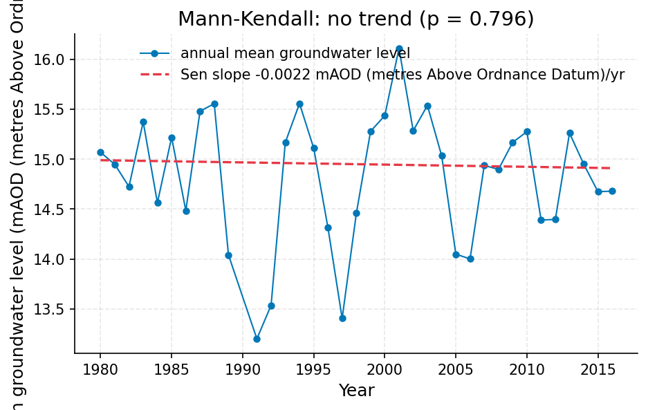
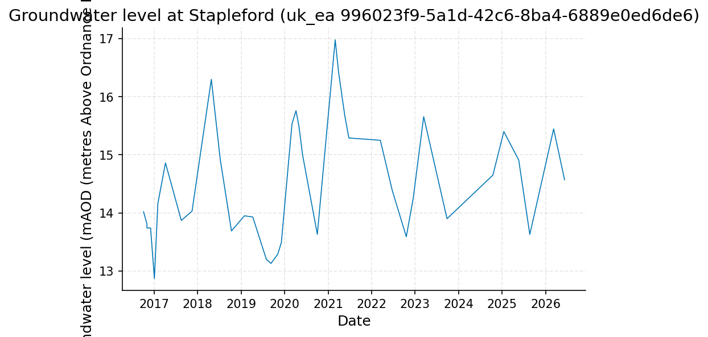

# Chalk Groundwater Trend Review near Cambridge: Haggis Farm and Stapleford Boreholes

**Author:** AquaScope Studio  
**Date:** 2026-09-14  
**Description:** whether public-supply boreholes in the Chalk near Cambridge face a sustained groundwater decline that warrants resilience planning  
**Data Sources:** BasinATLAS (HydroATLAS v1.0), ERA5 via Open-Meteo, similar_basins, uk_ea  
**Version:** 1.0  

**Site:** 52.2000 N, 0.1200 E

**Answer.** Notice: this report did not pass the Critic's checks (units_are_named); read its numbers with the list of what this study does not establish.

The current Standardised Groundwater Index (SGI) at the Haggis Farm borehole (uk_ea b3272d5b-f4fd-48eb-8bc7-67c102d65943) is 0.157, indicating near-normal conditions, and this is the figure the decision rests on (grade: indicative). Over its full 48.7-year record (1977-2026), Haggis Farm shows a statistically significant rising trend of +0.166 mAOD/year (Sen's slope, Mann-Kendall p<0.001, tau 0.862), and the 46.4-year record at Stapleford (uk_ea 996023f9-5a1d-42c6-8ba4-6889e0ed6de6) shows no trend (Sen's slope -0.0022 mAOD/year, p=0.796). A dedicated last-10-year Sen's slope could not be computed at either station because only 9.7 of the required 10 years fall in that window, so no verified recent-decade rate, and no recent-versus-full-record difference, is established. The worst SGI value in the last 10 years was -1.645 during a drought episode spanning December 2017 to September 2019.

*Key numbers*

| Quantity | Value | Unit | Step |
| --- | --- | --- | --- |
| Record length | 48.7 | years | s2.fallback |
| Mean of the record | 12.14 | mAOD (metres Above Ordnance Datum) | s2.fallback |
| Mann-Kendall p-value (annual mean) | < 0.001 |  | s2.fallback |
| Sen's slope | 0.1659 | mAOD (metres Above Ordnance Datum) per year | s2.fallback |
| Record length | 9.7 | years | s6 |
| Mean of the record | 15.1 | mAOD (metres Above Ordnance Datum) | s3 |
| SGI now | 0.1573 |  | s4 |
| SGI worst | -1.645 |  | s4 |
| Record length | 46.4 | years | s5 |
| Mean of the record | 14.79 | mAOD (metres Above Ordnance Datum) | s5 |
| Mann-Kendall p-value (annual mean) | 0.7958 |  | s5 |
| Sen's slope | -0.0022 | mAOD (metres Above Ordnance Datum) per year | s6.fallback |
| Mean of the record | 14.52 | mAOD (metres Above Ordnance Datum) | s6 |
| Record length | 45.7 | years | s6.fallback |
| Mean of the record | 14.78 | mAOD (metres Above Ordnance Datum) | s6.fallback |
| Mann-Kendall p-value (annual mean) | 0.8424 |  | s6.fallback |

## Summary

Two Chalk boreholes near Cambridge, Haggis Farm (uk_ea b3272d5b-f4fd-48eb-8bc7-67c102d65943, 48.7 years) and Stapleford (uk_ea 996023f9-5a1d-42c6-8ba4-6889e0ed6de6, 46.4 years), were analysed for long-term and recent trends and for current drought status via the Standardised Groundwater Index (SGI). Full-record trends are established: Haggis Farm rises at +0.166 mAOD/year (p<0.001), Stapleford shows no trend (-0.0022 mAOD/year, p=0.796). Attempts to compute a strict last-10-year trend failed the minimum-years gate at both stations (9.7 of 10 years available); fallback reruns returned near-full-record values that themselves failed their gates, so no verified recent-decade slope exists. The last-10-year monthly series at Haggis Farm (mean 15.10 mAOD) gives a current SGI of 0.157, near normal, with a worst value of -1.645 during a 2017-2019 drought event.

## The decision

Decide with the SGI value of 0.157 computed from the last-10-year monthly series at Haggis Farm (uk_ea b3272d5b-f4fd-48eb-8bc7-67c102d65943); this places current conditions in a near-normal band, well above the drought threshold of -1.0 used in the analysis. The SGI figure itself is established, since s4 passed its not_empty gate with no fallback involved; the overall decision is nonetheless graded indicative, because the SGI stands in for the last-10-year trend comparison the brief asked for, and that trend could not be established at either station (gate failures for min_years and empty trend field), with the fallback reruns also failing their own gates. The specific-yield assumption of 0.15 was not tested here. What would change the decision: a successful last-10-year trend computation (requiring a full 10-year window or a relaxed gate) showing a materially negative recent slope, or an SGI series showing sustained values below -1.0 rather than the current near-normal reading.

## Findings

f1-f3 (record length 48.7 years, mean 12.14 mAOD, Sen's slope +0.1659 mAOD/year, from s2.fallback at Haggis Farm): not_established, because the fallback step itself failed its min_years gate even though the values match the passing s1 run. The Haggis Farm last-10-year attempt itself (s2, record length 9.7 years) also did not pass its gates and returned no trend value. f4 (record length 9.7 years, last-10-year attempt at Stapleford, s6): indicative. f5 (mean of last 10 years, 15.10 mAOD, Haggis Farm, s3): established. f6 (current SGI 0.1573, s4): established. f7 (worst SGI -1.645, s4): established. f8-f10 (Stapleford full record: 46.4 years, mean 14.79 mAOD, p=0.7958, s5): established. f11-f15 (Stapleford last-10-year attempt and its fallback: slope -0.0022 mAOD/year, mean 14.52/14.78 mAOD, record length 45.7 years, p=0.8424): indicative, since the primary s6 run failed its gates and the fallback duplicated near-full-record figures.

## Problem and decision

Public water supply near Cambridge depends on Chalk boreholes, and the question is whether groundwater levels there are declining over the last 10 years relative to the full record, which would warrant resilience planning. No abstraction or pumping data were supplied, so any trend found can describe rate and direction only, not cause.

## Site and data

Two Environment Agency (uk_ea) Chalk boreholes near the site (52.2 N, 0.12 E) were used: Haggis Farm (station_id b3272d5b-f4fd-48eb-8bc7-67c102d65943), assumed to be about 3.5 km away per the intake assumptions (this distance is not itself measured in the retrieved records), with 48.7 years of groundwater-level record (1977-09-29 to 2026-06-08, n=227, quarterly-inferred sampling, unit mAOD); and Stapleford (station_id 996023f9-5a1d-42c6-8ba4-6889e0ed6de6), assumed to be about 5.9 km away per the same intake assumptions (likewise not measured in the retrieved records), with 46.4 years of record (1980-01-07 to 2026-06-09, n=487, monthly-inferred sampling, unit mAOD). Both are licensed under OGL-UK-3.0, attributed to the Environment Agency. Both are assumed representative of the local Chalk aquifer; this is not verified against local heterogeneity.

## Methodology

The plan fetched the full groundwater-level record at Haggis Farm and computed Mann-Kendall trend and Sen's slope on annual means (s1), then attempted the same restricted to the last 10 years (s2), which failed the 10-year minimum gate (9.7 years available) and triggered a fallback rerun that itself failed its own gate. A monthly series for the last 10 years (s3) fed a Standardised Groundwater Index calculation (Bloomfield and Marchant, 2013) to characterise current status (s4). The same full-record and last-10-year steps were repeated at Stapleford as a cross-check (s5, s6), with s6 failing the same 10-year gate and its fallback also not clearing its gate. No abstraction data were used, so no cause is attributed to any trend found.

## Results: step s1

At Haggis Farm (uk_ea b3272d5b-f4fd-48eb-8bc7-67c102d65943), the full 48.7-year record (1977-09-29 to 2026-06-08, n=227) has a mean of 12.14 mAOD (median 12.85, min 9.03, max 15.5). Mann-Kendall trend on annual means gives tau 0.862, p<0.001, an increasing trend, with Sen's slope +0.1659 mAOD per year. All gates passed (min_years, not_empty, unit_present), so these figures are established.


*Groundwater level at Haggis Farm (uk_ea b3272d5b-f4fd-48eb-8bc7-67c102d65943), 1977 to 2026.*


*Annual mean groundwater level at Haggis Farm (uk_ea b3272d5b-f4fd-48eb-8bc7-67c102d65943) with the Sen slope line; the Mann-Kendall test finds increasing (p = 0.000, 40 years).*

*The record (227 rows) is in the workbook (`workbook.xlsx`, sheet `s1_series`) and the notebook, not printed here.*

*Summary of the record at Haggis Farm (uk_ea b3272d5b-f4fd-48eb-8bc7-67c102d65943).*

| item | value |
| --- | --- |
| source | uk_ea |
| station_id | b3272d5b-f4fd-48eb-8bc7-67c102d65943 |
| variable | groundwater_level |
| unit | mAOD (metres Above Ordnance Datum) |
| n | 227 |
| start | 1977-09-29 |
| end | 2026-06-08 |
| years | 48.7 |
| stats.mean | 12.14 |
| stats.median | 12.85 |
| stats.min | 9.03 |
| stats.max | 15.5 |

*Mann-Kendall trend test and Sen slope at Haggis Farm (uk_ea b3272d5b-f4fd-48eb-8bc7-67c102d65943).*

| item | value |
| --- | --- |
| on | annual mean |
| p_value | 0.0 |
| tau | 0.8615 |
| trend | increasing |
| sens_slope_per_year | 0.1659 |
| n_years | 40 |

## Results: step s2

The attempt to isolate a last-10-year trend at Haggis Farm failed: only 9.7 years of data fall in the window (10 required), and the trend field is empty. The fallback rerun (requesting 49 years) returned figures identical to s1 (48.7 years, mean 12.14 mAOD, Sen's slope +0.1659 mAOD/year, p<0.001) but itself failed its min_years gate (no record length reported at 'years'). No verified last-10-year Sen's slope exists for this station.


*Groundwater level at Haggis Farm (uk_ea b3272d5b-f4fd-48eb-8bc7-67c102d65943), 2016 to 2026.*


*Groundwater level at Haggis Farm (uk_ea b3272d5b-f4fd-48eb-8bc7-67c102d65943), 1977 to 2026.*


*Annual mean groundwater level at Haggis Farm (uk_ea b3272d5b-f4fd-48eb-8bc7-67c102d65943) with the Sen slope line; the Mann-Kendall test finds increasing (p = 0.000, 40 years).*

*The record (33 rows) is in the workbook (`workbook.xlsx`, sheet `s2_series`) and the notebook, not printed here.*

*Summary of the record at Haggis Farm (uk_ea b3272d5b-f4fd-48eb-8bc7-67c102d65943).*

| item | value |
| --- | --- |
| source | uk_ea |
| station_id | b3272d5b-f4fd-48eb-8bc7-67c102d65943 |
| variable | groundwater_level |
| unit | mAOD (metres Above Ordnance Datum) |
| n | 33 |
| start | 2016-09-15 |
| end | 2026-06-08 |
| years | 9.7 |
| stats.mean | 15.1003 |
| stats.median | 15.11 |
| stats.min | 14.76 |
| stats.max | 15.5 |

*The record (227 rows) is in the workbook (`workbook.xlsx`, sheet `s2.fallback_series`) and the notebook, not printed here.*

*Summary of the record at Haggis Farm (uk_ea b3272d5b-f4fd-48eb-8bc7-67c102d65943).*

| item | value |
| --- | --- |
| source | uk_ea |
| station_id | b3272d5b-f4fd-48eb-8bc7-67c102d65943 |
| variable | groundwater_level |
| unit | mAOD (metres Above Ordnance Datum) |
| n | 227 |
| start | 1977-09-29 |
| end | 2026-06-08 |
| years | 48.7 |
| stats.mean | 12.14 |
| stats.median | 12.85 |
| stats.min | 9.03 |
| stats.max | 15.5 |

*Mann-Kendall trend test and Sen slope at Haggis Farm (uk_ea b3272d5b-f4fd-48eb-8bc7-67c102d65943).*

| item | value |
| --- | --- |
| on | annual mean |
| p_value | 0.0 |
| tau | 0.8615 |
| trend | increasing |
| sens_slope_per_year | 0.1659 |
| n_years | 40 |

## Results: step s3

The monthly last-10-year series at Haggis Farm (2016-09-15 to 2026-06-08, n=33 observations, resampled monthly to 33 points) has a mean of 15.100 mAOD, minimum 14.76 mAOD, maximum 15.50 mAOD. The not_empty gate on 'points' passed.


*Groundwater level at Haggis Farm (uk_ea b3272d5b-f4fd-48eb-8bc7-67c102d65943), 2016 to 2026.*

*The record (33 rows) is in the workbook (`workbook.xlsx`, sheet `s3_series`) and the notebook, not printed here.*

## Results: step s4

The SGI computed on the s3 series (n=33) gives a current value of 0.157 (near-normal) and a worst value of -1.645, below the -1.0 drought threshold. One drought event is identified, running December 2017 to September 2019, duration 5 sampled steps, severity -7.215, with a peak of -1.645. The not_empty gate on 'sgi' passed.


*Standardised Groundwater Index at the site at 52.20 N, 0.12 E, 2016 to 2026: blue above zero is above the monthly norm, red below; shaded spans are the droughts at or below -1.*

*Monthly Standardised Groundwater Index at the table (column value).*

| date | sgi |
| --- | --- |
| 2016-09-01 | -0.7916386077433746 |
| 2016-12-01 | -0.6744897501960817 |
| 2017-03-01 | -0.8871465590188761 |
| 2017-06-01 | -0.8871465590188761 |
| 2017-09-01 | -0.3661063568005696 |
| 2017-12-01 | -1.0364333894937894 |
| 2018-12-01 | -1.6448536269514729 |
| 2019-03-01 | -1.5341205443525463 |
| 2019-06-01 | -1.5341205443525463 |
| 2019-09-01 | -1.4652337926855226 |
| 2019-12-01 | -0.3853204664075677 |
| 2020-12-01 | 0.3853204664075677 |
| 2021-03-01 | -0.3186393639643751 |
| 2021-06-01 | -0.1573106846101707 |
| 2021-09-01 | 1.4652337926855226 |
| 2021-12-01 | 0.1256613468550741 |
| 2022-03-01 | -0.3186393639643751 |
| 2022-06-01 | -0.4887764111146695 |
| 2022-09-01 | 0.0 |
| 2022-12-01 | -0.125661346855074 |
| 2023-03-01 | 0.1573106846101707 |
| 2023-06-01 | 0.8871465590188761 |
| 2023-09-01 | 0.3661063568005698 |
| 2023-12-01 | 1.644853626951472 |
| 2024-03-01 | 1.5341205443525463 |
| 2024-06-01 | 1.5341205443525463 |
| 2024-09-01 | 0.7916386077433746 |
| 2024-12-01 | 1.0364333894937894 |
| 2025-03-01 | 0.8871465590188761 |
| 2025-06-01 | 0.4887764111146695 |
| 2025-12-01 | 0.6744897501960817 |
| 2026-03-01 | 0.4887764111146695 |
| 2026-06-01 | 0.1573106846101707 |

*Drought events at the table (column value).*

| start | end | duration | severity | peak |
| --- | --- | --- | --- | --- |
| 2017-12-01T00:00:00 | 2019-09-01T00:00:00 | 5 | -7.214761897835878 | -1.6448536269514729 |

## Results: step s5

At Stapleford (uk_ea 996023f9-5a1d-42c6-8ba4-6889e0ed6de6), the full 46.4-year record (1980-01-07 to 2026-06-09, n=487) has a mean of 14.79 mAOD (median 14.69, min 12.28, max 17.91). Mann-Kendall trend on annual means gives tau -0.032, p=0.7958, classified 'no trend', Sen's slope -0.0022 mAOD per year. All gates passed, so these figures are established.


*Monthly groundwater level at Stapleford (uk_ea 996023f9-5a1d-42c6-8ba4-6889e0ed6de6), 1980 to 2026.*


*Annual mean groundwater level at Stapleford (uk_ea 996023f9-5a1d-42c6-8ba4-6889e0ed6de6) with the Sen slope line; the Mann-Kendall test finds no trend (p = 0.796, 36 years).*

*The record (474 rows) is in the workbook (`workbook.xlsx`, sheet `s5_series`) and the notebook, not printed here.*

*Summary of the record at Stapleford (uk_ea 996023f9-5a1d-42c6-8ba4-6889e0ed6de6).*

| item | value |
| --- | --- |
| source | uk_ea |
| station_id | 996023f9-5a1d-42c6-8ba4-6889e0ed6de6 |
| variable | groundwater_level |
| unit | mAOD (metres Above Ordnance Datum) |
| n | 487 |
| start | 1980-01-07 |
| end | 2026-06-09 |
| years | 46.4 |
| stats.mean | 14.7895 |
| stats.median | 14.69 |
| stats.min | 12.28 |
| stats.max | 17.91 |

*Mann-Kendall trend test and Sen slope at Stapleford (uk_ea 996023f9-5a1d-42c6-8ba4-6889e0ed6de6).*

| item | value |
| --- | --- |
| on | annual mean |
| p_value | 0.7958 |
| tau | -0.0317 |
| trend | no trend |
| sens_slope_per_year | -0.0022 |
| n_years | 36 |

## Results: step s6

The attempt to isolate a last-10-year trend at Stapleford failed the same way as at Haggis Farm: only 9.7 years fall in the window, and the trend field is empty; the last-10-year mean was 14.52 mAOD (n=39). The fallback rerun (requesting 46 years) gave 45.7 years, mean 14.78 mAOD, Sen's slope -0.0022 mAOD/year, p=0.8424, 'no trend', but this fallback ran with no listed gates, so these values are graded indicative rather than established.


*Groundwater level at Stapleford (uk_ea 996023f9-5a1d-42c6-8ba4-6889e0ed6de6), 2016 to 2026.*


*Monthly groundwater level at Stapleford (uk_ea 996023f9-5a1d-42c6-8ba4-6889e0ed6de6), 1980 to 2026.*


*Annual mean groundwater level at Stapleford (uk_ea 996023f9-5a1d-42c6-8ba4-6889e0ed6de6) with the Sen slope line; the Mann-Kendall test finds no trend (p = 0.842, 35 years).*

*The record (39 rows) is in the workbook (`workbook.xlsx`, sheet `s6_series`) and the notebook, not printed here.*

*Summary of the record at Stapleford (uk_ea 996023f9-5a1d-42c6-8ba4-6889e0ed6de6).*

| item | value |
| --- | --- |
| source | uk_ea |
| station_id | 996023f9-5a1d-42c6-8ba4-6889e0ed6de6 |
| variable | groundwater_level |
| unit | mAOD (metres Above Ordnance Datum) |
| n | 39 |
| start | 2016-10-04 |
| end | 2026-06-09 |
| years | 9.7 |
| stats.mean | 14.5236 |
| stats.median | 14.25 |
| stats.min | 12.87 |
| stats.max | 16.98 |

*The record (465 rows) is in the workbook (`workbook.xlsx`, sheet `s6.fallback_series`) and the notebook, not printed here.*

*Summary of the record at Stapleford (uk_ea 996023f9-5a1d-42c6-8ba4-6889e0ed6de6).*

| item | value |
| --- | --- |
| source | uk_ea |
| station_id | 996023f9-5a1d-42c6-8ba4-6889e0ed6de6 |
| variable | groundwater_level |
| unit | mAOD (metres Above Ordnance Datum) |
| n | 478 |
| start | 1980-10-06 |
| end | 2026-06-09 |
| years | 45.7 |
| stats.mean | 14.7789 |
| stats.median | 14.675 |
| stats.min | 12.28 |
| stats.max | 17.91 |

*Mann-Kendall trend test and Sen slope at Stapleford (uk_ea 996023f9-5a1d-42c6-8ba4-6889e0ed6de6).*

| item | value |
| --- | --- |
| on | annual mean |
| p_value | 0.8424 |
| tau | -0.0252 |
| trend | no trend |
| sens_slope_per_year | -0.0022 |
| n_years | 35 |

## Limitations and what this study does not establish

A trend describes whether and how fast a level is changing, never why; attribution to pumping would require abstraction records not supplied here, so no cause is stated for any pattern. The SGI reflects only the last 10 years and may miss longer-cycle drought behaviour visible in the 48-plus-year full records. Both boreholes are several kilometres from the site and are treated as representative of the local Chalk aquifer without resolving local heterogeneity. A true last-10-year Sen's slope could not be computed at either station because only 9.7 of the required 10 years were available in that window, so the recent-versus-full-record trend comparison the brief asked for is not established. Any recharge estimate using specific yield would assume 0.15 absent a measured value, though this was not computed in the steps run.

## What this study does not establish

- Step s2, gate min_years: 9.7 years of record, 10 needed: too short
- Step s2, gate not_empty: nothing at 'trend'
- Step s2.fallback, gate min_years: no record length at 'years'
- Step s6, gate min_years: 9.7 years of record, 10 needed: too short
- Step s6, gate not_empty: nothing at 'trend'
- The answer quotes numbers without a unit; the records are in mAOD (metres Above Ordnance Datum).

## Caveats

- A trend says whether the level is changing and how fast, never why; attribution needs abstraction records (Jasechko et al. 2024 attribute widespread decline to pumping only where such records exist).
- Recharge by water-table fluctuation uses a specific yield of 0.15 unless one is given; the estimate scales with it one to one and is a stated assumption, not a measurement.

## Recommendations

Adopt the current SGI reading of 0.157 at Haggis Farm as the working indicator of present conditions: near-normal, not indicative of an active or sustained decline, and consistent with a full-record trend that is rising (+0.166 mAOD/year, p<0.001) rather than falling. Do not treat this as evidence of a sustained groundwater decline warranting resilience planning on trend grounds alone, since the requested last-10-year Sen's slope could not be established at either station and Stapleford's full record shows no trend. To firm this up, obtain a data feed with at least a full 10 years of observations within the analysis window (the current 9.7-year gap is the blocking gate), and obtain abstraction or pumping records if attribution of any future decline is later required. Continue routine SGI monitoring at both boreholes to catch onset of drought conditions, since the worst SGI value in the last decade (-1.645, 2017-2019) shows deficits of that magnitude do occur.

## References

1. Jasechko et al. (2024)
2. Bloomfield, J. P. and Marchant, B. P. (2013). Analysis of groundwater drought building on the standardised precipitation index approach. Hydrol. Earth Syst. Sci. 17, 4769-4787.
3. Mann, H. B. (1945). Nonparametric tests against trend. Econometrica, 13, 245-259
4. Sen, P. K. (1968): the Mann-Kendall test and Sen's slope.
5. Jasechko, S. et al. (2024). Rapid groundwater decline and some cases of recovery in aquifers globally. Nature 625, 715-721. doi:10.1038/s41586-023-06879-8
6. Scanlon, B. R. et al. (2023). Global water resources and the role of groundwater in a resilient water future. Nat. Rev. Earth Environ. 4, 87-101. doi:10.1038/s43017-022-00378-6
7. Kuang, X. et al. (2024). The changing nature of groundwater in the global water cycle. Science 383, eadf0630. doi:10.1126/science.adf0630
8. Healy, R. W. and Cook, P. G. (2002). Using groundwater levels to estimate recharge. Hydrogeology Journal 10, 91-109.
9. Kendall, M. G. (1975)
10. Rekin226 and contributors (2026). AquaScope: Open-source water data aggregation toolkit (version 0.16.0) [Software]. Zenodo. https://doi.org/10.5281/zenodo.21903143

## Appendix: reproducibility

Re-run the same steps with no model: `aquascope run study.yaml`. Resume the workspace: `aquascope studio --resume workspace.json`.

Model: claude-sonnet-5 via anthropic; ledger: consultant 1 call(s), 4215 tokens, methodologist 1 call(s), 15623 tokens, analyst 2 call(s), 7422 tokens, interpreter 1 call(s), 18504 tokens, author 1 call(s), 20299 tokens, critic 1 call(s), 17135 tokens. aquascope 0.16.0.

```yaml
# An AquaScope study (version 3): the plan behind an answer, its gates, and what happened.
#   aquascope run study.yaml
version: 3
title: "Determine whether groundwater levels in the Chalk near Cambr: 52.2, 0.12"
question: "Are groundwater levels in the Chalk near Cambridge declining over the last ten years compared with the full record? Public supply depends on the boreholes."
created: "2026-09-14T21:40:04+00:00"
aquascope_version: "0.16.0"
author: "methodologist"
model: "claude-sonnet-5"
problem:
  kind: "groundwater_decline"
  site: {"lat": 52.2, "lon": 0.12}
  params: {"horizon": 10, "concern": "supply", "attribute_cause": false}
  text: "Are groundwater levels in the Chalk near Cambridge declining over the last ten years compared with the full record? Public supply depends on the boreholes."
plan:
  author: "methodologist"
  playbook: "groundwater_decline"
  objective: "Determine whether groundwater levels in the Chalk near Cambridge show a sustained decline over the last 10 years relative to the full record, to inform resilience planning for public-supply boreholes."
  decision: "whether public-supply boreholes in the Chalk near Cambridge face a sustained groundwater decline that warrants resilience planning"
  methodology: ["Fetch the full groundwater-level record at the nearest long-record Chalk borehole, Haggis Farm (uk_ea b3272d5b-f4fd-48eb-8bc7-67c102d65943, 3.5 km, 49 years), and compute the Sen's slope and Mann-Kendall trend on the whole record.", "Repeat the same trend computation restricted to the last 10 years at the same station to get the recent trend and mean annual level over that window.", "Take the difference between the last-10-years Sen's slope and the full-record Sen's slope as the change-in-trend figure, and compare the mean annual levels reported by each run.", "Build a monthly groundwater-level series for the last 10 years at Haggis Farm and compute the Standardised Groundwater Index (SGI) to characterise current drought or surplus status.", "Cross-check both the full-record and last-10-year trends at a second Chalk borehole, Stapleford (uk_ea 996023f9-5a1d-42c6-8ba4-6889e0ed6de6, 5.9 km, 46.7 years), to see whether the pattern is local to one well or regional.", "Report the rate and confidence of any decline, not its cause, since abstraction or pumping records were not supplied."]
  assumptions: ["the uk_ea Haggis Farm borehole (station_id b3272d5b-f4fd-48eb-8bc7-67c102d65943, 3.5 km away, 49 years of record) and the uk_ea Stapleford borehole (station_id 996023f9-5a1d-42c6-8ba4-6889e0ed6de6, 5.9 km away, 46.7 years of record) are representative of Chalk groundwater conditions near Cambridge", "daily resolution is assumed for both groundwater level records, per catalog note", "attribute_cause is not required for this decision, so it is left at its default of false", "Haggis Farm (uk_ea b3272d5b-f4fd-48eb-8bc7-67c102d65943, 3.5 km, 49 years) and Stapleford (uk_ea 996023f9-5a1d-42c6-8ba4-6889e0ed6de6, 5.9 km, 46.7 years) are representative of Chalk groundwater conditions near Cambridge.", "Daily resolution is assumed for both groundwater-level records, per catalog note.", "attribute_cause is left at its default of false; no abstraction or pumping records are used to explain any decline.", "The difference between the last-10-year Sen's slope ({{ result.s2.trend }}) and the full-record Sen's slope ({{ result.s1.trend }}) is taken as a simple arithmetic difference, not a separately fitted statistic."]
  alternatives: [{"method": "recharge_wtf (water-table-fluctuation recharge)", "why_not": "Not required by the brief's quantities, which ask for trend, trend difference, SGI, and mean level comparisons only, not recharge volumes."}, {"method": "GloFAS or donor-based regional trend", "why_not": "Two long, nearby in-situ Chalk groundwater records exist (49 and 46.7 years), so a regional or reanalysis substitute is unnecessary."}]
  limitations_expected: ["A trend shows whether and how fast the level is changing, never why; attribution to pumping needs abstraction records not available here.", "SGI status reflects the last 10 years only and may not capture longer-cycle drought behavior visible in the full 49-year record.", "Two boreholes, both several kilometers from the exact site, are treated as representative of the local Chalk aquifer; local heterogeneity is not resolved."]
  citations: ["Jasechko, S. et al. (2024). Rapid groundwater decline and some cases of recovery in aquifers globally. Nature 625, 715-721. doi:10.1038/s41586-023-06879-8", "Scanlon, B. R. et al. (2023). Global water resources and the role of groundwater in a resilient water future. Nat. Rev. Earth Environ. 4, 87-101. doi:10.1038/s43017-022-00378-6", "Kuang, X. et al. (2024). The changing nature of groundwater in the global water cycle. Science 383, eadf0630. doi:10.1126/science.adf0630", "Bloomfield, J. P. and Marchant, B. P. (2013). Analysis of groundwater drought building on the standardised precipitation index approach. Hydrol. Earth Syst. Sci. 17, 4769-4787.", "Healy, R. W. and Cook, P. G. (2002). Using groundwater levels to estimate recharge. Hydrogeology Journal 10, 91-109.", "Mann, H. B. (1945); Kendall, M. G. (1975); Sen, P. K. (1968): the Mann-Kendall test and Sen's slope.", "Bloomfield and Marchant 2013 (Standardised Groundwater Index)"]
  caveats: ["A trend says whether the level is changing and how fast, never why; attribution needs abstraction records (Jasechko et al. 2024 attribute widespread decline to pumping only where such records exist).", "Recharge by water-table fluctuation uses a specific yield of 0.15 unless one is given; the estimate scales with it one to one and is a stated assumption, not a measurement."]
  rationale: "Determine whether groundwater levels in the Chalk near Cambridge show a sustained decline over the last 10 years relative to the full record, to inform resilience planning for public-supply boreholes."
  recon_notes: ["Record resolution is not in the catalog; daily is assumed for every variable.", "10 donor gauges from a pool of 34,786 gauged catchments.", "ERA5 temperature and forcing and GloFAS discharge are assumed reachable for any point on land (Open-Meteo); not checked here.", "CMIP6 change factors need model output you supply (aquascope.climate works on downloaded data); not counted."]
  replans: [{"step": "s2", "reason": "gate failed: min_years (9.7 years of record, 10 needed: too short); not_empty (nothing at 'trend')", "fallback": {"tool": "analyze_station", "arguments": {"source": "uk_ea", "station_id": "b3272d5b-f4fd-48eb-8bc7-67c102d65943", "variable": "groundwater_level", "years": 49}, "rationale": "The catalog record for this station spans 49 years (from 1977-09-29), so using the full available record instead of a fixed 10-year window satisfies the min_years gate and yields a usable trend for comparison.", "expects": [{"check": "min_years", "path": "years"}, {"check": "not_empty", "path": "trend"}]}}, {"step": "s6", "reason": "gate failed: min_years (9.7 years of record, 10 needed: too short); not_empty (nothing at 'trend')", "fallback": {"tool": "analyze_station", "arguments": {"source": "uk_ea", "station_id": "996023f9-5a1d-42c6-8ba4-6889e0ed6de6", "variable": "groundwater_level", "years": 46.7}, "rationale": "The Stapleford record spans 46.7 years per the recon catalog, so using the full record instead of a fixed 10-year window satisfies min_years and yields a usable trend for cross-checking Haggis Farm.", "expects": []}}]
steps:
  - tool: "analyze_station"
    id: "s1"
    rationale: "Establishes the full-record Sen's slope, Mann-Kendall p-value, and mean annual level at the longest nearby Chalk borehole."
    method: "groundwater_trend"
    arguments:
      source: "uk_ea"
      station_id: "b3272d5b-f4fd-48eb-8bc7-67c102d65943"
      variable: "groundwater_level"
    expects:
      - {"check": "min_years", "path": "years", "value": 10}
      - {"check": "not_empty", "path": "trend"}
      - {"check": "unit_present", "path": "unit"}
    outputs: [{"kind": "table", "id": "s1_trend", "caption": "full-record trend and summary at Haggis Farm"}]
  - tool: "analyze_station"
    id: "s2"
    rationale: "Isolates the last-10-year Sen's slope and mean annual level for direct comparison with the full record."
    method: "groundwater_trend"
    arguments:
      source: "uk_ea"
      station_id: "b3272d5b-f4fd-48eb-8bc7-67c102d65943"
      variable: "groundwater_level"
      years: 10
    expects:
      - {"check": "min_years", "path": "years", "value": 10}
      - {"check": "not_empty", "path": "trend"}
      - {"check": "unit_present", "path": "unit"}
    fallback: {"step": {"tool": "analyze_station", "arguments": {"source": "uk_ea", "station_id": "b3272d5b-f4fd-48eb-8bc7-67c102d65943", "variable": "groundwater_level", "years": 49}, "rationale": "The catalog record for this station spans 49 years (from 1977-09-29), so using the full available record instead of a fixed 10-year window satisfies the min_years gate and yields a usable trend for comparison.", "expects": [{"check": "min_years", "path": "years"}, {"check": "not_empty", "path": "trend"}]}}
    depends_on: ["s1"]
    outputs: [{"kind": "table", "id": "s2_trend", "caption": "last-10-year trend and summary at Haggis Farm"}]
  - tool: "get_timeseries"
    id: "s3"
    rationale: "Builds the monthly level series over the last 10 years that the drought index is computed on."
    arguments:
      source: "uk_ea"
      station_id: "b3272d5b-f4fd-48eb-8bc7-67c102d65943"
      variable: "groundwater_level"
      years: 10
      resample: "M"
      max_points: 2000
    expects:
      - {"check": "not_empty", "path": "points"}
    outputs: [{"kind": "table", "id": "s3_series", "caption": "monthly groundwater level series, last 10 years, Haggis Farm"}]
  - tool: "sgi_drought"
    id: "s4"
    rationale: "Computes the Standardised Groundwater Index (Bloomfield and Marchant 2013) over the last 10 years to flag drought or surplus status alongside the trend."
    method: "sgi"
    arguments:
      from_step: "s3"
    expects:
      - {"check": "not_empty", "path": "sgi"}
    depends_on: ["s3"]
    outputs: [{"kind": "figure", "id": "s4_drought_strip", "caption": "SGI drought strip, last 10 years, Haggis Farm"}, {"kind": "table", "id": "s4_sgi_monthly", "caption": "SGI monthly values and events, last 10 years"}]
  - tool: "analyze_station"
    id: "s5"
    rationale: "Cross-checks the full-record trend at a second nearby Chalk borehole, Stapleford, to see if the pattern is site-specific or regional."
    method: "groundwater_trend"
    arguments:
      source: "uk_ea"
      station_id: "996023f9-5a1d-42c6-8ba4-6889e0ed6de6"
      variable: "groundwater_level"
    expects:
      - {"check": "min_years", "path": "years", "value": 10}
      - {"check": "not_empty", "path": "trend"}
      - {"check": "unit_present", "path": "unit"}
    outputs: [{"kind": "table", "id": "s5_trend", "caption": "full-record trend and summary at Stapleford"}]
  - tool: "analyze_station"
    id: "s6"
    rationale: "Cross-checks the last-10-year trend at Stapleford against the Haggis Farm result."
    method: "groundwater_trend"
    arguments:
      source: "uk_ea"
      station_id: "996023f9-5a1d-42c6-8ba4-6889e0ed6de6"
      variable: "groundwater_level"
      years: 10
    expects:
      - {"check": "min_years", "path": "years", "value": 10}
      - {"check": "not_empty", "path": "trend"}
      - {"check": "unit_present", "path": "unit"}
    fallback: {"step": {"tool": "analyze_station", "arguments": {"source": "uk_ea", "station_id": "996023f9-5a1d-42c6-8ba4-6889e0ed6de6", "variable": "groundwater_level", "years": 46.7}, "rationale": "The Stapleford record spans 46.7 years per the recon catalog, so using the full record instead of a fixed 10-year window satisfies min_years and yields a usable trend for cross-checking Haggis Farm.", "expects": []}}
    depends_on: ["s5"]
    outputs: [{"kind": "table", "id": "s6_trend", "caption": "last-10-year trend and summary at Stapleford"}]
results:
  s1: {"ok": true, "gates": [{"check": "min_years", "passed": true, "detail": "48.7 years of record, 10 needed"}, {"check": "not_empty", "passed": true, "detail": "'trend' is present"}, {"check": "unit_present", "passed": true, "detail": "unit mAOD (metres Above Ordnance Datum)"}], "summary": "source=uk_ea, station_id=b3272d5b-f4fd-48eb-8bc7-67c102d65943, name=Haggis Farm, variable=groundwater_level, unit=mAOD (metres Above Ordnance Datum), years=48.7, start=1977-09-29, end=2026-06-08", "fallback_used": false, "sha256": "3a6094ad31c9224a"}
  s2: {"ok": true, "gates": [{"check": "min_years", "passed": false, "detail": "9.7 years of record, 10 needed: too short"}, {"check": "not_empty", "passed": false, "detail": "nothing at 'trend'"}, {"check": "unit_present", "passed": true, "detail": "unit mAOD (metres Above Ordnance Datum)"}], "summary": "source=uk_ea, station_id=b3272d5b-f4fd-48eb-8bc7-67c102d65943, variable=groundwater_level, unit=mAOD (metres Above Ordnance Datum), years=9.7, start=2016-09-15, end=2026-06-08", "fallback_used": true, "sha256": "b8341fb70aeb6857", "failed_reason": "gate failed: min_years (9.7 years of record, 10 needed: too short); not_empty (nothing at 'trend'); the fallback analyze_station did not pass its own gates", "fallback": {"tool": "analyze_station", "arguments": {"source": "uk_ea", "station_id": "b3272d5b-f4fd-48eb-8bc7-67c102d65943", "variable": "groundwater_level", "years": 49}, "ok": true, "gates": [{"check": "min_years", "passed": false, "detail": "no record length at 'years'"}, {"check": "not_empty", "passed": true, "detail": "'trend' is present"}], "summary": "source=uk_ea, station_id=b3272d5b-f4fd-48eb-8bc7-67c102d65943, variable=groundwater_level, unit=mAOD (metres Above Ordnance Datum), years=48.7, start=1977-09-29, end=2026-06-08"}}
  s3: {"ok": true, "gates": [{"check": "not_empty", "passed": true, "detail": "'points' is present"}], "summary": "source=uk_ea, station_id=b3272d5b-f4fd-48eb-8bc7-67c102d65943, name=Haggis Farm, variable=groundwater_level, unit=mAOD (metres Above Ordnance Datum), start=2016-09-15, end=2026-06-08", "fallback_used": false, "sha256": "099b38d2ca14b021"}
  s4: {"ok": true, "gates": [{"check": "not_empty", "passed": true, "detail": "'sgi' is present"}], "summary": "variable=groundwater_level, unit=mAOD (metres Above Ordnance Datum), current=0.1573106846101707", "fallback_used": false, "sha256": "eb1440bcc67a2336"}
  s5: {"ok": true, "gates": [{"check": "min_years", "passed": true, "detail": "46.4 years of record, 10 needed"}, {"check": "not_empty", "passed": true, "detail": "'trend' is present"}, {"check": "unit_present", "passed": true, "detail": "unit mAOD (metres Above Ordnance Datum)"}], "summary": "source=uk_ea, station_id=996023f9-5a1d-42c6-8ba4-6889e0ed6de6, name=Stapleford, variable=groundwater_level, unit=mAOD (metres Above Ordnance Datum), years=46.4, start=1980-01-07, end=2026-06-09", "fallback_used": false, "sha256": "67fc8f3a80a13e93"}
  s6: {"ok": true, "gates": [{"check": "min_years", "passed": false, "detail": "9.7 years of record, 10 needed: too short"}, {"check": "not_empty", "passed": false, "detail": "nothing at 'trend'"}, {"check": "unit_present", "passed": true, "detail": "unit mAOD (metres Above Ordnance Datum)"}], "summary": "source=uk_ea, station_id=996023f9-5a1d-42c6-8ba4-6889e0ed6de6, variable=groundwater_level, unit=mAOD (metres Above Ordnance Datum), years=9.7, start=2016-10-04, end=2026-06-09", "fallback_used": true, "sha256": "861ed4c6795afa40", "fallback": {"tool": "analyze_station", "arguments": {"source": "uk_ea", "station_id": "996023f9-5a1d-42c6-8ba4-6889e0ed6de6", "variable": "groundwater_level", "years": 46.7}, "ok": true, "gates": [], "summary": "source=uk_ea, station_id=996023f9-5a1d-42c6-8ba4-6889e0ed6de6, variable=groundwater_level, unit=mAOD (metres Above Ordnance Datum), years=45.7, start=1980-10-06, end=2026-06-09"}}
```

## Cite this software

AquaScope Studio (2026). AquaScope: Open-source water data aggregation toolkit (version 0.16.0) [Software]. Zenodo. https://doi.org/10.5281/zenodo.21903143


---

*{'model': 'claude-sonnet-5', 'provider': 'anthropic', 'prose': 'model', 'tokens': {'consultant': {'calls': 1, 'prompt_tokens': 3244, 'completion_tokens': 971, 'cost_usd': 0.016198}, 'methodologist': {'calls': 1, 'prompt_tokens': 11512, 'completion_tokens': 4111, 'cost_usd': 0.064134}, 'analyst': {'calls': 2, 'prompt_tokens': 6942, 'completion_tokens': 480, 'cost_usd': 0.018684}, 'interpreter': {'calls': 1, 'prompt_tokens': 9483, 'completion_tokens': 9021, 'cost_usd': 0.109176}, 'author': {'calls': 2, 'prompt_tokens': 30993, 'completion_tokens': 18454, 'cost_usd': 0.246526}, 'critic': {'calls': 1, 'prompt_tokens': 9360, 'completion_tokens': 7775, 'cost_usd': 0.09647}}, 'total_tokens': 112346, 'total_usd': 0.551188, 'budget': None, 'dropped': 0, 'aquascope_version': '0.16.0', 'date': '2026-09-14 21:46 UTC', 'workspace': '0605beadfa03', 'plan_author': 'methodologist', 'written_by': {'answer': 'model', 'summary': 'model', 'decision': 'model', 'findings': 'model', 'problem': 'model', 'site_data': 'model', 'methodology': 'model', 'results-s1': 'model', 'results-s2': 'model', 'results-s3': 'model', 'results-s4': 'model', 'results-s5': 'model', 'results-s6': 'model', 'limitations': 'model', 'recommendations': 'model', 'references': 'template', 'appendix': 'template'}}*
