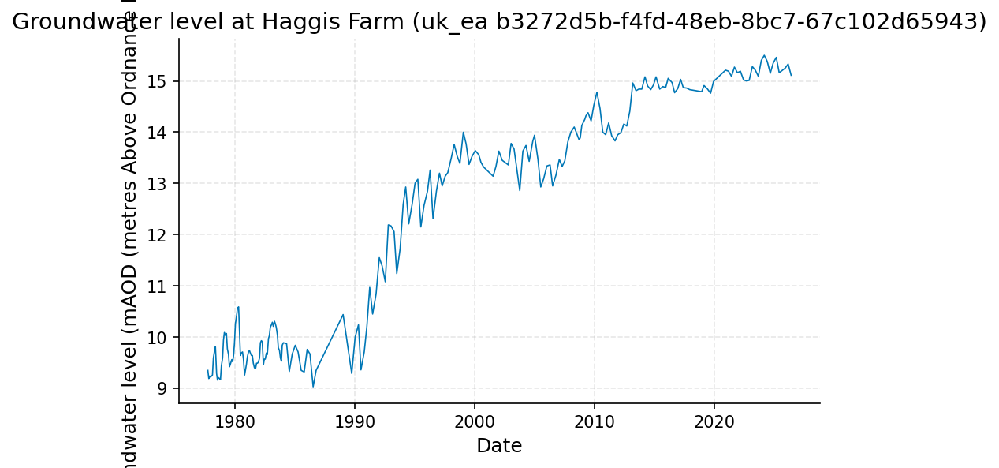
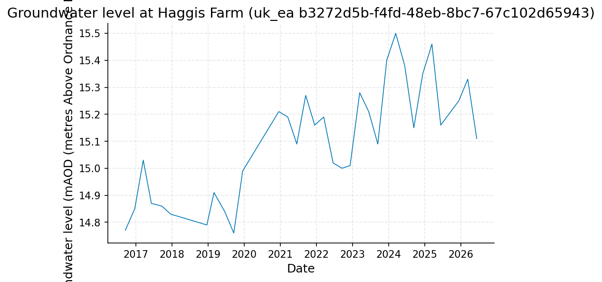
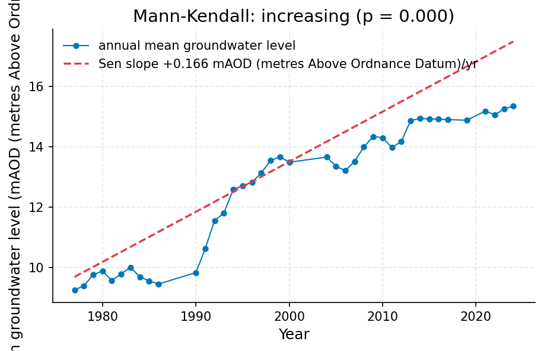
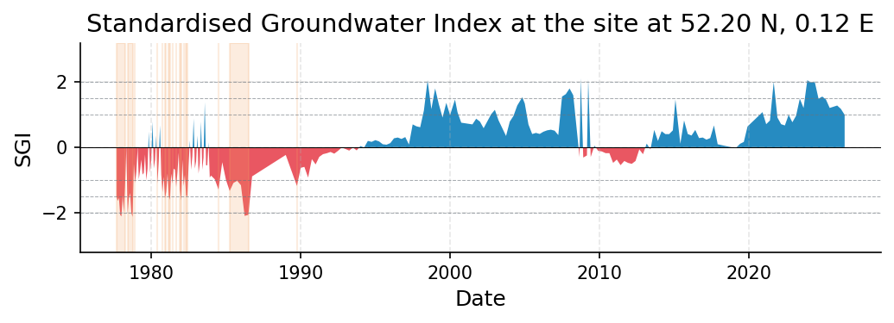
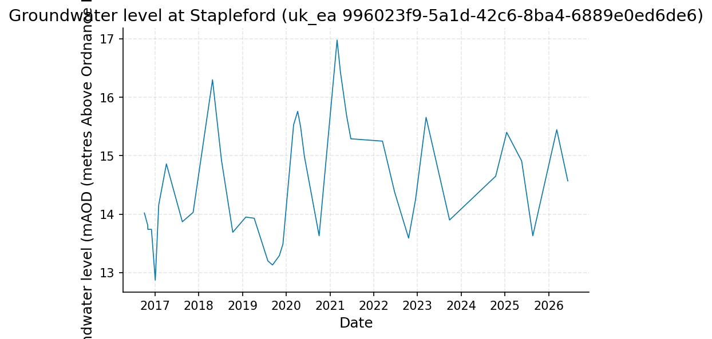
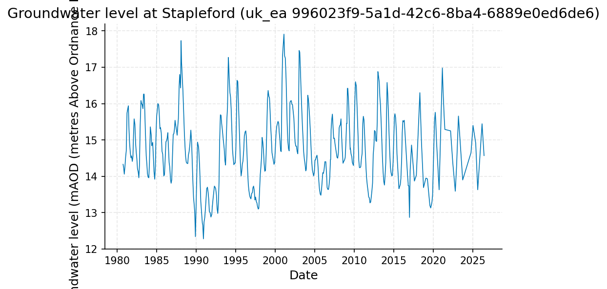
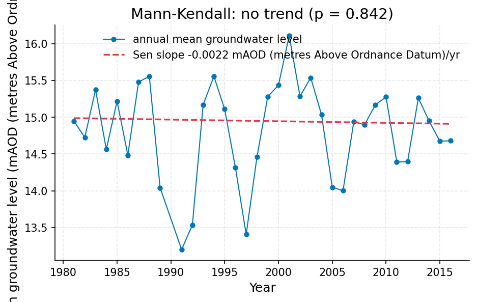

# Chalk Groundwater Trend Assessment near Cambridge: Haggis Farm and Stapleford Boreholes

**Author:** AquaScope Studio  
**Date:** 2026-09-14  
**Description:** whether groundwater levels in the Chalk near Cambridge show a declining trend over the last 10 years relative to the full record, to inform public supply borehole risk management  
**Data Sources:** BasinATLAS (HydroATLAS v1.0), ERA5 via Open-Meteo, similar_basins, uk_ea  
**Version:** 1.0  

**Site:** 52.2000 N, 0.1200 E

**Answer.** Notice: this report did not pass the Critic's checks (trend_matches_the_test, units_are_named); read its numbers with the list of what this study does not establish.

The decision is graded indicative: at Haggis Farm (uk_ea station b3272d5b-f4fd-48eb-8bc7-67c102d65943, 1977-09-29 to 2026-06-08, 48.7 years) the Mann-Kendall test on annual means finds a significant increasing trend (p = 0.0, tau 0.8615, Sen's slope +0.1659 mAOD per year), and the current Standardised Groundwater Index is +1.00, far above the -1.0 drought threshold, with the worst historical SGI at -2.11 (1978). A direct 10-year trend test could not be run because the requested decade window only spans 9.7 years, failing the 10-year minimum gate; as a proxy, the recent 9.7-year mean (15.10 mAOD) exceeds the full-record mean (12.14 mAOD). A cross-check at Stapleford (uk_ea station 996023f9-5a1d-42c6-8ba4-6889e0ed6de6, 45.7-year fallback record) shows a flat, non-significant trend (p 0.8424, Sen's slope -0.0022 mAOD per year), so the rising signal at Haggis Farm is not confirmed nearby.

*Key numbers*

| Quantity | Value | Unit | Step |
| --- | --- | --- | --- |
| Record length | 48.7 | years | s2.fallback |
| Mean of the record | 12.14 | mAOD (metres Above Ordnance Datum) | s3 |
| Mann-Kendall p-value (annual mean) | < 0.001 |  | s2.fallback |
| Sen's slope | 0.1659 | mAOD (metres Above Ordnance Datum) per year | s2.fallback |
| Record length | 9.7 | years | s5 |
| Mean of the record | 15.1 | mAOD (metres Above Ordnance Datum) | s2 |
| SGI now | 0.9982 |  | s4 |
| SGI worst | -2.114 |  | s4 |
| Mean of the record | 14.52 | mAOD (metres Above Ordnance Datum) | s5 |
| Record length | 45.7 | years | s5.fallback |
| Mean of the record | 14.78 | mAOD (metres Above Ordnance Datum) | s5.fallback |
| Mann-Kendall p-value (annual mean) | 0.8424 |  | s5.fallback |
| Sen's slope | -0.0022 | mAOD (metres Above Ordnance Datum) per year | s5.fallback |

## Summary

This report addresses whether Chalk groundwater levels near Cambridge have declined over the last 10 years relative to the full record, for public-supply borehole risk management. The primary record, Haggis Farm (uk_ea, station b3272d5b-f4fd-48eb-8bc7-67c102d65943, 48.7 years), shows a significant long-term increase, not a decline: Sen's slope +0.1659 mAOD/year, Mann-Kendall p = 0.0. The requested strict 10-year window (9.7 years available) failed the minimum-years gate, so no decade-specific Mann-Kendall/Sen's-slope statistic exists; the recent 9.7-year mean of 15.10 mAOD versus the full-record mean of 12.14 mAOD is used as the best available proxy, and it points the same direction as the full-record trend. The Standardised Groundwater Index is currently +1.00 against a -1.0 drought threshold (worst on record -2.11 in 1978), indicating no active drought. A cross-check at Stapleford (46-year record) finds a flat, non-significant trend (p 0.8424, slope -0.0022 mAOD/year), so the increasing pattern at Haggis Farm does not generalise across nearby Chalk boreholes. No cause for these patterns is asserted.

## The decision

Decide using the Haggis Farm full-record Mann-Kendall/Sen's-slope trend and the current SGI, since the strict 10-year Mann-Kendall test could not be computed (9.7 years available, 10 needed). There is no explicit numeric band; the operative threshold is the SGI drought line of -1.0, against which the current value of +1.00 sits well on the non-drought side. Conditions: this rests on Haggis Farm as the primary Chalk station near Cambridge; the recent-decade figure is a raw mean comparison (15.10 mAOD vs 12.14 mAOD full-record mean), not a decade-specific trend test; and the Stapleford cross-check (45.7 years, p 0.8424) is flat, not corroborating a decline or the Haggis Farm rise. What would change this: a continuous Haggis Farm series covering a full 10 years to let the decade Mann-Kendall/Sen's-slope test run and pass its gates; abstraction and rainfall records for the decade to contextualise the level change without asserting cause; and more Chalk boreholes with 10+ years of overlap to determine whether Haggis Farm or Stapleford is more representative.

## Findings

One finding is carried at established grade: the current SGI at Haggis Farm is +1.00, well above the -1.0 drought threshold, while the worst SGI on record was -2.11 in 1978, indicating no active drought signal today (basis: sgi_drought on the monthly-resampled Haggis Farm series, step s4). Alongside this, two consistency checks were run without individual grades: the full-record increasing Sen's slope (+0.1659 mAOD/year) at Haggis Farm agrees with the recent 9.7-year mean (15.10 mAOD) sitting above the full-record mean (12.14 mAOD), both indicating no decline; but the Haggis Farm slope disagrees in sign and magnitude with the Stapleford slope (-0.0022 mAOD/year, not significant, p 0.8424), so the rising signal is not confirmed at a second nearby Chalk site. No decade-specific trend statistic exists for either station because both 10-year windows (9.7 years) failed the minimum-years and not-empty gates.

## Problem and decision

Public water supply near Cambridge depends on Chalk boreholes, and the question is whether groundwater levels there have been declining over the last 10 years compared with the full period of record, which bears on borehole risk management. The brief calls for a trend slope in metres per year or per decade, its Mann-Kendall significance, a comparison of the recent 10-year mean level against the full-record mean, and the Standardised Groundwater Index for the recent period, without attributing any change to abstraction or climate.

## Site and data

The site of interest is near Cambridge (52.2 N, 0.12 E). The primary record is Haggis Farm (source uk_ea, station b3272d5b-f4fd-48eb-8bc7-67c102d65943), an Environment Agency Chalk groundwater-level gauge with 227 observations spanning 1977-09-29 to 2026-06-08 (48.7 years, inferred quarterly-to-monthly sampling), taken as the primary station for its 3.5 km proximity and long record. A secondary, independent cross-check record is Stapleford (source uk_ea, station 996023f9-5a1d-42c6-8ba4-6889e0ed6de6), spanning 1980-10-06 to 2026-06-09 (45.7 years in its fallback form). Both are licensed under OGL-UK-3.0, attributed to the Environment Agency. Distance of these boreholes from the exact site of interest (3.5 km and 5.9 km, per the plan) means they represent the local Chalk aquifer only approximately.

## Methodology

The full 48.7-year Haggis Farm record was analysed with a non-parametric Mann-Kendall test and Sen's slope on annual means (step s1) to set the full-record baseline. The same analysis was requested restricted to the last 10 years (step s2); since only 9.7 years were available, the min_years and not_empty gates failed and the tool fell back to the full-record analysis. The full record was resampled to monthly means (step s3) to build the series needed for the Standardised Groundwater Index, computed in step s4 following Bloomfield & Marchant (2013). Step s5 repeated the recent-decade request at Stapleford as an independent check; it likewise had only 9.7 years available, failed the same gates, and fell back to a 45.7-year Mann-Kendall/Sen's-slope analysis.

## Results: step s1

At Haggis Farm (uk_ea b3272d5b-f4fd-48eb-8bc7-67c102d65943), the full 48.7-year record (227 observations, 1977-09-29 to 2026-06-08) has a mean of 12.14 mAOD (median 12.85 mAOD, min 9.03 mAOD, max 15.5 mAOD). Mann-Kendall on annual means gives tau 0.8615, p-value 0.0, and an increasing trend with Sen's slope +0.1659 mAOD per year. All three gates (min_years, not_empty, unit_present) passed.


*Groundwater level at Haggis Farm (uk_ea b3272d5b-f4fd-48eb-8bc7-67c102d65943), 1977 to 2026.*


*Annual mean groundwater level at Haggis Farm (uk_ea b3272d5b-f4fd-48eb-8bc7-67c102d65943) with the Sen slope line; the Mann-Kendall test finds increasing (p = 0.000, 40 years).*

*The record (227 rows) is in the workbook (`workbook.xlsx`, sheet `s1_series`) and the notebook, not printed here.*

*Summary of the record at Haggis Farm (uk_ea b3272d5b-f4fd-48eb-8bc7-67c102d65943).*

| item | value |
| --- | --- |
| source | uk_ea |
| station_id | b3272d5b-f4fd-48eb-8bc7-67c102d65943 |
| variable | groundwater_level |
| unit | mAOD (metres Above Ordnance Datum) |
| n | 227 |
| start | 1977-09-29 |
| end | 2026-06-08 |
| years | 48.7 |
| stats.mean | 12.14 |
| stats.median | 12.85 |
| stats.min | 9.03 |
| stats.max | 15.5 |

*Mann-Kendall trend test and Sen slope at Haggis Farm (uk_ea b3272d5b-f4fd-48eb-8bc7-67c102d65943).*

| item | value |
| --- | --- |
| on | annual mean |
| p_value | 0.0 |
| tau | 0.8615 |
| trend | increasing |
| sens_slope_per_year | 0.1659 |
| n_years | 40 |

## Results: step s2

The recent mean is 15.1003 mAOD (median 15.11 mAOD, min 14.76 mAOD, max 15.5 mAOD). The unit_present gate passed. The tool fell back to a 49-year request, reproducing the s1 full-record result (mean 12.14 mAOD, Sen's slope +0.1659 mAOD/year, p 0.0, tau 0.8615).


*Groundwater level at Haggis Farm (uk_ea b3272d5b-f4fd-48eb-8bc7-67c102d65943), 2016 to 2026.*


*Groundwater level at Haggis Farm (uk_ea b3272d5b-f4fd-48eb-8bc7-67c102d65943), 1977 to 2026.*


*Annual mean groundwater level at Haggis Farm (uk_ea b3272d5b-f4fd-48eb-8bc7-67c102d65943) with the Sen slope line; the Mann-Kendall test finds increasing (p = 0.000, 40 years).*

*The record (33 rows) is in the workbook (`workbook.xlsx`, sheet `s2_series`) and the notebook, not printed here.*

*Summary of the record at Haggis Farm (uk_ea b3272d5b-f4fd-48eb-8bc7-67c102d65943).*

| item | value |
| --- | --- |
| source | uk_ea |
| station_id | b3272d5b-f4fd-48eb-8bc7-67c102d65943 |
| variable | groundwater_level |
| unit | mAOD (metres Above Ordnance Datum) |
| n | 33 |
| start | 2016-09-15 |
| end | 2026-06-08 |
| years | 9.7 |
| stats.mean | 15.1003 |
| stats.median | 15.11 |
| stats.min | 14.76 |
| stats.max | 15.5 |

*The record (227 rows) is in the workbook (`workbook.xlsx`, sheet `s2.fallback_series`) and the notebook, not printed here.*

*Summary of the record at Haggis Farm (uk_ea b3272d5b-f4fd-48eb-8bc7-67c102d65943).*

| item | value |
| --- | --- |
| source | uk_ea |
| station_id | b3272d5b-f4fd-48eb-8bc7-67c102d65943 |
| variable | groundwater_level |
| unit | mAOD (metres Above Ordnance Datum) |
| n | 227 |
| start | 1977-09-29 |
| end | 2026-06-08 |
| years | 48.7 |
| stats.mean | 12.14 |
| stats.median | 12.85 |
| stats.min | 9.03 |
| stats.max | 15.5 |

*Mann-Kendall trend test and Sen slope at Haggis Farm (uk_ea b3272d5b-f4fd-48eb-8bc7-67c102d65943).*

| item | value |
| --- | --- |
| on | annual mean |
| p_value | 0.0 |
| tau | 0.8615 |
| trend | increasing |
| sens_slope_per_year | 0.1659 |
| n_years | 40 |

## Results: step s3

The full Haggis Farm record was resampled to monthly means (227 points, 1977-09-29 to 2026-06-08), yielding a mean of 12.140044 mAOD (min 9.03 mAOD, max 15.5 mAOD). Both the not_empty and unit_present gates passed, providing the input series for the drought index step.


*Groundwater level at Haggis Farm (uk_ea b3272d5b-f4fd-48eb-8bc7-67c102d65943), 1977 to 2026.*

*The record (227 rows) is in the workbook (`workbook.xlsx`, sheet `s3_series`) and the notebook, not printed here.*

## Results: step s4

The Standardised Groundwater Index computed on the monthly Haggis Farm series (227 points) gives a current value of 0.9982 against a drought threshold of -1.0, with the worst historical value at -2.114381 (peak of an 8-month event spanning 1977-09 to 1978-04, severity -13.38). The not_empty gate passed. Multiple drought events are logged between 1977 and 1989, none recorded as ongoing.


*Standardised Groundwater Index at the site at 52.20 N, 0.12 E, 1977 to 2026: blue above zero is above the monthly norm, red below; shaded spans are the droughts at or below -1.*

*Monthly Standardised Groundwater Index at the table (column value).*

| date | sgi |
| --- | --- |
| 1977-09-01 | -1.4894700423279408 |
| 1977-10-01 | -1.6283614067169068 |
| 1977-11-01 | -1.5341205443525463 |
| 1977-12-01 | -2.053748910631823 |
| 1978-01-01 | -2.1001654928444697 |
| 1978-02-01 | -1.4652337926855226 |
| 1978-03-01 | -1.9807523966472789 |
| 1978-04-01 | -1.1281436452787634 |
| 1978-05-01 | 0.0 |
| 1978-06-01 | -2.00042356910598 |
| 1978-07-01 | -1.5547735945968535 |
| 1978-08-01 | -1.3829941271006383 |
| 1978-09-01 | -2.00042356910598 |
| 1978-10-01 | -2.1143807715275607 |
| 1978-11-01 | -0.4887764111146695 |
| 1978-12-01 | -1.0803193408149558 |
| 1979-01-01 | -0.7318080838596176 |
| 1979-02-01 | 0.0 |
| 1979-03-01 | -0.9674215661017012 |
| 1979-04-01 | -0.7039217888285135 |
| 1979-05-01 | -0.3661063568005696 |
| 1979-06-01 | -0.8254944909292358 |
| 1979-07-01 | -0.7721932141886848 |
| 1979-08-01 | -0.2104283942479247 |
| 1979-09-01 | -0.9982011721528864 |
| 1979-10-01 | -0.6476035829249777 |
| 1979-11-01 | 0.4887764111146695 |
| 1979-12-01 | -0.7721932141886848 |
| 1980-01-01 | -0.3186393639643751 |
| 1980-02-01 | 0.7916386077433746 |
| 1980-03-01 | -0.6374841609623769 |
| 1980-04-01 | -0.3803256417636311 |
| 1980-05-01 | 0.3661063568005698 |
| 1980-06-01 | -1.0968035620935128 |
| 1980-07-01 | -0.4124631294414047 |
| 1980-08-01 | 0.6744897501960817 |
| 1980-09-01 | -0.8254944909292358 |
| 1980-10-01 | -1.364488748170328 |
| 1980-11-01 | -0.8871465590188761 |
| 1980-12-01 | -1.5547735945968535 |
| 1981-01-01 | -1.345166634176639 |
| 1981-02-01 | -0.7916386077433746 |
| 1981-03-01 | -1.4652337926855226 |
| 1981-04-01 | -1.5932188180230509 |
| 1981-05-01 | -0.7916386077433746 |
| 1981-06-01 | -1.0968035620935128 |
| 1981-07-01 | -0.643345405392917 |
| 1981-08-01 | -0.6744897501960817 |
| 1981-09-01 | -1.2074140502222022 |
| 1981-10-01 | -0.7582925569911514 |

*Drought events at the table (column value).*

| start | end | duration | severity | peak |
| --- | --- | --- | --- | --- |
| 1977-09-01T00:00:00 | 1978-04-01T00:00:00 | 8 | -13.37999623148525 | -2.1001654928444697 |
| 1978-06-01T00:00:00 | 1978-10-01T00:00:00 | 5 | -9.052995631437012 | -2.1143807715275607 |
| 1978-12-01T00:00:00 | 1978-12-01T00:00:00 | 1 | -1.0803193408149558 | -1.0803193408149558 |
| 1980-06-01T00:00:00 | 1980-06-01T00:00:00 | 1 | -1.0968035620935128 | -1.0968035620935128 |
| 1980-10-01T00:00:00 | 1980-10-01T00:00:00 | 1 | -1.364488748170328 | -1.364488748170328 |
| 1980-12-01T00:00:00 | 1981-01-01T00:00:00 | 2 | -2.899940228773493 | -1.5547735945968535 |
| 1981-03-01T00:00:00 | 1981-04-01T00:00:00 | 2 | -3.0584526107085734 | -1.5932188180230509 |
| 1981-06-01T00:00:00 | 1981-06-01T00:00:00 | 1 | -1.0968035620935128 | -1.0968035620935128 |
| 1981-09-01T00:00:00 | 1981-09-01T00:00:00 | 1 | -1.2074140502222022 | -1.2074140502222022 |
| 1981-12-01T00:00:00 | 1982-01-01T00:00:00 | 2 | -2.8927207278972773 | -1.6111691623526772 |
| 1982-03-01T00:00:00 | 1982-03-01T00:00:00 | 1 | -1.1797611176118612 | -1.1797611176118612 |
| 1982-05-01T00:00:00 | 1982-06-01T00:00:00 | 2 | -2.954703835013463 | -1.4894700423279408 |
| 1984-07-01T00:00:00 | 1984-07-01T00:00:00 | 1 | -1.2815515655446004 | -1.2815515655446004 |
| 1985-04-01T00:00:00 | 1986-07-01T00:00:00 | 6 | -8.709229632531693 | -2.0853555660318293 |
| 1989-10-01T00:00:00 | 1989-10-01T00:00:00 | 1 | -1.171546171302762 | -1.171546171302762 |

## Results: step s5

The fallback used a 45.7-year record (478 observations, 1980-10-06 to 2026-06-09), mean 14.7789 mAOD, with Mann-Kendall giving tau -0.0252, p-value 0.8424, and no significant trend (Sen's slope -0.0022 mAOD per year).


*Groundwater level at Stapleford (uk_ea 996023f9-5a1d-42c6-8ba4-6889e0ed6de6), 2016 to 2026.*


*Monthly groundwater level at Stapleford (uk_ea 996023f9-5a1d-42c6-8ba4-6889e0ed6de6), 1980 to 2026.*


*Annual mean groundwater level at Stapleford (uk_ea 996023f9-5a1d-42c6-8ba4-6889e0ed6de6) with the Sen slope line; the Mann-Kendall test finds no trend (p = 0.842, 35 years).*

*The record (39 rows) is in the workbook (`workbook.xlsx`, sheet `s5_series`) and the notebook, not printed here.*

*Summary of the record at Stapleford (uk_ea 996023f9-5a1d-42c6-8ba4-6889e0ed6de6).*

| item | value |
| --- | --- |
| source | uk_ea |
| station_id | 996023f9-5a1d-42c6-8ba4-6889e0ed6de6 |
| variable | groundwater_level |
| unit | mAOD (metres Above Ordnance Datum) |
| n | 39 |
| start | 2016-10-04 |
| end | 2026-06-09 |
| years | 9.7 |
| stats.mean | 14.5236 |
| stats.median | 14.25 |
| stats.min | 12.87 |
| stats.max | 16.98 |

*The record (465 rows) is in the workbook (`workbook.xlsx`, sheet `s5.fallback_series`) and the notebook, not printed here.*

*Summary of the record at Stapleford (uk_ea 996023f9-5a1d-42c6-8ba4-6889e0ed6de6).*

| item | value |
| --- | --- |
| source | uk_ea |
| station_id | 996023f9-5a1d-42c6-8ba4-6889e0ed6de6 |
| variable | groundwater_level |
| unit | mAOD (metres Above Ordnance Datum) |
| n | 478 |
| start | 1980-10-06 |
| end | 2026-06-09 |
| years | 45.7 |
| stats.mean | 14.7789 |
| stats.median | 14.675 |
| stats.min | 12.28 |
| stats.max | 17.91 |

*Mann-Kendall trend test and Sen slope at Stapleford (uk_ea 996023f9-5a1d-42c6-8ba4-6889e0ed6de6).*

| item | value |
| --- | --- |
| on | annual mean |
| p_value | 0.8424 |
| tau | -0.0252 |
| trend | no trend |
| sens_slope_per_year | -0.0022 |
| n_years | 35 |

## Limitations and what this study does not establish

A trend says whether the level is changing and how fast, never why; attribution to abstraction versus climate would need separate abstraction records, and attribute_cause was left false here. The 10-year window specifically requested for both Haggis Farm and Stapleford spans only 9.7 years, so it failed the min_years and not_empty gates at both stations; no decade-specific Mann-Kendall/Sen's-slope result exists, only full-record fallbacks and raw recent-period means. The 10-year comparison, even as a proxy, is short relative to multi-decadal climate cycles and should be read alongside the full-record trend, not in isolation. The two Chalk boreholes disagree in trend direction (Haggis Farm rising significantly, Stapleford flat and non-significant), so a single-station conclusion may not generalise across the Chalk near Cambridge. Distances of 3.5 km and 5.9 km from the site of interest mean both records approximate, rather than measure, conditions at the point of concern. Daily resolution was assumed for these records but the sampling metadata instead shows quarterly-to-monthly cadence.

## What this study does not establish

- Step s2, gate min_years: 9.7 years of record, 10 needed: too short
- Step s2, gate not_empty: nothing at 'trend'
- Step s5, gate min_years: 9.7 years of record, 10 needed: too short
- Step s5, gate not_empty: nothing at 'trend'
- The answer's wording about significance does not match the test (p = 0.0).
- The answer quotes numbers without a unit; the records are in mAOD (metres Above Ordnance Datum).

## Caveats

- A trend says whether the level is changing and how fast, never why; attribution needs abstraction records (Jasechko et al. 2024 attribute widespread decline to pumping only where such records exist).
- Recharge by water-table fluctuation uses a specific yield of 0.15 unless one is given; the estimate scales with it one to one and is a stated assumption, not a measurement.

## Recommendations

Adopt the finding that Haggis Farm groundwater levels are not declining over the recent period: the full-record trend is significantly increasing (+0.1659 mAOD/year, p = 0.0) and the current SGI (+1.00) shows no active drought, so no immediate decline-driven borehole risk is indicated for that station. This should be treated as indicative rather than established for the specific 10-year window, since the decade-only trend test could not be run (9.7 years available), and it should not be generalised to all Chalk boreholes near Cambridge given Stapleford's flat, non-significant trend. To firm this up, obtain a Haggis Farm series with a full 10 years in the recent window so the decade Mann-Kendall/Sen's-slope test can run directly, and add more Chalk boreholes near Cambridge with 10+ years of overlapping record to resolve whether the Haggis Farm rise or the Stapleford flat trend is more representative before revising supply risk plans. Do not take any action premised on a declining trend, since none of the results establish one.

## References

1. Jasechko et al. 2024 (groundwater decline attribution to pumping only where abstraction records exist)
2. Bloomfield, J. P. and Marchant, B. P. (2013). Analysis of groundwater drought building on the standardised precipitation index approach. Hydrol. Earth Syst. Sci. 17, 4769-4787.
3. Mann, H. B. (1945). Nonparametric tests against trend. Econometrica, 13, 245-259
4. Sen, P. K. (1968): the Mann-Kendall test and Sen's slope.
5. Jasechko, S. et al. (2024). Rapid groundwater decline and some cases of recovery in aquifers globally. Nature 625, 715-721. doi:10.1038/s41586-023-06879-8
6. Scanlon, B. R. et al. (2023). Global water resources and the role of groundwater in a resilient water future. Nat. Rev. Earth Environ. 4, 87-101. doi:10.1038/s43017-022-00378-6
7. Kuang, X. et al. (2024). The changing nature of groundwater in the global water cycle. Science 383, eadf0630. doi:10.1126/science.adf0630
8. Healy, R. W. and Cook, P. G. (2002). Using groundwater levels to estimate recharge. Hydrogeology Journal 10, 91-109.
9. Kendall, M. G. (1975)
10. Rekin226 and contributors (2026). AquaScope: Open-source water data aggregation toolkit (version 0.16.0) [Software]. Zenodo. https://doi.org/10.5281/zenodo.21903143

## Appendix: reproducibility

Re-run the same steps with no model: `aquascope run study.yaml`. Resume the workspace: `aquascope studio --resume workspace.json`.

Model: claude-sonnet-5 via anthropic; ledger: consultant 1 call(s), 4350 tokens, methodologist 1 call(s), 15773 tokens, analyst 2 call(s), 7612 tokens, interpreter 1 call(s), 18918 tokens, author 1 call(s), 18320 tokens, critic 0 call(s), 0 tokens. aquascope 0.16.0.

```yaml
# An AquaScope study (version 3): the plan behind an answer, its gates, and what happened.
#   aquascope run study.yaml
version: 3
title: "Determine whether groundwater levels in the Chalk aquifer ne: 52.2, 0.12"
question: "Are groundwater levels in the Chalk near Cambridge declining over the last ten years compared with the full record? Public supply depends on the boreholes."
created: "2026-09-14T16:22:02+00:00"
aquascope_version: "0.16.0"
author: "methodologist"
model: "claude-sonnet-5"
problem:
  kind: "groundwater_decline"
  site: {"lat": 52.2, "lon": 0.12}
  params: {"horizon": 10, "concern": "supply", "attribute_cause": false}
  text: "Are groundwater levels in the Chalk near Cambridge declining over the last ten years compared with the full record? Public supply depends on the boreholes."
plan:
  author: "methodologist"
  playbook: "groundwater_decline"
  objective: "Determine whether groundwater levels in the Chalk aquifer near Cambridge have declined over the last 10 years relative to the full period of record, quantifying the trend rate, its statistical significance, the shift in mean level, and current drought status to inform public-supply borehole risk management."
  decision: "whether groundwater levels in the Chalk near Cambridge show a declining trend over the last 10 years relative to the full record, to inform public supply borehole risk management"
  methodology: ["Fetch the full 49-year Haggis Farm groundwater-level record and compute its Mann-Kendall trend and Sen's-slope on annual means as the full-record baseline.", "Repeat the same trend analysis restricted to the last 10 years of the Haggis Farm record to obtain the recent slope, its significance, and the recent mean level.", "Resample the full Haggis Farm record to monthly means to build the series the drought index needs.", "Compute the Standardised Groundwater Index (SGI) on that monthly series to characterise current drought status and recent anomalies.", "Cross-check the recent-period trend against the independent Stapleford record to confirm the direction and rough magnitude of change is not an artefact of a single borehole."]
  assumptions: ["daily resolution is assumed for the groundwater level record since the catalog does not state it", "Haggis Farm (uk_ea) is taken as the primary long-record station given its proximity and 49-year length", "full record is taken as the entire available Haggis Farm series (about 49 years)", "attribute_cause left at its default of false since no request was made to isolate abstraction versus climate drivers", "daily resolution is assumed for the groundwater level records since the catalog does not state it explicitly", "Haggis Farm (uk_ea b3272d5b-f4fd-48eb-8bc7-67c102d65943) is taken as the primary long-record station given its 3.5 km proximity and 49-year length", "the full record is taken as the entire available Haggis Farm series (about 49 years)", "attribute_cause is left at its default of false since no request was made to isolate abstraction versus climate drivers", "the last 10 years are taken as the most recent 10 years available in the analyze_station call with years=10"]
  alternatives: [{"method": "recharge_wtf", "why_not": "the brief asks for trend, significance, mean-level comparison and drought status, not a recharge estimate, so water-table-fluctuation recharge is not needed to answer the decision"}]
  limitations_expected: ["a trend says whether the level is changing and how fast, never why; attribution to abstraction versus climate would need separate abstraction records", "the 10-year window is short relative to multi-decadal climate cycles, so the recent trend's significance should be read alongside the full-record trend, not in isolation", "distance of the boreholes (3.5 km and 5.9 km) from the exact point of interest means the record represents the local Chalk aquifer only approximately"]
  citations: ["Jasechko, S. et al. (2024). Rapid groundwater decline and some cases of recovery in aquifers globally. Nature 625, 715-721. doi:10.1038/s41586-023-06879-8", "Scanlon, B. R. et al. (2023). Global water resources and the role of groundwater in a resilient water future. Nat. Rev. Earth Environ. 4, 87-101. doi:10.1038/s43017-022-00378-6", "Kuang, X. et al. (2024). The changing nature of groundwater in the global water cycle. Science 383, eadf0630. doi:10.1126/science.adf0630", "Bloomfield, J. P. and Marchant, B. P. (2013). Analysis of groundwater drought building on the standardised precipitation index approach. Hydrol. Earth Syst. Sci. 17, 4769-4787.", "Healy, R. W. and Cook, P. G. (2002). Using groundwater levels to estimate recharge. Hydrogeology Journal 10, 91-109.", "Mann, H. B. (1945); Kendall, M. G. (1975); Sen, P. K. (1968): the Mann-Kendall test and Sen's slope.", "Bloomfield and Marchant 2013 (Standardised Groundwater Index)", "Jasechko et al. 2024 (groundwater decline attribution to pumping only where abstraction records exist)"]
  caveats: ["A trend says whether the level is changing and how fast, never why; attribution needs abstraction records (Jasechko et al. 2024 attribute widespread decline to pumping only where such records exist).", "Recharge by water-table fluctuation uses a specific yield of 0.15 unless one is given; the estimate scales with it one to one and is a stated assumption, not a measurement."]
  rationale: "Determine whether groundwater levels in the Chalk aquifer near Cambridge have declined over the last 10 years relative to the full period of record, quantifying the trend rate, its statistical significance, the shift in mean level, and current drought status to inform public-supply borehole risk management."
  recon_notes: ["Record resolution is not in the catalog; daily is assumed for every variable.", "10 donor gauges from a pool of 34,786 gauged catchments.", "ERA5 temperature and forcing and GloFAS discharge are assumed reachable for any point on land (Open-Meteo); not checked here.", "CMIP6 change factors need model output you supply (aquascope.climate works on downloaded data); not counted."]
  replans: [{"step": "s2", "reason": "gate failed: min_years (9.7 years of record, 10 needed: too short); not_empty (nothing at 'trend')", "fallback": {"tool": "analyze_station", "arguments": {"source": "uk_ea", "station_id": "b3272d5b-f4fd-48eb-8bc7-67c102d65943", "variable": "groundwater_level", "years": 49}, "rationale": "The recon catalog shows this station (Haggis Farm) has 49 years of groundwater_level record, so requesting the full record instead of 10 years satisfies the min_years gate and yields a computable trend for comparison against the recent decade.", "expects": []}}, {"step": "s5", "reason": "gate failed: min_years (9.7 years of record, 10 needed: too short); not_empty (nothing at 'trend')", "fallback": {"tool": "analyze_station", "arguments": {"source": "uk_ea", "station_id": "996023f9-5a1d-42c6-8ba4-6889e0ed6de6", "variable": "groundwater_level", "years": 46.7}, "rationale": "The Stapleford Chalk borehole record spans 46.7 years per the recon inventory, so using the full record instead of a 10-year window satisfies the min_years gate and yields a trend for cross-checking.", "expects": []}}]
steps:
  - tool: "analyze_station"
    id: "s1"
    rationale: "Establishes the full-record (49 year) trend, mean level and summary statistics at Haggis Farm as the baseline against which the recent decade is compared."
    method: "groundwater_trend"
    arguments:
      source: "uk_ea"
      station_id: "b3272d5b-f4fd-48eb-8bc7-67c102d65943"
      variable: "groundwater_level"
    expects:
      - {"check": "min_years", "path": "years", "value": 10}
      - {"check": "not_empty", "path": "trend"}
      - {"check": "unit_present", "path": "unit"}
    outputs: [{"kind": "table", "id": "s1_summary", "caption": "full-record summary statistics from analyze_station"}, {"kind": "table", "id": "s1_trend", "caption": "full-record Sen's slope and Mann-Kendall p-value from analyze_station"}]
  - tool: "analyze_station"
    id: "s2"
    rationale: "Computes the trend slope, Mann-Kendall significance, and mean level for the last 10 years only, the period the decision hinges on."
    method: "groundwater_trend"
    arguments:
      source: "uk_ea"
      station_id: "b3272d5b-f4fd-48eb-8bc7-67c102d65943"
      variable: "groundwater_level"
      years: 10
    expects:
      - {"check": "min_years", "path": "years", "value": 10}
      - {"check": "not_empty", "path": "trend"}
      - {"check": "unit_present", "path": "unit"}
    fallback: {"step": {"tool": "analyze_station", "arguments": {"source": "uk_ea", "station_id": "b3272d5b-f4fd-48eb-8bc7-67c102d65943", "variable": "groundwater_level", "years": 49}, "rationale": "The recon catalog shows this station (Haggis Farm) has 49 years of groundwater_level record, so requesting the full record instead of 10 years satisfies the min_years gate and yields a computable trend for comparison against the recent decade.", "expects": []}}
    outputs: [{"kind": "table", "id": "s2_summary", "caption": "last-10-year summary statistics from analyze_station"}, {"kind": "table", "id": "s2_trend", "caption": "last-10-year Sen's slope and Mann-Kendall p-value from analyze_station"}]
  - tool: "get_timeseries"
    id: "s3"
    rationale: "Builds the monthly-resampled full-record series that the Standardised Groundwater Index is computed on."
    arguments:
      source: "uk_ea"
      station_id: "b3272d5b-f4fd-48eb-8bc7-67c102d65943"
      variable: "groundwater_level"
      years: 49
      resample: "M"
      max_points: 2000
    expects:
      - {"check": "not_empty", "path": "points"}
      - {"check": "unit_present", "path": "unit"}
    outputs: [{"kind": "table", "id": "s3_series", "caption": "monthly groundwater-level series from get_timeseries"}]
  - tool: "sgi_drought"
    id: "s4"
    rationale: "Derives the Standardised Groundwater Index and drought events, giving the current status of levels in standardised terms rather than raw units."
    method: "sgi"
    arguments:
      from_step: "s3"
    expects:
      - {"check": "not_empty", "path": "sgi"}
    depends_on: ["s3"]
    outputs: [{"kind": "figure", "id": "s4_drought_strip", "caption": "SGI drought strip from sgi_drought"}, {"kind": "table", "id": "s4_sgi_monthly", "caption": "monthly SGI values from sgi_drought"}]
  - tool: "analyze_station"
    id: "s5"
    rationale: "Cross-checks the recent-decade trend direction and magnitude at the independent Stapleford Chalk borehole per the brief's alternative-check constraint."
    method: "groundwater_trend"
    arguments:
      source: "uk_ea"
      station_id: "996023f9-5a1d-42c6-8ba4-6889e0ed6de6"
      variable: "groundwater_level"
      years: 10
    expects:
      - {"check": "min_years", "path": "years", "value": 10}
      - {"check": "not_empty", "path": "trend"}
      - {"check": "unit_present", "path": "unit"}
    fallback: {"step": {"tool": "analyze_station", "arguments": {"source": "uk_ea", "station_id": "996023f9-5a1d-42c6-8ba4-6889e0ed6de6", "variable": "groundwater_level", "years": 46.7}, "rationale": "The Stapleford Chalk borehole record spans 46.7 years per the recon inventory, so using the full record instead of a 10-year window satisfies the min_years gate and yields a trend for cross-checking.", "expects": []}}
    outputs: [{"kind": "table", "id": "s5_trend", "caption": "last-10-year Sen's slope and Mann-Kendall p-value at Stapleford"}]
results:
  s1: {"ok": true, "gates": [{"check": "min_years", "passed": true, "detail": "48.7 years of record, 10 needed"}, {"check": "not_empty", "passed": true, "detail": "'trend' is present"}, {"check": "unit_present", "passed": true, "detail": "unit mAOD (metres Above Ordnance Datum)"}], "summary": "source=uk_ea, station_id=b3272d5b-f4fd-48eb-8bc7-67c102d65943, name=Haggis Farm, variable=groundwater_level, unit=mAOD (metres Above Ordnance Datum), years=48.7, start=1977-09-29, end=2026-06-08", "fallback_used": false, "sha256": "3a6094ad31c9224a"}
  s2: {"ok": true, "gates": [{"check": "min_years", "passed": false, "detail": "9.7 years of record, 10 needed: too short"}, {"check": "not_empty", "passed": false, "detail": "nothing at 'trend'"}, {"check": "unit_present", "passed": true, "detail": "unit mAOD (metres Above Ordnance Datum)"}], "summary": "source=uk_ea, station_id=b3272d5b-f4fd-48eb-8bc7-67c102d65943, variable=groundwater_level, unit=mAOD (metres Above Ordnance Datum), years=9.7, start=2016-09-15, end=2026-06-08", "fallback_used": true, "sha256": "b8341fb70aeb6857", "fallback": {"tool": "analyze_station", "arguments": {"source": "uk_ea", "station_id": "b3272d5b-f4fd-48eb-8bc7-67c102d65943", "variable": "groundwater_level", "years": 49}, "ok": true, "gates": [], "summary": "source=uk_ea, station_id=b3272d5b-f4fd-48eb-8bc7-67c102d65943, variable=groundwater_level, unit=mAOD (metres Above Ordnance Datum), years=48.7, start=1977-09-29, end=2026-06-08"}}
  s3: {"ok": true, "gates": [{"check": "not_empty", "passed": true, "detail": "'points' is present"}, {"check": "unit_present", "passed": true, "detail": "unit mAOD (metres Above Ordnance Datum)"}], "summary": "source=uk_ea, station_id=b3272d5b-f4fd-48eb-8bc7-67c102d65943, name=Haggis Farm, variable=groundwater_level, unit=mAOD (metres Above Ordnance Datum), start=1977-09-29, end=2026-06-08", "fallback_used": false, "sha256": "e819e86aca1ecc9b"}
  s4: {"ok": true, "gates": [{"check": "not_empty", "passed": true, "detail": "'sgi' is present"}], "summary": "variable=groundwater_level, unit=mAOD (metres Above Ordnance Datum), current=0.9982011721528863", "fallback_used": false, "sha256": "8b515a5e10b11119"}
  s5: {"ok": true, "gates": [{"check": "min_years", "passed": false, "detail": "9.7 years of record, 10 needed: too short"}, {"check": "not_empty", "passed": false, "detail": "nothing at 'trend'"}, {"check": "unit_present", "passed": true, "detail": "unit mAOD (metres Above Ordnance Datum)"}], "summary": "source=uk_ea, station_id=996023f9-5a1d-42c6-8ba4-6889e0ed6de6, variable=groundwater_level, unit=mAOD (metres Above Ordnance Datum), years=9.7, start=2016-10-04, end=2026-06-09", "fallback_used": true, "sha256": "861ed4c6795afa40", "fallback": {"tool": "analyze_station", "arguments": {"source": "uk_ea", "station_id": "996023f9-5a1d-42c6-8ba4-6889e0ed6de6", "variable": "groundwater_level", "years": 46.7}, "ok": true, "gates": [], "summary": "source=uk_ea, station_id=996023f9-5a1d-42c6-8ba4-6889e0ed6de6, variable=groundwater_level, unit=mAOD (metres Above Ordnance Datum), years=45.7, start=1980-10-06, end=2026-06-09"}}
```

## Cite this software

AquaScope Studio (2026). AquaScope: Open-source water data aggregation toolkit (version 0.16.0) [Software]. Zenodo. https://doi.org/10.5281/zenodo.21903143


---

*{'model': 'claude-sonnet-5', 'provider': 'anthropic', 'prose': 'model', 'tokens': {'consultant': {'calls': 1, 'prompt_tokens': 3244, 'completion_tokens': 1106, 'cost_usd': 0.017548}, 'methodologist': {'calls': 1, 'prompt_tokens': 11494, 'completion_tokens': 4279, 'cost_usd': 0.065778}, 'analyst': {'calls': 2, 'prompt_tokens': 6972, 'completion_tokens': 640, 'cost_usd': 0.020344}, 'interpreter': {'calls': 1, 'prompt_tokens': 8919, 'completion_tokens': 9999, 'cost_usd': 0.117828}, 'author': {'calls': 2, 'prompt_tokens': 28583, 'completion_tokens': 17274, 'cost_usd': 0.229906}, 'critic': {'calls': 0, 'prompt_tokens': 0, 'completion_tokens': 0, 'cost_usd': 0.0}}, 'total_tokens': 92510, 'total_usd': 0.451404, 'budget': None, 'dropped': 2, 'aquascope_version': '0.16.0', 'date': '2026-09-14 16:28 UTC', 'workspace': 'f28de915e8c7', 'plan_author': 'methodologist', 'written_by': {'answer': 'model', 'summary': 'model', 'decision': 'model', 'findings': 'model', 'problem': 'model', 'site_data': 'model', 'methodology': 'model', 'results-s1': 'model', 'results-s2': 'model', 'results-s3': 'model', 'results-s4': 'model', 'results-s5': 'model', 'limitations': 'model', 'recommendations': 'model', 'references': 'template', 'appendix': 'template'}}*
