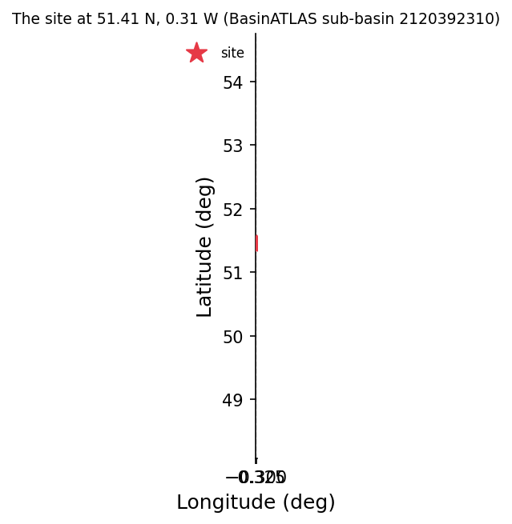
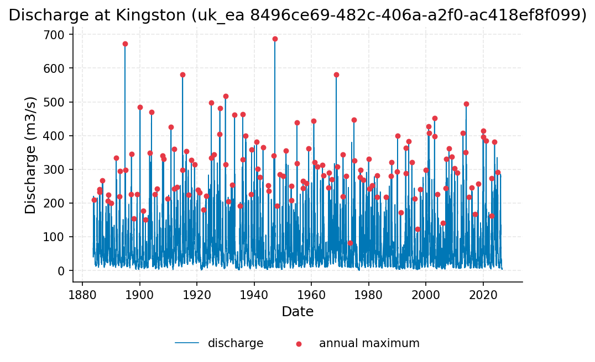
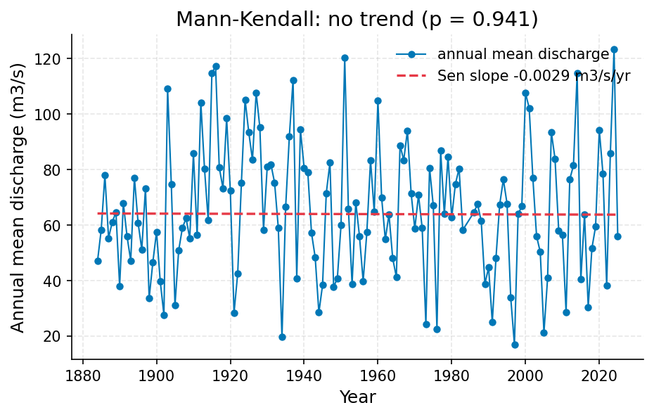
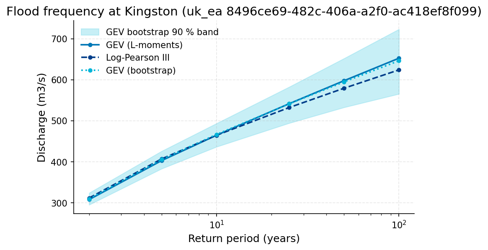
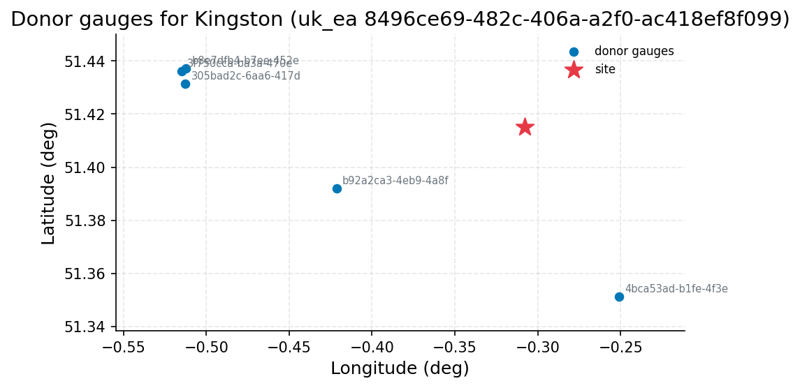
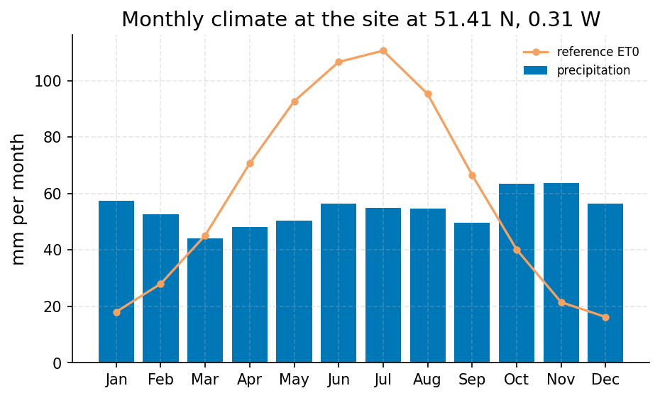
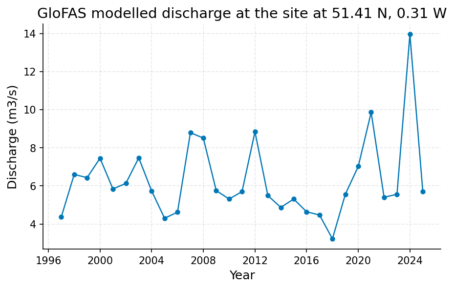

# Design Flow for the Kingston Road Bridge: 100-Year Discharge of the Thames at Kingston

**Author:** AquaScope Studio  
**Date:** 2026-09-14  
**Description:** size the design flow for a new road bridge over the Thames at Kingston  
**Data Sources:** BasinATLAS (HydroATLAS v1.0), ERA5 via Open-Meteo, similar_basins, uk_ea  
**Version:** 1.0  

**Site:** 51.4150 N, 0.3080 W

**Answer.** Size the new Kingston road bridge for a 100-year design discharge of about 652.5 m3/s (GEV by L-moments), graded indicative, carried with a 90% bootstrap band of 565.4-723.1 m3/s. This comes from 142.9 years of daily discharge at UK Environment Agency station Kingston (8496ce69-482c-406a-a2f0-ac418ef8f099), 1883-10-01 to 2026-09-09. A Log-Pearson III fit on the same record gives 624.0 m3/s (90% interval 573.2-679.4 m3/s), within about 5% of the GEV value. A GloFAS cross-check at the site could not be used: the modelled grid-cell series (mean 0.85 m3/s) does not represent the gauged catchment (mean 65.52 m3/s).

*Key numbers*

| Quantity | Value | Unit | Step |
| --- | --- | --- | --- |
| Upstream area | 9991.0 | km2 | s1 |
| Record length | 142.9 | years | s3 |
| Mean of the record | 65.52 | m3/s | s2 |
| 100-year return level, GEV (L-moments) | 652.5 | m3/s | s3 |
| 100-year return level, Log-Pearson III | 624.0 | m3/s | s3 |
| 100-year LP3 90 % interval, low | 573.2 | m3/s | s3 |
| 100-year LP3 90 % interval, high | 679.4 | m3/s | s3 |
| Q95 (exceeded 95 % of days) | 7.52 | m3/s | s2 |
| Q50 (median flow) | 39.9 | m3/s | s2 |
| Q10 | 162.0 | m3/s | s2 |
| Mann-Kendall p-value (annual mean) | 0.9411 |  | s2 |
| Sen's slope | -0.0029 | m3/s per year | s2 |
| 2-year return level, GEV (L-moments) | 307.9 | m3/s | s3 |
| 2-year return level, Log-Pearson III | 311.8 | m3/s | s3 |
| 5-year return level, GEV (L-moments) | 403.0 | m3/s | s3 |
| 5-year return level, Log-Pearson III | 407.1 | m3/s | s3 |
| 10-year return level, GEV (L-moments) | 464.8 | m3/s | s3 |
| 10-year return level, Log-Pearson III | 464.7 | m3/s | s3 |
| 25-year return level, GEV (L-moments) | 541.6 | m3/s | s3 |
| 25-year return level, Log-Pearson III | 532.2 | m3/s | s3 |
| 50-year return level, GEV (L-moments) | 597.6 | m3/s | s3 |
| 50-year return level, Log-Pearson III | 579.3 | m3/s | s3 |
| 100-year GEV bootstrap 90 % interval, low | 565.4 | m3/s | s3 |
| 100-year GEV bootstrap 90 % interval, high | 723.1 | m3/s | s3 |
| Donor gauges | 5.0 |  | s3.fallback |
| ERA5 precipitation | 651.8 | mm per year | s4 |
| ERA5 reference evapotranspiration | 708.7 | mm per year | s4 |
| Aridity index | 0.9198 |  | s4 |
| GloFAS mean discharge (cell) | 0.8471 | m3/s | s4 |

## Summary

The 100-year flood discharge for the Thames at Kingston is estimated at 652.5 m3/s (GEV, L-moments) with a 90% band of 565.4-723.1 m3/s, from 142.9 years of daily discharge at EA station Kingston (8496ce69-482c-406a-a2f0-ac418ef8f099). A Log-Pearson III fit on the same series gives 624.0 m3/s (573.2-679.4 m3/s), agreeing within about 5%. No trend was found in annual means (p=0.9411) or annual maxima (p=0.1784). The catchment (9990.7 km2 upstream, 0% degree of regulation) supports a stationary, largely natural-flow assumption. A GloFAS cross-check failed: its modelled mean of 0.8471 m3/s is roughly 77 times smaller than the gauge mean (65.52 m3/s), so it gives no usable corroboration. The overall grade is indicative.

## The decision

Decide the bridge's design discharge using the at-site GEV (L-moments) 100-year estimate of 652.5 m3/s from EA station Kingston (8496ce69-482c-406a-a2f0-ac418ef8f099, 142.9 years), carried with a 90% bootstrap band of 565.4-723.1 m3/s. The grade is indicative, not established: the automated spread_within gate comparing GEV and LP3 did not resolve a value, and the GloFAS cross-check gate failed for lack of a valid reference. Conditions: no significant trend in the annual mean (p=0.9411) or annual maxima (p=0.1784) series; GEV and LP3 100-year point estimates agree within about 5% (652.5 vs 624.0 m3/s); the 1894 record maximum of 800 m3/s sits within the fit_envelopes_max tolerance (ratio 1.18 against a 1.25 cap); catchment degree of regulation is 0%. What would change it: a resolved spread_within computation, a GloFAS or modelled series matched to the actual 9990.7 km2 catchment, and confirmation of whether the 800 m3/s 1894 peak is instantaneous or a daily mean.

## Findings

First, indicative: the Log-Pearson III 100-year estimate on the Kingston record is 624.0 m3/s, within about 4.6% of the GEV (L-moments) value of 652.5 m3/s. Second, indicative: the spread_within gate meant to certify this agreement did not compute a value, but the manual ratio (about 1.05) is well inside the 25% tolerance it was meant to enforce. Third, not established: the GloFAS cross-check at this point is unusable, as the modelled grid-cell mean discharge (0.8471 m3/s) is roughly 77 times smaller than the gauge's mean (65.5171 m3/s), so the cross_check_ratio gate had no valid reference and the model does not represent the same drainage area.

## Problem and decision

A new road bridge is to cross the Thames at Kingston. The design requires the 100-year return-period flood discharge (m3/s) with its uncertainty band, sized against a stationary flood-frequency analysis of the gauged record, cross-checked where possible against an independent regional estimate.

## Site and data

The bridge site (51.415N, -0.308E) drains an upstream catchment of 9990.7 km2 (HydroATLAS, sub-basin 2120392310), comprising 79 level-12 sub-basins. Mean elevation is 109 m, mean slope 2 degrees, mean annual precipitation 684 mm/yr, PET 695 mm/yr, AET 518 mm/yr, aridity index 0.98, mean temperature 9.6 C, snow cover 8%. Land cover is 44% cropland, 22% urban, 16% pasture, 2% forest. HydroATLAS records 0% degree of regulation and 0 million m3 reservoir volume upstream, supporting the natural-flow assumption. Mean annual natural discharge at the outlet is 84.65 m3/s (basinatlas_upstream, dis_m3_pyr).

## Methodology

Four steps: (1) describe_catchment characterized the upstream basin via HydroATLAS to confirm limited regulation; (2) analyze_station ran a Mann-Kendall trend test on the Kingston annual maxima and annual means to test stationarity; (3) flood_frequency fitted GEV by L-moments and Log-Pearson III to 140 years of annual maxima, with a 1000-resample bootstrap confidence interval on the GEV fit, comparing the spread between fits; (4) anywhere queried GloFAS modelled discharge at the same point as an independent regional cross-check.

## Results: step s1

Upstream area is 9990.7 km2 (also given as 9990.8 km2 in the attribute block), gated against a 50,000 km2 ceiling (passed). Sub-area of the outlet sub-basin is 145.0 km2. Degree of regulation is 0%, reservoir volume 0 million m3, so the record is treated as effectively unregulated. Climate: 684 mm/yr precipitation, 695 mm/yr PET, aridity index 0.98, 9.6 C mean temperature, 8% snow cover. Land use: 44% cropland, 22% urban, 16% pasture, 2% forest, 0.5% lake, 48% karst. Population 5,290,301 people at 531.99 people/km2.


*The site, in longitude and latitude (no basemap); no catalogue station was listed with it.*

*Catchment attributes from BasinATLAS for the site at 51.41 N, 0.31 W.*

| attribute | label | value | unit | source | note |
| --- | --- | --- | --- | --- | --- |
| n_sub_basins |  | 79.0 |  |  |  |
| area_km2 |  | 9990.8 |  |  |  |
| outlet_hybas_id |  | 2120392310.0 |  |  |  |
| upstream_area_km2 |  | 9990.7 |  |  |  |
| elevation_m | mean elevation | 109.0 | m | basinatlas_upstream |  |
| slope_deg | mean slope | 2.0 | degrees | basinatlas_upstream |  |
| precipitation_mm_yr | annual precipitation (WorldClim) | 684.0 | mm/yr | basinatlas_upstream |  |
| pet_mm_yr | annual potential evapotranspiration | 695.0 | mm/yr | basinatlas_upstream |  |
| aet_mm_yr | annual actual evapotranspiration | 518.0 | mm/yr | basinatlas_upstream |  |
| aridity_index | aridity index (P/PET) | 0.98 | P/PET | basinatlas_upstream |  |
| temperature_c | mean annual air temperature | 9.6 | °C | basinatlas_upstream |  |
| snow_cover_pct | annual snow cover extent | 8.0 | % | basinatlas_upstream |  |
| runoff_mm_yr | annual land-surface runoff | 310.48 | mm/yr | area_weighted_mean |  |
| discharge_m3s | mean annual natural discharge at the outlet | 84.65 | m3/s | basinatlas_upstream |  |
| forest_pct | forest cover | 2.0 | % | basinatlas_upstream |  |
| cropland_pct | cropland | 44.0 | % | basinatlas_upstream |  |
| pasture_pct | pasture | 16.0 | % | basinatlas_upstream |  |
| urban_pct | urban extent | 22.0 | % | basinatlas_upstream |  |
| irrigated_pct | irrigated area | 0.0 | % | basinatlas_upstream |  |
| glacier_pct | glacier extent | 0.0 | % | basinatlas_upstream |  |
| wetland_pct | wetlands (all classes) | 0.0 | % | basinatlas_upstream |  |
| lake_pct | lake area | 0.5 | % | basinatlas_upstream |  |
| karst_pct | karst extent | 48.0 | % | basinatlas_upstream |  |
| clay_pct | clay fraction in soil | 19.0 | % | basinatlas_upstream |  |
| silt_pct | silt fraction in soil | 37.0 | % | basinatlas_upstream |  |
| sand_pct | sand fraction in soil | 44.0 | % | basinatlas_upstream |  |
| soil_organic_carbon_t_ha | soil organic carbon | 45.0 | t/ha | basinatlas_upstream |  |
| soil_water_pct | annual soil water content | 81.0 | % | basinatlas_upstream |  |
| groundwater_table_cm | groundwater table depth | 151.86 | cm | area_weighted_mean |  |
| population_density | population density | 531.99 | people/km2 | basinatlas_upstream |  |
| population | population count | 5290300.78 | people | basinatlas_upstream |  |
| degree_of_regulation_pct | degree of regulation by reservoirs | 0.0 | % | basinatlas_upstream |  |
| human_footprint_2009 | human footprint (2009) | 30.7 | index 0-50 | basinatlas_upstream |  |
| reservoir_volume_mcm | reservoir volume upstream | 0.0 | million m3 | basinatlas_upstream |  |

## Results: step s2

The Kingston discharge record (uk_ea, 8496ce69-482c-406a-a2f0-ac418ef8f099) spans 142.9 years (1883-10-01 to 2026-09-09), n=51,947 daily values, mean 65.5171 m3/s, median 40.027 m3/s, min 0.01 m3/s, max 800.0 m3/s. FDC values: Q95=7.52 m3/s, Q50=39.9 m3/s, Q10=162.0 m3/s. Mann-Kendall on annual means: p=0.9411, tau=-0.0043, Sen's slope -0.0029 m3/s/yr, 'no trend'. On annual maxima: p=0.1784, tau=0.0769, Sen's slope 0.2906 m3/s/yr, 'no trend'. The 1894 record maximum of 800.0 m3/s has an empirical return period of 141.0 years (Weibull plotting position, n=140).


*Discharge at Kingston (uk_ea 8496ce69-482c-406a-a2f0-ac418ef8f099), 1883 to 2026, with the annual maxima marked.*


*Annual mean discharge at Kingston (uk_ea 8496ce69-482c-406a-a2f0-ac418ef8f099) with the Sen slope line; the Mann-Kendall test finds no trend (p = 0.941, 140 years).*

*The record (17316 rows) is in the workbook (`workbook.xlsx`, sheet `s2_series`) and the notebook, not printed here.*

*Summary of the record at Kingston (uk_ea 8496ce69-482c-406a-a2f0-ac418ef8f099).*

| item | value |
| --- | --- |
| source | uk_ea |
| station_id | 8496ce69-482c-406a-a2f0-ac418ef8f099 |
| variable | discharge |
| unit | m3/s |
| n | 51947 |
| start | 1883-10-01 |
| end | 2026-09-09 |
| years | 142.9 |
| stats.mean | 65.5171 |
| stats.median | 40.027 |
| stats.min | 0.01 |
| stats.max | 800.0 |

*Annual maxima at Kingston (uk_ea 8496ce69-482c-406a-a2f0-ac418ef8f099).*

| year | value |
| --- | --- |
| 1884 | 227.0 |
| 1885 | 240.0 |
| 1886 | 236.0 |
| 1887 | 279.0 |
| 1888 | 206.0 |
| 1889 | 233.0 |
| 1890 | 200.0 |
| 1891 | 334.0 |
| 1892 | 231.0 |
| 1893 | 295.0 |
| 1894 | 800.0 |
| 1895 | 299.0 |
| 1896 | 226.0 |
| 1897 | 346.0 |
| 1898 | 183.0 |
| 1899 | 257.0 |
| 1900 | 527.0 |
| 1901 | 196.0 |
| 1902 | 151.0 |
| 1903 | 377.0 |
| 1904 | 510.0 |
| 1905 | 227.0 |
| 1906 | 245.0 |
| 1907 | 371.0 |
| 1908 | 330.0 |
| 1909 | 221.0 |
| 1910 | 425.0 |
| 1911 | 267.0 |
| 1912 | 360.0 |
| 1913 | 247.0 |
| 1914 | 298.0 |
| 1915 | 581.0 |
| 1916 | 362.0 |
| 1917 | 230.0 |
| 1918 | 347.0 |
| 1919 | 327.0 |
| 1920 | 247.0 |
| 1921 | 231.0 |
| 1922 | 193.0 |
| 1923 | 221.0 |
| 1924 | 334.0 |
| 1925 | 514.0 |
| 1926 | 364.0 |
| 1927 | 450.0 |
| 1928 | 522.0 |
| 1929 | 547.0 |
| 1930 | 314.0 |
| 1931 | 218.0 |
| 1932 | 268.0 |
| 1933 | 468.0 |

*Return levels at Kingston (uk_ea 8496ce69-482c-406a-a2f0-ac418ef8f099) by return period, with the confidence band.*

| T | GEV | LP3 | lower | upper |
| --- | --- | --- | --- | --- |
| 2.0 | 307.917 | 311.75 | 297.7184 | 326.4429 |
| 5.0 | 403.0441 | 407.1086 | 385.6949 | 429.7112 |
| 10.0 | 464.8468 | 464.6854 | 436.7122 | 494.4503 |
| 25.0 | 541.616 | 532.2235 | 495.2459 | 571.9622 |
| 50.0 | 597.6318 | 579.3046 | 535.4148 | 626.7922 |
| 100.0 | 652.4577 | 624.0012 | 573.1555 | 679.3576 |

*Flow-duration percentiles at Kingston (uk_ea 8496ce69-482c-406a-a2f0-ac418ef8f099).*

| exceedance_pct | value |
| --- | --- |
| 10.0 | 162.0 |
| 50.0 | 39.9 |
| 95.0 | 7.52 |

*Mann-Kendall trend test and Sen slope at Kingston (uk_ea 8496ce69-482c-406a-a2f0-ac418ef8f099).*

| item | value |
| --- | --- |
| on | annual mean |
| p_value | 0.9411 |
| tau | -0.0043 |
| trend | no trend |
| sens_slope_per_year | -0.0029 |
| n_years | 140 |

## Results: step s3

GEV by L-moments gives 100-year discharge 652.4577 m3/s (params k=0.0201, loc=276.6904, scale=85.5128); the fit places the 1894 record max at 679.2704 m3/s (ratio to observed 800.0 m3/s = 1.18, within the 1.25 envelope cap). Log-Pearson III gives 624.0012 m3/s with analytical 90% interval [573.1555, 679.3576] m3/s. A separate MLE-GEV bootstrap (1000 resamples, 0 discarded) gives a point estimate of 646.2384 m3/s with 90% interval [565.4195, 723.1096] m3/s. The min_years, ci_finite and fit_envelopes_max gates passed; the spread_within gate failed to resolve a value, and agreement between the GEV and LP3 fits was checked manually instead, per the gates block.


*Return levels of annual maximum discharge at Kingston (uk_ea 8496ce69-482c-406a-a2f0-ac418ef8f099): GEV (L-moments) and Log-Pearson III fits with the GEV bootstrap 90 % band.*


*The site and the 5 donor gauges the similarity search selected, in longitude and latitude (no basemap); labels are the station ids.*

*Return levels at Kingston (uk_ea 8496ce69-482c-406a-a2f0-ac418ef8f099) by return period, with the confidence band.*

| T | GEV | LP3 | lower | upper |
| --- | --- | --- | --- | --- |
| 2.0 | 307.917 | 311.75 | 295.1933 | 323.9715 |
| 5.0 | 403.0441 | 407.1086 | 383.2295 | 425.9326 |
| 10.0 | 464.8468 | 464.6854 | 436.5283 | 493.5379 |
| 25.0 | 541.616 | 532.2235 | 494.2591 | 582.3356 |
| 50.0 | 597.6318 | 579.3046 | 532.6547 | 651.8774 |
| 100.0 | 652.4577 | 624.0012 | 565.4195 | 723.1096 |

*Spread between the GEV and Log-Pearson III return levels at Kingston (uk_ea 8496ce69-482c-406a-a2f0-ac418ef8f099).*

| T | GEV | LP3 | spread_pct |
| --- | --- | --- | --- |
| 2.0 | 307.917 | 311.75 | 1.2 |
| 5.0 | 403.0441 | 407.1086 | 1.0 |
| 10.0 | 464.8468 | 464.6854 | 0.0 |
| 25.0 | 541.616 | 532.2235 | 1.7 |
| 50.0 | 597.6318 | 579.3046 | 3.1 |
| 100.0 | 652.4577 | 624.0012 | 4.5 |

*Donor gauges selected for Kingston (uk_ea 8496ce69-482c-406a-a2f0-ac418ef8f099).*

| source | station_id | name | latitude | longitude | distance_km | score | similarity_distance | up_area_km2 | period_start | period_end |
| --- | --- | --- | --- | --- | --- | --- | --- | --- | --- | --- |
| uk_ea | 4bca53ad-b1fe-4f3e-bc5e-32858fcfc96d | Bourne Hall Ponds | 51.351208 | -0.25099 | 8.2 | 0.0163 | 0.0007 | 9990.7 | 2009-11-11 |  |
| uk_ea | b92a2ca3-4eb9-4a8f-b82f-8bbc2a1dfbc9 | Walton | 51.3919 | -0.421389 | 8.3 | 0.0423 | 0.0389 | 9366.6 | 1991-08-10 |  |
| uk_ea | b8e7dfb4-b7ee-452e-976f-1e59a1a661a4 | Staines (Trading Estate) | 51.437123 | -0.512241 | 14.4 | 0.0845 | 0.0794 | 8213.7 | 1999-03-10 |  |
| uk_ea | 305bad2c-6aa6-417d-a101-698edc850bbd | Staines | 51.431508 | -0.512582 | 14.3 | 0.0845 | 0.0795 | 8213.7 | 1990-10-09 |  |
| uk_ea | 3f750cca-ba3a-470e-b320-ea12543343c1 | Pound Mill | 51.43615 | -0.514892 | 14.6 | 0.0846 | 0.0794 | 8213.7 | 1993-11-10 |  |

## Results: step s4

GloFAS modelled discharge for the grid cell (about 5 km, 1997-01-02 to 2026-09-07, 29.7 years, n=10,841) has mean 0.8471 m3/s, median 0.55 m3/s, max 13.96 m3/s (2024, empirical return period 30.0 years). Its 100-year fits are 14.7708 m3/s (GEV, L-moments) and 13.9498 m3/s (LP3) - roughly 40-45 times smaller than the at-site 100-year estimate (652.4577 m3/s GEV) and not usable as a cross-check; the cross_check_ratio gate failed for lack of a valid reference. ERA5 climate context: precipitation 651.8 mm/yr, ET0 708.7 mm/yr, aridity index 0.9198 (humid), mean temperature 10.97 C.


*Mean monthly precipitation (bars) and FAO-56 reference evapotranspiration (line) for the ERA5 cell at the site at 51.41 N, 0.31 W, 40 years ending 2026-09-07.*


*Annual maxima of the modelled discharge from GloFAS v4 (Open-Meteo) for the grid cell at the site at 51.41 N, 0.31 W, 1997 to 2026: a model output, indicative only, not a gauge reading.*

*Mean monthly precipitation and reference evapotranspiration for the ERA5 cell at the site at 51.41 N, 0.31 W.*

| month | precipitation_mm | et0_mm |
| --- | --- | --- |
| 1 | 57.4408 | 18.0718 |
| 2 | 52.6396 | 27.9911 |
| 3 | 44.1331 | 45.1587 |
| 4 | 47.9887 | 70.6386 |
| 5 | 50.2874 | 92.6599 |
| 6 | 56.4205 | 106.592 |
| 7 | 54.846 | 110.5912 |
| 8 | 54.603 | 95.2519 |
| 9 | 49.6798 | 66.5506 |
| 10 | 63.3397 | 40.1351 |
| 11 | 63.7972 | 21.4795 |
| 12 | 56.4662 | 16.2437 |

*GloFAS modelled discharge for the grid cell at the site at 51.41 N, 0.31 W (indicative).*

| item | value |
| --- | --- |
| variable | discharge |
| unit | m3/s |
| n | 10841 |
| start | 1997-01-02 |
| end | 2026-09-07 |
| years | 29.7 |
| stats.mean | 0.8471 |
| stats.median | 0.55 |
| stats.min | 0.16 |
| stats.max | 13.96 |
| sampling.n | 10841 |
| sampling.span_years | 29.7 |
| sampling.per_year | 365.02 |
| sampling.inferred_resolution | daily |
| trend.on | annual mean |
| trend.p_value | 0.3881 |
| trend.tau | -0.1158 |
| trend.trend | no trend |
| trend.sens_slope_per_year | -0.0021 |
| trend.n_years | 29 |
| source | GloFAS v4 (modelled) via Open-Meteo |
| modelled | True |
| return_level_T2_gev | 5.7499 |
| return_level_T5_gev | 7.4492 |
| return_level_T10_gev | 8.8155 |
| return_level_T25_gev | 10.876 |
| return_level_T50_gev | 12.6892 |
| return_level_T100_gev | 14.7708 |
| q10 | 1.84 |
| q50 | 0.55 |
| q95 | 0.22 |

## Limitations and what this study does not establish

The spread_within gate (GEV vs LP3 agreement) and the cross_check_ratio gate (GloFAS vs at-site) both failed to resolve; agreement was assessed manually instead. GloFAS's mismatch (0.85 vs 65.52 m3/s mean) means no independent regional check exists for this site. The estimate assumes daily resolution for the Kingston record (not explicitly confirmed by the catalog), 142.9 years as sufficient for a defensible fit, and negligible upstream regulation (0% HydroATLAS degree of regulation). No cause is asserted for any trend, and none is significant (p=0.9411, p=0.1784). Climate-change nonstationarity is not modelled; the estimate is stationary, and any climate-change adjustment would need to be applied as a separate overlay. Whether the 800 m3/s 1894 peak is instantaneous or a daily mean is unconfirmed and affects the envelope check.

## What this study does not establish

- Step s3, gate spread_within: spread_within needs two or more paths and a value
- Step s4, gate cross_check_ratio: no reference number to compare with (the gate's reference did not resolve)

## Caveats

- Design-flood guidance under climate change is immature (Wasko et al. 2024, HESS): the estimate here is stationary, and any climate scenario is an overlay on it, not a nonstationary fit.
- Rare quantiles move with the distribution and the estimator. Two fits (GEV by L-moments and Log-Pearson III) are quoted with their intervals and the spread between them; a spread above 25 percent is reported as disagreement, not averaged away.

## Recommendations

Adopt 652.5 m3/s (GEV, L-moments) as the 100-year design discharge, with a 90% uncertainty band of 565.4-723.1 m3/s, conditional on the stationarity and no-regulation assumptions holding and on the LP3 cross-fit (624.0 m3/s) remaining within about 5% agreement. Before finalizing, obtain a resolved spread_within calculation to formally certify GEV-LP3 agreement, a GloFAS or other modelled series matched to the true 9990.7 km2 catchment for a genuine independent check, and confirmation of whether the 1894 peak of 800 m3/s is instantaneous or daily-averaged. Do not adopt a nonstationary or climate-adjusted design flow on this basis; the study supports only a stationary estimate.

## References

1. Mann, H. B. (1945). Nonparametric tests against trend. Econometrica, 13, 245-259
2. Kendall (1975)
3. Sen, P. K. (1968). J. Am. Stat. Assoc., 63, 1379-1389.
4. England, J. F. et al. (2019). Guidelines for determining flood flow frequency, Bulletin 17C. USGS Techniques and Methods 4-B5.
5. Hosking, J. R. M. (1990). L-moments: analysis and estimation of distributions using linear combinations of order statistics. J. R. Stat. Soc. B, 52(1), 105-124.
6. Harrigan, S. et al. (2020). GloFAS-ERA5 operational global river discharge reanalysis 1979-present. Earth Syst. Sci. Data, 12, 2043-2060.
7. Bloeschl, G., Sivapalan, M., Wagener, T., Viglione, A., Savenije, H. (eds.) (2013). Runoff Prediction in Ungauged Basins. Cambridge University Press; Oudin, L. et al. (2008). Spatial proximity, physical similarity, regression and ungaged catchments. Water Resour. Res. 44, W03413. Attributes: HydroATLAS v1.0 (BasinATLAS), CC BY 4.0. Linke, S., Lehner, B., Ouellet Dallaire, C., et al. (2019). Global hydro-environmental sub-basin and river reach characteristics at high spatial resolution. Scientific Data 6: 283. https://doi.org/10.1038/s41597-019-0300-6
8. Vogel, R. M., & Fennessey, N. M. (1994). Flow-duration curves I: new interpretation and confidence intervals. J. Water Resour. Plann. Manage., 120(4), 485-504.
9. England, J. F. Jr. et al. (2018). Guidelines for determining flood flow frequency, Bulletin 17C. USGS Techniques and Methods 4-B5.
10. Coles, S. (2001). An Introduction to Statistical Modeling of Extreme Values. Springer.
11. Hersbach, H. et al. (2020). The ERA5 global reanalysis. Q. J. R. Meteorol. Soc., 146, 1999-2049
12. Open-Meteo.com (CC BY 4.0).
13. Allen, R. G., Pereira, L. S., Raes, D., & Smith, M. (1998). Crop evapotranspiration. FAO Irrigation and Drainage Paper 56.
14. Wasko, C. et al. (2024). A systematic review of climate change science for flood and design guidance. Hydrol. Earth Syst. Sci. 28, 1251-1285. doi:10.5194/hess-28-1251-2024
15. Nonstationary flood frequency estimates are parameter-fragile: Stoch. Environ. Res. Risk Assess. (2024), doi:10.1007/s00477-024-02680-9
16. Multi-approach cross-checks in infrastructure flood practice: J. Hydrol. (2024), doi:10.1016/j.jhydrol.2024.130698
17. Oudin, L. et al. (2008). Spatial proximity, physical similarity, regression and ungaged catchments. Water Resour. Res. 44, W03413.
18. Wasko et al. 2024, HESS
19. Rekin226 and contributors (2026). AquaScope: Open-source water data aggregation toolkit (version 0.16.0) [Software]. Zenodo. https://doi.org/10.5281/zenodo.21903143

## Appendix: reproducibility

Re-run the same steps with no model: `aquascope run study.yaml`. Resume the workspace: `aquascope studio --resume workspace.json`.

Model: claude-sonnet-5 via anthropic; ledger: consultant 1 call(s), 3938 tokens, methodologist 1 call(s), 15775 tokens, analyst 1 call(s), 7166 tokens, interpreter 1 call(s), 27618 tokens, author 1 call(s), 27952 tokens, critic 1 call(s), 22856 tokens. aquascope 0.16.0.

```yaml
# An AquaScope study (version 3): the plan behind an answer, its gates, and what happened.
#   aquascope run study.yaml
version: 3
title: "Estimate the 100-year return period flood discharge (m3/s) f: 51.415, -0.308"
question: "Design flow for a new road bridge over the Thames at Kingston: the 100-year flood with its uncertainty band."
created: "2026-09-14T15:47:10+00:00"
aquascope_version: "0.16.0"
author: "methodologist"
model: "claude-sonnet-5"
problem:
  kind: "flood_risk"
  site: {"lat": 51.415, "lon": -0.308}
  params: {"return_period": 100, "decision": "design flow"}
  text: "Design flow for a new road bridge over the Thames at Kingston: the 100-year flood with its uncertainty band."
plan:
  author: "methodologist"
  playbook: "flood_risk"
  objective: "Estimate the 100-year return period flood discharge (m3/s) for the Thames at Kingston, with an uncertainty band, to size a new road bridge."
  decision: "size the design flow for a new road bridge over the Thames at Kingston"
  methodology: ["Characterize the catchment upstream of the bridge site to confirm the flood record reflects a natural, largely unregulated basin.", "Test the Kingston discharge record for a significant trend so the stationary flood-frequency assumption can be defended or flagged.", "Fit at-site flood frequency (GEV by L-moments and Log-Pearson III) to the 143-year annual maxima with a bootstrap confidence interval and quote the spread between fits.", "Cross-check the at-site 100-year estimate against GloFAS modelled discharge for the same point as an independent regional estimate."]
  assumptions: ["discharge record at UK EA station Kingston (8496ce69-482c-406a-a2f0-ac418ef8f099) is daily resolution, as the catalog does not confirm resolution but defaults to daily", "143 years of daily discharge at this gauge is sufficient for a defensible at-site flood frequency fit", "no significant flow regulation (dams=0 in HydroATLAS) affects the flood series", "The uk_ea Kingston discharge record (8496ce69-482c-406a-a2f0-ac418ef8f099) is daily resolution, as the catalog defaults to daily when resolution is not confirmed.", "143 years of daily discharge at this gauge is sufficient for a defensible at-site flood frequency fit (sufficiency table marks at_site_flood_frequency as defensible).", "Zero dams recorded in HydroATLAS for the upstream catchment means the flood series is not materially altered by regulation.", "The 100-year return period (return_period = 100) is at most 3 times the 143 years of record, satisfying the max_return_period_factor gate."]
  alternatives: [{"method": "similar_basins (regionalization/donor gauges)", "why_not": "Marked marginal in the sufficiency table because it is meant for an ungauged point, and a 0.1 km, 143-year gauge is available here; used only as a fallback if the at-site fit fails its gates."}, {"method": "nonstationary flood frequency under climate change", "why_not": "Design-flood guidance under climate nonstationarity is immature (Wasko et al. 2024, HESS); the estimate stays stationary and climate change is carried as a caveat, not a model term."}]
  limitations_expected: ["Rare quantiles are sensitive to the chosen distribution and estimator; if the GEV L-moments and Log-Pearson III fits disagree by more than 25 percent, that disagreement is reported rather than averaged away.", "GloFAS is a modelled, coarse-resolution discharge product and may diverge materially from the at-site gauge estimate even where the catchment is well represented.", "A significant trend in the annual maxima, if found, is reported as a stationarity caveat on the estimate rather than corrected for with a nonstationary fit."]
  citations: ["England, J. F. et al. (2019). Guidelines for determining flood flow frequency, Bulletin 17C. USGS Techniques and Methods 4-B5.", "Hosking, J. R. M. (1990). L-moments: analysis and estimation of distributions using linear combinations of order statistics. J. R. Stat. Soc. B 52, 105-124.", "Wasko, C. et al. (2024). A systematic review of climate change science for flood and design guidance. Hydrol. Earth Syst. Sci. 28, 1251-1285. doi:10.5194/hess-28-1251-2024", "Nonstationary flood frequency estimates are parameter-fragile: Stoch. Environ. Res. Risk Assess. (2024), doi:10.1007/s00477-024-02680-9", "Multi-approach cross-checks in infrastructure flood practice: J. Hydrol. (2024), doi:10.1016/j.jhydrol.2024.130698", "Oudin, L. et al. (2008). Spatial proximity, physical similarity, regression and ungaged catchments. Water Resour. Res. 44, W03413.", "Harrigan, S. et al. (2020). GloFAS-ERA5 operational global river discharge reanalysis 1979-present. Earth Syst. Sci. Data 12, 2043-2060.", "Wasko et al. 2024, HESS"]
  caveats: ["Design-flood guidance under climate change is immature (Wasko et al. 2024, HESS): the estimate here is stationary, and any climate scenario is an overlay on it, not a nonstationary fit.", "Rare quantiles move with the distribution and the estimator. Two fits (GEV by L-moments and Log-Pearson III) are quoted with their intervals and the spread between them; a spread above 25 percent is reported as disagreement, not averaged away."]
  rationale: "Estimate the 100-year return period flood discharge (m3/s) for the Thames at Kingston, with an uncertainty band, to size a new road bridge."
  recon_notes: ["Record resolution is not in the catalog; daily is assumed for every variable.", "10 donor gauges from a pool of 34,786 gauged catchments.", "ERA5 temperature and forcing and GloFAS discharge are assumed reachable for any point on land (Open-Meteo); not checked here.", "CMIP6 change factors need model output you supply (aquascope.climate works on downloaded data); not counted."]
steps:
  - tool: "describe_catchment"
    id: "s1"
    rationale: "Catchment size, area and dam count (HydroATLAS) frame the estimate and confirm the record is not materially regulated."
    arguments:
      lat: 51.415
      lon: -0.308
      upstream: true
    expects:
      - {"check": "not_empty", "path": "sub_basin"}
      - {"check": "max_area_km2", "path": "sub_basin.up_area", "value": 50000}
    outputs: [{"kind": "figure", "id": "s1_site_map", "caption": "site map from describe_catchment"}, {"kind": "table", "id": "s1_catchment_attributes", "caption": "catchment attributes from describe_catchment"}]
  - tool: "analyze_station"
    id: "s2"
    rationale: "Mann-Kendall trend test on the annual maxima checks whether the stationary flood-frequency assumption is defensible before fitting."
    method: "trend_mann_kendall"
    arguments:
      source: "uk_ea"
      station_id: "8496ce69-482c-406a-a2f0-ac418ef8f099"
      variable: "discharge"
    expects:
      - {"check": "min_years", "path": "years", "value": 20}
      - {"check": "not_empty", "path": "trend"}
      - {"check": "unit_present", "path": "unit"}
      - {"check": "sampling_density", "path": "sampling", "value": "daily"}
      - {"check": "trend_on_series", "path": "ffa.amax_trend", "value": 0.05}
    outputs: [{"kind": "figure", "id": "s2_annual_maxima", "caption": "annual maxima from analyze_station"}, {"kind": "figure", "id": "s2_trend", "caption": "trend from analyze_station"}, {"kind": "table", "id": "s2_summary", "caption": "summary from analyze_station"}, {"kind": "table", "id": "s2_trend", "caption": "trend from analyze_station"}]
  - tool: "flood_frequency"
    id: "s3"
    rationale: "GEV (L-moments) and Log-Pearson III fits with a bootstrap confidence band give the primary 100-year discharge estimate and its uncertainty range."
    method: "at_site_flood_frequency"
    arguments:
      source: "uk_ea"
      station_id: "8496ce69-482c-406a-a2f0-ac418ef8f099"
      bootstrap_ci: true
      return_periods: [2, 5, 10, 25, 50, 100]
    expects:
      - {"check": "min_years", "path": "years", "value": 20}
      - {"check": "max_return_period_factor", "path": "years", "value": 3, "return_period": 100}
      - {"check": "ci_finite", "path": "ffa.fits.gev_bootstrap.ci", "return_period": 100}
      - {"check": "spread_within", "path": "ffa.fits.gev_lmoments.q, ffa.fits.lp3.q", "value": 0.25, "return_period": 100}
      - {"check": "fit_envelopes_max", "path": "ffa", "value": 0.25}
    fallback: {"step": {"tool": "similar_basins", "arguments": {"source": "uk_ea", "station_id": "8496ce69-482c-406a-a2f0-ac418ef8f099", "k": 5}, "rationale": "If the at-site fit fails its gates, donor gauges from similar catchments give a regional cross-check to quote instead.", "expects": []}}
    depends_on: ["s2"]
    outputs: [{"kind": "figure", "id": "s3_frequency_curve", "caption": "frequency curve from flood_frequency"}, {"kind": "figure", "id": "s3_annual_maxima", "caption": "annual maxima from flood_frequency"}, {"kind": "table", "id": "s3_return_levels", "caption": "return levels from flood_frequency"}, {"kind": "table", "id": "s3_fit_spread", "caption": "fit spread from flood_frequency"}]
  - tool: "anywhere"
    id: "s4"
    rationale: "GloFAS modelled discharge for the Kingston cell gives an independent regional cross-check on the at-site 100-year quantile, as the brief requires."
    method: "glofas_cross_check"
    arguments:
      lat: 51.415
      lon: -0.308
      years: 40
    expects:
      - {"check": "not_empty", "path": "climate", "repaired_from": "glofas"}
      - {"check": "cross_check_ratio", "path": "glofas.ffa.fits.gev_lmoments.q_by_T", "value": 0.5, "reference": "{{ result.s3.ffa.fits.gev_lmoments.q_by_T }}", "return_period": 100}
    depends_on: ["s3"]
    outputs: [{"kind": "figure", "id": "s4_glofas_series", "caption": "glofas series from anywhere"}, {"kind": "table", "id": "s4_glofas_summary", "caption": "glofas summary from anywhere"}]
results:
  s1: {"ok": true, "gates": [{"check": "not_empty", "passed": true, "detail": "'sub_basin' is present"}, {"check": "max_area_km2", "passed": true, "detail": "catchment of 9,991 km2 against a ceiling of 50,000 km2"}], "summary": "latitude=51.415, longitude=-0.308, license=CC-BY-4.0, attribution=HydroATLAS v1.0 (BasinATLAS), CC BY 4.0. Linke, S., Lehner, B., Ouellet Dallaire, C., et al. (2019). Global hydro-environmental sub-ba", "fallback_used": false, "sha256": "2bcacbbfd6fa6878"}
  s2: {"ok": true, "gates": [{"check": "min_years", "passed": true, "detail": "142.9 years of record, 20 needed"}, {"check": "not_empty", "passed": true, "detail": "'trend' is present"}, {"check": "unit_present", "passed": true, "detail": "unit m3/s"}, {"check": "sampling_density", "passed": true, "detail": "51947 observations in 142.9 years: 363.52 a year, about daily; daily claimed"}, {"check": "trend_on_series", "passed": true, "detail": "Mann-Kendall on the annual maxima: p = 0.178, tau = 0.08: no trend at the 0.05 level"}], "summary": "source=uk_ea, station_id=8496ce69-482c-406a-a2f0-ac418ef8f099, variable=discharge, unit=m3/s, years=142.9, start=1883-10-01, end=2026-09-09", "fallback_used": false, "sha256": "d493bbea2e615604"}
  s3: {"ok": true, "gates": [{"check": "min_years", "passed": true, "detail": "142.9 years of record, 20 needed"}, {"check": "max_return_period_factor", "passed": true, "detail": "T = 100 years against a cap of about 429 years (3 times 142.9 years of record)"}, {"check": "ci_finite", "passed": true, "detail": "finite interval [565.4, 723.1] at T = 100 years"}, {"check": "spread_within", "passed": false, "detail": "spread_within needs two or more paths and a value"}, {"check": "fit_envelopes_max", "passed": true, "detail": "record maximum 800 (1894, T about 141 years) against the gev_lmoments fit's 679.3 there: ratio 1.18 (1.25 allowed)"}], "summary": "source=uk_ea, station_id=8496ce69-482c-406a-a2f0-ac418ef8f099, unit=m3/s, years=142.9, start=1883-10-01, end=2026-09-09", "fallback_used": true, "sha256": "6712931b4645457e", "fallback": {"tool": "similar_basins", "arguments": {"source": "uk_ea", "station_id": "8496ce69-482c-406a-a2f0-ac418ef8f099", "k": 5}, "ok": true, "gates": [], "summary": "source=uk_ea, station_id=8496ce69-482c-406a-a2f0-ac418ef8f099, k=5, method=combined"}}
  s4: {"ok": true, "gates": [{"check": "not_empty", "passed": true, "detail": "'climate' is present"}, {"check": "cross_check_ratio", "passed": false, "detail": "no reference number to compare with (the gate's reference did not resolve)"}], "summary": "years=40, start=1986-09-07, end=2026-09-07", "fallback_used": false, "sha256": "374a4a32f3f979a3", "failed_reason": "gate failed: cross_check_ratio (no reference number to compare with (the gate's reference did not resolve))"}
```

## Cite this software

AquaScope Studio (2026). AquaScope: Open-source water data aggregation toolkit (version 0.16.0) [Software]. Zenodo. https://doi.org/10.5281/zenodo.21903143


---

*{'model': 'claude-sonnet-5', 'provider': 'anthropic', 'prose': 'model', 'tokens': {'consultant': {'calls': 1, 'prompt_tokens': 3299, 'completion_tokens': 639, 'cost_usd': 0.012988}, 'methodologist': {'calls': 1, 'prompt_tokens': 12736, 'completion_tokens': 3039, 'cost_usd': 0.055862}, 'analyst': {'calls': 1, 'prompt_tokens': 5990, 'completion_tokens': 1176, 'cost_usd': 0.02374}, 'interpreter': {'calls': 1, 'prompt_tokens': 18675, 'completion_tokens': 8943, 'cost_usd': 0.12678}, 'author': {'calls': 2, 'prompt_tokens': 46858, 'completion_tokens': 11181, 'cost_usd': 0.205526}, 'critic': {'calls': 1, 'prompt_tokens': 15536, 'completion_tokens': 7320, 'cost_usd': 0.104272}}, 'total_tokens': 135392, 'total_usd': 0.529168, 'budget': None, 'dropped': 0, 'aquascope_version': '0.16.0', 'date': '2026-09-14 15:52 UTC', 'workspace': 'c7c7e1a4ef68', 'plan_author': 'methodologist', 'written_by': {'answer': 'model', 'summary': 'model', 'decision': 'model', 'findings': 'model', 'problem': 'model', 'site_data': 'model', 'methodology': 'model', 'results-s1': 'model', 'results-s2': 'model', 'results-s3': 'model', 'results-s4': 'model', 'limitations': 'model', 'recommendations': 'model', 'references': 'template', 'appendix': 'template'}}*
