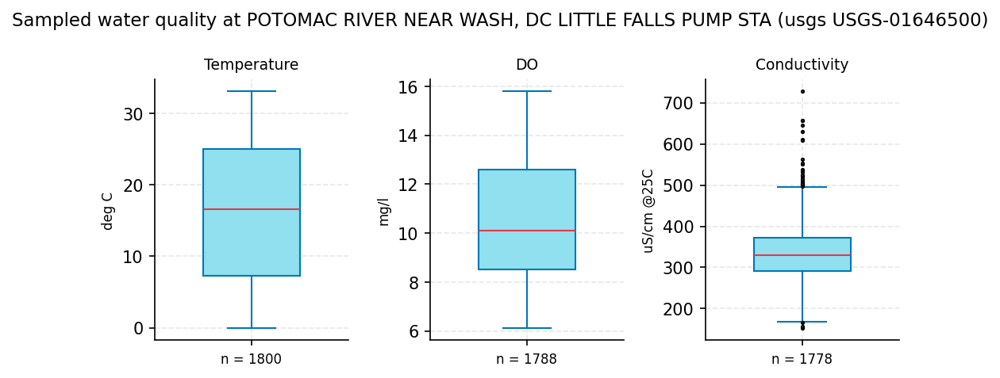
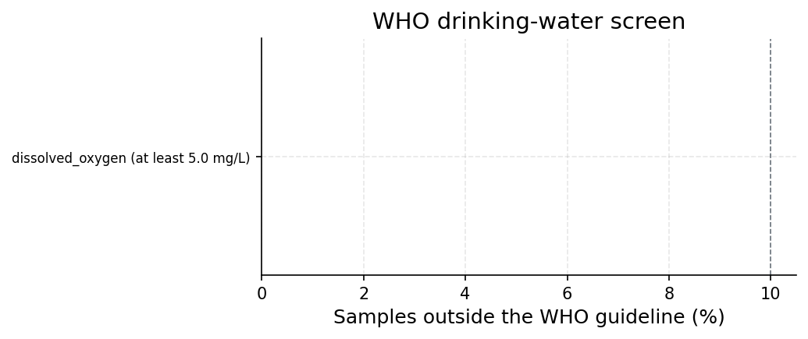
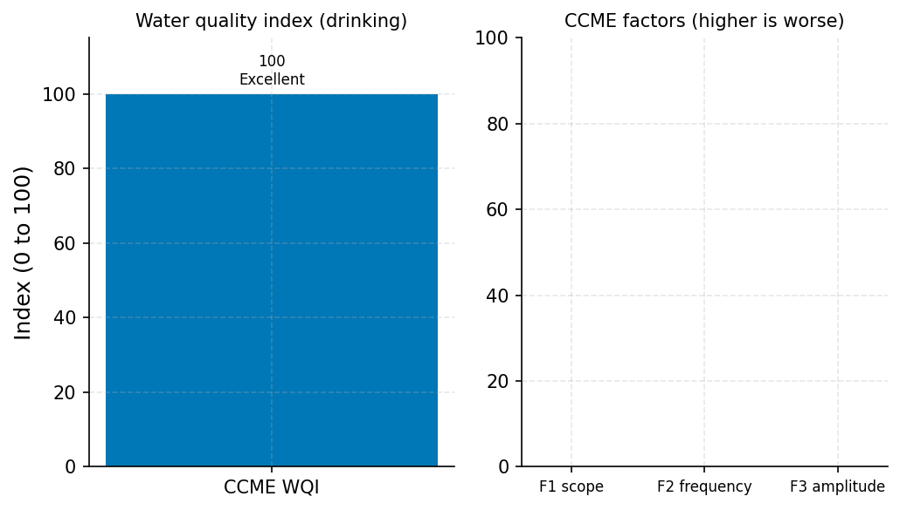

# Potomac River at Little Falls (USGS-01646500): Five-Year Drinking-Water Screening

**Author:** AquaScope Studio  
**Date:** 2026-09-14  
**Description:** risk screening  
**Data Sources:** BasinATLAS (HydroATLAS v1.0), ERA5 via Open-Meteo, similar_basins, usgs  
**Version:** 1.0  

**Site:** 38.9500 N, 77.1300 W

**Answer.** Risk screening: CCME WQI = 100 of 100 (Excellent), graded established, computed from the USGS-01646500 Potomac River near Wash DC Little Falls Pump Sta daily record (2021-09-14 to 2026-09-13). Of 5366 samples across 3 monitored parameters, only dissolved oxygen (n=1788, min 6.1 mg/L, median 10.1 mg/L, max 15.8 mg/L) carries a WHO (2022) drinking-water guideline in this screen, and none of the 1788 tests fell below the 5.0 mg/L threshold (0.0% exceedance, 0 alerts, 0 warnings). The NSF WQI could not be scored, since only 1 of its 9 required parameters (dissolved-oxygen saturation) was present, with a sub-index score (q) of 96.4 on the NSF 0-100 scale, computed from an actual saturation of 103.7314%.

*Key numbers*

| Quantity | Value | Unit | Step |
| --- | --- | --- | --- |
| Samples | 5366.0 |  | s1 |
| WHO guideline alerts | 0.0 |  | s2 |
| CCME WQI | 100.0 | of 100 | s3 |

## Summary

Five years of USGS daily water-quality data (2021-09-14 to 2026-09-13) at station USGS-01646500, Potomac River near Wash DC Little Falls Pump Sta, were screened against WHO (2022) drinking-water guidelines. Of 5366 total records spanning three parameters, only dissolved oxygen carries a recognised WHO drinking guideline in this screen; it showed zero exceedances across 1788 tests. The resulting CCME WQI is 100 of 100, category Excellent, but is built on a single qualifying parameter, well short of CCME's recommended minimum of four. The NSF WQI could not be computed, only 1 of its 9 parameters (dissolved-oxygen saturation) was available. No irrigation index was computed, as the use is drinking and no irrigation context was supplied.

## The decision

Decide the risk-screening outcome using the CCME WQI of 100 of 100 (Excellent), graded established, from USGS-01646500. No numeric band or threshold was set beyond the CCME categories (Excellent 95-100). This score is conditional on covering only the parameters actually sampled and scored, here dissolved oxygen alone, and a Good or Excellent result is a statement about those sampled parameters against the WHO (2022) guideline set, not a verdict that the water is safe to drink overall. The score would change if additional guideline-bearing parameters (nutrients, metals, bacteria, pH, turbidity) were added to the CCME calculation and any of them showed exceedances or failed tests; it would also change, or gain more standing, once the NSF WQI can be computed with at least 5 of its 9 parameters.

## Findings

Finding f1 (established): the USGS-01646500 record yields 5366 samples over 3 parameters (Conductivity, DO, Temperature) for 2021-09-14 to 2026-09-13. Finding f2 (established): the WHO (2022) screen flags 0 alerts and 0 warnings, with dissolved oxygen (n=1788) showing 0 exceedances (0.0%) against the 'at least 5.0 mg/L' rule; conductivity and temperature were not screened against a WHO drinking threshold in this pass. Finding f3 (established): the CCME WQI 1.0, computed over the single qualifying parameter (dissolved oxygen, n=1788, 0 failed tests), scores 100.0 of 100, category Excellent, with f1=f2=f3=0; the NSF WQI is not reported (score null) because only 1 of 9 required parameters was present.

## Problem and decision

The client asked for a screen of the last five years of water-quality samples of the Potomac River at Little Falls against drinking-water guidelines, to identify exceeding parameters and compute a water quality index, with an irrigation index only if relevant.

## Site and data

The water-quality record used is USGS-01646500, POTOMAC RIVER NEAR WASH, DC LITTLE FALLS PUMP STA, as pulled in step s1 for the drinking use over the last five years (2021-09-14 to 2026-09-13). This is the named Little Falls station identified in the assumptions as the record used for this screening; no station-distance or catalog-matching figures were provided in the results, so no such figures are stated here.

## Methodology

The last 5 years of sampled parameters at USGS-01646500 were pulled for the drinking use (step s1), yielding daily-mean records for Conductivity, DO and Temperature. Each sampled parameter was then screened against the WHO (2022) drinking-water guideline (step s2), flagging any exceedance as a warning and over 10% exceedance as an alert. The CCME WQI 1.0 was computed over the sampled parameters that carry a WHO guideline (step s3), and the NSF WQI was attempted over its nine standard parameters, using digitised approximations of the published NSF sub-index curves and renormalised weights where parameters are missing. IWQI was not computed, as the use is drinking, not irrigation.

## Results: step s1

USGS-01646500 returned 5366 samples over 3 parameters for 2021-09-14 to 2026-09-13 (about 5.0 years): Conductivity (n=1778, uS/cm @25C, min 152.0, median 330.0, max 728.0), Dissolved Oxygen (n=1788, mg/l, min 6.1, median 10.1, max 15.8), and Temperature (n=1800, deg C, min -0.1, median 16.6, max 33.1). All are daily-mean values per the USGS National Water Information System.


*Distribution of the sampled values per parameter at POTOMAC RIVER NEAR WASH, DC LITTLE FALLS PUMP STA (usgs USGS-01646500) (5366 samples, 2021 to 2026): box is the interquartile range, the line the median, points beyond 1.5 IQR shown singly.*

*The samples (5366 rows) is in the workbook (`workbook.xlsx`, sheet `s1_samples`) and the notebook, not printed here.*

*Samples per parameter at POTOMAC RIVER NEAR WASH, DC LITTLE FALLS PUMP STA (usgs USGS-01646500).*

| parameter | n | unit | start | end | min | median | max |
| --- | --- | --- | --- | --- | --- | --- | --- |
| Conductivity | 1778 | uS/cm @25C | 2021-09-14 | 2026-09-13 | 152.0 | 330.0 | 728.0 |
| DO | 1788 | mg/l | 2021-09-14 | 2026-09-13 | 6.1 | 10.1 | 15.8 |
| Temperature | 1800 | deg C | 2021-09-14 | 2026-09-13 | -0.1 | 16.6 | 33.1 |

## Results: step s2

The WHO (2022) drinking-water screen recognised only dissolved oxygen among the sampled parameters, applying the rule 'at least 5.0 mg/L' to 1788 tests; 0 tests exceeded (0.0%), rated OK. No warnings or alerts were raised (n_alerts=0, n_warnings=0). Conductivity and Temperature were not evaluated against a WHO drinking threshold in this pass.


*Share of samples outside the WHO drinking-water guideline per parameter; red is an alert (over 10 %), orange a warning (any exceedance), green within the guideline.*

*WHO drinking-water guideline screen per parameter.*

| parameter | rule | n | n_exceed | pct | status |
| --- | --- | --- | --- | --- | --- |
| dissolved_oxygen | at least 5.0 mg/L | 1788 | 0 | 0.0 | OK |

## Results: step s3

The CCME WQI 1.0, run over the sampled parameters with a WHO drinking guideline (here, dissolved oxygen only, n=1788, 0 failed tests), scored 100.0 of 100 (Excellent), with F1=F2=F3=0 and a note that only 1 parameter was available against CCME's recommended minimum of 4. The NSF WQI, attempted over its 9 standard parameters, found only 1 present (dissolved-oxygen saturation, q=96.4, value 103.7314%, weight 0.17 of the renormalised set); with 8 of 9 parameters missing (fecal coliform, pH, BOD, temperature change, phosphate, nitrate, turbidity, total solids), no NSF score or category is reported.


*CCME WQI of 100 (Excellent) over 1788 samples against the drinking guidelines; the CCME factors are the scope, frequency and amplitude of the exceedances.*

*Water quality index and its components.*

| item | value |
| --- | --- |
| use | drinking |
| variant | auto |
| guideline_set | drinking |
| ccme.index | ccme_wqi |
| ccme.guideline_set | drinking |
| ccme.score | 100.0 |
| ccme.category | Excellent |
| ccme.f1 | 0.0 |
| ccme.f2 | 0.0 |
| ccme.f3 | 0.0 |
| ccme.nse | 0.0 |
| ccme.n_variables | 1 |
| ccme.n_tests | 1788 |
| ccme.n_failed_variables | 0 |
| ccme.n_failed_tests | 0 |
| ccme.meets_minimum_design | False |
| ccme.period.start | 2021-09-14 |
| ccme.period.end | 2026-09-13 |
| ccme.period.years | 5.0 |
| ccme.sample_counts.dissolved_oxygen | 1788 |
| ccme.input.n_in | 5366 |
| ccme.input.n_used | 5366 |
| ccme.notes | Only 1 parameter(s) with a guideline were sampled; CCME recommends at least 4.; The index covers the sampled parameters that have a guideline in this set and nothing else. |
| ccme.citation | CCME (2001). Canadian water quality guidelines for the protection of aquatic life: CCME Water Quality Index 1.0, User's Manual. Canadian Council of Ministers of the Environment, Winnipeg. |
| nsf.index | nsf_wqi |
| nsf.complete | False |
| nsf.n_parameters | 1 |
| nsf.missing | fecal_coliform; ph; bod; temperature_change; phosphate; nitrate; turbidity; total_solids |
| nsf.weights_renormalised | True |
| nsf.period.start | 2021-09-14 |
| nsf.period.end | 2026-09-13 |
| nsf.period.years | 5.0 |
| nsf.sample_counts.conductivity | 1778 |
| nsf.sample_counts.dissolved_oxygen | 1788 |
| nsf.sample_counts.temperature | 1800 |
| nsf.input.n_in | 5366 |
| nsf.input.n_used | 5366 |
| nsf.notes | Temperature change needs a reference temperature; the parameter is left out.; Only 1 of the nine NSF parameters are present (fewer than 5); no score is reported.; The NSF sub-index curves used here are digitised approximations of the published curves. |
| nsf.citation | Brown, R. M., McClelland, N. I., Deininger, R. A. and Tozer, R. G. (1970). A water quality index: do we dare? Water and Sewage Works 117, 339-343. Sub-index curves are digitised approximations of the published rating curves. |
| index | ccme_wqi |
| score | 100.0 |
| category | Excellent |
| period.start | 2021-09-14 |
| period.end | 2026-09-13 |
| period.years | 5.0 |
| sample_counts.dissolved_oxygen | 1788 |
| n_samples | 1788 |
| unit | index, 0 to 100 |
| ccme.index | ccme_wqi |
| ccme.guideline_set | drinking |

## Limitations and what this study does not establish

The index covers only the parameters actually sampled at USGS-01646500 (Conductivity, DO, Temperature); nutrients, metals, bacteria, pH and turbidity were not sampled here and are unknown, not cleared. The CCME WQI of 100 rests on a single qualifying parameter (dissolved oxygen), far below CCME's recommended minimum of 4, so the Excellent category should be read narrowly. The NSF WQI could not be scored at all (1 of 9 parameters present). NSF sub-index curves, where used, are digitised approximations of the 1970 published curves, and weights are renormalised when parameters are missing. USGS daily values are continuous-monitor daily means; discrete Water Quality Portal sampling for nutrients, metals and bacteria was not part of this record. No cause is stated for any trend in these values.

## Caveats

- The index covers the parameters that were sampled and nothing else; a parameter that was not sampled is not cleared, it is unknown, and a Good or Excellent score is a statement about the sampled parameters, not a verdict that the water is safe for the use.
- The NSF sub-index curves used here are digitised approximations of the published rating curves (Brown et al. 1970), and the weights are renormalised when some of the nine parameters are missing.
- Guideline values are the WHO (2022) drinking-water guidelines (4th edition with addenda), as the WHO screen carries them.
- USGS daily water-quality values are a continuous monitor's daily means for temperature, specific conductance, dissolved oxygen and pH; nutrients, metals and bacteria come from discrete sampling (the Water Quality Portal) and are not in a USGS daily record.

## Recommendations

Adopt the CCME WQI of 100 of 100 (Excellent) as the current screening result for dissolved oxygen at USGS-01646500 over 2021-2026, on the condition that this reflects only dissolved oxygen and not a full drinking-water clearance. To firm this up, obtain discrete Water Quality Portal or utility sampling data for the remaining WHO-guideline parameters not captured in the USGS daily record (nutrients, metals, bacteria, pH, turbidity), so the CCME WQI can be computed over at least 4 parameters as recommended, and so the NSF WQI (needing at least 5 of its 9 parameters) can be scored. Do not extend this Excellent rating to an overall drinking-water safety verdict without that additional parameter coverage.

## References

1. CCME (2001). Canadian water quality guidelines for the protection of aquatic life: CCME Water Quality Index 1.0, User's Manual. Canadian Council of Ministers of the Environment, Winnipeg.
2. Brown, R. M., McClelland, N. I., Deininger, R. A. and Tozer, R. G. (1970). A water quality index: do we dare? Water and Sewage Works 117, 339-343.
3. WHO (2022) Guidelines for drinking-water quality, 4th edition with addenda
4. Ayers, R. S. and Westcot, D. W. (1985). Water quality for agriculture. FAO Irrigation and Drainage Paper 29, Rev. 1. FAO, Rome.
5. World Health Organization (2022). Guidelines for drinking-water quality, 4th edition, incorporating the first and second addenda. WHO, Geneva.
6. Richards, L. A. (ed.) (1954). Diagnosis and improvement of saline and alkali soils. USDA Handbook 60
7. Wilcox, L. V. (1955). Classification and use of irrigation waters. USDA Circular 969.
8. WQI with PCA as the descriptive pair in current applications: Sustainability 16 (2024), doi:10.3390/su16135644; Water 16 (2024), doi:10.3390/w16111570.
9. Irrigation suitability indices (SAR, RSC, sodium percentage) in current applications: Water 16 (2024), doi:10.3390/w16020264.
10. CCME Water Quality Index 1.0
11. Rekin226 and contributors (2026). AquaScope: Open-source water data aggregation toolkit (version 0.16.0) [Software]. Zenodo. https://doi.org/10.5281/zenodo.21903143

## Appendix: reproducibility

Re-run the same steps with no model: `aquascope run study.yaml`. Resume the workspace: `aquascope studio --resume workspace.json`.

Model: claude-sonnet-5 via anthropic; ledger: consultant 1 call(s), 3674 tokens, methodologist 1 call(s), 12284 tokens, interpreter 1 call(s), 8173 tokens, author 1 call(s), 11847 tokens, critic 1 call(s), 12549 tokens. aquascope 0.16.0.

```yaml
# An AquaScope study (version 3): the plan behind an answer, its gates, and what happened.
#   aquascope run study.yaml
version: 3
title: "Screen the last five years of water-quality samples of the P: 38.95, -77.13"
question: "Screen the last five years of water-quality samples of the Potomac at Little Falls against the drinking-water guidelines: which parameters exceed, and what is the index?"
created: "2026-09-14T22:20:58+00:00"
aquascope_version: "0.16.0"
author: "methodologist"
model: "claude-sonnet-5"
problem:
  kind: "water_quality"
  site: {"lat": 38.95, "lon": -77.13}
  params: {"use": "drinking", "years": 5, "health_verdict": false}
  text: "Screen the last five years of water-quality samples of the Potomac at Little Falls against the drinking-water guidelines: which parameters exceed, and what is the index?"
plan:
  author: "methodologist"
  playbook: "water_quality"
  objective: "Screen the last five years of water-quality samples of the Potomac River near Washington, DC at Little Falls Pump Station (USGS-01646500) against the WHO (2022) drinking-water guidelines, identify which parameters exceed, and compute a water quality index (WQI)."
  decision: "risk screening"
  methodology: ["Pull the last 5 years of sampled water-quality parameters at USGS-01646500 for the drinking-water use, as tidy rows with per-parameter counts and units.", "Screen each sampled parameter against the WHO (2022) drinking-water guideline to flag warnings and alerts.", "Compute the CCME WQI 1.0 (and NSF WQI where enough of its nine parameters are present) over the sampled parameters against the WHO (2022) drinking-water guidelines to produce a single index and category."]
  assumptions: ["station USGS-01646500 (Potomac River near Wash, DC, Little Falls Pump Sta) is the water-quality record used, being the named Little Falls site with a water_quality variable at 0.2 km from the point", "daily resolution assumed for the water-quality record per catalog note", "health_verdict left at its default (false) since the client did not ask for a health-risk narrative", "Station USGS-01646500 (Potomac River near Wash, DC, Little Falls Pump Sta) is the water-quality record used, being the named Little Falls site with a water_quality variable at 0.2 km from the point.", "Daily resolution is assumed for the water-quality record per catalog note.", "IWQI is not computed because the brief's use is drinking, not irrigation; no crop or irrigation context was supplied, so IWQI is not relevant here.", "health_verdict is left at its default (false) since the client asked for a screening and index, not a health-risk narrative."]
  alternatives: [{"method": "iwqi", "why_not": "The brief's use is drinking-water screening, not irrigation suitability; no crop or irrigation context makes IWQI relevant here."}]
  limitations_expected: ["The index covers only the parameters that were sampled; anything not sampled is unknown, not cleared.", "A Good or Excellent WQI score is a statement about the sampled parameters against the guideline set, not a verdict that the water is safe to drink.", "NSF sub-index curves, when used, are digitised approximations of the published rating curves and weights are renormalised when parameters are missing.", "USGS daily water-quality values are continuous-monitor daily means for temperature, specific conductance, dissolved oxygen and pH; nutrients, metals and bacteria come from discrete sampling and may have sparser counts."]
  citations: ["CCME (2001). Canadian water quality guidelines for the protection of aquatic life: CCME Water Quality Index 1.0, User's Manual. Canadian Council of Ministers of the Environment, Winnipeg.", "Brown, R. M., McClelland, N. I., Deininger, R. A. and Tozer, R. G. (1970). A water quality index: do we dare? Water and Sewage Works 117, 339-343.", "World Health Organization (2022). Guidelines for drinking-water quality, 4th edition, incorporating the first and second addenda. WHO, Geneva.", "Ayers, R. S. and Westcot, D. W. (1985). Water quality for agriculture. FAO Irrigation and Drainage Paper 29, Rev. 1. FAO, Rome.", "Richards, L. A. (ed.) (1954). Diagnosis and improvement of saline and alkali soils. USDA Handbook 60; Wilcox, L. V. (1955). Classification and use of irrigation waters. USDA Circular 969.", "WQI with PCA as the descriptive pair in current applications: Sustainability 16 (2024), doi:10.3390/su16135644; Water 16 (2024), doi:10.3390/w16111570.", "Irrigation suitability indices (SAR, RSC, sodium percentage) in current applications: Water 16 (2024), doi:10.3390/w16020264.", "WHO (2022) Guidelines for drinking-water quality, 4th edition with addenda", "CCME Water Quality Index 1.0", "Brown et al. 1970 (NSF WQI rating curves)"]
  caveats: ["The index covers the parameters that were sampled and nothing else; a parameter that was not sampled is not cleared, it is unknown, and a Good or Excellent score is a statement about the sampled parameters, not a verdict that the water is safe for the use.", "The NSF sub-index curves used here are digitised approximations of the published rating curves (Brown et al. 1970), and the weights are renormalised when some of the nine parameters are missing.", "Guideline values are the WHO (2022) drinking-water guidelines (4th edition with addenda), as the WHO screen carries them.", "USGS daily water-quality values are a continuous monitor's daily means for temperature, specific conductance, dissolved oxygen and pH; nutrients, metals and bacteria come from discrete sampling (the Water Quality Portal) and are not in a USGS daily record."]
  rationale: "Screen the last five years of water-quality samples of the Potomac River near Washington, DC at Little Falls Pump Station (USGS-01646500) against the WHO (2022) drinking-water guidelines, identify which parameters exceed, and compute a water quality index (WQI)."
  recon_notes: ["Record resolution is not in the catalog; daily is assumed for every variable.", "10 donor gauges from a pool of 34,786 gauged catchments.", "ERA5 temperature and forcing and GloFAS discharge are assumed reachable for any point on land (Open-Meteo); not checked here.", "CMIP6 change factors need model output you supply (aquascope.climate works on downloaded data); not counted."]
steps:
  - tool: "water_quality_samples"
    id: "s1"
    rationale: "Fetches the last 5 years of sampled parameters at the named Little Falls station (0.2 km from the point) as a tidy screening record with counts and units."
    arguments:
      source: "usgs"
      station_id: "USGS-01646500"
      years: 5
      use: "drinking"
    expects:
      - {"check": "not_empty", "path": "samples"}
      - {"check": "unit_present", "path": "unit"}
    outputs: [{"kind": "figure", "id": "s1_samples_by_parameter", "caption": "samples by parameter from water_quality_samples"}, {"kind": "table", "id": "s1_samples", "caption": "samples from water_quality_samples"}, {"kind": "table", "id": "s1_sample_counts", "caption": "sample counts from water_quality_samples"}]
  - tool: "who_screen"
    id: "s2"
    rationale: "Flags each recognised parameter whose share of samples outside the WHO (2022) guideline exceeds 10 percent as an alert and any exceedance as a warning."
    arguments:
      from_step: "s1"
    depends_on: ["s1"]
    outputs: [{"kind": "figure", "id": "s2_who_exceedances", "caption": "who exceedances from who_screen"}, {"kind": "table", "id": "s2_who_screen", "caption": "who screen from who_screen"}]
  - tool: "wqi"
    id: "s3"
    rationale: "Produces the CCME WQI 1.0 score and category (and NSF WQI when sufficient parameters are present) against the WHO (2022) drinking-water guidelines, summarising scope, frequency and amplitude of exceedance."
    method: "water_quality_index"
    arguments:
      from_step: "s1"
      use: "drinking"
    expects:
      - {"check": "not_empty", "path": "ccme.score"}
      - {"check": "min_samples", "path": "ccme.sample_counts", "value": 4}
    fallback: {"step": {"tool": "who_screen", "arguments": {"from_step": "s1"}, "rationale": "If the index gate is not met, fall back to reporting the per-parameter WHO exceedance screen alone.", "expects": []}}
    depends_on: ["s1"]
    outputs: [{"kind": "figure", "id": "s3_wqi_bars", "caption": "wqi bars from wqi"}, {"kind": "table", "id": "s3_wqi", "caption": "wqi from wqi"}]
results:
  s1: {"ok": true, "gates": [{"check": "not_empty", "passed": true, "detail": "'samples' is present"}, {"check": "unit_present", "passed": true, "detail": "unit uS/cm @25C"}], "summary": "source=usgs, station_id=USGS-01646500, unit=uS/cm @25C, years=5.0, start=2021-09-14, end=2026-09-13", "fallback_used": false, "sha256": "96689b3096ed3a14"}
  s2: {"ok": true, "gates": [], "summary": "n_alerts=0, n_warnings=0", "fallback_used": false, "sha256": "4d9e192249f9fd1b"}
  s3: {"ok": true, "gates": [{"check": "not_empty", "passed": true, "detail": "'ccme.score' is present"}, {"check": "min_samples", "passed": true, "detail": "1 parameter(s) with at least 4 samples each"}], "summary": "unit=index, 0 to 100", "fallback_used": false, "sha256": "df6be9458bb65adc"}
```

## Cite this software

AquaScope Studio (2026). AquaScope: Open-source water data aggregation toolkit (version 0.16.0) [Software]. Zenodo. https://doi.org/10.5281/zenodo.21903143


---

*{'model': 'claude-sonnet-5', 'provider': 'anthropic', 'prose': 'model', 'tokens': {'consultant': {'calls': 1, 'prompt_tokens': 3209, 'completion_tokens': 465, 'cost_usd': 0.011068}, 'methodologist': {'calls': 1, 'prompt_tokens': 10319, 'completion_tokens': 1965, 'cost_usd': 0.040288}, 'interpreter': {'calls': 1, 'prompt_tokens': 4596, 'completion_tokens': 3577, 'cost_usd': 0.044962}, 'author': {'calls': 2, 'prompt_tokens': 17830, 'completion_tokens': 8165, 'cost_usd': 0.11731}, 'critic': {'calls': 1, 'prompt_tokens': 6316, 'completion_tokens': 6233, 'cost_usd': 0.074962}}, 'total_tokens': 62675, 'total_usd': 0.28859, 'budget': None, 'dropped': 0, 'aquascope_version': '0.16.0', 'date': '2026-09-14 22:23 UTC', 'workspace': '95f05df42875', 'plan_author': 'methodologist', 'written_by': {'answer': 'model', 'summary': 'model', 'decision': 'model', 'findings': 'model', 'problem': 'model', 'site_data': 'model', 'methodology': 'model', 'results-s1': 'model', 'results-s2': 'model', 'results-s3': 'model', 'limitations': 'model', 'recommendations': 'model', 'references': 'template', 'appendix': 'template'}}*
