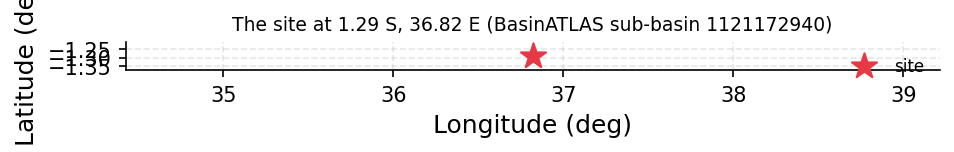
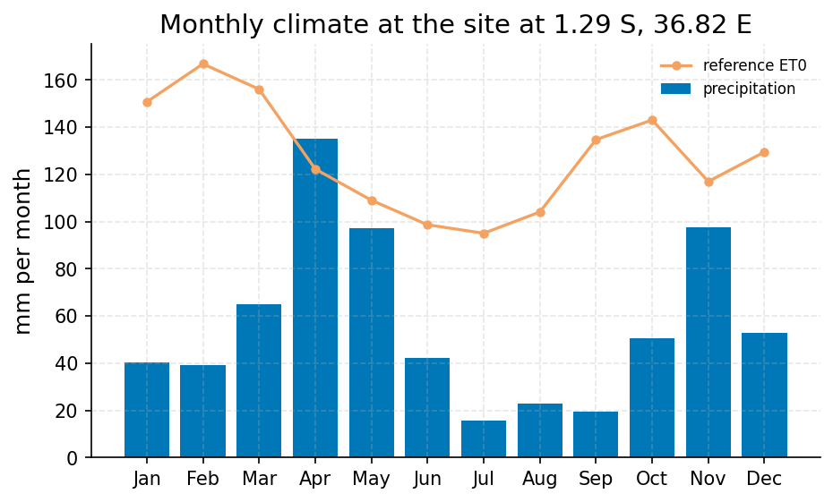
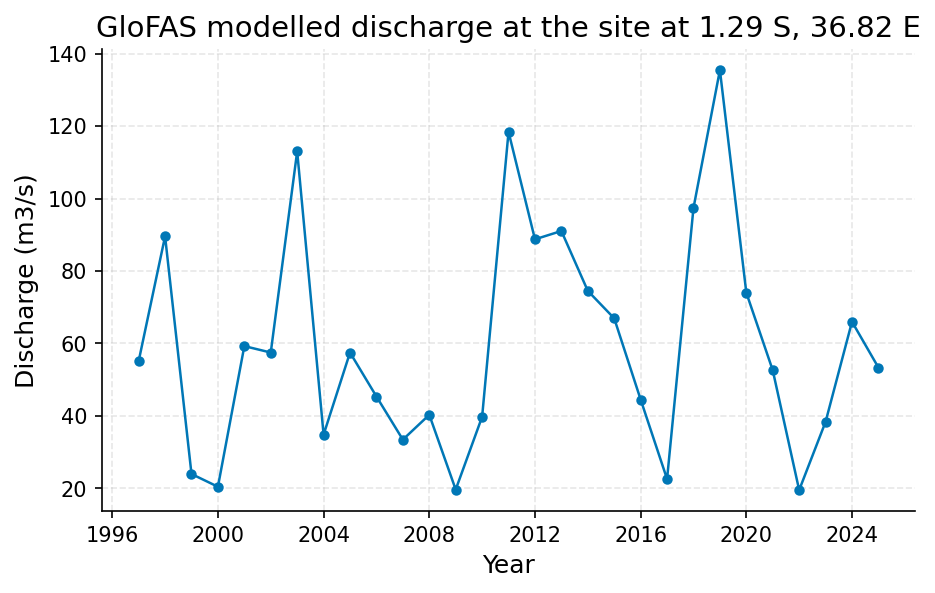

# Nairobi Seasonal Drought Screening: Short-Term SPEI Moderately Dry, Longer Timescales Normal

**Author:** AquaScope Studio  
**Date:** 2026-09-14  
**Description:** whether current seasonal rainfall and moisture deficit constitute a meteorological drought affecting smallholder farms around Nairobi, to guide any drought-response advisory  
**Data Sources:** BasinATLAS (HydroATLAS v1.0), ERA5 via Open-Meteo, similar_basins  
**Version:** 1.0  

**Site:** 1.2900 S, 36.8200 E

**Answer.** Notice: the Critic's fix requests on findings were not all resolved; read the report with the list of what this study does not establish.

SPEI at 3-month accumulation for 2026-08-01 is -1.404 (moderately dry), grade: screening, computed from ERA5 reanalysis precipitation and FAO-56 ET0 for the grid cell at -1.29, 36.82 (ERA5 via Open-Meteo). SPI-3 for the same cell and date is -0.390 (near normal), a divergence of -1.014, indicating the short-term deficit is driven by evaporative demand rather than a rainfall shortfall. SPEI and SPI at 6 and 12 months are both near normal (SPEI-6 0.730, SPI-6 0.975; SPEI-12 0.669, SPI-12 0.805), so no sustained meteorological drought is evident once the accumulation window extends past three months.

*Key numbers*

| Quantity | Value | Unit | Step |
| --- | --- | --- | --- |
| Upstream area | 101.8 | km2 | s1 |
| ERA5 precipitation | 672.7 | mm per year | s2 |
| ERA5 reference evapotranspiration | 1524.0 | mm per year | s2 |
| Aridity index | 0.4415 |  | s2 |
| GloFAS mean discharge (cell) | 4.13 | m3/s | s2 |
| SPI at 3 months, 2026-08-01 (near normal) | -0.3898 |  | s3 |
| SPEI at 3 months, 2026-08-01 (moderately dry) | -1.404 |  | s3 |
| SPI at 6 months, 2026-08-01 (near normal) | 0.9747 |  | s3 |
| SPEI at 6 months, 2026-08-01 (near normal) | 0.7296 |  | s3 |
| SPI at 12 months, 2026-08-01 (near normal) | 0.8052 |  | s3 |
| SPEI at 12 months, 2026-08-01 (near normal) | 0.6692 |  | s3 |
| ERA5 temperature trend | 0.2431 | C per decade | s3 |

## Summary

The question is whether Nairobi's smallholder farming area is in meteorological drought this season. No rain gauge sits within a defensible distance, so the answer rests on ERA5 reanalysis precipitation and FAO-56 reference evapotranspiration for the roughly 9 km cell at -1.29, 36.82. The 3-month SPEI reads -1.404 (moderately dry) for 2026-08-01, while the 3-month SPI reads -0.390 (near normal); 6- and 12-month SPI and SPEI are all near normal. The finding is graded screening because it comes from reanalysis, not a station record.

## The decision

Decide with SPEI-3 (moderately dry, -1.404, 2026-08-01), graded screening. Conditions: the value derives from a ERA5 grid cell, not an at-site gauge, so spi/spei are not_defensible as station estimates; the headline 3-month signal is not corroborated by SPI-3 or by the 6- and 12-month SPEI/SPI, all near normal. What would change it: an at-site or nearby gauge record would let the grade rise to indicative or established; a further deepening of SPEI-3 below -1.5 alongside SPI-3 below -1.0 next month would confirm a precipitation-driven event rather than an ET0-driven one; soil-moisture or vegetation-health data for the cropland fraction would test whether the signal is reaching crops at all.

## Findings

f1 (screening): SPI-3 for 2026-08-01 is -0.390, classed near normal, diverging sharply from SPEI-3 (-1.404). f2 (screening): at 6 months SPEI is 0.730 and SPI is 0.975, both near normal. f3 (screening): at 12 months SPEI is 0.669 and SPI is 0.805, both near normal, so the past year's moisture balance is not deficient. f4 (screening): the 101.8 km2 sub-basin containing the point is only 3% cropland and 1% pasture against 83% urban land, so this specific catchment has limited direct smallholder exposure even though the wider region is agricultural.

## Problem and decision

The brief asks whether Nairobi is currently in meteorological drought for the smallholder farms around the city, to guide a drought-response advisory. No rain gauge exists in the catalog within a defensible distance, so the study substitutes ERA5 reanalysis precipitation and temperature, with FAO-56 evapotranspiration, for a station-based SPI/SPEI, at 3, 6 and 12 month timescales, with flash-drought monitoring left off as the concern is seasonal, agricultural drought.

## Site and data

The site (-1.29, 36.82) sits in a 101.8 km2 HydroATLAS sub-basin (hybas_id 1121172940), mean elevation 1694 m, mean slope 1.5 degrees. Land cover is 83% urban, 3% cropland, 1% pasture, 3% irrigated, 11% forest, with 0% glacier, wetland or lake. Long-term WorldClim precipitation is 858 mm/yr against 1577 mm/yr PET (aridity index 0.55); ERA5 shows 672.7 mm/yr precipitation and 1523.7-1524.0 mm/yr ET0 (aridity index 0.4415, semi-arid). Mean groundwater table depth is 129 cm; population in the upstream area is 875,744 at a density of 8590 people/km2.

## Methodology

Three steps: (1) describe_catchment traces the HydroATLAS sub-basin containing the point to ground the analysis in the smallholder farming area (BasinATLAS v1.0); (2) anywhere fetches 40 years of ERA5-derived climate (precipitation, temperature, FAO-56 ET0, aridity) and a GloFAS modelled discharge series for the same cell, since no gauge lies within reach; (3) drought_indices computes SPI and SPEI at 3, 6 and 12 months from ERA5 precipitation and FAO-56 PET (McKee et al. 1993; Vicente-Serrano et al. 2010), reading off the current class, worst historical month, event counts and SPEI-minus-SPI divergence.

## Results: step s1

The upstream area is 101.8 km2 (1 sub-basin), mean elevation 1694 m, slope 1.5 degrees. WorldClim precipitation is 858 mm/yr, PET 1577 mm/yr, AET 726 mm/yr, aridity index 0.55, mean temperature 18.6 C. Runoff is 94 mm/yr, mean discharge 0.19 m3/s. Land cover: 11% forest, 3% cropland, 1% pasture, 83% urban, 3% irrigated. Soil: 41% clay, 27% silt, 32% sand, 20 t/ha organic carbon, 47% soil water. Groundwater table depth is 129 cm; population 875,744 at 8589.96 people/km2; human footprint index 36.3 (0-50 scale); degree of regulation and reservoir volume are both 0%.


*The site, in longitude and latitude (no basemap); no catalogue station was listed with it.*

*Catchment attributes from BasinATLAS for the site at 1.29 S, 36.82 E.*

| attribute | label | value | unit | source | note |
| --- | --- | --- | --- | --- | --- |
| n_sub_basins |  | 1.0 |  |  |  |
| area_km2 |  | 101.8 |  |  |  |
| outlet_hybas_id |  | 1121172940.0 |  |  |  |
| upstream_area_km2 |  | 101.8 |  |  |  |
| elevation_m | mean elevation | 1694.0 | m | basinatlas_upstream |  |
| slope_deg | mean slope | 1.5 | degrees | basinatlas_upstream |  |
| precipitation_mm_yr | annual precipitation (WorldClim) | 858.0 | mm/yr | basinatlas_upstream |  |
| pet_mm_yr | annual potential evapotranspiration | 1577.0 | mm/yr | basinatlas_upstream |  |
| aet_mm_yr | annual actual evapotranspiration | 726.0 | mm/yr | basinatlas_upstream |  |
| aridity_index | aridity index (P/PET) | 0.55 | P/PET | basinatlas_upstream |  |
| temperature_c | mean annual air temperature | 18.6 | °C | basinatlas_upstream |  |
| snow_cover_pct | annual snow cover extent | 0.0 | % | basinatlas_upstream |  |
| runoff_mm_yr | annual land-surface runoff | 94.0 | mm/yr | sub_basin |  |
| discharge_m3s | mean annual natural discharge at the outlet | 0.19 | m3/s | basinatlas_upstream |  |
| forest_pct | forest cover | 11.0 | % | basinatlas_upstream |  |
| cropland_pct | cropland | 3.0 | % | basinatlas_upstream |  |
| pasture_pct | pasture | 1.0 | % | basinatlas_upstream |  |
| urban_pct | urban extent | 83.0 | % | basinatlas_upstream |  |
| irrigated_pct | irrigated area | 3.0 | % | basinatlas_upstream |  |
| glacier_pct | glacier extent | 0.0 | % | basinatlas_upstream |  |
| wetland_pct | wetlands (all classes) | 0.0 | % | basinatlas_upstream |  |
| lake_pct | lake area | 0.0 | % | basinatlas_upstream |  |
| karst_pct | karst extent | 0.0 | % | basinatlas_upstream |  |
| clay_pct | clay fraction in soil | 41.0 | % | basinatlas_upstream |  |
| silt_pct | silt fraction in soil | 27.0 | % | basinatlas_upstream |  |
| sand_pct | sand fraction in soil | 32.0 | % | basinatlas_upstream |  |
| soil_organic_carbon_t_ha | soil organic carbon | 20.0 | t/ha | basinatlas_upstream |  |
| soil_water_pct | annual soil water content | 47.0 | % | basinatlas_upstream |  |
| groundwater_table_cm | groundwater table depth | 129.0 | cm | sub_basin |  |
| population_density | population density | 8589.96 | people/km2 | basinatlas_upstream |  |
| population | population count | 875744.02 | people | basinatlas_upstream |  |
| degree_of_regulation_pct | degree of regulation by reservoirs | 0.0 | % | basinatlas_upstream |  |
| human_footprint_2009 | human footprint (2009) | 36.3 | index 0-50 | basinatlas_upstream |  |
| reservoir_volume_mcm | reservoir volume upstream | 0.0 | million m3 | basinatlas_upstream |  |

## Results: step s2

ERA5 over 40 years (1986-2026) gives 672.7359 mm/yr precipitation, 1523.7164 mm/yr ET0, mean temperature 18.7942 C, aridity index 0.4415 (semi-arid). Monthly precipitation ranges from 15.6 mm (July) to 135.2 mm (April); wettest single day recorded is 64.6 mm. GloFAS modelled discharge (1997-2026, n=10841 days) averages 4.13 m3/s (median 0.64, max 135.46 m3/s); annual-maximum trend shows no trend (p=0.8219, Sen's slope 0.3028 m3/s/yr); mean-annual trend also shows no trend (p=0.4877, Sen's slope 0.041 m3/s/yr). GloFAS is modelled, not observed, and is context only.


*Mean monthly precipitation (bars) and FAO-56 reference evapotranspiration (line) for the ERA5 cell at the site at 1.29 S, 36.82 E, 40 years ending 2026-09-07.*


*Annual maxima of the modelled discharge from GloFAS v4 (Open-Meteo) for the grid cell at the site at 1.29 S, 36.82 E, 1997 to 2026: a model output, indicative only, not a gauge reading.*

*Mean monthly precipitation and reference evapotranspiration for the ERA5 cell at the site at 1.29 S, 36.82 E.*

| month | precipitation_mm | et0_mm |
| --- | --- | --- |
| 1 | 40.1857 | 150.719 |
| 2 | 39.1518 | 166.8268 |
| 3 | 64.8593 | 156.1081 |
| 4 | 135.1942 | 122.2947 |
| 5 | 97.1453 | 109.0648 |
| 6 | 42.1898 | 98.6616 |
| 7 | 15.5563 | 95.068 |
| 8 | 23.0583 | 104.0785 |
| 9 | 19.4426 | 134.7559 |
| 10 | 50.4911 | 143.0597 |
| 11 | 97.5044 | 117.001 |
| 12 | 52.7938 | 129.5026 |

*GloFAS modelled discharge for the grid cell at the site at 1.29 S, 36.82 E (indicative).*

| item | value |
| --- | --- |
| variable | discharge |
| unit | m3/s |
| n | 10841 |
| start | 1997-01-02 |
| end | 2026-09-07 |
| years | 29.7 |
| stats.mean | 4.1305 |
| stats.median | 0.64 |
| stats.min | 0.0 |
| stats.max | 135.46 |
| sampling.n | 10841 |
| sampling.span_years | 29.7 |
| sampling.per_year | 365.02 |
| sampling.inferred_resolution | daily |
| trend.on | annual mean |
| trend.p_value | 0.4877 |
| trend.tau | 0.0936 |
| trend.trend | no trend |
| trend.sens_slope_per_year | 0.041 |
| trend.n_years | 29 |
| source | GloFAS v4 (modelled) via Open-Meteo |
| modelled | True |
| return_level_T2_gev | 54.3364 |
| return_level_T5_gev | 83.2644 |
| return_level_T10_gev | 102.4553 |
| return_level_T25_gev | 126.7466 |
| return_level_T50_gev | 144.7987 |
| return_level_T100_gev | 162.744 |
| q10 | 11.82 |
| q50 | 0.64 |
| q95 | 0.02 |

## Results: step s3

From 479 months of ERA5 record (1986-10 to 2026-08, 39.9 years): SPI-3 = -0.390 (near normal), SPEI-3 = -1.404 (moderately dry), divergence -1.014 (mean last 10y -0.181, 64.17% of months SPEI drier than SPI, correlation 0.930). SPI-6 = 0.975, SPEI-6 = 0.730 (both near normal, divergence -0.245). SPI-12 = 0.805, SPEI-12 = 0.669 (both near normal, divergence -0.136). Worst SPI-3 on record: -2.637 (2004-08-01); worst SPEI-3: -2.973 (2009-04-01). Mean annual temperature trend is +0.2431 C/decade (p=8.9e-05, increasing, 39 years); no cause is stated for this trend.


*SPEI (bars) with SPI (grey line) at the site at 1.29 S, 36.82 E for the 3, 6, 12 month accumulations, 1986 to 2026: blue above zero is wetter than normal, red below is drier; the dashed lines mark the moderate (1), severe (1.5) and extreme (2) classes.*

*Monthly SPI and SPEI at the site at 1.29 S, 36.82 E per timescale.*

| date | spi_3 | spei_3 | spi_6 | spei_6 | spi_12 | spei_12 |
| --- | --- | --- | --- | --- | --- | --- |
| 1986-12-01 | 0.1749351092321912 | 0.5768342355481937 |  |  |  |  |
| 1987-01-01 | 0.2022985471385608 | 0.6195032440551672 |  |  |  |  |
| 1987-02-01 | 0.0658039351915912 | 0.3742591781773856 |  |  |  |  |
| 1987-03-01 | -0.5880959014435022 | -0.3175347430190701 | -0.2230554560557087 | 0.22051759737537 |  |  |
| 1987-04-01 | -0.5499790230871323 | -0.4716472159377481 | -0.2698250417932877 | 0.0847834488159074 |  |  |
| 1987-05-01 | 0.227735834718832 | 0.1708326015240938 | 0.1076472945789968 | 0.3536131011079345 |  |  |
| 1987-06-01 | 1.3298681990756291 | 1.422080865211607 | 0.7212017602383789 | 0.8137628814614214 |  |  |
| 1987-07-01 | 2.1497831617896836 | 1.943590616341412 | 0.8744125037655168 | 0.9088978230879248 |  |  |
| 1987-08-01 | 2.348836762021228 | 2.4415641681819653 | 1.0435215671736844 | 1.0368074965514171 |  |  |
| 1987-09-01 | 0.0061100621351037 | -0.4083746481924557 | 1.208834440256315 | 1.1803719028084303 | 0.5112792312170874 | 0.7729686571667505 |
| 1987-10-01 | -1.229085560493843 | -1.9278846286198104 | 1.1808663509597386 | 1.0270801565320058 | 0.3982560228842316 | 0.5933307725315798 |
| 1987-11-01 | -1.062503615739232 | -2.5225041117172284 | 0.5627887991908677 | 0.3903414391946849 | 0.3215314200863597 | 0.4348217303188961 |
| 1987-12-01 | -1.217129550194278 | -2.867925686569823 | -0.9720984056165092 | -1.9829200552490016 | 0.0861619834263586 | 0.0553366677829183 |
| 1988-01-01 | -0.929129883248044 | -1.3155254128474538 | -1.1344802678506525 | -2.1102460785966835 | 0.0482975573060227 | 0.0020622349773946 |
| 1988-02-01 | -1.092555190248644 | -1.1221334258466404 | -1.2915061586214982 | -2.983199719940574 | 0.0432805256029761 | -0.0265386827879321 |
| 1988-03-01 | 0.2818037449713508 | 0.3629908850176737 | -0.5576256530331469 | -0.8168818147012854 | 0.3209779016675671 | 0.3500115319889772 |
| 1988-04-01 | 1.342977207103647 | 1.323270248390126 | 0.5244935826812637 | 0.6003259694723451 | 0.8326628689499589 | 0.8722293826468807 |
| 1988-05-01 | 1.61394883143209 | 1.676864295765097 | 0.8858636208675603 | 0.9420265453730038 | 0.7979027622600295 | 0.8824434574532769 |
| 1988-06-01 | 1.541715514061034 | 1.6991904660904953 | 1.2172808557190753 | 1.258165673183734 | 0.4646448167847998 | 0.563336773837941 |
| 1988-07-01 | 1.0573150587939082 | 1.157322273488171 | 1.4321576651353465 | 1.453346293008845 | 0.4565781787792041 | 0.5530503726551267 |
| 1988-08-01 | 0.6589170887601995 | 0.837990855217857 | 1.5739985541983872 | 1.6759149378787614 | 0.4249560424902898 | 0.5363821149474329 |
| 1988-09-01 | 0.1751721144079163 | 0.7768436217272596 | 1.441700316309776 | 1.648542491101822 | 0.4922420977830593 | 0.6757106300608661 |
| 1988-10-01 | -0.2670628342168405 | 0.4151594654644411 | 0.558955152515188 | 0.8996876948233373 | 0.5961849364278303 | 0.8155720356024291 |
| 1988-11-01 | -0.2416797685063222 | 0.3488222712783493 | 0.031959815519754 | 0.5398359669452353 | 0.6365557973860522 | 0.921026615291646 |
| 1988-12-01 | -0.2384126944687688 | 0.2025303969046305 | -0.1791551347721325 | 0.4287553002148511 | 0.7610546714023887 | 1.0741058372508878 |
| 1989-01-01 | 0.8252509242894672 | 1.1426418400295724 | 0.4728121462572484 | 0.9919055230220336 | 1.1335536854250412 | 1.3395736132163674 |
| 1989-02-01 | 0.9741629729388104 | 1.1966562990317955 | 0.4434531121174849 | 0.9940961539377032 | 1.1366784578422875 | 1.3662264813573326 |
| 1989-03-01 | 0.9076196206877968 | 1.0976812299499277 | 0.3453711992217126 | 0.870622148247887 | 0.9215509258447664 | 1.2349926512435838 |
| 1989-04-01 | -0.0105551924788711 | 0.3885701926516925 | 0.4262736112012502 | 0.9096136771644486 | 0.4889382245927838 | 1.0034726812663963 |
| 1989-05-01 | 0.3455636338808852 | 0.5021543070187796 | 0.7071195746880802 | 1.0695344370170874 | 0.4660026344224048 | 1.0122249390696396 |
| 1989-06-01 | 0.3973814452379319 | 0.5066314556575118 | 0.7114168595464601 | 1.0334573169495886 | 0.3682650990123377 | 0.9335246817392148 |
| 1989-07-01 | 0.5937507516683922 | 0.872808611654267 | 0.2288918060640747 | 0.6001619891819173 | 0.3673608522129813 | 0.9464339466887932 |
| 1989-08-01 | 0.258612029115726 | 0.8478655527362421 | 0.3270065753550463 | 0.6580189058912841 | 0.4125626042039226 | 0.9944012119279836 |
| 1989-09-01 | 0.8865322665371079 | 1.5606229992187215 | 0.5341785263694983 | 0.8665613991935753 | 0.4658292985454667 | 0.9855078502655976 |
| 1989-10-01 | 0.6167198068797589 | 1.1071063858876062 | 0.639619633782169 | 1.084819315732525 | 0.5648744940713756 | 1.0856138557561117 |
| 1989-11-01 | 0.2849192247649817 | 0.7990104661189734 | 0.2570467296698868 | 0.8834245847045513 | 0.5965492059706199 | 1.1364239504447748 |
| 1989-12-01 | 0.2082980778089737 | 0.6883730727670548 | 0.3737634757117298 | 0.9554140033618668 | 0.6378389693885297 | 1.1336654581748675 |
| 1990-01-01 | 0.190804098357493 | 0.6880553608371798 | 0.3568950956516542 | 0.9399862225747986 | 0.3103182808409485 | 0.8953605258486554 |
| 1990-02-01 | 0.7066950316374563 | 1.0378670349957306 | 0.5161998895511113 | 1.0585005972067727 | 0.4590708715878505 | 1.005931372714946 |
| 1990-03-01 | 0.9749126698924314 | 1.2798176645996024 | 0.6252422535032133 | 1.1657562227352758 | 0.6192940391373419 | 1.1464782485889002 |
| 1990-04-01 | 1.2404773426912477 | 1.4688588087129326 | 0.8798052748907128 | 1.2749718091900648 | 0.8275628799935265 | 1.303257009853899 |
| 1990-05-01 | 1.0261175178178996 | 1.263329899992571 | 1.0351100242010511 | 1.3510655602442136 | 0.7792439977920506 | 1.291731437144023 |
| 1990-06-01 | 0.664519338734123 | 0.6949597975459461 | 0.9310706766016318 | 1.2534477298187638 | 0.7525613304888827 | 1.2460604512732665 |
| 1990-07-01 | 0.0826228251564657 | 0.1054346626326506 | 0.9442071174864174 | 1.2213571619692525 | 0.7233459030182983 | 1.1969960736407503 |
| 1990-08-01 | -0.542826422396361 | -0.2474643075615855 | 0.7574562868605953 | 1.0554473288925437 | 0.6915065915737432 | 1.185585923756117 |
| 1990-09-01 | -0.2718944190391433 | 0.0722838097888593 | 0.5210226094457888 | 0.646885849578118 | 0.6397856325891031 | 1.1161184737921075 |
| 1990-10-01 | 0.1459334084261538 | 0.645158182680108 | 0.0502613433782107 | 0.3426442397090493 | 0.6455254608905193 | 1.1031816045990013 |
| 1990-11-01 | -0.2132450549198939 | 0.1227709565138997 | -0.4494019313705552 | -0.0968986763938022 | 0.5760547699992933 | 1.0729313277948196 |
| 1990-12-01 | -0.3602112529265155 | -0.0349399247800283 | -0.394539771329027 | 0.0434554048654387 | 0.4588729649415084 | 0.9538250087000166 |
| 1991-01-01 | -0.9801484623605188 | -0.7323499795096384 | -0.5754032112429811 | -0.127658418104701 | 0.3117679797033918 | 0.7736814426763378 |

*Drought classes, worst months and event counts per timescale at the site at 1.29 S, 36.82 E.*

| timescale | index | current | class | date | worst | worst_date | events | n |
| --- | --- | --- | --- | --- | --- | --- | --- | --- |
| 3 | SPI | -0.3898392785153547 | normal | 2026-08-01 | -2.636991430511332 | 2004-08-01 | 27 | 477 |
| 3 | SPEI | -1.4041324474471333 | moderately_dry | 2026-08-01 | -2.9731872425332933 | 2009-04-01 | 29 | 477 |
| 6 | SPI | 0.9747220061471752 | normal | 2026-08-01 | -2.310442598149305 | 2000-09-01 | 20 | 474 |
| 6 | SPEI | 0.7296214302390115 | normal | 2026-08-01 | -4.753424308822899 | 2009-04-01 | 16 | 474 |
| 12 | SPI | 0.805174555065854 | normal | 2026-08-01 | -2.1781604962554364 | 2000-12-01 | 8 | 468 |
| 12 | SPEI | 0.6692320046286058 | normal | 2026-08-01 | -4.753424308822899 | 2009-11-01 | 14 | 468 |

*Divergence between SPEI and SPI per timescale at the site at 1.29 S, 36.82 E.*

| timescale | current | mean_last_10y | months_spei_drier_pct | correlation | n |
| --- | --- | --- | --- | --- | --- |
| 3 | -1.014293168931779 | -0.1810312108925477 | 64.16666666666667 | 0.9302155686004876 | 477 |
| 6 | -0.2451005759081637 | -0.1916367081524444 | 62.5 | 0.9212233885157926 | 474 |
| 12 | -0.1359425504372482 | -0.2181093581543635 | 64.16666666666667 | 0.8973226084545513 | 468 |

## Limitations and what this study does not establish

The indices are monthly and cannot resolve a flash drought or a single dry week. SPI and SPEI describe how unusual the deficit is against the ERA5 record; they say nothing about cause and cannot attribute impacts to specific farms. SPEI here uses ERA5-forced FAO-56 PET, a modelled rather than observed evapotranspiration. No rain gauge lies within a defensible distance in the catalog used for this analysis; the indices describe the roughly 9 km ERA5 cell, not a station, and every drought finding is capped at screening as a result. The GloFAS discharge context is indicative only and cannot be validated against an observed flow series here. The sub-basin used to represent the smallholder farming area is itself only 3-4% cropland/pasture and 83% urban.

## Caveats

- Monthly resolution: the indices see droughts a month and longer; what happened this week is not in them, and a flash drought is out of their reach.
- SPI and SPEI say how unusual a deficit is against this record; they say nothing about its cause, and the SPI-to-SGI lag is a statistical association read off the two series, not a model of the aquifer.
- SPEI needs a PET series: here PET is Thornthwaite (1948) from ERA5 temperature, a temperature-only approximation and the formulation SPEI was introduced with; FAO-56 Penman-Monteith is the better PET where humidity, wind and radiation exist.
- No rain gauge within reach: the indices describe the ERA5 cell (about 9 km), a reanalysis climate, not a gauge; a gauge record with twenty years is what turns this into a station answer.

## Recommendations

Adopt the screening-grade finding: the 3-month SPEI (-1.404, moderately dry, ERA5 cell at -1.29, 36.82, 2026-08-01) as the only current signal of concern, while noting SPI-3 and all 6- and 12-month indices are near normal. This does not support issuing a full drought-response advisory on the current evidence; at most, a watching brief on short-term, evaporative-demand-driven stress is warranted. To firm this up, obtain a nearby defensible rain-gauge precipitation record to recompute station-based SPI/SPEI, and obtain cropland-specific soil moisture or vegetation-health data (e.g. NDVI/VHI) for the surrounding farming belt, since the analysed sub-basin itself is only 3-4% cropland/pasture. Re-evaluate if next month's SPEI-3 deepens past -1.5 alongside SPI-3 below -1.0.

## References

1. Vicente-Serrano et al. (2010)
2. Hersbach, H. et al. (2020). The ERA5 global reanalysis. Q. J. R. Meteorol. Soc., 146, 1999-2049
3. HydroATLAS v1.0 (BasinATLAS), CC BY 4.0. Linke, S., Lehner, B., Ouellet Dallaire, C., et al. (2019). Global hydro-environmental sub-basin and river reach characteristics at high spatial resolution. Scientific Data 6: 283. https://doi.org/10.1038/s41597-019-0300-6
4. Open-Meteo.com (CC BY 4.0).
5. Allen, R. G., Pereira, L. S., Raes, D., & Smith, M. (1998). Crop evapotranspiration. FAO Irrigation and Drainage Paper 56.
6. Harrigan, S. et al. (2020). GloFAS-ERA5 operational global river discharge reanalysis 1979-present. Earth Syst. Sci. Data, 12, 2043-2060.
7. Hosking, J. R. M. (1990). L-moments: analysis and estimation of distributions using linear combinations of order statistics. J. R. Stat. Soc. B, 52(1), 105-124.
8. England, J. F. Jr. et al. (2018). Guidelines for determining flood flow frequency, Bulletin 17C. USGS Techniques and Methods 4-B5.
9. McKee, T. B., Doesken, N. J., & Kleist, J. (1993). The relationship of drought frequency and duration to time scales. Proc. 8th Conf. on Applied Climatology, 179-184.
10. WMO (2012). Standardized Precipitation Index User Guide (Svoboda, Hayes, Wood). WMO-No. 1090.
11. Vicente-Serrano, S. M., Begueria, S., & Lopez-Moreno, J. I. (2010). A multiscalar drought index sensitive to global warming: the Standardized Precipitation Evapotranspiration Index. J. Climate 23, 1696-1718. doi:10.1175/2009JCLI2909.1; Begueria, S. et al. (2014). SPEI revisited: parameter fitting, evapotranspiration models, tools, datasets and drought monitoring. Int. J. Climatol. 34, 3001-3023. doi:10.1002/joc.3887
12. Begueria, S., Vicente-Serrano, S. M., Reig, F., & Latorre, B. (2014). Standardized precipitation evapotranspiration index (SPEI) revisited. Int. J. Climatol. 34, 3001-3023. doi:10.1002/joc.3887
13. Thornthwaite, C. W. (1948). An approach toward a rational classification of climate. Geographical Review 38, 55-94.
14. Bloomfield, J. P., & Marchant, B. P. (2013). Analysis of groundwater drought building on the standardised precipitation index approach. Hydrol. Earth Syst. Sci. 17, 4769-4787.
15. SPI against SPEI at 219 stations across Turkiye: Earth Science Informatics (2024), doi:10.1007/s12145-024-01401-8
16. SPI-SPEI correlation under warming in Umbria: Environ. Sci. Pollut. Res. (2024), doi:10.1007/s11356-024-35740-2
17. FAO-56 Penman-Monteith reference evapotranspiration
18. Rekin226 and contributors (2026). AquaScope: Open-source water data aggregation toolkit (version 0.16.0) [Software]. Zenodo. https://doi.org/10.5281/zenodo.21903143

## Appendix: reproducibility

Re-run the same steps with no model: `aquascope run study.yaml`. Resume the workspace: `aquascope studio --resume workspace.json`.

Model: claude-sonnet-5 via anthropic; ledger: consultant 1 call(s), 3930 tokens, methodologist 1 call(s), 16647 tokens, interpreter 1 call(s), 16331 tokens, author 1 call(s), 18580 tokens, critic 1 call(s), 15911 tokens. aquascope 0.16.0.

```yaml
# An AquaScope study (version 3): the plan behind an answer, its gates, and what happened.
#   aquascope run study.yaml
version: 3
title: "Determine whether the current growing season around Nairobi : -1.29, 36.82"
question: "Is Nairobi in a meteorological drought this season, for the smallholder farms around the city? No rain gauge is in the catalog here."
created: "2026-09-14T21:57:13+00:00"
aquascope_version: "0.16.0"
author: "methodologist"
model: "claude-sonnet-5"
problem:
  kind: "drought"
  site: {"lat": -1.29, "lon": 36.82}
  params: {"timescales": [3, 6, 12], "drought_concern": "agriculture", "flash_drought": false}
  text: "Is Nairobi in a meteorological drought this season, for the smallholder farms around the city? No rain gauge is in the catalog here."
plan:
  author: "methodologist"
  playbook: "drought_status"
  objective: "Determine whether the current growing season around Nairobi shows a meteorological drought severe enough to warrant an agricultural drought-response advisory for smallholder farms, using reanalysis-derived precipitation and temperature since no rain gauge sits within a defensible distance."
  decision: "whether current seasonal rainfall and moisture deficit (SPEI at 3, 6 and 12 months, built on FAO-56 ET0) constitute a meteorological drought (none, moderate, severe, extreme) affecting smallholder farms around Nairobi"
  methodology: ["Establish the site's catchment context from BasinATLAS to ground the analysis in the smallholder farming area around the point (lat -1.29, lon 36.82).", "Fetch ERA5-derived climate for the same point, including FAO-56 reference evapotranspiration, aridity and a GloFAS discharge context, since no rain gauge exists within 50 km of Nairobi.", "Compute SPI and SPEI at 3, 6 and 12 month accumulations from ERA5 reanalysis precipitation and FAO-56 PET to read off the current drought classification and the worst recent month."]
  assumptions: ["no gauge station exists within a defensible distance, so SPEI will be computed from ERA5 reanalysis precipitation and temperature rather than a station SPI/SPEI", "FAO-56 ET0 from reanalysis forcing is used for the moisture balance behind SPEI", "flash_drought left at default false since the concern is seasonal agricultural drought, not sub-monthly onset", "the smallholder farming area around the city is represented by the given point/catchment (HydroATLAS basin 1121172940)", "No gauge station exists within a defensible distance (nearest catalog gauge is 755 km away), so SPEI is computed from ERA5 reanalysis precipitation and temperature rather than a station SPI/SPEI.", "FAO-56 ET0 from ERA5 reanalysis forcing is used for the moisture balance behind SPEI, as the anywhere tool's climate output and drought_indices' pet=fao56 argument both draw on it.", "flash_drought is left at its default false since the concern is seasonal agricultural drought, not sub-monthly onset.", "The smallholder farming area around Nairobi is represented by the given point and its BasinATLAS catchment (HydroATLAS basin 1121172940)."]
  alternatives: [{"method": "spi", "why_not": "not_defensible: no precipitation record at this site (sufficiency table)"}, {"method": "spei", "why_not": "not_defensible: no precipitation record at this site (sufficiency table)"}, {"method": "trend_mann_kendall", "why_not": "not_defensible: no local record exists to test a trend against"}, {"method": "baseflow_separation / flow_duration / low_flow_frequency", "why_not": "not_defensible: no discharge record at this site"}, {"method": "sgi", "why_not": "not_defensible: no groundwater level record at this site"}]
  limitations_expected: ["Monthly resolution: the indices see droughts a month and longer; a flash drought or a single dry week is out of their reach.", "SPI and SPEI say how unusual a deficit is against the ERA5 record; they say nothing about its cause (e.g. pumping, land use), and cannot attribute impacts to specific farms.", "SPEI needs a PET series; FAO-56 Penman-Monteith is used here since ERA5 supplies humidity, wind and radiation, but this is still a modelled PET, not an observed one.", "No rain gauge within reach: the indices describe the ERA5 cell (about 9 km), a reanalysis climate, not a gauge; a 20-year gauge record would be needed to turn this into a station-based answer.", "The GloFAS discharge context from the anywhere step is indicative only; with no local discharge record it cannot be validated against an observed flow series here."]
  citations: ["McKee, T. B., Doesken, N. J., & Kleist, J. (1993). The relationship of drought frequency and duration to time scales. Proc. 8th Conf. on Applied Climatology, 179-184.", "Vicente-Serrano, S. M., Begueria, S., & Lopez-Moreno, J. I. (2010). A multiscalar drought index sensitive to global warming: the Standardized Precipitation Evapotranspiration Index. J. Climate 23, 1696-1718. doi:10.1175/2009JCLI2909.1", "Begueria, S., Vicente-Serrano, S. M., Reig, F., & Latorre, B. (2014). Standardized precipitation evapotranspiration index (SPEI) revisited. Int. J. Climatol. 34, 3001-3023. doi:10.1002/joc.3887", "Thornthwaite, C. W. (1948). An approach toward a rational classification of climate. Geographical Review 38, 55-94.", "Bloomfield, J. P., & Marchant, B. P. (2013). Analysis of groundwater drought building on the standardised precipitation index approach. Hydrol. Earth Syst. Sci. 17, 4769-4787.", "WMO (2012). Standardized Precipitation Index User Guide (Svoboda, Hayes, Wood). WMO-No. 1090.", "SPI against SPEI at 219 stations across Turkiye: Earth Science Informatics (2024), doi:10.1007/s12145-024-01401-8", "SPI-SPEI correlation under warming in Umbria: Environ. Sci. Pollut. Res. (2024), doi:10.1007/s11356-024-35740-2", "Hersbach, H. et al. (2020). The ERA5 global reanalysis. Q. J. R. Meteorol. Soc. 146, 1999-2049.", "Thornthwaite (1948) PET formulation (fallback reference for reanalysis PET)", "FAO-56 Penman-Monteith reference evapotranspiration"]
  caveats: ["Monthly resolution: the indices see droughts a month and longer; what happened this week is not in them, and a flash drought is out of their reach.", "SPI and SPEI say how unusual a deficit is against this record; they say nothing about its cause, and the SPI-to-SGI lag is a statistical association read off the two series, not a model of the aquifer.", "SPEI needs a PET series: here PET is Thornthwaite (1948) from ERA5 temperature, a temperature-only approximation and the formulation SPEI was introduced with; FAO-56 Penman-Monteith is the better PET where humidity, wind and radiation exist.", "No rain gauge within reach: the indices describe the ERA5 cell (about 9 km), a reanalysis climate, not a gauge; a gauge record with twenty years is what turns this into a station answer."]
  rationale: "Determine whether the current growing season around Nairobi shows a meteorological drought severe enough to warrant an agricultural drought-response advisory for smallholder farms, using reanalysis-derived precipitation and temperature since no rain gauge sits within a defensible distance."
  recon_notes: ["No catalog gauge within 50 km; the nearest is Le Tech [Source Sainte C\u00e9cile - Ravin Sainte C\u00e9cile - Affluent du Tech] au Tech - Tech Sainte c\u00e9cile (hubeau_hydrometrie/Y021401101) at 755 km.", "10 donor gauges from a pool of 34,786 gauged catchments.", "ERA5 temperature and forcing and GloFAS discharge are assumed reachable for any point on land (Open-Meteo); not checked here.", "CMIP6 change factors need model output you supply (aquascope.climate works on downloaded data); not counted.", "No gauge with a usable record within 50 km: at-site methods are not defensible; what remains is the regionalisation path (similar_basins, regionalize_signatures) and the GloFAS cross-check."]
steps:
  - tool: "describe_catchment"
    id: "s1"
    rationale: "Anchors the analysis in the catchment (BasinATLAS unit near HydroATLAS basin 1121172940) that represents the smallholder farming area around Nairobi."
    arguments:
      lat: -1.29
      lon: 36.82
      upstream: true
    expects:
      - {"check": "not_empty", "path": "sub_basin"}
    outputs: [{"kind": "table", "id": "s1_catchment", "caption": "BasinATLAS sub-basin and area-weighted attributes for the point near Nairobi"}]
  - tool: "anywhere"
    id: "s2"
    rationale: "With no rain gauge within 50 km, ERA5 reanalysis at the point supplies precipitation, temperature, FAO-56 reference evapotranspiration and a GloFAS discharge cross-check for context."
    method: "spei_reanalysis"
    arguments:
      lat: -1.29
      lon: 36.82
      years: 40
    expects:
      - {"check": "not_empty", "path": "climate"}
    outputs: [{"kind": "table", "id": "s2_climate", "caption": "ERA5 precipitation, temperature and FAO-56 ET0 for the Nairobi cell"}]
  - tool: "drought_indices"
    id: "s3"
    rationale: "Computes SPI and SPEI at 3, 6 and 12 months from ERA5 precipitation and FAO-56 PET, giving the current drought class, worst month, events and SPEI-minus-SPI divergence needed for the advisory decision."
    method: "spei_reanalysis"
    arguments:
      lat: -1.29
      lon: 36.82
      timescales: [3, 6, 12]
      years: 40
      pet: "fao56"
    expects:
      - {"check": "min_years", "value": 30, "path": "years"}
      - {"check": "not_empty", "path": "indices"}
      - {"check": "not_empty", "path": "current.spei"}
      - {"check": "not_empty", "path": "current.spi"}
    depends_on: ["s2"]
    outputs: [{"kind": "figure", "id": "s3_drought_strip", "caption": "drought strip (SPI/SPEI at 3, 6, 12 months) from drought_indices"}, {"kind": "table", "id": "s3_indices_monthly", "caption": "monthly SPI/SPEI indices from drought_indices"}, {"kind": "table", "id": "s3_drought_events", "caption": "drought events table from drought_indices"}, {"kind": "table", "id": "s3_index_divergence", "caption": "SPEI-minus-SPI divergence and temperature trend from drought_indices"}]
results:
  s1: {"ok": true, "gates": [{"check": "not_empty", "passed": true, "detail": "'sub_basin' is present"}], "summary": "latitude=-1.29, longitude=36.82, license=CC-BY-4.0, attribution=HydroATLAS v1.0 (BasinATLAS), CC BY 4.0. Linke, S., Lehner, B., Ouellet Dallaire, C., et al. (2019). Global hydro-environmental sub-basi", "fallback_used": false, "sha256": "9299bbf97b72d743"}
  s2: {"ok": true, "gates": [{"check": "not_empty", "passed": true, "detail": "'climate' is present"}], "summary": "years=40, start=1986-09-07, end=2026-09-07", "fallback_used": false, "sha256": "1a0eb7283f1655a3"}
  s3: {"ok": true, "gates": [{"check": "min_years", "passed": true, "detail": "39.9 years of record, 30 needed"}, {"check": "not_empty", "passed": true, "detail": "'indices' is present"}, {"check": "not_empty", "passed": true, "detail": "'current.spei' is present"}, {"check": "not_empty", "passed": true, "detail": "'current.spi' is present"}], "summary": "years=39.9, start=1986-10-01, end=2026-08-01", "fallback_used": false, "sha256": "98eb6fea213a79a0"}
```

## Cite this software

AquaScope Studio (2026). AquaScope: Open-source water data aggregation toolkit (version 0.16.0) [Software]. Zenodo. https://doi.org/10.5281/zenodo.21903143


---

*{'model': 'claude-sonnet-5', 'provider': 'anthropic', 'prose': 'model', 'tokens': {'consultant': {'calls': 1, 'prompt_tokens': 3096, 'completion_tokens': 834, 'cost_usd': 0.014532}, 'methodologist': {'calls': 1, 'prompt_tokens': 7634, 'completion_tokens': 9013, 'cost_usd': 0.105398}, 'interpreter': {'calls': 1, 'prompt_tokens': 11031, 'completion_tokens': 5300, 'cost_usd': 0.075062}, 'author': {'calls': 2, 'prompt_tokens': 30332, 'completion_tokens': 8541, 'cost_usd': 0.146074}, 'critic': {'calls': 1, 'prompt_tokens': 11837, 'completion_tokens': 4074, 'cost_usd': 0.064414}}, 'total_tokens': 91692, 'total_usd': 0.40548, 'budget': None, 'dropped': 0, 'aquascope_version': '0.16.0', 'date': '2026-09-14 22:00 UTC', 'workspace': '451c76f7a8e7', 'plan_author': 'methodologist', 'written_by': {'answer': 'model', 'summary': 'model', 'decision': 'model', 'findings': 'model', 'problem': 'model', 'site_data': 'model', 'methodology': 'model', 'results-s1': 'model', 'results-s2': 'model', 'results-s3': 'model', 'limitations': 'model', 'recommendations': 'model', 'references': 'template', 'appendix': 'template'}}*
