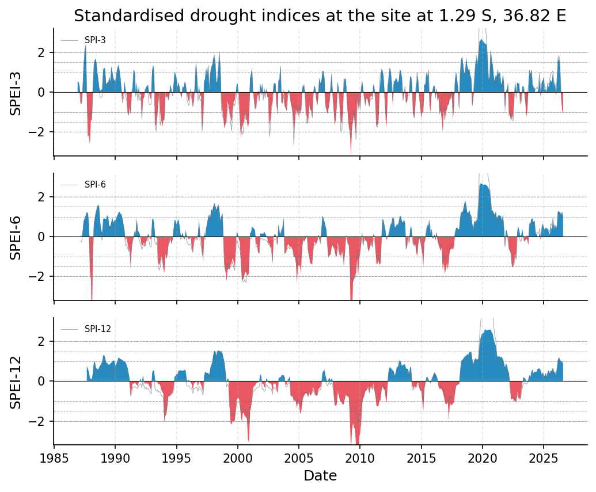
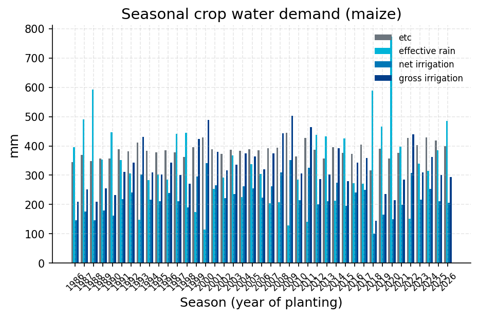

# Nairobi Seasonal Drought Status: Reanalysis-Based Assessment

**Author:** AquaScope Studio  
**Date:** 2026-09-14  
**Description:** assess whether current seasonal conditions around Nairobi constitute a meteorological drought that would affect smallholder crop water availability  
**Data Sources:** BasinATLAS (HydroATLAS v1.0), ERA5 via Open-Meteo, similar_basins  
**Version:** 1.0  

**Site:** 1.2900 S, 36.8200 E

**Answer.** Notice: the Critic's fix requests on summary were not all resolved; read the report with the list of what this study does not establish.

The 3-month SPEI for the ERA5 grid cell at -1.29, 36.82 (period 1986-10-01 to 2026-08-01) is -1.076 on 2026-08-01, classed moderately dry, a screening-grade finding because no rain gauge sits within 50 km. The 6-month SPEI (0.942) and 12-month SPEI (0.877) are near normal, as is the SPI-3 (-0.390), so the deficit reads as a short, evaporative-demand-driven event rather than a season-long precipitation drought. FAO-56 ET0 from the same ERA5 forcing averages 3.97 mm/day over the maize season, giving a gross irrigation requirement of 327.2 mm (net 229.0 mm) against a 41-season range of 144.5-503.3 mm.

*Key numbers*

| Quantity | Value | Unit | Step |
| --- | --- | --- | --- |
| SPI at 3 months, 2026-08-01 (near normal) | -0.3898 |  | s1 |
| SPEI at 3 months, 2026-08-01 (moderately dry) | -1.076 |  | s1 |
| SPI at 6 months, 2026-08-01 (near normal) | 0.9747 |  | s1 |
| SPEI at 6 months, 2026-08-01 (near normal) | 0.9417 |  | s1 |
| SPI at 12 months, 2026-08-01 (near normal) | 0.8052 |  | s1 |
| SPEI at 12 months, 2026-08-01 (near normal) | 0.8766 |  | s1 |
| ERA5 temperature trend | 0.2431 | C per decade | s1 |
| Gross irrigation | 327.2 | mm | s2 |
| Net irrigation | 229.0 | mm | s2 |
| Mean demand over the season | 0.0003 | m3/s | s2 |
| Peak-month demand | 0.00046 | m3/s | s2 |
| Upstream area | 101.8 | km2 | s3 |

## Summary

Using ERA5 reanalysis precipitation and temperature for the grid cell at -1.29, 36.82 (no catalog gauge within 50 km), the 3-month SPEI is -1.076 on 2026-08-01, moderately dry class, while the 6-month (0.942) and 12-month (0.877) SPEI, and the SPI-3 (-0.390), are near normal. FAO-56 ET0 from the same forcing is 3.97 mm/day over the maize season, implying gross irrigation demand of 327.2 mm (net 229.0 mm), range 144.5-503.3 mm across 41 seasons. The upstream catchment (BasinATLAS, hybas_id 1121172940) is 101.8 km2 with no reservoirs (degree of regulation 0.0%), so no local regulation confounds the reading. All figures are screening grade: reanalysis-cell based, not gauge based.

## The decision

Decide with the 3-month SPEI of -1.076 (moderately dry), the headline timescale for the agriculture drought_concern given. Grade: screening. This holds only for the ~9 km ERA5 cell containing the point, not a gauge or a specific farm plot, and only at the 3-month accumulation; the 6- and 12-month SPEI show no drought. The SPEI's PET is Thornthwaite (temperature-only), distinct from the FAO-56 ET0 used in the crop water demand estimate. What would change this: an at-site or nearby rain gauge record letting SPI/SPEI be computed at-site (could raise grade to indicative/established); station FAO-56 weather (wind, humidity, radiation) replacing ERA5-forced ET0; or a follow-up month showing whether the 3-month dry signal persists or deepens, since flash-drought monitoring was not run.

## Findings

f1 (screening): SPI-3 for the same ERA5 cell is -0.390 on 2026-08-01, near normal, disagreeing with SPEI-3's moderately dry class. f2 (screening): SPEI-6 is 0.942, near normal. f3 (screening): SPEI-12 is 0.877, near normal. f4 (screening): the worst 3-month SPEI on record was -3.235 in April 2009, far below today's -1.076, so the current deficit sits well inside the fitted distribution's observed range. f5 (screening): the upstream sub-basin's aridity index (P/PET) is 0.55, a semi-arid background climate. Consistency check: SPI-3 and SPEI-3 disagree (divergence -0.687, 50.8% of months this decade drier in SPEI than SPI), consistent with the 0.243 degC/decade warming trend raising evaporative demand; the dry signal is confined to 3 months, not 6 or 12; and the current SPEI-3 is about a third of the worst historical value, so classification is not an extrapolation beyond seen events.

## Problem and decision

The brief asks whether smallholder farms around Nairobi (-1.29, 36.82) are in a meteorological drought this season. No catalog rain gauge exists within 50 km, so at-site SPI/SPEI cannot be computed; the plan substitutes SPEI from ERA5 reanalysis precipitation and temperature, and FAO-56 ET0 from the same forcing, to give the three requested quantities: SPEI at 3, 6, 12 months, ET0, and a qualitative severity read.

## Site and data

Point: -1.29, 36.82. SPI/SPEI (s1) uses the ERA5 grid cell (about 9 km) record spanning 1986-09-07 to 2026-09-07 (14,611 days); FAO-56 ET0 (s2) uses ERA5 spanning 1985-09-07 to 2026-09-07 (14,976 days). Elevation 1668 m. Upstream catchment (BasinATLAS, hybas_id 1121172940): 101.8 km2, mean elevation 1694 m, mean slope 1.5 degrees, annual precipitation 858 mm/yr, PET 1577 mm/yr, AET 726 mm/yr, aridity index 0.55, mean annual temperature 18.6 degC, no reservoirs (0.0% regulation, 0.0 million m3 volume), 83% urban, 3% cropland, population 875,744 at 8590 people/km2.

## Methodology

SPEI at 3, 6 and 12 months was computed from ERA5 precipitation and temperature for the grid cell (drought_indices, s1), since no gauge exists within 50 km; PET used is Thornthwaite. FAO-56 ET0 for the same forcing drove a crop water demand estimate for maize on 1 ha planted in March (crop_water_demand, s2). The upstream catchment was described (BasinATLAS, s3) to confirm no dam or regulation confounds the meteorological reading. Results are read jointly: SPEI classes give drought status, ET0/irrigation demand quantify evaporative demand, catchment context rules out local regulation.

## Results: step s1

SPI/SPEI for the ERA5 cell, 39.9 years (1986-10-01 to 2026-08-01), 479 months: current SPI-3 -0.390 (near normal), SPEI-3 -1.076 (moderately dry); SPI-6 0.975, SPEI-6 0.942 (near normal); SPI-12 0.805, SPEI-12 0.877 (near normal). Worst SPEI-3 on record: -3.235 (April 2009); worst SPEI-6: -4.753 (February 1988); worst SPEI-12: -4.753 (November 2009). SPEI-3/SPI-3 divergence: current -0.687, mean last 10y -0.103, 50.8% of months this decade SPEI drier than SPI, correlation 0.954. Overall status flagged 'moderately_dry', in_drought true (at 3-month timescale). Annual mean temperature 18.80 degC, trend +0.243 degC/decade (p=8.9e-5, increasing, 39 years).


*SPEI (bars) with SPI (grey line) at the site at 1.29 S, 36.82 E for the 3, 6, 12 month accumulations, 1986 to 2026: blue above zero is wetter than normal, red below is drier; the dashed lines mark the moderate (1), severe (1.5) and extreme (2) classes.*

*Monthly SPI and SPEI at the site at 1.29 S, 36.82 E per timescale.*

| date | spi_3 | spei_3 | spi_6 | spei_6 | spi_12 | spei_12 |
| --- | --- | --- | --- | --- | --- | --- |
| 1986-12-01 | 0.1749351092321912 | 0.5322214488714565 |  |  |  |  |
| 1987-01-01 | 0.2022985471385608 | 0.5118712312448348 |  |  |  |  |
| 1987-02-01 | 0.0658039351915912 | 0.2693144576232344 |  |  |  |  |
| 1987-03-01 | -0.5880959014435022 | -0.4960582916805783 | -0.2230554560557087 | 0.1125119812522924 |  |  |
| 1987-04-01 | -0.5499790230871323 | -0.594300297700526 | -0.2698250417932877 | -0.0614481774070311 |  |  |
| 1987-05-01 | 0.227735834718832 | 0.1608866196498905 | 0.1076472945789968 | 0.2870405102267038 |  |  |
| 1987-06-01 | 1.3298681990756291 | 1.401741991073424 | 0.7212017602383789 | 0.808019127118232 |  |  |
| 1987-07-01 | 2.1497831617896836 | 1.983099310115101 | 0.8744125037655168 | 0.9351308229788232 |  |  |
| 1987-08-01 | 2.348836762021228 | 2.379426273534439 | 1.0435215671736844 | 1.0633628866934317 |  |  |
| 1987-09-01 | 0.0061100621351037 | -0.1396225435868187 | 1.208834440256315 | 1.2238368504419672 | 0.5112792312170874 | 0.7747263206378432 |
| 1987-10-01 | -1.229085560493843 | -2.255273875339941 | 1.1808663509597386 | 1.186701939520839 | 0.3982560228842316 | 0.6241368441654825 |
| 1987-11-01 | -1.062503615739232 | -2.151167125369228 | 0.5627887991908677 | 0.6733487831241552 | 0.3215314200863597 | 0.4943925516007873 |
| 1987-12-01 | -1.217129550194278 | -2.647453762909166 | -0.9720984056165092 | -1.7342564959254134 | 0.0861619834263586 | 0.1620927325330453 |
| 1988-01-01 | -0.929129883248044 | -1.397996814385443 | -1.1344802678506525 | -2.1552605844827193 | 0.0482975573060227 | 0.111564548961977 |
| 1988-02-01 | -1.092555190248644 | -1.4269831727290614 | -1.2915061586214982 | -4.753424308822899 | 0.0432805256029761 | 0.1134482038209319 |
| 1988-03-01 | 0.2818037449713508 | 0.3342159034809963 | -0.5576256530331469 | -0.8571514531926832 | 0.3209779016675671 | 0.4431106924124788 |
| 1988-04-01 | 1.342977207103647 | 1.3672565951727562 | 0.5244935826812637 | 0.6790584558083148 | 0.8326628689499589 | 0.9747642060697878 |
| 1988-05-01 | 1.61394883143209 | 1.6345502051190066 | 0.8858636208675603 | 0.990102906995086 | 0.7979027622600295 | 0.969548449120738 |
| 1988-06-01 | 1.541715514061034 | 1.683108140598884 | 1.2172808557190753 | 1.2586510688510018 | 0.4646448167847998 | 0.6490790560372771 |
| 1988-07-01 | 1.0573150587939082 | 1.141729276667257 | 1.4321576651353465 | 1.4546788839682625 | 0.4565781787792041 | 0.6284618478524542 |
| 1988-08-01 | 0.6589170887601995 | 0.754997280183815 | 1.5739985541983872 | 1.611565510143512 | 0.4249560424902898 | 0.5927945895513977 |
| 1988-09-01 | 0.1751721144079163 | 0.2705783963508009 | 1.441700316309776 | 1.531717529142547 | 0.4922420977830593 | 0.6826829799498301 |
| 1988-10-01 | -0.2670628342168405 | 0.0668944649859704 | 0.558955152515188 | 0.777379679481907 | 0.5961849364278303 | 0.7914917440899569 |
| 1988-11-01 | -0.2416797685063222 | 0.1407549857424203 | 0.031959815519754 | 0.3609720222697038 | 0.6365557973860522 | 0.8580004375428163 |
| 1988-12-01 | -0.2384126944687688 | 0.1270791589966202 | -0.1791551347721325 | 0.2053846060165597 | 0.7610546714023887 | 0.9814451937576124 |
| 1989-01-01 | 0.8252509242894672 | 1.1163363241041635 | 0.4728121462572484 | 0.87670122549188 | 1.1335536854250412 | 1.2881152720580098 |
| 1989-02-01 | 0.9741629729388104 | 1.2442241882284613 | 0.4434531121174849 | 0.9337555030731362 | 1.1366784578422875 | 1.318845900488796 |
| 1989-03-01 | 0.9076196206877968 | 1.1574029364274638 | 0.3453711992217126 | 0.8657354616615952 | 0.9215509258447664 | 1.1895400274474444 |
| 1989-04-01 | -0.0105551924788711 | 0.3746702270503784 | 0.4262736112012502 | 0.891581326432737 | 0.4889382245927838 | 0.924633652492052 |
| 1989-05-01 | 0.3455636338808852 | 0.4963358252999877 | 0.7071195746880802 | 1.076358950729086 | 0.4660026344224048 | 0.9335836720436862 |
| 1989-06-01 | 0.3973814452379319 | 0.4779863930721844 | 0.7114168595464601 | 1.0107763356179196 | 0.3682650990123377 | 0.8303632502624368 |
| 1989-07-01 | 0.5937507516683922 | 0.7824176315855037 | 0.2288918060640747 | 0.5326947093863396 | 0.3673608522129813 | 0.8325624722018599 |
| 1989-08-01 | 0.258612029115726 | 0.5436272427928935 | 0.3270065753550463 | 0.5408646263021706 | 0.4125626042039226 | 0.8874574765300741 |
| 1989-09-01 | 0.8865322665371079 | 1.2829488354724747 | 0.5341785263694983 | 0.7403187970376393 | 0.4658292985454667 | 0.92170820645199 |
| 1989-10-01 | 0.6167198068797589 | 1.0505767555816512 | 0.639619633782169 | 0.969438466348567 | 0.5648744940713756 | 1.0078189746230437 |
| 1989-11-01 | 0.2849192247649817 | 0.723776609023978 | 0.2570467296698868 | 0.7060123492984299 | 0.5965492059706199 | 1.0405446585740623 |
| 1989-12-01 | 0.2082980778089737 | 0.5958560350168657 | 0.3737634757117298 | 0.8154094494885331 | 0.6378389693885297 | 1.0274280859605385 |
| 1990-01-01 | 0.190804098357493 | 0.5703298888509127 | 0.3568950956516542 | 0.8189679380742698 | 0.3103182808409485 | 0.78030490536852 |
| 1990-02-01 | 0.7066950316374563 | 0.9694679795365938 | 0.5161998895511113 | 0.9615659516209556 | 0.4590708715878505 | 0.8855851396822759 |
| 1990-03-01 | 0.9749126698924314 | 1.2067121064971302 | 0.6252422535032133 | 1.0705110133394342 | 0.6192940391373419 | 1.0158051284435572 |
| 1990-04-01 | 1.2404773426912477 | 1.3875225881617097 | 0.8798052748907128 | 1.19028773535012 | 0.8275628799935265 | 1.1903439176453063 |
| 1990-05-01 | 1.0261175178178996 | 1.161978512631226 | 1.0351100242010511 | 1.2687624316389616 | 0.7792439977920506 | 1.1614626554896577 |
| 1990-06-01 | 0.664519338734123 | 0.6879260815042721 | 0.9310706766016318 | 1.1496335672641833 | 0.7525613304888827 | 1.1159409657640669 |
| 1990-07-01 | 0.0826228251564657 | 0.163987049159454 | 0.9442071174864174 | 1.1266105472717485 | 0.7233459030182983 | 1.0884323664489044 |
| 1990-08-01 | -0.542826422396361 | -0.4249685589252569 | 0.7574562868605953 | 0.9196895561582752 | 0.6915065915737432 | 1.060605989737999 |
| 1990-09-01 | -0.2718944190391433 | -0.0654036533151719 | 0.5210226094457888 | 0.6074994828351931 | 0.6397856325891031 | 1.0114697688129204 |
| 1990-10-01 | 0.1459334084261538 | 0.5679120051193771 | 0.0502613433782107 | 0.3094622505448892 | 0.6455254608905193 | 1.000820736635343 |
| 1990-11-01 | -0.2132450549198939 | 0.1240476883594884 | -0.4494019313705552 | -0.1885048102604191 | 0.5760547699992933 | 0.9466244180541048 |
| 1990-12-01 | -0.3602112529265155 | -0.103717376838081 | -0.394539771329027 | -0.0780882290843431 | 0.4588729649415084 | 0.8207033840729767 |
| 1991-01-01 | -0.9801484623605188 | -0.9737518936489756 | -0.5754032112429811 | -0.3513975651594394 | 0.3117679797033918 | 0.6633683578775664 |

*Drought classes, worst months and event counts per timescale at the site at 1.29 S, 36.82 E.*

| timescale | index | current | class | date | worst | worst_date | events | n |
| --- | --- | --- | --- | --- | --- | --- | --- | --- |
| 3 | SPI | -0.3898392785153547 | normal | 2026-08-01 | -2.636991430511332 | 2004-08-01 | 27 | 477 |
| 3 | SPEI | -1.0764692622397387 | moderately_dry | 2026-08-01 | -3.2350028827333297 | 2009-04-01 | 35 | 477 |
| 6 | SPI | 0.9747220061471752 | normal | 2026-08-01 | -2.310442598149305 | 2000-09-01 | 20 | 474 |
| 6 | SPEI | 0.9417092945003688 | normal | 2026-08-01 | -4.753424308822899 | 1988-02-01 | 19 | 474 |
| 12 | SPI | 0.805174555065854 | normal | 2026-08-01 | -2.1781604962554364 | 2000-12-01 | 8 | 468 |
| 12 | SPEI | 0.8765645577736977 | normal | 2026-08-01 | -4.753424308822899 | 2009-11-01 | 14 | 468 |

*Divergence between SPEI and SPI per timescale at the site at 1.29 S, 36.82 E.*

| timescale | current | mean_last_10y | months_spei_drier_pct | correlation | n |
| --- | --- | --- | --- | --- | --- |
| 3 | -0.686629983724384 | -0.1032676636348712 | 50.83333333333333 | 0.953576794794019 | 477 |
| 6 | -0.0330127116468063 | -0.1061373859188025 | 43.333333333333336 | 0.9240717804796912 | 474 |
| 12 | 0.0713900027078436 | -0.1406514945778406 | 39.166666666666664 | 0.9194529952643894 | 468 |

## Results: step s2

FAO-56 ET0 from ERA5 (crop_water_demand, s2), 41 seasons: mean ET0 3.97 mm/day. Maize, 1 ha, planted March 1, season March-July (125 days): crop ET (ETc) 385.5 mm, effective rain 337.4 mm, net irrigation 229.0 mm, gross irrigation 327.2 mm (range 144.5-503.3 mm), net volume 2290.4 m3, gross volume 3272.5 m3, mean rate 0.0003 m3/s, peak-month rate 0.00046 m3/s, peak-month depth 120.8 mm. Efficiency assumed 0.7; supply was not checked against a gauge.


*Crop evapotranspiration, effective rain and net and gross irrigation per season for maize on 1.0 ha planted on the first of month 3; the mean gross depth is 327.2 mm over the season.*

*Crop water demand per season at the site at 1.29 S, 36.82 E.*

| year | etc_mm | effective_rain_mm | net_irrigation_mm | gross_irrigation_mm | eto_mean_mm_per_day | peak_month | peak_month_mm |
| --- | --- | --- | --- | --- | --- | --- | --- |
| 1986 | 344.9 | 395.6 | 146.9 | 209.9 | 3.6 | 1986-06 | 63.2 |
| 1987 | 370.0 | 490.8 | 176.6 | 252.4 | 3.92 | 1987-04 | 80.5 |
| 1988 | 349.0 | 592.1 | 146.5 | 209.2 | 3.62 | 1988-05 | 87.5 |
| 1989 | 357.1 | 353.9 | 179.0 | 255.7 | 3.69 | 1989-06 | 75.5 |
| 1990 | 357.2 | 447.0 | 162.9 | 232.8 | 3.58 | 1990-06 | 93.7 |
| 1991 | 388.4 | 352.2 | 217.6 | 310.9 | 4.05 | 1991-04 | 119.3 |
| 1992 | 381.7 | 306.9 | 240.5 | 343.7 | 3.96 | 1992-05 | 131.6 |
| 1993 | 411.4 | 148.3 | 301.8 | 431.2 | 4.17 | 1993-05 | 153.6 |
| 1994 | 383.6 | 283.3 | 216.8 | 309.8 | 4.03 | 1994-06 | 86.7 |
| 1995 | 378.0 | 302.2 | 211.4 | 302.1 | 3.84 | 1995-06 | 95.8 |
| 1996 | 385.8 | 285.0 | 239.7 | 342.5 | 3.91 | 1996-05 | 138.3 |
| 1997 | 377.3 | 441.9 | 210.8 | 301.3 | 4.0 | 1997-05 | 118.7 |
| 1998 | 363.0 | 444.7 | 189.5 | 270.7 | 3.72 | 1998-04 | 80.1 |
| 1999 | 395.2 | 173.9 | 296.0 | 422.9 | 4.0 | 1999-05 | 174.8 |
| 2000 | 428.1 | 114.6 | 341.4 | 487.9 | 4.33 | 2000-05 | 176.2 |
| 2001 | 388.0 | 252.9 | 266.0 | 380.1 | 3.93 | 2001-05 | 149.9 |
| 2002 | 372.5 | 292.5 | 222.2 | 317.5 | 3.76 | 2002-05 | 115.5 |
| 2003 | 386.3 | 368.4 | 235.8 | 336.8 | 4.14 | 2003-04 | 119.9 |
| 2004 | 383.2 | 224.7 | 261.6 | 373.8 | 3.95 | 2004-05 | 143.6 |
| 2005 | 388.1 | 336.9 | 254.5 | 363.6 | 4.02 | 2005-05 | 106.0 |
| 2006 | 385.9 | 305.2 | 224.2 | 320.4 | 3.86 | 2006-06 | 121.8 |
| 2007 | 391.9 | 204.1 | 262.7 | 375.3 | 4.08 | 2007-05 | 139.6 |
| 2008 | 394.6 | 207.9 | 309.6 | 442.3 | 3.97 | 2008-05 | 185.1 |
| 2009 | 445.6 | 128.1 | 352.3 | 503.3 | 4.66 | 2009-04 | 154.8 |
| 2010 | 363.4 | 285.8 | 214.1 | 305.9 | 3.67 | 2010-05 | 121.5 |
| 2011 | 426.5 | 141.8 | 325.3 | 464.8 | 4.34 | 2011-05 | 170.5 |
| 2012 | 386.8 | 438.4 | 200.9 | 287.0 | 4.16 | 2012-03 | 79.3 |
| 2013 | 357.0 | 432.3 | 212.0 | 302.8 | 3.63 | 2013-05 | 143.4 |
| 2014 | 396.1 | 213.0 | 274.1 | 391.6 | 3.97 | 2014-05 | 142.2 |
| 2015 | 375.8 | 425.8 | 196.3 | 280.5 | 4.02 | 2015-05 | 110.1 |
| 2016 | 373.1 | 272.5 | 240.4 | 343.4 | 3.93 | 2016-05 | 126.9 |
| 2017 | 405.2 | 270.5 | 250.4 | 357.9 | 4.23 | 2017-06 | 117.8 |
| 2018 | 317.4 | 589.0 | 101.1 | 144.5 | 3.19 | 2018-05 | 72.3 |
| 2019 | 389.5 | 466.0 | 165.4 | 236.3 | 4.17 | 2019-04 | 86.5 |
| 2020 | 357.2 | 772.3 | 150.7 | 215.4 | 3.57 | 2020-05 | 105.7 |
| 2021 | 376.6 | 396.6 | 199.4 | 284.8 | 3.91 | 2021-06 | 95.7 |
| 2022 | 426.8 | 151.8 | 307.7 | 439.6 | 4.41 | 2022-05 | 171.1 |
| 2023 | 402.3 | 339.5 | 216.5 | 309.3 | 4.11 | 2023-05 | 116.9 |
| 2024 | 429.6 | 314.0 | 253.7 | 362.4 | 4.43 | 2024-05 | 129.0 |
| 2025 | 418.7 | 385.4 | 211.0 | 301.4 | 4.25 | 2025-05 | 113.1 |
| 2026 | 398.7 | 485.4 | 205.4 | 293.5 | 3.96 | 2026-05 | 139.9 |

## Results: step s3

BasinATLAS upstream catchment (s3), hybas_id 1121172940: area 101.8 km2 (1 sub-basin), elevation 1694 m, slope 1.5 degrees, precipitation 858 mm/yr, PET 1577 mm/yr, AET 726 mm/yr, aridity index 0.55, temperature 18.6 degC, runoff 94 mm/yr, discharge 0.19 m3/s, forest 11%, cropland 3%, pasture 1%, urban 83%, irrigated 3%, groundwater table depth 129 cm, population 875,744 (8590/km2), degree of regulation 0.0%, reservoir volume 0.0 million m3.


*The site, in longitude and latitude (no basemap); no catalogue station was listed with it.*

*Catchment attributes from BasinATLAS for the site at 1.29 S, 36.82 E.*

| attribute | label | value | unit | source | note |
| --- | --- | --- | --- | --- | --- |
| n_sub_basins |  | 1.0 |  |  |  |
| area_km2 |  | 101.8 |  |  |  |
| outlet_hybas_id |  | 1121172940.0 |  |  |  |
| upstream_area_km2 |  | 101.8 |  |  |  |
| elevation_m | mean elevation | 1694.0 | m | basinatlas_upstream |  |
| slope_deg | mean slope | 1.5 | degrees | basinatlas_upstream |  |
| precipitation_mm_yr | annual precipitation (WorldClim) | 858.0 | mm/yr | basinatlas_upstream |  |
| pet_mm_yr | annual potential evapotranspiration | 1577.0 | mm/yr | basinatlas_upstream |  |
| aet_mm_yr | annual actual evapotranspiration | 726.0 | mm/yr | basinatlas_upstream |  |
| aridity_index | aridity index (P/PET) | 0.55 | P/PET | basinatlas_upstream |  |
| temperature_c | mean annual air temperature | 18.6 | °C | basinatlas_upstream |  |
| snow_cover_pct | annual snow cover extent | 0.0 | % | basinatlas_upstream |  |
| runoff_mm_yr | annual land-surface runoff | 94.0 | mm/yr | sub_basin |  |
| discharge_m3s | mean annual natural discharge at the outlet | 0.19 | m3/s | basinatlas_upstream |  |
| forest_pct | forest cover | 11.0 | % | basinatlas_upstream |  |
| cropland_pct | cropland | 3.0 | % | basinatlas_upstream |  |
| pasture_pct | pasture | 1.0 | % | basinatlas_upstream |  |
| urban_pct | urban extent | 83.0 | % | basinatlas_upstream |  |
| irrigated_pct | irrigated area | 3.0 | % | basinatlas_upstream |  |
| glacier_pct | glacier extent | 0.0 | % | basinatlas_upstream |  |
| wetland_pct | wetlands (all classes) | 0.0 | % | basinatlas_upstream |  |
| lake_pct | lake area | 0.0 | % | basinatlas_upstream |  |
| karst_pct | karst extent | 0.0 | % | basinatlas_upstream |  |
| clay_pct | clay fraction in soil | 41.0 | % | basinatlas_upstream |  |
| silt_pct | silt fraction in soil | 27.0 | % | basinatlas_upstream |  |
| sand_pct | sand fraction in soil | 32.0 | % | basinatlas_upstream |  |
| soil_organic_carbon_t_ha | soil organic carbon | 20.0 | t/ha | basinatlas_upstream |  |
| soil_water_pct | annual soil water content | 47.0 | % | basinatlas_upstream |  |
| groundwater_table_cm | groundwater table depth | 129.0 | cm | sub_basin |  |
| population_density | population density | 8589.96 | people/km2 | basinatlas_upstream |  |
| population | population count | 875744.02 | people | basinatlas_upstream |  |
| degree_of_regulation_pct | degree of regulation by reservoirs | 0.0 | % | basinatlas_upstream |  |
| human_footprint_2009 | human footprint (2009) | 36.3 | index 0-50 | basinatlas_upstream |  |
| reservoir_volume_mcm | reservoir volume upstream | 0.0 | million m3 | basinatlas_upstream |  |

## Limitations and what this study does not establish

The indices are monthly and reanalysis-based: a flash drought or a bad week would be invisible, and none was checked here. SPI and SPEI describe how unusual a deficit is against the ERA5 record; no cause is established for the moderately dry SPEI-3 or for the divergence from SPI-3. SPEI's PET is Thornthwaite from ERA5 temperature only, a coarser method than the FAO-56 Penman-Monteith ET0 used for irrigation demand, so the two are not directly comparable. The crop water demand figures depend on the assumed crop (maize), plot size and March planting, which may not match every smallholder farm. No rain gauge lies within 50 km; all figures describe the roughly 9 km ERA5 cell, not a station, and at least a 30-year local gauge record would be needed, matching the min_years gate used by the drought_indices tool (s1), to turn this into a station answer.

## Caveats

- Monthly resolution: the indices see droughts a month and longer; what happened this week is not in them, and a flash drought is out of their reach.
- SPI and SPEI say how unusual a deficit is against this record; they say nothing about its cause, and the SPI-to-SGI lag is a statistical association read off the two series, not a model of the aquifer.
- SPEI needs a PET series: here PET is Thornthwaite (1948) from ERA5 temperature, a temperature-only approximation and the formulation SPEI was introduced with; FAO-56 Penman-Monteith is the better PET where humidity, wind and radiation exist.
- No rain gauge within reach: the indices describe the ERA5 cell (about 9 km), a reanalysis climate, not a gauge; a gauge record with twenty years is what turns this into a station answer.

## Recommendations

Adopt the screening-grade reading: the 3-month SPEI of -1.076 (moderately dry) at the ERA5 cell for -1.29, 36.82 indicates a short-term evaporative-demand-driven deficit, not a season-long drought, since 6- and 12-month SPEI (0.942, 0.877) are near normal. Treat this as a caution for smallholder irrigation planning at the current maize-season demand level (gross 327 mm, range 145-503 mm), not as confirmation of an established drought. To firm this up, obtain a nearby rain gauge record (30+ years) to compute at-site SPI/SPEI, and station-based FAO-56 weather inputs (wind, humidity, radiation) to replace the reanalysis-forced ET0. Re-check the 3-month SPEI next month to see whether the moderately dry signal persists, deepens, or resolves before treating it as season-defining.

## References

1. Vicente-Serrano et al. (2010)
2. Hersbach, H. et al. (2020). The ERA5 global reanalysis. Q. J. R. Meteorol. Soc., 146, 1999-2049
3. Allen et al. (1998)
4. FAO (2025) revised edition
5. McKee, T. B., Doesken, N. J., & Kleist, J. (1993). The relationship of drought frequency and duration to time scales. Proc. 8th Conf. on Applied Climatology, 179-184.
6. WMO (2012). Standardized Precipitation Index User Guide (Svoboda, Hayes, Wood). WMO-No. 1090.
7. Vicente-Serrano, S. M., Begueria, S., & Lopez-Moreno, J. I. (2010). A multiscalar drought index sensitive to global warming: the Standardized Precipitation Evapotranspiration Index. J. Climate 23, 1696-1718. doi:10.1175/2009JCLI2909.1; Begueria, S. et al. (2014). SPEI revisited: parameter fitting, evapotranspiration models, tools, datasets and drought monitoring. Int. J. Climatol. 34, 3001-3023. doi:10.1002/joc.3887
8. Thornthwaite, C. W. (1948). An approach toward a rational classification of climate. Geographical Review 38, 55-94.
9. Open-Meteo.com (CC BY 4.0).
10. Allen, R. G., Pereira, L. S., Raes, D., & Smith, M. (1998). Crop evapotranspiration. FAO Irrigation and Drainage Paper 56; FAO (2025). Crop evapotranspiration, revised edition, doi:10.4060/cd6621en; reanalysis-forced ET0 bias: Agric. Water Manage. (2024), doi:10.1016/j.agwat.2024.108732.
11. HydroATLAS v1.0 (BasinATLAS), CC BY 4.0. Linke, S., Lehner, B., Ouellet Dallaire, C., et al. (2019). Global hydro-environmental sub-basin and river reach characteristics at high spatial resolution. Scientific Data 6: 283. https://doi.org/10.1038/s41597-019-0300-6
12. Begueria, S., Vicente-Serrano, S. M., Reig, F., & Latorre, B. (2014). Standardized precipitation evapotranspiration index (SPEI) revisited. Int. J. Climatol. 34, 3001-3023. doi:10.1002/joc.3887
13. Bloomfield, J. P., & Marchant, B. P. (2013). Analysis of groundwater drought building on the standardised precipitation index approach. Hydrol. Earth Syst. Sci. 17, 4769-4787.
14. SPI against SPEI at 219 stations across Turkiye: Earth Science Informatics (2024), doi:10.1007/s12145-024-01401-8
15. SPI-SPEI correlation under warming in Umbria: Environ. Sci. Pollut. Res. (2024), doi:10.1007/s11356-024-35740-2
16. Rekin226 and contributors (2026). AquaScope: Open-source water data aggregation toolkit (version 0.16.0) [Software]. Zenodo. https://doi.org/10.5281/zenodo.21903143

## Appendix: reproducibility

Re-run the same steps with no model: `aquascope run study.yaml`. Resume the workspace: `aquascope studio --resume workspace.json`.

Model: claude-sonnet-5 via anthropic; ledger: consultant 1 call(s), 3880 tokens, methodologist 1 call(s), 15512 tokens, interpreter 1 call(s), 17839 tokens, author 1 call(s), 19871 tokens, critic 1 call(s), 22770 tokens. aquascope 0.16.0.

```yaml
# An AquaScope study (version 3): the plan behind an answer, its gates, and what happened.
#   aquascope run study.yaml
version: 3
title: "Determine whether the smallholder farming area around Nairob: -1.29, 36.82"
question: "Is Nairobi in a meteorological drought this season, for the smallholder farms around the city? No rain gauge is in the catalog here."
created: "2026-09-14T16:46:25+00:00"
aquascope_version: "0.16.0"
author: "methodologist"
model: "claude-sonnet-5"
problem:
  kind: "drought"
  site: {"lat": -1.29, "lon": 36.82}
  params: {"timescales": [3, 6, 12], "drought_concern": "agriculture", "flash_drought": false}
  text: "Is Nairobi in a meteorological drought this season, for the smallholder farms around the city? No rain gauge is in the catalog here."
plan:
  author: "methodologist"
  playbook: "drought_status"
  objective: "Determine whether the smallholder farming area around Nairobi (-1.29, 36.82) is presently in a meteorological drought this growing season, using reanalysis-derived precipitation, temperature and FAO-56 evapotranspiration since no rain gauge exists within 50 km."
  decision: "assess whether current seasonal conditions around Nairobi constitute a meteorological drought that would affect smallholder crop water availability"
  methodology: ["Because no catalog rain gauge sits within 50 km, at-site SPI/SPEI is not defensible, so SPEI is computed instead from ERA5 reanalysis precipitation and temperature for the grid cell at 3, 6 and 12 month accumulations.", "The drought_indices tool's current SPEI values and classes, worst-month record, drought events and SPEI-minus-SPI divergence give the qualitative severity classification for the current season.", "FAO-56 reference evapotranspiration (ET0) is obtained from the same ERA5 forcing via the crop-water-demand tool's built-in fao56_et0 method, using a representative smallholder staple crop (maize) and a nominal 1 ha plot, to characterise the evaporative demand behind the moisture deficit.", "The catchment description around the point is pulled for context (area, no reservoirs) to confirm no local regulation or dam effect complicates the meteorological picture.", "The results are read together: the SPEI classes give drought status and severity, while the ET0 series quantifies the atmospheric demand driving any deficit, addressing the brief's three requested quantities without invoking any at-site gauge method."]
  assumptions: ["no catalog rain gauge exists within 50 km, so SPI and at-site SPEI cannot be computed; SPEI from reanalysis precipitation and FAO-56 ET0 is used instead", "ERA5 forcing is assumed reachable for this point via Open-Meteo for the reanalysis-based SPEI and ET0 calculation", "flash_drought monitoring is not requested, so the default (false) is used", "the smallholder farming concern maps to the 'agriculture' drought_concern option already given", "No catalog rain gauge exists within 50 km, so SPI and at-site SPEI cannot be computed; SPEI from ERA5 reanalysis precipitation and temperature is used instead.", "ERA5 forcing is reachable for this point via Open-Meteo for both the SPEI calculation and the FAO-56 ET0 calculation.", "The smallholder farming concern maps to the 'agriculture' drought_concern option already given, and flash-drought monitoring is not requested.", "Maize at 1 ha planted in March (the approximate start of Nairobi's long-rains season) is used as a representative smallholder crop and plot size to compute FAO-56 ET0; the actual crop mix and planting calendar of surrounding farms may differ.", "The catchment upstream of the point (about 101.8 km2, no dams) is small and unregulated, so it does not confound the meteorological reading."]
  alternatives: [{"method": "spi/spei (at-site)", "why_not": "no rain gauge record exists within 50 km of the site, so the sufficiency table marks spi and spei not_defensible"}, {"method": "reference_et via reference_et tool chained from a weather frame", "why_not": "would require threading a non-numeric weather object between steps beyond the placeholder rule for computed numbers; crop_water_demand already exposes FAO-56 ET0 directly from lat/lon"}]
  limitations_expected: ["Monthly resolution: the SPEI indices see droughts a month and longer; a flash drought or a bad week is invisible to them.", "SPEI and SPI say how unusual a deficit is against the ERA5 record; they say nothing about cause.", "The FAO-56 ET0 and irrigation demand figures depend on the assumed crop (maize), plot size and planting month, which may not represent every smallholder farm around Nairobi.", "No rain gauge within reach: the indices describe the ERA5 cell (about 9 km), a reanalysis climate, not a gauge; a nearby gauge with twenty years of record would turn this into a station answer."]
  citations: ["McKee, T. B., Doesken, N. J., & Kleist, J. (1993). The relationship of drought frequency and duration to time scales. Proc. 8th Conf. on Applied Climatology, 179-184.", "Vicente-Serrano, S. M., Begueria, S., & Lopez-Moreno, J. I. (2010). A multiscalar drought index sensitive to global warming: the Standardized Precipitation Evapotranspiration Index. J. Climate 23, 1696-1718. doi:10.1175/2009JCLI2909.1", "Begueria, S., Vicente-Serrano, S. M., Reig, F., & Latorre, B. (2014). Standardized precipitation evapotranspiration index (SPEI) revisited. Int. J. Climatol. 34, 3001-3023. doi:10.1002/joc.3887", "Thornthwaite, C. W. (1948). An approach toward a rational classification of climate. Geographical Review 38, 55-94.", "Bloomfield, J. P., & Marchant, B. P. (2013). Analysis of groundwater drought building on the standardised precipitation index approach. Hydrol. Earth Syst. Sci. 17, 4769-4787.", "WMO (2012). Standardized Precipitation Index User Guide (Svoboda, Hayes, Wood). WMO-No. 1090.", "SPI against SPEI at 219 stations across Turkiye: Earth Science Informatics (2024), doi:10.1007/s12145-024-01401-8", "SPI-SPEI correlation under warming in Umbria: Environ. Sci. Pollut. Res. (2024), doi:10.1007/s11356-024-35740-2", "Hersbach, H. et al. (2020). The ERA5 global reanalysis. Q. J. R. Meteorol. Soc. 146, 1999-2049.", "Thornthwaite (1948)"]
  caveats: ["Monthly resolution: the indices see droughts a month and longer; what happened this week is not in them, and a flash drought is out of their reach.", "SPI and SPEI say how unusual a deficit is against this record; they say nothing about its cause, and the SPI-to-SGI lag is a statistical association read off the two series, not a model of the aquifer.", "SPEI needs a PET series: here PET is Thornthwaite (1948) from ERA5 temperature, a temperature-only approximation and the formulation SPEI was introduced with; FAO-56 Penman-Monteith is the better PET where humidity, wind and radiation exist.", "No rain gauge within reach: the indices describe the ERA5 cell (about 9 km), a reanalysis climate, not a gauge; a gauge record with twenty years is what turns this into a station answer."]
  rationale: "Determine whether the smallholder farming area around Nairobi (-1.29, 36.82) is presently in a meteorological drought this growing season, using reanalysis-derived precipitation, temperature and FAO-56 evapotranspiration since no rain gauge exists within 50 km."
  recon_notes: ["No catalog gauge within 50 km; the nearest is Le Tech [Source Sainte C\u00e9cile - Ravin Sainte C\u00e9cile - Affluent du Tech] au Tech - Tech Sainte c\u00e9cile (hubeau_hydrometrie/Y021401101) at 755 km.", "10 donor gauges from a pool of 34,786 gauged catchments.", "ERA5 temperature and forcing and GloFAS discharge are assumed reachable for any point on land (Open-Meteo); not checked here.", "CMIP6 change factors need model output you supply (aquascope.climate works on downloaded data); not counted.", "No gauge with a usable record within 50 km: at-site methods are not defensible; what remains is the regionalisation path (similar_basins, regionalize_signatures) and the GloFAS cross-check."]
steps:
  - tool: "drought_indices"
    id: "s1"
    rationale: "No rain gauge is within reach, so SPEI at 3, 6 and 12 months is computed from ERA5 precipitation and temperature for the grid cell as the defensible reanalysis-based drought index."
    method: "spei_reanalysis"
    arguments:
      lat: -1.29
      lon: 36.82
      timescales: [3, 6, 12]
      years: 40
    expects:
      - {"check": "min_years", "path": "years", "value": 30}
      - {"check": "not_empty", "path": "indices"}
      - {"check": "not_empty", "path": "current.spei"}
    outputs: [{"kind": "figure", "id": "s1_drought_strip", "caption": "drought strip from drought_indices"}, {"kind": "table", "id": "s1_indices_monthly", "caption": "indices monthly from drought_indices"}, {"kind": "table", "id": "s1_drought_events", "caption": "drought events from drought_indices"}, {"kind": "table", "id": "s1_index_divergence", "caption": "index divergence from drought_indices"}]
  - tool: "crop_water_demand"
    id: "s2"
    rationale: "FAO-56 reference evapotranspiration from the same ERA5 forcing quantifies the atmospheric water demand smallholder maize plots face this season."
    method: "fao56_et0"
    arguments:
      lat: -1.29
      lon: 36.82
      crop: "maize"
      area_ha: 1
      planting_month: 3
      years: 40
    expects:
      - {"check": "not_empty", "path": "demand.gross_irrigation_mm"}
      - {"check": "not_empty", "path": "demand.peak_month_m3s"}
      - {"check": "not_empty", "path": "season.months"}
    outputs: [{"kind": "table", "id": "s2_et0_series", "caption": "FAO-56 ET0 series for the ERA5 cell"}, {"kind": "table", "id": "s2_demand_summary", "caption": "seasonal irrigation demand context for a representative maize plot"}]
  - tool: "describe_catchment"
    id: "s3"
    rationale: "Confirms the local catchment (area, no dams) so the meteorological drought reading is not confounded by unnoticed regulation near the smallholder area."
    arguments:
      lat: -1.29
      lon: 36.82
      upstream: true
    expects:
      - {"check": "not_empty", "path": "sub_basin"}
      - {"check": "max_area_km2", "path": "sub_basin.up_area", "value": 5000}
    outputs: [{"kind": "table", "id": "s3_catchment_summary", "caption": "BasinATLAS catchment attributes for the site"}]
results:
  s1: {"ok": true, "gates": [{"check": "min_years", "passed": true, "detail": "39.9 years of record, 30 needed"}, {"check": "not_empty", "passed": true, "detail": "'indices' is present"}, {"check": "not_empty", "passed": true, "detail": "'current.spei' is present"}], "summary": "years=39.9, start=1986-10-01, end=2026-08-01", "fallback_used": false, "sha256": "37de419481f21cda"}
  s2: {"ok": true, "gates": [{"check": "not_empty", "passed": true, "detail": "'demand.gross_irrigation_mm' is present"}, {"check": "not_empty", "passed": true, "detail": "'demand.peak_month_m3s' is present"}, {"check": "not_empty", "passed": true, "detail": "'season.months' is present"}], "summary": "method=single", "fallback_used": false, "sha256": "5be9808da553a02c"}
  s3: {"ok": true, "gates": [{"check": "not_empty", "passed": true, "detail": "'sub_basin' is present"}, {"check": "max_area_km2", "passed": true, "detail": "catchment of 102 km2 against a ceiling of 5,000 km2"}], "summary": "latitude=-1.29, longitude=36.82, license=CC-BY-4.0, attribution=HydroATLAS v1.0 (BasinATLAS), CC BY 4.0. Linke, S., Lehner, B., Ouellet Dallaire, C., et al. (2019). Global hydro-environmental sub-basi", "fallback_used": false, "sha256": "9299bbf97b72d743"}
```

## Cite this software

AquaScope Studio (2026). AquaScope: Open-source water data aggregation toolkit (version 0.16.0) [Software]. Zenodo. https://doi.org/10.5281/zenodo.21903143


---

*{'model': 'claude-sonnet-5', 'provider': 'anthropic', 'prose': 'model', 'tokens': {'consultant': {'calls': 1, 'prompt_tokens': 3096, 'completion_tokens': 784, 'cost_usd': 0.014032}, 'methodologist': {'calls': 1, 'prompt_tokens': 7615, 'completion_tokens': 7897, 'cost_usd': 0.0942}, 'interpreter': {'calls': 1, 'prompt_tokens': 11849, 'completion_tokens': 5990, 'cost_usd': 0.083598}, 'author': {'calls': 2, 'prompt_tokens': 34099, 'completion_tokens': 8367, 'cost_usd': 0.151868}, 'critic': {'calls': 1, 'prompt_tokens': 12533, 'completion_tokens': 10237, 'cost_usd': 0.127436}}, 'total_tokens': 102467, 'total_usd': 0.471134, 'budget': None, 'dropped': 0, 'aquascope_version': '0.16.0', 'date': '2026-09-14 16:51 UTC', 'workspace': '3bd4cfb3e8f6', 'plan_author': 'methodologist', 'written_by': {'answer': 'model', 'summary': 'model', 'decision': 'model', 'findings': 'model', 'problem': 'model', 'site_data': 'model', 'methodology': 'model', 'results-s1': 'model', 'results-s2': 'model', 'results-s3': 'model', 'limitations': 'model', 'recommendations': 'model', 'references': 'template', 'appendix': 'template'}}*
