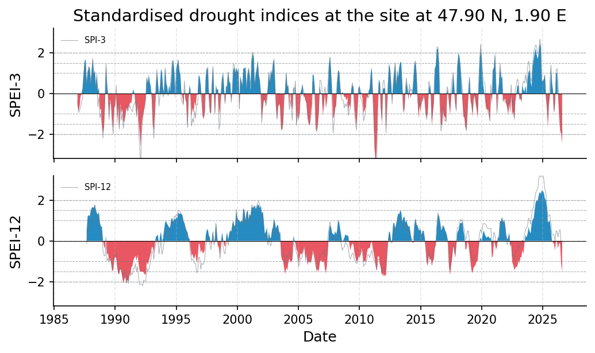
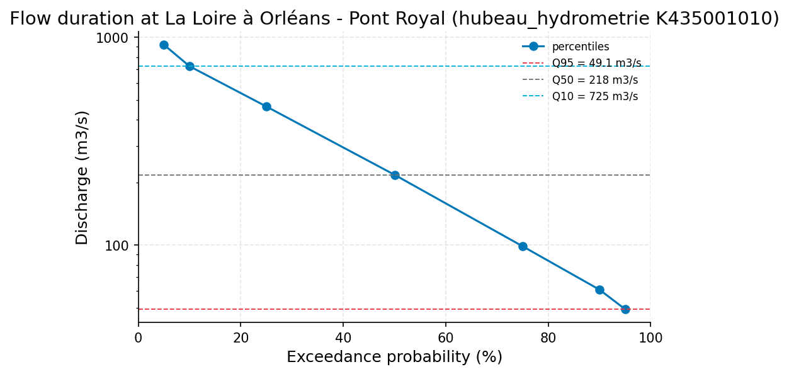
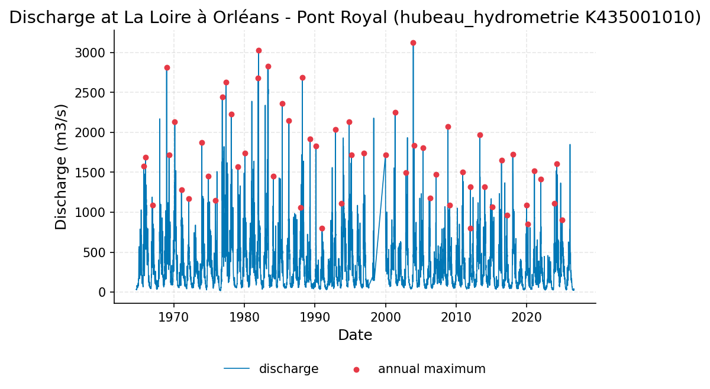
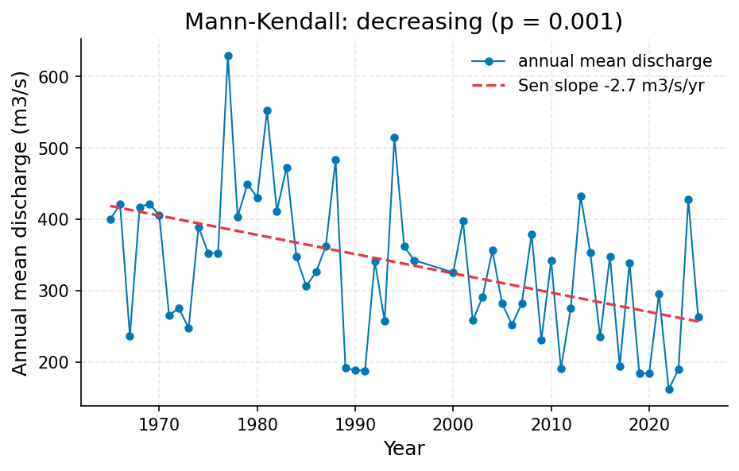

# Loire at Orleans: Hydrological Drought Status and Rainfall-Deficit Tracking (Hub'Eau K435001010 / ERA5)

**Author:** AquaScope Studio  
**Date:** 2026-09-14  
**Description:** determine whether the Loire at Orleans is currently in hydrological drought and how closely its low-flow deficit tracks the rainfall (SPEI) deficit, to support water-supply management decisions  
**Data Sources:** BasinATLAS (HydroATLAS v1.0), ERA5 via Open-Meteo, hubeau_hydrometrie, similar_basins  
**Version:** 1.0  

**Site:** 47.9000 N, 1.9000 E

**Answer.** Notice: the Critic's fix requests on findings were not all resolved; read the report with the list of what this study does not establish.

The Loire at Orleans is currently in hydrological drought, overall grade indicative, resting on a baseflow index of 0.7923 at Hub'Eau station K435001010 (La Loire a Orleans - Pont Royal, 62.7-year daily record; established). Q95 low flow is 49.13 m3/s and the 10-year low-flow threshold (7Q10) is 29.02 m3/s at the same station; the last 30 days averaged 27.914 m3/s (99.47th percentile of low flow) and the last 90 days 29.637 m3/s (99.14th percentile), both below 7Q10 (established). ERA5-derived SPEI-3 reads -2.458 (extremely dry) and SPEI-12 -1.523 (severely dry) for 2026-08-01, while precipitation-only SPI-3 reads -1.928 (severely dry) and SPI-12 -0.327 (near normal), a screening-grade signal from a 9 km reanalysis cell. The 58-year annual-mean discharge trend at K435001010 (within its 62.7-year record) is significantly decreasing (Sen's slope -2.701 m3/s per year, p=0.0007), suggesting the current low flow sits on top of a long-term decline.

*Key numbers*

| Quantity | Value | Unit | Step |
| --- | --- | --- | --- |
| SPI at 3 months, 2026-08-01 (severely dry) | -1.928 |  | s1 |
| SPEI at 3 months, 2026-08-01 (extremely dry) | -2.458 |  | s1 |
| SPI at 12 months, 2026-08-01 (near normal) | -0.3272 |  | s1 |
| SPEI at 12 months, 2026-08-01 (severely dry) | -1.523 |  | s1 |
| ERA5 temperature trend | 0.3454 | C per decade | s1 |
| Q95 | 49.13 | m3/s | s2 |
| Q50 | 217.8 | m3/s | s2 |
| 7Q10 | 29.02 | m3/s | s2 |
| Baseflow index | 0.7923 |  | s2 |
| Record length | 62.0 | years | s3 |
| Mean of the record | 328.6 | m3/s | s3 |
| 100-year return level, GEV (L-moments) | 3470.0 | m3/s | s3 |
| 100-year return level, Log-Pearson III | 3523.0 | m3/s | s3 |
| 100-year LP3 90 % interval, low | 3052.0 | m3/s | s3 |
| 100-year LP3 90 % interval, high | 4068.0 | m3/s | s3 |
| Q95 (exceeded 95 % of days) | 50.0 | m3/s | s3 |
| Q50 (median flow) | 218.2 | m3/s | s3 |
| Q10 | 725.0 | m3/s | s3 |
| Mann-Kendall p-value (annual mean) | < 0.001 |  | s3 |
| Sen's slope | -2.701 | m3/s per year | s3 |
| 2-year return level, GEV (L-moments) | 1627.0 | m3/s | s3 |
| 2-year return level, Log-Pearson III | 1619.0 | m3/s | s3 |
| 5-year return level, GEV (L-moments) | 2168.0 | m3/s | s3 |
| 5-year return level, Log-Pearson III | 2159.0 | m3/s | s3 |
| 10-year return level, GEV (L-moments) | 2507.0 | m3/s | s3 |
| 10-year return level, Log-Pearson III | 2502.0 | m3/s | s3 |
| 25-year return level, GEV (L-moments) | 2912.0 | m3/s | s3 |
| 25-year return level, Log-Pearson III | 2922.0 | m3/s | s3 |
| 50-year return level, GEV (L-moments) | 3198.0 | m3/s | s3 |
| 50-year return level, Log-Pearson III | 3226.0 | m3/s | s3 |

## Summary

The Loire at Orleans is in hydrological drought by its own flow record: the last 30-90 days sit near the 99th flow-deficit percentile, below the 7Q10 threshold of 29.02 m3/s, at Hub'Eau station K435001010 (62.7 years). The rainfall-based SPEI-3/12 (ERA5 cell, 47.9N/1.9E) confirm a concurrent severe-to-extreme deficit (-2.458 and -1.523), with SPI showing the 12-month rainfall total itself near normal (-0.327), implying the deficit is increasingly evaporative-demand driven. A significant long-term decline in annual mean flow (Sen's slope -2.701 m3/s/yr, p=0.0007, 58 years within the longer 62.7-year record) indicates the drought is compounding a structural trend, not a one-off. No formal lag between rainfall deficit and streamflow deficit could be computed; only concurrent current-month values were compared. Confidence in the flow-based findings is established; confidence in the SPEI/SPI findings is capped at screening because they come from a 9 km reanalysis cell rather than a gauge.

## The decision

Decide water-supply posture using the at-site low-flow indicators (Q95=49.13 m3/s, 7Q10=29.02 m3/s, BFI=0.7923, all established, K435001010) as the primary evidence that drought conditions are active now. The overall decision grade is indicative, not established, because the second half of the brief -- how closely the flow deficit tracks the SPEI deficit -- rests only on a qualitative concurrence of current-month values (SPEI-3 extremely dry, flow at 99th percentile), no lag or cross-correlation was computed. Conditions: treat the SPEI/SPI numbers as screening-grade (ERA5 ~9 km cell, Thornthwaite PET), and treat the flow numbers as established (62.7-year daily gauge record, all gates passed). What would change the grade: a cross-correlation/lag analysis between the SPEI series and a standardized flow-deficit index would let the tracking claim be quantified; an on-site or nearby rain gauge would let SPEI/SPI rise above screening; a same-day discharge reading would sharpen today's exact position relative to 7Q10.

## Findings

Six findings, in order. f1 (screening): SPEI-3 for the ERA5 cell reads -2.458 on 2026-08-01, classed extremely dry. f2 (screening): SPEI-12 reads -1.523, classed severely dry. f3 (screening): SPI-3, precipitation only, reads -1.928, severely dry, one class less severe than SPEI-3, implying an evaporative-demand contribution (ERA5 temperature trend +0.3454 C/decade, p=0.000771). f4 (established): Q95 at K435001010 is 49.13 m3/s. f5 (established): the baseflow index at K435001010 is 0.792, indicating a groundwater-dominated regime. f6 (established): the 58-year annual-mean flow trend at K435001010 (within the 62.7-year record) is significantly decreasing, Sen's slope -2.701 m3/s per year, p=0.0007. Cross-checks: SPI-3 and SPEI-3 agree on drought but SPEI reads one class drier; SPI-12 (near normal) and SPEI-12 (severely dry) disagree, with SPEI drier than SPI in 87.5 percent of months over the last decade; the 30-day mean flow (27.914 m3/s) already sits below 7Q10 (29.02 m3/s), consistent with the extremely-dry SPEI-3 reading for the same period.

## Problem and decision

The question is whether the Loire at Orleans is currently in hydrological drought and how closely its low-flow deficit tracks the rainfall (SPEI) deficit, to inform water-supply management. The decision requires both a current flow-drought status and a description of the rainfall-to-streamflow linkage, drawing on Q95, SPEI-3/12, a flow-deficit percentile, baseflow index, a rainfall-to-streamflow lag, and a long-term Mann-Kendall trend.

## Site and data

Discharge record: Hub'Eau station K435001010, La Loire a Orleans - Pont Royal, daily resolution, 62.7 years (1964-01-01 to 2026-09-13), the nearest available gauge to the site, 22097 daily observations, mean flow 327.6-328.6 m3/s. No on-site precipitation gauge exists; rainfall-based indices instead use ERA5 reanalysis precipitation and temperature for the 47.9N/1.9E grid cell (about 9 km resolution, elevation 110 m), 39.9 years of monthly data (1986-10 to 2026-08), via Open-Meteo.

## Methodology

SPEI-3 and SPEI-12 were computed from ERA5 reanalysis precipitation and Thornthwaite PET (temperature-only) for the Orleans grid cell, since no rain gauge exists at the site. The river's current low-flow state was characterised at Hub'Eau K435001010 using flow-duration statistics (Q95/Q50/Q10, Weibull plotting positions), a Lyne-Hollick baseflow filter, and the 7Q10 low-flow frequency estimate, plus where the last 30-90 days sit against the historical distribution. The same 62-year discharge record was tested for a long-term monotonic trend with Mann-Kendall and Sen's slope on annual means. Rainfall-deficit and streamflow-deficit timing were compared only qualitatively (concurrent current-month values), since the catalogue's formal lag tool (drought_propagation) requires a groundwater SGI not available here.

## Results: step s1

ERA5-derived indices for the Orleans cell (39.9 years, 1986-2026): SPEI-3 = -2.458 (extremely dry) and SPI-3 = -1.928 (severely dry) as of 2026-08-01; SPEI-12 = -1.523 (severely dry) and SPI-12 = -0.327 (near normal). Divergence: SPEI has read drier than SPI in 73.3 percent of months at 3 months and 87.5 percent at 12 months over the record, and the current 3-month divergence (-0.530) exceeds the last-decade mean divergence (-0.209). ERA5 annual mean temperature trend is +0.3454 C per decade (p = 0.000771), an increasing trend over 39 years. Both timescale reads are screening-grade, resting on a reanalysis cell, not a gauge.


*SPEI (bars) with SPI (grey line) at the site at 47.90 N, 1.90 E for the 3, 12 month accumulations, 1986 to 2026: blue above zero is wetter than normal, red below is drier; the dashed lines mark the moderate (1), severe (1.5) and extreme (2) classes.*

*Monthly SPI and SPEI at the site at 47.90 N, 1.90 E per timescale.*

| date | spi_3 | spei_3 | spi_12 | spei_12 |
| --- | --- | --- | --- | --- |
| 1986-12-01 | -0.3710771935294534 | -0.5566523061665469 |  |  |
| 1987-01-01 | -0.926888564191818 | -0.8663032597032907 |  |  |
| 1987-02-01 | -0.8040040197343553 | -0.6496503195711834 |  |  |
| 1987-03-01 | -0.7087925408389752 | -0.1522731815117852 |  |  |
| 1987-04-01 | -0.3732587453578881 | -0.0131842549645908 |  |  |
| 1987-05-01 | -0.2921715994866773 | 0.282429230610245 |  |  |
| 1987-06-01 | 0.5259283219006221 | 1.0108972064168729 |  |  |
| 1987-07-01 | 1.3327821760505452 | 1.595126871593384 |  |  |
| 1987-08-01 | 1.4342796062475467 | 1.6784044246381788 |  |  |
| 1987-09-01 | 0.3732577424916009 | 0.4426217218853487 | -0.1375839300077677 | 0.5235137523211528 |
| 1987-10-01 | 1.057510799888823 | 1.0469241009991102 | 0.6000659380720123 | 1.2044295927045003 |
| 1987-11-01 | 1.3203363947861155 | 1.2196065201016757 | 0.708059214532938 | 1.269397574311009 |
| 1987-12-01 | 1.1957270259796091 | 1.3263907120639664 | 0.55620362551345 | 1.2065187008724592 |
| 1988-01-01 | 0.5371219194368707 | 0.4841785962468011 | 1.1087737375373168 | 1.4887161155793125 |
| 1988-02-01 | 1.0505063276663835 | 1.1705981785412554 | 1.3706433915887533 | 1.630470831860573 |
| 1988-03-01 | 1.7156469460364356 | 1.7196223909918582 | 1.5340943223655257 | 1.6567067394984587 |
| 1988-04-01 | 0.8438925588331174 | 0.9688007637815824 | 1.4233491748406903 | 1.6158476316179775 |
| 1988-05-01 | 1.0462047042362783 | 1.135046082590135 | 1.772455106168419 | 1.7870850061652093 |
| 1988-06-01 | 0.2344964758286998 | 0.3380777960376206 | 1.4036010809452042 | 1.5227774115698265 |
| 1988-07-01 | 0.7801405356252279 | 1.04947268230846 | 1.1603083126048874 | 1.3693178294527002 |
| 1988-08-01 | -0.6540517560357572 | 0.1283359213253393 | 1.0978000565016015 | 1.2907062711363586 |
| 1988-09-01 | -0.1573649203124107 | 0.3078127679282856 | 1.223041577578618 | 1.4359298151166524 |
| 1988-10-01 | -1.2051710697188005 | -0.8074415746002817 | 0.4609357822799504 | 0.8811629269338142 |
| 1988-11-01 | -0.9672713161489276 | -0.7336309485386536 | 0.3011779222937782 | 0.7175264640093763 |
| 1988-12-01 | -1.527988968423621 | -1.4975961435820144 | 0.321266803931488 | 0.6859906772981978 |
| 1989-01-01 | -2.195088079314246 | -1.9399180479129257 | -0.4905831405478422 | -0.0024795499763987 |
| 1989-02-01 | -1.3040983160612138 | -1.6642702880137057 | -0.7199661741216465 | -0.2636318316831638 |
| 1989-03-01 | -0.2015653899017308 | -0.4580828244355099 | -0.7458688999534682 | -0.3788172725418953 |
| 1989-04-01 | 1.460404141046685 | 1.4727255716300014 | -0.1418602890277162 | 0.2790025327633537 |
| 1989-05-01 | 0.4492282550322505 | 0.3292132516579754 | -0.9781483335533632 | -0.6671838462804629 |
| 1989-06-01 | -0.0672167700406051 | -0.0893680281993602 | -0.8571152674068353 | -0.604942346517015 |
| 1989-07-01 | -1.2710789486913074 | -1.143767122827268 | -1.043849173812094 | -0.9804022414759443 |
| 1989-08-01 | -0.4432085465056094 | -0.3060598506223885 | -0.8911564992856611 | -0.8427851405922724 |
| 1989-09-01 | -0.4877578646905735 | -0.5546253934571084 | -1.012065319247115 | -1.1122731839377162 |
| 1989-10-01 | -1.3984836567835437 | -1.258487825594854 | -1.264877647056602 | -1.4643051815933112 |
| 1989-11-01 | -1.9898709758681223 | -1.7039696138916498 | -1.3754042822145294 | -1.4726745853378826 |
| 1989-12-01 | -0.613430928781298 | -0.7042334603401443 | -0.8017192815039726 | -0.8937532871568546 |
| 1990-01-01 | -0.4832689172396366 | -0.6032705663277641 | -0.673057343686874 | -0.8012277787274398 |
| 1990-02-01 | 0.3874287544661144 | 0.0509912363304042 | -0.6019067890583334 | -0.8284731199434455 |
| 1990-03-01 | -1.1305941302102491 | -1.557077717675773 | -1.1013324586707935 | -1.3038229914504915 |
| 1990-04-01 | -0.282345852374161 | -0.5372744589103111 | -1.4582274064127942 | -1.6135454468708723 |
| 1990-05-01 | -1.7221032701681027 | -1.857609232781456 | -1.4358540037393777 | -1.6330991621988844 |
| 1990-06-01 | -0.6352952858546553 | -0.4913865593438436 | -1.3208894496489123 | -1.3878887779260862 |
| 1990-07-01 | -1.3174751824450197 | -0.9785208680527484 | -1.4192198438329255 | -1.4527162947609102 |
| 1990-08-01 | -1.009612371114353 | -0.7701543585089261 | -1.6741698843373531 | -1.7978674968795445 |
| 1990-09-01 | -1.7202848047810877 | -1.3720528782212875 | -1.821506916560164 | -2.08501510905343 |
| 1990-10-01 | -1.207834709391784 | -1.3981461210972004 | -1.546900043663873 | -1.897918049397309 |
| 1990-11-01 | -1.0419590968721173 | -1.0644412664828455 | -1.5304528530938186 | -1.7608560140448828 |
| 1990-12-01 | -0.5689660661472568 | -0.6472783108858595 | -2.078764809884128 | -2.072664581779561 |
| 1991-01-01 | -0.8635849113201561 | -0.8644797680092156 | -1.7201273728060085 | -1.912678792932504 |

*Drought classes, worst months and event counts per timescale at the site at 47.90 N, 1.90 E.*

| timescale | index | current | class | date | worst | worst_date | events | n |
| --- | --- | --- | --- | --- | --- | --- | --- | --- |
| 3 | SPI | -1.927686126263764 | severely_dry | 2026-08-01 | -3.667768809876612 | 1992-02-01 | 39 | 477 |
| 3 | SPEI | -2.457950923283674 | extremely_dry | 2026-08-01 | -3.4207451616340414 | 2011-05-01 | 42 | 477 |
| 12 | SPI | -0.3271880620261255 | normal | 2026-08-01 | -2.199432570528178 | 1992-04-01 | 16 | 468 |
| 12 | SPEI | -1.522674827810249 | severely_dry | 2026-08-01 | -2.08501510905343 | 1990-09-01 | 24 | 468 |

*Divergence between SPEI and SPI per timescale at the site at 47.90 N, 1.90 E.*

| timescale | current | mean_last_10y | months_spei_drier_pct | correlation | n |
| --- | --- | --- | --- | --- | --- |
| 3 | -0.5302647970199095 | -0.2091552909470868 | 73.33333333333333 | 0.9549612862824832 | 477 |
| 12 | -1.1954867657841235 | -0.3682863342860524 | 87.5 | 0.9344553649793886 | 468 |

## Results: step s2

At Hub'Eau K435001010 (62.7 years): Q95 = 49.13 m3/s, Q50 = 217.8 m3/s, Q10 = 725.0 m3/s (fdc), 7Q10 = 29.02 m3/s, baseflow index = 0.7923. These are established results, all gates passed.


*Flow-duration curve of discharge at La Loire à Orléans - Pont Royal (hubeau_hydrometrie K435001010) from the 7 percentiles the tool reported, with Q95, Q50 and Q10 marked (log scale).*

*Low-flow statistics at La Loire à Orléans - Pont Royal (hubeau_hydrometrie K435001010).*

| item | value |
| --- | --- |
| source | hubeau_hydrometrie |
| station_id | K435001010 |
| variable | discharge |
| unit | m3/s |
| start | 1964-01-01 |
| end | 2026-09-13 |
| years | 62.7 |
| fetch_note | Hub'Eau elaborated daily mean discharge (obs_elab QmnJ); full record requested (from 1964-01-01, the catalog's first date for this station). |
| stats.mean | 327.55440077838625 |
| stats.min | 17.7 |
| stats.max | 3126.138 |
| n_days | 22097 |
| bfi | 0.7923352462087423 |
| low_flow.7q10 | 29.022614285714422 |
| low_flow.text | minimum 7-day mean flow with a 10-year return period (Weibull) |
| recent.end | 2026-09-13 |
| recent.last_30d_mean | 27.914000000000005 |
| recent.last_30d_exceedance_pct | 99.47051635968684 |
| recent.last_90d_mean | 29.636988888888887 |
| recent.last_90d_exceedance_pct | 99.140154772141 |
| station_name | La Loire à Orléans - Pont Royal |
| name | La Loire à Orléans - Pont Royal |
| fdc.q05 | 920.108 |
| fdc.q10 | 725.0 |
| fdc.q25 | 464.0 |
| fdc.q50 | 217.819 |
| fdc.q75 | 98.637 |
| fdc.q90 | 61.0 |
| fdc.q95 | 49.131 |
| stats.mean | 327.55440077838625 |
| stats.min | 17.7 |
| stats.max | 3126.138 |
| low_flow.7q10 | 29.022614285714422 |
| low_flow.text | minimum 7-day mean flow with a 10-year return period (Weibull) |
| recent.end | 2026-09-13 |
| recent.last_30d_mean | 27.914000000000005 |
| recent.last_30d_exceedance_pct | 99.47051635968684 |
| recent.last_90d_mean | 29.636988888888887 |
| recent.last_90d_exceedance_pct | 99.140154772141 |

## Results: step s3

Re-running the same station over 62.0 years (21840 daily observations) gives Q95 = 50.0 m3/s, Q50 = 218.2 m3/s, Q10 = 725.0 m3/s, consistent with s2. Mann-Kendall on annual mean flow: tau = -0.3055, p = 0.0007, Sen's slope = -2.701 m3/s per year over 58 years, a significant decreasing trend. A parallel Mann-Kendall on annual maxima also decreases (tau = -0.2486, p = 0.006, slope -13.57 m3/s per year), and GEV/Log-Pearson III flood-frequency fits (e.g. 100-year return level 3470-3523 m3/s, 90 percent LP3 interval 3052-4068 m3/s) were produced but describe high-flow behaviour, not used to answer this low-flow question.


*Daily discharge at La Loire à Orléans - Pont Royal (hubeau_hydrometrie K435001010), 1964 to 2026, with the annual maxima marked.*


*Annual mean discharge at La Loire à Orléans - Pont Royal (hubeau_hydrometrie K435001010) with the Sen slope line; the Mann-Kendall test finds decreasing (p = 0.001, 58 years).*

*The record (21840 rows) is in the workbook (`workbook.xlsx`, sheet `s3_series`) and the notebook, not printed here.*

*Summary of the record at La Loire à Orléans - Pont Royal (hubeau_hydrometrie K435001010).*

| item | value |
| --- | --- |
| source | hubeau_hydrometrie |
| station_id | K435001010 |
| variable | discharge |
| unit | m3/s |
| n | 21840 |
| start | 1964-09-14 |
| end | 2026-09-13 |
| years | 62.0 |
| stats.mean | 328.5606 |
| stats.median | 218.2545 |
| stats.min | 17.7 |
| stats.max | 3126.138 |

*Annual maxima at La Loire à Orléans - Pont Royal (hubeau_hydrometrie K435001010).*

| year | value |
| --- | --- |
| 1965 | 1580.0 |
| 1966 | 1690.0 |
| 1967 | 1090.0 |
| 1968 | 2810.0 |
| 1969 | 1720.0 |
| 1970 | 2130.0 |
| 1971 | 1280.0 |
| 1972 | 1170.0 |
| 1973 | 1870.0 |
| 1974 | 1450.0 |
| 1975 | 1150.0 |
| 1976 | 2440.0 |
| 1977 | 2630.0 |
| 1978 | 2230.0 |
| 1979 | 1570.0 |
| 1980 | 1740.0 |
| 1981 | 2680.0 |
| 1982 | 3030.0 |
| 1983 | 2830.0 |
| 1984 | 1450.0 |
| 1985 | 2360.0 |
| 1986 | 2150.0 |
| 1987 | 1060.0 |
| 1988 | 2690.0 |
| 1989 | 1920.0 |
| 1990 | 1830.0 |
| 1991 | 800.0 |
| 1992 | 2040.0 |
| 1993 | 1110.0 |
| 1994 | 2131.107 |
| 1995 | 1716.361 |
| 1996 | 1742.035 |
| 2000 | 1720.0 |
| 2001 | 2253.639 |
| 2002 | 1494.333 |
| 2003 | 3126.138 |
| 2004 | 1839.86 |
| 2005 | 1805.392 |
| 2006 | 1177.013 |
| 2007 | 1474.822 |
| 2008 | 2077.005 |
| 2009 | 1088.137 |
| 2010 | 1506.471 |
| 2011 | 803.154 |
| 2012 | 1320.122 |
| 2013 | 1968.024 |
| 2014 | 1319.322 |
| 2015 | 1067.095 |
| 2016 | 1649.365 |
| 2017 | 965.296 |

*Return levels at La Loire à Orléans - Pont Royal (hubeau_hydrometrie K435001010) by return period, with the confidence band.*

| T | GEV | LP3 | lower | upper |
| --- | --- | --- | --- | --- |
| 2.0 | 1626.9112 | 1618.7612 | 1500.0413 | 1746.8771 |
| 5.0 | 2168.2642 | 2159.1201 | 1975.6108 | 2359.6752 |
| 10.0 | 2506.5075 | 2502.4007 | 2258.4808 | 2772.6643 |
| 25.0 | 2912.185 | 2922.1847 | 2591.5355 | 3295.021 |
| 50.0 | 3198.2426 | 3226.1147 | 2826.1681 | 3682.6599 |
| 100.0 | 3470.2286 | 3523.4977 | 3051.5463 | 4068.441 |

*Flow-duration percentiles at La Loire à Orléans - Pont Royal (hubeau_hydrometrie K435001010).*

| exceedance_pct | value |
| --- | --- |
| 10.0 | 725.0 |
| 50.0 | 218.22 |
| 95.0 | 50.0 |

*Mann-Kendall trend test and Sen slope at La Loire à Orléans - Pont Royal (hubeau_hydrometrie K435001010).*

| item | value |
| --- | --- |
| on | annual mean |
| p_value | 0.0007 |
| tau | -0.3055 |
| trend | decreasing |
| sens_slope_per_year | -2.7006 |
| n_years | 58 |

## Limitations and what this study does not establish

SPEI-3/12 are monthly-resolution and cannot resolve week-to-week or flash-drought dynamics. They rest on an ERA5 ~9 km cell rather than a rain gauge, so they describe area climate, not a point record, and use Thornthwaite (temperature-only) PET rather than FAO-56 Penman-Monteith. No formal lag between rainfall deficit and streamflow deficit could be computed: the catalogue's drought_propagation tool needs a groundwater SGI, not available here; the tracking claim rests on concurrent current-month values only. SPEI and flow percentiles show association, not causation; pumping, reservoir operation, or the catchment's dams could also drive part of the observed low-flow deficit. No cause is stated for the long-term flow trend.

## Caveats

- Monthly resolution: the indices see droughts a month and longer; what happened this week is not in them, and a flash drought is out of their reach.
- SPI and SPEI say how unusual a deficit is against this record; they say nothing about its cause, and the SPI-to-SGI lag is a statistical association read off the two series, not a model of the aquifer.
- SPEI needs a PET series: here PET is Thornthwaite (1948) from ERA5 temperature, a temperature-only approximation and the formulation SPEI was introduced with; FAO-56 Penman-Monteith is the better PET where humidity, wind and radiation exist.
- No rain gauge within reach: the indices describe the ERA5 cell (about 9 km), a reanalysis climate, not a gauge; a gauge record with twenty years is what turns this into a station answer.

## Recommendations

Adopt the at-site low-flow indicators as the operative basis for water-supply decisions now: Q95 = 49.13 m3/s and 7Q10 = 29.02 m3/s at K435001010, with the last 30-90 days already below 7Q10, support treating the Loire at Orleans as in active hydrological drought. Condition this on the SPEI/SPI reads remaining screening-grade evidence only (reanalysis cell, not a gauge), and do not conclude a quantified rainfall-to-streamflow lag, since none was computed. To firm this up, obtain a cross-correlation/lag analysis between the SPEI-3/12 series and an at-site standardized flow-deficit index, an on-site or nearby rain gauge to raise the SPEI/SPI grade, and a same-day discharge reading to pin down today's exact position relative to 7Q10.

## References

1. Vicente-Serrano et al. (2010)
2. Hersbach, H. et al. (2020). The ERA5 global reanalysis. Q. J. R. Meteorol. Soc., 146, 1999-2049
3. Mann, H. B. (1945). Nonparametric tests against trend. Econometrica, 13, 245-259
4. Kendall (1975)
5. Sen, P. K. (1968). J. Am. Stat. Assoc., 63, 1379-1389.
6. McKee, T. B., Doesken, N. J., & Kleist, J. (1993). The relationship of drought frequency and duration to time scales. Proc. 8th Conf. on Applied Climatology, 179-184.
7. WMO (2012). Standardized Precipitation Index User Guide (Svoboda, Hayes, Wood). WMO-No. 1090.
8. Vicente-Serrano, S. M., Begueria, S., & Lopez-Moreno, J. I. (2010). A multiscalar drought index sensitive to global warming: the Standardized Precipitation Evapotranspiration Index. J. Climate 23, 1696-1718. doi:10.1175/2009JCLI2909.1; Begueria, S. et al. (2014). SPEI revisited: parameter fitting, evapotranspiration models, tools, datasets and drought monitoring. Int. J. Climatol. 34, 3001-3023. doi:10.1002/joc.3887
9. Thornthwaite, C. W. (1948). An approach toward a rational classification of climate. Geographical Review 38, 55-94.
10. Open-Meteo.com (CC BY 4.0).
11. Vogel, R. M., & Fennessey, N. M. (1994). Flow-duration curves I: new interpretation and confidence intervals. J. Water Resour. Plann. Manage., 120(4), 485-504.
12. Lyne, V., & Hollick, M. (1979). Stochastic time-variable rainfall-runoff modelling. Inst. Eng. Aust. Natl. Conf. Publ. 79/10, 89-93.
13. Smakhtin, V. U. (2001). Low flow hydrology: a review. J. Hydrol. 240, 147-186.
14. Hosking, J. R. M. (1990). L-moments: analysis and estimation of distributions using linear combinations of order statistics. J. R. Stat. Soc. B, 52(1), 105-124.
15. England, J. F. Jr. et al. (2018). Guidelines for determining flood flow frequency, Bulletin 17C. USGS Techniques and Methods 4-B5.
16. Begueria, S., Vicente-Serrano, S. M., Reig, F., & Latorre, B. (2014). Standardized precipitation evapotranspiration index (SPEI) revisited. Int. J. Climatol. 34, 3001-3023. doi:10.1002/joc.3887
17. Bloomfield, J. P., & Marchant, B. P. (2013). Analysis of groundwater drought building on the standardised precipitation index approach. Hydrol. Earth Syst. Sci. 17, 4769-4787.
18. SPI against SPEI at 219 stations across Turkiye: Earth Science Informatics (2024), doi:10.1007/s12145-024-01401-8
19. SPI-SPEI correlation under warming in Umbria: Environ. Sci. Pollut. Res. (2024), doi:10.1007/s11356-024-35740-2
20. Rekin226 and contributors (2026). AquaScope: Open-source water data aggregation toolkit (version 0.16.0) [Software]. Zenodo. https://doi.org/10.5281/zenodo.21903143

## Appendix: reproducibility

Re-run the same steps with no model: `aquascope run study.yaml`. Resume the workspace: `aquascope studio --resume workspace.json`.

Model: claude-sonnet-5 via anthropic; ledger: consultant 1 call(s), 4768 tokens, methodologist 1 call(s), 18641 tokens, interpreter 1 call(s), 22222 tokens, author 1 call(s), 20097 tokens, critic 1 call(s), 20340 tokens. aquascope 0.16.0.

```yaml
# An AquaScope study (version 3): the plan behind an answer, its gates, and what happened.
#   aquascope run study.yaml
version: 3
title: "Determine whether the Loire at Orleans is currently in hydro: 47.9, 1.9"
question: "Is the Loire at Orleans in hydrological drought, and how does the river's low flow follow the rainfall deficit?"
created: "2026-09-14T22:42:06+00:00"
aquascope_version: "0.16.0"
author: "methodologist"
model: "claude-sonnet-5"
problem:
  kind: "drought"
  site: {"lat": 47.9, "lon": 1.9}
  params: {"timescales": [3, 12], "drought_concern": "water supply", "flash_drought": false}
  text: "Is the Loire at Orleans in hydrological drought, and how does the river's low flow follow the rainfall deficit?"
plan:
  author: "methodologist"
  playbook: "drought_status"
  objective: "Determine whether the Loire at Orleans is currently in hydrological drought and quantify how closely its low-flow deficit tracks the ERA5-derived rainfall (SPEI) deficit, to support water-supply decisions."
  decision: "Establish current drought status (Q95, low-flow percentile, baseflow index, long-term trend) at Hubeau station K435001010 and compare it against SPEI-3/SPEI-12 computed from ERA5 reanalysis for the site, since no local precipitation or groundwater record exists."
  methodology: ["Compute SPEI at 3- and 12-month timescales from ERA5 reanalysis precipitation and temperature for the Orleans cell, since no on-site rain gauge exists to support standard SPI/SPEI.", "Characterise the river's current low-flow state at the nearest discharge gauge (Hubeau K435001010, 0.4 km, 62.7 years) with Q95/Q50/Q10, baseflow index and where the last 30-90 days sit in the historical record.", "Test the 62.7-year discharge record at the same gauge for a long-term monotonic trend with the Mann-Kendall test to see whether low flows are worsening independent of the current drought episode.", "Compare the timing and severity of the SPEI-3/12 deficit episodes against the low-flow/drought-severity percentile from the gauge to describe, qualitatively, how closely rainfall deficit and streamflow deficit track one another, since no groundwater or precipitation gauge exists at the site to formally test lag with drought_propagation."]
  assumptions: ["Discharge record used is Hubeau station K435001010 (La Loire a Orleans - Pont Royal), daily resolution, 62.7 years of record, 0.4 km from the site", "SPEI at 3- and 12-month timescales will be derived from ERA5 reanalysis precipitation and FAO-56 ET0 since no on-site precipitation record exists", "flash_drought left at playbook default (false) since not mentioned in the brief", "Low-flow statistic Q95 and low_flow_frequency, flow_duration, baseflow_separation, and trend_mann_kendall methods are all defensible with the available discharge record", "SPEI-3 and SPEI-12 are derived from ERA5 reanalysis precipitation and temperature-based PET for the site cell rather than from a local rain gauge", "flash_drought is left at the playbook default (false) as the brief does not raise sub-monthly flash-drought concerns", "40 years of ERA5 record is sufficient and representative for the SPEI-3/12 climatology at this site", "The full 62.7-year discharge record is used for the Mann-Kendall trend test to maximise power to detect a long-term drift"]
  alternatives: [{"method": "spi/spei from a local rain gauge", "why_not": "no precipitation gauge exists at the site so SPI/SPEI cannot be computed from local records (marked not_defensible)"}, {"method": "sgi (groundwater drought index)", "why_not": "no groundwater level record exists at this site so SGI cannot be computed (marked not_defensible)"}, {"method": "drought_propagation lag analysis", "why_not": "this tool computes SGI-based lag between SPI and groundwater; with no groundwater record it cannot be applied to give a formal rainfall-to-streamflow lag"}]
  limitations_expected: ["SPEI-3/12 are monthly-resolution indices; they describe multi-week to multi-month deficits and cannot resolve week-to-week or flash-drought dynamics", "SPEI here rests on ERA5 reanalysis for a roughly 9 km cell, not a gauge, so it characterises the area's climate rather than a point rainfall record", "PET behind SPEI is typically a temperature-only approximation (Thornthwaite) from ERA5 temperature rather than full FAO-56 Penman-Monteith, which would be preferable were humidity, wind and radiation available", "No formal statistical lag between rainfall deficit and streamflow deficit can be computed because the only lag tool in the catalogue (drought_propagation) is built around the groundwater SGI, which is not defensible here for lack of a well record", "SPEI and low-flow percentiles show association, not causation; pumping, reservoir operation or the four dams noted in the catchment could also drive part of the observed low-flow deficit"]
  citations: ["McKee, T. B., Doesken, N. J., & Kleist, J. (1993). The relationship of drought frequency and duration to time scales. Proc. 8th Conf. on Applied Climatology, 179-184.", "Vicente-Serrano, S. M., Begueria, S., & Lopez-Moreno, J. I. (2010). A multiscalar drought index sensitive to global warming: the Standardized Precipitation Evapotranspiration Index. J. Climate 23, 1696-1718. doi:10.1175/2009JCLI2909.1", "Begueria, S., Vicente-Serrano, S. M., Reig, F., & Latorre, B. (2014). Standardized precipitation evapotranspiration index (SPEI) revisited. Int. J. Climatol. 34, 3001-3023. doi:10.1002/joc.3887", "Thornthwaite, C. W. (1948). An approach toward a rational classification of climate. Geographical Review 38, 55-94.", "Bloomfield, J. P., & Marchant, B. P. (2013). Analysis of groundwater drought building on the standardised precipitation index approach. Hydrol. Earth Syst. Sci. 17, 4769-4787.", "WMO (2012). Standardized Precipitation Index User Guide (Svoboda, Hayes, Wood). WMO-No. 1090.", "SPI against SPEI at 219 stations across Turkiye: Earth Science Informatics (2024), doi:10.1007/s12145-024-01401-8", "SPI-SPEI correlation under warming in Umbria: Environ. Sci. Pollut. Res. (2024), doi:10.1007/s11356-024-35740-2", "Hersbach, H. et al. (2020). The ERA5 global reanalysis. Q. J. R. Meteorol. Soc. 146, 1999-2049."]
  caveats: ["Monthly resolution: the indices see droughts a month and longer; what happened this week is not in them, and a flash drought is out of their reach.", "SPI and SPEI say how unusual a deficit is against this record; they say nothing about its cause, and the SPI-to-SGI lag is a statistical association read off the two series, not a model of the aquifer.", "SPEI needs a PET series: here PET is Thornthwaite (1948) from ERA5 temperature, a temperature-only approximation and the formulation SPEI was introduced with; FAO-56 Penman-Monteith is the better PET where humidity, wind and radiation exist.", "No rain gauge within reach: the indices describe the ERA5 cell (about 9 km), a reanalysis climate, not a gauge; a gauge record with twenty years is what turns this into a station answer."]
  rationale: "Determine whether the Loire at Orleans is currently in hydrological drought and quantify how closely its low-flow deficit tracks the ERA5-derived rainfall (SPEI) deficit, to support water-supply decisions."
  recon_notes: ["Record resolution is not in the catalog; daily is assumed for every variable.", "10 donor gauges from a pool of 34,786 gauged catchments.", "ERA5 temperature and forcing and GloFAS discharge are assumed reachable for any point on land (Open-Meteo); not checked here.", "CMIP6 change factors need model output you supply (aquascope.climate works on downloaded data); not counted."]
steps:
  - tool: "drought_indices"
    id: "s1"
    rationale: "SPEI-3 and SPEI-12 must come from ERA5 reanalysis climate since no precipitation gauge exists at the site, per the brief's stated constraint."
    method: "spei_reanalysis"
    arguments:
      lat: 47.9
      lon: 1.9
      timescales: [3, 12]
      years: 40
    expects:
      - {"check": "min_years", "path": "years", "value": 30}
      - {"check": "not_empty", "path": "indices"}
      - {"check": "not_empty", "path": "current.spei"}
    outputs: [{"kind": "figure", "id": "s1_drought_strip", "caption": "SPEI-3/SPEI-12 drought strip for the Orleans ERA5 cell"}, {"kind": "table", "id": "s1_indices_monthly", "caption": "monthly SPEI-3/SPEI-12 indices"}, {"kind": "table", "id": "s1_drought_events", "caption": "identified drought events and severity"}]
  - tool: "low_flow_context"
    id: "s2"
    rationale: "The Loire's own low-flow signal (Q95, baseflow index, current percentile) is best read at the nearest discharge gauge, 0.4 km from the site with 62.7 years of daily record."
    method: "low_flow_frequency"
    arguments:
      source: "hubeau_hydrometrie"
      station_id: "K435001010"
    expects:
      - {"check": "min_years", "path": "years", "value": 20}
    outputs: [{"kind": "figure", "id": "s2_fdc", "caption": "flow duration curve with Q95/Q50/Q10 marked"}, {"kind": "table", "id": "s2_low_flow_stats", "caption": "low-flow statistics including baseflow index and current percentile position"}]
  - tool: "analyze_station"
    id: "s3"
    rationale: "The long-term Mann-Kendall trend needs the full multi-decadal discharge record at the same gauge to detect a monotonic low-flow drift distinct from the current SPEI episode."
    method: "trend_mann_kendall"
    arguments:
      source: "hubeau_hydrometrie"
      station_id: "K435001010"
      years: 62.7
      variable: "discharge"
    expects:
      - {"check": "min_years", "path": "years", "value": 30}
      - {"check": "sampling_density", "path": "sampling", "value": "daily"}
      - {"check": "not_empty", "path": "trend"}
      - {"check": "unit_present", "path": "unit"}
    outputs: [{"kind": "table", "id": "s3_trend", "caption": "Mann-Kendall trend statistic and p-value for daily discharge"}]
results:
  s1: {"ok": true, "gates": [{"check": "min_years", "passed": true, "detail": "39.9 years of record, 30 needed"}, {"check": "not_empty", "passed": true, "detail": "'indices' is present"}, {"check": "not_empty", "passed": true, "detail": "'current.spei' is present"}], "summary": "years=39.9, start=1986-10-01, end=2026-08-01", "fallback_used": false, "sha256": "77b860465071a8bd"}
  s2: {"ok": true, "gates": [{"check": "min_years", "passed": true, "detail": "62.7 years of record, 20 needed"}], "summary": "source=hubeau_hydrometrie, station_id=K435001010, variable=discharge, unit=m3/s, years=62.7, start=1964-01-01, end=2026-09-13", "fallback_used": false, "sha256": "3f634b0f5bdf396d"}
  s3: {"ok": true, "gates": [{"check": "min_years", "passed": true, "detail": "62 years of record, 30 needed"}, {"check": "sampling_density", "passed": true, "detail": "21840 observations in 62.0 years: 352.26 a year, about daily; daily claimed"}, {"check": "not_empty", "passed": true, "detail": "'trend' is present"}, {"check": "unit_present", "passed": true, "detail": "unit m3/s"}], "summary": "source=hubeau_hydrometrie, station_id=K435001010, variable=discharge, unit=m3/s, years=62.0, start=1964-09-14, end=2026-09-13", "fallback_used": false, "sha256": "8c8ec81dee7c03db"}
```

## Cite this software

AquaScope Studio (2026). AquaScope: Open-source water data aggregation toolkit (version 0.16.0) [Software]. Zenodo. https://doi.org/10.5281/zenodo.21903143


---

*{'model': 'claude-sonnet-5', 'provider': 'anthropic', 'prose': 'model', 'tokens': {'consultant': {'calls': 1, 'prompt_tokens': 3424, 'completion_tokens': 1344, 'cost_usd': 0.020288}, 'methodologist': {'calls': 1, 'prompt_tokens': 12276, 'completion_tokens': 6365, 'cost_usd': 0.088202}, 'interpreter': {'calls': 1, 'prompt_tokens': 10334, 'completion_tokens': 11888, 'cost_usd': 0.139548}, 'author': {'calls': 2, 'prompt_tokens': 31100, 'completion_tokens': 12120, 'cost_usd': 0.1834}, 'critic': {'calls': 1, 'prompt_tokens': 10872, 'completion_tokens': 9468, 'cost_usd': 0.116424}}, 'total_tokens': 109191, 'total_usd': 0.547862, 'budget': None, 'dropped': 2, 'aquascope_version': '0.16.0', 'date': '2026-09-14 22:48 UTC', 'workspace': '73741588ddea', 'plan_author': 'methodologist', 'written_by': {'answer': 'model', 'summary': 'model', 'decision': 'model', 'findings': 'model', 'problem': 'model', 'site_data': 'model', 'methodology': 'model', 'results-s1': 'model', 'results-s2': 'model', 'results-s3': 'model', 'limitations': 'model', 'recommendations': 'model', 'references': 'template', 'appendix': 'template'}}*
