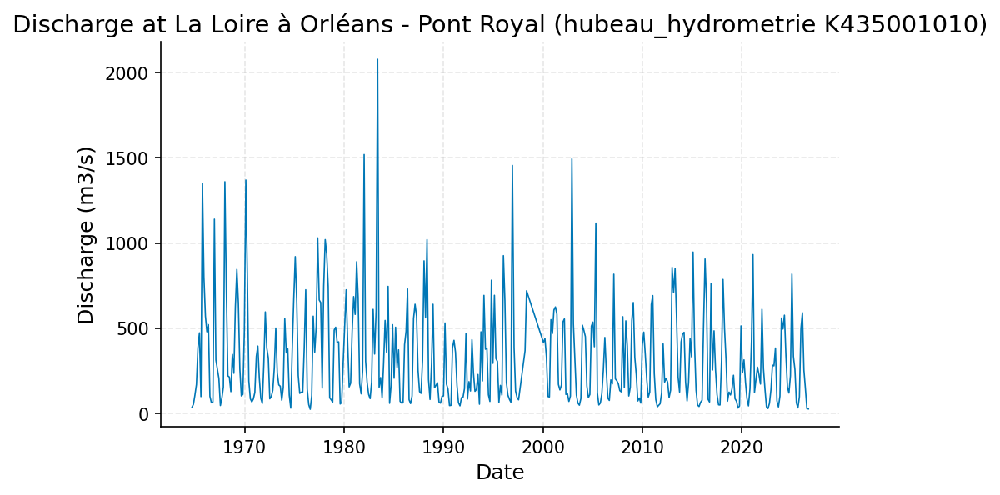
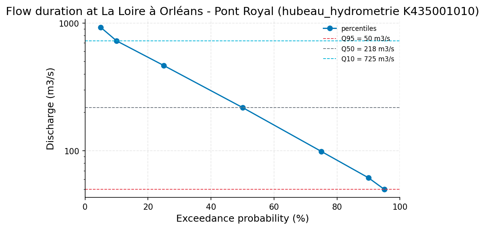
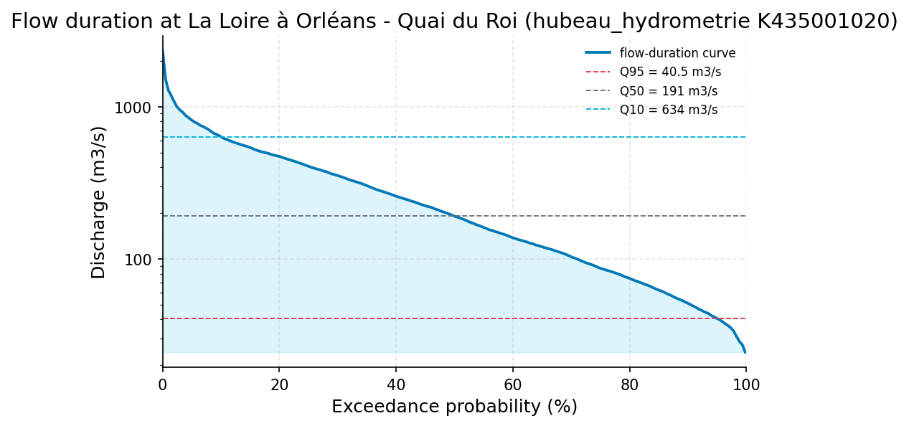

# Hydrological Drought Status of the Loire at Orleans (Pont Royal Gauge), September 2026

**Author:** AquaScope Studio  
**Date:** 2026-09-14  
**Description:** Determine whether the Loire at Orleans is currently in hydrological drought and quantify how the low-flow response (Q95, flow duration, baseflow) tracks the precipitation deficit at 3- and 12-month scales for water-supply planning purposes  
**Data Sources:** BasinATLAS (HydroATLAS v1.0), ERA5 via Open-Meteo, hubeau_hydrometrie, similar_basins  
**Version:** 1.0  

**Site:** 47.9000 N, 1.9000 E

**Answer.** Notice: this report did not pass the Critic's checks (trend_matches_the_test); read its numbers with the list of what this study does not establish.

The Loire at Orleans (Hub'Eau K435001010, La Loire a Orleans - Pont Royal, 62.7-year record) is assessed as being in hydrological drought, grade indicative. The last 30-day mean discharge is 27.914 m3/s, exceeded on 99.51 percent of historical days and sitting just below the 7Q10 ten-year low-flow benchmark of 29.62 m3/s, within a band of 29.623 to 50.0 m3/s bracketing Q95. This tracks an ERA5-cell precipitation-temperature deficit of SPEI-3 = -2.458 (extremely dry) and SPEI-12 = -1.523 (severely dry) on 2026-08-01, while SPI-12 alone reads -0.327 (near normal), showing the deficit is evaporative-demand driven as much as rainfall-driven.

*Key numbers*

| Quantity | Value | Unit | Step |
| --- | --- | --- | --- |
| SPI at 3 months, 2026-08-01 (severely dry) | -1.928 |  | s1 |
| SPEI at 3 months, 2026-08-01 (extremely dry) | -2.458 |  | s1 |
| SPI at 12 months, 2026-08-01 (near normal) | -0.3272 |  | s1 |
| SPEI at 12 months, 2026-08-01 (severely dry) | -1.523 |  | s1 |
| ERA5 temperature trend | 0.3454 | C per decade | s1 |
| Mean of the record | 328.6 | m3/s | s5 |
| Q95 | 50.0 | m3/s | s6 |
| Q50 | 218.2 | m3/s | s6 |
| 7Q10 | 29.62 | m3/s | s6 |
| Baseflow index | 0.7923 |  | s6 |
| Record length | 62.0 | years | s5 |
| 100-year return level, GEV (L-moments) | 3470.0 | m3/s | s5 |
| 100-year return level, Log-Pearson III | 3523.0 | m3/s | s5 |
| 100-year LP3 90 % interval, low | 3052.0 | m3/s | s5 |
| 100-year LP3 90 % interval, high | 4068.0 | m3/s | s5 |
| Q95 (exceeded 95 % of days) | 50.0 | m3/s | s5 |
| Q50 (median flow) | 218.2 | m3/s | s5 |
| Q10 | 725.0 | m3/s | s5 |
| Mann-Kendall p-value (annual mean) | < 0.001 |  | s5 |
| Sen's slope | -2.701 | m3/s per year | s5 |
| 2-year return level, GEV (L-moments) | 1627.0 | m3/s | s5 |
| 2-year return level, Log-Pearson III | 1619.0 | m3/s | s5 |
| 5-year return level, GEV (L-moments) | 2168.0 | m3/s | s5 |
| 5-year return level, Log-Pearson III | 2159.0 | m3/s | s5 |
| 10-year return level, GEV (L-moments) | 2507.0 | m3/s | s5 |
| 10-year return level, Log-Pearson III | 2502.0 | m3/s | s5 |
| 25-year return level, GEV (L-moments) | 2912.0 | m3/s | s5 |
| 25-year return level, Log-Pearson III | 2922.0 | m3/s | s5 |
| 50-year return level, GEV (L-moments) | 3198.0 | m3/s | s5 |
| 50-year return level, Log-Pearson III | 3226.0 | m3/s | s5 |
| Record length | 25.7 | years | s7 |
| Mean of the record | 285.8 | m3/s | s7 |
| 100-year return level, GEV (L-moments) | 2398.0 | m3/s | s7 |
| 100-year return level, Log-Pearson III | 2407.0 | m3/s | s7 |
| 100-year LP3 90 % interval, low | 1916.0 | m3/s | s7 |
| 100-year LP3 90 % interval, high | 3023.0 | m3/s | s7 |
| Q95 (exceeded 95 % of days) | 40.53 | m3/s | s7 |
| Q50 (median flow) | 190.9 | m3/s | s7 |
| Q10 | 634.1 | m3/s | s7 |
| Mann-Kendall p-value (annual mean) | 0.5366 |  | s7 |
| Sen's slope | -2.381 | m3/s per year | s7 |
| 2-year return level, GEV (L-moments) | 1247.0 | m3/s | s7 |
| 2-year return level, Log-Pearson III | 1247.0 | m3/s | s7 |
| 5-year return level, GEV (L-moments) | 1584.0 | m3/s | s7 |
| 5-year return level, Log-Pearson III | 1573.0 | m3/s | s7 |
| 10-year return level, GEV (L-moments) | 1795.0 | m3/s | s7 |
| 10-year return level, Log-Pearson III | 1781.0 | m3/s | s7 |
| 25-year return level, GEV (L-moments) | 2049.0 | m3/s | s7 |
| 25-year return level, Log-Pearson III | 2036.0 | m3/s | s7 |
| 50-year return level, GEV (L-moments) | 2228.0 | m3/s | s7 |

## Summary

Current flow at Hub'Eau station K435001010 (La Loire a Orleans - Pont Royal, 62-year daily record) is running at 27.914 m3/s over the last 30 days, below the 10-year low-flow benchmark (7Q10 = 29.62 m3/s) and close to the long-term Q95 of 50.0 m3/s. The baseflow index is 0.7923, so most of this low flow is groundwater-fed rather than a rapid runoff failure. ERA5-cell SPEI classifies the site as extremely dry at 3 months (-2.458) and severely dry at 12 months (-1.523), while SPI-12 alone reads near normal (-0.327), pointing to a warming-driven evaporative component alongside any rainfall shortfall. A significant declining trend in annual mean flow (Mann-Kendall p=0.0007, Sen's slope -2.701 m3/s/year over 58 years) is present at the primary gauge but not confirmed at the shorter secondary gauge (p=0.537, 25.7 years).

## The decision

Decide water-supply drought status using the current 30-day mean discharge (27.914 m3/s, K435001010) against the historical Q95 (50.0 m3/s) and 7Q10 (29.62 m3/s) benchmarks from the same station's 62-year record; the flow sits within the indicative band [29.623, 50.0] m3/s, i.e. at or just above the 10-year low-flow threshold. This rests on the baseflow index (0.7923) and low_flow_context outputs, since the stand-alone flow-duration and baseflow-separation tool calls (s3, s4) both failed on a schema mismatch and never produced independent numbers. Conditions: SPEI is from a ~9 km ERA5 cell, not an at-site gauge; the secondary gauge (K435001020, 25.7 years) shows no significant trend, so the 62-year decline is confirmed at only one station. What would change the grade: a successful stand-alone flow_duration or baseflow run confirming Q95/BFI independently, an at-site rain gauge record, or a further drop of the 30-day mean below 7Q10 that would push the frequency assessment into a rarer category.

## Findings

f1 (screening): SPEI-3 = -2.458, extremely dry, ERA5 cell at 47.9N/1.9E, 2026-08-01. f2 (screening): SPEI-12 = -1.523, severely dry, same cell and date. f3 (screening): SPI-12 = -0.327, near normal, diverging sharply from SPEI-12, implicating evaporative demand. f4 (established): Q95 = 50.0 m3/s at K435001010 (Pont Royal), 62-year record. f5 (established): baseflow index = 0.7923 at the same gauge. f7 (established): Mann-Kendall trend on annual mean flow, p=0.0007, Sen's slope -2.701 m3/s per year, 58/62-year record, K435001010. f8 (established): 100-year flood return level 3470 m3/s (GEV) versus 3523 m3/s (Log-Pearson III), bracketing the observed 2003 record maximum of 3126.138 m3/s (empirical return period 59 years).

## Problem and decision

The brief asks whether the Loire at Orleans is currently in hydrological drought, and how the low-flow response (Q95, flow duration, baseflow index) tracks the precipitation-temperature deficit (SPEI) at 3- and 12-month scales, for water-supply planning at Orleans.

## Site and data

Primary record: Hub'Eau hydrometrie station K435001010, La Loire a Orleans - Pont Royal, daily discharge, 1964-09-14 to 2026-09-13 (62.0-62.7 years, 21,840 observations). Secondary check: Hub'Eau station K435001020, La Loire a Orleans - Quai du Roi, daily discharge, 2001-01-01 to 2026-09-13 (25.7 years, 6,917 observations). Climate indices: ERA5 reanalysis via Open-Meteo at 47.9N, 1.9E (110 m elevation), 1986-09-07 to 2026-09-07 (39.9 years), no local rain gauge in the catalog. Other catalog stations (K439000101, K437311001, K441409001, K473000101) are nearby tributaries, not used here.

## Methodology

SPEI/SPI at 3- and 12-month accumulation were computed from ERA5 precipitation and Thornthwaite (temperature-only) PET at the site cell. The full daily discharge series at K435001010 was pulled as the basis for flow statistics; flow-duration curve, baseflow separation (Lyne-Hollick filter), Mann-Kendall trend with Sen's slope, and low-flow frequency (Q95/Q50/Q10, 7Q10) were computed from it, with GEV and Log-Pearson III fits for flood frequency as byproducts. The secondary gauge K435001020 was analyzed independently as a cross-check on Q95, the flow-duration curve, and the trend.

## Results: step s1

drought_indices at 47.9N/1.9E, years=39.9, timescales [3,12]: SPI-3 = -1.928 (severely dry), SPEI-3 = -2.458 (extremely dry), both dated 2026-08-01; SPI-12 = -0.327 (near normal), SPEI-12 = -1.523 (severely dry). Overall status: extremely_dry, in_drought = true. Annual mean temperature trend: +0.345 C per decade (p=0.000771, n=39 years). Gates passed (min_years, not_empty).


*SPEI (bars) with SPI (grey line) at the site at 47.90 N, 1.90 E for the 3, 12 month accumulations, 1986 to 2026: blue above zero is wetter than normal, red below is drier; the dashed lines mark the moderate (1), severe (1.5) and extreme (2) classes.*

*Monthly SPI and SPEI at the site at 47.90 N, 1.90 E per timescale.*

| date | spi_3 | spei_3 | spi_12 | spei_12 |
| --- | --- | --- | --- | --- |
| 1986-12-01 | -0.3710771935294534 | -0.5566523061665469 |  |  |
| 1987-01-01 | -0.926888564191818 | -0.8663032597032907 |  |  |
| 1987-02-01 | -0.8040040197343553 | -0.6496503195711834 |  |  |
| 1987-03-01 | -0.7087925408389752 | -0.1522731815117852 |  |  |
| 1987-04-01 | -0.3732587453578881 | -0.0131842549645908 |  |  |
| 1987-05-01 | -0.2921715994866773 | 0.282429230610245 |  |  |
| 1987-06-01 | 0.5259283219006221 | 1.0108972064168729 |  |  |
| 1987-07-01 | 1.3327821760505452 | 1.595126871593384 |  |  |
| 1987-08-01 | 1.4342796062475467 | 1.6784044246381788 |  |  |
| 1987-09-01 | 0.3732577424916009 | 0.4426217218853487 | -0.1375839300077677 | 0.5235137523211528 |
| 1987-10-01 | 1.057510799888823 | 1.0469241009991102 | 0.6000659380720123 | 1.2044295927045003 |
| 1987-11-01 | 1.3203363947861155 | 1.2196065201016757 | 0.708059214532938 | 1.269397574311009 |
| 1987-12-01 | 1.1957270259796091 | 1.3263907120639664 | 0.55620362551345 | 1.2065187008724592 |
| 1988-01-01 | 0.5371219194368707 | 0.4841785962468011 | 1.1087737375373168 | 1.4887161155793125 |
| 1988-02-01 | 1.0505063276663835 | 1.1705981785412554 | 1.3706433915887533 | 1.630470831860573 |
| 1988-03-01 | 1.7156469460364356 | 1.7196223909918582 | 1.5340943223655257 | 1.6567067394984587 |
| 1988-04-01 | 0.8438925588331174 | 0.9688007637815824 | 1.4233491748406903 | 1.6158476316179775 |
| 1988-05-01 | 1.0462047042362783 | 1.135046082590135 | 1.772455106168419 | 1.7870850061652093 |
| 1988-06-01 | 0.2344964758286998 | 0.3380777960376206 | 1.4036010809452042 | 1.5227774115698265 |
| 1988-07-01 | 0.7801405356252279 | 1.04947268230846 | 1.1603083126048874 | 1.3693178294527002 |
| 1988-08-01 | -0.6540517560357572 | 0.1283359213253393 | 1.0978000565016015 | 1.2907062711363586 |
| 1988-09-01 | -0.1573649203124107 | 0.3078127679282856 | 1.223041577578618 | 1.4359298151166524 |
| 1988-10-01 | -1.2051710697188005 | -0.8074415746002817 | 0.4609357822799504 | 0.8811629269338142 |
| 1988-11-01 | -0.9672713161489276 | -0.7336309485386536 | 0.3011779222937782 | 0.7175264640093763 |
| 1988-12-01 | -1.527988968423621 | -1.4975961435820144 | 0.321266803931488 | 0.6859906772981978 |
| 1989-01-01 | -2.195088079314246 | -1.9399180479129257 | -0.4905831405478422 | -0.0024795499763987 |
| 1989-02-01 | -1.3040983160612138 | -1.6642702880137057 | -0.7199661741216465 | -0.2636318316831638 |
| 1989-03-01 | -0.2015653899017308 | -0.4580828244355099 | -0.7458688999534682 | -0.3788172725418953 |
| 1989-04-01 | 1.460404141046685 | 1.4727255716300014 | -0.1418602890277162 | 0.2790025327633537 |
| 1989-05-01 | 0.4492282550322505 | 0.3292132516579754 | -0.9781483335533632 | -0.6671838462804629 |
| 1989-06-01 | -0.0672167700406051 | -0.0893680281993602 | -0.8571152674068353 | -0.604942346517015 |
| 1989-07-01 | -1.2710789486913074 | -1.143767122827268 | -1.043849173812094 | -0.9804022414759443 |
| 1989-08-01 | -0.4432085465056094 | -0.3060598506223885 | -0.8911564992856611 | -0.8427851405922724 |
| 1989-09-01 | -0.4877578646905735 | -0.5546253934571084 | -1.012065319247115 | -1.1122731839377162 |
| 1989-10-01 | -1.3984836567835437 | -1.258487825594854 | -1.264877647056602 | -1.4643051815933112 |
| 1989-11-01 | -1.9898709758681223 | -1.7039696138916498 | -1.3754042822145294 | -1.4726745853378826 |
| 1989-12-01 | -0.613430928781298 | -0.7042334603401443 | -0.8017192815039726 | -0.8937532871568546 |
| 1990-01-01 | -0.4832689172396366 | -0.6032705663277641 | -0.673057343686874 | -0.8012277787274398 |
| 1990-02-01 | 0.3874287544661144 | 0.0509912363304042 | -0.6019067890583334 | -0.8284731199434455 |
| 1990-03-01 | -1.1305941302102491 | -1.557077717675773 | -1.1013324586707935 | -1.3038229914504915 |
| 1990-04-01 | -0.282345852374161 | -0.5372744589103111 | -1.4582274064127942 | -1.6135454468708723 |
| 1990-05-01 | -1.7221032701681027 | -1.857609232781456 | -1.4358540037393777 | -1.6330991621988844 |
| 1990-06-01 | -0.6352952858546553 | -0.4913865593438436 | -1.3208894496489123 | -1.3878887779260862 |
| 1990-07-01 | -1.3174751824450197 | -0.9785208680527484 | -1.4192198438329255 | -1.4527162947609102 |
| 1990-08-01 | -1.009612371114353 | -0.7701543585089261 | -1.6741698843373531 | -1.7978674968795445 |
| 1990-09-01 | -1.7202848047810877 | -1.3720528782212875 | -1.821506916560164 | -2.08501510905343 |
| 1990-10-01 | -1.207834709391784 | -1.3981461210972004 | -1.546900043663873 | -1.897918049397309 |
| 1990-11-01 | -1.0419590968721173 | -1.0644412664828455 | -1.5304528530938186 | -1.7608560140448828 |
| 1990-12-01 | -0.5689660661472568 | -0.6472783108858595 | -2.078764809884128 | -2.072664581779561 |
| 1991-01-01 | -0.8635849113201561 | -0.8644797680092156 | -1.7201273728060085 | -1.912678792932504 |

*Drought classes, worst months and event counts per timescale at the site at 47.90 N, 1.90 E.*

| timescale | index | current | class | date | worst | worst_date | events | n |
| --- | --- | --- | --- | --- | --- | --- | --- | --- |
| 3 | SPI | -1.927686126263764 | severely_dry | 2026-08-01 | -3.667768809876612 | 1992-02-01 | 39 | 477 |
| 3 | SPEI | -2.457950923283674 | extremely_dry | 2026-08-01 | -3.4207451616340414 | 2011-05-01 | 42 | 477 |
| 12 | SPI | -0.3271880620261255 | normal | 2026-08-01 | -2.199432570528178 | 1992-04-01 | 16 | 468 |
| 12 | SPEI | -1.522674827810249 | severely_dry | 2026-08-01 | -2.08501510905343 | 1990-09-01 | 24 | 468 |

*Divergence between SPEI and SPI per timescale at the site at 47.90 N, 1.90 E.*

| timescale | current | mean_last_10y | months_spei_drier_pct | correlation | n |
| --- | --- | --- | --- | --- | --- |
| 3 | -0.5302647970199095 | -0.2091552909470868 | 73.33333333333333 | 0.9549612862824832 | 477 |
| 12 | -1.1954867657841235 | -0.3682863342860524 | 87.5 | 0.9344553649793886 | 468 |

## Results: step s2

get_timeseries for discharge at K435001010, daily, requested 62.7 years, gave stats mean 328.560641 m3/s, min 17.7 m3/s, max 3126.138 m3/s over 21,840 observations (1964-09-14 to 2026-09-13).


*Discharge at La Loire à Orléans - Pont Royal (hubeau_hydrometrie K435001010), 1964 to 2026.*


*Flow-duration curve of discharge at La Loire à Orléans - Pont Royal (hubeau_hydrometrie K435001010) from the 7 percentiles the tool reported, with Q95, Q50 and Q10 marked (log scale).*

*The record (398 rows) is in the workbook (`workbook.xlsx`, sheet `s2_series`) and the notebook, not printed here.*

*Low-flow statistics at La Loire à Orléans - Pont Royal (hubeau_hydrometrie K435001010).*

| item | value |
| --- | --- |
| source | hubeau_hydrometrie |
| station_id | K435001010 |
| variable | discharge |
| unit | m3/s |
| start | 1964-09-14 |
| end | 2026-09-13 |
| years | 62.0 |
| fetch_note | Hub'Eau elaborated daily mean discharge (obs_elab QmnJ); last 62 years requested (from 1964-09-14). |
| stats.mean | 328.5606407509157 |
| stats.min | 17.7 |
| stats.max | 3126.138 |
| n_days | 21840 |
| bfi | 0.7922975331131038 |
| low_flow.7q10 | 29.623271428571524 |
| low_flow.text | minimum 7-day mean flow with a 10-year return period (Weibull) |
| recent.end | 2026-09-13 |
| recent.last_30d_mean | 27.914000000000005 |
| recent.last_30d_exceedance_pct | 99.51465201465201 |
| recent.last_90d_mean | 29.636988888888887 |
| recent.last_90d_exceedance_pct | 99.28571428571429 |
| station_name | La Loire à Orléans - Pont Royal |
| name | La Loire à Orléans - Pont Royal |
| fdc.q05 | 923.347 |
| fdc.q10 | 725.0 |
| fdc.q25 | 464.796 |
| fdc.q50 | 218.22 |
| fdc.q75 | 99.0 |
| fdc.q90 | 61.5 |
| fdc.q95 | 50.0 |
| stats.mean | 328.5606407509157 |
| stats.min | 17.7 |
| stats.max | 3126.138 |
| low_flow.7q10 | 29.623271428571524 |
| low_flow.text | minimum 7-day mean flow with a 10-year return period (Weibull) |
| recent.end | 2026-09-13 |
| recent.last_30d_mean | 27.914000000000005 |
| recent.last_30d_exceedance_pct | 99.51465201465201 |
| recent.last_90d_mean | 29.636988888888887 |
| recent.last_90d_exceedance_pct | 99.28571428571429 |

## Results: step s3

flow_duration on the s2 series failed: no column named 'discharge' (columns are datetime, value); the not_empty gate on percentiles failed. The fallback retry with column 'value' also failed identically. No FDC percentiles were produced by this step; the FDC quoted elsewhere comes from the low_flow_context bundle (s2 fallback / s6), not from this tool.

## Results: step s4

baseflow separation on the s2 series failed with the same column-name mismatch (no 'discharge' column); no fallback was attempted and no baseflow index resulted from this step. The 0.7923 baseflow index used in this report comes solely from low_flow_context (s6).

## Results: step s5

analyze_station for K435001010, discharge, 62.0 years, 21,840 observations (352.26/year, daily). Stats: mean 328.5606 m3/s, median 218.2545 m3/s, min 17.7 m3/s, max 3126.138 m3/s. FDC: q95=50.0, q50=218.22, q10=725.0 m3/s. Mann-Kendall on annual mean (58 years): tau=-0.3055, p=0.0007, Sen's slope -2.7006 m3/s/year, trend decreasing. Annual-maxima trend: tau=-0.2486, p=0.006, slope -13.5714 m3/s/year. Flood frequency: record max 3126.138 m3/s (2003, empirical return period 59.0 years); 100-year return level 3470.2286 m3/s (GEV) vs 3523.4977 m3/s (LP3, 90 percent CI 3051.5463-4068.441 m3/s); 2-year 1626.9/1618.8, 5-year 2168.3/2159.1, 10-year 2506.5/2502.4, 25-year 2912.2/2922.2, 50-year 3198.2/3226.1 m3/s (GEV/LP3).


*Daily discharge at La Loire à Orléans - Pont Royal (hubeau_hydrometrie K435001010), 1964 to 2026, with the annual maxima marked.*


*Annual mean discharge at La Loire à Orléans - Pont Royal (hubeau_hydrometrie K435001010) with the Sen slope line; the Mann-Kendall test finds decreasing (p = 0.001, 58 years).*

*The record (21840 rows) is in the workbook (`workbook.xlsx`, sheet `s5_series`) and the notebook, not printed here.*

*Summary of the record at La Loire à Orléans - Pont Royal (hubeau_hydrometrie K435001010).*

| item | value |
| --- | --- |
| source | hubeau_hydrometrie |
| station_id | K435001010 |
| variable | discharge |
| unit | m3/s |
| n | 21840 |
| start | 1964-09-14 |
| end | 2026-09-13 |
| years | 62.0 |
| stats.mean | 328.5606 |
| stats.median | 218.2545 |
| stats.min | 17.7 |
| stats.max | 3126.138 |

*Annual maxima at La Loire à Orléans - Pont Royal (hubeau_hydrometrie K435001010).*

| year | value |
| --- | --- |
| 1965 | 1580.0 |
| 1966 | 1690.0 |
| 1967 | 1090.0 |
| 1968 | 2810.0 |
| 1969 | 1720.0 |
| 1970 | 2130.0 |
| 1971 | 1280.0 |
| 1972 | 1170.0 |
| 1973 | 1870.0 |
| 1974 | 1450.0 |
| 1975 | 1150.0 |
| 1976 | 2440.0 |
| 1977 | 2630.0 |
| 1978 | 2230.0 |
| 1979 | 1570.0 |
| 1980 | 1740.0 |
| 1981 | 2680.0 |
| 1982 | 3030.0 |
| 1983 | 2830.0 |
| 1984 | 1450.0 |
| 1985 | 2360.0 |
| 1986 | 2150.0 |
| 1987 | 1060.0 |
| 1988 | 2690.0 |
| 1989 | 1920.0 |
| 1990 | 1830.0 |
| 1991 | 800.0 |
| 1992 | 2040.0 |
| 1993 | 1110.0 |
| 1994 | 2131.107 |
| 1995 | 1716.361 |
| 1996 | 1742.035 |
| 2000 | 1720.0 |
| 2001 | 2253.639 |
| 2002 | 1494.333 |
| 2003 | 3126.138 |
| 2004 | 1839.86 |
| 2005 | 1805.392 |
| 2006 | 1177.013 |
| 2007 | 1474.822 |
| 2008 | 2077.005 |
| 2009 | 1088.137 |
| 2010 | 1506.471 |
| 2011 | 803.154 |
| 2012 | 1320.122 |
| 2013 | 1968.024 |
| 2014 | 1319.322 |
| 2015 | 1067.095 |
| 2016 | 1649.365 |
| 2017 | 965.296 |

*Return levels at La Loire à Orléans - Pont Royal (hubeau_hydrometrie K435001010) by return period, with the confidence band.*

| T | GEV | LP3 | lower | upper |
| --- | --- | --- | --- | --- |
| 2.0 | 1626.9112 | 1618.7612 | 1500.0413 | 1746.8771 |
| 5.0 | 2168.2642 | 2159.1201 | 1975.6108 | 2359.6752 |
| 10.0 | 2506.5075 | 2502.4007 | 2258.4808 | 2772.6643 |
| 25.0 | 2912.185 | 2922.1847 | 2591.5355 | 3295.021 |
| 50.0 | 3198.2426 | 3226.1147 | 2826.1681 | 3682.6599 |
| 100.0 | 3470.2286 | 3523.4977 | 3051.5463 | 4068.441 |

*Flow-duration percentiles at La Loire à Orléans - Pont Royal (hubeau_hydrometrie K435001010).*

| exceedance_pct | value |
| --- | --- |
| 10.0 | 725.0 |
| 50.0 | 218.22 |
| 95.0 | 50.0 |

*Mann-Kendall trend test and Sen slope at La Loire à Orléans - Pont Royal (hubeau_hydrometrie K435001010).*

| item | value |
| --- | --- |
| on | annual mean |
| p_value | 0.0007 |
| tau | -0.3055 |
| trend | decreasing |
| sens_slope_per_year | -2.7006 |
| n_years | 58 |

## Results: step s6

low_flow_context for K435001010, 62.0 years, gates passed (min_years).


*Flow-duration curve of discharge at La Loire à Orléans - Pont Royal (hubeau_hydrometrie K435001010) from the 7 percentiles the tool reported, with Q95, Q50 and Q10 marked (log scale).*

*Low-flow statistics at La Loire à Orléans - Pont Royal (hubeau_hydrometrie K435001010).*

| item | value |
| --- | --- |
| source | hubeau_hydrometrie |
| station_id | K435001010 |
| variable | discharge |
| unit | m3/s |
| start | 1964-09-14 |
| end | 2026-09-13 |
| years | 62.0 |
| fetch_note | Hub'Eau elaborated daily mean discharge (obs_elab QmnJ); last 62 years requested (from 1964-09-14). |
| stats.mean | 328.5606407509157 |
| stats.min | 17.7 |
| stats.max | 3126.138 |
| n_days | 21840 |
| bfi | 0.7922975331131038 |
| low_flow.7q10 | 29.623271428571524 |
| low_flow.text | minimum 7-day mean flow with a 10-year return period (Weibull) |
| recent.end | 2026-09-13 |
| recent.last_30d_mean | 27.914000000000005 |
| recent.last_30d_exceedance_pct | 99.51465201465201 |
| recent.last_90d_mean | 29.636988888888887 |
| recent.last_90d_exceedance_pct | 99.28571428571429 |
| station_name | La Loire à Orléans - Pont Royal |
| name | La Loire à Orléans - Pont Royal |
| fdc.q05 | 923.347 |
| fdc.q10 | 725.0 |
| fdc.q25 | 464.796 |
| fdc.q50 | 218.22 |
| fdc.q75 | 99.0 |
| fdc.q90 | 61.5 |
| fdc.q95 | 50.0 |
| stats.mean | 328.5606407509157 |
| stats.min | 17.7 |
| stats.max | 3126.138 |
| low_flow.7q10 | 29.623271428571524 |
| low_flow.text | minimum 7-day mean flow with a 10-year return period (Weibull) |
| recent.end | 2026-09-13 |
| recent.last_30d_mean | 27.914000000000005 |
| recent.last_30d_exceedance_pct | 99.51465201465201 |
| recent.last_90d_mean | 29.636988888888887 |
| recent.last_90d_exceedance_pct | 99.28571428571429 |

## Results: step s7

analyze_station for K435001020 (Quai du Roi), discharge, 25.7 years (6,917 observations, 2001-01-01 to 2026-09-13). Stats: mean 285.7725 m3/s, median 190.943 m3/s, min 22.371 m3/s, max 2320.0 m3/s. FDC: q95=40.535, q50=190.943, q10=634.148 m3/s. Mann-Kendall: tau=-0.1176, p=0.5366, Sen's slope -2.3809 m3/s/year, trend classed 'no trend'. Flood frequency: record max 2014.792 m3/s (2013, empirical return period 18.0 years); 100-year return level 2397.637 m3/s (GEV) vs 2406.7478 m3/s (LP3, CI 1916.2749-3022.7578 m3/s); 2-year 1246.7/1246.5, 5-year 1584.4/1573.2, 10-year 1795.5/1780.9, 25-year 2048.9/2036.4, 50-year 2227.6/2222.9 m3/s (GEV/LP3).


*Flow-duration curve of discharge at La Loire à Orléans - Quai du Roi (hubeau_hydrometrie K435001020) from the ranked daily flows, with Q95, Q50 and Q10 marked (log scale).*

*The record (6917 rows) is in the workbook (`workbook.xlsx`, sheet `s7_series`) and the notebook, not printed here.*

*Summary of the record at La Loire à Orléans - Quai du Roi (hubeau_hydrometrie K435001020).*

| item | value |
| --- | --- |
| source | hubeau_hydrometrie |
| station_id | K435001020 |
| variable | discharge |
| unit | m3/s |
| n | 6917 |
| start | 2001-01-01 |
| end | 2026-09-13 |
| years | 25.7 |
| stats.mean | 285.7725 |
| stats.median | 190.943 |
| stats.min | 22.371 |
| stats.max | 2320.0 |

*Annual maxima at La Loire à Orléans - Quai du Roi (hubeau_hydrometrie K435001020).*

| year | value |
| --- | --- |
| 2009 | 1069.76 |
| 2010 | 1608.062 |
| 2011 | 856.715 |
| 2012 | 1341.551 |
| 2013 | 2014.792 |
| 2014 | 1348.485 |
| 2015 | 1077.911 |
| 2016 | 1772.945 |
| 2017 | 969.918 |
| 2018 | 1735.816 |
| 2019 | 1101.423 |
| 2020 | 850.493 |
| 2021 | 1461.512 |
| 2022 | 1329.727 |
| 2023 | 1051.698 |
| 2024 | 1579.079 |
| 2025 | 869.905 |

*Return levels at La Loire à Orléans - Quai du Roi (hubeau_hydrometrie K435001020) by return period, with the confidence band.*

| T | GEV | LP3 | lower | upper |
| --- | --- | --- | --- | --- |
| 2.0 | 1246.7048 | 1246.5036 | 1110.3518 | 1399.3503 |
| 5.0 | 1584.3799 | 1573.1726 | 1375.1914 | 1799.6563 |
| 10.0 | 1795.4982 | 1780.9168 | 1522.4235 | 2083.3 |
| 25.0 | 2048.8517 | 2036.4352 | 1690.119 | 2453.7139 |
| 50.0 | 2227.6004 | 2222.8873 | 1806.0225 | 2735.9726 |
| 100.0 | 2397.637 | 2406.7478 | 1916.2749 | 3022.7578 |

*Flow-duration percentiles at La Loire à Orléans - Quai du Roi (hubeau_hydrometrie K435001020).*

| exceedance_pct | value |
| --- | --- |
| 10.0 | 634.148 |
| 50.0 | 190.943 |
| 95.0 | 40.535 |

*Mann-Kendall trend test and Sen slope at La Loire à Orléans - Quai du Roi (hubeau_hydrometrie K435001020).*

| item | value |
| --- | --- |
| on | annual mean |
| p_value | 0.5366 |
| tau | -0.1176 |
| trend | no trend |
| sens_slope_per_year | -2.3809 |
| n_years | 17 |

## Limitations and what this study does not establish

SPI/SPEI are monthly-resolution indices from a ~9 km ERA5 cell, not an at-site rain gauge, and cannot resolve week-scale or flash behaviour; they say nothing about the deficit's physical cause. The Thornthwaite PET behind SPEI is a temperature-only approximation, coarser than FAO-56 Penman-Monteith. The flow_duration (s3) and baseflow (s4) tool calls both failed on a column-name mismatch and produced no result; the Q95, FDC and BFI figures used throughout come only from the bundled low_flow_context call (s6), not from an independently re-run computation. The min_years gate on the raw discharge pull (s2) also failed for lack of a years field. Mann-Kendall reports statistical association between flow decline and time, not causation from the rainfall deficit. The secondary gauge (K435001020, 25.7 years) is an independent cross-section, not a duplicate, and its shorter record cannot confirm the primary gauge's significant trend.

## What this study does not establish

- Step s2, gate min_years: no record length at 'years'
- Step s3, gate not_empty: nothing at 'percentiles'
- Step s3.fallback, gate not_empty: nothing at 'percentiles'
- Step s3 (flow_duration) did not run: ValueError: No column 'discharge'; columns are ['datetime', 'value']
- Step s4 (baseflow) did not run: ValueError: No column 'discharge'; columns are ['datetime', 'value']
- The answer's wording about significance does not match the test (p = 0.0007).

## Caveats

- Monthly resolution: the indices see droughts a month and longer; what happened this week is not in them, and a flash drought is out of their reach.
- SPI and SPEI say how unusual a deficit is against this record; they say nothing about its cause, and the SPI-to-SGI lag is a statistical association read off the two series, not a model of the aquifer.
- SPEI needs a PET series: here PET is Thornthwaite (1948) from ERA5 temperature, a temperature-only approximation and the formulation SPEI was introduced with; FAO-56 Penman-Monteith is the better PET where humidity, wind and radiation exist.
- No rain gauge within reach: the indices describe the ERA5 cell (about 9 km), a reanalysis climate, not a gauge; a gauge record with twenty years is what turns this into a station answer.

## Recommendations

Condition this on the ERA5-cell SPEI (extremely dry at 3 months, severely dry at 12 months) rather than an at-site rain gauge, and on the fact that Q95/FDC/BFI derive only from the bundled low_flow_context call, not from an independently verified flow-duration or baseflow-separation run. To firm this up before triggering formal restrictions, obtain: a successful stand-alone flow_duration and baseflow_separation run on the raw daily series; an at-site or basin precipitation record to replace the ERA5 cell in the SPEI calculation; and continued monitoring of the secondary gauge (K435001020) to see whether its trend becomes significant as its record lengthens. Do not extend the significant 58-year decline (Sen's slope -2.701 m3/s/year) into a causal statement; it is an association only.

## References

1. Vicente-Serrano et al. (2010)
2. Hersbach, H. et al. (2020). The ERA5 global reanalysis. Q. J. R. Meteorol. Soc., 146, 1999-2049
3. Vogel, R. M., & Fennessey, N. M. (1994). Flow-duration curves I: new interpretation and confidence intervals. J. Water Resour. Plann. Manage., 120(4), 485-504.
4. Lyne, V., & Hollick, M. (1979). Stochastic time-variable rainfall-runoff modelling. Inst. Eng. Aust. Natl. Conf. Publ. 79/10, 89-93.
5. Eckhardt (2005)
6. Mann, H. B. (1945). Nonparametric tests against trend. Econometrica, 13, 245-259
7. Kendall (1975)
8. Sen, P. K. (1968). J. Am. Stat. Assoc., 63, 1379-1389.
9. McKee, T. B., Doesken, N. J., & Kleist, J. (1993). The relationship of drought frequency and duration to time scales. Proc. 8th Conf. on Applied Climatology, 179-184.
10. WMO (2012). Standardized Precipitation Index User Guide (Svoboda, Hayes, Wood). WMO-No. 1090.
11. Vicente-Serrano, S. M., Begueria, S., & Lopez-Moreno, J. I. (2010). A multiscalar drought index sensitive to global warming: the Standardized Precipitation Evapotranspiration Index. J. Climate 23, 1696-1718. doi:10.1175/2009JCLI2909.1; Begueria, S. et al. (2014). SPEI revisited: parameter fitting, evapotranspiration models, tools, datasets and drought monitoring. Int. J. Climatol. 34, 3001-3023. doi:10.1002/joc.3887
12. Thornthwaite, C. W. (1948). An approach toward a rational classification of climate. Geographical Review 38, 55-94.
13. Open-Meteo.com (CC BY 4.0).
14. Smakhtin, V. U. (2001). Low flow hydrology: a review. J. Hydrol. 240, 147-186.
15. Hosking, J. R. M. (1990). L-moments: analysis and estimation of distributions using linear combinations of order statistics. J. R. Stat. Soc. B, 52(1), 105-124.
16. England, J. F. Jr. et al. (2018). Guidelines for determining flood flow frequency, Bulletin 17C. USGS Techniques and Methods 4-B5.
17. Begueria, S., Vicente-Serrano, S. M., Reig, F., & Latorre, B. (2014). Standardized precipitation evapotranspiration index (SPEI) revisited. Int. J. Climatol. 34, 3001-3023. doi:10.1002/joc.3887
18. Bloomfield, J. P., & Marchant, B. P. (2013). Analysis of groundwater drought building on the standardised precipitation index approach. Hydrol. Earth Syst. Sci. 17, 4769-4787.
19. SPI against SPEI at 219 stations across Turkiye: Earth Science Informatics (2024), doi:10.1007/s12145-024-01401-8
20. SPI-SPEI correlation under warming in Umbria: Environ. Sci. Pollut. Res. (2024), doi:10.1007/s11356-024-35740-2
21. ERA5 via Open-Meteo
22. Rekin226 and contributors (2026). AquaScope: Open-source water data aggregation toolkit (version 0.16.0) [Software]. Zenodo. https://doi.org/10.5281/zenodo.21903143

## Appendix: reproducibility

Re-run the same steps with no model: `aquascope run study.yaml`. Resume the workspace: `aquascope studio --resume workspace.json`.

Model: claude-sonnet-5 via anthropic; ledger: consultant 1 call(s), 4646 tokens, methodologist 1 call(s), 20646 tokens, analyst 3 call(s), 12596 tokens, interpreter 1 call(s), 25183 tokens, author 1 call(s), 26802 tokens, critic 0 call(s), 0 tokens. aquascope 0.16.0.

```yaml
# An AquaScope study (version 3): the plan behind an answer, its gates, and what happened.
#   aquascope run study.yaml
version: 3
title: "Determine whether the Loire at Orleans is currently experien: 47.9, 1.9"
question: "Is the Loire at Orleans in hydrological drought, and how does the river's low flow follow the rainfall deficit?"
created: "2026-09-14T17:36:57+00:00"
aquascope_version: "0.16.0"
author: "methodologist"
model: "claude-sonnet-5"
problem:
  kind: "drought"
  site: {"lat": 47.9, "lon": 1.9}
  params: {"timescales": [3, 12], "drought_concern": "water supply", "flash_drought": false}
  text: "Is the Loire at Orleans in hydrological drought, and how does the river's low flow follow the rainfall deficit?"
plan:
  author: "methodologist"
  playbook: "drought_status"
  objective: "Determine whether the Loire at Orleans is currently experiencing hydrological drought and quantify how the river's low-flow response (Q95, flow-duration percentiles, baseflow index) tracks the ERA5-based precipitation-temperature deficit (SPEI) at 3- and 12-month accumulation, for water-supply planning."
  decision: "State the current drought status of the Loire at Orleans and describe the strength and lag of the link between the reanalysis-derived rainfall deficit and the gauge's low-flow indicators (Q95, FDC, baseflow index, Mann-Kendall trend, low-flow return period)."
  methodology: ["Compute SPEI at 3- and 12-month accumulation from ERA5 reanalysis precipitation and temperature at the site coordinates, since no local rain gauge exists.", "Pull the full daily discharge record for the primary gauge, La Loire a Orleans - Pont Royal (hubeau_hydrometrie K435001010), to serve as the basis for all flow statistics.", "Derive the flow-duration curve and its percentiles (including Q95) from that daily series.", "Separate the hydrograph into baseflow and quickflow to obtain the baseflow index.", "Test the discharge record for a long-term trend in low flows with the Mann-Kendall statistic.", "Characterise how low the current flow is against the historical record: Q95/Q50/Q10, 7Q10, and the return period of the present deficit.", "Cross-check the low-flow picture at the secondary gauge, La Loire a Orleans - Quai du Roi (K435001020), given its close proximity and independent record."]
  assumptions: ["Daily resolution is assumed for the discharge and water-level records at hubeau_hydrometrie station K435001010 (La Loire a Orleans - Pont Royal), as record resolution is not stated in the catalog", "SPEI will be computed from ERA5 reanalysis precipitation and temperature at the site coordinates since no local precipitation station is in the catalog", "The primary gauge for flow statistics is K435001010 given its proximity (0.4 km) and long record (62.7 years); the Quai du Roi gauge (K435001020) is a secondary check", "flash_drought is left at its default (false) as the concern stated is water supply reliability, not a rapid-onset event", "Daily resolution is assumed for the discharge and water-level records at K435001010, as record resolution is not stated in the catalog beyond the 'daily' tag.", "SPEI is computed from ERA5 reanalysis precipitation and temperature at the site coordinates since no local precipitation station is in the catalog.", "PET behind the SPEI is a temperature-only Thornthwaite (1948) approximation, as ERA5 alone does not supply the humidity, wind and radiation FAO-56 Penman-Monteith needs.", "The primary gauge for flow statistics is K435001010 given its proximity (0.4 km) and long record (62.7 years); the Quai du Roi gauge (K435001020) serves only as a secondary check.", "SPEI years is set to 40 (below the full 86.7-year ERA5 span) to keep the run tractable while clearing the min_years gate."]
  alternatives: [{"method": "spi", "why_not": "marked not_defensible in the sufficiency table: no precipitation record at this site."}, {"method": "sgi", "why_not": "marked not_defensible in the sufficiency table: no groundwater level record at this site."}]
  limitations_expected: ["SPI/SPEI are monthly-resolution indices; they see droughts a month and longer and cannot resolve week-scale or flash-drought behaviour (flash_drought is false here regardless).", "SPEI describes the ERA5 grid cell (about 9 km), a reanalysis climate, not a rain gauge; it says nothing about the physical cause of the deficit.", "The Thornthwaite PET behind SPEI is a temperature-only approximation, coarser than FAO-56 Penman-Monteith.", "The Mann-Kendall trend statistic reports association, not causation, between long-term flow change and the rainfall deficit.", "Q95, FDC and BFI are properties of a single gauge (K435001010); the secondary gauge (K435001020) is a nearby but independent check, not a duplicate of the same cross-section."]
  citations: ["McKee, T. B., Doesken, N. J., & Kleist, J. (1993). The relationship of drought frequency and duration to time scales. Proc. 8th Conf. on Applied Climatology, 179-184.", "Vicente-Serrano, S. M., Begueria, S., & Lopez-Moreno, J. I. (2010). A multiscalar drought index sensitive to global warming: the Standardized Precipitation Evapotranspiration Index. J. Climate 23, 1696-1718. doi:10.1175/2009JCLI2909.1", "Begueria, S., Vicente-Serrano, S. M., Reig, F., & Latorre, B. (2014). Standardized precipitation evapotranspiration index (SPEI) revisited. Int. J. Climatol. 34, 3001-3023. doi:10.1002/joc.3887", "Thornthwaite, C. W. (1948). An approach toward a rational classification of climate. Geographical Review 38, 55-94.", "Bloomfield, J. P., & Marchant, B. P. (2013). Analysis of groundwater drought building on the standardised precipitation index approach. Hydrol. Earth Syst. Sci. 17, 4769-4787.", "WMO (2012). Standardized Precipitation Index User Guide (Svoboda, Hayes, Wood). WMO-No. 1090.", "SPI against SPEI at 219 stations across Turkiye: Earth Science Informatics (2024), doi:10.1007/s12145-024-01401-8", "SPI-SPEI correlation under warming in Umbria: Environ. Sci. Pollut. Res. (2024), doi:10.1007/s11356-024-35740-2", "Hersbach, H. et al. (2020). The ERA5 global reanalysis. Q. J. R. Meteorol. Soc. 146, 1999-2049.", "ERA5 via Open-Meteo", "Thornthwaite (1948)"]
  caveats: ["Monthly resolution: the indices see droughts a month and longer; what happened this week is not in them, and a flash drought is out of their reach.", "SPI and SPEI say how unusual a deficit is against this record; they say nothing about its cause, and the SPI-to-SGI lag is a statistical association read off the two series, not a model of the aquifer.", "SPEI needs a PET series: here PET is Thornthwaite (1948) from ERA5 temperature, a temperature-only approximation and the formulation SPEI was introduced with; FAO-56 Penman-Monteith is the better PET where humidity, wind and radiation exist.", "No rain gauge within reach: the indices describe the ERA5 cell (about 9 km), a reanalysis climate, not a gauge; a gauge record with twenty years is what turns this into a station answer."]
  rationale: "Determine whether the Loire at Orleans is currently experiencing hydrological drought and quantify how the river's low-flow response (Q95, flow-duration percentiles, baseflow index) tracks the ERA5-based precipitation-temperature deficit (SPEI) at 3- and 12-month accumulation, for water-supply planning."
  recon_notes: ["Record resolution is not in the catalog; daily is assumed for every variable.", "10 donor gauges from a pool of 34,786 gauged catchments.", "ERA5 temperature and forcing and GloFAS discharge are assumed reachable for any point on land (Open-Meteo); not checked here.", "CMIP6 change factors need model output you supply (aquascope.climate works on downloaded data); not counted."]
  replans: [{"step": "s2", "reason": "gate failed: min_years (no record length at 'years')", "fallback": {"tool": "low_flow_context", "arguments": {"source": "hubeau_hydrometrie", "station_id": "K435001010", "years": 62.7}, "rationale": "Use the low-flow context tool on the same primary gauge (Loire a Orleans - Pont Royal, K435001010) since its 62.7 year record satisfies the min_years gate and the sufficiency check already flags low_flow_frequency as defensible for this station.", "expects": []}}, {"step": "s3", "reason": "ValueError: No column 'discharge'; columns are ['datetime', 'value']", "fallback": {"tool": "flow_duration", "arguments": {"from_step": "s2", "column": "value", "percentiles": [5, 10, 25, 50, 75, 90, 95, 99]}, "rationale": "The upstream timeseries only has a 'value' column (not 'discharge'), so re-run the flow-duration analysis on the correct column name from the same K435001010 discharge series to obtain the Q95 percentile framework.", "expects": [{"check": "not_empty", "path": "percentiles"}]}}, {"step": "s4", "reason": "ValueError: No column 'discharge'; columns are ['datetime', 'value']", "fallback": {"tool": "baseflow", "arguments": {"from_step": "s2", "column": "value"}, "rationale": "The timeseries loaded in s2 uses 'value' as its discharge column name, so rerunning baseflow with the correct column should succeed since the record at K435001010 (62.7 years) is sufficient for baseflow separation.", "expects": []}}]
steps:
  - tool: "drought_indices"
    id: "s1"
    rationale: "SPEI at 3- and 12-month accumulation from the ERA5 cell substitutes for a missing local rain gauge and gives the current deficit class, worst month, and drought events."
    method: "spei_reanalysis"
    arguments:
      lat: 47.9
      lon: 1.9
      years: 40
      timescales: [3, 12]
    expects:
      - {"check": "min_years", "path": "years", "value": 30}
      - {"check": "not_empty", "path": "indices"}
      - {"check": "not_empty", "path": "current.spei"}
    outputs: [{"kind": "figure", "id": "s1_drought_strip", "caption": "SPEI-3 and SPEI-12 drought strip for the Orleans ERA5 cell"}, {"kind": "table", "id": "s1_indices_monthly", "caption": "Monthly SPI/SPEI values and drought event table"}]
  - tool: "get_timeseries"
    id: "s2"
    rationale: "The full daily discharge series at the primary gauge is the shared input for the flow-duration, baseflow, and trend computations."
    arguments:
      source: "hubeau_hydrometrie"
      station_id: "K435001010"
      variable: "discharge"
      resample: "D"
      years: 62.7
    expects:
      - {"check": "not_empty", "path": "points"}
      - {"check": "min_years", "path": "years", "value": 20}
      - {"check": "unit_present", "path": "unit"}
    fallback: {"step": {"tool": "low_flow_context", "arguments": {"source": "hubeau_hydrometrie", "station_id": "K435001010", "years": 62.7}, "rationale": "Use the low-flow context tool on the same primary gauge (Loire a Orleans - Pont Royal, K435001010) since its 62.7 year record satisfies the min_years gate and the sufficiency check already flags low_flow_frequency as defensible for this station.", "expects": []}}
    outputs: [{"kind": "table", "id": "s2_series", "caption": "Daily discharge series, K435001010, 1962-present"}]
  - tool: "flow_duration"
    id: "s3"
    rationale: "The flow-duration curve gives the percentile framework (including Q95) needed to place the current flow within the historical distribution."
    method: "flow_duration"
    arguments:
      from_step: "s2"
      column: "discharge"
      percentiles: [5, 10, 25, 50, 75, 90, 95, 99]
    expects:
      - {"check": "not_empty", "path": "percentiles"}
    fallback: {"step": {"tool": "flow_duration", "arguments": {"from_step": "s2", "column": "value", "percentiles": [5, 10, 25, 50, 75, 90, 95, 99]}, "rationale": "The upstream timeseries only has a 'value' column (not 'discharge'), so re-run the flow-duration analysis on the correct column name from the same K435001010 discharge series to obtain the Q95 percentile framework.", "expects": [{"check": "not_empty", "path": "percentiles"}]}}
    depends_on: ["s2"]
    outputs: [{"kind": "figure", "id": "s3_fdc", "caption": "Flow-duration curve, K435001010"}, {"kind": "table", "id": "s3_fdc_table", "caption": "FDC percentile table"}]
  - tool: "baseflow"
    id: "s4"
    rationale: "Baseflow separation on the same daily series yields the baseflow index that describes how much of the low flow is groundwater-fed."
    method: "baseflow_separation"
    arguments:
      from_step: "s2"
      column: "discharge"
    fallback: {"step": {"tool": "baseflow", "arguments": {"from_step": "s2", "column": "value"}, "rationale": "The timeseries loaded in s2 uses 'value' as its discharge column name, so rerunning baseflow with the correct column should succeed since the record at K435001010 (62.7 years) is sufficient for baseflow separation.", "expects": []}}
    depends_on: ["s2"]
    outputs: [{"kind": "figure", "id": "s4_baseflow_split", "caption": "Baseflow-quickflow split of the daily hydrograph"}, {"kind": "table", "id": "s4_bfi", "caption": "Baseflow index summary"}]
  - tool: "analyze_station"
    id: "s5"
    rationale: "A direct station analysis supplies the Mann-Kendall trend statistic on the low-flow series over the 62.7-year record."
    method: "trend_mann_kendall"
    arguments:
      source: "hubeau_hydrometrie"
      station_id: "K435001010"
      variable: "discharge"
      years: 62.7
    expects:
      - {"check": "sampling_density", "path": "sampling", "value": "daily"}
      - {"check": "min_years", "path": "years", "value": 20}
      - {"check": "not_empty", "path": "trend"}
      - {"check": "unit_present", "path": "unit"}
    outputs: [{"kind": "table", "id": "s5_trend", "caption": "Mann-Kendall trend statistic and p-value for low flows"}]
  - tool: "low_flow_context"
    id: "s6"
    rationale: "This gives Q95/Q50/Q10, 7Q10, and the return period of the current deficit, placing the last 30 and 90 days in historical context."
    method: "low_flow_frequency"
    arguments:
      source: "hubeau_hydrometrie"
      station_id: "K435001010"
      years: 62.7
    expects:
      - {"check": "min_years", "path": "years", "value": 20}
    outputs: [{"kind": "table", "id": "s6_low_flow_stats", "caption": "Low-flow statistics and current status, K435001010"}]
  - tool: "analyze_station"
    id: "s7"
    rationale: "The nearby Quai du Roi gauge, 1.9 km downstream with an independent 46.7-year record, cross-checks the Q95 and flow-duration signal from the primary gauge."
    method: "flow_duration"
    arguments:
      source: "hubeau_hydrometrie"
      station_id: "K435001020"
      variable: "discharge"
      years: 46.7
    expects:
      - {"check": "sampling_density", "path": "sampling", "value": "daily"}
      - {"check": "min_years", "path": "years", "value": 20}
      - {"check": "unit_present", "path": "unit"}
    outputs: [{"kind": "table", "id": "s7_fdc_check", "caption": "Flow-duration cross-check at Quai du Roi (K435001020)"}]
results:
  s1: {"ok": true, "gates": [{"check": "min_years", "passed": true, "detail": "39.9 years of record, 30 needed"}, {"check": "not_empty", "passed": true, "detail": "'indices' is present"}, {"check": "not_empty", "passed": true, "detail": "'current.spei' is present"}], "summary": "years=39.9, start=1986-10-01, end=2026-08-01", "fallback_used": false, "sha256": "77b860465071a8bd"}
  s2: {"ok": true, "gates": [{"check": "not_empty", "passed": true, "detail": "'points' is present"}, {"check": "min_years", "passed": false, "detail": "no record length at 'years'"}, {"check": "unit_present", "passed": true, "detail": "unit m3/s"}], "summary": "source=hubeau_hydrometrie, station_id=K435001010, variable=discharge, unit=m3/s, start=1964-09-14, end=2026-09-13", "fallback_used": true, "sha256": "3d064467f7ed8a5b", "fallback": {"tool": "low_flow_context", "arguments": {"source": "hubeau_hydrometrie", "station_id": "K435001010", "years": 62.7}, "ok": true, "gates": [], "summary": "source=hubeau_hydrometrie, station_id=K435001010, variable=discharge, unit=m3/s, years=62.0, start=1964-09-14, end=2026-09-13"}}
  s5: {"ok": true, "gates": [{"check": "sampling_density", "passed": true, "detail": "21840 observations in 62.0 years: 352.26 a year, about daily; daily claimed"}, {"check": "min_years", "passed": true, "detail": "62 years of record, 20 needed"}, {"check": "not_empty", "passed": true, "detail": "'trend' is present"}, {"check": "unit_present", "passed": true, "detail": "unit m3/s"}], "summary": "source=hubeau_hydrometrie, station_id=K435001010, name=La Loire \u00e0 Orl\u00e9ans - Pont Royal, variable=discharge, unit=m3/s, years=62.0, start=1964-09-14, end=2026-09-13", "fallback_used": false, "sha256": "8c8ec81dee7c03db"}
  s6: {"ok": true, "gates": [{"check": "min_years", "passed": true, "detail": "62 years of record, 20 needed"}], "summary": "source=hubeau_hydrometrie, station_id=K435001010, name=La Loire \u00e0 Orl\u00e9ans - Pont Royal, variable=discharge, unit=m3/s, years=62.0, start=1964-09-14, end=2026-09-13", "fallback_used": false, "sha256": "00fb3cf6f3a7b8c9"}
  s7: {"ok": true, "gates": [{"check": "sampling_density", "passed": true, "detail": "6917 observations in 25.7 years: 269.14 a year, about daily; daily claimed"}, {"check": "min_years", "passed": true, "detail": "25.7 years of record, 20 needed"}, {"check": "unit_present", "passed": true, "detail": "unit m3/s"}], "summary": "source=hubeau_hydrometrie, station_id=K435001020, name=La Loire \u00e0 Orl\u00e9ans - Quai du Roi, variable=discharge, unit=m3/s, years=25.7, start=2001-01-01, end=2026-09-13", "fallback_used": false, "sha256": "d4c7488efe93019d"}
  s3: {"ok": false, "gates": [{"check": "not_empty", "passed": false, "detail": "nothing at 'percentiles'"}], "summary": "ValueError: No column 'discharge'; columns are ['datetime', 'value']", "fallback_used": true, "error": "ValueError: No column 'discharge'; columns are ['datetime', 'value']", "failed_reason": "gate failed: not_empty (nothing at 'percentiles'); the fallback flow_duration failed too: ValueError: flow_duration needs a table of data.", "fallback": {"tool": "flow_duration", "arguments": {"from_step": "s2", "column": "value", "percentiles": [5, 10, 25, 50, 75, 90, 95, 99]}, "ok": false, "gates": [{"check": "not_empty", "passed": false, "detail": "nothing at 'percentiles'"}], "summary": "ValueError: flow_duration needs a table of data."}}
  s4: {"ok": false, "gates": [], "summary": "ValueError: No column 'discharge'; columns are ['datetime', 'value']", "fallback_used": false, "error": "ValueError: No column 'discharge'; columns are ['datetime', 'value']"}
```

## Cite this software

AquaScope Studio (2026). AquaScope: Open-source water data aggregation toolkit (version 0.16.0) [Software]. Zenodo. https://doi.org/10.5281/zenodo.21903143


---

*{'model': 'claude-sonnet-5', 'provider': 'anthropic', 'prose': 'model', 'tokens': {'consultant': {'calls': 1, 'prompt_tokens': 3424, 'completion_tokens': 1222, 'cost_usd': 0.019068}, 'methodologist': {'calls': 1, 'prompt_tokens': 12336, 'completion_tokens': 8310, 'cost_usd': 0.107772}, 'analyst': {'calls': 3, 'prompt_tokens': 10496, 'completion_tokens': 2100, 'cost_usd': 0.041992}, 'interpreter': {'calls': 1, 'prompt_tokens': 15571, 'completion_tokens': 9612, 'cost_usd': 0.127262}, 'author': {'calls': 2, 'prompt_tokens': 43546, 'completion_tokens': 20158, 'cost_usd': 0.288672}, 'critic': {'calls': 0, 'prompt_tokens': 0, 'completion_tokens': 0, 'cost_usd': 0.0}}, 'total_tokens': 126775, 'total_usd': 0.584766, 'budget': None, 'dropped': 4, 'aquascope_version': '0.16.0', 'date': '2026-09-14 17:44 UTC', 'workspace': 'd4e6c1b87c2e', 'plan_author': 'methodologist', 'written_by': {'answer': 'model', 'summary': 'model', 'decision': 'model', 'findings': 'model', 'problem': 'model', 'site_data': 'model', 'methodology': 'model', 'results-s1': 'model', 'results-s2': 'model', 'results-s3': 'model', 'results-s4': 'model', 'results-s5': 'model', 'results-s6': 'model', 'results-s7': 'model', 'limitations': 'model', 'recommendations': 'model', 'references': 'template', 'appendix': 'template'}}*
