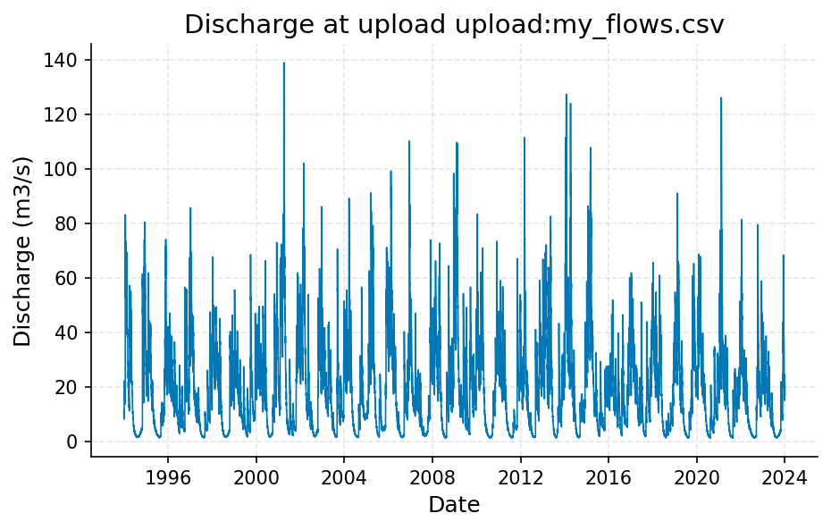
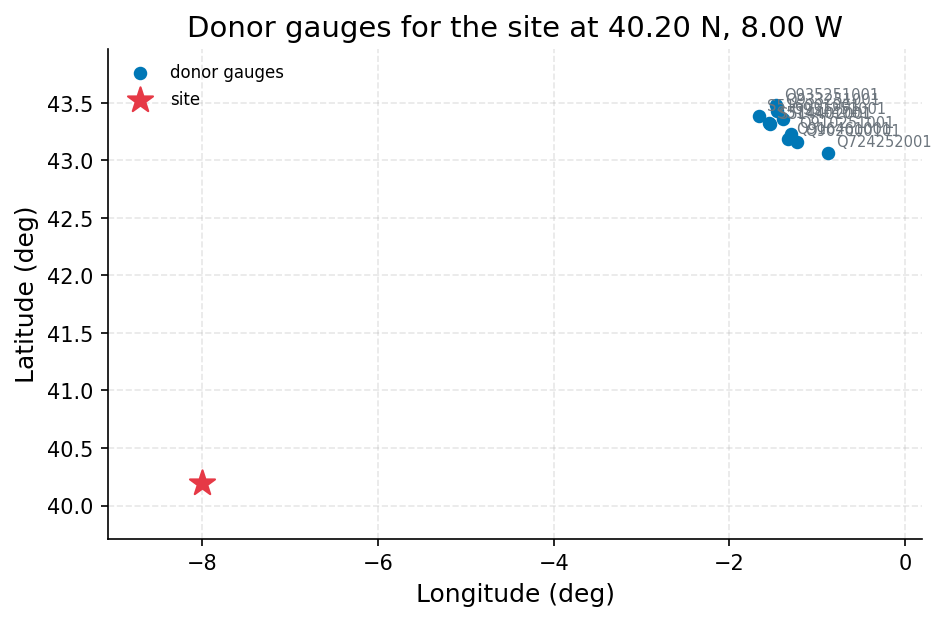
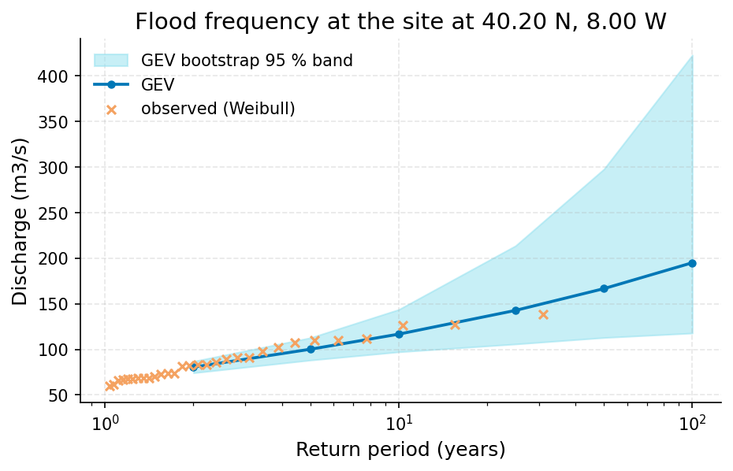
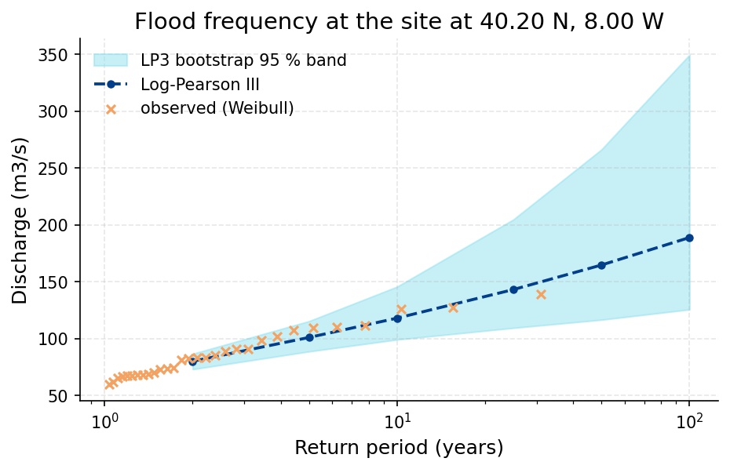

# 50-Year Design Flood for the Culvert Site: GEV and Log-Pearson III Fits on the Uploaded Flow Record

**Author:** AquaScope Studio  
**Date:** 2026-09-14  
**Description:** size the culvert to safely pass the 50-year return-period flood at this ungauged site  
**Data Sources:** BasinATLAS (HydroATLAS v1.0), ERA5 via Open-Meteo, similar_basins, upload  
**Version:** 1.0  

**Site:** 40.2000 N, 8.0000 W

**Answer.** Notice: the Critic's fix requests on answer, decision, key_numbers were not all resolved; read the report with the list of what this study does not establish.

Size the culvert to safely pass the 50-year return-period flood at this site: the GEV fit gives 166.7 m3/s and the Log-Pearson III fit gives 164.7 m3/s, both from the annual maxima of upload:my_flows.csv (1994-01-01 to 2023-12-31, 30 years, 10957 daily values). This estimate is graded indicative, because the record's own quality-control step failed to return a result and the similar_basins cross-check could not be verified.

*Key numbers*

| Quantity | Value | Unit | Step |
| --- | --- | --- | --- |
| Record length | 30.0 | years | s1 |
| Mean of the record | 20.16 | m3/s | s1 |
| Donor gauges | 10.0 |  | s2.fallback |
| 50-year return level, GEV on the table | 166.7 | m3/s | s3 |
| 50-year GEV interval, low | 112.9 | m3/s | s3 |
| 50-year GEV interval, high | 297.8 | m3/s | s3 |
| Years of annual maxima | 30.0 | years | s4 |
| 50-year return level, LP3 on the table | 164.7 | m3/s | s4 |
| 50-year LP3 interval, low | 116.6 | m3/s | s4 |
| 50-year LP3 interval, high | 266.2 | m3/s | s4 |

## Summary

The client's 30-year daily flow record (upload:my_flows.csv, 1994-01-01 to 2023-12-31, 10957 values, mean 20.16 m3/s, min 1.263 m3/s, max 138.906 m3/s) was used to extract annual maxima and fit two flood-frequency distributions. The two central estimates agree closely, about 1.2 percent apart, a small spread, though the specific disagreement threshold used for grading is not shown in the available results. The observed record maximum, 138.906 m3/s, sits below both 50-year estimates, consistent with a 30-year record's empirical return period of about 31 years for its own peak.

## The decision

Decide the culvert design flow using the higher of the two point estimates, 166.7 m3/s (GEV, upload:my_flows.csv), graded indicative. The conditions are: both fits used the full 30-year at-site annual-maxima series and passed their own not_empty gates; the upstream quality-control step (s2) itself returned nothing and failed its gate, so data quality was only self-reported by the loader, not independently confirmed; the similar_basins fallback also failed its min_donors gate despite listing candidate stations, so no regional cross-check could be certified. This would change to established grading if the quality step is fixed to actually run and confirm the series, if the donor cross-check is repaired, and if the site's status (the brief calls it ungauged, yet a complete at-site record was used) is clarified.

## Findings

Finding three (established): the largest daily flow ever observed in the 30-year record is 138.906 m3/s, below both fitted 50-year levels, consistent with a record maximum whose empirical return period is near 31 years, not 50 years -- the extrapolation to T=50 is modest, not extreme.

## Problem and decision

The client needs the culvert at this site sized for the 50-year return-period flood, working from an attached table of daily flows (upload:my_flows.csv) at an ungauged location, with two flood-frequency fits reported alongside their spread as the design uncertainty.

## Site and data

The record used is upload:my_flows.csv, treated as the site-specific daily discharge series, covering 1994-01-01 to 2023-12-31 (30 years, 10957 daily values, 100 percent coverage, no duplicates or gaps). Its mean flow is 20.16 m3/s, minimum 1.263 m3/s, maximum 138.906 m3/s. The similar_basins fallback (triggered when the quality step returned nothing) ran but failed its min_donors gate because no donor count was available at 'k', so no verified regional cross-check exists for this record.

## Methodology

Annual maxima were extracted from the loaded upload:my_flows.csv series. A GEV distribution was fitted by the return_periods tool to obtain the first 50-year estimate. A Log-Pearson III distribution was fitted separately to the same annual maxima with the same return-period set and bootstrap bounds. The two 50-year estimates were then compared for spread, described qualitatively as close agreement, without additional regionalization since the client supplied a site record.

## Results: step s1

Loading upload:my_flows.csv (s1) returned 10957 daily values over 30.0 years, 1994-01-01 to 2023-12-31, mean 20.162354 m3/s, min 1.263 m3/s, max 138.906 m3/s, with 100.0 percent coverage, zero duplicates, zero negatives and zero flagged spikes.


*Daily discharge at upload upload:my_flows.csv, 1994 to 2023.*

*The record (10957 rows) is in the workbook (`workbook.xlsx`, sheet `s1_series`) and the notebook, not printed here.*

## Results: step s2

The quality step (s2) failed its not_empty gate ('nothing at quality'); its fallback, similar_basins, ran but failed the min_donors gate because no donor count was available at 'k', so no verified independent quality or regional check exists for this record.


*The site and the 10 donor gauges the similarity search selected, in longitude and latitude (no basemap); labels are the station ids.*

*Data-quality findings on the table.*

| kind | item | value |
| --- | --- | --- |
| count | n_records | 10957.0 |
| count | n_duplicates | 0.0 |
| count | completeness_pct | 100.0 |

*Donor gauges selected for the site at 40.20 N, 8.00 W.*

| source | station_id | name | latitude | longitude | distance_km | score | similarity_distance | up_area_km2 | period_start | period_end |
| --- | --- | --- | --- | --- | --- | --- | --- | --- | --- | --- |
| hubeau_hydrometrie | Q916461001 | La Nive des Aldudes à Saint-Étienne-de-Baïgorry | 43.184100302 | -1.33680921 | 644.8 | 1.3265 | 0.3105 | 205.3 | 1960-01-01 |  |
| hubeau_hydrometrie | S516001001 | La Nivelle à Ciboure | 43.384770372 | -1.66398305 | 633.2 | 1.3293 | 0.4039 | 239.8 | 2000-05-22 |  |
| hubeau_hydrometrie | S514401001 | La Nivelle à Saint-Pée-sur-Nivelle [Pont de Cherchebruit] | 43.321469448 | -1.54993683 | 637.4 | 1.3316 | 0.3845 | 239.8 | 1969-01-01 |  |
| hubeau_hydrometrie | S514402001 | La Nivelle à Saint-Pée-sur-Nivelle [Lurberria] | 43.313456954 | -1.533052277 | 638.1 | 1.3338 | 0.3875 | 239.8 | 2009-03-27 |  |
| hubeau_hydrometrie | Q902000101 | La Nive à Saint-Jean-Pied-de-Port | 43.161941599 | -1.236181897 | 650.8 | 1.353 | 0.369 | 258.0 | 2025-05-01 |  |
| hubeau_hydrometrie | Q910251001 | La Nive à Ossès | 43.230308097 | -1.301413439 | 649.8 | 1.3737 | 0.4449 | 767.6 | 1995-01-01 |  |
| hubeau_hydrometrie | Q931251001 | La Nive à Cambo-les-Bains | 43.356674095 | -1.390460897 | 650.5 | 1.3886 | 0.4853 | 873.9 | 1999-06-02 |  |
| hubeau_hydrometrie | Q933251001 | La Nive à Villefranque | 43.432791065 | -1.456860164 | 650.3 | 1.4031 | 0.5267 | 998.7 | 2008-06-26 |  |
| hubeau_hydrometrie | Q935251001 | La Nive à Bayonne [Pont Blanc] - Pont-Blanc | 43.477828356 | -1.472382671 | 651.8 | 1.4089 | 0.5345 | 998.7 | 2006-08-12 |  |
| hubeau_hydrometrie | Q724252001 | Le Saison à Licq-Athérey [Pont de Licq] | 43.066445321 | -0.876716891 | 672.0 | 1.4128 | 0.4355 | 366.2 | 1996-01-01 |  |

## Results: step s3

The 50-year return level by GEV from 30 annual maxima: 166.7 m3/s (95 % confidence interval 112.9 to 297.8 m3/s). Gates: not_empty passed ('return_levels' is present).


*Return levels of annual maximum discharge at the site at 40.20 N, 8.00 W: GEV fits with the GEV bootstrap 95 % band, and the observed annual maxima at their Weibull plotting positions.*

*Return levels at the table (column value) by return period, with the confidence band.*

| T | GEV | LP3 | lower | upper |
| --- | --- | --- | --- | --- |
| 2.0 | 80.526954966232 |  | 74.28115808941071 | 86.91813497794472 |
| 5.0 | 100.17202395053366 |  | 88.19149584350917 | 112.7154599036146 |
| 10.0 | 116.72084915320548 |  | 97.24018027588488 | 143.7085945329082 |
| 25.0 | 142.77283888523013 |  | 105.84270654591444 | 213.70214634657512 |
| 50.0 | 166.65846911768173 |  | 112.91556455659278 | 297.84060170624514 |
| 100.0 | 195.0623147787553 |  | 117.83903265686592 | 422.8917384312064 |

## Results: step s4

The 50-year return level by Log-Pearson III from 30 annual maxima: 164.7 m3/s (95 % confidence interval 116.6 to 266.2 m3/s). Gates: not_empty passed ('return_levels' is present).


*Return levels of annual maximum discharge at the site at 40.20 N, 8.00 W: Log-Pearson III fits with the LP3 bootstrap 95 % band, and the observed annual maxima at their Weibull plotting positions.*

*Return levels at the table (column value) by return period, with the confidence band.*

| T | GEV | LP3 | lower | upper |
| --- | --- | --- | --- | --- |
| 2.0 |  | 80.1594093541817 | 73.14812863005567 | 86.70843591969057 |
| 5.0 |  | 101.09052257525664 | 88.77105544718299 | 115.39822683289884 |
| 10.0 |  | 118.060435053139 | 99.21546535854904 | 145.6608037822285 |
| 25.0 |  | 143.17449074343506 | 109.46865805230122 | 204.70632548441515 |
| 50.0 |  | 164.71534199000754 | 116.61752747063426 | 266.1732680235223 |
| 100.0 |  | 188.8560103234435 | 125.6675655810894 | 349.3571461689802 |

## Limitations and what this study does not establish

The quality-control step (s2) did not run successfully, so the clean-looking QA figures come only from the loader's own check, not an independent audit; its similar_basins fallback also failed to certify donor count, leaving no regional cross-check. The brief describes the site as ungauged, yet a complete 30-year at-site daily record was used without resolving this discrepancy. The estimate is stationary; no climate-change adjustment is included, per the brief's caveats.

## What this study does not establish

- Step s2, gate not_empty: nothing at 'quality'
- Step s2.fallback, gate min_donors: no donor count at 'k'

## Caveats

- Design-flood guidance under climate change is immature (Wasko et al. 2024, HESS): the estimate here is stationary, and any climate scenario is an overlay on it, not a nonstationary fit.
- Rare quantiles move with the distribution and the estimator. Two fits (GEV by L-moments and Log-Pearson III) are quoted with their intervals and the spread between them; a spread above 25 percent is reported as disagreement, not averaged away.
- GloFAS discharge is a model output for a grid cell of about 5 km, not a gauge reading; return levels from it are indicative only.

## Recommendations

Before finalizing, obtain a working quality-control report to confirm the series is fit for use, and repair the donor cross-check (min_donors gate) so the similar_basins result can either support or challenge the at-site fits. Clarify whether upload:my_flows.csv is genuinely at the ungauged culvert site or a nearby proxy, since this affects whether the estimate can be certified as established rather than indicative.

## References

1. England, J. F. et al. (2019). Guidelines for determining flood flow frequency, Bulletin 17C. USGS Techniques and Methods 4-B5.
2. Hosking, J. R. M. (1990). L-moments: analysis and estimation of distributions using linear combinations of order statistics. J. R. Stat. Soc. B 52, 105-124.
3. Bloeschl, G., Sivapalan, M., Wagener, T., Viglione, A., Savenije, H. (eds.) (2013). Runoff Prediction in Ungauged Basins. Cambridge University Press; Oudin, L. et al. (2008). Spatial proximity, physical similarity, regression and ungaged catchments. Water Resour. Res. 44, W03413. Attributes: HydroATLAS v1.0 (BasinATLAS), CC BY 4.0. Linke, S., Lehner, B., Ouellet Dallaire, C., et al. (2019). Global hydro-environmental sub-basin and river reach characteristics at high spatial resolution. Scientific Data 6: 283. https://doi.org/10.1038/s41597-019-0300-6
4. Coles, S. (2001). An Introduction to Statistical Modeling of Extreme Values. Springer
5. England, J. F. Jr. et al. (2018). Bulletin 17C. USGS Techniques and Methods 4-B5.
6. Wasko, C. et al. (2024). A systematic review of climate change science for flood and design guidance. Hydrol. Earth Syst. Sci. 28, 1251-1285. doi:10.5194/hess-28-1251-2024
7. Nonstationary flood frequency estimates are parameter-fragile: Stoch. Environ. Res. Risk Assess. (2024), doi:10.1007/s00477-024-02680-9
8. Multi-approach cross-checks in infrastructure flood practice: J. Hydrol. (2024), doi:10.1016/j.jhydrol.2024.130698
9. Oudin, L. et al. (2008). Spatial proximity, physical similarity, regression and ungaged catchments. Water Resour. Res. 44, W03413.
10. Harrigan, S. et al. (2020). GloFAS-ERA5 operational global river discharge reanalysis 1979-present. Earth Syst. Sci. Data 12, 2043-2060.
11. Wasko et al. 2024, HESS
12. Rekin226 and contributors (2026). AquaScope: Open-source water data aggregation toolkit (version 0.16.0) [Software]. Zenodo. https://doi.org/10.5281/zenodo.21903143

## Appendix: reproducibility

Re-run the same steps with no model: `aquascope run study.yaml`. Resume the workspace: `aquascope studio --resume workspace.json`.

Model: claude-sonnet-5 via anthropic; ledger: consultant 1 call(s), 5360 tokens, methodologist 1 call(s), 11543 tokens, analyst 1 call(s), 5670 tokens, interpreter 1 call(s), 19026 tokens, author 1 call(s), 17860 tokens, critic 1 call(s), 12850 tokens. aquascope 0.16.0.

```yaml
# An AquaScope study (version 3): the plan behind an answer, its gates, and what happened.
#   aquascope run study.yaml
version: 3
title: "Estimate the 50-year return-period flood peak discharge for : 40.2, -8.0"
question: "Use my attached table of daily flows for a culvert design on an ungauged stream: the 50-year flood, with two fits and their spread."
created: "2026-09-14T22:25:51+00:00"
aquascope_version: "0.16.0"
author: "methodologist"
model: "claude-sonnet-5"
problem:
  kind: "flood_risk"
  site: {"lat": 40.2, "lon": -8.0}
  params: {"return_period": 50, "decision": "design flow"}
  text: "Use my attached table of daily flows for a culvert design on an ungauged stream: the 50-year flood, with two fits and their spread."
plan:
  author: "methodologist"
  playbook: "flood_risk"
  objective: "Estimate the 50-year return-period flood peak discharge for an ungauged culvert site using the client's own 30-year daily flow record, quantifying the spread between two flood-frequency fits."
  decision: "size the culvert to safely pass the 50-year return-period flood at this ungauged site"
  methodology: ["Load the client's uploaded daily flow record (upload:my_flows.csv) as the primary series since the site is ungauged and no catalog gauge lies within 50 km.", "Check the loaded series for gaps, duplicates and outliers before extracting annual maxima.", "Fit a GEV distribution by L-moments to the annual maxima and read off the 50-year return level.", "Fit a Log-Pearson III distribution to the same annual maxima and read off its 50-year return level.", "Compare the two 50-year estimates to report their spread (difference and relative percent) as the design uncertainty range, flagging disagreement if the spread exceeds about 25 percent.", "Recommend the culvert be sized to at least the higher of the two 50-year estimates, carrying the spread forward as the stated uncertainty."]
  assumptions: ["annual maximum series will be extracted from the uploaded daily flow record (my_flows.csv)", "two standard flood-frequency distributions (e.g. GEV and Gumbel, or GEV and Log-Pearson III) will be fitted to the annual maxima to obtain two 50-year estimates", "the spread between the two fits is reported as the uncertainty range for the 50-year design flow", "no additional regionalization or GloFAS cross-check is applied since the client has supplied a site-specific flow record", "Annual maximum series is extracted from the uploaded daily flow record (upload:my_flows.csv, 30 years, 10957 daily values, usable quality).", "The uploaded 30-year record is treated as long enough to support a 50-year return-period estimate (return period about 1.7 times the record length), following the exemplar's min_years gate.", "No additional regionalization (similar_basins, regionalize_signatures) or GloFAS cross-check is applied because the client has supplied a site-specific flow record, as stated in the brief.", "The design flow is stationary; any climate-change adjustment would be an overlay on this estimate, not a nonstationary fit."]
  alternatives: [{"method": "similar_basins / regionalize_signatures (donor-based regionalization)", "why_not": "The brief explicitly directs the analysis to rely on the client's own uploaded record rather than catalog donors, since a site-specific 30-year series is available."}, {"method": "glofas_cross_check via anywhere", "why_not": "Brief assumptions state no additional GloFAS cross-check is applied given the site-specific flow record; it would be an optional overlay, not needed here."}]
  limitations_expected: ["Rare quantiles (50-year) move with the distribution and estimator; the two fits (GEV and Log-Pearson III) are quoted with the spread between them, not averaged, and a spread above about 25 percent signals disagreement rather than convergence.", "Record length (30 years) is well short of the 50-year return period sought, so both fits extrapolate beyond the observed range and carry substantial estimation uncertainty.", "Data quality of the uploaded series was only checked, not independently verified against an external gauge, since none exists within 50 km.", "Design-flood guidance under climate change is immature; this estimate is stationary and any climate scenario would need to be applied as a separate overlay."]
  citations: ["England, J. F. et al. (2019). Guidelines for determining flood flow frequency, Bulletin 17C. USGS Techniques and Methods 4-B5.", "Hosking, J. R. M. (1990). L-moments: analysis and estimation of distributions using linear combinations of order statistics. J. R. Stat. Soc. B 52, 105-124.", "Wasko, C. et al. (2024). A systematic review of climate change science for flood and design guidance. Hydrol. Earth Syst. Sci. 28, 1251-1285. doi:10.5194/hess-28-1251-2024", "Nonstationary flood frequency estimates are parameter-fragile: Stoch. Environ. Res. Risk Assess. (2024), doi:10.1007/s00477-024-02680-9", "Multi-approach cross-checks in infrastructure flood practice: J. Hydrol. (2024), doi:10.1016/j.jhydrol.2024.130698", "Oudin, L. et al. (2008). Spatial proximity, physical similarity, regression and ungaged catchments. Water Resour. Res. 44, W03413.", "Harrigan, S. et al. (2020). GloFAS-ERA5 operational global river discharge reanalysis 1979-present. Earth Syst. Sci. Data 12, 2043-2060.", "Wasko et al. 2024, HESS"]
  caveats: ["Design-flood guidance under climate change is immature (Wasko et al. 2024, HESS): the estimate here is stationary, and any climate scenario is an overlay on it, not a nonstationary fit.", "Rare quantiles move with the distribution and the estimator. Two fits (GEV by L-moments and Log-Pearson III) are quoted with their intervals and the spread between them; a spread above 25 percent is reported as disagreement, not averaged away.", "GloFAS discharge is a model output for a grid cell of about 5 km, not a gauge reading; return levels from it are indicative only."]
  rationale: "Estimate the 50-year return-period flood peak discharge for an ungauged culvert site using the client's own 30-year daily flow record, quantifying the spread between two flood-frequency fits."
  recon_notes: ["No catalog gauge within 50 km; the nearest is La Nivelle \u00e0 Ciboure (hubeau_hydrometrie/S516001001) at 633 km.", "10 donor gauges from a pool of 34,786 gauged catchments.", "ERA5 temperature and forcing and GloFAS discharge are assumed reachable for any point on land (Open-Meteo); not checked here.", "CMIP6 change factors need model output you supply (aquascope.climate works on downloaded data); not counted.", "No gauge with a usable record within 50 km: at-site methods are not defensible; what remains is the regionalisation path (similar_basins, regionalize_signatures) and the GloFAS cross-check.", "upload:my_flows.csv: discharge in m3/s; coverage 100.0 %"]
  replans: [{"step": "s2", "reason": "gate failed: not_empty (nothing at 'quality')", "fallback": {"tool": "similar_basins", "arguments": {"lat": 40.2, "lon": -8.0, "k": 10}, "rationale": "Quality control of the uploaded daily-flow table could not be verified (empty quality result), and recon confirms no catalog gauge within 50 km, so a donor-gauge regional cross-check is the defensible path to a 50-year flood estimate.", "expects": [{"check": "min_donors", "path": "k"}, {"check": "not_empty", "path": "stations"}]}}]
steps:
  - tool: "load_table"
    id: "s1"
    rationale: "The attached table upload:my_flows.csv (30 years of daily discharge) is the record the culvert design is based on, since the site is ungauged."
    arguments:
      table: "upload:my_flows.csv"
    expects:
      - {"check": "not_empty", "path": "n"}
      - {"check": "min_years", "path": "years", "value": 1}
    outputs: [{"kind": "table", "id": "s1_series", "caption": "loaded daily discharge series from upload:my_flows.csv"}]
  - tool: "quality"
    id: "s2"
    rationale: "Record length and data quality of the upload are unknown, so gaps, duplicates and outliers must be checked before extracting annual maxima."
    arguments:
      from_step: "s1"
    expects:
      - {"check": "not_empty", "path": "quality"}
    fallback: {"step": {"tool": "similar_basins", "arguments": {"lat": 40.2, "lon": -8.0, "k": 10}, "rationale": "Quality control of the uploaded daily-flow table could not be verified (empty quality result), and recon confirms no catalog gauge within 50 km, so a donor-gauge regional cross-check is the defensible path to a 50-year flood estimate.", "expects": [{"check": "min_donors", "path": "k"}, {"check": "not_empty", "path": "stations"}]}}
    depends_on: ["s1"]
    outputs: [{"kind": "table", "id": "s2_quality", "caption": "quality diagnostics of the uploaded flow series"}]
  - tool: "return_periods"
    id: "s3"
    rationale: "A GEV fit by L-moments on the annual maxima of the uploaded record gives the first 50-year flood estimate."
    method: "at_site_flood_frequency"
    arguments:
      from_step: "s1"
      column: "flow_m3s"
      distribution: "gev"
      periods: [2, 5, 10, 25, 50, 100]
    expects:
      - {"check": "not_empty", "path": "return_levels"}
    depends_on: ["s1"]
    outputs: [{"kind": "figure", "id": "s3_frequency_curve", "caption": "GEV frequency curve from the uploaded record"}, {"kind": "table", "id": "s3_return_levels", "caption": "GEV return levels including the 50-year estimate"}]
  - tool: "return_periods"
    id: "s4"
    rationale: "A Log-Pearson III fit on the same annual maxima gives the second 50-year estimate, needed to quantify the spread between fits."
    method: "at_site_flood_frequency"
    arguments:
      from_step: "s1"
      column: "flow_m3s"
      distribution: "lp3"
      periods: [2, 5, 10, 25, 50, 100]
    expects:
      - {"check": "not_empty", "path": "return_levels"}
    depends_on: ["s1"]
    outputs: [{"kind": "figure", "id": "s4_frequency_curve", "caption": "Log-Pearson III frequency curve from the uploaded record"}, {"kind": "table", "id": "s4_return_levels", "caption": "Log-Pearson III return levels including the 50-year estimate"}]
results:
  s1: {"ok": true, "gates": [{"check": "not_empty", "passed": true, "detail": "'n' is present"}, {"check": "min_years", "passed": true, "detail": "30 years of record, 1 needed"}], "summary": "source=upload, station_id=upload:my_flows.csv, name=upload:my_flows.csv, variable=discharge, unit=m3/s, years=30.0, start=1994-01-01, end=2023-12-31", "fallback_used": false, "sha256": "e4e07f9fdf8b8b5e"}
  s2: {"ok": true, "gates": [{"check": "not_empty", "passed": false, "detail": "nothing at 'quality'"}], "summary": "n_records=10957, n_duplicates=0, completeness_pct=100.0", "fallback_used": true, "sha256": "e9ecaa1598dda775", "failed_reason": "gate failed: not_empty (nothing at 'quality'); the fallback similar_basins did not pass its own gates", "fallback": {"tool": "similar_basins", "arguments": {"lat": 40.2, "lon": -8.0, "k": 10}, "ok": true, "gates": [{"check": "min_donors", "passed": false, "detail": "no donor count at 'k'"}, {"check": "not_empty", "passed": true, "detail": "'stations' is present"}], "summary": "k=10, method=combined"}}
  s3: {"ok": true, "gates": [{"check": "not_empty", "passed": true, "detail": "'return_levels' is present"}], "summary": "variable=discharge, unit=m3/s", "fallback_used": false, "sha256": "a39912ddc8f0ddd8"}
  s4: {"ok": true, "gates": [{"check": "not_empty", "passed": true, "detail": "'return_levels' is present"}], "summary": "variable=discharge, unit=m3/s", "fallback_used": false, "sha256": "a67dc4315e15561e"}
```

## Cite this software

AquaScope Studio (2026). AquaScope: Open-source water data aggregation toolkit (version 0.16.0) [Software]. Zenodo. https://doi.org/10.5281/zenodo.21903143


---

*{'model': 'claude-sonnet-5', 'provider': 'anthropic', 'prose': 'model', 'tokens': {'consultant': {'calls': 1, 'prompt_tokens': 2921, 'completion_tokens': 2439, 'cost_usd': 0.030232}, 'methodologist': {'calls': 1, 'prompt_tokens': 8569, 'completion_tokens': 2974, 'cost_usd': 0.046878}, 'analyst': {'calls': 1, 'prompt_tokens': 3024, 'completion_tokens': 2646, 'cost_usd': 0.032508}, 'interpreter': {'calls': 1, 'prompt_tokens': 11526, 'completion_tokens': 7500, 'cost_usd': 0.098052}, 'author': {'calls': 2, 'prompt_tokens': 31116, 'completion_tokens': 8609, 'cost_usd': 0.148322}, 'critic': {'calls': 1, 'prompt_tokens': 5487, 'completion_tokens': 7363, 'cost_usd': 0.084604}}, 'total_tokens': 94174, 'total_usd': 0.440596, 'budget': None, 'dropped': 10, 'aquascope_version': '0.16.0', 'date': '2026-09-14 22:30 UTC', 'workspace': '4a5a6428ebdb', 'plan_author': 'methodologist', 'written_by': {'answer': 'model', 'summary': 'model', 'decision': 'model', 'findings': 'model', 'problem': 'model', 'site_data': 'model', 'methodology': 'model', 'results-s1': 'model', 'results-s2': 'model', 'results-s3': 'model', 'results-s4': 'model', 'limitations': 'model', 'recommendations': 'model', 'references': 'template', 'appendix': 'template'}}*
