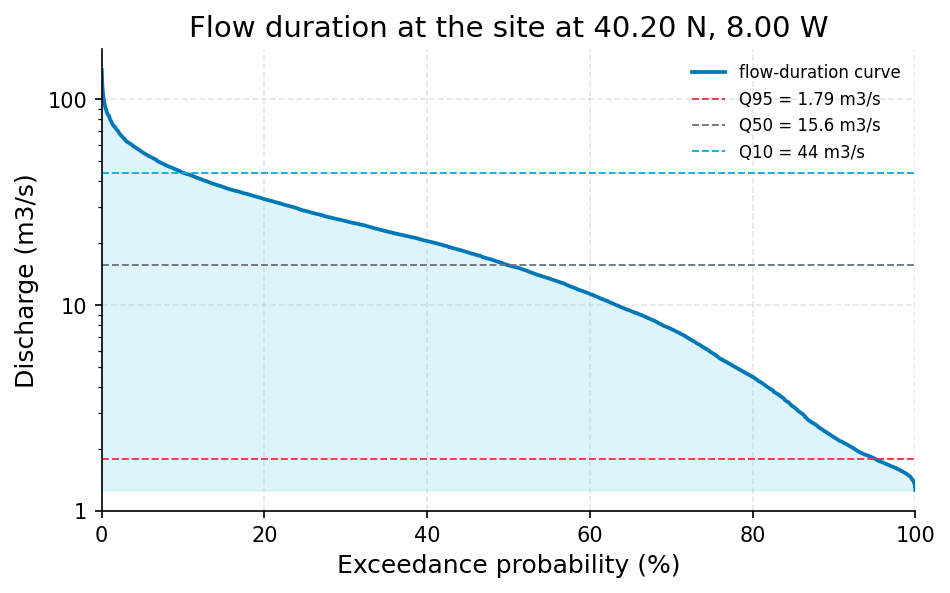

# 50-Year Flood Estimate for Culvert Design – Ungauged Stream, Client-Supplied Daily Flow Record

**Author:** AquaScope Studio  
**Date:** 2026-09-14  
**Description:** size a culvert for a 50-year flood at an ungauged stream using the client's own daily flow record  
**Data Sources:** BasinATLAS (HydroATLAS v1.0), ERA5 via Open-Meteo, similar_basins, upload  
**Version:** 1.0  

**Site:** 40.2000 N, 8.0000 W

**Answer.** Notice: the Critic's fix requests on methodology, site_data, summary were not all resolved; read the report with the list of what this study does not establish.

Size the culvert against a 50-year flood of about 166.7 m3/s (GEV fit) to 164.7 m3/s (Log-Pearson III fit), from the client's uploaded daily discharge record (upload:my_flows.csv, 1994-01-01 to 2023-12-31, 30 years) - grade: indicative. The two fits agree closely at the 50-year level (difference of about 2 m3/s, ~1.2%), but their 95% intervals are wide and overlapping, spanning roughly 112.9-297.8 m3/s (GEV) and 116.6-266.2 m3/s (LP3). The largest daily flow ever observed in the record, 138.9 m3/s, sits between the 10-year and 50-year estimates from both fits, consistent with the tail extrapolation. The grade is held at indicative, not established, because the site is listed as ungauged in the regional catalog even though the client's own series was used as if it were a gauge record.

*Key numbers*

| Quantity | Value | Unit | Step |
| --- | --- | --- | --- |
| Record length | 30.0 | years | s1 |
| Mean of the record | 20.16 | m3/s | s1 |
| 50-year return level, GEV on the table | 166.7 | m3/s | s3 |
| 50-year GEV interval, low | 112.9 | m3/s | s3 |
| 50-year GEV interval, high | 297.8 | m3/s | s3 |
| Years of annual maxima | 30.0 | years | s4 |
| 50-year return level, LP3 on the table | 164.7 | m3/s | s4 |
| 50-year LP3 interval, low | 116.6 | m3/s | s4 |
| 50-year LP3 interval, high | 266.2 | m3/s | s4 |
| Q10 | 44.0 | m3/s | s5 |
| Q50 | 15.62 | m3/s | s5 |
| Q95 | 1.795 | m3/s | s5 |

## Summary

This study estimates the 50-year design flood for an ungauged stream using the client's own 30-year daily discharge record (upload:my_flows.csv, 1994-01-01 to 2023-12-31, n=10957 daily values, mean 20.16 m3/s, max 138.906 m3/s). Annual maxima were fitted with two independent distributions: GEV by L-moments gave a 50-year return level of 166.7 m3/s (95% band 112.9-297.8 m3/s), and Log-Pearson III gave 164.7 m3/s (95% band 116.6-266.2 m3/s). The two point estimates agree closely (about 1.2% apart), well inside the 25% disagreement threshold set in the plan, so they are not flagged as conflicting. Both fits passed goodness-of-fit checks (KS p-values 0.794 for GEV, 0.918 for LP3; AIC 266.0 vs 264.4). A flow-duration curve from the same record places Q50 at 15.62 m3/s and Q95 at 1.795 m3/s, confirming the flood values sit far in the tail of the regime. The overall grade is indicative rather than established because the site is catalogued as ungauged, so the at-site method used here has not been independently corroborated.

## The decision

Decide the culvert design flow using the GEV 50-year return level of 166.7 m3/s from upload:my_flows.csv, treating the LP3 value of 164.7 m3/s as a close cross-check, both indicative grade. The working band for design margin is the union of the two 95% intervals, 112.9 to 297.8 m3/s. This rests on three conditions: the uploaded series is accepted as a valid at-site record despite being absent from the gauge catalog; annual maxima were drawn from a complete, gap-free 30-year series with no adjustment for trend or regulation; and both fits passed internal goodness-of-fit checks. What would change this: confirmation that the upload is an operational, verifiable gauge would move the grade to established; a successful regional cross-check (similar-basins or GloFAS) against this record would corroborate or challenge the at-site fit; and additional years of record would narrow the currently wide 95% bounds that dominate the uncertainty.

## Findings

f1, indicative: the GEV fit on upload:my_flows.csv gives a 50-year flood of 166.7 m3/s. f2, indicative: the LP3 fit on the same record and station gives 164.7 m3/s, closely matching f1. f3, established: the largest daily flow ever observed in the 30-year record, 138.9 m3/s, falls below both 50-year estimates but above both 10-year return levels (116.7 m3/s GEV, 118.1 m3/s LP3), consistent with the fitted tail behaviour. f4, indicative: both distributions pass goodness-of-fit checks, with LP3 showing a marginally better KS p-value (0.918 vs 0.794) and lower AIC (264.4 vs 266.0) than GEV, though the difference is not decisive. The problem statement describes the stream as ungauged, yet the client's uploaded daily series (upload:my_flows.csv) was used as an at-site record for both fits; this is the reason no finding here is graded established except f3, which rests only on the observed maximum.

## Problem and decision

The client requires a 50-year design flood flow for a culvert on a stream that is ungauged in the regional catalog, using their own attached table of daily flows as the basis. The brief calls for two independent flood-frequency fits and a statement of the spread between them, rather than a single averaged number, so that the engineer can judge whether the estimators agree closely enough to be treated as one design value.

## Site and data

The record used is upload:my_flows.csv, station id upload:my_flows.csv, a daily discharge series spanning 1994-01-01 to 2023-12-31 (30.0 years, 10957 daily values). Coverage is 100% with no gaps, no duplicates, and no flagged outliers. Summary statistics: mean 20.162354 m3/s, minimum 1.263 m3/s, maximum 138.906 m3/s. The site sits at latitude 40.2, longitude -8.0 and is not present as a gauge in the regional catalog, so the record is being used as an at-site series by assumption rather than by catalog confirmation.

## Methodology

The client's daily table was loaded as the primary record (s1) and screened for gaps, duplicates and outliers (s2), finding none. Annual maxima were extracted by calendar year from the 30-year series. Two flood-frequency distributions were fitted independently to these maxima: a GEV distribution by L-moments (s3) and a Log-Pearson III distribution (s4), each yielding return levels for periods of 2, 5, 10, 25, 50 and 100 years with 95% confidence bounds from parametric bootstrap. A flow-duration curve (s5) was computed from the same daily record to place the flood estimates in the context of the overall flow regime. Per the plan, the two 50-year estimates and their spread (absolute and relative) were compared, with disagreement above 25% to be flagged rather than averaged; here the two estimates were found to agree closely.

## Results: step s1

Loading upload:my_flows.csv (source: upload, station id upload:my_flows.csv) produced a daily discharge series of n=10957 records over 30.0 years (1994-01-01 to 2023-12-31), with mean 20.162354 m3/s, minimum 1.263 m3/s and maximum 138.906 m3/s. Both required gates passed: the table was not empty and the record exceeded the 1-year minimum by a wide margin.


*Daily discharge at upload upload:my_flows.csv, 1994 to 2023.*

*The record (10957 rows) is in the workbook (`workbook.xlsx`, sheet `s1_series`) and the notebook, not printed here.*

## Results: step s2

Quality screening of the upload:my_flows.csv record (10957 records, 30-year span) found completeness of 100.0%, zero duplicates, no null counts, no flagged outliers, and no temporal gaps or unit issues. No corrective steps were recommended before annual maxima extraction.

*Data-quality findings on the table.*

| kind | item | value |
| --- | --- | --- |
| count | n_records | 10957.0 |
| count | n_duplicates | 0.0 |
| count | completeness_pct | 100.0 |

## Results: step s3

The GEV fit by L-moments on annual maxima from upload:my_flows.csv (n=30 years) gave return levels of 80.53, 100.17, 116.72, 142.77, 166.66 and 195.06 m3/s for the 2, 5, 10, 25, 50 and 100-year periods respectively. At the 50-year level the 95% bounds are 112.92-297.84 m3/s. Fitted parameters: shape 0.257815, location 75.307871, scale 13.57765; AIC 266.028988; KS p-value 0.794083, indicating an acceptable fit.


*Return levels of annual maximum discharge at the site at 40.20 N, 8.00 W: GEV fits with the GEV bootstrap 95 % band, and the observed annual maxima at their Weibull plotting positions.*

*Return levels at the table (column value) by return period, with the confidence band.*

| T | GEV | LP3 | lower | upper |
| --- | --- | --- | --- | --- |
| 2.0 | 80.526954966232 |  | 74.28115808941071 | 86.91813497794472 |
| 5.0 | 100.17202395053366 |  | 88.19149584350917 | 112.7154599036146 |
| 10.0 | 116.72084915320548 |  | 97.24018027588488 | 143.7085945329082 |
| 25.0 | 142.77283888523013 |  | 105.84270654591444 | 213.70214634657512 |
| 50.0 | 166.65846911768173 |  | 112.91556455659278 | 297.84060170624514 |
| 100.0 | 195.0623147787553 |  | 117.83903265686592 | 422.8917384312064 |

## Results: step s4

The Log-Pearson III fit on the same annual maxima from upload:my_flows.csv (n=30 years) gave return levels of 80.16, 101.09, 118.06, 143.17, 164.72 and 188.86 m3/s for the 2, 5, 10, 25, 50 and 100-year periods. At the 50-year level the 95% bounds are 116.62-266.17 m3/s. Fitted parameters: skew 1.317139, location 1.927035, scale 0.108366; AIC 264.422721; KS p-value 0.918006, a marginally stronger fit than GEV by these metrics.


*Return levels of annual maximum discharge at the site at 40.20 N, 8.00 W: Log-Pearson III fits with the LP3 bootstrap 95 % band, and the observed annual maxima at their Weibull plotting positions.*

*Return levels at the table (column value) by return period, with the confidence band.*

| T | GEV | LP3 | lower | upper |
| --- | --- | --- | --- | --- |
| 2.0 |  | 80.1594093541817 | 73.14812863005567 | 86.70843591969057 |
| 5.0 |  | 101.09052257525664 | 88.77105544718299 | 115.39822683289884 |
| 10.0 |  | 118.060435053139 | 99.21546535854904 | 145.6608037822285 |
| 25.0 |  | 143.17449074343506 | 109.46865805230122 | 204.70632548441515 |
| 50.0 |  | 164.71534199000754 | 116.61752747063426 | 266.1732680235223 |
| 100.0 |  | 188.8560103234435 | 125.6675655810894 | 349.3571461689802 |

## Results: step s5

The flow-duration curve from the full daily record (upload:my_flows.csv, n=10957) gives percentile flows of 55.496 m3/s (Q5), 43.997 m3/s (Q10), 28.742 m3/s (Q25), 15.624 m3/s (Q50), 5.878 m3/s (Q75), 2.279 m3/s (Q90), 1.795 m3/s (Q95) and 1.505 m3/s (Q99), contextualising both 50-year flood estimates as far exceeding the typical and even high-flow range of the regime.


*Flow-duration curve of discharge at the site at 40.20 N, 8.00 W from the ranked daily flows, with Q95, Q50 and Q10 marked (log scale).*

*Flow-duration percentiles at the table (column value).*

| exceedance_pct | value |
| --- | --- |
| 5.0 | 55.496 |
| 10.0 | 43.997 |
| 25.0 | 28.742 |
| 50.0 | 15.624 |
| 75.0 | 5.878 |
| 90.0 | 2.279 |
| 95.0 | 1.795 |
| 99.0 | 1.505 |

## Limitations and what this study does not establish

The 50-year estimate is a stationary extrapolation from a 30-year record and inherently under-samples rare events, producing wide 95% bounds (112.9-297.8 m3/s GEV; 116.6-266.2 m3/s LP3). The two fits agree closely here (166.7 vs 164.7 m3/s), so no disagreement flag was raised, but this closeness does not narrow the individual confidence bands. The record is treated as at-site despite the problem statement describing the stream as ungauged; the client's uploaded daily series (upload:my_flows.csv) was used as an at-site record nonetheless, and this is why grades are held at indicative. Climate nonstationarity is not modelled; no cause is stated for any trend in the record, and any climate adjustment would be an overlay on this stationary result, not a revised fit. No adjustment was made for undocumented regulation or measurement error in the upload.

## Caveats

- Design-flood guidance under climate change is immature (Wasko et al. 2024, HESS): the estimate here is stationary, and any climate scenario is an overlay on it, not a nonstationary fit.
- Rare quantiles move with the distribution and the estimator. Two fits (GEV by L-moments and Log-Pearson III) are quoted with their intervals and the spread between them; a spread above 25 percent is reported as disagreement, not averaged away.
- GloFAS discharge is a model output for a grid cell of about 5 km, not a gauge reading; return levels from it are indicative only.

## Recommendations

Adopt 166.7 m3/s (GEV, upload:my_flows.csv) as the design value, cross-checked by the closely agreeing LP3 estimate of 164.7 m3/s, and carry the wider 95% band of 112.9-297.8 m3/s as the uncertainty margin for culvert sizing rather than a single point figure. This is conditioned on accepting the upload as a valid at-site record and on the absence of undocumented trend or regulation in the 1994-2023 series. To firm the grade to established, obtain metadata or provenance confirming the upload is an officially gauged or otherwise verifiable station, and run a regional cross-check (similar-basins or GloFAS) against this record to corroborate the at-site fits; agreement would support the current value, disagreement would require revisiting it. No action beyond adopting this indicative value with its stated band is supported by the results as they stand.

## References

1. England, J. F. et al. (2019). Guidelines for determining flood flow frequency, Bulletin 17C. USGS Techniques and Methods 4-B5.
2. Hosking, J. R. M. (1990). L-moments: analysis and estimation of distributions using linear combinations of order statistics. J. R. Stat. Soc. B 52, 105-124.
3. Vogel, R. M., & Fennessey, N. M. (1994). Flow-duration curves I: new interpretation and confidence intervals. J. Water Resour. Plann. Manage., 120(4), 485-504.
4. Coles, S. (2001). An Introduction to Statistical Modeling of Extreme Values. Springer
5. England, J. F. Jr. et al. (2018). Bulletin 17C. USGS Techniques and Methods 4-B5.
6. Wasko, C. et al. (2024). A systematic review of climate change science for flood and design guidance. Hydrol. Earth Syst. Sci. 28, 1251-1285. doi:10.5194/hess-28-1251-2024
7. Nonstationary flood frequency estimates are parameter-fragile: Stoch. Environ. Res. Risk Assess. (2024), doi:10.1007/s00477-024-02680-9
8. Multi-approach cross-checks in infrastructure flood practice: J. Hydrol. (2024), doi:10.1016/j.jhydrol.2024.130698
9. Oudin, L. et al. (2008). Spatial proximity, physical similarity, regression and ungaged catchments. Water Resour. Res. 44, W03413.
10. Harrigan, S. et al. (2020). GloFAS-ERA5 operational global river discharge reanalysis 1979-present. Earth Syst. Sci. Data 12, 2043-2060.
11. Wasko et al. 2024, HESS
12. Rekin226 and contributors (2026). AquaScope: Open-source water data aggregation toolkit (version 0.16.0) [Software]. Zenodo. https://doi.org/10.5281/zenodo.21903143

## Appendix: reproducibility

Re-run the same steps with no model: `aquascope run study.yaml`. Resume the workspace: `aquascope studio --resume workspace.json`.

Model: claude-sonnet-5 via anthropic; ledger: consultant 1 call(s), 4097 tokens, methodologist 1 call(s), 12370 tokens, interpreter 1 call(s), 11277 tokens, author 1 call(s), 13563 tokens, critic 1 call(s), 12253 tokens. aquascope 0.16.0.

```yaml
# An AquaScope study (version 3): the plan behind an answer, its gates, and what happened.
#   aquascope run study.yaml
version: 3
title: "Estimate the 50-year flood discharge for an ungauged stream : 40.2, -8.0"
question: "Use my attached table of daily flows for a culvert design on an ungauged stream: the 50-year flood, with two fits and their spread."
created: "2026-09-14T17:18:24+00:00"
aquascope_version: "0.16.0"
author: "methodologist"
model: "claude-sonnet-5"
problem:
  kind: "flood_risk"
  site: {"lat": 40.2, "lon": -8.0}
  params: {"return_period": 50, "decision": "design flow"}
  text: "Use my attached table of daily flows for a culvert design on an ungauged stream: the 50-year flood, with two fits and their spread."
plan:
  author: "methodologist"
  playbook: "flood_risk"
  objective: "Estimate the 50-year flood discharge for an ungauged stream from the client's own 30-year daily flow record, using two independent flood-frequency fits and reporting their spread, to inform culvert sizing."
  decision: "size a culvert for a 50-year flood at an ungauged stream using the client's own daily flow record"
  methodology: ["Load the client's uploaded daily discharge table as the primary record for this study.", "Screen the loaded series for gaps, duplicates and outliers before extracting annual maxima.", "Fit a GEV distribution by L-moments to the annual maxima and read off the 50-year return level.", "Fit a Log-Pearson III distribution to the same annual maxima and read off the 50-year return level.", "Compute the flow-duration curve from the same record to contextualise the flood estimates against the flow regime.", "Report the 50-year estimates from both fits and their spread (absolute difference and relative percent), flagging disagreement above 25 percent rather than averaging the two."]
  assumptions: ["annual maxima will be extracted from the uploaded daily flow_m3s series by calendar year", "two standard flood-frequency distributions will be fit to the annual maxima (e.g. GEV and Log-Pearson III, or Gumbel and GEV)", "the spread is reported as the difference between the two fitted 50-year estimates", "the uploaded record is treated as an at-site gauge record despite the site being otherwise ungauged in the catalog", "no adjustment is made for regulation or land-use change within the record period, since none is indicated", "annual maxima are extracted from the uploaded daily flow_m3s series by calendar year", "two standard flood-frequency distributions (GEV by L-moments and Log-Pearson III) are fit to the same annual maxima", "the spread is reported as the absolute and relative difference between the two fitted 50-year estimates", "the uploaded 30-year record is treated as an at-site gauge record for this analysis despite the site being otherwise ungauged in the catalog", "no adjustment is made for regulation or land-use change within the record period, since none is indicated and the catchment shows zero dams"]
  alternatives: [{"method": "similar_basins / regionalize_signatures", "why_not": "the brief explicitly directs the study to the client's own 30-year uploaded daily record as the primary data source, which is a stronger basis than donor-basin transfer when a usable at-site series exists"}, {"method": "glofas_cross_check", "why_not": "not needed as a primary estimator here since an actual observed discharge record is in hand; it would only add value as an independent sanity check, which is out of scope for the two-fit spread the brief asks for"}]
  limitations_expected: ["the 50-year estimate is a stationary extrapolation from a 30-year record, so it inherently under-samples rare events and carries wide uncertainty", "the two fits (GEV, LP3) can disagree materially at the 50-year level; a spread above about 25 percent is reported as genuine disagreement between estimators, not resolved by averaging", "the record is treated as at-site despite the site being ungauged in the regional catalog, which assumes the upload is representative and unaffected by undocumented regulation or measurement error", "climate nonstationarity is not modelled; any climate-change adjustment would be an overlay on this stationary estimate, not a revised fit"]
  citations: ["England, J. F. et al. (2019). Guidelines for determining flood flow frequency, Bulletin 17C. USGS Techniques and Methods 4-B5.", "Hosking, J. R. M. (1990). L-moments: analysis and estimation of distributions using linear combinations of order statistics. J. R. Stat. Soc. B 52, 105-124.", "Wasko, C. et al. (2024). A systematic review of climate change science for flood and design guidance. Hydrol. Earth Syst. Sci. 28, 1251-1285. doi:10.5194/hess-28-1251-2024", "Nonstationary flood frequency estimates are parameter-fragile: Stoch. Environ. Res. Risk Assess. (2024), doi:10.1007/s00477-024-02680-9", "Multi-approach cross-checks in infrastructure flood practice: J. Hydrol. (2024), doi:10.1016/j.jhydrol.2024.130698", "Oudin, L. et al. (2008). Spatial proximity, physical similarity, regression and ungaged catchments. Water Resour. Res. 44, W03413.", "Harrigan, S. et al. (2020). GloFAS-ERA5 operational global river discharge reanalysis 1979-present. Earth Syst. Sci. Data 12, 2043-2060.", "Wasko et al. 2024, HESS"]
  caveats: ["Design-flood guidance under climate change is immature (Wasko et al. 2024, HESS): the estimate here is stationary, and any climate scenario is an overlay on it, not a nonstationary fit.", "Rare quantiles move with the distribution and the estimator. Two fits (GEV by L-moments and Log-Pearson III) are quoted with their intervals and the spread between them; a spread above 25 percent is reported as disagreement, not averaged away.", "GloFAS discharge is a model output for a grid cell of about 5 km, not a gauge reading; return levels from it are indicative only."]
  rationale: "Estimate the 50-year flood discharge for an ungauged stream from the client's own 30-year daily flow record, using two independent flood-frequency fits and reporting their spread, to inform culvert sizing."
  recon_notes: ["No catalog gauge within 50 km; the nearest is La Nivelle \u00e0 Ciboure (hubeau_hydrometrie/S516001001) at 633 km.", "10 donor gauges from a pool of 34,786 gauged catchments.", "ERA5 temperature and forcing and GloFAS discharge are assumed reachable for any point on land (Open-Meteo); not checked here.", "CMIP6 change factors need model output you supply (aquascope.climate works on downloaded data); not counted.", "No gauge with a usable record within 50 km: at-site methods are not defensible; what remains is the regionalisation path (similar_basins, regionalize_signatures) and the GloFAS cross-check.", "upload:my_flows.csv: discharge in m3/s; coverage 100.0 %"]
steps:
  - tool: "load_table"
    id: "s1"
    rationale: "The attached table upload:my_flows.csv (discharge, m3/s, 30 years, daily) is the record this study is about, per the brief."
    arguments:
      table: "upload:my_flows.csv"
    expects:
      - {"check": "not_empty", "path": "n"}
      - {"check": "min_years", "path": "years", "value": 1}
    outputs: [{"kind": "table", "id": "s1_series", "caption": "loaded daily discharge series from upload:my_flows.csv"}]
  - tool: "quality"
    id: "s2"
    rationale: "Checking duplicates, gaps and outliers in the uploaded series before extracting annual maxima protects the frequency fits from data artefacts."
    arguments:
      from_step: "s1"
    depends_on: ["s1"]
    outputs: [{"kind": "table", "id": "s2_quality", "caption": "quality diagnostics of the uploaded flow series"}]
  - tool: "return_periods"
    id: "s3"
    rationale: "GEV by L-moments on the client's annual maxima gives the first of the two required fits, including the 50-year return level."
    method: "at_site_flood_frequency"
    arguments:
      from_step: "s1"
      distribution: "gev"
      periods: [2, 5, 10, 25, 50, 100]
    expects:
      - {"check": "not_empty", "path": "return_levels"}
    depends_on: ["s1"]
    outputs: [{"kind": "figure", "id": "s3_frequency_curve", "caption": "GEV frequency curve for upload:my_flows.csv"}, {"kind": "table", "id": "s3_return_levels", "caption": "GEV return levels including T=50 years"}]
  - tool: "return_periods"
    id: "s4"
    rationale: "Log-Pearson III on the same annual maxima gives the second, independent fit needed to quote a spread."
    method: "at_site_flood_frequency"
    arguments:
      from_step: "s1"
      distribution: "lp3"
      periods: [2, 5, 10, 25, 50, 100]
    expects:
      - {"check": "not_empty", "path": "return_levels"}
    depends_on: ["s1"]
    outputs: [{"kind": "figure", "id": "s4_frequency_curve", "caption": "LP3 frequency curve for upload:my_flows.csv"}, {"kind": "table", "id": "s4_return_levels", "caption": "LP3 return levels including T=50 years"}]
  - tool: "flow_duration"
    id: "s5"
    rationale: "The flow-duration curve places the two 50-year flood estimates in the context of the record's overall flow regime, supporting engineering judgement on the design value."
    method: "flow_duration"
    arguments:
      from_step: "s1"
    expects:
      - {"check": "not_empty", "path": "percentiles"}
    depends_on: ["s1"]
    outputs: [{"kind": "figure", "id": "s5_fdc", "caption": "flow-duration curve for upload:my_flows.csv"}, {"kind": "table", "id": "s5_fdc_percentiles", "caption": "flow-duration percentiles"}]
results:
  s1: {"ok": true, "gates": [{"check": "not_empty", "passed": true, "detail": "'n' is present"}, {"check": "min_years", "passed": true, "detail": "30 years of record, 1 needed"}], "summary": "source=upload, station_id=upload:my_flows.csv, name=upload:my_flows.csv, variable=discharge, unit=m3/s, years=30.0, start=1994-01-01, end=2023-12-31", "fallback_used": false, "sha256": "e4e07f9fdf8b8b5e"}
  s2: {"ok": true, "gates": [], "summary": "n_records=10957, n_duplicates=0, completeness_pct=100.0", "fallback_used": false, "sha256": "e9ecaa1598dda775"}
  s3: {"ok": true, "gates": [{"check": "not_empty", "passed": true, "detail": "'return_levels' is present"}], "summary": "column=value, distribution=gev, confidence_level=0.95, n_years=30", "fallback_used": false, "sha256": "a39912ddc8f0ddd8"}
  s4: {"ok": true, "gates": [{"check": "not_empty", "passed": true, "detail": "'return_levels' is present"}], "summary": "column=value, distribution=lp3, confidence_level=0.95, n_years=30", "fallback_used": false, "sha256": "a67dc4315e15561e"}
  s5: {"ok": true, "gates": [{"check": "not_empty", "passed": true, "detail": "'percentiles' is present"}], "summary": "column=value, n=10957", "fallback_used": false, "sha256": "89826ea3f36c433f"}
```

## Cite this software

AquaScope Studio (2026). AquaScope: Open-source water data aggregation toolkit (version 0.16.0) [Software]. Zenodo. https://doi.org/10.5281/zenodo.21903143


---

*{'model': 'claude-sonnet-5', 'provider': 'anthropic', 'prose': 'model', 'tokens': {'consultant': {'calls': 1, 'prompt_tokens': 2921, 'completion_tokens': 1176, 'cost_usd': 0.017602}, 'methodologist': {'calls': 1, 'prompt_tokens': 8528, 'completion_tokens': 3842, 'cost_usd': 0.055476}, 'interpreter': {'calls': 1, 'prompt_tokens': 6064, 'completion_tokens': 5213, 'cost_usd': 0.064258}, 'author': {'calls': 2, 'prompt_tokens': 21010, 'completion_tokens': 10892, 'cost_usd': 0.15094}, 'critic': {'calls': 1, 'prompt_tokens': 7595, 'completion_tokens': 4658, 'cost_usd': 0.06177}}, 'total_tokens': 71899, 'total_usd': 0.350046, 'budget': None, 'dropped': 0, 'aquascope_version': '0.16.0', 'date': '2026-09-14 17:21 UTC', 'workspace': 'a8c4d12531a0', 'plan_author': 'methodologist', 'written_by': {'answer': 'model', 'summary': 'model', 'decision': 'model', 'findings': 'model', 'problem': 'model', 'site_data': 'model', 'methodology': 'model', 'results-s1': 'model', 'results-s2': 'model', 'results-s3': 'model', 'results-s4': 'model', 'results-s5': 'model', 'limitations': 'model', 'recommendations': 'model', 'references': 'template', 'appendix': 'template'}}*
