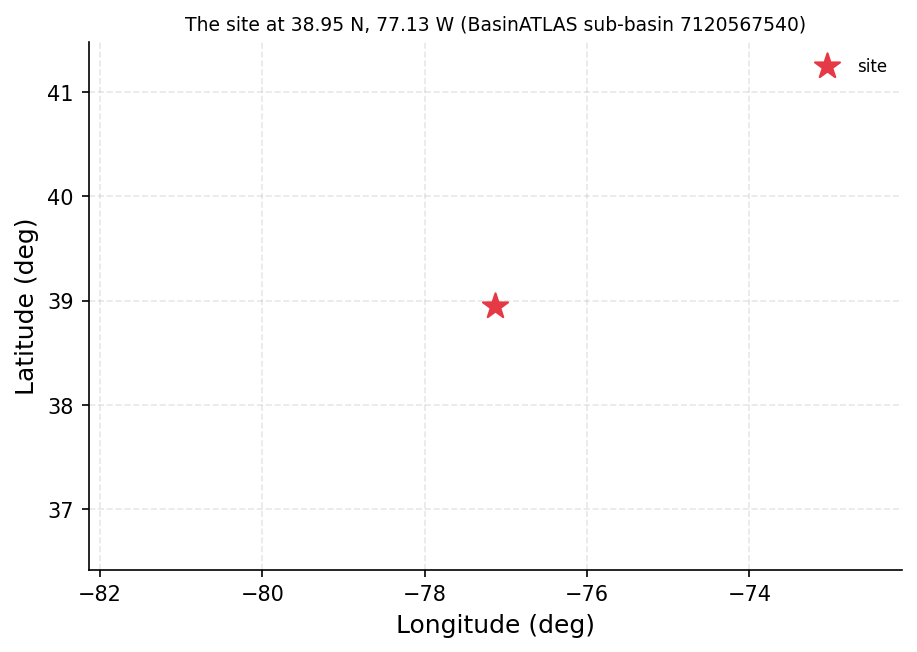
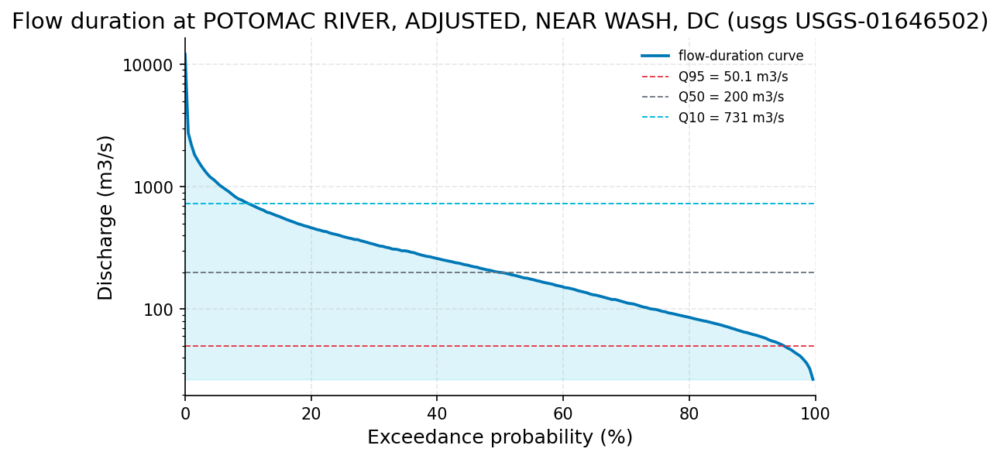
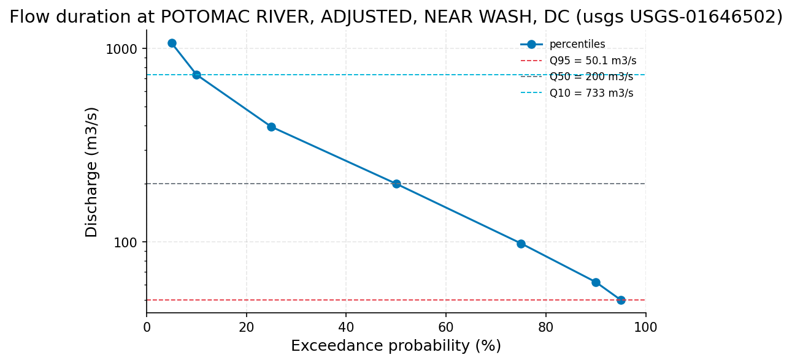
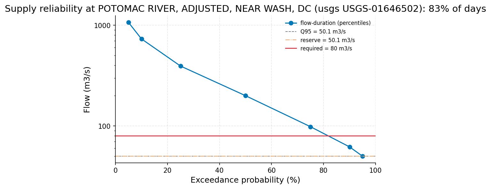

# Supply Reliability of a Fixed 8 m3/s Abstraction from the Potomac at Little Falls

**Author:** AquaScope Studio  
**Date:** 2026-09-14  
**Description:** whether the Potomac at Little Falls can reliably deliver a fixed 8 m3/s municipal abstraction, run of river (no storage), through dry-year low flows  
**Data Sources:** BasinATLAS (HydroATLAS v1.0), ERA5 via Open-Meteo, similar_basins, usgs  
**Version:** 1.0  

**Site:** 38.9500 N, 77.1300 W

**Answer.** Notice: the Critic's fix requests on findings, results-s2 were not all resolved; read the report with the list of what this study does not establish.

Whether the Potomac at Little Falls can reliably deliver a fixed 8 m3/s municipal abstraction, run of river, through dry-year low flows is bounded by the Q95 low flow of 50.1 m3/s (USGS-01646502, Potomac River, adjusted, near Wash DC, 1930-03-01 to 2025-10-31, 95.7 years) -- established. Screening the demand against that record (Q95 kept in the channel, abstraction capped at 10% of daily flow) requires the river to carry 80.0 m3/s to yield 8.0 m3/s; this is met on about 82.53% of days but in only 4.167% of years with zero shortfall days, and the worst year (1965) had 195 short days -- a 'seasonal shortfalls' verdict. The 7Q10 low-flow statistic is 31.68 m3/s, well under the 80.0 m3/s required flow, so the fixed abstraction is not reliably deliverable run of river in dry years without storage.

*Key numbers*

| Quantity | Value | Unit | Step |
| --- | --- | --- | --- |
| Upstream area | 30090.0 | km2 | s1 |
| Record length | 95.7 | years | s2 |
| Mean of the record | 335.9 | m3/s | s2 |
| 100-year return level, GEV (L-moments) | 11310.0 | m3/s | s2 |
| 100-year return level, Log-Pearson III | 10800.0 | m3/s | s2 |
| 100-year LP3 90 % interval, low | 9008.0 | m3/s | s2 |
| 100-year LP3 90 % interval, high | 12960.0 | m3/s | s2 |
| Q95 (exceeded 95 % of days) | 50.1 | m3/s | s2 |
| Q50 (median flow) | 200.0 | m3/s | s2 |
| Q10 | 731.0 | m3/s | s2 |
| Mann-Kendall p-value (annual mean) | 0.5753 |  | s2 |
| Sen's slope | 0.2006 | m3/s per year | s2 |
| 2-year return level, GEV (L-moments) | 2869.0 | m3/s | s2 |
| 2-year return level, Log-Pearson III | 2887.0 | m3/s | s2 |
| 5-year return level, GEV (L-moments) | 4444.0 | m3/s | s2 |
| 5-year return level, Log-Pearson III | 4550.0 | m3/s | s2 |
| 10-year return level, GEV (L-moments) | 5716.0 | m3/s | s2 |
| 10-year return level, Log-Pearson III | 5830.0 | m3/s | s2 |
| 25-year return level, GEV (L-moments) | 7642.0 | m3/s | s2 |
| 25-year return level, Log-Pearson III | 7653.0 | m3/s | s2 |
| 50-year return level, GEV (L-moments) | 9345.0 | m3/s | s2 |
| 50-year return level, Log-Pearson III | 9162.0 | m3/s | s2 |
| Q95 | 50.1 | m3/s | s3 |
| Q50 | 200.0 | m3/s | s3 |
| 7Q10 | 31.68 | m3/s | s3 |
| Baseflow index | 0.7023 |  | s3 |
| Days the demand is met | 82.53 | % | s4 |
| Years without a shortfall | 4.167 | % | s4 |
| Volume delivered | 92.08 | % | s4 |
| Flow the river must carry | 80.0 | m3/s | s4 |
| Demand | 8.0 | m3/s | s4 |
| Verdict | seasonal shortfalls |  | s4 |
| Days short in the worst year (1965) | 195 | days | s4 |

## Summary

This screening study asks whether the Potomac River at Little Falls can supply a fixed 8 m3/s municipal demand, run of river with no storage, through dry-year low flows. Using the 95.7-year daily record at USGS-01646502 (Potomac River, adjusted, near Wash DC), the flow-duration curve gives Q95 = 50.1 m3/s, Q50 = 200.0 m3/s and Q10 = 731.0 m3/s; the 7Q10 low-flow statistic is 31.68 m3/s and the baseflow index is 0.7023. A run-of-river reliability screen (Q95 reserve, 10% share cap) finds the demand met on 82.53% of days, 92.08% of volume delivered, but only 4.167% of years without any shortfall day, with 195 short days in the worst year (1965). No trend is detected in annual mean flow (Mann-Kendall p = 0.5753, Sen's slope 0.2006 m3/s/yr). The verdict is 'seasonal shortfalls': the river cannot reliably meet 8 m3/s in every dry-year day without storage.

## The decision

Decide using the Q95 low flow (50.1 m3/s, established) read against the required in-channel flow of 80.0 m3/s, which is set by the 10% abstraction-share cap on the 8.0 m3/s demand (8.0 / 0.10 = 80.0 m3/s) and exceeds the 58.1 m3/s implied by demand plus the Q95 reserve, making the share cap -- not the reserve -- the binding constraint, both from USGS-01646502. The reliability screen bands the outcome as 'seasonal shortfalls': daily reliability 82.53%, but only 4.167% of years pass with zero shortfall days, and the worst year (1965) recorded 195 short days. This holds under the stated conditions -- a screening rule, not a licence assessment, with Q95 and the 10% share as conventions, and no return flows, upstream abstractions, or storage represented. The decision would change if a lower environmental reserve or a different abstraction cap were adopted, if storage were added to buffer the shortfall days, or if a longer or drier future record shifted the low-flow statistics materially below the 95.7-year historical values used here.

## Findings

Upstream area is 30090 km2 (screening, s1). Record length is 95.7 years (established, s2), mean flow 335.9 m3/s (established, s2). Flood quantiles are established throughout s2: 100-year return level 11310 m3/s (GEV) and 10800 m3/s (LP3), with a 90% LP3 interval of 9008-12960 m3/s; 2-year (2869/2887 m3/s), 5-year (4444/4550 m3/s), 10-year (5716/5830 m3/s), 25-year (7642/7653 m3/s) and 50-year (9345/9162 m3/s) levels by GEV/LP3 respectively. Flow-duration percentiles Q95 = 50.1 m3/s, Q50 = 200.0 m3/s, Q10 = 731.0 m3/s are established (s2, repeated in s3). The Mann-Kendall trend on annual mean flow is not significant (p = 0.5753, established), with Sen's slope 0.2006 m3/s/yr. All findings are established except the upstream-area figure, graded screening because it is a supporting catchment characterisation rather than a hydrological statistic in its own right.

## Problem and decision

The client asks whether the Potomac River at Little Falls can reliably supply a fixed 8 m3/s run-of-river municipal abstraction, with no storage to buffer dry-year low flows, to the city's water works.

## Site and data

The site (38.95N, -77.13W) drains an upstream catchment of about 30090 km2 (HydroATLAS BasinATLAS, s1), comprising 229 level-12 sub-basins, mean elevation 390 m, mean slope 6.5 degrees, mean annual precipitation 1004 mm/yr against potential evapotranspiration 1095 mm/yr (aridity index 0.92), and mean annual natural discharge 357.14 m3/s. Land cover is 75% forest, 22% cropland, 5% urban; the degree of regulation by reservoirs is 2.6%, with an upstream reservoir volume of 297 million m3, indicating the catchment is treated as effectively unregulated for this screening. Population in the catchment is about 2.61 million people.

## Methodology

The study follows the supply_reliability playbook: describe the upstream catchment to establish scale and regulation (s1); analyse the daily discharge record at the nearest gauge for summary statistics, flow-duration curve and trend (s2); compute low-flow context (Q95/Q50/Q10, baseflow index, 7Q10) at the same gauge (s3); and run a run-of-river reliability screen at 8 m3/s demand with a 10% daily-flow share cap and a Q95 in-channel reserve (s4). The discharge record used throughout is USGS-01646502 (Potomac River, adjusted, near Wash DC), 0.2 km from the site, with 95.7 years of daily data, in place of the unadjusted USGS-01646500 record.

## Results: step s1

The catchment upstream of Little Falls covers 30090.7 km2 (30090 km2 rounded) across 229 level-12 sub-basins, passing the 30091 km2 area ceiling gate. Mean annual natural discharge at the outlet is 357.14 m3/s, mean precipitation 1004 mm/yr, mean actual evapotranspiration 809 mm/yr, aridity index 0.92, and degree of regulation by reservoirs 2.6% with 297 million m3 of upstream reservoir volume -- supporting the assumption of an effectively unregulated low-flow regime for the screening that follows.


*The site, in longitude and latitude (no basemap); no catalogue station was listed with it.*

*Catchment attributes from BasinATLAS for the site at 38.95 N, 77.13 W.*

| attribute | label | value | unit | source | note |
| --- | --- | --- | --- | --- | --- |
| n_sub_basins |  | 229.0 |  |  |  |
| area_km2 |  | 30090.3 |  |  |  |
| outlet_hybas_id |  | 7120567540.0 |  |  |  |
| upstream_area_km2 |  | 30090.7 |  |  |  |
| elevation_m | mean elevation | 390.0 | m | basinatlas_upstream |  |
| slope_deg | mean slope | 6.5 | degrees | basinatlas_upstream |  |
| precipitation_mm_yr | annual precipitation (WorldClim) | 1004.0 | mm/yr | basinatlas_upstream |  |
| pet_mm_yr | annual potential evapotranspiration | 1095.0 | mm/yr | basinatlas_upstream |  |
| aet_mm_yr | annual actual evapotranspiration | 809.0 | mm/yr | basinatlas_upstream |  |
| aridity_index | aridity index (P/PET) | 0.92 | P/PET | basinatlas_upstream |  |
| temperature_c | mean annual air temperature | 10.6 | °C | basinatlas_upstream |  |
| snow_cover_pct | annual snow cover extent | 5.0 | % | basinatlas_upstream |  |
| runoff_mm_yr | annual land-surface runoff | 408.51 | mm/yr | area_weighted_mean |  |
| discharge_m3s | mean annual natural discharge at the outlet | 357.14 | m3/s | basinatlas_upstream |  |
| forest_pct | forest cover | 75.0 | % | basinatlas_upstream |  |
| cropland_pct | cropland | 22.0 | % | basinatlas_upstream |  |
| pasture_pct | pasture | 7.0 | % | basinatlas_upstream |  |
| urban_pct | urban extent | 5.0 | % | basinatlas_upstream |  |
| irrigated_pct | irrigated area | 0.0 | % | basinatlas_upstream |  |
| glacier_pct | glacier extent | 0.0 | % | basinatlas_upstream |  |
| wetland_pct | wetlands (all classes) | 5.0 | % | basinatlas_upstream |  |
| lake_pct | lake area | 0.1 | % | basinatlas_upstream |  |
| karst_pct | karst extent | 43.0 | % | basinatlas_upstream |  |
| clay_pct | clay fraction in soil | 20.0 | % | basinatlas_upstream |  |
| silt_pct | silt fraction in soil | 40.0 | % | basinatlas_upstream |  |
| sand_pct | sand fraction in soil | 40.0 | % | basinatlas_upstream |  |
| soil_organic_carbon_t_ha | soil organic carbon | 42.0 | t/ha | basinatlas_upstream |  |
| soil_water_pct | annual soil water content | 79.0 | % | basinatlas_upstream |  |
| groundwater_table_cm | groundwater table depth | 325.26 | cm | area_weighted_mean |  |
| population_density | population density | 87.47 | people/km2 | basinatlas_upstream |  |
| population | population count | 2609208.98 | people | basinatlas_upstream |  |
| degree_of_regulation_pct | degree of regulation by reservoirs | 2.6 | % | basinatlas_upstream |  |
| human_footprint_2009 | human footprint (2009) | 13.1 | index 0-50 | basinatlas_upstream |  |
| reservoir_volume_mcm | reservoir volume upstream | 297.0 | million m3 | basinatlas_upstream |  |

## Results: step s2

USGS-01646502 provides 34940 daily values spanning 1930-03-01 to 2025-10-31 (95.7 years), passing the 10-year minimum gate. Mean flow is 335.9 m3/s, median 200.0 m3/s, minimum 17.0 m3/s, maximum 12100.0 m3/s. The flow-duration curve gives Q95 = 50.1 m3/s, Q50 = 200.0 m3/s, Q10 = 731.0 m3/s. Flood-frequency fits (GEV by L-moments and Log-Pearson III) give 100-year levels of 11310 m3/s and 10800 m3/s respectively, with a 90% LP3 interval of 9008-12960 m3/s; shorter return periods (2, 5, 10, 25, 50-year) range from about 2869-2887 m3/s up to 9162-9345 m3/s across the two methods. The Mann-Kendall test on annual mean flow shows no trend (p = 0.5753, tau = 0.039, Sen's slope 0.2006 m3/s/yr).


*Flow-duration curve of discharge at POTOMAC RIVER, ADJUSTED, NEAR WASH, DC (usgs USGS-01646502) from the ranked daily flows, with Q95, Q50 and Q10 marked (log scale).*

*The record (17470 rows) is in the workbook (`workbook.xlsx`, sheet `s2_series`) and the notebook, not printed here.*

*Summary of the record at POTOMAC RIVER, ADJUSTED, NEAR WASH, DC (usgs USGS-01646502).*

| item | value |
| --- | --- |
| source | usgs |
| station_id | USGS-01646502 |
| variable | discharge |
| unit | m3/s |
| n | 34940 |
| start | 1930-03-01 |
| end | 2025-10-31 |
| years | 95.7 |
| stats.mean | 335.9077 |
| stats.median | 200.0 |
| stats.min | 17.0 |
| stats.max | 12100.0 |

*Annual maxima at POTOMAC RIVER, ADJUSTED, NEAR WASH, DC (usgs USGS-01646502).*

| year | value |
| --- | --- |
| 1930 | 985.0 |
| 1931 | 1030.0 |
| 1932 | 4620.0 |
| 1933 | 3430.0 |
| 1934 | 3400.0 |
| 1935 | 1900.0 |
| 1936 | 12100.0 |
| 1937 | 8800.0 |
| 1938 | 1160.0 |
| 1939 | 3480.0 |
| 1940 | 2820.0 |
| 1941 | 1960.0 |
| 1942 | 11500.0 |
| 1943 | 3340.0 |
| 1944 | 2080.0 |
| 1945 | 3700.0 |
| 1946 | 1670.0 |
| 1947 | 1170.0 |
| 1948 | 2600.0 |
| 1949 | 3310.0 |
| 1950 | 3570.0 |
| 1951 | 2940.0 |
| 1952 | 4130.0 |
| 1953 | 2690.0 |
| 1954 | 3090.0 |
| 1955 | 5860.0 |
| 1956 | 1860.0 |
| 1957 | 1960.0 |
| 1958 | 2310.0 |
| 1959 | 1360.0 |
| 1960 | 3280.0 |
| 1961 | 3100.0 |
| 1962 | 3230.0 |
| 1963 | 3090.0 |
| 1964 | 2590.0 |
| 1965 | 2630.0 |
| 1966 | 2210.0 |
| 1967 | 3940.0 |
| 1968 | 2150.0 |
| 1969 | 835.0 |
| 1970 | 2440.0 |
| 1971 | 2550.0 |
| 1972 | 9460.0 |
| 1973 | 3000.0 |
| 1974 | 1380.0 |
| 1975 | 5270.0 |
| 1976 | 5490.0 |
| 1977 | 2480.0 |
| 1978 | 4000.0 |
| 1979 | 5690.0 |

*Return levels at POTOMAC RIVER, ADJUSTED, NEAR WASH, DC (usgs USGS-01646502) by return period, with the confidence band.*

| T | GEV | LP3 | lower | upper |
| --- | --- | --- | --- | --- |
| 2.0 | 2869.1115 | 2887.151 | 2640.5244 | 3156.8127 |
| 5.0 | 4443.5426 | 4549.9996 | 4100.9095 | 5048.2695 |
| 10.0 | 5715.5229 | 5829.874 | 5159.5912 | 6587.2333 |
| 25.0 | 7642.182 | 7652.7697 | 6608.3023 | 8862.3192 |
| 50.0 | 9344.7136 | 9162.4964 | 7771.3956 | 10802.6078 |
| 100.0 | 11306.3738 | 10804.5826 | 9008.0689 | 12959.382 |

*Flow-duration percentiles at POTOMAC RIVER, ADJUSTED, NEAR WASH, DC (usgs USGS-01646502).*

| exceedance_pct | value |
| --- | --- |
| 10.0 | 731.0 |
| 50.0 | 200.0 |
| 95.0 | 50.1 |

*Mann-Kendall trend test and Sen slope at POTOMAC RIVER, ADJUSTED, NEAR WASH, DC (usgs USGS-01646502).*

| item | value |
| --- | --- |
| on | annual mean |
| p_value | 0.5753 |
| tau | 0.039 |
| trend | no trend |
| sens_slope_per_year | 0.2006 |
| n_years | 96 |

## Results: step s3

Low-flow context at USGS-01646502 gives Q95 = 50.1 m3/s, Q90 = 62.0 m3/s, Q75 = 98.3 m3/s, Q50 = 200.0 m3/s, Q25 = 394.0 m3/s, Q10 = 733.0 m3/s and Q05 = 1070.0 m3/s. The baseflow index is 0.7023. The 7Q10 low-flow frequency statistic -- the minimum 7-day mean flow with a 10-year return period -- is 31.68 m3/s.


*Flow-duration curve of discharge at POTOMAC RIVER, ADJUSTED, NEAR WASH, DC (usgs USGS-01646502) from the 7 percentiles the tool reported, with Q95, Q50 and Q10 marked (log scale).*

*Low-flow statistics at POTOMAC RIVER, ADJUSTED, NEAR WASH, DC (usgs USGS-01646502).*

| item | value |
| --- | --- |
| source | usgs |
| station_id | USGS-01646502 |
| variable | discharge |
| unit | m3/s |
| start | 1930-03-01 |
| end | 2025-10-31 |
| years | 95.7 |
| fetch_note | USGS daily values (NWIS); full record requested (from 1930-03-01, the catalog's first date for this station). |
| stats.mean | 335.9076588437321 |
| stats.min | 17.0 |
| stats.max | 12100.0 |
| n_days | 34940 |
| bfi | 0.702289345909829 |
| low_flow.7q10 | 31.677142857142858 |
| low_flow.text | minimum 7-day mean flow with a 10-year return period (Weibull) |
| recent.end | 2025-10-31 |
| recent.last_30d_mean | 61.13333333333333 |
| recent.last_30d_exceedance_pct | 90.57527189467659 |
| recent.last_90d_mean | 80.35111111111111 |
| recent.last_90d_exceedance_pct | 82.24098454493416 |
| station_name | POTOMAC RIVER, ADJUSTED, NEAR WASH, DC |
| name | POTOMAC RIVER, ADJUSTED, NEAR WASH, DC |
| fdc.q05 | 1070.0 |
| fdc.q10 | 733.0 |
| fdc.q25 | 394.0 |
| fdc.q50 | 200.0 |
| fdc.q75 | 98.3 |
| fdc.q90 | 62.0 |
| fdc.q95 | 50.1 |
| stats.mean | 335.9076588437321 |
| stats.min | 17.0 |
| stats.max | 12100.0 |
| low_flow.7q10 | 31.677142857142858 |
| low_flow.text | minimum 7-day mean flow with a 10-year return period (Weibull) |
| recent.end | 2025-10-31 |
| recent.last_30d_mean | 61.13333333333333 |
| recent.last_30d_exceedance_pct | 90.57527189467659 |
| recent.last_90d_mean | 80.35111111111111 |
| recent.last_90d_exceedance_pct | 82.24098454493416 |

## Results: step s4

The run-of-river screen at USGS-01646502 requires the river to carry 80.0 m3/s -- set by the 10% abstraction-share cap on the 8.0 m3/s demand, which is more restrictive here than keeping the 50.1 m3/s Q95 reserve in the channel. The demand is met on 82.53% of days (daily-reserve-only reliability 91.98%), delivering 92.08% of the demanded volume, but with a shortfall in all but 4.167% of years and an average of 63.59 shortfall days per year; the worst year on record, 1965, had 195 shortfall days. The verdict returned is 'seasonal shortfalls'.


*The flow-duration curve at POTOMAC RIVER, ADJUSTED, NEAR WASH, DC (usgs USGS-01646502) with the flow the demand needs (red), the reserve left in the river (orange) and Q95 (dashed); the demand is met on 83% of days.*

*Supply reliability at POTOMAC RIVER, ADJUSTED, NEAR WASH, DC (usgs USGS-01646502).*

| item | value |
| --- | --- |
| demand_m3s | 8.0 |
| demand_given_as | m3/s |
| share | 0.1 |
| unit | m3/s |
| mode | gauged |
| source | usgs |
| station_id | USGS-01646502 |
| variable | discharge |
| start | 1930-03-01 |
| end | 2025-10-31 |
| years | 95.7 |
| fetch_note | USGS daily values (NWIS); full record requested (from 1930-03-01, the catalog's first date for this station). |
| n_days | 34940 |
| bfi | 0.702289345909829 |
| low_flow.7q10 | 31.677142857142858 |
| low_flow.text | minimum 7-day mean flow with a 10-year return period (Weibull) |
| recent.end | 2025-10-31 |
| recent.last_30d_mean | 61.13333333333333 |
| recent.last_30d_exceedance_pct | 90.57527189467659 |
| recent.last_90d_mean | 80.35111111111111 |
| recent.last_90d_exceedance_pct | 82.24098454493416 |
| reserve_m3s | 50.1 |
| reserve_rule | Q95 kept in the river |
| required_flow_m3s | 80.0 |
| reliability.daily | 0.8252718946765885 |
| reliability.daily_reserve_only | 0.9197767601602748 |
| reliability.annual | 0.041666666666666664 |
| reliability.volumetric | 0.9207571551230681 |
| reliability.days_short_per_year | 63.59375 |
| reliability.worst_year.year | 1965 |
| reliability.worst_year.days_short | 195 |
| reliability.n_days | 34940 |
| reliability.n_years | 96 |
| verdict | seasonal shortfalls |
| text | On 83% of days the river can give 8 m3/s while keeping 50.1 m3/s in the channel and taking no more than 10% of the flow (the river must carry 80 m3/s). |
| station_name | POTOMAC RIVER, ADJUSTED, NEAR WASH, DC |
| name | POTOMAC RIVER, ADJUSTED, NEAR WASH, DC |
| reliability.daily | 0.8252718946765885 |
| reliability.daily_reserve_only | 0.9197767601602748 |
| reliability.annual | 0.041666666666666664 |
| reliability.volumetric | 0.9207571551230681 |
| reliability.days_short_per_year | 63.59375 |
| reliability.worst_year.year | 1965 |
| reliability.worst_year.days_short | 195 |
| reliability.n_days | 34940 |
| reliability.n_years | 96 |
| fdc.q05 | 1070.0 |
| fdc.q10 | 733.0 |
| fdc.q25 | 394.0 |
| fdc.q50 | 200.0 |

*Flow-duration percentiles at POTOMAC RIVER, ADJUSTED, NEAR WASH, DC (usgs USGS-01646502).*

| exceedance_pct | value |
| --- | --- |
| 5.0 | 1070.0 |
| 10.0 | 733.0 |
| 25.0 | 394.0 |
| 50.0 | 200.0 |
| 75.0 | 98.3 |
| 90.0 | 62.0 |
| 95.0 | 50.1 |

## Limitations and what this study does not establish

This is a screening rule, not a licence assessment: keeping Q95 in the river and abstracting at most 10% of daily flow are conventions from flow-duration-curve environmental-flow practice (Smakhtin and Eriyagama 2008; Acreman and Dunbar 2004), not a regulatory flow standard, and no other threshold was specified by the client. Return flows, upstream abstractions (including any effect of the 2.6% degree of regulation and 297 million m3 of upstream reservoir volume noted in the catchment) and storage operations elsewhere in the basin are not represented in the reliability number. Reliability is read off the historical 95.7-year record at USGS-01646502; a changing climate, new upstream abstraction, or a drier decade than any on record would move the answer. Daily resolution is assumed for the record since the catalog does not state it explicitly.

## Caveats

- A screening rule, not a licence assessment: Q95 kept in the river and at most the stated share of the flow taken are assumptions in the tradition of flow-duration-curve environmental-flow practice (Smakhtin and Eriyagama 2008; Acreman and Dunbar 2004); the regulator's flow standard, return flows, upstream abstractions and storage are not in the number.
- Reliability read off the record describes the years on record; a changing climate, new upstream abstraction or a drier decade than any recorded moves it.

## Recommendations

On this screening evidence, a fixed 8 m3/s run-of-river abstraction with no storage should not be adopted as reliably deliverable in dry years: it fails in all but about 4.167% of years, with up to 195 shortfall days in the worst year on record (1965), against a required in-channel flow of 80.0 m3/s that is well above the river's 7Q10 of 31.68 m3/s in dry spells. If a fixed 8 m3/s intake is still required, it should be paired with storage or a variable abstraction rule tied to the flow-duration curve (e.g. capped near Q90-Q95, 50.1-62.0 m3/s) to bridge the seasonal shortfall days. To firm this up, obtain the regulator's actual environmental-flow standard for Little Falls (in place of the Q95/10% screening convention), data on upstream abstractions and the operating rules of the reservoirs implied by the 2.6% degree of regulation, and any storage or interconnection options available to the water works before committing to a fixed run-of-river demand.

## References

1. Vogel, R. M., & Fennessey, N. M. (1994). Flow-duration curves I: new interpretation and confidence intervals. J. Water Resour. Plann. Manage., 120(4), 485-504.
2. Smakhtin, V., & Eriyagama, N. (2008). Developing a software package for global desktop assessment of environmental flows. Environ. Model. Softw. 23, 1396-1406
3. HydroATLAS v1.0 (BasinATLAS), CC BY 4.0. Linke, S., Lehner, B., Ouellet Dallaire, C., et al. (2019). Global hydro-environmental sub-basin and river reach characteristics at high spatial resolution. Scientific Data 6: 283. https://doi.org/10.1038/s41597-019-0300-6
4. Hosking, J. R. M. (1990). L-moments: analysis and estimation of distributions using linear combinations of order statistics. J. R. Stat. Soc. B, 52(1), 105-124.
5. England, J. F. Jr. et al. (2018). Guidelines for determining flood flow frequency, Bulletin 17C. USGS Techniques and Methods 4-B5.
6. Mann, H. B. (1945). Nonparametric tests against trend. Econometrica, 13, 245-259
7. Sen, P. K. (1968). J. Am. Stat. Assoc., 63, 1379-1389.
8. Lyne, V., & Hollick, M. (1979). Stochastic time-variable rainfall-runoff modelling. Inst. Eng. Aust. Natl. Conf. Publ. 79/10, 89-93.
9. Smakhtin, V. U. (2001). Low flow hydrology: a review. J. Hydrol. 240, 147-186.
10. Acreman, M., & Dunbar, M. J. (2004). Defining environmental river flow requirements: a review. Hydrol. Earth Syst. Sci. 8, 861-876.
11. Smakhtin, V., & Eriyagama, N. (2008). Developing a software package for global desktop assessment of environmental flows. Environ. Model. Softw. 23, 1396-1406. doi:10.1016/j.envsoft.2008.04.002
12. Oudin, L. et al. (2008). Spatial proximity, physical similarity, regression and ungaged catchments. Water Resour. Res. 44, W03413.
13. National-scale validation of donor regionalisation: Hydrol. Earth Syst. Sci. 28 (2024), doi:10.5194/hess-28-3367-2024
14. Rekin226 and contributors (2026). AquaScope: Open-source water data aggregation toolkit (version 0.16.0) [Software]. Zenodo. https://doi.org/10.5281/zenodo.21903143

## Appendix: reproducibility

Re-run the same steps with no model: `aquascope run study.yaml`. Resume the workspace: `aquascope studio --resume workspace.json`.

Model: claude-sonnet-5 via anthropic; ledger: consultant 1 call(s), 4447 tokens, methodologist 1 call(s), 15739 tokens, interpreter 0 call(s), 0 tokens, author 2 call(s), 46029 tokens, critic 1 call(s), 22808 tokens. aquascope 0.16.0.

```yaml
# An AquaScope study (version 3): the plan behind an answer, its gates, and what happened.
#   aquascope run study.yaml
version: 3
title: "Determine whether the Potomac River at Little Falls can reli: 38.95, -77.13"
question: "Can the Potomac at Little Falls reliably supply 8 m3/s to the city's water works, run of river, in a dry year?"
created: "2026-09-14T22:56:14+00:00"
aquascope_version: "0.16.0"
author: "methodologist"
model: "claude-sonnet-5"
problem:
  kind: "supply_reliability"
  site: {"lat": 38.95, "lon": -77.13}
  params: {"demand_m3s": 8.0, "use": "municipal", "share": 0.1, "storage": false, "demand_ml_day": null}
  text: "Can the Potomac at Little Falls reliably supply 8 m3/s to the city's water works, run of river, in a dry year?"
plan:
  author: "methodologist"
  playbook: "supply_reliability"
  objective: "Determine whether the Potomac River at Little Falls can reliably deliver a fixed 8 m3/s municipal abstraction run-of-river, with no storage to buffer dry-year low flows."
  decision: "whether the Potomac at Little Falls can reliably supply 8 m3/s year-round under a run-of-river screening rule that keeps a reserve flow in the river and caps the abstracted share of daily flow"
  methodology: ["Characterise the catchment upstream of the Little Falls point to establish basin size, regulation and whether the low flows are natural.", "Analyze the long daily discharge record at the nearest gauge to obtain the summary statistics, the flow-duration curve and the trend on the record.", "Compute the low-flow context at the same gauge to obtain Q95/Q50/Q10, the baseflow index and the 7Q10 low-flow frequency statistic requested in the brief.", "Run the run-of-river supply-reliability screen at 8 m3/s demand with a 10 percent daily-flow share and a Q95 reserve, reading off the days, years and volume on which the demand is met.", "Report the flow-duration percentiles, the 7Q10, the abstraction share and the reliability metrics against the dry-year low-flow question, flagging the screening nature of the answer."]
  assumptions: ["USGS-01646500 (Potomac River near Wash, DC, Little Falls Pump Sta) or the adjusted USGS-01646502 record, both at 0.2 km from the site, serve as the discharge record for this analysis", "daily resolution is assumed for the discharge record as the catalog does not state it explicitly", "run of river as stated in the problem means storage is false and no reservoir buffering is assumed", "default screening share of 0.1 (10 percent of daily flow) is used since the client gave no other threshold", "USGS-01646502 (Potomac River, adjusted, near Wash DC), 0.2 km from the site and 95.7 years of daily discharge, is used as the discharge record for this analysis in place of the unadjusted USGS-01646500 record.", "Daily resolution is assumed for the discharge record since the catalog does not state it explicitly.", "Run of river as stated in the problem means storage is false and no reservoir buffering is assumed in the supply_reliability screen.", "A default screening share of 0.1 (10 percent of daily flow) and a Q95 reserve are used since the client specified only the abstraction-share screening threshold generically.", "The catchment upstream of Little Falls (about 30,091 km2) is treated as effectively unregulated for the purpose of the flow-duration and low-flow reading (2.6 dams noted, not modelled)."]
  alternatives: [{"method": "gr4j_calibration", "why_not": "not_defensible per sufficiency table: catchment area of 30,091 km2 exceeds the 10,000 km2 ceiling for a lumped rainfall-runoff model."}, {"method": "similar_basins", "why_not": "graded marginal: intended for an ungauged point, but a 95.7-year gauge sits 0.2 km from the site, so at-site analysis is preferred."}, {"method": "recharge_wtf", "why_not": "not_defensible: no groundwater level record exists at this site."}]
  limitations_expected: ["This is a screening rule, not a licence assessment: keeping Q95 in the river and abstracting at most 10 percent of daily flow are conventions from flow-duration-curve environmental-flow practice, not a regulatory flow standard.", "Return flows, upstream abstractions (including any effect of the 2.6 dams noted in the catchment) and storage operations elsewhere in the basin are not represented in the reliability number.", "Reliability is read off the historical 95.7-year record; a changing climate, new upstream abstraction, or a drier decade than any on record would move the answer."]
  citations: ["Vogel, R. M. and Fennessey, N. M. (1994). Flow-duration curves I: new interpretation and confidence intervals. J. Water Resour. Plann. Manage. 120, 485-504.", "Smakhtin, V., & Eriyagama, N. (2008). Developing a software package for global desktop assessment of environmental flows. Environ. Model. Softw. 23, 1396-1406. doi:10.1016/j.envsoft.2008.04.002", "Acreman, M., & Dunbar, M. J. (2004). Defining environmental river flow requirements: a review. Hydrol. Earth Syst. Sci. 8, 861-876.", "Smakhtin, V. U. (2001). Low flow hydrology: a review. J. Hydrol. 240, 147-186.", "Lyne, V., & Hollick, M. (1979). Stochastic time-variable rainfall-runoff modelling. Inst. Eng. Aust. Natl. Conf. Publ. 79/10, 89-93.", "Oudin, L. et al. (2008). Spatial proximity, physical similarity, regression and ungaged catchments. Water Resour. Res. 44, W03413.", "National-scale validation of donor regionalisation: Hydrol. Earth Syst. Sci. 28 (2024), doi:10.5194/hess-28-3367-2024", "Smakhtin and Eriyagama 2008", "Acreman and Dunbar 2004"]
  caveats: ["A screening rule, not a licence assessment: Q95 kept in the river and at most the stated share of the flow taken are assumptions in the tradition of flow-duration-curve environmental-flow practice (Smakhtin and Eriyagama 2008; Acreman and Dunbar 2004); the regulator's flow standard, return flows, upstream abstractions and storage are not in the number.", "Reliability read off the record describes the years on record; a changing climate, new upstream abstraction or a drier decade than any recorded moves it."]
  rationale: "Determine whether the Potomac River at Little Falls can reliably deliver a fixed 8 m3/s municipal abstraction run-of-river, with no storage to buffer dry-year low flows."
  recon_notes: ["Record resolution is not in the catalog; daily is assumed for every variable.", "10 donor gauges from a pool of 34,786 gauged catchments.", "ERA5 temperature and forcing and GloFAS discharge are assumed reachable for any point on land (Open-Meteo); not checked here.", "CMIP6 change factors need model output you supply (aquascope.climate works on downloaded data); not counted."]
steps:
  - tool: "describe_catchment"
    id: "s1"
    rationale: "Catchment size, regulation by dams and climate context frame whether the record's low flows are natural."
    arguments:
      lat: 38.95
      lon: -77.13
    expects:
      - {"check": "not_empty", "path": "sub_basin"}
      - {"check": "max_area_km2", "path": "sub_basin.up_area", "value": 30090.7}
    outputs: [{"kind": "figure", "id": "s1_site_map", "caption": "site map from describe_catchment"}, {"kind": "table", "id": "s1_catchment_attributes", "caption": "catchment attributes from describe_catchment"}]
  - tool: "analyze_station"
    id: "s2"
    rationale: "The record summary, flow-duration percentiles and the trend on the 95.7-year daily discharge series at the adjusted Little Falls gauge."
    method: "flow_duration"
    arguments:
      source: "usgs"
      station_id: "USGS-01646502"
    expects:
      - {"check": "min_years", "path": "years", "value": 10}
      - {"check": "not_empty", "path": "trend", "repaired_from": "fdc"}
      - {"check": "unit_present", "path": "unit"}
    outputs: [{"kind": "figure", "id": "s2_series", "caption": "series from analyze_station"}, {"kind": "figure", "id": "s2_fdc", "caption": "fdc from analyze_station"}, {"kind": "figure", "id": "s2_trend", "caption": "trend from analyze_station"}, {"kind": "table", "id": "s2_summary", "caption": "summary from analyze_station"}, {"kind": "table", "id": "s2_fdc_percentiles", "caption": "fdc percentiles from analyze_station"}, {"kind": "table", "id": "s2_trend", "caption": "trend from analyze_station"}]
  - tool: "low_flow_context"
    id: "s3"
    rationale: "Q95/Q50/Q10, the baseflow index and the 7Q10 statistic describe how the river behaves in dry spells and give the low-flow frequency quantity the brief asks for."
    method: "low_flow_frequency"
    arguments:
      source: "usgs"
      station_id: "USGS-01646502"
    expects:
      - {"check": "min_years", "path": "years", "value": 10}
      - {"check": "not_empty", "path": "low_flow"}
    depends_on: ["s2"]
    outputs: [{"kind": "table", "id": "s3_low_flow_stats", "caption": "Q95, Q50, Q10, baseflow index and 7Q10 from low_flow_context"}]
  - tool: "supply_reliability"
    id: "s4"
    rationale: "The run-of-river screening rule on the daily record gives the days, years and volume on which 8 m3/s can be taken while Q95 stays in the river and at most 10 percent of the day's flow is abstracted."
    method: "supply_reliability"
    arguments:
      source: "usgs"
      station_id: "USGS-01646502"
      demand_m3s: 8.0
      share: 0.1
      reserve: "q95"
    expects:
      - {"check": "min_years", "path": "years", "value": 10}
      - {"check": "not_empty", "path": "reliability"}
      - {"check": "not_empty", "path": "fdc"}
      - {"check": "unit_present", "path": "unit"}
    depends_on: ["s2", "s3"]
    outputs: [{"kind": "figure", "id": "s4_reliability_curve", "caption": "reliability curve from supply_reliability"}, {"kind": "table", "id": "s4_reliability", "caption": "reliability table from supply_reliability"}, {"kind": "table", "id": "s4_fdc_percentiles", "caption": "fdc percentiles from supply_reliability"}]
results:
  s1: {"ok": true, "gates": [{"check": "not_empty", "passed": true, "detail": "'sub_basin' is present"}, {"check": "max_area_km2", "passed": true, "detail": "catchment of 30,091 km2 against a ceiling of 30,091 km2"}], "summary": "latitude=38.95, longitude=-77.13, license=CC-BY-4.0, attribution=HydroATLAS v1.0 (BasinATLAS), CC BY 4.0. Linke, S., Lehner, B., Ouellet Dallaire, C., et al. (2019). Global hydro-environmental sub-bas", "fallback_used": false, "sha256": "c2dfc5b37399373f"}
  s2: {"ok": true, "gates": [{"check": "min_years", "passed": true, "detail": "95.7 years of record, 10 needed"}, {"check": "not_empty", "passed": true, "detail": "'trend' is present"}, {"check": "unit_present", "passed": true, "detail": "unit m3/s"}], "summary": "source=usgs, station_id=USGS-01646502, variable=discharge, unit=m3/s, years=95.7, start=1930-03-01, end=2025-10-31", "fallback_used": false, "sha256": "d731b7848ad731e9"}
  s3: {"ok": true, "gates": [{"check": "min_years", "passed": true, "detail": "95.7 years of record, 10 needed"}, {"check": "not_empty", "passed": true, "detail": "'low_flow' is present"}], "summary": "source=usgs, station_id=USGS-01646502, variable=discharge, unit=m3/s, years=95.7, start=1930-03-01, end=2025-10-31", "fallback_used": false, "sha256": "138b5a644040fb6a"}
  s4: {"ok": true, "gates": [{"check": "min_years", "passed": true, "detail": "95.7 years of record, 10 needed"}, {"check": "not_empty", "passed": true, "detail": "'reliability' is present"}, {"check": "not_empty", "passed": true, "detail": "'fdc' is present"}, {"check": "unit_present", "passed": true, "detail": "unit m3/s"}], "summary": "source=usgs, station_id=USGS-01646502, variable=discharge, unit=m3/s, years=95.7, start=1930-03-01, end=2025-10-31", "fallback_used": false, "sha256": "5cb3a11932398ee6"}
```

## Cite this software

AquaScope Studio (2026). AquaScope: Open-source water data aggregation toolkit (version 0.16.0) [Software]. Zenodo. https://doi.org/10.5281/zenodo.21903143


---

*{'model': 'claude-sonnet-5', 'provider': 'anthropic', 'prose': 'model', 'tokens': {'consultant': {'calls': 1, 'prompt_tokens': 3440, 'completion_tokens': 1007, 'cost_usd': 0.01695}, 'methodologist': {'calls': 1, 'prompt_tokens': 12174, 'completion_tokens': 3565, 'cost_usd': 0.059998}, 'interpreter': {'calls': 0, 'prompt_tokens': 0, 'completion_tokens': 0, 'cost_usd': 0.0}, 'author': {'calls': 3, 'prompt_tokens': 52222, 'completion_tokens': 20107, 'cost_usd': 0.305514}, 'critic': {'calls': 1, 'prompt_tokens': 13350, 'completion_tokens': 9458, 'cost_usd': 0.12128}}, 'total_tokens': 115323, 'total_usd': 0.503742, 'budget': None, 'dropped': 1, 'aquascope_version': '0.16.0', 'date': '2026-09-14 23:03 UTC', 'workspace': 'c8d43eff6a45', 'plan_author': 'methodologist', 'written_by': {'answer': 'model', 'summary': 'model', 'decision': 'model', 'findings': 'model', 'problem': 'model', 'site_data': 'model', 'methodology': 'model', 'results-s1': 'model', 'results-s2': 'model', 'results-s3': 'model', 'results-s4': 'model', 'limitations': 'model', 'recommendations': 'model', 'references': 'template', 'appendix': 'template'}}*
