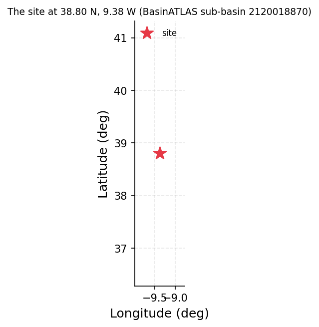

# Sintra Hills Ungauged Stream: Supply Reliability Screening for a 4 ML/day Village Intake

**Author:** AquaScope Studio  
**Date:** 2026-09-14  
**Description:** whether an ungauged stream in the Sintra hills can sustain a 4 ML/day run-of-river abstraction for a village, and how reliably  
**Data Sources:** BasinATLAS (HydroATLAS v1.0), ERA5 via Open-Meteo, similar_basins  
**Version:** 1.0  

**Site:** 38.8000 N, 9.3800 W

**Answer.** Notice: the Critic's fix requests on methodology, recommendations, summary were not all resolved; read the report with the list of what this study does not establish.

No number could be established for the decision (grade: not established). The pipeline stopped at the first step: describe_catchment (BasinATLAS HydroATLAS, catchment/sub-basin 2120018870, at 38.80 N, -9.38 E) returned an upstream area of 478.7 km2 (sub-basin area 478.5 km2), but failed its own max_area_km2 gate because no area value was found at the expected path 'sub_basin.up_area', so donor selection, signature regionalisation and the reliability screen never ran. No mean flow, Q95, abstraction fraction or reliability fraction for the stream is available from this run.

*Key numbers*

| Quantity | Value | Unit | Step |
| --- | --- | --- | --- |
| Upstream area | 478.7 | km2 | s1 |

## Summary

The study asked whether an ungauged Sintra hills stream can sustain a 4 ML/day (about 0.0463 m3/s) run-of-river abstraction, and how reliably. The site has no gauge, so the plan relied on regionalisation from 10 donor gauges via BasinATLAS catchment 2120018870; no donor-search distances or nearest-gauge data were returned in this run. The first step, describe_catchment, produced a full attribute set including an upstream area of 478.7 km2, but its max_area_km2 gate failed on a path-lookup mismatch ('sub_basin.up_area'). All downstream steps (donor search, signature transfer, reliability screen) were skipped as dependent on this failed gate. The decision is therefore not established: no mean flow, Q95, abstraction share or reliability fraction was computed.

## The decision

Decide with: nothing quantified here; grade not_established, no band available. Condition for any decision: the describe_catchment gate must pass (or be corrected) so that similar_basins, regionalize_signatures and supply_reliability can run and yield mean/Q95 flow, abstraction share and reliability. What would change it: fixing the area-field lookup (the result already carries area_km2 = 478.5 km2 and upstream_area_km2 = 478.7 km2, both from BasinATLAS catchment 2120018870) so the gate recognises the existing value, then completing donor identification and signature transfer.

## Findings

f1 - claim: upstream area is 478.7 km2, from BasinATLAS HydroATLAS catchment 2120018870 (s1.attributes.area_km2 / upstream_area_km2). Grade: not_established. Although the number is present in the raw result, the max_area_km2 gate failed on a path mismatch ('sub_basin.up_area' not found), so per the decision rules this finding is not certified as established, and no other findings (donor similarity, regionalised mean/Q95 flow, reliability fraction) could be produced because the dependent steps s2-s4 did not run.

## Problem and decision

A stream in the Sintra hills near Lisbon has no gauge. The question is whether it can supply a village with 4 ML/day of run-of-river abstraction (about 0.0463 m3/s), and how reliably, i.e. the fraction of time the demand can be met without storage, given demand as 10 percent of daily flow and Q95 retained as environmental reserve.

## Site and data

The site sits at 38.80 N, -9.38 E within HydroATLAS/BasinATLAS sub-basin 2120018870. describe_catchment reports a sub-basin area of 478.5 km2 and upstream area of 478.7 km2 (one level-12 sub-basin upstream). Mean elevation is 44.0 m, mean slope 4.0 degrees. Annual precipitation is 751.0 mm/yr, potential evapotranspiration 939.0 mm/yr, actual evapotranspiration 575.0 mm/yr, giving an aridity index of 0.8. Mean annual temperature is 15.9 C, snow cover 1.0%. Annual land-surface runoff is 252.0 mm/yr and mean annual natural discharge at the outlet is 3.83 m3/s. Land cover is 39.0% forest, 18.0% cropland, 3.0% pasture, 48.0% urban, 0.0% irrigated, 0.0% glacier, 1.0% wetland, 0.0% lake, with 30.0% karst extent. Soils are 20.0% clay, 32.0% silt, 48.0% sand, 35.0 t/ha soil organic carbon, 67.0% soil water content, groundwater table depth 246.0 cm. Population density is 2460.12 people/km2 (population 1,368,709.96), degree of regulation 0.0%, human footprint index 38.7, reservoir volume 0.0 million m3.

## Methodology

The plan followed the supply_reliability playbook: (1) describe the catchment via BasinATLAS to fix upstream area for converting regionalised specific flows to m3/s; (2) identify 10 donor gauges by catchment-similarity in HydroATLAS attribute space; (3) transfer mean, median, Q95 and Q05 signatures from donors via regionalisation, carrying the cross-donor band and leave-one-out skill; (4) run the run-of-river reliability screen at 4 ML/day demand and a 10 percent-of-flow share, with Q95 kept as environmental reserve. Step 1 (describe_catchment) executed but failed its max_area_km2 gate. Because steps 2-4 each depend on the prior step's gated result, none of them ran, so no regionalisation or reliability screening occurred.

## Results: step s1

describe_catchment ran and returned sub-basin 2120018870 with sub_area 478.5 km2 and up_area 478.7 km2, plus the full attribute set (elevation, slope, climate, land cover, soils, discharge 3.83 m3/s, etc., all from basinatlas_upstream/sub_basin fields). The not_empty gate passed ('sub_basin' present); the max_area_km2 gate failed with detail 'no area at sub_basin.up_area', despite up_area being populated in the result, indicating a path-lookup issue in gate evaluation rather than missing data.


*The site, in longitude and latitude (no basemap); no catalogue station was listed with it.*

*Catchment attributes from BasinATLAS for the site at 38.80 N, 9.38 W.*

| attribute | label | value | unit | source | note |
| --- | --- | --- | --- | --- | --- |
| n_sub_basins |  | 1.0 |  |  |  |
| area_km2 |  | 478.5 |  |  |  |
| outlet_hybas_id |  | 2120018870.0 |  |  |  |
| upstream_area_km2 |  | 478.7 |  |  |  |
| elevation_m | mean elevation | 44.0 | m | basinatlas_upstream |  |
| slope_deg | mean slope | 4.0 | degrees | basinatlas_upstream |  |
| precipitation_mm_yr | annual precipitation (WorldClim) | 751.0 | mm/yr | basinatlas_upstream |  |
| pet_mm_yr | annual potential evapotranspiration | 939.0 | mm/yr | basinatlas_upstream |  |
| aet_mm_yr | annual actual evapotranspiration | 575.0 | mm/yr | basinatlas_upstream |  |
| aridity_index | aridity index (P/PET) | 0.8 | P/PET | basinatlas_upstream |  |
| temperature_c | mean annual air temperature | 15.9 | °C | basinatlas_upstream |  |
| snow_cover_pct | annual snow cover extent | 1.0 | % | basinatlas_upstream |  |
| runoff_mm_yr | annual land-surface runoff | 252.0 | mm/yr | sub_basin |  |
| discharge_m3s | mean annual natural discharge at the outlet | 3.83 | m3/s | basinatlas_upstream |  |
| forest_pct | forest cover | 39.0 | % | basinatlas_upstream |  |
| cropland_pct | cropland | 18.0 | % | basinatlas_upstream |  |
| pasture_pct | pasture | 3.0 | % | basinatlas_upstream |  |
| urban_pct | urban extent | 48.0 | % | basinatlas_upstream |  |
| irrigated_pct | irrigated area | 0.0 | % | basinatlas_upstream |  |
| glacier_pct | glacier extent | 0.0 | % | basinatlas_upstream |  |
| wetland_pct | wetlands (all classes) | 1.0 | % | basinatlas_upstream |  |
| lake_pct | lake area | 0.0 | % | basinatlas_upstream |  |
| karst_pct | karst extent | 30.0 | % | basinatlas_upstream |  |
| clay_pct | clay fraction in soil | 20.0 | % | basinatlas_upstream |  |
| silt_pct | silt fraction in soil | 32.0 | % | basinatlas_upstream |  |
| sand_pct | sand fraction in soil | 48.0 | % | basinatlas_upstream |  |
| soil_organic_carbon_t_ha | soil organic carbon | 35.0 | t/ha | basinatlas_upstream |  |
| soil_water_pct | annual soil water content | 67.0 | % | basinatlas_upstream |  |
| groundwater_table_cm | groundwater table depth | 246.0 | cm | sub_basin |  |
| population_density | population density | 2460.12 | people/km2 | basinatlas_upstream |  |
| population | population count | 1368709.96 | people | basinatlas_upstream |  |
| degree_of_regulation_pct | degree of regulation by reservoirs | 0.0 | % | basinatlas_upstream |  |
| human_footprint_2009 | human footprint (2009) | 38.7 | index 0-50 | basinatlas_upstream |  |
| reservoir_volume_mcm | reservoir volume upstream | 0.0 | million m3 | basinatlas_upstream |  |

## Results: step s2

similar_basins did not run. Reason given: 'depends on s1 (failed its gate), so it was not run'. No donor gauges, similarity distances or donor list were produced.

## Results: step s3

regionalize_signatures did not run. Reason given: 'depends on s2 (skipped), so it was not run'. No mean, median, Q95 or Q05 flow signatures, donor band, or leave-one-out skill were produced.

## Results: step s4

supply_reliability did not run. Reason given: 'depends on s3 (skipped), so it was not run'. No m3/s conversion, abstraction-fraction figure or reliability fraction was produced for the 4 ML/day demand.

## Limitations and what this study does not establish

This is a screening exercise, not a licence assessment: even had it run, Q95 retained in-river and at most a 10 percent share taken are the playbook's default screening convention, not the regulator's flow standard, return flows, upstream abstractions or storage effects. As it stands, none of that screening occurred: the pipeline failed at the first gate (describe_catchment's max_area_km2 check, on a path-lookup issue) and no donor gauges, regionalised flow signatures, or reliability fraction were obtained. Any future reliability figure would describe only the donors' years on record, so a changing climate, new upstream abstraction, or a drier decade than recorded would move it, and would only be as tight as the cross-donor band and leave-one-out skill allow.

## What this study does not establish

- Step s1, gate max_area_km2: no area at 'sub_basin.up_area'
- Step s2 (similar_basins) did not run: depends on s1 (failed its gate), so it was not run
- Step s3 (regionalize_signatures) did not run: depends on s2 (skipped), so it was not run
- Step s4 (supply_reliability) did not run: depends on s3 (skipped), so it was not run

## Caveats

- A screening rule, not a licence assessment: Q95 kept in the river and at most the stated share of the flow taken are assumptions in the tradition of flow-duration-curve environmental-flow practice (Smakhtin and Eriyagama 2008; Acreman and Dunbar 2004); the regulator's flow standard, return flows, upstream abstractions and storage are not in the number.
- Reliability read off the record describes the years on record; a changing climate, new upstream abstraction or a drier decade than any recorded moves it.
- Every transferred flow is quoted with its band across donors and the leave-one-out skill; three flow-duration points give the reliability to within that band and not beyond it, and a bare regionalised reliability is not an estimate.

## Recommendations

No value can be adopted: the decision is not established, so no abstraction rate, reliability figure, or 'go/no-go' can be recommended from this run. The condition to firm this up is procedural: correct the gate/path mismatch so describe_catchment's existing upstream area (478.7 km2, BasinATLAS catchment 2120018870) is recognised, then re-run similar_basins to obtain the 10 donor gauges, regionalize_signatures to transfer mean and Q95 flow with their donor band and leave-one-out skill, and finally supply_reliability with the 4 ML/day demand, 10 percent share and Q95 reserve. Only after that chain completes can a defensible reliability fraction and abstraction-as-fraction-of-flow figure be reported for this Sintra hills site.

## References

1. Oudin, L. et al. (2008). Spatial proximity, physical similarity, regression and ungaged catchments. Water Resour. Res. 44, W03413.
2. HydroATLAS v1.0 (BasinATLAS), CC BY 4.0. Linke, S., Lehner, B., Ouellet Dallaire, C., et al. (2019). Global hydro-environmental sub-basin and river reach characteristics at high spatial resolution. Scientific Data 6: 283. https://doi.org/10.1038/s41597-019-0300-6
3. Vogel, R. M. and Fennessey, N. M. (1994). Flow-duration curves I: new interpretation and confidence intervals. J. Water Resour. Plann. Manage. 120, 485-504.
4. Smakhtin, V., & Eriyagama, N. (2008). Developing a software package for global desktop assessment of environmental flows. Environ. Model. Softw. 23, 1396-1406. doi:10.1016/j.envsoft.2008.04.002
5. Acreman, M., & Dunbar, M. J. (2004). Defining environmental river flow requirements: a review. Hydrol. Earth Syst. Sci. 8, 861-876.
6. Smakhtin, V. U. (2001). Low flow hydrology: a review. J. Hydrol. 240, 147-186.
7. Lyne, V., & Hollick, M. (1979). Stochastic time-variable rainfall-runoff modelling. Inst. Eng. Aust. Natl. Conf. Publ. 79/10, 89-93.
8. National-scale validation of donor regionalisation: Hydrol. Earth Syst. Sci. 28 (2024), doi:10.5194/hess-28-3367-2024
9. Smakhtin and Eriyagama 2008
10. Rekin226 and contributors (2026). AquaScope: Open-source water data aggregation toolkit (version 0.16.0) [Software]. Zenodo. https://doi.org/10.5281/zenodo.21903143

## Appendix: reproducibility

Re-run the same steps with no model: `aquascope run study.yaml`. Resume the workspace: `aquascope studio --resume workspace.json`.

Model: claude-sonnet-5 via anthropic; ledger: consultant 1 call(s), 4283 tokens, methodologist 2 call(s), 20326 tokens, analyst 1 call(s), 5731 tokens, interpreter 0 call(s), 0 tokens, author 1 call(s), 11917 tokens, critic 1 call(s), 11017 tokens. aquascope 0.16.0.

```yaml
# An AquaScope study (version 3): the plan behind an answer, its gates, and what happened.
#   aquascope run study.yaml
version: 3
title: "Assess whether an ungauged stream in the Sintra hills can su: 38.8, -9.38"
question: "A stream in the Sintra hills near Lisbon with no gauge: can it supply a village with 4 ML/day run of river, and how reliably?"
created: "2026-09-14T22:03:12+00:00"
aquascope_version: "0.16.0"
author: "methodologist"
model: "claude-sonnet-5"
problem:
  kind: "supply_reliability"
  site: {"lat": 38.8, "lon": -9.38}
  params: {"demand_ml_day": 4.0, "use": "municipal", "share": 0.1, "storage": false, "demand_m3s": null}
  text: "A stream in the Sintra hills near Lisbon with no gauge: can it supply a village with 4 ML/day run of river, and how reliably?"
plan:
  author: "methodologist"
  playbook: "supply_reliability"
  objective: "Assess whether an ungauged stream in the Sintra hills can sustain a 4 ML/day (about 0.0463 m3/s) run-of-river abstraction for a village, and quantify how reliably, using regionalisation from donor gauges since no gauge exists within reach."
  decision: "whether the ungauged Sintra hills stream can sustain a 4 ML/day run-of-river abstraction for the village, and at what reliability"
  methodology: ["Describe the catchment at the site from BasinATLAS to fix the upstream area needed to convert regionalised specific flows (mm/d) into m3/s.", "Identify donor gauges whose catchments most resemble the site's, using catchment-similarity distance in HydroATLAS attribute space.", "Transfer flow signatures (mean, median, Q95, Q05) from the donor gauges to the ungauged site via regionalisation, carrying the cross-donor band and leave-one-out skill.", "Run the run-of-river supply-reliability screen at the site with the 4 ML/day demand and a 10 percent-of-flow share, keeping Q95 as the environmental reserve.", "Report the reliability and flow-duration percentiles as a band bounded by donor spread and regionalisation skill, not as a single number."]
  assumptions: ["no gauge exists within 50 km (nearest is hubeau_hydrometrie/S516001001 at 823 km), so at-site flow methods are not defensible", "flow at the site will be estimated by regionalisation (similar_basins and regionalize_signatures) using the 10 donor gauges identified from BasinATLAS HydroATLAS catchment 2120018870, cross-checked against GloFAS", "storage is assumed false, i.e. the village intake is run-of-river with no buffering reservoir", "the default screening share of 10 percent of daily flow is used as the sustainable abstraction limit", "No gauge exists within 50 km (nearest is hubeau_hydrometrie/S516001001 at 823 km), so at-site flow methods are not defensible", "Flow at the site is estimated by regionalisation (similar_basins and regionalize_signatures) using the 10 donor gauges identified from BasinATLAS catchment 2120018870", "Storage is false: the village intake is run-of-river with no buffering reservoir", "The default screening share of 10 percent of daily flow, with Q95 kept as reserve, is used as the sustainable abstraction limit"]
  alternatives: [{"method": "flow_duration / low_flow_frequency / gr4j_calibration / baseflow_separation at the site", "why_not": "no discharge record exists at this ungauged site, so these at-site methods are marked not_defensible in the sufficiency table"}, {"method": "recharge_wtf", "why_not": "no groundwater level record exists at this site"}]
  limitations_expected: ["A screening rule, not a licence assessment: Q95 kept in the river and at most the stated share of flow taken follow flow-duration-curve environmental-flow practice; the regulator's flow standard, return flows, upstream abstractions and storage are not in the number.", "Reliability read off the transferred record describes the donors' years on record; a changing climate, new upstream abstraction or a drier decade than any recorded would move it.", "Every transferred flow is quoted with its band across donors and the leave-one-out skill; the three flow-duration points give the reliability only to within that band and no further."]
  citations: ["Vogel, R. M. and Fennessey, N. M. (1994). Flow-duration curves I: new interpretation and confidence intervals. J. Water Resour. Plann. Manage. 120, 485-504.", "Smakhtin, V., & Eriyagama, N. (2008). Developing a software package for global desktop assessment of environmental flows. Environ. Model. Softw. 23, 1396-1406. doi:10.1016/j.envsoft.2008.04.002", "Acreman, M., & Dunbar, M. J. (2004). Defining environmental river flow requirements: a review. Hydrol. Earth Syst. Sci. 8, 861-876.", "Smakhtin, V. U. (2001). Low flow hydrology: a review. J. Hydrol. 240, 147-186.", "Lyne, V., & Hollick, M. (1979). Stochastic time-variable rainfall-runoff modelling. Inst. Eng. Aust. Natl. Conf. Publ. 79/10, 89-93.", "Oudin, L. et al. (2008). Spatial proximity, physical similarity, regression and ungaged catchments. Water Resour. Res. 44, W03413.", "National-scale validation of donor regionalisation: Hydrol. Earth Syst. Sci. 28 (2024), doi:10.5194/hess-28-3367-2024", "Smakhtin and Eriyagama 2008", "Acreman and Dunbar 2004"]
  caveats: ["A screening rule, not a licence assessment: Q95 kept in the river and at most the stated share of the flow taken are assumptions in the tradition of flow-duration-curve environmental-flow practice (Smakhtin and Eriyagama 2008; Acreman and Dunbar 2004); the regulator's flow standard, return flows, upstream abstractions and storage are not in the number.", "Reliability read off the record describes the years on record; a changing climate, new upstream abstraction or a drier decade than any recorded moves it.", "Every transferred flow is quoted with its band across donors and the leave-one-out skill; three flow-duration points give the reliability to within that band and not beyond it, and a bare regionalised reliability is not an estimate."]
  rationale: "Assess whether an ungauged stream in the Sintra hills can sustain a 4 ML/day (about 0.0463 m3/s) run-of-river abstraction for a village, and quantify how reliably, using regionalisation from donor gauges since no gauge exists within reach."
  recon_notes: ["No catalog gauge within 50 km; the nearest is La Nivelle \u00e0 Ciboure (hubeau_hydrometrie/S516001001) at 823 km.", "10 donor gauges from a pool of 34,786 gauged catchments.", "ERA5 temperature and forcing and GloFAS discharge are assumed reachable for any point on land (Open-Meteo); not checked here.", "CMIP6 change factors need model output you supply (aquascope.climate works on downloaded data); not counted.", "No gauge with a usable record within 50 km: at-site methods are not defensible; what remains is the regionalisation path (similar_basins, regionalize_signatures) and the GloFAS cross-check."]
steps:
  - tool: "describe_catchment"
    id: "s1"
    rationale: "Establishes the site's sub-basin and upstream area needed to convert regionalised specific discharge into m3/s."
    arguments:
      lat: 38.8
      lon: -9.38
      upstream: true
    expects:
      - {"check": "not_empty", "path": "sub_basin"}
      - {"check": "max_area_km2", "path": "sub_basin.up_area"}
    outputs: [{"kind": "figure", "id": "s1_site_map", "caption": "site map from describe_catchment"}, {"kind": "table", "id": "s1_catchment_attributes", "caption": "catchment attributes from describe_catchment"}]
  - tool: "similar_basins"
    id: "s2"
    rationale: "Finds the 10 donor gauges whose catchments most resemble this ungauged one, per the inventory's donor pool."
    method: "similar_basins"
    arguments:
      lat: 38.8
      lon: -9.38
      k: 10
    expects:
      - {"check": "min_donors", "path": "k", "value": 10}
      - {"check": "not_empty", "path": "stations"}
    depends_on: ["s1"]
    outputs: [{"kind": "figure", "id": "s2_donors_map", "caption": "donors map from similar_basins"}, {"kind": "table", "id": "s2_donors", "caption": "donor gauges from similar_basins"}]
  - tool: "regionalize_signatures"
    id: "s3"
    rationale: "Transfers mean and Q95 flow signatures from the 10 donors to the site, with the donor band and leave-one-out skill, giving the two quantities the brief asks for."
    method: "regionalize_signatures"
    arguments:
      lat: 38.8
      lon: -9.38
      k: 10
      method: "similarity"
    expects:
      - {"check": "not_empty", "path": "estimates"}
      - {"check": "not_empty", "path": "skill"}
    depends_on: ["s2"]
    outputs: [{"kind": "table", "id": "s3_signatures", "caption": "regionalised flow signatures (mean, Q95, Q05) from regionalize_signatures"}]
  - tool: "supply_reliability"
    id: "s4"
    rationale: "Converts the regionalised signatures to m3/s over the upstream area and reads the reliability of the 4 ML/day demand against the transferred flow-duration curve under the 10 percent screening share."
    method: "regionalize_signatures"
    arguments:
      lat: 38.8
      lon: -9.38
      demand_ml_day: 4.0
      share: 0.1
      reserve: "q95"
    expects:
      - {"check": "not_empty", "path": "reliability"}
      - {"check": "not_empty", "path": "fdc"}
      - {"check": "unit_present", "path": "unit"}
    depends_on: ["s3"]
    outputs: [{"kind": "figure", "id": "s4_reliability_curve", "caption": "reliability curve from supply_reliability"}, {"kind": "table", "id": "s4_reliability", "caption": "reliability from supply_reliability"}, {"kind": "table", "id": "s4_fdc_percentiles", "caption": "fdc percentiles from supply_reliability"}]
results:
  s1: {"ok": true, "gates": [{"check": "not_empty", "passed": true, "detail": "'sub_basin' is present"}, {"check": "max_area_km2", "passed": false, "detail": "no area at 'sub_basin.up_area'"}], "summary": "latitude=38.8, longitude=-9.38, license=CC-BY-4.0, attribution=HydroATLAS v1.0 (BasinATLAS), CC BY 4.0. Linke, S., Lehner, B., Ouellet Dallaire, C., et al. (2019). Global hydro-environmental sub-basin", "fallback_used": false, "sha256": "9dbb0a626977d684", "failed_reason": "gate failed: max_area_km2 (no area at 'sub_basin.up_area')"}
```

## Cite this software

AquaScope Studio (2026). AquaScope: Open-source water data aggregation toolkit (version 0.16.0) [Software]. Zenodo. https://doi.org/10.5281/zenodo.21903143


---

*{'model': 'claude-sonnet-5', 'provider': 'anthropic', 'prose': 'model', 'tokens': {'consultant': {'calls': 1, 'prompt_tokens': 3031, 'completion_tokens': 1252, 'cost_usd': 0.018582}, 'methodologist': {'calls': 2, 'prompt_tokens': 14732, 'completion_tokens': 5594, 'cost_usd': 0.085404}, 'analyst': {'calls': 1, 'prompt_tokens': 5511, 'completion_tokens': 220, 'cost_usd': 0.013222}, 'interpreter': {'calls': 0, 'prompt_tokens': 0, 'completion_tokens': 0, 'cost_usd': 0.0}, 'author': {'calls': 2, 'prompt_tokens': 16907, 'completion_tokens': 9470, 'cost_usd': 0.128514}, 'critic': {'calls': 1, 'prompt_tokens': 6512, 'completion_tokens': 4505, 'cost_usd': 0.058074}}, 'total_tokens': 67734, 'total_usd': 0.303796, 'budget': None, 'dropped': 0, 'aquascope_version': '0.16.0', 'date': '2026-09-14 22:07 UTC', 'workspace': '8b8082dcae79', 'plan_author': 'methodologist', 'written_by': {'answer': 'model', 'summary': 'model', 'decision': 'model', 'findings': 'model', 'problem': 'model', 'site_data': 'model', 'methodology': 'model', 'results-s1': 'model', 'results-s2': 'model', 'results-s3': 'model', 'results-s4': 'model', 'limitations': 'model', 'recommendations': 'model', 'references': 'template', 'appendix': 'template'}}*
