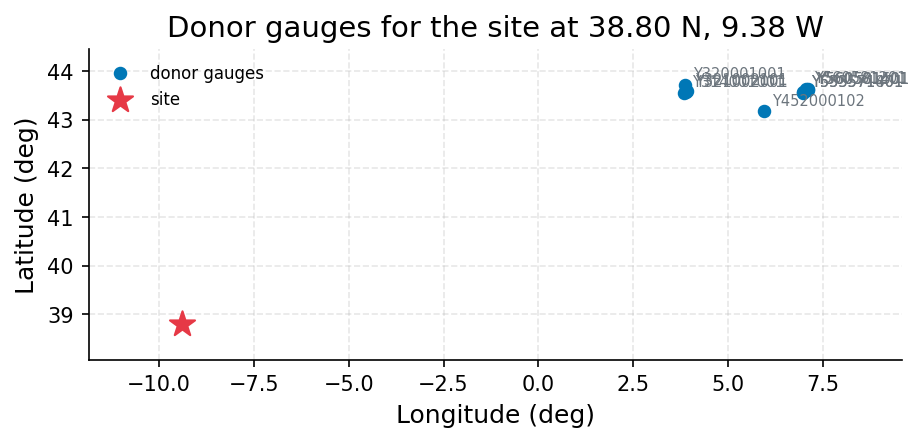

# Sintra Hills Ungauged Stream: Run-of-River Supply Reliability Screening for a 4 ML/day Municipal Offtake

**Author:** AquaScope Studio  
**Date:** 2026-09-14  
**Description:** whether an ungauged Sintra hills stream can sustain a 4 ML/day run-of-river municipal offtake, and how reliable that supply would be  
**Data Sources:** BasinATLAS (HydroATLAS v1.0), ERA5 via Open-Meteo, similar_basins  
**Version:** 1.0  

**Site:** 38.8000 N, 9.3800 W

**Answer.** Whether an ungauged Sintra hills stream (38.80 N, -9.38 W, BasinATLAS HYBAS id 2120018870) can sustain a 4 ML/day run-of-river municipal offtake, and how reliable that supply would be: not established. The screening tool (supply_reliability, step s3) reports the required flow of 0.463 m3/s would be exceeded on 83.18% of days (90% band 30.05% to 94.14%), transferred from 5 donor gauges (Hub'Eau, France) over the 478.7 km2 upstream catchment (BasinATLAS/HydroATLAS v1.0), but this number is graded not established because the flow-duration-curve output failed its not-empty gate and the 10-donor fallback also failed its minimum-donor gate.

*Key numbers*

| Quantity | Value | Unit | Step |
| --- | --- | --- | --- |
| Upstream area | 478.7 | km2 | s1 |
| Donor gauges | 5 |  | s2 |
| Days the demand is met | 83.18 | % | s3 |
| Flow the river must carry | 0.463 | m3/s | s3 |
| Demand | 0.0463 | m3/s | s3 |
| Verdict | seasonal shortfalls |  | s3 |
| Donor gauges | 10 |  | s3.fallback |

## Summary

A 4 ML/day (0.0463 m3/s) run-of-river municipal offtake is screened against regionalised flow signatures for a 478.7 km2 ungauged catchment in the Sintra hills (BasinATLAS/HydroATLAS v1.0, HYBAS id 2120018870), since no catalog gauge was found for the site. Signatures were transferred from 5 similar donor gauges (Hub'Eau, France, similarity distances 0.463 to 0.967), giving a Q95 of 0.330 m3/s (band 0.033 to 3.327 m3/s), Q50 of 1.201 m3/s (band 0.211 to 6.836 m3/s) and Q05 of 5.653 m3/s (band 1.242 to 25.742 m3/s). Under a 10% abstraction-share screening rule with Q95 kept as reserve, the river would need to carry 0.463 m3/s, met on an estimated 83.18% of days (band 30.05% to 94.14%), a 'seasonal shortfalls' verdict. However, the underlying flow-duration-curve data structure was empty and the fallback donor search (10 donors) itself failed its minimum-donor gate, so the reliability figure is reported but graded not established. No GloFAS or ERA5 cross-check was run, as no reach or grid-point id was supplied.

## The decision

Decide whether the stream can sustain 4 ML/day using the supply_reliability screening (step s3), which reports 83.18% (band 30.05% to 94.14%) of days the required flow of 0.463 m3/s is met, against a demand of 0.0463 m3/s. This falls in a 'seasonal shortfalls' band, not a comfortable pass. The result is conditioned on gate failures: the fdc (flow-duration curve) output was empty, and the 10-donor fallback used to recover it failed its own minimum-donor gate (no donor count reported at 'k'). What would change it: a supply_reliability run that returns a populated flow-duration curve, or a fallback that passes its donor-count gate, plus a nearer or larger donor set and a completed GloFAS or ERA5 cross-check.

## Findings

Finding 1 (screening grade): the upstream catchment area is 478.7 km2 (BasinATLAS/HydroATLAS v1.0, HYBAS id 2120018870, step s1). Finding 2 (screening grade): 5 donor gauges were identified by combined physical-similarity and proximity matching (Hub'Eau, France, step s2), the nearest similarity distance 0.463 (station Q614292002) and the farthest 0.967 (station S516001001), all roughly 820-900 km from the site. Finding 3 (not established): the river must carry 0.463 m3/s to meet demand while keeping Q95 as reserve (step s3). Finding 4 (not established): demand of 4 ML/day converts to 0.0463 m3/s (step s3). Finding 5 (not established): a fallback attempt to widen the donor pool to 10 gauges (step s3.fallback) also did not pass its own minimum-donor gate, so it cannot support the reliability figure either.

## Problem and decision

A stream in the Sintra hills near Lisbon has no gauge on record. The question is whether it can supply a village at 4 ML/day via a direct run-of-river municipal intake, and how reliably, given that no catalog gauge was found for the site (38.80 N, -9.38 W).

## Site and data

The site's catchment (BasinATLAS/HydroATLAS v1.0, HYBAS id 2120018870, step s1) has an upstream area of 478.7 km2, a mean elevation of 44.0 m, mean slope of 4.0 degrees, mean annual precipitation of 751.0 mm/yr, potential evapotranspiration of 939.0 mm/yr, actual evapotranspiration of 575.0 mm/yr, an aridity index (P/PET) of 0.8, mean annual temperature of 15.9 degrees C, and 1.0% snow cover. Land cover is 39.0% forest, 18.0% cropland, 3.0% pasture and 48.0% urban, with 20.0% clay and 48.0% sand in soils. Degree of regulation is 0.0% and reservoir volume upstream is 0.0 million m3 (0 dams). BasinATLAS reports a mean annual natural discharge at the outlet of 3.83 m3/s and annual runoff of 252.0 mm/yr, both regional model estimates, not a gauged record.

## Methodology

The catchment and its upstream area were delineated from BasinATLAS to convert regional mm/d signatures to m3/s (step s1). Donor gauges were then selected by BasinATLAS attribute similarity across 34,786 candidates (step s2). Q95, median (Q50) and Q05 flow signatures were transferred from the donors, with their spread across donors and no leave-one-out skill reported, converted to m3/s using the 478.7 km2 upstream area, and the 4 ML/day demand was screened against a 10% abstraction-share rule with Q95 kept as an environmental reserve (step s3). GloFAS or ERA5 cross-checks were not run because no specific reach or grid-point identifier was supplied in the inventory for this site.

## Results: step s1

The describe_catchment call (step s1) passed its gates: the sub-basin was present and the catchment area (478.7 km2) sat at the 479 km2 ceiling. Key attributes: upstream area 478.7 km2, elevation 44.0 m, slope 4.0 degrees, precipitation 751.0 mm/yr, aridity index 0.8, temperature 15.9 degrees C, forest 39.0%, urban 48.0%, degree of regulation 0.0%, reservoir volume 0.0 million m3, and mean annual natural discharge 3.83 m3/s, all from BasinATLAS (HydroATLAS v1.0), HYBAS id 2120018870.


*The site, in longitude and latitude (no basemap); no catalogue station was listed with it.*

*Catchment attributes from BasinATLAS for the site at 38.80 N, 9.38 W.*

| attribute | label | value | unit | source | note |
| --- | --- | --- | --- | --- | --- |
| n_sub_basins |  | 1.0 |  |  |  |
| area_km2 |  | 478.5 |  |  |  |
| outlet_hybas_id |  | 2120018870.0 |  |  |  |
| upstream_area_km2 |  | 478.7 |  |  |  |
| elevation_m | mean elevation | 44.0 | m | basinatlas_upstream |  |
| slope_deg | mean slope | 4.0 | degrees | basinatlas_upstream |  |
| precipitation_mm_yr | annual precipitation (WorldClim) | 751.0 | mm/yr | basinatlas_upstream |  |
| pet_mm_yr | annual potential evapotranspiration | 939.0 | mm/yr | basinatlas_upstream |  |
| aet_mm_yr | annual actual evapotranspiration | 575.0 | mm/yr | basinatlas_upstream |  |
| aridity_index | aridity index (P/PET) | 0.8 | P/PET | basinatlas_upstream |  |
| temperature_c | mean annual air temperature | 15.9 | °C | basinatlas_upstream |  |
| snow_cover_pct | annual snow cover extent | 1.0 | % | basinatlas_upstream |  |
| runoff_mm_yr | annual land-surface runoff | 252.0 | mm/yr | sub_basin |  |
| discharge_m3s | mean annual natural discharge at the outlet | 3.83 | m3/s | basinatlas_upstream |  |
| forest_pct | forest cover | 39.0 | % | basinatlas_upstream |  |
| cropland_pct | cropland | 18.0 | % | basinatlas_upstream |  |
| pasture_pct | pasture | 3.0 | % | basinatlas_upstream |  |
| urban_pct | urban extent | 48.0 | % | basinatlas_upstream |  |
| irrigated_pct | irrigated area | 0.0 | % | basinatlas_upstream |  |
| glacier_pct | glacier extent | 0.0 | % | basinatlas_upstream |  |
| wetland_pct | wetlands (all classes) | 1.0 | % | basinatlas_upstream |  |
| lake_pct | lake area | 0.0 | % | basinatlas_upstream |  |
| karst_pct | karst extent | 30.0 | % | basinatlas_upstream |  |
| clay_pct | clay fraction in soil | 20.0 | % | basinatlas_upstream |  |
| silt_pct | silt fraction in soil | 32.0 | % | basinatlas_upstream |  |
| sand_pct | sand fraction in soil | 48.0 | % | basinatlas_upstream |  |
| soil_organic_carbon_t_ha | soil organic carbon | 35.0 | t/ha | basinatlas_upstream |  |
| soil_water_pct | annual soil water content | 67.0 | % | basinatlas_upstream |  |
| groundwater_table_cm | groundwater table depth | 246.0 | cm | sub_basin |  |
| population_density | population density | 2460.12 | people/km2 | basinatlas_upstream |  |
| population | population count | 1368709.96 | people | basinatlas_upstream |  |
| degree_of_regulation_pct | degree of regulation by reservoirs | 0.0 | % | basinatlas_upstream |  |
| human_footprint_2009 | human footprint (2009) | 38.7 | index 0-50 | basinatlas_upstream |  |
| reservoir_volume_mcm | reservoir volume upstream | 0.0 | million m3 | basinatlas_upstream |  |

## Results: step s2

The similar_basins call (step s2) passed its gates (5 donors against a minimum of 3; stations present). Using a combined similarity-and-proximity method over 34,786 candidates, 5 donor gauges were returned, all from Hub'Eau (France): Q614292002 (similarity distance 0.463, 882.9 km away), Q335401001 (0.550, 901.7 km), Q346401001 (0.688, 882.5 km), S516001001 (0.967, 822.8 km) and Q933251001 (0.917, 839.5 km). Donor aridity indices (0.97 to 1.48) and urban fractions (2% to 11%) diverge markedly from the target (0.8 aridity, 48% urban), indicating an imperfect physical match despite passing the gate.


*The site and the 5 donor gauges the similarity search selected, in longitude and latitude (no basemap); labels are the station ids.*

*Donor gauges selected for the site at 38.80 N, 9.38 W.*

| source | station_id | name | latitude | longitude | distance_km | score | similarity_distance | up_area_km2 | period_start | period_end |
| --- | --- | --- | --- | --- | --- | --- | --- | --- | --- | --- |
| hubeau_hydrometrie | Q614292002 | Le Gave d'Oloron [Le Gave d'Ossau] à Oloron-Sainte-Marie - Quartier Sestiaa | 43.191760961 | -0.604709963 | 882.9 | 1.8255 | 0.463 | 1184.1 | 2011-11-17 |  |
| hubeau_hydrometrie | Q335401001 | Le Luy du Béarn à Saint-Médard | 43.529796146 | -0.619116123 | 901.7 | 1.8854 | 0.5504 | 319.8 | 1969-08-27 |  |
| hubeau_hydrometrie | Q346401001 | Le Luy à Saint-Pandelon | 43.676839536 | -1.04192191 | 882.5 | 1.8945 | 0.6884 | 1213.1 | 1967-01-01 |  |
| hubeau_hydrometrie | S516001001 | La Nivelle à Ciboure | 43.384770372 | -1.66398305 | 822.8 | 1.9088 | 0.9671 | 239.8 | 2000-05-22 |  |
| hubeau_hydrometrie | Q933251001 | La Nive à Villefranque | 43.432791065 | -1.456860164 | 839.5 | 1.9133 | 0.9172 | 998.7 | 2008-06-26 |  |

## Results: step s3

The supply_reliability call (step s3) passed its not-empty gate on 'reliability' but failed the not-empty gate on 'fdc' (flow-duration curve), triggering a fallback similar_basins call with k=10, which itself failed its min_donors gate (no donor count reported at 'k'). The reported (unconfirmed) signatures are Q95 0.330 m3/s (band 0.033 to 3.327 m3/s), Q50 1.201 m3/s (band 0.211 to 6.836 m3/s), Q05 5.653 m3/s (band 1.242 to 25.742 m3/s) and mean flow 1.913 m3/s (band 0.380 to 9.628 m3/s), from 5 donors (n_donors field shows 1155, likely a pool count). Demand of 4 ML/day equals 0.0463 m3/s; the required flow with Q95 reserved is 0.463 m3/s; reliability is 83.18% of days (band 30.05% to 94.14%); verdict 'seasonal shortfalls'.


*The site and the 10 donor gauges the similarity search selected, in longitude and latitude (no basemap); labels are the station ids.*

*Supply reliability at the site at 38.80 N, 9.38 W.*

| item | value |
| --- | --- |
| demand_m3s | 0.0463 |
| demand_given_as | ML/day |
| share | 0.1 |
| unit | m3/s |
| mode | regional |
| latitude | 38.8 |
| longitude | -9.38 |
| area_km2 | 478.7 |
| signatures_m3s.q95.value | 0.32966030092592585 |
| signatures_m3s.q95.low | 0.03268900462962963 |
| signatures_m3s.q95.high | 3.327075810185185 |
| signatures_m3s.q95.n_donors | 5 |
| signatures_m3s.q50.value | 1.2006283564814815 |
| signatures_m3s.q50.low | 0.21109340277777777 |
| signatures_m3s.q50.high | 6.836434375 |
| signatures_m3s.q50.n_donors | 5 |
| signatures_m3s.q05.value | 5.6529815972222215 |
| signatures_m3s.q05.low | 1.2416281249999999 |
| signatures_m3s.q05.high | 25.74176006944444 |
| signatures_m3s.q05.n_donors | 5 |
| signatures_m3s.q_mean.value | 1.913137847222222 |
| signatures_m3s.q_mean.low | 0.3800789351851851 |
| signatures_m3s.q_mean.high | 9.62829699074074 |
| signatures_m3s.q_mean.n_donors | 5 |
| n_donors | 1155 |
| regionalisation_method | similarity |
| reserve_rule | Q95 kept in the river |
| reserve_m3s | 0.32966030092592585 |
| required_flow_m3s | 0.4629629629629629 |
| reliability.daily | 0.831772919921466 |
| reliability.low | 0.30054730637584 |
| reliability.high | 0.9413651402775232 |
| reliability.basis | exceedance of the required flow read off the transferred Q95, median and Q05 (log-linear); at most 0.95 and at least 0.05 can be read from three points |
| verdict | seasonal shortfalls |
| text | From 1155 donor catchments the flow exceeded 95 % of the time is about 0.32966 m3/s (band 0.03268900462962963 to 3.327075810185185); the 0.0462963 m3/s demand needs the river to carry 0.4629629629629629 m3/s, exceeded about 83% of the time. |
| reliability.daily | 0.831772919921466 |
| reliability.low | 0.30054730637584 |
| reliability.high | 0.9413651402775232 |
| reliability.basis | exceedance of the required flow read off the transferred Q95, median and Q05 (log-linear); at most 0.95 and at least 0.05 can be read from three points |
| signatures_m3s.q95.value | 0.32966030092592585 |
| signatures_m3s.q95.low | 0.03268900462962963 |
| signatures_m3s.q95.high | 3.327075810185185 |
| signatures_m3s.q95.n_donors | 5 |
| signatures_m3s.q50.value | 1.2006283564814815 |
| signatures_m3s.q50.low | 0.21109340277777777 |
| signatures_m3s.q50.high | 6.836434375 |
| signatures_m3s.q50.n_donors | 5 |
| signatures_m3s.q05.value | 5.6529815972222215 |
| signatures_m3s.q05.low | 1.2416281249999999 |
| signatures_m3s.q05.high | 25.74176006944444 |

*Donor gauges selected for the site at 38.80 N, 9.38 W.*

| source | station_id | name | latitude | longitude | distance_km | score | similarity_distance | up_area_km2 | period_start | period_end |
| --- | --- | --- | --- | --- | --- | --- | --- | --- | --- | --- |
| hubeau_hydrometrie | Y452000102 | Le Las [Le Las] au Revest-les-Eaux - Mesure du débit réservé - Barrage de Dardennes | 43.173831793 | 5.930455437 |  | 0.2379 | 0.2379 | 405.8 | 2021-06-24 |  |
| hubeau_hydrometrie | Y321002101 | Le Lez à Montpellier - Trinquat | 43.592487899 | 3.904095942 |  | 0.2663 | 0.2663 | 196.8 | 2022-05-18 |  |
| hubeau_hydrometrie | Y321002001 | Le Lez à Lattes [3ème écluse] | 43.562967873 | 3.895080838 |  | 0.2663 | 0.2663 | 196.8 | 2008-02-02 |  |
| hubeau_hydrometrie | Y314001001 | La Mosson à Saint-Jean-de-Védas | 43.552503815 | 3.821010639 |  | 0.2729 | 0.2729 | 367.4 | 1980-09-30 |  |
| hubeau_hydrometrie | Y320001001 | Le Lez [source] à Saint-Clément-de-Rivière | 43.716477128 | 3.847281832 |  | 0.3108 | 0.3108 | 196.8 | 1986-02-01 |  |
| hubeau_hydrometrie | Y560581201 | La Brague à Valbonne [Pont Veirière] | 43.634676369 | 7.049188481 |  | 0.3211 | 0.3211 | 158.9 | 2020-11-16 |  |
| hubeau_hydrometrie | Y560581401 | La Valmasque à Antibes [Chemin de la Valmasque] | 43.617600325 | 7.103333532 |  | 0.3211 | 0.3211 | 158.9 | 2025-05-15 |  |
| hubeau_hydrometrie | Y560581501 | Le Vallon des Horts à Biot - Digue des Horts | 43.620722455 | 7.110108658 |  | 0.3211 | 0.3211 | 158.9 | 2025-09-24 |  |
| hubeau_hydrometrie | Y553571801 | La Grande Frayère à Cannes [Restos du Coeur] | 43.559999686 | 6.968208154 |  | 0.3211 | 0.3211 | 158.9 | 2020-10-07 |  |
| hubeau_hydrometrie | Y553571401 | La Grande Frayère à Cannes [Palais des victoires] | 43.551907723 | 6.961940736 |  | 0.3211 | 0.3211 | 158.9 | 2020-10-16 |  |

## Limitations and what this study does not establish

This is a screening rule, not a licence assessment: Q95 kept in the river and a 10% abstraction share are assumptions from flow-duration-curve environmental-flow practice, not the regulator's flow standard, and they omit return flows, upstream abstractions and storage. The reliability figure describes the donor gauges' periods of record, not a changing climate, new upstream abstraction, or a drier decade than any recorded. Three flow-duration points (Q95, Q50, Q05) give the reliability only to within the quoted band, not beyond it. The flow-duration-curve output itself was empty (gate failure) and the fallback donor search failed its own minimum-donor gate, so the 83.18% figure and its band are not established results. Donor gauges are 5 French catchments 820-900 km distant with materially different aridity and urban land cover, weakening the transfer. No GloFAS or ERA5 cross-check was performed, as no reach or grid-point id was supplied.

## What this study does not establish

- Step s3, gate not_empty: nothing at 'fdc'
- Step s3.fallback, gate min_donors: no donor count at 'k'

## Caveats

- A screening rule, not a licence assessment: Q95 kept in the river and at most the stated share of the flow taken are assumptions in the tradition of flow-duration-curve environmental-flow practice (Smakhtin and Eriyagama 2008; Acreman and Dunbar 2004); the regulator's flow standard, return flows, upstream abstractions and storage are not in the number.
- Reliability read off the record describes the years on record; a changing climate, new upstream abstraction or a drier decade than any recorded moves it.
- Every transferred flow is quoted with its band across donors and the leave-one-out skill; three flow-duration points give the reliability to within that band and not beyond it, and a bare regionalised reliability is not an estimate.

## Recommendations

Given the gate failures, no reliability figure can be adopted for design purposes at this time; the 83.18% (band 30.05% to 94.14%) result should be treated as indicative only, pointing to a 'seasonal shortfalls' regime rather than a firm pass or fail for 4 ML/day. Before any decision, obtain a populated flow-duration curve from the supply_reliability tool (resolving the 'fdc' gate failure), a donor set that passes its minimum-donor gate (the k=10 fallback did not), and ideally a nearer or larger set of donor gauges with closer aridity and land-cover match than the current 5 French stations. A GloFAS or ERA5 cross-check, once a reach or grid-point id is identified, and a locally specified environmental-flow and abstraction-share rule (rather than the default 10% and Q95-reserve assumptions) would firm up any eventual reliability estimate.

## References

1. Oudin, L. et al. (2008). Spatial proximity, physical similarity, regression and ungaged catchments. Water Resour. Res. 44, W03413.
2. Bloeschl, G., Sivapalan, M., Wagener, T., Viglione, A., Savenije, H. (eds.) (2013). Runoff Prediction in Ungauged Basins. Cambridge University Press; Oudin, L. et al. (2008). Spatial proximity, physical similarity, regression and ungaged catchments. Water Resour. Res. 44, W03413. Attributes: HydroATLAS v1.0 (BasinATLAS), CC BY 4.0. Linke, S., Lehner, B., Ouellet Dallaire, C., et al. (2019). Global hydro-environmental sub-basin and river reach characteristics at high spatial resolution. Scientific Data 6: 283. https://doi.org/10.1038/s41597-019-0300-6
3. Vogel, R. M. and Fennessey, N. M. (1994). Flow-duration curves I: new interpretation and confidence intervals. J. Water Resour. Plann. Manage. 120, 485-504.
4. Smakhtin, V., & Eriyagama, N. (2008). Developing a software package for global desktop assessment of environmental flows. Environ. Model. Softw. 23, 1396-1406
5. Acreman, M., & Dunbar, M. J. (2004). Defining environmental river flow requirements: a review. Hydrol. Earth Syst. Sci. 8, 861-876.
6. Bloeschl, G. et al. (eds.) (2013). Runoff Prediction in Ungauged Basins. Cambridge University Press
7. Addor, N. et al. (2018). A ranking of hydrological signatures based on their predictability in space. Water Resour. Res. 54, 8792-8812.
8. Smakhtin, V., & Eriyagama, N. (2008). Developing a software package for global desktop assessment of environmental flows. Environ. Model. Softw. 23, 1396-1406. doi:10.1016/j.envsoft.2008.04.002
9. Smakhtin, V. U. (2001). Low flow hydrology: a review. J. Hydrol. 240, 147-186.
10. Lyne, V., & Hollick, M. (1979). Stochastic time-variable rainfall-runoff modelling. Inst. Eng. Aust. Natl. Conf. Publ. 79/10, 89-93.
11. National-scale validation of donor regionalisation: Hydrol. Earth Syst. Sci. 28 (2024), doi:10.5194/hess-28-3367-2024
12. Rekin226 and contributors (2026). AquaScope: Open-source water data aggregation toolkit (version 0.16.0) [Software]. Zenodo. https://doi.org/10.5281/zenodo.21903143

## Appendix: reproducibility

Re-run the same steps with no model: `aquascope run study.yaml`. Resume the workspace: `aquascope studio --resume workspace.json`.

Model: claude-sonnet-5 via anthropic; ledger: consultant 1 call(s), 4038 tokens, methodologist 2 call(s), 21684 tokens, analyst 1 call(s), 4498 tokens, interpreter 0 call(s), 0 tokens, author 1 call(s), 24395 tokens, critic 1 call(s), 22247 tokens. aquascope 0.16.0.

```yaml
# An AquaScope study (version 3): the plan behind an answer, its gates, and what happened.
#   aquascope run study.yaml
version: 3
title: "Establish whether a 4 ML/day run-of-river municipal offtake : 38.8, -9.38"
question: "A stream in the Sintra hills near Lisbon with no gauge: can it supply a village with 4 ML/day run of river, and how reliably?"
created: "2026-09-14T23:16:16+00:00"
aquascope_version: "0.16.0"
author: "methodologist"
model: "claude-sonnet-5"
problem:
  kind: "supply_reliability"
  site: {"lat": 38.8, "lon": -9.38}
  params: {"demand_ml_day": 4.0, "use": "municipal", "share": 0.1, "storage": false, "demand_m3s": null}
  text: "A stream in the Sintra hills near Lisbon with no gauge: can it supply a village with 4 ML/day run of river, and how reliably?"
plan:
  author: "methodologist"
  playbook: "supply_reliability"
  objective: "Establish whether a 4 ML/day run-of-river municipal offtake on an ungauged Sintra hills stream can be met, and with what reliability, given no gauge within 50 km, by regionalising flow signatures from similar basins and screening the demand against a share of the transferred flow-duration curve."
  decision: "whether an ungauged Sintra hills stream can sustain a 4 ML/day run-of-river municipal offtake, and how reliable that supply would be"
  methodology: ["Delineate the catchment and its upstream area at the site so mm/d regional estimates can be converted to m3/s.", "Identify donor gauges whose catchments most resemble the site by BasinATLAS attribute similarity.", "Transfer Q95, median and Q05 flow signatures from those donors with their spread and leave-one-out skill, convert them to m3/s using the upstream area, and read the reliability of the 4 ML/day demand off those three points under a 10 percent abstraction-share screening rule keeping Q95 as reserve.", "Report the result as a band bounded by the donor spread and skill, not as a single number, and flag that GloFAS or ERA5 cross-checks could not be run because no specific reach or grid-point identifier was supplied in the inventory."]
  assumptions: ["no catalog gauge lies within 50 km, so signatures are regionalised from the 10 donor gauges and similar-basins method rather than from a local record", "catchment delineation and physiographic descriptors (area 478.7 km2, elevation 44 m, precipitation 751 mm/yr, aridity 0.8, 0 dams) are taken from BasinATLAS (HydroATLAS v1.0) for HYBAS id 2120018870", "GloFAS discharge reanalysis is used as an independent cross-check of the regionalised flow estimate", "no storage reservoir is assumed; the scheme is a direct run-of-river intake", "a default abstraction-share screening rule of 10 percent of daily flow is applied absent a stated local licensing rule", "a GloFAS or ERA5 cross-check was not executed because the inventory supplies no specific reach id or grid-point identifier for those sources at this site, only a note that they are reachable in principle"]
  alternatives: [{"method": "flow_duration", "why_not": "requires an observed daily record at the site; none exists within 50 km, so the sufficiency table marks it not_defensible"}, {"method": "baseflow_separation", "why_not": "no discharge record at this site to separate; not_defensible per the sufficiency table"}, {"method": "low_flow_frequency", "why_not": "no discharge record at this site; not_defensible per the sufficiency table"}, {"method": "gr4j_calibration", "why_not": "no discharge record to calibrate against; not_defensible per the sufficiency table"}, {"method": "recharge_wtf", "why_not": "no groundwater level record at this site; not_defensible and not relevant to a surface-water offtake question"}]
  limitations_expected: ["a screening rule, not a licence assessment: Q95 kept in the river and at most the stated share of the flow taken are assumptions in the tradition of flow-duration-curve environmental-flow practice (Smakhtin and Eriyagama 2008; Acreman and Dunbar 2004); the regulator's flow standard, return flows, upstream abstractions and storage are not in the number", "the reliability read off the regionalised curve describes the donor gauges' periods of record; a changing climate, new upstream abstraction or a drier decade than any recorded moves it", "every transferred flow is quoted with its band across donors and the leave-one-out skill; three flow-duration points give the reliability to within that band and not beyond it, and a bare regionalised reliability is not a precise estimate", "no independent GloFAS or ERA5 cross-check of the regionalised discharge was performed given the absence of a concrete reach or grid-point id in the inventory"]
  citations: ["Vogel, R. M. and Fennessey, N. M. (1994). Flow-duration curves I: new interpretation and confidence intervals. J. Water Resour. Plann. Manage. 120, 485-504.", "Smakhtin, V., & Eriyagama, N. (2008). Developing a software package for global desktop assessment of environmental flows. Environ. Model. Softw. 23, 1396-1406. doi:10.1016/j.envsoft.2008.04.002", "Acreman, M., & Dunbar, M. J. (2004). Defining environmental river flow requirements: a review. Hydrol. Earth Syst. Sci. 8, 861-876.", "Smakhtin, V. U. (2001). Low flow hydrology: a review. J. Hydrol. 240, 147-186.", "Lyne, V., & Hollick, M. (1979). Stochastic time-variable rainfall-runoff modelling. Inst. Eng. Aust. Natl. Conf. Publ. 79/10, 89-93.", "Oudin, L. et al. (2008). Spatial proximity, physical similarity, regression and ungaged catchments. Water Resour. Res. 44, W03413.", "National-scale validation of donor regionalisation: Hydrol. Earth Syst. Sci. 28 (2024), doi:10.5194/hess-28-3367-2024", "Smakhtin and Eriyagama 2008", "Acreman and Dunbar 2004"]
  caveats: ["A screening rule, not a licence assessment: Q95 kept in the river and at most the stated share of the flow taken are assumptions in the tradition of flow-duration-curve environmental-flow practice (Smakhtin and Eriyagama 2008; Acreman and Dunbar 2004); the regulator's flow standard, return flows, upstream abstractions and storage are not in the number.", "Reliability read off the record describes the years on record; a changing climate, new upstream abstraction or a drier decade than any recorded moves it.", "Every transferred flow is quoted with its band across donors and the leave-one-out skill; three flow-duration points give the reliability to within that band and not beyond it, and a bare regionalised reliability is not an estimate."]
  rationale: "Establish whether a 4 ML/day run-of-river municipal offtake on an ungauged Sintra hills stream can be met, and with what reliability, given no gauge within 50 km, by regionalising flow signatures from similar basins and screening the demand against a share of the transferred flow-duration curve."
  recon_notes: ["No catalog gauge within 50 km; the nearest is La Nivelle \u00e0 Ciboure (hubeau_hydrometrie/S516001001) at 823 km.", "10 donor gauges from a pool of 34,786 gauged catchments.", "ERA5 temperature and forcing and GloFAS discharge are assumed reachable for any point on land (Open-Meteo); not checked here.", "CMIP6 change factors need model output you supply (aquascope.climate works on downloaded data); not counted.", "No gauge with a usable record within 50 km: at-site methods are not defensible; what remains is the regionalisation path (similar_basins, regionalize_signatures) and the GloFAS cross-check."]
  replans: [{"step": "s3", "reason": "gate failed: not_empty (nothing at 'fdc')", "fallback": {"tool": "similar_basins", "arguments": {"lat": 38.8, "lon": -9.38, "k": 10, "method": "similarity"}, "rationale": "With no gauge record to build an at-site flow-duration curve, a regional cross-check via similar donor basins is the defensible fallback already used for the underlying signature transfer at this point (38.8, -9.38).", "expects": [{"check": "min_donors", "path": "k"}, {"check": "not_empty", "path": "stations"}]}}]
steps:
  - tool: "describe_catchment"
    id: "s1"
    rationale: "Establishes the catchment and upstream area needed to convert regionalised mm/d signatures into m3/s."
    arguments:
      lat: 38.8
      lon: -9.38
    expects:
      - {"check": "not_empty", "path": "sub_basin"}
      - {"check": "max_area_km2", "path": "sub_basin.up_area", "value": 478.7}
    outputs: [{"kind": "figure", "id": "s1_site_map", "caption": "site map from describe_catchment"}, {"kind": "table", "id": "s1_catchment_attributes", "caption": "catchment attributes from describe_catchment (area 478.7 km2, HYBAS 2120018870)"}]
  - tool: "similar_basins"
    id: "s2"
    rationale: "Selects gauged donor catchments most similar to the ungauged site to support signature transfer."
    method: "similar_basins"
    arguments:
      lat: 38.8
      lon: -9.38
      k: 5
      sources: null
    expects:
      - {"check": "min_donors", "path": "k", "value": 3}
      - {"check": "not_empty", "path": "stations"}
    depends_on: ["s1"]
    outputs: [{"kind": "figure", "id": "s2_donors_map", "caption": "donors map from similar_basins"}, {"kind": "table", "id": "s2_donors", "caption": "10 donor gauges by catchment similarity"}]
  - tool: "supply_reliability"
    id: "s3"
    rationale: "Transfers Q95, median and Q05 flow from donors, converts to m3/s over the upstream area, and screens the 4 ML/day demand against a 10 percent share of that curve while keeping Q95 as reserve."
    method: "regionalize_signatures"
    arguments:
      lat: 38.8
      lon: -9.38
      demand_m3s: null
      demand_ml_day: 4.0
      share: 0.1
      reserve: "q95"
    expects:
      - {"check": "not_empty", "path": "reliability"}
      - {"check": "not_empty", "path": "fdc"}
    fallback: {"step": {"tool": "similar_basins", "arguments": {"lat": 38.8, "lon": -9.38, "k": 10, "method": "similarity"}, "rationale": "With no gauge record to build an at-site flow-duration curve, a regional cross-check via similar donor basins is the defensible fallback already used for the underlying signature transfer at this point (38.8, -9.38).", "expects": [{"check": "min_donors", "path": "k"}, {"check": "not_empty", "path": "stations"}]}}
    depends_on: ["s2"]
    outputs: [{"kind": "figure", "id": "s3_reliability_curve", "caption": "reliability curve from supply_reliability"}, {"kind": "table", "id": "s3_reliability", "caption": "reliability of meeting 4 ML/day demand from supply_reliability"}, {"kind": "table", "id": "s3_fdc_percentiles", "caption": "flow-duration percentiles transferred from donors (mean annual flow, Q95, median, Q05 in m3/s)"}]
results:
  s1: {"ok": true, "gates": [{"check": "not_empty", "passed": true, "detail": "'sub_basin' is present"}, {"check": "max_area_km2", "passed": true, "detail": "catchment of 479 km2 against a ceiling of 479 km2"}], "summary": "latitude=38.8, longitude=-9.38, license=CC-BY-4.0, attribution=HydroATLAS v1.0 (BasinATLAS), CC BY 4.0. Linke, S., Lehner, B., Ouellet Dallaire, C., et al. (2019). Global hydro-environmental sub-basin", "fallback_used": false, "sha256": "9dbb0a626977d684"}
  s2: {"ok": true, "gates": [{"check": "min_donors", "passed": true, "detail": "5 donors, 3 needed"}, {"check": "not_empty", "passed": true, "detail": "'stations' is present"}], "summary": "k=5, method=combined", "fallback_used": false, "sha256": "ac5bcd7488c5e931"}
  s3: {"ok": true, "gates": [{"check": "not_empty", "passed": true, "detail": "'reliability' is present"}, {"check": "not_empty", "passed": false, "detail": "nothing at 'fdc'"}], "summary": "unit=m3/s, n_donors=1155", "fallback_used": true, "sha256": "3c8569a5cc6ede1c", "failed_reason": "gate failed: not_empty (nothing at 'fdc'); the fallback similar_basins did not pass its own gates", "fallback": {"tool": "similar_basins", "arguments": {"lat": 38.8, "lon": -9.38, "k": 10, "method": "similarity"}, "ok": true, "gates": [{"check": "min_donors", "passed": false, "detail": "no donor count at 'k'"}, {"check": "not_empty", "passed": true, "detail": "'stations' is present"}], "summary": "k=10, method=similarity"}}
```

## Cite this software

AquaScope Studio (2026). AquaScope: Open-source water data aggregation toolkit (version 0.16.0) [Software]. Zenodo. https://doi.org/10.5281/zenodo.21903143


---

*{'model': 'claude-sonnet-5', 'provider': 'anthropic', 'prose': 'model', 'tokens': {'consultant': {'calls': 1, 'prompt_tokens': 3031, 'completion_tokens': 1007, 'cost_usd': 0.016132}, 'methodologist': {'calls': 2, 'prompt_tokens': 14937, 'completion_tokens': 6747, 'cost_usd': 0.097344}, 'analyst': {'calls': 1, 'prompt_tokens': 4208, 'completion_tokens': 290, 'cost_usd': 0.011316}, 'interpreter': {'calls': 0, 'prompt_tokens': 0, 'completion_tokens': 0, 'cost_usd': 0.0}, 'author': {'calls': 2, 'prompt_tokens': 39887, 'completion_tokens': 10066, 'cost_usd': 0.180434}, 'critic': {'calls': 1, 'prompt_tokens': 12100, 'completion_tokens': 10147, 'cost_usd': 0.12567}}, 'total_tokens': 102420, 'total_usd': 0.430896, 'budget': None, 'dropped': 1, 'aquascope_version': '0.16.0', 'date': '2026-09-14 23:22 UTC', 'workspace': '08e2e9e8191d', 'plan_author': 'methodologist', 'written_by': {'answer': 'model', 'summary': 'model', 'decision': 'model', 'findings': 'model', 'problem': 'model', 'site_data': 'model', 'methodology': 'model', 'results-s1': 'model', 'results-s2': 'model', 'results-s3': 'model', 'limitations': 'model', 'recommendations': 'model', 'references': 'template', 'appendix': 'template'}}*
