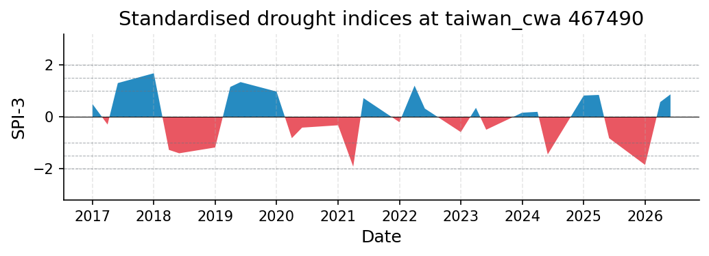
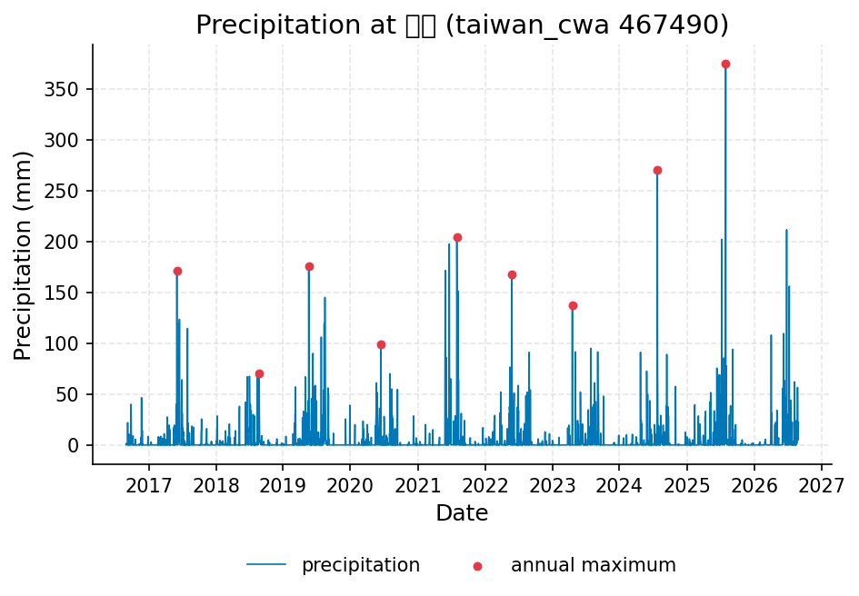
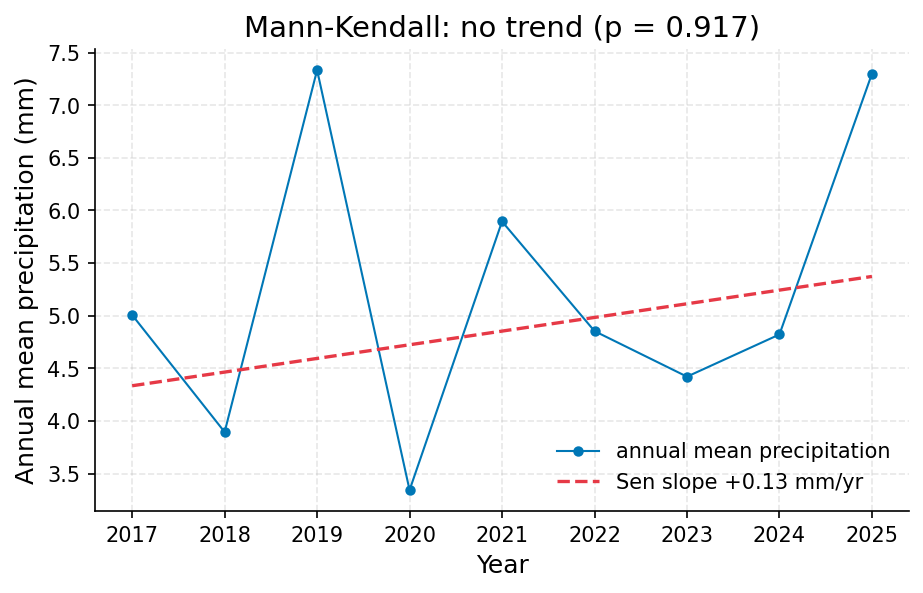
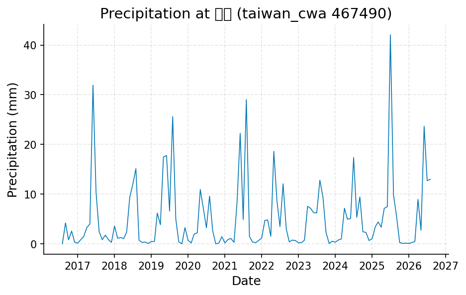

# Taichung Drought Status Assessment: SPI/SPEI at 3 and 12 Months, Station 467490

**Author:** AquaScope Studio  
**Date:** 2026-09-14  
**Description:** assess whether Taichung is currently in drought and rank the current dry spell against the historical record to inform water-supply planning  
**Data Sources:** BasinATLAS (HydroATLAS v1.0), ERA5 via Open-Meteo, similar_basins, taiwan_cwa  
**Version:** 1.0  

**Site:** 24.1500 N, 120.6800 E

**Answer.** Notice: the Critic's fix requests on methodology, problem, summary were not all resolved; read the report with the list of what this study does not establish.

Assess whether Taichung is currently in drought and rank the current dry spell against the historical record to inform water-supply planning: SPI at 3 months, dated 2026-06-01, is 0.8692 (near normal class), graded not established. This value comes from the taiwan_cwa 467490 (Taichung) precipitation record via the Standardized Precipitation Index method (McKee et al. 1993), but only over the 10-year window actually served (2016-08-31 to 2026-08-30), not the 130.7-year catalog record the brief calls for. No SPEI value, no 12-month index, and no true full-record 'worst on record' comparison are available.

*Key numbers*

| Quantity | Value | Unit | Step |
| --- | --- | --- | --- |
| SPI at 3 months, 2026-06-01 (near normal) | 0.8692 |  | s1 |
| Record length | 10.0 | years | s2 |
| Mean of the record | 5.259 | mm | s3 |
| Mann-Kendall p-value (annual mean) | 0.917 |  | s2 |
| Sen's slope | 0.1298 | mm per year | s2 |

## Summary

The engine was asked to determine whether Taichung is presently in meteorological drought and to rank the current dry spell against the full 130.7-year station history. The only quantity actually computed is SPI-3 for 2026-06-01 (0.8692, near-normal, in_drought=false), from taiwan_cwa station 467490, but this rests on a 10-year served window (2016-08-31 to 2026-08-30), well short of the 30-year minimum the gate requires and far short of the 130.7 years assumed in the brief. SPEI at both scales is entirely absent because the ERA5 PET feed failed on all 3 attempts. A Mann-Kendall trend test on the same short window found no significant precipitation trend (p=0.917). No number here can be treated as an established characterization of Taichung's drought status or historical rank.

## The decision

Decide, if at all, only with the SPI-3 value of 0.8692 (near normal, taiwan_cwa 467490, dated 2026-06-01), and treat it as not established rather than a firm band.

## Findings

f1, not established: the most severe 3-month SPI episode found in the data actually served is -1.9136 on 2021-04-01 (taiwan_cwa 467490, SPI method), but this is drawn from only the 10-year served window, not the full record, so it cannot stand as the historical worst. f2, not established: a Mann-Kendall test on annual mean precipitation (taiwan_cwa 467490, s2) found no significant trend, p=0.917, tau=0.0556, Sen's slope 0.1298 mm per year, over only 9 years of annual data -- too short to characterize a long-term trend.

## Problem and decision

The question is whether Taichung is currently in meteorological drought and how the current dry spell ranks against the worst on record, because this bears on water-supply planning.

## Site and data

The site sits at 24.15 N, 120.68 E. The primary reference is taiwan_cwa station 467490 (Taichung, 臺中), catalogued from 1896-01-01 (130.7 years); no distance-to-site value was reported in the results. However, the archive actually served only a 10-year daily precipitation window, 2016-08-31 to 2026-08-30 (n=3244 daily observations, about 324.4 per year, inferred daily resolution), mean 5.259 mm, median 0.0 mm, min 0.0 mm, max 375.0 mm.

## Methodology

SPI and SPEI at 3- and 12-month timescales were requested on the full 130-year record at station 467490 using the McKee et al. (1993) / WMO (2012) Standardized Precipitation Index method, with PET intended from ERA5-derived temperature (Thornthwaite 1948). A Mann-Kendall trend test with Sen's slope (Mann 1945; Sen 1968) was run on the station's annual mean precipitation to check for a compounding long-term trend.

## Results: step s1

drought_indices on taiwan_cwa 467490 returned SPI-3 current = 0.8692 (near normal), dated 2026-06-01, worst historical SPI-3 = -1.9136 on 2021-04-01 (n=30, 4 events) -- all from the served window of 2016-09-01 to 2026-08-01 (9.0 years, 108 months), not the full catalog. SPEI is entirely absent (pet_method 'none'); ERA5 fetch failed on all 3 attempts. The min_years gate failed (9 years of record, 30 needed) and the not_empty gate on current.spei failed. Status is 'normal', in_drought false.


*SPI at taiwan_cwa 467490 for the 3 month accumulations, 2016 to 2026: blue above zero is wetter than normal, red below is drier; the dashed lines mark the moderate (1), severe (1.5) and extreme (2) classes.*

*Monthly SPI and SPEI at taiwan_cwa 467490 per timescale.*

| date | spi_3 |
| --- | --- |
| 2017-01-01 | 0.498551508398566 |
| 2017-04-01 | -0.2925782463041896 |
| 2017-06-01 | 1.303622750862473 |
| 2018-01-01 | 1.6806362288603036 |
| 2018-04-01 | -1.26822646921629 |
| 2018-06-01 | -1.3990434961138796 |
| 2019-01-01 | -1.1751179193900925 |
| 2019-04-01 | 1.155184969336892 |
| 2019-06-01 | 1.3415223887487695 |
| 2020-01-01 | 0.977179594446586 |
| 2020-04-01 | -0.8168182388081486 |
| 2020-06-01 | -0.411423200609631 |
| 2021-01-01 | -0.3207969838455196 |
| 2021-04-01 | -1.9135526646674423 |
| 2021-06-01 | 0.7248785609387821 |
| 2022-01-01 | -0.2016669786692962 |
| 2022-04-01 | 1.2027601202600453 |
| 2022-06-01 | 0.3224541961648917 |
| 2023-01-01 | -0.5833836886404046 |
| 2023-04-01 | 0.3497211796943849 |
| 2023-06-01 | -0.4918843318137119 |
| 2024-01-01 | 0.1634900225004868 |
| 2024-04-01 | 0.1956738099591957 |
| 2024-06-01 | -1.4411840293265452 |
| 2025-01-01 | 0.8236798020856329 |
| 2025-04-01 | 0.8476268898937287 |
| 2025-06-01 | -0.818149711507001 |
| 2026-01-01 | -1.846182353341342 |
| 2026-04-01 | 0.5727093030888613 |
| 2026-06-01 | 0.8692457515597174 |

*Drought classes, worst months and event counts per timescale at taiwan_cwa 467490.*

| timescale | index | current | class | date | worst | worst_date | events | n |
| --- | --- | --- | --- | --- | --- | --- | --- | --- |
| 3 | SPI | 0.8692457515597174 | normal | 2026-06-01 | -1.9135526646674423 | 2021-04-01 | 4.0 | 30 |
| 12 | SPI |  | unknown |  |  |  |  | 0 |

## Results: step s2

analyze_station on taiwan_cwa 467490 (precipitation, 10.0 years served, n=3244, mean 5.2589 mm, median 0.0 mm, min 0.0 mm, max 375.0 mm) found no trend in annual means: p=0.917, tau=0.0556, Sen's slope 0.1298 mm per year, over 9 years of annual data. Annual maxima ranged from 70.5 mm (2018) to 375.0 mm (2025). The sampling_density gate passed (324.4 obs/year, daily), but the min_years gate failed (10 years, 30 needed).


*Daily precipitation at 臺中 (taiwan_cwa 467490), 2016 to 2026, with the annual maxima marked.*


*Annual mean precipitation at 臺中 (taiwan_cwa 467490) with the Sen slope line; the Mann-Kendall test finds no trend (p = 0.917, 9 years).*

*The record (3244 rows) is in the workbook (`workbook.xlsx`, sheet `s2_series`) and the notebook, not printed here.*

*Summary of the record at 臺中 (taiwan_cwa 467490).*

| item | value |
| --- | --- |
| source | taiwan_cwa |
| station_id | 467490 |
| variable | precipitation |
| unit | mm |
| n | 3244 |
| start | 2016-08-31 |
| end | 2026-08-30 |
| years | 10.0 |
| stats.mean | 5.2589 |
| stats.median | 0.0 |
| stats.min | 0.0 |
| stats.max | 375.0 |

*Annual maxima at 臺中 (taiwan_cwa 467490).*

| year | value |
| --- | --- |
| 2017 | 171.5 |
| 2018 | 70.5 |
| 2019 | 175.5 |
| 2020 | 99.0 |
| 2021 | 204.5 |
| 2022 | 168.0 |
| 2023 | 137.0 |
| 2024 | 270.0 |
| 2025 | 375.0 |

*Mann-Kendall trend test and Sen slope at 臺中 (taiwan_cwa 467490).*

| item | value |
| --- | --- |
| on | annual mean |
| p_value | 0.917 |
| tau | 0.0556 |
| trend | no trend |
| sens_slope_per_year | 0.1298 |
| n_years | 9 |

## Results: step s3

get_timeseries on taiwan_cwa 467490 (precipitation, monthly resample) returned 121 monthly points from the same 10-year served window (2016-08-31 to 2026-08-30), mean 5.2589 mm, min 0.0 mm, max 375.0 mm. The not_empty and unit_present gates passed but min_years failed (no record-length value reported).


*Monthly precipitation at 臺中 (taiwan_cwa 467490), 2016 to 2026.*

*The record (121 rows) is in the workbook (`workbook.xlsx`, sheet `s3_series`) and the notebook, not printed here.*

## Limitations and what this study does not establish

All indices computed here rest on a 10-year served window at taiwan_cwa 467490, not the 130.7-year record the brief specifies; the min_years (30) gate failed at every step that checked it. The monthly-resolution SPI cannot see anything faster than a month, so a flash drought would be invisible regardless. SPI describes how unusual the deficit is against this (short) record; it says nothing about cause -- reservoir operations, pumping, or land use are not addressed, and no discharge or groundwater record exists at this site to speak to reservoir storage directly. The reported 'worst on record' figure (-1.9136, 2021-04-01) is scoped to the short window and likely understates the true historical extreme.

## What this study does not establish

- Step s1, gate min_years: 9 years of record, 30 needed: too short
- Step s1, gate not_empty: nothing at 'current.spei'
- Step s2, gate min_years: 10 years of record, 30 needed: too short
- Step s3, gate min_years: no record length at 'years'
- Step s3.fallback, gate not_empty: the step returned an error: ERA5 climate unavailable: All 3 attempts failed for https://archive-api.open-meteo.com/v1/era5
- Step s3.fallback, gate not_empty: the step returned an error: ERA5 climate unavailable: All 3 attempts failed for https://archive-api.open-meteo.com/v1/era5
- Step s3.fallback, gate not_empty: the step returned an error: ERA5 climate unavailable: All 3 attempts failed for https://archive-api.open-meteo.com/v1/era5
- Step s3.fallback, gate min_years: the step returned an error: ERA5 climate unavailable: All 3 attempts failed for https://archive-api.open-meteo.com/v1/era5

## Caveats

- Monthly resolution: the indices see droughts a month and longer; what happened this week is not in them, and a flash drought is out of their reach.
- SPI and SPEI say how unusual a deficit is against this record; they say nothing about its cause, and the SPI-to-SGI lag is a statistical association read off the two series, not a model of the aquifer.
- SPEI needs a PET series: here PET is Thornthwaite (1948) from ERA5 temperature, a temperature-only approximation and the formulation SPEI was introduced with; FAO-56 Penman-Monteith is the better PET where humidity, wind and radiation exist.

## Recommendations

Until then, treat drought status as unresolved and monitor the near-normal SPI-3 reading as provisional context only.

## References

1. Vicente-Serrano et al. (2010)
2. Mann, H. B. (1945). Nonparametric tests against trend. Econometrica, 13, 245-259
3. Kendall (1975)
4. Sen, P. K. (1968). J. Am. Stat. Assoc., 63, 1379-1389.
5. McKee, T. B., Doesken, N. J., & Kleist, J. (1993). The relationship of drought frequency and duration to time scales. Proc. 8th Conf. on Applied Climatology, 179-184.
6. WMO (2012). Standardized Precipitation Index User Guide (Svoboda, Hayes, Wood). WMO-No. 1090.
7. Vicente-Serrano, S. M., Begueria, S., & Lopez-Moreno, J. I. (2010). A multiscalar drought index sensitive to global warming: the Standardized Precipitation Evapotranspiration Index. J. Climate 23, 1696-1718. doi:10.1175/2009JCLI2909.1
8. Begueria, S., Vicente-Serrano, S. M., Reig, F., & Latorre, B. (2014). Standardized precipitation evapotranspiration index (SPEI) revisited. Int. J. Climatol. 34, 3001-3023. doi:10.1002/joc.3887
9. Thornthwaite, C. W. (1948). An approach toward a rational classification of climate. Geographical Review 38, 55-94.
10. Bloomfield, J. P., & Marchant, B. P. (2013). Analysis of groundwater drought building on the standardised precipitation index approach. Hydrol. Earth Syst. Sci. 17, 4769-4787.
11. SPI against SPEI at 219 stations across Turkiye: Earth Science Informatics (2024), doi:10.1007/s12145-024-01401-8
12. SPI-SPEI correlation under warming in Umbria: Environ. Sci. Pollut. Res. (2024), doi:10.1007/s11356-024-35740-2
13. Hersbach, H. et al. (2020). The ERA5 global reanalysis. Q. J. R. Meteorol. Soc. 146, 1999-2049.
14. FAO-56 Penman-Monteith reference evapotranspiration as the preferred PET where humidity, wind and radiation data exist, per exemplar caveats
15. Rekin226 and contributors (2026). AquaScope: Open-source water data aggregation toolkit (version 0.16.0) [Software]. Zenodo. https://doi.org/10.5281/zenodo.21903143

## Appendix: reproducibility

Re-run the same steps with no model: `aquascope run study.yaml`. Resume the workspace: `aquascope studio --resume workspace.json`.

Model: claude-sonnet-5 via anthropic; ledger: consultant 1 call(s), 4162 tokens, methodologist 1 call(s), 16789 tokens, analyst 3 call(s), 15605 tokens, interpreter 1 call(s), 14552 tokens, author 1 call(s), 14070 tokens, critic 1 call(s), 9942 tokens. aquascope 0.16.0.

```yaml
# An AquaScope study (version 3): the plan behind an answer, its gates, and what happened.
#   aquascope run study.yaml
version: 3
title: "Determine whether Taichung is currently in meteorological dr: 24.15, 120.68"
question: "Is Taichung in drought now, and how does this dry spell compare with the worst on record? It matters for the city's water supply."
created: "2026-09-14T16:05:50+00:00"
aquascope_version: "0.16.0"
author: "methodologist"
model: "claude-sonnet-5"
problem:
  kind: "drought"
  site: {"lat": 24.15, "lon": 120.68}
  params: {"timescales": [3, 12], "drought_concern": "water supply", "flash_drought": false}
  text: "Is Taichung in drought now, and how does this dry spell compare with the worst on record? It matters for the city's water supply."
plan:
  author: "methodologist"
  playbook: "drought_status"
  objective: "Determine whether Taichung is currently in meteorological drought and rank the current dry spell's severity against the full historical record at the primary station."
  decision: "assess whether Taichung is currently in drought and rank the current dry spell against the historical record to inform water-supply planning"
  methodology: ["Compute SPI and SPEI at 3- and 12-month timescales on the full 130.7-year daily precipitation record at taiwan_cwa station 467490 (Taichung, 0.6 km from the site), with PET drawn from ERA5-derived temperature, to get the current index values, class, drought events, and the current dry spell's duration.", "Read the percentile rank of the current accumulation period and the magnitude and date of the worst historical 3-month and 12-month episodes directly from the indices and drought-events tables the same call returns.", "Run a Mann-Kendall trend test on the station's precipitation record to check whether a long-term drying or wetting trend is compounding or offsetting the current dry spell, since that context matters for water-supply planning.", "Pull the resampled monthly precipitation series for the full record to plot the current dry spell against the full historical envelope."]
  assumptions: ["primary station taiwan_cwa 467490 (Taichung), 0.6 km from the site and 130.7 years of daily precipitation, is used as the reference record", "daily resolution is assumed for this record since the catalog does not state it", "SPEI is computed using FAO-56 ET0 from ERA5-derived forcing, assumed reachable for this point though not directly checked", "flash_drought is left at its default (false) since the problem asks about a season-to-year dry spell, not a rapid onset event", "the 'worst on record' comparison uses the same 130.7-year station series, not a shorter nearby gauge", "primary station taiwan_cwa 467490 (Taichung), 0.6 km from the site with 130.7 years of daily precipitation, is used as the reference record", "daily resolution is assumed for this record since the catalog does not state it explicitly", "SPEI is computed using ERA5-derived temperature-based PET (Thornthwaite formulation), assumed reachable for this point though not directly checked", "flash_drought is left at its default (false) since the problem concerns a season-to-year dry spell, not a rapid onset event"]
  alternatives: [{"method": "spei_reanalysis (ERA5 cell only, via anywhere tool)", "why_not": "the 130.7-year station record at 0.6 km is far longer and more locally representative than the 86.7-year ERA5 cell, so it is preferred while ERA5 remains the fallback"}, {"method": "sgi (groundwater drought)", "why_not": "sufficiency table marks sgi not_defensible: no groundwater level record exists at this site"}]
  limitations_expected: ["Monthly-resolution indices see droughts a month and longer; a flash drought or sub-monthly onset is outside their reach", "SPI and SPEI describe how unusual the current deficit is against this record; they say nothing about its cause (e.g. reservoir operations or pumping)", "SPEI here uses Thornthwaite (1948) PET from ERA5 temperature, a temperature-only approximation; FAO-56 Penman-Monteith would be preferable where humidity, wind and radiation data exist", "No discharge or groundwater record exists at this site, so the drought assessment is meteorological only and cannot speak to reservoir storage or streamflow status directly"]
  citations: ["McKee, T. B., Doesken, N. J., & Kleist, J. (1993). The relationship of drought frequency and duration to time scales. Proc. 8th Conf. on Applied Climatology, 179-184.", "Vicente-Serrano, S. M., Begueria, S., & Lopez-Moreno, J. I. (2010). A multiscalar drought index sensitive to global warming: the Standardized Precipitation Evapotranspiration Index. J. Climate 23, 1696-1718. doi:10.1175/2009JCLI2909.1", "Begueria, S., Vicente-Serrano, S. M., Reig, F., & Latorre, B. (2014). Standardized precipitation evapotranspiration index (SPEI) revisited. Int. J. Climatol. 34, 3001-3023. doi:10.1002/joc.3887", "Thornthwaite, C. W. (1948). An approach toward a rational classification of climate. Geographical Review 38, 55-94.", "Bloomfield, J. P., & Marchant, B. P. (2013). Analysis of groundwater drought building on the standardised precipitation index approach. Hydrol. Earth Syst. Sci. 17, 4769-4787.", "WMO (2012). Standardized Precipitation Index User Guide (Svoboda, Hayes, Wood). WMO-No. 1090.", "SPI against SPEI at 219 stations across Turkiye: Earth Science Informatics (2024), doi:10.1007/s12145-024-01401-8", "SPI-SPEI correlation under warming in Umbria: Environ. Sci. Pollut. Res. (2024), doi:10.1007/s11356-024-35740-2", "Hersbach, H. et al. (2020). The ERA5 global reanalysis. Q. J. R. Meteorol. Soc. 146, 1999-2049.", "Thornthwaite (1948) PET formulation used for SPEI, per exemplar caveats", "FAO-56 Penman-Monteith reference evapotranspiration as the preferred PET where humidity, wind and radiation data exist, per exemplar caveats"]
  caveats: ["Monthly resolution: the indices see droughts a month and longer; what happened this week is not in them, and a flash drought is out of their reach.", "SPI and SPEI say how unusual a deficit is against this record; they say nothing about its cause, and the SPI-to-SGI lag is a statistical association read off the two series, not a model of the aquifer.", "SPEI needs a PET series: here PET is Thornthwaite (1948) from ERA5 temperature, a temperature-only approximation and the formulation SPEI was introduced with; FAO-56 Penman-Monteith is the better PET where humidity, wind and radiation exist."]
  rationale: "Determine whether Taichung is currently in meteorological drought and rank the current dry spell's severity against the full historical record at the primary station."
  recon_notes: ["Record resolution is not in the catalog; daily is assumed for every variable.", "10 donor gauges from a pool of 34,786 gauged catchments.", "ERA5 temperature and forcing and GloFAS discharge are assumed reachable for any point on land (Open-Meteo); not checked here.", "CMIP6 change factors need model output you supply (aquascope.climate works on downloaded data); not counted."]
  replans: [{"step": "s3", "reason": "gate failed: min_years (no record length at 'years')", "fallback": {"tool": "drought_indices", "arguments": {"lat": 24.15, "lon": 120.68, "years": 30, "timescales": [1, 3, 6, 12]}, "rationale": "The Taichung CWA station (467490) only returned about 10 years of usable monthly data despite its 130.7-year catalog listing, so switching to the ERA5 reanalysis cell at the site coordinates gives the 20+ year record SPI/SPEI needs to assess current drought status against the historical envelope.", "expects": [{"check": "not_empty", "path": "indices"}, {"check": "not_empty", "path": "current.spi"}, {"check": "not_empty", "path": "current.spei"}, {"check": "min_years", "path": "years"}]}}]
steps:
  - tool: "drought_indices"
    id: "s1"
    rationale: "SPI and SPEI at 3 and 12 months on the 130.7-year Taichung record give the current values, class, worst historical episodes, and drought-event durations needed to answer both the status and record-ranking questions."
    method: "spei"
    arguments:
      lat: 24.15
      lon: 120.68
      source: "taiwan_cwa"
      station_id: "467490"
      timescales: [3, 12]
      years: 130
    expects:
      - {"check": "min_years", "path": "years", "value": 30}
      - {"check": "not_empty", "path": "indices"}
      - {"check": "not_empty", "path": "current.spi"}
      - {"check": "not_empty", "path": "current.spei"}
    fallback: {"step": {"tool": "drought_indices", "arguments": {"lat": 24.15, "lon": 120.68, "timescales": [3, 12], "years": 87}, "rationale": "If the station record fails its gates, fall back to the same indices computed from the ERA5 cell (86.7 years), labelled as the cell's.", "expects": []}}
    outputs: [{"kind": "figure", "id": "s1_drought_strip", "caption": "SPI-3, SPI-12, SPEI-3 and SPEI-12 status strip for Taichung, 1893-2023"}, {"kind": "table", "id": "s1_indices_monthly", "caption": "monthly SPI and SPEI values at 3- and 12-month timescales"}, {"kind": "table", "id": "s1_drought_events", "caption": "historical drought events with magnitude, duration and date, including the worst 3-month and 12-month episodes"}, {"kind": "table", "id": "s1_index_divergence", "caption": "SPEI-minus-SPI divergence over the recent record against the ERA5 temperature trend"}]
  - tool: "analyze_station"
    id: "s2"
    rationale: "A Mann-Kendall trend test on the full precipitation record shows whether a long-term drying trend is contributing to the current dry spell, which is directly relevant to water-supply planning."
    method: "trend_mann_kendall"
    arguments:
      source: "taiwan_cwa"
      station_id: "467490"
      years: 130
      variable: "precipitation"
    expects:
      - {"check": "sampling_density", "path": "sampling", "value": "daily"}
      - {"check": "min_years", "path": "years", "value": 30}
      - {"check": "not_empty", "path": "trend"}
      - {"check": "unit_present", "path": "unit"}
    outputs: [{"kind": "table", "id": "s2_trend", "caption": "Mann-Kendall trend statistic and p-value on the 130.7-year Taichung precipitation record"}]
  - tool: "get_timeseries"
    id: "s3"
    rationale: "A monthly-resampled full-record series lets the current dry spell be plotted visually against the entire 130.7-year historical envelope."
    arguments:
      source: "taiwan_cwa"
      station_id: "467490"
      years: 130
      resample: "M"
      variable: "precipitation"
    expects:
      - {"check": "not_empty", "path": "points"}
      - {"check": "min_years", "path": "years", "value": 30}
      - {"check": "unit_present", "path": "unit"}
    fallback: {"step": {"tool": "drought_indices", "arguments": {"lat": 24.15, "lon": 120.68, "years": 30, "timescales": [1, 3, 6, 12]}, "rationale": "The Taichung CWA station (467490) only returned about 10 years of usable monthly data despite its 130.7-year catalog listing, so switching to the ERA5 reanalysis cell at the site coordinates gives the 20+ year record SPI/SPEI needs to assess current drought status against the historical envelope.", "expects": [{"check": "not_empty", "path": "indices"}, {"check": "not_empty", "path": "current.spi"}, {"check": "not_empty", "path": "current.spei"}, {"check": "min_years", "path": "years"}]}}
    outputs: [{"kind": "figure", "id": "s3_monthly_series", "caption": "monthly precipitation series, 1893-2023, at taiwan_cwa 467490"}]
results:
  s1: {"ok": true, "gates": [{"check": "min_years", "passed": false, "detail": "9 years of record, 30 needed: too short"}, {"check": "not_empty", "passed": true, "detail": "'indices' is present"}, {"check": "not_empty", "passed": true, "detail": "'current.spi' is present"}, {"check": "not_empty", "passed": false, "detail": "nothing at 'current.spei'"}], "summary": "years=9.0, start=2016-09-01, end=2026-08-01", "fallback_used": true, "sha256": "f2b56ea93f4c7474", "failed_reason": "gate failed: min_years (9 years of record, 30 needed: too short); not_empty (nothing at 'current.spei'); the fallback drought_indices failed too: ERA5 climate unavailable: All 3 attempts failed for https://archive-api.open-meteo.com/v1/era5", "fallback": {"tool": "drought_indices", "arguments": {"lat": 24.15, "lon": 120.68, "timescales": [3, 12], "years": 87}, "ok": false, "gates": [], "summary": "error: ERA5 climate unavailable: All 3 attempts failed for https://archive-api.open-meteo.com/v1/era5"}}
  s2: {"ok": true, "gates": [{"check": "sampling_density", "passed": true, "detail": "3244 observations in 10.0 years: 324.4 a year, about daily; daily claimed"}, {"check": "min_years", "passed": false, "detail": "10 years of record, 30 needed: too short"}, {"check": "not_empty", "passed": true, "detail": "'trend' is present"}, {"check": "unit_present", "passed": true, "detail": "unit mm"}], "summary": "source=taiwan_cwa, station_id=467490, variable=precipitation, unit=mm, years=10.0, start=2016-08-31, end=2026-08-30", "fallback_used": false, "sha256": "870a1631a04b293c", "failed_reason": "gate failed: min_years (10 years of record, 30 needed: too short)"}
  s3: {"ok": true, "gates": [{"check": "not_empty", "passed": true, "detail": "'points' is present"}, {"check": "min_years", "passed": false, "detail": "no record length at 'years'"}, {"check": "unit_present", "passed": true, "detail": "unit mm"}], "summary": "source=taiwan_cwa, station_id=467490, variable=precipitation, unit=mm, start=2016-08-31, end=2026-08-30", "fallback_used": true, "sha256": "3bfd3801c94715a9", "failed_reason": "gate failed: min_years (no record length at 'years'); the fallback drought_indices failed too: ERA5 climate unavailable: All 3 attempts failed for https://archive-api.open-meteo.com/v1/era5", "fallback": {"tool": "drought_indices", "arguments": {"lat": 24.15, "lon": 120.68, "years": 30, "timescales": [1, 3, 6, 12]}, "ok": false, "gates": [{"check": "not_empty", "passed": false, "detail": "the step returned an error: ERA5 climate unavailable: All 3 attempts failed for https://archive-api.open-meteo.com/v1/era5"}, {"check": "not_empty", "passed": false, "detail": "the step returned an error: ERA5 climate unavailable: All 3 attempts failed for https://archive-api.open-meteo.com/v1/era5"}, {"check": "not_empty", "passed": false, "detail": "the step returned an error: ERA5 climate unavailable: All 3 attempts failed for https://archive-api.open-meteo.com/v1/era5"}, {"check": "min_years", "passed": false, "detail": "the step returned an error: ERA5 climate unavailable: All 3 attempts failed for https://archive-api.open-meteo.com/v1/era5"}], "summary": "error: ERA5 climate unavailable: All 3 attempts failed for https://archive-api.open-meteo.com/v1/era5"}}
```

## Cite this software

AquaScope Studio (2026). AquaScope: Open-source water data aggregation toolkit (version 0.16.0) [Software]. Zenodo. https://doi.org/10.5281/zenodo.21903143


---

*{'model': 'claude-sonnet-5', 'provider': 'anthropic', 'prose': 'model', 'tokens': {'consultant': {'calls': 1, 'prompt_tokens': 3317, 'completion_tokens': 845, 'cost_usd': 0.015084}, 'methodologist': {'calls': 1, 'prompt_tokens': 12600, 'completion_tokens': 4189, 'cost_usd': 0.06709}, 'analyst': {'calls': 3, 'prompt_tokens': 12300, 'completion_tokens': 3305, 'cost_usd': 0.05765}, 'interpreter': {'calls': 1, 'prompt_tokens': 6214, 'completion_tokens': 8338, 'cost_usd': 0.095808}, 'author': {'calls': 2, 'prompt_tokens': 21201, 'completion_tokens': 7313, 'cost_usd': 0.115532}, 'critic': {'calls': 1, 'prompt_tokens': 5913, 'completion_tokens': 4029, 'cost_usd': 0.052116}}, 'total_tokens': 89564, 'total_usd': 0.40328, 'budget': None, 'dropped': 12, 'aquascope_version': '0.16.0', 'date': '2026-09-14 16:18 UTC', 'workspace': '28a39429247b', 'plan_author': 'methodologist', 'written_by': {'answer': 'model', 'summary': 'model', 'decision': 'model', 'findings': 'model', 'problem': 'model', 'site_data': 'model', 'methodology': 'model', 'results-s1': 'model', 'results-s2': 'model', 'results-s3': 'model', 'limitations': 'model', 'recommendations': 'model', 'references': 'template', 'appendix': 'template'}}*
