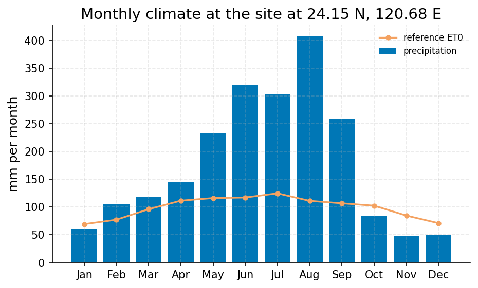
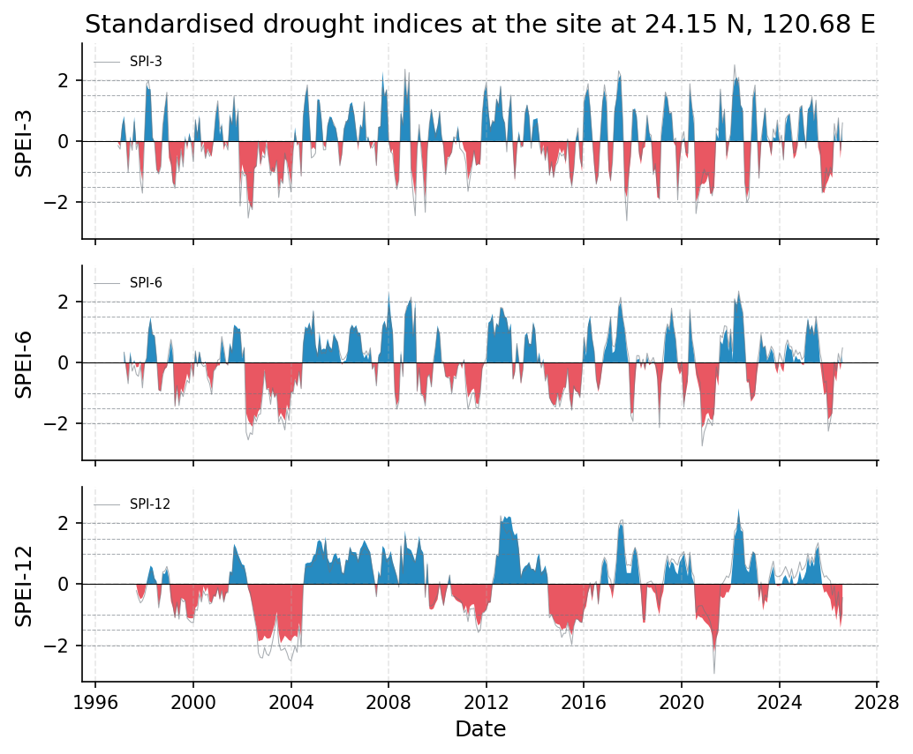

# Taichung Drought Status Assessment for Water-Supply Planning

**Author:** AquaScope Studio  
**Date:** 2026-09-14  
**Description:** assess whether Taichung is currently in drought and how the current dry spell ranks against the historical record, to inform city water-supply planning  
**Data Sources:** BasinATLAS (HydroATLAS v1.0), ERA5 via Open-Meteo, similar_basins, taiwan_cwa  
**Version:** 1.0  

**Site:** 24.1500 N, 120.6800 E

**Answer.** Taichung is not currently in meteorological drought (grade: indicative). At station taiwan_cwa 467490 (Taichung), the 3-month SPI is 0.8692 and the 3-month SPEI is 0.7712, both dated 2026-06-01 and classed near normal. A 29.9-year ERA5-based fallback for the same point shows 12-month SPEI at -0.9586 (2026-08-01), close to but not past the -1.0 drought threshold, while 12-month SPI sits at -0.4401. No genuine worst-on-record ranking could be established: only 10.0 of the claimed 130.7 years of station data were actually served, so the 30-year minimum-record gate failed at every step.

*Key numbers*

| Quantity | Value | Unit | Step |
| --- | --- | --- | --- |
| SPI at 3 months, 2026-06-01 (near normal) | 0.8692 |  | s1 |
| SPEI at 3 months, 2026-06-01 (near normal) | 0.7712 |  | s1 |
| ERA5 temperature trend | 0.1201 | C per decade | s1 |
| ERA5 precipitation | 2138.0 | mm per year | s1.fallback |
| ERA5 reference evapotranspiration | 1188.0 | mm per year | s1.fallback |
| Aridity index | 1.799 |  | s1.fallback |
| Record length | 10.0 | years | s2 |
| Mean of the record | 5.259 | mm | s3 |
| Mann-Kendall p-value (annual mean) | 0.917 |  | s2 |
| Sen's slope | 0.1298 | mm per year | s2 |
| SPI at 3 months, 2026-08-01 (near normal) | 0.604 |  | s2.fallback |
| SPEI at 3 months, 2026-08-01 (near normal) | 0.4415 |  | s2.fallback |
| SPI at 6 months, 2026-08-01 (near normal) | 0.4861 |  | s2.fallback |
| SPEI at 6 months, 2026-08-01 (near normal) | 0.2557 |  | s2.fallback |
| SPI at 12 months, 2026-08-01 (near normal) | -0.4401 |  | s2.fallback |
| SPEI at 12 months, 2026-08-01 (near normal) | -0.9586 |  | s2.fallback |
| ERA5 temperature trend | 0.3986 | C per decade | s2.fallback |

## Summary

The brief asks whether Taichung is in drought now and how the current dry spell ranks against the historical record, for water-supply planning. Using station taiwan_cwa 467490, the served precipitation record covers only 10.0 years (2016-08-31 to 2026-08-30) against the 130.7 years the catalog claims, so the SPI/SPEI and trend calculations could not clear the 30-year minimum-record gate anywhere in the plan. Short-horizon indices (3-month SPI 0.8692, 3-month SPEI 0.7712, both 2026-06-01) read near normal. A gated-out ERA5 fallback (29.9 years) gives 12-month SPEI of -0.9586 for 2026-08-01, close to the -1.0 drought threshold even though the shorter timescales look fine. A Mann-Kendall test on the 9-year annual-mean series found no significant precipitation trend (p=0.917). Grid-cell annual temperature is rising (0.1201 to 0.3986 C per decade depending on window). Because the historical archive was not delivered in full, no defensible worst-on-record comparison exists; all findings are indicative or not established rather than confirmed.

## The decision

Decide with the 3-month SPI of 0.8692 and 3-month SPEI of 0.7712 (station taiwan_cwa 467490, 2026-06-01), both near normal, grade: indicative, band: none assigned. Conditions: the 12-month station index is null (gate failed); the only 12-month reading, SPEI -0.9586 from a 29.9-year ERA5 fallback, sits close to the -1.0 threshold; no groundwater or streamflow record exists at this site, so the read is precipitation/PET-based only. What would change it: serving the full 130.7-year station archive to pass the min_years=30 gate and permit a genuine historical-worst ranking; extending the ERA5 fallback window past 30 years to validate the 12-month SPEI reading; and obtaining groundwater-level or streamflow data to check for a hydrological drought signal relevant to supply.

## Findings

First (indicative): the 3-month SPEI at station taiwan_cwa 467490 is 0.7712 for 2026-06-01, classed near normal, consistent with the 3-month SPI of 0.8692 the same date. Second (indicative): annual-mean temperature at the same grid cell shows warming of 0.1201 C per decade over an 86-year window (n_years=86), while a shorter 29-year ERA5 window gives 0.3986 C per decade, consistent with increasing evaporative demand even where precipitation itself shows no trend. Third (not established): the Mann-Kendall test on 9 years of annual-mean station precipitation found no significant trend (p=0.917, tau=0.0556, Sen's slope 0.1298 mm per year); the record is far short of the 30 years needed for this test to be defensible. Separately, station and ERA5 3-month SPI/SPEI agree qualitatively (both near normal) despite different sources and a two-month date offset, but the 12-month ERA5 SPEI (-0.9586) sits far closer to drought than the 3-month readings, a signature worth watching even though it could not be confirmed against the true historical record.

## Problem and decision

The city needs to know whether Taichung is presently experiencing meteorological drought and, if so, how severe the current dry spell is relative to the full historical record, to inform water-supply planning. This requires current SPI and SPEI values at 3- and 12-month accumulation, a severity classification, and a rank or percentile of the current spell against history, plus its duration.

## Site and data

The site sits at 24.15 N, 120.68 E. The primary record is taiwan_cwa station 467490 (Taichung, 0.6 km from the site), catalogued with 130.7 years of daily precipitation from 1896-01-01, but the archive served only 2016-08-31 to 2026-08-30 (10.0 years, 3244 observations, 121 monthly points). Nearby alternate stations exist in the inventory (taiwan_cwa C0F9U0, C0F970, C0F9T0, C1F970, C0F9N0, each 14.9 to 19.8 years) but were not used in this analysis. An ERA5 grid cell (about 9 km, elevation 94.0 m) served as a secondary source when the station gate failed.

## Methodology

Three steps were run. Drought indices (SPI, SPEI) at 3- and 12-month accumulation were computed on the station series via gamma (SPI) and log-logistic (SPEI) fits per calendar month, with PET from Thornthwaite (1948) using ERA5 temperature. A Mann-Kendall trend test with Sen's slope was applied to annual-mean station precipitation to check for a drying trend. A monthly-resampled precipitation series was pulled from the same station as a supporting view of the recent dry spell's shape. Where the station series failed the 30-year minimum-record gate, fallbacks used an ERA5-only climate summary (aridity index) and an ERA5-based drought_indices run at 3, 6, and 12 months.

## Results: step s1

Step s1 (drought_indices, station taiwan_cwa 467490) failed the min_years gate (9 years served, 30 needed) but returned results. Current 3-month SPI is 0.869246 (near normal, 2026-06-01), worst on record within this short window -1.913553 (2021-04-01, n=30, 4 events). Current 3-month SPEI is 0.771194 (near normal, same date), worst -1.619428 (2026-01-01, n=30, 4 events). 12-month values are null (unknown class). Status: normal, not in drought. The fallback anywhere-tool call (86 years, ERA5) gave annual precipitation 2137.54 mm/year, ET0 1188.1609 mm/year, aridity index 1.799 (humid class), wettest day 520.2 mm.


*SPEI (bars) with SPI (grey line) at taiwan_cwa 467490 for the 3 month accumulations, 2016 to 2026: blue above zero is wetter than normal, red below is drier; the dashed lines mark the moderate (1), severe (1.5) and extreme (2) classes.*


*Mean monthly precipitation (bars) and FAO-56 reference evapotranspiration (line) for the ERA5 cell at the site at 24.15 N, 120.68 E, 86 years ending 2026-09-07.*

*Monthly SPI and SPEI at taiwan_cwa 467490 per timescale.*

| date | spi_3 | spei_3 |
| --- | --- | --- |
| 2017-01-01 | 0.498551508398566 | 0.2340424399744356 |
| 2017-04-01 | -0.2925782463041896 | -0.3872847320049237 |
| 2017-06-01 | 1.303622750862473 | 1.3357054716781949 |
| 2018-01-01 | 1.6806362288603036 | 1.2994410874498394 |
| 2018-04-01 | -1.26822646921629 | -1.0449794224347393 |
| 2018-06-01 | -1.3990434961138796 | -1.322357995325491 |
| 2019-01-01 | -1.1751179193900925 | -0.9294345352254548 |
| 2019-04-01 | 1.155184969336892 | 0.8918531679802831 |
| 2019-06-01 | 1.3415223887487695 | 1.3473324046854531 |
| 2020-01-01 | 0.977179594446586 | 0.9920622503627938 |
| 2020-04-01 | -0.8168182388081486 | -0.8760851799804744 |
| 2020-06-01 | -0.411423200609631 | -0.4817517986814071 |
| 2021-01-01 | -0.3207969838455196 | -0.3075274714327546 |
| 2021-04-01 | -1.9135526646674423 | -1.5894282993333153 |
| 2021-06-01 | 0.7248785609387821 | 0.5467884489286564 |
| 2022-01-01 | -0.2016669786692962 | 0.0624305101705407 |
| 2022-04-01 | 1.2027601202600453 | 1.4602350075616677 |
| 2022-06-01 | 0.3224541961648917 | 0.3936632595176085 |
| 2023-01-01 | -0.5833836886404046 | -0.2499707454117848 |
| 2023-04-01 | 0.3497211796943849 | 0.0467667300745486 |
| 2023-06-01 | -0.4918843318137119 | -0.5196427289767589 |
| 2024-01-01 | 0.1634900225004868 | -0.881685670256675 |
| 2024-04-01 | 0.1956738099591957 | -0.0701558301429903 |
| 2024-06-01 | -1.4411840293265452 | -1.0305606124281337 |
| 2025-01-01 | 0.8236798020856329 | 1.21189270674429 |
| 2025-04-01 | 0.8476268898937287 | 0.942601489319852 |
| 2025-06-01 | -0.818149711507001 | -0.8960982917559186 |
| 2026-01-01 | -1.846182353341342 | -1.6194284511161805 |
| 2026-04-01 | 0.5727093030888613 | 0.3714841072576548 |
| 2026-06-01 | 0.8692457515597174 | 0.7711936782365942 |

*Drought classes, worst months and event counts per timescale at taiwan_cwa 467490.*

| timescale | index | current | class | date | worst | worst_date | events | n |
| --- | --- | --- | --- | --- | --- | --- | --- | --- |
| 3 | SPI | 0.8692457515597174 | normal | 2026-06-01 | -1.9135526646674423 | 2021-04-01 | 4.0 | 30 |
| 3 | SPEI | 0.7711936782365942 | normal | 2026-06-01 | -1.6194284511161805 | 2026-01-01 | 4.0 | 30 |
| 12 | SPI |  | unknown |  |  |  |  | 0 |
| 12 | SPEI |  | unknown |  |  |  |  | 0 |

*Divergence between SPEI and SPI per timescale at taiwan_cwa 467490.*

| timescale | current | mean_last_10y | months_spei_drier_pct | correlation | n |
| --- | --- | --- | --- | --- | --- |
| 3 | -0.0980520733231231 | -0.011594258970347 | 46.666666666666664 | 0.9579703592602824 | 30 |

*Mean monthly precipitation and reference evapotranspiration for the ERA5 cell at the site at 24.15 N, 120.68 E.*

| month | precipitation_mm | et0_mm |
| --- | --- | --- |
| 1 | 60.872 | 69.2536 |
| 2 | 105.2605 | 77.2361 |
| 3 | 118.1211 | 96.1883 |
| 4 | 145.5008 | 111.5945 |
| 5 | 233.8731 | 116.2915 |
| 6 | 320.0766 | 117.3156 |
| 7 | 303.3815 | 124.7926 |
| 8 | 407.1333 | 111.2451 |
| 9 | 258.8438 | 106.8628 |
| 10 | 83.7294 | 102.5334 |
| 11 | 47.9501 | 84.6757 |
| 12 | 49.461 | 71.0019 |

## Results: step s2

Step s2 (analyze_station, station taiwan_cwa 467490, precipitation) also failed its min_years gate (10 years served, 30 needed). Stats: mean 5.2589 mm, median 0.0 mm, max 375.0 mm (n=3244). Mann-Kendall trend on annual means: p=0.917, tau=0.0556, Sen's slope 0.1298 mm/year, classed 'no trend' (9 years). The fallback drought_indices run (ERA5, requested 30 years, actual 29.9 years, 1996-10-01 to 2026-08-01) itself failed its own min_years gate but returned: SPI3 0.604044, SPEI3 0.44152 (2026-08-01, both near normal); SPI6 0.486149, SPEI6 0.25568; SPI12 -0.440107, SPEI12 -0.958638. Status: normal, not in drought.


*Daily precipitation at 臺中 (taiwan_cwa 467490), 2016 to 2026, with the annual maxima marked.*


*Annual mean precipitation at 臺中 (taiwan_cwa 467490) with the Sen slope line; the Mann-Kendall test finds no trend (p = 0.917, 9 years).*


*SPEI (bars) with SPI (grey line) at the site at 24.15 N, 120.68 E for the 3, 6, 12 month accumulations, 1996 to 2026: blue above zero is wetter than normal, red below is drier; the dashed lines mark the moderate (1), severe (1.5) and extreme (2) classes.*

*The record (3244 rows) is in the workbook (`workbook.xlsx`, sheet `s2_series`) and the notebook, not printed here.*

*Summary of the record at 臺中 (taiwan_cwa 467490).*

| item | value |
| --- | --- |
| source | taiwan_cwa |
| station_id | 467490 |
| variable | precipitation |
| unit | mm |
| n | 3244 |
| start | 2016-08-31 |
| end | 2026-08-30 |
| years | 10.0 |
| stats.mean | 5.2589 |
| stats.median | 0.0 |
| stats.min | 0.0 |
| stats.max | 375.0 |

*Annual maxima at 臺中 (taiwan_cwa 467490).*

| year | value |
| --- | --- |
| 2017 | 171.5 |
| 2018 | 70.5 |
| 2019 | 175.5 |
| 2020 | 99.0 |
| 2021 | 204.5 |
| 2022 | 168.0 |
| 2023 | 137.0 |
| 2024 | 270.0 |
| 2025 | 375.0 |

*Mann-Kendall trend test and Sen slope at 臺中 (taiwan_cwa 467490).*

| item | value |
| --- | --- |
| on | annual mean |
| p_value | 0.917 |
| tau | 0.0556 |
| trend | no trend |
| sens_slope_per_year | 0.1298 |
| n_years | 9 |

*Monthly SPI and SPEI at the site at 24.15 N, 120.68 E per timescale.*

| date | spi_3 | spei_3 | spi_6 | spei_6 | spi_12 | spei_12 |
| --- | --- | --- | --- | --- | --- | --- |
| 1996-12-01 | -0.1425850919350464 | -0.0526030091161621 |  |  |  |  |
| 1997-01-01 | -0.258313018607089 | -0.1525034291158806 |  |  |  |  |
| 1997-02-01 | 0.4483945976506548 | 0.5571823472041549 |  |  |  |  |
| 1997-03-01 | 0.6648723817166279 | 0.8298160561874722 | 0.3368165686215326 | 0.3957641943153109 |  |  |
| 1997-04-01 | 0.0490347884330314 | -0.0247369927325721 | -0.1477680695831062 | -0.2001170674292634 |  |  |
| 1997-05-01 | -1.0159885810513305 | -0.939945634746994 | -0.6870662654428148 | -0.6053951952071934 |  |  |
| 1997-06-01 | -0.0156833904153544 | 0.1659225047444977 | 0.2099875252457556 | 0.3653786499353643 |  |  |
| 1997-07-01 | -0.2979864067463139 | -0.195379093360725 | -0.2754726637965499 | -0.0881160642907657 |  |  |
| 1997-08-01 | 0.63906246268013 | 0.8008251571506039 | -0.0895252153370306 | 0.0865846972949791 |  |  |
| 1997-09-01 | -0.2707260295468586 | -0.113261170835237 | -0.3829622503615795 | -0.14901472896707 | -0.2122142690542199 | -0.0430062359469113 |
| 1997-10-01 | 0.0019291296197818 | -0.0677753764485742 | -0.4444632700459409 | -0.1380706667224285 | -0.4472449195491613 | -0.3447128557714563 |
| 1997-11-01 | -1.2863190309644952 | -0.9022798295249328 | -0.0906588944284092 | 0.073089496182333 | -0.6151982390957973 | -0.4893888312490336 |
| 1997-12-01 | -1.7017843323248616 | -1.3055333243189668 | -0.8252689562075002 | -0.6241621256575669 | -0.5383100389109691 | -0.4382840028687151 |
| 1998-01-01 | 0.1611505136719772 | 0.2024815207756297 | -0.037003969900933 | -0.0785343972564832 | -0.3673302997410123 | -0.2695361514672323 |
| 1998-02-01 | 1.8814299333374227 | 1.8472365412169856 | 0.1455952949864596 | 0.154211254263014 | -0.060055405200648 | 0.0554768861171227 |
| 1998-03-01 | 1.9737220927344483 | 1.710908982825114 | 1.0058144904741284 | 1.0900189161436613 | 0.1247678442507369 | 0.3279676299549435 |
| 1998-04-01 | 1.534586438082502 | 1.7045954520398163 | 1.340127476859931 | 1.4985195861459284 | 0.410591392776858 | 0.6093568773990735 |
| 1998-05-01 | 0.1022264054816376 | 0.1287057224564643 | 0.920984526817592 | 0.9306926192244483 | 0.4183917569830837 | 0.5352034460898922 |
| 1998-06-01 | -0.0599489171958537 | -0.0249792209716628 | 0.841958450774023 | 0.8930252460600763 | 0.0775937498182985 | 0.1959995626327351 |
| 1998-07-01 | -0.916631329140238 | -0.9337972485354448 | 0.1539243284704879 | 0.1973369663717575 | 0.0362796714434791 | 0.0935750254026833 |
| 1998-08-01 | -1.0720686238849038 | -1.035431591517247 | -0.8731055563915794 | -0.9102272041908562 | -0.7739696484480241 | -0.6866594154852766 |
| 1998-09-01 | -0.8448579355540066 | -0.8135074101086404 | -0.935254070557381 | -0.9230487672603216 | -0.305958778382553 | -0.356605225428682 |
| 1998-10-01 | 0.5200393193005176 | 0.4349207744762046 | -0.4295095769522493 | -0.3739797874850369 | 0.3994133937880538 | 0.3559392058014222 |
| 1998-11-01 | 1.0727799589464488 | 1.1073085089956427 | -0.1568591634211676 | -0.21802873353087 | 0.427038363497591 | 0.3367932911182286 |
| 1998-12-01 | 1.6056469660696286 | 1.5344805840887037 | -0.104122873905045 | -0.1512449775477163 | 0.5822071093557935 | 0.5112351653079681 |
| 1999-01-01 | -0.2570478901348312 | -0.5331438626698651 | 0.3874428982719463 | 0.1832830007758128 | 0.3273149082846116 | 0.189735763196431 |
| 1999-02-01 | -0.5890631483757592 | -0.7791702361230963 | 0.7641510418479247 | 0.6833097955194664 | -0.3708224419833239 | -0.5625647321168504 |
| 1999-03-01 | -1.311813695202111 | -1.3721190548827196 | 0.4180414964183413 | 0.2224004004658877 | -0.6614430290443395 | -0.7651878296572532 |
| 1999-04-01 | -1.545018960520718 | -1.442397205657839 | -1.4224393644568178 | -1.4622689893816072 | -1.0989894241350568 | -1.1222780961609002 |
| 1999-05-01 | -0.5132850021194516 | -0.445630450684059 | -0.7483242211461748 | -0.8092335509771775 | -0.5900776657255662 | -0.6911194493530654 |
| 1999-06-01 | -1.00189961962523 | -0.9228870830012458 | -1.4070226645644477 | -1.325664061764769 | -1.146367267232196 | -1.0690086063180508 |
| 1999-07-01 | -0.2868150475745789 | -0.2134210272394111 | -0.934980000657382 | -0.8399496141864358 | -0.4535189072770255 | -0.4570713848262308 |
| 1999-08-01 | -0.8393525144311034 | -0.7568427850685557 | -1.1114943231866623 | -0.9960433007863706 | -0.5787852642572993 | -0.4773744452825512 |
| 1999-09-01 | 0.0582236293965123 | 0.1872995746706955 | -0.8456953484799471 | -0.6833554263295828 | -0.530192387830385 | -0.5461468866725051 |
| 1999-10-01 | -0.1436174981262381 | -0.2827724840753709 | -0.5777136578778612 | -0.3541725826262183 | -1.116898175965325 | -1.089521363786658 |
| 1999-11-01 | 0.1522219436388973 | 0.2778094598724822 | -0.6646233945263841 | -0.5927385772500009 | -1.1913392761559494 | -1.1150358924151345 |
| 1999-12-01 | -0.1122775240289826 | 0.0111625708596255 | -0.0659851316997254 | 0.0602461447204223 | -1.2545460522451228 | -1.121118474750622 |
| 2000-01-01 | -0.6763219083540494 | -0.5472067409689215 | -0.4478896880864495 | -0.514124949986271 | -1.2554698248989626 | -1.1108277511271958 |
| 2000-02-01 | 0.7013269185698535 | 0.7430999674614718 | 0.3868561816079541 | 0.3923640706115676 | -0.8284053866279961 | -0.771109178423111 |
| 2000-03-01 | 0.0987475107164002 | 0.279622029786597 | -0.1242823861084282 | -0.1010648910033987 | -0.859991709940378 | -0.7030618481933025 |
| 2000-04-01 | 0.7618897582463524 | 0.8563282036616529 | 0.3427398654767467 | 0.3799849931727017 | -0.3255242051264765 | -0.1880233615283067 |
| 2000-05-01 | -0.3410413681272848 | -0.2187571145072431 | -0.0363725517963113 | 0.0376911754178806 | -0.5867526942656172 | -0.546636505284894 |
| 2000-06-01 | -0.1261973683102992 | -0.006508961608116 | -0.1253320008662433 | -0.0536518444165981 | -0.2197794483764413 | -0.0635442410950594 |
| 2000-07-01 | -0.5626723695775819 | -0.5471562292804627 | -0.0895026271690818 | 0.0470722624682124 | -0.3671350551535442 | -0.2579700821771302 |
| 2000-08-01 | -0.2722810333935533 | -0.2351266448917099 | -0.5276604486271602 | -0.4228553377672281 | -0.3243450928459243 | -0.0946103357345593 |
| 2000-09-01 | -0.4959661474419631 | -0.3869887860703904 | -0.6859155921471584 | -0.5392646692410158 | -0.6492248614454839 | -0.5641514263724953 |
| 2000-10-01 | -0.3508196925830267 | -0.5097123180338441 | -1.0395626368707005 | -0.8724181928539464 | -0.616599025732381 | -0.6135325424773463 |
| 2000-11-01 | 0.0572995778731737 | 0.1119588233908837 | -0.2695494627676486 | -0.2702627075907076 | -0.3613109267831658 | -0.3956090229925561 |
| 2000-12-01 | 0.8689424171983327 | 0.8234551910023883 | -0.1961809899486271 | -0.1669674389108865 | -0.360629166087926 | -0.4190772931237337 |
| 2001-01-01 | 1.327014455134801 | 1.2454189891491976 | 0.0855266082974257 | -0.0911666756751996 | -0.1114855889256286 | -0.1563837756001371 |

*Drought classes, worst months and event counts per timescale at the site at 24.15 N, 120.68 E.*

| timescale | index | current | class | date | worst | worst_date | events | n |
| --- | --- | --- | --- | --- | --- | --- | --- | --- |
| 3 | SPI | 0.6040441457252673 | normal | 2026-08-01 | -2.605126733204464 | 2017-10-01 | 33 | 357 |
| 3 | SPEI | 0.4415203206611539 | normal | 2026-08-01 | -2.1877688443123793 | 2002-06-01 | 29 | 357 |
| 6 | SPI | 0.4861488066022635 | normal | 2026-08-01 | -2.7305950204693934 | 2020-11-01 | 23 | 354 |
| 6 | SPEI | 0.2556800875113086 | normal | 2026-08-01 | -2.130829110744777 | 2020-11-01 | 19 | 354 |
| 12 | SPI | -0.4401072722587834 | normal | 2026-08-01 | -2.9331077753407357 | 2021-05-01 | 11 | 348 |
| 12 | SPEI | -0.9586380903710976 | normal | 2026-08-01 | -2.227074592063605 | 2021-05-01 | 13 | 348 |

*Divergence between SPEI and SPI per timescale at the site at 24.15 N, 120.68 E.*

| timescale | current | mean_last_10y | months_spei_drier_pct | correlation | n |
| --- | --- | --- | --- | --- | --- |
| 3 | -0.1625238250641134 | -0.0788869223329824 | 70.83333333333334 | 0.9859689463189736 | 357 |
| 6 | -0.2304687190909549 | -0.1089652736805637 | 82.5 | 0.9867460851428792 | 354 |
| 12 | -0.518530818112314 | -0.2212151013477776 | 95.83333333333334 | 0.974268191510913 | 348 |

## Results: step s3

Step s3 (get_timeseries, station taiwan_cwa 467490, precipitation, monthly resample) passed both gates. It covers 2016-08-31 to 2026-08-30, 3244 daily observations resampled to 121 monthly points, mean 5.258909 mm, min 0.0 mm, max 375.0 mm. This confirms the same short 10-year window underlying the index calculations and offers no independent extension of the historical record.


*Monthly precipitation at 臺中 (taiwan_cwa 467490), 2016 to 2026.*

*The record (121 rows) is in the workbook (`workbook.xlsx`, sheet `s3_series`) and the notebook, not printed here.*

## Limitations and what this study does not establish

The indices are monthly and cannot resolve sub-monthly or flash-drought dynamics; flash drought was out of scope by intake setting. SPI and SPEI quantify how unusual the current deficit is against the record actually served, not its cause, and do not translate directly to reservoir yield. The station's claimed 130.7-year history was not delivered: only 10.0 years were served, so every min_years=30 gate failed, and no true worst-on-record ranking exists. SPEI's PET is a temperature-only Thornthwaite approximation from ERA5, not the more defensible FAO-56 Penman-Monteith. The 12-month reading rests entirely on a 29.9-year ERA5 grid-cell fallback (about 9 km resolution), not the station gauge. No groundwater or streamflow record was available to cross-check a hydrological drought signal.

## What this study does not establish

- Step s1, gate min_years: 9 years of record, 30 needed: too short
- Step s2, gate min_years: 10 years of record, 30 needed: too short
- Step s2.fallback, gate min_years: no record length at 'years'

## Caveats

- Monthly resolution: the indices see droughts a month and longer; what happened this week is not in them, and a flash drought is out of their reach.
- SPI and SPEI say how unusual a deficit is against this record; they say nothing about its cause, and the SPI-to-SGI lag is a statistical association read off the two series, not a model of the aquifer.
- SPEI needs a PET series: here PET is Thornthwaite (1948) from ERA5 temperature, a temperature-only approximation and the formulation SPEI was introduced with; FAO-56 Penman-Monteith is the better PET where humidity, wind and radiation exist.

## Recommendations

Adopt the near-normal reading at 3-month SPI 0.8692 and SPEI 0.7712 (station taiwan_cwa 467490, 2026-06-01) as the current status, but treat it as indicative, not confirmed, given the short served record. Watch the 12-month SPEI of -0.9586 (ERA5 fallback, 2026-08-01), which sits close to the drought threshold even while short-term indices look fine. Do not act on any worst-on-record ranking; none is established. To firm this up, obtain the full 130.7-year station archive to pass the min_years gate and permit an actual historical ranking, extend the ERA5 window past 30 years to validate the 12-month reading, and acquire groundwater-level or streamflow data for a hydrological cross-check relevant to supply.

## References

1. Vicente-Serrano et al. (2010)
2. Mann, H. B. (1945). Nonparametric tests against trend. Econometrica, 13, 245-259
3. Kendall (1975)
4. Sen, P. K. (1968). J. Am. Stat. Assoc., 63, 1379-1389.
5. McKee, T. B., Doesken, N. J., & Kleist, J. (1993). The relationship of drought frequency and duration to time scales. Proc. 8th Conf. on Applied Climatology, 179-184.
6. WMO (2012). Standardized Precipitation Index User Guide (Svoboda, Hayes, Wood). WMO-No. 1090.
7. Vicente-Serrano, S. M., Begueria, S., & Lopez-Moreno, J. I. (2010). A multiscalar drought index sensitive to global warming: the Standardized Precipitation Evapotranspiration Index. J. Climate 23, 1696-1718. doi:10.1175/2009JCLI2909.1; Begueria, S. et al. (2014). SPEI revisited: parameter fitting, evapotranspiration models, tools, datasets and drought monitoring. Int. J. Climatol. 34, 3001-3023. doi:10.1002/joc.3887
8. Thornthwaite, C. W. (1948). An approach toward a rational classification of climate. Geographical Review 38, 55-94.
9. Hersbach, H. et al. (2020). The ERA5 global reanalysis. Q. J. R. Meteorol. Soc., 146, 1999-2049
10. Open-Meteo.com (CC BY 4.0).
11. Allen, R. G., Pereira, L. S., Raes, D., & Smith, M. (1998). Crop evapotranspiration. FAO Irrigation and Drainage Paper 56.
12. Begueria, S., Vicente-Serrano, S. M., Reig, F., & Latorre, B. (2014). Standardized precipitation evapotranspiration index (SPEI) revisited. Int. J. Climatol. 34, 3001-3023. doi:10.1002/joc.3887
13. Bloomfield, J. P., & Marchant, B. P. (2013). Analysis of groundwater drought building on the standardised precipitation index approach. Hydrol. Earth Syst. Sci. 17, 4769-4787.
14. SPI against SPEI at 219 stations across Turkiye: Earth Science Informatics (2024), doi:10.1007/s12145-024-01401-8
15. SPI-SPEI correlation under warming in Umbria: Environ. Sci. Pollut. Res. (2024), doi:10.1007/s11356-024-35740-2
16. Rekin226 and contributors (2026). AquaScope: Open-source water data aggregation toolkit (version 0.16.0) [Software]. Zenodo. https://doi.org/10.5281/zenodo.21903143

## Appendix: reproducibility

Re-run the same steps with no model: `aquascope run study.yaml`. Resume the workspace: `aquascope studio --resume workspace.json`.

Model: claude-sonnet-5 via anthropic; ledger: consultant 1 call(s), 4030 tokens, methodologist 1 call(s), 16365 tokens, analyst 1 call(s), 7146 tokens, interpreter 1 call(s), 20150 tokens, author 1 call(s), 19979 tokens, critic 1 call(s), 16370 tokens. aquascope 0.16.0.

```yaml
# An AquaScope study (version 3): the plan behind an answer, its gates, and what happened.
#   aquascope run study.yaml
version: 3
title: "Determine whether Taichung is currently in meteorological dr: 24.15, 120.68"
question: "Is Taichung in drought now, and how does this dry spell compare with the worst on record? It matters for the city's water supply."
created: "2026-09-14T21:29:53+00:00"
aquascope_version: "0.16.0"
author: "methodologist"
model: "claude-sonnet-5"
problem:
  kind: "drought"
  site: {"lat": 24.15, "lon": 120.68}
  params: {"timescales": [3, 12], "drought_concern": "water supply", "flash_drought": false}
  text: "Is Taichung in drought now, and how does this dry spell compare with the worst on record? It matters for the city's water supply."
plan:
  author: "methodologist"
  playbook: "drought_status"
  objective: "Determine whether Taichung is currently in meteorological drought and how the present dry spell ranks against the full historical record, framed for city water-supply planning."
  decision: "assess whether Taichung is currently in drought and how the current dry spell ranks against the historical record, to inform city water-supply planning"
  methodology: ["Compute SPI and SPEI at 3-month and 12-month accumulation on the 130.7-year Taichung station precipitation record to get the current index values, severity classification, and the drought-events catalogue that ranks the current dry spell against history.", "Check the long-term precipitation record at the same station for a significant monotonic trend, since a drying trend changes how a water utility should read the current anomaly.", "Pull the station's monthly-resampled precipitation series as a supporting record of the recent dry spell's shape and duration."]
  assumptions: ["primary precipitation record is taiwan_cwa station 467490 (Taichung), 0.6 km from the site, with 130.7 years of daily data", "daily resolution is assumed for the precipitation record since the catalog does not state it explicitly", "flash_drought left at the playbook default (false) since the text does not describe a rapid-onset event", "SPEI uses FAO-56 ET0 computed from ERA5-derived forcing, assumed reachable for this point though not directly checked", "worst-on-record comparison drawn from the same 130.7-year station series", "Primary precipitation record is taiwan_cwa station 467490 (Taichung), 0.6 km from the site, with 130.7 years of daily data, treated as the water-supply-relevant record.", "Daily resolution is assumed for the precipitation record since the catalog does not state it explicitly.", "SPEI's PET is computed from ERA5-derived temperature per the tool's default (Thornthwaite formulation), since no local FAO-56 humidity/wind/radiation forcing is confirmed reachable for this exact point.", "Flash-drought detection is out of scope: the intake sets flash_drought to false and the indices are monthly, not sub-monthly.", "Worst-on-record comparison and severity classification are drawn from the same 130.7-year station series via the drought-events catalogue, not from a separate percentile computation."]
  alternatives: [{"method": "spei_reanalysis via anywhere/ERA5", "why_not": "Used only as a fallback if the 130.7-year station record fails its sufficiency gates; the station record is longer and more locally representative."}, {"method": "sgi (groundwater drought)", "why_not": "not_defensible per the sufficiency table: no groundwater level record at this site, and the brief explicitly excludes groundwater drought."}, {"method": "low_flow_frequency / baseflow_separation", "why_not": "not_defensible per the sufficiency table: no discharge record at this site, and the decision concerns city water supply broadly, not a specific gauged stream."}]
  limitations_expected: ["The indices are monthly: they see droughts a month and longer, and cannot resolve sub-monthly or flash-drought dynamics.", "SPI and SPEI quantify how unusual the current deficit is against this 130.7-year record; they do not explain its cause or directly translate to reservoir yield or supply reliability.", "SPEI's PET here is a temperature-only Thornthwaite approximation from ERA5 forcing rather than full FAO-56 Penman-Monteith, which is the more defensible PET where humidity, wind and radiation data exist.", "The historical ranking is only as complete as the 130.7-year station series; earlier gaps or homogeneity issues in the very long record are not separately checked here."]
  citations: ["McKee, T. B., Doesken, N. J., & Kleist, J. (1993). The relationship of drought frequency and duration to time scales. Proc. 8th Conf. on Applied Climatology, 179-184.", "Vicente-Serrano, S. M., Begueria, S., & Lopez-Moreno, J. I. (2010). A multiscalar drought index sensitive to global warming: the Standardized Precipitation Evapotranspiration Index. J. Climate 23, 1696-1718. doi:10.1175/2009JCLI2909.1", "Begueria, S., Vicente-Serrano, S. M., Reig, F., & Latorre, B. (2014). Standardized precipitation evapotranspiration index (SPEI) revisited. Int. J. Climatol. 34, 3001-3023. doi:10.1002/joc.3887", "Thornthwaite, C. W. (1948). An approach toward a rational classification of climate. Geographical Review 38, 55-94.", "Bloomfield, J. P., & Marchant, B. P. (2013). Analysis of groundwater drought building on the standardised precipitation index approach. Hydrol. Earth Syst. Sci. 17, 4769-4787.", "WMO (2012). Standardized Precipitation Index User Guide (Svoboda, Hayes, Wood). WMO-No. 1090.", "SPI against SPEI at 219 stations across Turkiye: Earth Science Informatics (2024), doi:10.1007/s12145-024-01401-8", "SPI-SPEI correlation under warming in Umbria: Environ. Sci. Pollut. Res. (2024), doi:10.1007/s11356-024-35740-2", "Hersbach, H. et al. (2020). The ERA5 global reanalysis. Q. J. R. Meteorol. Soc. 146, 1999-2049.", "Thornthwaite (1948)"]
  caveats: ["Monthly resolution: the indices see droughts a month and longer; what happened this week is not in them, and a flash drought is out of their reach.", "SPI and SPEI say how unusual a deficit is against this record; they say nothing about its cause, and the SPI-to-SGI lag is a statistical association read off the two series, not a model of the aquifer.", "SPEI needs a PET series: here PET is Thornthwaite (1948) from ERA5 temperature, a temperature-only approximation and the formulation SPEI was introduced with; FAO-56 Penman-Monteith is the better PET where humidity, wind and radiation exist."]
  rationale: "Determine whether Taichung is currently in meteorological drought and how the present dry spell ranks against the full historical record, framed for city water-supply planning."
  recon_notes: ["Record resolution is not in the catalog; daily is assumed for every variable.", "10 donor gauges from a pool of 34,786 gauged catchments.", "ERA5 temperature and forcing and GloFAS discharge are assumed reachable for any point on land (Open-Meteo); not checked here.", "CMIP6 change factors need model output you supply (aquascope.climate works on downloaded data); not counted."]
  replans: [{"step": "s2", "reason": "gate failed: min_years (10 years of record, 30 needed: too short)", "fallback": {"tool": "drought_indices", "arguments": {"lat": 24.15, "lon": 120.68, "years": 30, "timescales": [3, 6, 12], "source": "era5", "pet": "hargreaves"}, "rationale": "The Taichung CWA station (467490) only has a 10-year continuous precipitation record (need 30), so switch to the ERA5 reanalysis grid cell at the site coordinates, which can supply the multi-decadal monthly SPI/SPEI series needed to judge current drought severity against the historical worst case.", "expects": [{"check": "not_empty", "path": "indices"}, {"check": "not_empty", "path": "current.spi"}, {"check": "not_empty", "path": "current.spei"}, {"check": "min_years", "path": "years"}]}}]
steps:
  - tool: "drought_indices"
    id: "s1"
    rationale: "SPI and SPEI at 3 and 12 months on the 130.7-year Taichung gauge give the current value and class of each, the drought-events catalogue for ranking the current spell against the full record, and its duration."
    method: "spei"
    arguments:
      lat: 24.15
      lon: 120.68
      source: "taiwan_cwa"
      station_id: "467490"
      timescales: [3, 12]
      years: 130
    expects:
      - {"check": "min_years", "path": "years", "value": 30}
      - {"check": "not_empty", "path": "indices"}
      - {"check": "not_empty", "path": "current.spi"}
      - {"check": "not_empty", "path": "current.spei"}
    fallback: {"step": {"tool": "anywhere", "arguments": {"lat": 24.15, "lon": 120.68, "years": 86}, "rationale": "If the station record fails its gates, fall back to ERA5-derived SPEI (spei_reanalysis) for the same point, labelled as the reanalysis cell's.", "expects": []}}
    outputs: [{"kind": "figure", "id": "s1_drought_strip", "caption": "SPI/SPEI drought strip at 3 and 12 months, Taichung station 467490"}, {"kind": "table", "id": "s1_indices_monthly", "caption": "Monthly SPI and SPEI values, 3 and 12 month timescales"}, {"kind": "table", "id": "s1_drought_events", "caption": "Historical drought events with severity, duration and rank, used to place the current dry spell against the full record"}]
  - tool: "analyze_station"
    id: "s2"
    rationale: "A Mann-Kendall trend test on the 130.7-year precipitation record shows whether the city's rainfall is trending drier, which bears on how the current anomaly should be weighted for supply planning."
    method: "trend_mann_kendall"
    arguments:
      source: "taiwan_cwa"
      station_id: "467490"
      variable: "precipitation"
      years: 130
    expects:
      - {"check": "not_empty", "path": "trend"}
      - {"check": "min_years", "path": "years", "value": 30}
    fallback: {"step": {"tool": "drought_indices", "arguments": {"lat": 24.15, "lon": 120.68, "years": 30, "timescales": [3, 6, 12], "source": "era5", "pet": "hargreaves"}, "rationale": "The Taichung CWA station (467490) only has a 10-year continuous precipitation record (need 30), so switch to the ERA5 reanalysis grid cell at the site coordinates, which can supply the multi-decadal monthly SPI/SPEI series needed to judge current drought severity against the historical worst case.", "expects": [{"check": "not_empty", "path": "indices"}, {"check": "not_empty", "path": "current.spi"}, {"check": "not_empty", "path": "current.spei"}, {"check": "min_years", "path": "years"}]}}
    outputs: [{"kind": "table", "id": "s2_trend", "caption": "Mann-Kendall trend statistic and p-value on the Taichung precipitation record"}]
  - tool: "get_timeseries"
    id: "s3"
    rationale: "The monthly precipitation series underlying the indices gives a plain view of the recent dry spell's magnitude and duration alongside the SPI/SPEI classification."
    arguments:
      source: "taiwan_cwa"
      station_id: "467490"
      variable: "precipitation"
      resample: "M"
      years: 130
    expects:
      - {"check": "not_empty", "path": "points"}
      - {"check": "unit_present", "path": "unit"}
    outputs: [{"kind": "figure", "id": "s3_monthly_precip", "caption": "Monthly precipitation totals, Taichung station 467490, full record"}]
results:
  s1: {"ok": true, "gates": [{"check": "min_years", "passed": false, "detail": "9 years of record, 30 needed: too short"}, {"check": "not_empty", "passed": true, "detail": "'indices' is present"}, {"check": "not_empty", "passed": true, "detail": "'current.spi' is present"}, {"check": "not_empty", "passed": true, "detail": "'current.spei' is present"}], "summary": "years=9.0, start=2016-09-01, end=2026-08-01", "fallback_used": true, "sha256": "52cccc45099e2eba", "fallback": {"tool": "anywhere", "arguments": {"lat": 24.15, "lon": 120.68, "years": 86}, "ok": true, "gates": [], "summary": "years=86, start=1940-09-07, end=2026-09-07"}}
  s2: {"ok": true, "gates": [{"check": "not_empty", "passed": true, "detail": "'trend' is present"}, {"check": "min_years", "passed": false, "detail": "10 years of record, 30 needed: too short"}], "summary": "source=taiwan_cwa, station_id=467490, variable=precipitation, unit=mm, years=10.0, start=2016-08-31, end=2026-08-30", "fallback_used": true, "sha256": "870a1631a04b293c", "failed_reason": "gate failed: min_years (10 years of record, 30 needed: too short); the fallback drought_indices did not pass its own gates", "fallback": {"tool": "drought_indices", "arguments": {"lat": 24.15, "lon": 120.68, "years": 30, "timescales": [3, 6, 12], "source": "era5", "pet": "hargreaves"}, "ok": true, "gates": [{"check": "not_empty", "passed": true, "detail": "'indices' is present"}, {"check": "not_empty", "passed": true, "detail": "'current.spi' is present"}, {"check": "not_empty", "passed": true, "detail": "'current.spei' is present"}, {"check": "min_years", "passed": false, "detail": "no record length at 'years'"}], "summary": "years=29.9, start=1996-10-01, end=2026-08-01"}}
  s3: {"ok": true, "gates": [{"check": "not_empty", "passed": true, "detail": "'points' is present"}, {"check": "unit_present", "passed": true, "detail": "unit mm"}], "summary": "source=taiwan_cwa, station_id=467490, name=\u81fa\u4e2d, variable=precipitation, unit=mm, start=2016-08-31, end=2026-08-30", "fallback_used": false, "sha256": "3bfd3801c94715a9"}
```

## Cite this software

AquaScope Studio (2026). AquaScope: Open-source water data aggregation toolkit (version 0.16.0) [Software]. Zenodo. https://doi.org/10.5281/zenodo.21903143


---

*{'model': 'claude-sonnet-5', 'provider': 'anthropic', 'prose': 'model', 'tokens': {'consultant': {'calls': 1, 'prompt_tokens': 3317, 'completion_tokens': 713, 'cost_usd': 0.013764}, 'methodologist': {'calls': 1, 'prompt_tokens': 12566, 'completion_tokens': 3799, 'cost_usd': 0.063122}, 'analyst': {'calls': 1, 'prompt_tokens': 4029, 'completion_tokens': 3117, 'cost_usd': 0.039228}, 'interpreter': {'calls': 1, 'prompt_tokens': 10975, 'completion_tokens': 9175, 'cost_usd': 0.1137}, 'author': {'calls': 2, 'prompt_tokens': 30467, 'completion_tokens': 10922, 'cost_usd': 0.170154}, 'critic': {'calls': 1, 'prompt_tokens': 8181, 'completion_tokens': 8189, 'cost_usd': 0.098252}}, 'total_tokens': 105450, 'total_usd': 0.49822, 'budget': None, 'dropped': 3, 'aquascope_version': '0.16.0', 'date': '2026-09-14 21:36 UTC', 'workspace': 'c8e97649a33c', 'plan_author': 'methodologist', 'written_by': {'answer': 'model', 'summary': 'model', 'decision': 'model', 'findings': 'model', 'problem': 'model', 'site_data': 'model', 'methodology': 'model', 'results-s1': 'model', 'results-s2': 'model', 'results-s3': 'model', 'limitations': 'model', 'recommendations': 'model', 'references': 'template', 'appendix': 'template'}}*
