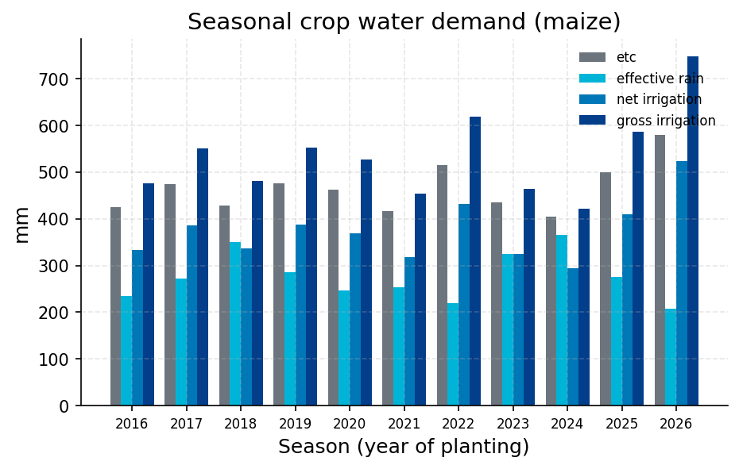
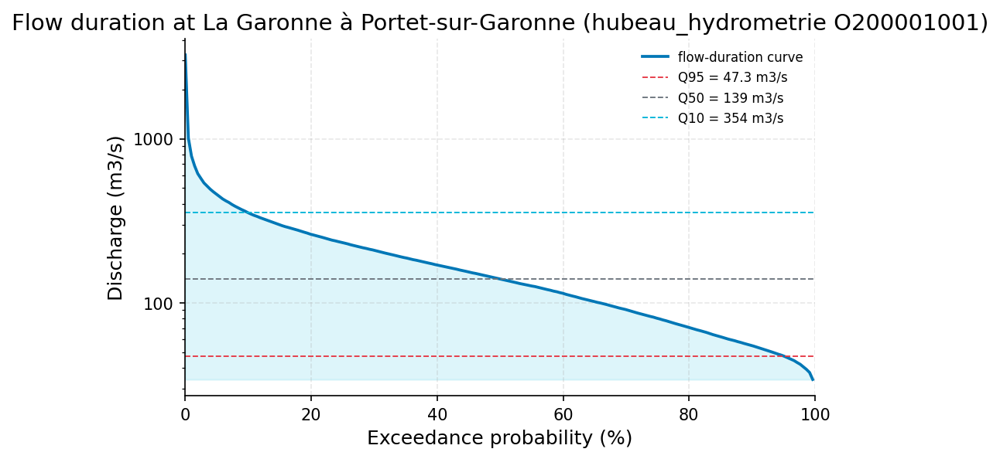
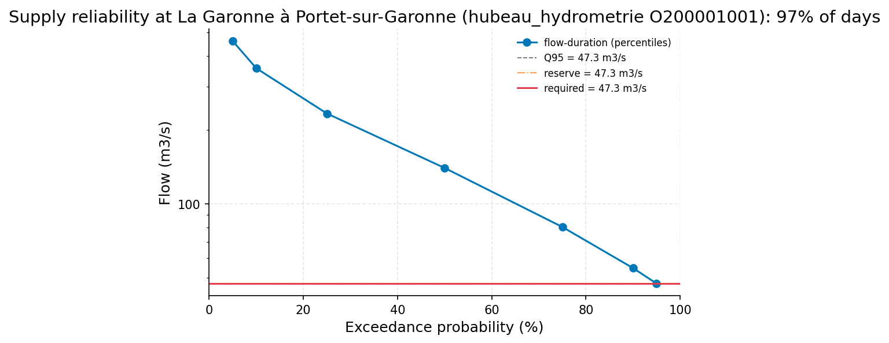

# Irrigation Feasibility: 40 ha Maize at Portet-sur-Garonne, Garonne River

**Author:** AquaScope Studio  
**Date:** 2026-09-14  
**Description:** whether the Garonne at Portet-sur-Garonne can supply, by direct run-of-river abstraction, the seasonal irrigation demand of a 40 ha maize field planted in April  
**Data Sources:** BasinATLAS (HydroATLAS v1.0), ERA5 via Open-Meteo, hubeau_hydrometrie, similar_basins  
**Version:** 1.0  

**Site:** 43.5300 N, 1.4000 E

**Answer.** Notice: the Critic's fix requests on site_data were not all resolved; read the report with the list of what this study does not establish.

The peak-month irrigation demand of 0.03173 m3/s can be met by the Garonne on about 96.5% of growing-season days and in 56.4% of years without a shortfall, keeping Q95 (47.301-47.347 m3/s) in the channel and taking at most 10% of daily flow (Hub'Eau station O200001001, La Garonne a Portet-sur-Garonne, 116.7 years of daily discharge); this screening result is graded indicative. The seasonal gross irrigation requirement for the 40 ha maize field planted in April is 534.8 mm (213,905.5 m3), a mean rate of 0.01981 m3/s, from FAO-56 crop water demand on ERA5-forced ET0 near 43.53N, 1.40E. River mean flow over the record is 183.1 m3/s, more than three orders of magnitude above the mean demand, so the constraint binds only in the low-flow tail that the reliability screen targets.

*Key numbers*

| Quantity | Value | Unit | Step |
| --- | --- | --- | --- |
| Gross irrigation | 534.8 | mm | s1 |
| Net irrigation | 374.3 | mm | s1 |
| Mean demand over the season | 0.01981 | m3/s | s1 |
| Peak-month demand | 0.03173 | m3/s | s1 |
| Record length | 116.0 | years | s2 |
| Mean of the record | 183.1 | m3/s | s2 |
| 100-year return level, GEV (L-moments) | 3587.0 | m3/s | s2 |
| 100-year return level, Log-Pearson III | 3555.0 | m3/s | s2 |
| 100-year LP3 90 % interval, low | 3067.0 | m3/s | s2 |
| 100-year LP3 90 % interval, high | 4120.0 | m3/s | s2 |
| Q95 (exceeded 95 % of days) | 47.35 | m3/s | s2 |
| Q50 (median flow) | 139.5 | m3/s | s2 |
| Q10 | 353.5 | m3/s | s2 |
| Mann-Kendall p-value (annual mean) | < 0.001 |  | s2 |
| Sen's slope | -0.5313 | m3/s per year | s2 |
| 2-year return level, GEV (L-moments) | 1148.0 | m3/s | s2 |
| 2-year return level, Log-Pearson III | 1143.0 | m3/s | s2 |
| 5-year return level, GEV (L-moments) | 1726.0 | m3/s | s2 |
| 5-year return level, Log-Pearson III | 1738.0 | m3/s | s2 |
| 10-year return level, GEV (L-moments) | 2137.0 | m3/s | s2 |
| 10-year return level, Log-Pearson III | 2155.0 | m3/s | s2 |
| 25-year return level, GEV (L-moments) | 2691.0 | m3/s | s2 |
| 25-year return level, Log-Pearson III | 2703.0 | m3/s | s2 |
| 50-year return level, GEV (L-moments) | 3129.0 | m3/s | s2 |
| 50-year return level, Log-Pearson III | 3124.0 | m3/s | s2 |
| Days the demand is met | 96.51 | % | s3 |
| Years without a shortfall | 56.41 | % | s3 |
| Volume delivered | 96.52 | % | s3 |
| Flow the river must carry | 47.33 | m3/s | s3 |
| Demand | 0.0317 | m3/s | s3 |
| Verdict | mostly reliable |  | s3 |
| Days short in the worst year (1989) | 59 | days | s3 |

## Summary

A run-of-river abstraction from the Garonne at Portet-sur-Garonne is screened against the seasonal irrigation demand of 40 ha of maize planted in April. FAO-56 demand on ERA5-forced ET0 gives a gross seasonal depth of 534.8 mm (213,905.5 m3), mean rate 0.01981 m3/s, peaking at 0.03173 m3/s. Against 116.7 years of daily discharge at Hub'Eau station O200001001 (mean 183.1 m3/s, Q95 47.35 m3/s), the peak-month demand is met on 96.5% of growing-season days and in 56.4% of years without a shortfall, keeping Q95 in the river and a 10% daily-flow cap. Both annual mean and annual maximum flow show a statistically significant decreasing trend over the record. The demand estimate rests on reanalysis-forced ET0 and default crop coefficients rather than site measurements; the supply figure is a screening rule, not a licensed allocation.

## The decision

Decide with the mean seasonal demand of 0.01981 m3/s and peak-month demand of 0.03173 m3/s (s1), screened against the Hub'Eau O200001001 flow record (s2, s3); grade indicative, band 0.01981-0.03173 m3/s. Conditions: FAO-56 default crop coefficients and 0.7 sprinkler efficiency; ERA5-forced ET0 rather than station data; a Q95 reserve and 10% share cap as playbook defaults, not a site licence; the gauge is 1.3 km from the offtake.

## Findings

f1, indicative: peak-month abstraction demand is 0.03173 m3/s (s1, FAO-56/ERA5), the critical rate for the run-of-river check. f2, established: mean flow over the 116-year Hub'Eau O200001001 record is 183.1 m3/s. f3, established: the largest recorded daily flow, 3830.1 m3/s in 1952, has an empirical return period of about 116 years, close to the fitted 100-year GEV (3587.0 m3/s) and Log-Pearson III (3555.0 m3/s) levels, which agree to within about 1%. Consistency checks show the peak-month demand is a negligible fraction (about 0.017%) of mean flow, so feasibility hinges on the low-flow tail; both mean and peak flows show significant declining trends over the record, a fact the historical reliability screen does not project forward.

## Problem and decision

The task is to size the seasonal irrigation water demand of a 40 ha maize field near Portet-sur-Garonne, south of Toulouse, planted in April, and to test whether the Garonne can supply it by direct run-of-river abstraction without depleting the river below a Q95 reserve or taking more than 10% of the day's flow. Irrigation method was not stated, so a 0.7 sprinkler efficiency default converts net to gross depth; no on-farm or conveyance storage is assumed.

## Site and data

The field is at 43.53N, 1.40E near Portet-sur-Garonne. Crop water demand uses ERA5 reanalysis via Open-Meteo (grid cell about 9 km, elevation 151 m) for reference ET0, spanning a 4,018-day window (2015-09-08 to 2026-09-07). River flow is taken from Hub'Eau station O200001001, La Garonne a Portet-sur-Garonne, 1.3 km from the site. Two fetches of this station's daily discharge (obs_elab QmnJ) were used: 42,369 daily values (1910-09-14 to 2026-09-13, 116.0 years) for the flow statistics and flood-frequency fit (s2), and 42,624 daily values (1910-01-02 to 2026-09-13, 116.7 years) for the reliability screen (s3).

## Methodology

Seasonal crop water requirement was computed with the FAO-56 single crop coefficient method on ERA5-forced ET0, subtracting effective rainfall and dividing net by 0.7 efficiency for the gross depth, averaged over 11 modelled seasons (2016-2026). The Garonne's flow regime at O200001001 was characterised with summary statistics, a Weibull-plotting-position flow-duration curve, and flood-frequency fits (GEV by L-moments, Log-Pearson III) plus Mann-Kendall trend tests. The peak-month demand (0.03173 m3/s) was then screened day-by-day over the April-August growing season against the gauge's daily record, requiring the river to carry the demand plus a Q95 reserve while capping the take at 10% of flow, yielding daily, annual and volumetric reliability fractions.

## Results: step s1

FAO-56 demand for maize on 40 ha planted 04-01 over a 125-day season (April-August): ETc 465.5 mm, effective rainfall 276.1 mm, net irrigation 374.3 mm (149,730.9 m3), gross irrigation 534.8 mm (213,905.5 m3) after the 0.7 efficiency divide, ranging 421.5-748.1 mm across the 11 modelled seasons (2016-2026). Mean seasonal rate is 0.01981 m3/s; the peak month requires 208.6 mm and 0.03173 m3/s. Mean ET0 over the window was 4.3 mm/day. Supply was not checked in this step.


*Crop evapotranspiration, effective rain and net and gross irrigation per season for maize on 40.0 ha planted on the first of month 4; the mean gross depth is 534.8 mm over the season.*

*Crop water demand per season at the site at 43.53 N, 1.40 E.*

| year | etc_mm | effective_rain_mm | net_irrigation_mm | gross_irrigation_mm | eto_mean_mm_per_day | peak_month | peak_month_mm |
| --- | --- | --- | --- | --- | --- | --- | --- |
| 2016 | 426.0 | 235.6 | 333.4 | 476.4 | 3.98 | 2016-06 | 172.7 |
| 2017 | 473.8 | 272.7 | 385.6 | 550.9 | 4.38 | 2017-06 | 224.6 |
| 2018 | 427.8 | 350.1 | 337.1 | 481.5 | 4.03 | 2018-06 | 192.3 |
| 2019 | 476.6 | 285.4 | 387.2 | 553.1 | 4.37 | 2019-06 | 225.8 |
| 2020 | 463.3 | 246.1 | 369.0 | 527.2 | 4.35 | 2020-07 | 179.1 |
| 2021 | 416.8 | 254.2 | 318.4 | 454.8 | 3.9 | 2021-06 | 183.5 |
| 2022 | 515.2 | 220.0 | 432.8 | 618.3 | 4.7 | 2022-07 | 229.8 |
| 2023 | 435.5 | 324.7 | 325.1 | 464.4 | 4.02 | 2023-07 | 176.2 |
| 2024 | 405.5 | 364.9 | 295.1 | 421.5 | 3.86 | 2024-06 | 175.9 |
| 2025 | 500.1 | 275.5 | 410.3 | 586.2 | 4.53 | 2025-06 | 245.6 |
| 2026 | 580.2 | 207.6 | 523.6 | 748.1 | 5.22 | 2026-06 | 289.1 |

## Results: step s2

Over 116.0 years (42,369 days) of daily discharge at Hub'Eau O200001001, mean flow is 183.0853 m3/s, median 139.353 m3/s, minimum 22.116 m3/s, maximum 3830.137 m3/s. The flow-duration curve gives Q95 47.347 m3/s, Q50 139.46 m3/s, Q10 353.517 m3/s. Flood-frequency fits: 100-year return level 3587.0 m3/s (GEV, L-moments) and 3555.0 m3/s (Log-Pearson III, 90% interval 3067.0-4120.0 m3/s); 2-year levels 1148.0/1143.0 m3/s, 5-year 1726.0/1738.0 m3/s, 10-year 2137.0/2155.0 m3/s, 25-year 2691.0/2703.0 m3/s, 50-year 3129.0/3124.0 m3/s. The record maximum (3830.137 m3/s, 1952) has an empirical return period of 116.0 years. Mann-Kendall on annual means shows a significant decreasing trend (p<0.001, Sen's slope -0.5313 m3/s/yr); annual maxima also decrease significantly (p=0.0193, slope -3.6728 m3/s/yr).


*Flow-duration curve of discharge at La Garonne à Portet-sur-Garonne (hubeau_hydrometrie O200001001) from the ranked daily flows, with Q95, Q50 and Q10 marked (log scale).*

*The record (21185 rows) is in the workbook (`workbook.xlsx`, sheet `s2_series`) and the notebook, not printed here.*

*Summary of the record at La Garonne à Portet-sur-Garonne (hubeau_hydrometrie O200001001).*

| item | value |
| --- | --- |
| source | hubeau_hydrometrie |
| station_id | O200001001 |
| variable | discharge |
| unit | m3/s |
| n | 42369 |
| start | 1910-09-14 |
| end | 2026-09-13 |
| years | 116.0 |
| stats.mean | 183.0853 |
| stats.median | 139.353 |
| stats.min | 22.116 |
| stats.max | 3830.137 |

*Annual maxima at La Garonne à Portet-sur-Garonne (hubeau_hydrometrie O200001001).*

| year | value |
| --- | --- |
| 1911 | 3244.686 |
| 1912 | 726.229 |
| 1913 | 1183.654 |
| 1914 | 1860.623 |
| 1915 | 1423.512 |
| 1916 | 902.057 |
| 1917 | 914.499 |
| 1918 | 1345.621 |
| 1919 | 2442.666 |
| 1920 | 2334.804 |
| 1921 | 1312.411 |
| 1922 | 1320.8 |
| 1923 | 1438.221 |
| 1924 | 1262.51 |
| 1925 | 1454.648 |
| 1926 | 1258.378 |
| 1927 | 1035.037 |
| 1928 | 2023.158 |
| 1929 | 987.819 |
| 1930 | 2962.684 |
| 1931 | 2535.622 |
| 1932 | 1867.518 |
| 1933 | 716.381 |
| 1934 | 488.227 |
| 1935 | 2151.216 |
| 1936 | 1132.892 |
| 1937 | 1422.749 |
| 1938 | 612.466 |
| 1939 | 1466.674 |
| 1940 | 1759.889 |
| 1941 | 865.228 |
| 1942 | 860.211 |
| 1943 | 892.336 |
| 1944 | 1400.145 |
| 1945 | 960.305 |
| 1946 | 349.22 |
| 1947 | 615.915 |
| 1948 | 1379.846 |
| 1949 | 845.167 |
| 1950 | 826.321 |
| 1951 | 851.161 |
| 1952 | 3830.137 |
| 1953 | 643.119 |
| 1954 | 1351.572 |
| 1955 | 2034.752 |
| 1956 | 2355.736 |
| 1957 | 1193.667 |
| 1958 | 1193.67 |
| 1959 | 1736.35 |
| 1960 | 925.521 |

*Return levels at La Garonne à Portet-sur-Garonne (hubeau_hydrometrie O200001001) by return period, with the confidence band.*

| T | GEV | LP3 | lower | upper |
| --- | --- | --- | --- | --- |
| 2.0 | 1147.8477 | 1142.6467 | 1056.89 | 1235.3619 |
| 5.0 | 1726.1995 | 1738.0324 | 1586.9252 | 1903.5281 |
| 10.0 | 2137.3386 | 2155.4563 | 1940.4983 | 2394.2263 |
| 25.0 | 2691.3412 | 2703.4992 | 2390.4066 | 3057.6004 |
| 50.0 | 3128.7923 | 3124.4569 | 2727.8985 | 3578.6635 |
| 100.0 | 3586.6623 | 3554.9294 | 3067.3108 | 4120.0661 |

*Flow-duration percentiles at La Garonne à Portet-sur-Garonne (hubeau_hydrometrie O200001001).*

| exceedance_pct | value |
| --- | --- |
| 10.0 | 353.517 |
| 50.0 | 139.46 |
| 95.0 | 47.347 |

*Mann-Kendall trend test and Sen slope at La Garonne à Portet-sur-Garonne (hubeau_hydrometrie O200001001).*

| item | value |
| --- | --- |
| on | annual mean |
| p_value | 0.0 |
| tau | -0.2653 |
| trend | decreasing |
| sens_slope_per_year | -0.5313 |
| n_years | 115 |

## Results: step s3

Screening the peak-month demand (0.03173 m3/s) over months 4-8 at O200001001 (n=17,901 days, 117 years), with a Q95 reserve of 47.301 m3/s and a 10% share cap, the river must carry at least 47.33273 m3/s. The demand is met on 96.51% of days and delivers 96.52% of the required volume, with no shortfall in 56.41% of years; the worst year (1989) had 59 short days, averaging 5.33 short days per year. Related gauge statistics: Q05 460.676 m3/s, Q10 356.95, Q25 233.388, Q50 139.967, Q75 80.436, Q90 54.704, Q95 47.301 m3/s; baseflow index 0.792; 7Q10 low flow 36.94 m3/s; recent 30-day mean flow 46.36 m3/s (95.6th percentile exceedance), 90-day mean 50.99 m3/s (92.6th percentile). Verdict: mostly reliable.


*The flow-duration curve at La Garonne à Portet-sur-Garonne (hubeau_hydrometrie O200001001) with the flow the demand needs (red), the reserve left in the river (orange) and Q95 (dashed); the demand is met on 97% of days.*

*Supply reliability at La Garonne à Portet-sur-Garonne (hubeau_hydrometrie O200001001).*

| item | value |
| --- | --- |
| demand_m3s | 0.0317 |
| demand_given_as | m3/s |
| share | 0.1 |
| months | 4; 5; 6; 7; 8 |
| unit | m3/s |
| mode | gauged |
| source | hubeau_hydrometrie |
| station_id | O200001001 |
| variable | discharge |
| start | 1910-01-02 |
| end | 2026-09-13 |
| years | 116.7 |
| fetch_note | Hub'Eau elaborated daily mean discharge (obs_elab QmnJ); full record requested (from 1910-01-01, the catalog's first date for this station). |
| n_days | 42624 |
| bfi | 0.7920296785218323 |
| low_flow.7q10 | 36.93762857142845 |
| low_flow.text | minimum 7-day mean flow with a 10-year return period (Weibull) |
| recent.end | 2026-09-13 |
| recent.last_30d_mean | 46.3557 |
| recent.last_30d_exceedance_pct | 95.61280030030031 |
| recent.last_90d_mean | 50.986955555555554 |
| recent.last_90d_exceedance_pct | 92.57929804804806 |
| reserve_m3s | 47.301 |
| reserve_rule | Q95 kept in the river |
| required_flow_m3s | 47.332730000000005 |
| reliability.daily | 0.9651416122004357 |
| reliability.daily_reserve_only | 0.9651416122004357 |
| reliability.annual | 0.5641025641025641 |
| reliability.volumetric | 0.9651556967389698 |
| reliability.days_short_per_year | 5.333333333333333 |
| reliability.worst_year.year | 1989 |
| reliability.worst_year.days_short | 59 |
| reliability.n_days | 17901 |
| reliability.n_years | 117 |
| verdict | mostly reliable |
| text | On 97% of days in months [4, 5, 6, 7, 8] the river can give 0.03173 m3/s while keeping 47.301 m3/s in the channel and taking no more than 10% of the flow (the river must carry 47.3327 m3/s). |
| station_name | La Garonne à Portet-sur-Garonne |
| name | La Garonne à Portet-sur-Garonne |
| reliability.daily | 0.9651416122004357 |
| reliability.daily_reserve_only | 0.9651416122004357 |
| reliability.annual | 0.5641025641025641 |
| reliability.volumetric | 0.9651556967389698 |
| reliability.days_short_per_year | 5.333333333333333 |
| reliability.worst_year.year | 1989 |
| reliability.worst_year.days_short | 59 |
| reliability.n_days | 17901 |
| reliability.n_years | 117 |
| fdc.q05 | 460.676 |
| fdc.q10 | 356.95 |
| fdc.q25 | 233.388 |

*Flow-duration percentiles at La Garonne à Portet-sur-Garonne (hubeau_hydrometrie O200001001).*

| exceedance_pct | value |
| --- | --- |
| 5.0 | 460.676 |
| 10.0 | 356.95 |
| 25.0 | 233.388 |
| 50.0 | 139.967 |
| 75.0 | 80.436 |
| 90.0 | 54.704 |
| 95.0 | 47.301 |

## Limitations and what this study does not establish

Crop coefficients and stage lengths follow FAO-56 (1998) Table 12 pending the 2025 revision (doi:10.4060/cd6621en); a shifted coefficient shifts the demand. Reference ET0 is FAO-56 Penman-Monteith forced by ERA5 reanalysis, which carries known bias against station-based ET0 (Agric. Water Manage. 2024, doi:10.1016/j.agwat.2024.108732); the demand is a planning estimate, not a measurement. The supply check applies a screening rule (Q95 reserve, 10% share cap) at the gauge, 1.3 km from the offtake, and does not account for conveyance losses, abstraction licences, return flows, or upstream competing withdrawals. The 116.7-year reliability figures do not reflect the significant decreasing trend found in both annual mean and annual maximum flow, so future reliability may be lower than the historical average implies.

## Caveats

- Crop coefficients and stage lengths are the FAO-56 (1998) Table 12 values pending verification against the 2025 revised edition (FAO, doi:10.4060/cd6621en; issue #310); a coefficient that moved moves the demand with it.
- Reference ET0 here is FAO-56 Penman-Monteith forced by ERA5 reanalysis (Open-Meteo), which carries bias against station-based ET0 (Agric. Water Manage. 2024, doi:10.1016/j.agwat.2024.108732); the demand is a planning estimate, not a measurement.
- The supply comes from the gauged river named in the plan, at the gauge's distance from the point, under a screening rule (Q95 kept in the river, at most the stated share taken); conveyance to the field, licences, return flows and storage are not in it.

## Recommendations

Adopt a design abstraction of 0.01981 m3/s mean, rising to 0.03173 m3/s in the peak month, conditional on maintaining a Q95 reserve of about 47.3 m3/s in the river and capping the take at 10% of daily flow; on this basis the scheme is mostly reliable (96.5% of days, 56.4% of years without shortfall) but not guaranteed every year, as 1989 saw 59 short days. Before committing, obtain station-based ET0 or local meteorological data to check the ERA5 bias flagged in s1, the actual environmental flow objective and abstraction licence terms for this Garonne reach in place of the assumed Q95/10% defaults, and a trend-adjusted low-flow analysis given the significant declining trend in both mean and peak flows. Do not treat the 56.4%-of-years figure as a guarantee of supply in any given season; a contingency (storage or reduced area) would be needed to firm up the driest years, though this study does not size one.

## References

1. Allen, R. G., Pereira, L. S., Raes, D., & Smith, M. (1998). Crop evapotranspiration. FAO Irrigation and Drainage Paper 56; FAO (2025). Crop evapotranspiration, revised edition, doi:10.4060/cd6621en; reanalysis-forced ET0 bias: Agric. Water Manage. (2024), doi:10.1016/j.agwat.2024.108732.
2. Vogel, R. M., & Fennessey, N. M. (1994). Flow-duration curves I: new interpretation and confidence intervals. J. Water Resour. Plann. Manage., 120(4), 485-504.
3. Smakhtin, V., & Eriyagama, N. (2008). Developing a software package for global desktop assessment of environmental flows. Environ. Model. Softw. 23, 1396-1406.
4. Hersbach, H. et al. (2020). The ERA5 global reanalysis. Q. J. R. Meteorol. Soc., 146, 1999-2049
5. Open-Meteo.com (CC BY 4.0).
6. Hosking, J. R. M. (1990). L-moments: analysis and estimation of distributions using linear combinations of order statistics. J. R. Stat. Soc. B, 52(1), 105-124.
7. England, J. F. Jr. et al. (2018). Guidelines for determining flood flow frequency, Bulletin 17C. USGS Techniques and Methods 4-B5.
8. Mann, H. B. (1945). Nonparametric tests against trend. Econometrica, 13, 245-259
9. Sen, P. K. (1968). J. Am. Stat. Assoc., 63, 1379-1389.
10. Acreman, M., & Dunbar, M. J. (2004). Defining environmental river flow requirements: a review. Hydrol. Earth Syst. Sci. 8, 861-876.
11. Lyne, V., & Hollick, M. (1979). Stochastic time-variable rainfall-runoff modelling. Inst. Eng. Aust. Natl. Conf. Publ. 79/10, 89-93.
12. Smakhtin, V. U. (2001). Low flow hydrology: a review. J. Hydrol. 240, 147-186.
13. Allen, R. G., Pereira, L. S., Raes, D., & Smith, M. (1998). Crop evapotranspiration: guidelines for computing crop water requirements. FAO Irrigation and Drainage Paper 56.
14. Updated single and basal crop coefficients for temperate fruit trees, vines and shrubs: Irrigation Science (2024), doi:10.1007/s00271-024-00964-0
15. Sensitivity of ERA5-Land-forced FAO-56 ET0 to reanalysis bias: Agricultural Water Management (2024), doi:10.1016/j.agwat.2024.108732
16. FAO-56 (1998) crop evapotranspiration guidelines, Table 12 crop coefficients
17. Rekin226 and contributors (2026). AquaScope: Open-source water data aggregation toolkit (version 0.16.0) [Software]. Zenodo. https://doi.org/10.5281/zenodo.21903143

## Appendix: reproducibility

Re-run the same steps with no model: `aquascope run study.yaml`. Resume the workspace: `aquascope studio --resume workspace.json`.

Model: claude-sonnet-5 via anthropic; ledger: consultant 1 call(s), 4891 tokens, methodologist 1 call(s), 18169 tokens, interpreter 1 call(s), 20499 tokens, author 1 call(s), 20417 tokens, critic 1 call(s), 21964 tokens. aquascope 0.16.0.

```yaml
# An AquaScope study (version 3): the plan behind an answer, its gates, and what happened.
#   aquascope run study.yaml
version: 3
title: "Estimate the seasonal irrigation water demand of a 40 ha mai: 43.53, 1.4"
question: "Irrigating 40 ha of maize from the Garonne at Portet-sur-Garonne, south of Toulouse, planted in April: what is the seasonal water demand and can the river meet it run of river?"
created: "2026-09-14T22:33:17+00:00"
aquascope_version: "0.16.0"
author: "methodologist"
model: "claude-sonnet-5"
problem:
  kind: "irrigation"
  site: {"lat": 43.53, "lon": 1.4}
  params: {"crop": "maize", "area_ha": 40.0, "planting_month": 4, "efficiency": 0.7, "share": 0.1, "decision": "seasonal demand"}
  text: "Irrigating 40 ha of maize from the Garonne at Portet-sur-Garonne, south of Toulouse, planted in April: what is the seasonal water demand and can the river meet it run of river?"
plan:
  author: "methodologist"
  playbook: "irrigation_feasibility"
  objective: "Estimate the seasonal irrigation water demand of a 40 ha maize field planted in April near Portet-sur-Garonne and test whether a run-of-river abstraction from the Garonne at the Portet-sur-Garonne gauge can meet that demand without breaching a Q95 reserve and a 10 percent daily-flow share."
  decision: "whether the Garonne at Portet-sur-Garonne can supply, by direct run-of-river abstraction, the seasonal irrigation demand of a 40 ha maize field planted in April"
  methodology: ["Compute the FAO-56 crop water requirement for maize on 40 ha planted in April using ERA5-forced reference evapotranspiration at the site, converting net to gross depth with a 0.7 sprinkler efficiency, to obtain the seasonal and peak-month demand.", "Characterise the Garonne's flow regime at the Portet-sur-Garonne gauge (116.7 years of daily discharge) with summary statistics and a flow-duration curve to quantify mean flow, Q95 and daily exceedance.", "Screen the peak-month abstraction requirement against the gauge's daily record over the growing-season months, keeping Q95 in the river and capping the take at 10 percent of daily flow, to determine the fraction of days and years the demand could be met.", "Summarise the seasonal depth, volume, required abstraction rate, flow statistics and the reliability fraction into the feasibility verdict."]
  assumptions: ["irrigation method not stated, so sprinkler efficiency of 0.7 is used per playbook default to convert net to gross depth", "the abstraction is capped at 10 percent of the day's flow as a screening rule, the playbook default, since no site-specific limit was given", "flow record from Hubeau station O200001001 (La Garonne a Portet-sur-Garonne, 1.3 km from the site, 116.7 years of daily discharge) is taken as representative of river flow at the offtake", "no on-farm or conveyance storage is assumed, consistent with a run-of-river scheme", "reference evapotranspiration and crop coefficients for maize follow FAO-56 defaults for this climate (ERA5 forcing near 43.53N, 1.40E)"]
  alternatives: [{"method": "regionalize_signatures via donor gauges", "why_not": "the Portet-sur-Garonne gauge itself has 116.7 years of daily discharge only 1.3 km away, so a donor-basin regionalisation is unnecessary and less accurate than the at-site record"}, {"method": "iwqi", "why_not": "flagged not_defensible in the sufficiency table: no water-quality samples exist at this site to assess irrigation water suitability"}]
  limitations_expected: ["Crop coefficients and stage lengths follow FAO-56 (1998) Table 12 pending the 2025 revised edition, so a shifted coefficient would shift the demand estimate.", "Reference ET0 is FAO-56 Penman-Monteith forced by ERA5 reanalysis, which carries known bias against station-based ET0, making the demand a planning estimate rather than a measurement.", "The supply check applies only to the gauged Garonne at Portet-sur-Garonne under a screening rule (Q95 reserve, 10 percent share cap); it does not account for conveyance losses, abstraction licences, return flows, or upstream competing withdrawals."]
  citations: ["Allen, R. G., Pereira, L. S., Raes, D., & Smith, M. (1998). Crop evapotranspiration: guidelines for computing crop water requirements. FAO Irrigation and Drainage Paper 56.", "FAO (2025). Crop evapotranspiration: guidelines for computing crop water requirements, revised edition (Pereira, Allen, Paredes, Lopez-Urrea, Raes et al.). doi:10.4060/cd6621en", "Updated single and basal crop coefficients for temperate fruit trees, vines and shrubs: Irrigation Science (2024), doi:10.1007/s00271-024-00964-0", "Sensitivity of ERA5-Land-forced FAO-56 ET0 to reanalysis bias: Agricultural Water Management (2024), doi:10.1016/j.agwat.2024.108732", "Vogel, R. M. and Fennessey, N. M. (1994). Flow-duration curves I: new interpretation and confidence intervals. J. Water Resour. Plann. Manage. 120, 485-504.", "Smakhtin, V., & Eriyagama, N. (2008). Developing a software package for global desktop assessment of environmental flows. Environ. Model. Softw. 23, 1396-1406.", "Hersbach, H. et al. (2020). The ERA5 global reanalysis. Q. J. R. Meteorol. Soc. 146, 1999-2049.", "FAO-56 (1998) crop evapotranspiration guidelines, Table 12 crop coefficients", "FAO, 2025 revised FAO-56 edition, doi:10.4060/cd6621en (issue #310)", "Agric. Water Manage. 2024, doi:10.1016/j.agwat.2024.108732, on ERA5-forced ET0 bias against station-based ET0"]
  caveats: ["Crop coefficients and stage lengths are the FAO-56 (1998) Table 12 values pending verification against the 2025 revised edition (FAO, doi:10.4060/cd6621en; issue #310); a coefficient that moved moves the demand with it.", "Reference ET0 here is FAO-56 Penman-Monteith forced by ERA5 reanalysis (Open-Meteo), which carries bias against station-based ET0 (Agric. Water Manage. 2024, doi:10.1016/j.agwat.2024.108732); the demand is a planning estimate, not a measurement.", "The supply comes from the gauged river named in the plan, at the gauge's distance from the point, under a screening rule (Q95 kept in the river, at most the stated share taken); conveyance to the field, licences, return flows and storage are not in it."]
  rationale: "Estimate the seasonal irrigation water demand of a 40 ha maize field planted in April near Portet-sur-Garonne and test whether a run-of-river abstraction from the Garonne at the Portet-sur-Garonne gauge can meet that demand without breaching a Q95 reserve and a 10 percent daily-flow share."
  recon_notes: ["Record resolution is not in the catalog; daily is assumed for every variable.", "10 donor gauges from a pool of 34,786 gauged catchments.", "ERA5 temperature and forcing and GloFAS discharge are assumed reachable for any point on land (Open-Meteo); not checked here.", "CMIP6 change factors need model output you supply (aquascope.climate works on downloaded data); not counted."]
steps:
  - tool: "crop_water_demand"
    id: "s1"
    rationale: "FAO-56 single-Kc evapotranspiration on ERA5 forcing, effective rainfall subtracted and net depth divided by 0.7 efficiency, gives the gross seasonal demand in mm and m3 over 40 ha plus the peak-month abstraction rate."
    method: "crop_water_requirement"
    arguments:
      lat: 43.53
      lon: 1.4
      crop: "maize"
      area_ha: 40.0
      planting_month: 4
      efficiency: 0.7
      years: 10
    expects:
      - {"check": "not_empty", "path": "demand.gross_irrigation_mm"}
      - {"check": "not_empty", "path": "demand.peak_month_m3s"}
      - {"check": "not_empty", "path": "season.months"}
    outputs: [{"kind": "table", "id": "s1_demand_monthly", "caption": "monthly and seasonal crop water demand for maize, 40 ha, April planting"}, {"kind": "figure", "id": "s1_et0_monthly", "caption": "monthly reference evapotranspiration and crop coefficient curve"}]
  - tool: "analyze_station"
    id: "s2"
    rationale: "The 116.7-year daily discharge record at La Garonne a Portet-sur-Garonne, 1.3 km from the site, gives the mean flow, Q95 and full exceedance curve needed to judge low-flow availability."
    method: "flow_duration"
    arguments:
      source: "hubeau_hydrometrie"
      station_id: "O200001001"
      variable: "discharge"
      years: 116.7
    expects:
      - {"check": "min_years", "path": "years", "value": 5}
      - {"check": "unit_present", "path": "unit"}
    outputs: [{"kind": "table", "id": "s2_flow_summary", "caption": "discharge summary statistics at O200001001"}, {"kind": "figure", "id": "s2_fdc", "caption": "flow-duration curve for the Garonne at Portet-sur-Garonne"}]
  - tool: "supply_reliability"
    id: "s3"
    rationale: "Screens the peak-month irrigation demand against the gauge's daily record over the growing-season months, keeping Q95 in the river and taking at most 10 percent of daily flow, to give the fraction of days and years the abstraction is feasible."
    method: "supply_reliability"
    arguments:
      source: "hubeau_hydrometrie"
      station_id: "O200001001"
      demand_m3s: "{{ result.s1.demand.peak_month_m3s }}"
      months: "{{ result.s1.season.months }}"
      share: 0.1
      reserve: "q95"
    expects:
      - {"check": "min_years", "value": 5, "path": "years"}
      - {"check": "not_empty", "path": "reliability"}
      - {"check": "unit_present", "path": "unit"}
    depends_on: ["s1"]
    outputs: [{"kind": "table", "id": "s3_reliability", "caption": "run-of-river supply reliability under Q95 reserve and 10 percent share cap"}, {"kind": "figure", "id": "s3_reliability_curve", "caption": "seasonal reliability and abstracted-share-of-flow curve"}]
results:
  s1: {"ok": true, "gates": [{"check": "not_empty", "passed": true, "detail": "'demand.gross_irrigation_mm' is present"}, {"check": "not_empty", "passed": true, "detail": "'demand.peak_month_m3s' is present"}, {"check": "not_empty", "passed": true, "detail": "'season.months' is present"}], "summary": "method=single", "fallback_used": false, "sha256": "6dbb40ff8f9ab297"}
  s2: {"ok": true, "gates": [{"check": "min_years", "passed": true, "detail": "116 years of record, 5 needed"}, {"check": "unit_present", "passed": true, "detail": "unit m3/s"}], "summary": "source=hubeau_hydrometrie, station_id=O200001001, variable=discharge, unit=m3/s, years=116.0, start=1910-09-14, end=2026-09-13", "fallback_used": false, "sha256": "ffebc291b1e29c75"}
  s3: {"ok": true, "gates": [{"check": "min_years", "passed": true, "detail": "116.7 years of record, 5 needed"}, {"check": "not_empty", "passed": true, "detail": "'reliability' is present"}, {"check": "unit_present", "passed": true, "detail": "unit m3/s"}], "summary": "source=hubeau_hydrometrie, station_id=O200001001, variable=discharge, unit=m3/s, years=116.7, start=1910-01-02, end=2026-09-13", "fallback_used": false, "sha256": "47b31f4ff8d89017"}
```

## Cite this software

AquaScope Studio (2026). AquaScope: Open-source water data aggregation toolkit (version 0.16.0) [Software]. Zenodo. https://doi.org/10.5281/zenodo.21903143


---

*{'model': 'claude-sonnet-5', 'provider': 'anthropic', 'prose': 'model', 'tokens': {'consultant': {'calls': 1, 'prompt_tokens': 3427, 'completion_tokens': 1464, 'cost_usd': 0.021494}, 'methodologist': {'calls': 1, 'prompt_tokens': 14152, 'completion_tokens': 4017, 'cost_usd': 0.068474}, 'interpreter': {'calls': 1, 'prompt_tokens': 11781, 'completion_tokens': 8718, 'cost_usd': 0.110742}, 'author': {'calls': 2, 'prompt_tokens': 33906, 'completion_tokens': 8945, 'cost_usd': 0.157262}, 'critic': {'calls': 1, 'prompt_tokens': 12180, 'completion_tokens': 9784, 'cost_usd': 0.1222}}, 'total_tokens': 108374, 'total_usd': 0.480172, 'budget': None, 'dropped': 1, 'aquascope_version': '0.16.0', 'date': '2026-09-14 22:38 UTC', 'workspace': '152d3f7ed7de', 'plan_author': 'methodologist', 'written_by': {'answer': 'model', 'summary': 'model', 'decision': 'model', 'findings': 'model', 'problem': 'model', 'site_data': 'model', 'methodology': 'model', 'results-s1': 'model', 'results-s2': 'model', 'results-s3': 'model', 'limitations': 'model', 'recommendations': 'model', 'references': 'template', 'appendix': 'template'}}*
