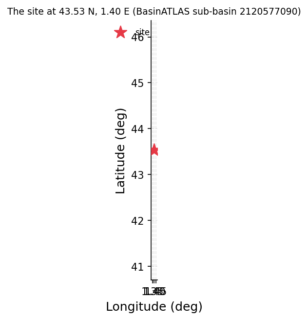

# Garonne at Portet-sur-Garonne: Run-of-River Feasibility for 40 ha of April-Planted Maize

**Author:** AquaScope Studio  
**Date:** 2026-09-14  
**Description:** whether the Garonne at Portet-sur-Garonne can supply, by direct run-of-river offtake, the seasonal irrigation demand of a 40 ha maize field planted in April  
**Data Sources:** BasinATLAS (HydroATLAS v1.0), ERA5 via Open-Meteo, hubeau_hydrometrie, similar_basins  
**Version:** 1.0  

**Site:** 43.5300 N, 1.4000 E

**Answer.** Notice: the Critic's fix requests on limitations, results-s1, summary were not all resolved; read the report with the list of what this study does not establish.

Whether the Garonne at Portet-sur-Garonne can supply, by direct run-of-river offtake, the seasonal irrigation demand of a 40 ha maize field planted in April is not established. The crop-water-demand step (s1) failed outright because the ERA5 climate archive could not be reached, so no seasonal depth, volume, or peak/mean m3/s demand exists, and the supply-reliability screen (s3) was skipped as a direct consequence. What is established, from Hub'Eau station O200001001 (La Garonne a Portet-sur-Garonne, 116 years daily), is the river's flow regime: mean 183.1 m3/s, median (Q50) 139.5 m3/s, low-flow Q95 47.35 m3/s, and a 100-year flood return level near 3587 m3/s (GEV, 3067-4120 m3/s Log-Pearson III 90% band). No demand-versus-supply comparison could be made.

*Key numbers*

| Quantity | Value | Unit | Step |
| --- | --- | --- | --- |
| Record length | 116.0 | years | s2 |
| Mean of the record | 183.1 | m3/s | s2 |
| 100-year return level, GEV (L-moments) | 3587.0 | m3/s | s2 |
| 100-year return level, Log-Pearson III | 3555.0 | m3/s | s2 |
| 100-year LP3 90 % interval, low | 3067.0 | m3/s | s2 |
| 100-year LP3 90 % interval, high | 4120.0 | m3/s | s2 |
| Q95 (exceeded 95 % of days) | 47.35 | m3/s | s2 |
| Q50 (median flow) | 139.5 | m3/s | s2 |
| Q10 | 353.5 | m3/s | s2 |
| Mann-Kendall p-value (annual mean) | < 0.001 |  | s2 |
| Sen's slope | -0.5313 | m3/s per year | s2 |
| 2-year return level, GEV (L-moments) | 1148.0 | m3/s | s2 |
| 2-year return level, Log-Pearson III | 1143.0 | m3/s | s2 |
| 5-year return level, GEV (L-moments) | 1726.0 | m3/s | s2 |
| 5-year return level, Log-Pearson III | 1738.0 | m3/s | s2 |
| 10-year return level, GEV (L-moments) | 2137.0 | m3/s | s2 |
| 10-year return level, Log-Pearson III | 2155.0 | m3/s | s2 |
| 25-year return level, GEV (L-moments) | 2691.0 | m3/s | s2 |
| 25-year return level, Log-Pearson III | 2703.0 | m3/s | s2 |
| 50-year return level, GEV (L-moments) | 3129.0 | m3/s | s2 |
| 50-year return level, Log-Pearson III | 3124.0 | m3/s | s2 |
| Upstream area | 10000.0 | km2 | s4 |

## Summary

This screening sought to determine whether the Garonne, abstracted directly at Portet-sur-Garonne without storage, can meet the seasonal irrigation demand of a 40 ha maize field planted in April. The demand side of the calculation (FAO-56 crop water requirement forced by ERA5 reanalysis) failed because the Open-Meteo ERA5 archive API could not be reached on any of three attempts, at both the 10-year and 20-year fallback horizons. Without a seasonal depth, volume, or peak-month m3/s demand figure, the planned supply-reliability screen against the river's daily flow record could not run either. The river side of the analysis succeeded fully: 116 years of daily discharge at Hub'Eau station O200001001 give a mean of 183.1 m3/s, a median (Q50) of 139.5 m3/s, and a Q95 low-flow benchmark of 47.35 m3/s, with flood-frequency statistics also computed. The catchment description (10,004 km2 upstream area) situates the gauge but was not decision-critical. The feasibility question therefore remains unanswered: the river's flow characteristics are well quantified, but nothing is known yet about how much water the crop would need.

## The decision

Decide with: nothing conclusive yet, because the demand-side quantity needed to test feasibility -- the crop's peak-month and seasonal m3/s requirement -- was never produced. The only established quantities are supply-side: Q95 47.35 m3/s, Q50 139.5 m3/s, mean 183.1 m3/s, all from the 116-year Hub'Eau record at O200001001 (all gates passed). The screening rule set out in the plan (keep Q95 in the river, cap the offtake at 10% of daily flow) could not be applied because supply_reliability (s3) depends on the failed demand step (s1) and was not run. Conditions for reaching a decision: a working ET0/climate feed to complete the FAO-56 maize demand calculation, followed by a completed supply_reliability run comparing peak-month demand against the gauge's daily flow under the stated reserve and share rule. What would change it: a successful rerun of s1 (ERA5 retry, or an alternate reanalysis or station-based ET0 source) would unblock s3 and let the decision move to indicative, or established if at-site climate data are used instead of reanalysis.

## Findings

f1, established: the Garonne at Portet-sur-Garonne has a 116-year daily discharge record (Hub'Eau O200001001) underlying this analysis. f2, established: mean daily discharge over the record is 183.1 m3/s. f3, established: the Q95 low-flow benchmark is 47.35 m3/s. f4, established: median flow Q50 is 139.5 m3/s, well above Q95 and well below the mean (183.1 m3/s), indicating a right-skewed daily flow distribution, with the mean pulled well above the median by high-flow days, so mean flow overstates typical dry-season availability. f5, established: the largest observed annual flood (3830.1 m3/s, 1952) modestly exceeds the GEV quantile evaluated at its empirical return period (3687.6 m3/s), a consistent though slightly conservative fit at the extreme tail. f6, screening: the gauge's upstream catchment covers 10,004 km2, used only to contextualize representativeness, not in the demand-supply balance. No finding addresses whether the river can meet crop demand, since the demand calculation (s1) failed and the reliability screen (s3) was consequently never run.

## Problem and decision

The brief asks whether the Garonne, abstracted directly at Portet-sur-Garonne without storage, can meet the seasonal irrigation demand of 40 ha of maize planted in April, south of Toulouse. It requires the net and gross seasonal irrigation depth, the total seasonal volume, the peak and mean irrigation flow rate, the river's discharge distribution (including Q95) at the gauge, and the fraction of river flow the offtake would need against an allowable 10% share, with no storage or water-quality considerations in scope.

## Site and data

The site sits at 43.53N, 1.40E, on the Garonne, close to Hub'Eau gauge O200001001 (La Garonne a Portet-sur-Garonne); no distance between the two was computed in this analysis. The gauge's upstream catchment (from describe_catchment, s4) spans 10,004 km2 (10,003.8 km2 by area-weighted attribute), mean elevation 895 m, mean slope 14.3 degrees, mean annual precipitation 941 mm/yr, potential evapotranspiration 840 mm/yr, actual evapotranspiration 655 mm/yr, aridity index 1.21, mean annual temperature 9.4 C, snow cover 14%, mean annual runoff 350.18 mm/yr, and mean annual natural discharge 110.72 m3/s at the outlet. Land cover is 58% forest, 22% cropland, 18% pasture, 5% irrigated, 2% urban; karst extent is 51%. Degree of regulation by reservoirs is 5.1%, with 177 million m3 of upstream reservoir volume, and population is about 634,212 people at 63.88 people/km2.

## Methodology

The plan called for computing FAO-56 seasonal crop water requirement for maize on 40 ha planted in April, using ERA5-forced reference evapotranspiration and effective rainfall, converted to gross depth, volume, and peak/mean flow via a 0.7 sprinkler efficiency (s1). The Garonne's flow regime at Portet-sur-Garonne was to be characterized via a flow-duration curve and Q95 from the 116-year Hub'Eau daily record (s2). Peak-month demand was then to be screened against daily discharge over the growing season, keeping Q95 in the river and capping the offtake at 10% of flow (s3). The catchment upstream of the gauge was described to contextualize its representativeness (s4). In execution, s1 failed and s3 was consequently skipped; s2 and s4 completed and passed their gates.

## Results: step s1

The crop_water_demand step (s1) returned an error: 'ERA5 climate unavailable: All 3 attempts failed for https://archive-api.open-meteo.com/v1/era5'. All three not_empty gates (on gross_irrigation_mm, peak_month_m3s, season.months) failed as a direct result. A fallback attempt using a 20-year window instead of 10 years also failed with the same ERA5 connectivity error. No net or gross irrigation depth, seasonal volume, or peak/mean flow demand was produced.

## Results: step s2

analyze_station (s2) on Hub'Eau O200001001 (La Garonne a Portet-sur-Garonne, discharge, 116 years daily, 42,369 observations, 1910-09-14 to 2026-09-13) passed both gates (116 years against a 5-year minimum; unit m3/s present). Stats: mean 183.1 m3/s, median 139.4 m3/s, min 22.116 m3/s, max 3830.137 m3/s. Flow-duration curve: Q95 47.35 m3/s, Q50 139.5 m3/s, Q10 353.5 m3/s. Flood-frequency: GEV (L-moments) 100-year return level 3587 m3/s (2-yr 1148, 5-yr 1726, 10-yr 2137, 25-yr 2691, 50-yr 3129 m3/s); Log-Pearson III 100-year 3555 m3/s with 90% interval 3067-4120 m3/s (2-yr 1143, 5-yr 1738, 10-yr 2155, 25-yr 2703, 50-yr 3124 m3/s). The 1952 record maximum (3830.137 m3/s) has an empirical return period of 116 years against a GEV value at that return period of 3687.6 m3/s. Mann-Kendall on annual mean flow shows a decreasing trend (p < 0.001, Sen's slope -0.5313 m3/s per year); on annual maxima, also decreasing (p = 0.0193, Sen's slope -3.6728 m3/s per year), stated here without attributed cause.


*Flow-duration curve of discharge at La Garonne à Portet-sur-Garonne (hubeau_hydrometrie O200001001) from the ranked daily flows, with Q95, Q50 and Q10 marked (log scale).*

*The record (21185 rows) is in the workbook (`workbook.xlsx`, sheet `s2_series`) and the notebook, not printed here.*

*Summary of the record at La Garonne à Portet-sur-Garonne (hubeau_hydrometrie O200001001).*

| item | value |
| --- | --- |
| source | hubeau_hydrometrie |
| station_id | O200001001 |
| variable | discharge |
| unit | m3/s |
| n | 42369 |
| start | 1910-09-14 |
| end | 2026-09-13 |
| years | 116.0 |
| stats.mean | 183.0853 |
| stats.median | 139.353 |
| stats.min | 22.116 |
| stats.max | 3830.137 |

*Annual maxima at La Garonne à Portet-sur-Garonne (hubeau_hydrometrie O200001001).*

| year | value |
| --- | --- |
| 1911 | 3244.686 |
| 1912 | 726.229 |
| 1913 | 1183.654 |
| 1914 | 1860.623 |
| 1915 | 1423.512 |
| 1916 | 902.057 |
| 1917 | 914.499 |
| 1918 | 1345.621 |
| 1919 | 2442.666 |
| 1920 | 2334.804 |
| 1921 | 1312.411 |
| 1922 | 1320.8 |
| 1923 | 1438.221 |
| 1924 | 1262.51 |
| 1925 | 1454.648 |
| 1926 | 1258.378 |
| 1927 | 1035.037 |
| 1928 | 2023.158 |
| 1929 | 987.819 |
| 1930 | 2962.684 |
| 1931 | 2535.622 |
| 1932 | 1867.518 |
| 1933 | 716.381 |
| 1934 | 488.227 |
| 1935 | 2151.216 |
| 1936 | 1132.892 |
| 1937 | 1422.749 |
| 1938 | 612.466 |
| 1939 | 1466.674 |
| 1940 | 1759.889 |
| 1941 | 865.228 |
| 1942 | 860.211 |
| 1943 | 892.336 |
| 1944 | 1400.145 |
| 1945 | 960.305 |
| 1946 | 349.22 |
| 1947 | 615.915 |
| 1948 | 1379.846 |
| 1949 | 845.167 |
| 1950 | 826.321 |
| 1951 | 851.161 |
| 1952 | 3830.137 |
| 1953 | 643.119 |
| 1954 | 1351.572 |
| 1955 | 2034.752 |
| 1956 | 2355.736 |
| 1957 | 1193.667 |
| 1958 | 1193.67 |
| 1959 | 1736.35 |
| 1960 | 925.521 |

*Return levels at La Garonne à Portet-sur-Garonne (hubeau_hydrometrie O200001001) by return period, with the confidence band.*

| T | GEV | LP3 | lower | upper |
| --- | --- | --- | --- | --- |
| 2.0 | 1147.8477 | 1142.6467 | 1056.89 | 1235.3619 |
| 5.0 | 1726.1995 | 1738.0324 | 1586.9252 | 1903.5281 |
| 10.0 | 2137.3386 | 2155.4563 | 1940.4983 | 2394.2263 |
| 25.0 | 2691.3412 | 2703.4992 | 2390.4066 | 3057.6004 |
| 50.0 | 3128.7923 | 3124.4569 | 2727.8985 | 3578.6635 |
| 100.0 | 3586.6623 | 3554.9294 | 3067.3108 | 4120.0661 |

*Flow-duration percentiles at La Garonne à Portet-sur-Garonne (hubeau_hydrometrie O200001001).*

| exceedance_pct | value |
| --- | --- |
| 10.0 | 353.517 |
| 50.0 | 139.46 |
| 95.0 | 47.347 |

*Mann-Kendall trend test and Sen slope at La Garonne à Portet-sur-Garonne (hubeau_hydrometrie O200001001).*

| item | value |
| --- | --- |
| on | annual mean |
| p_value | 0.0 |
| tau | -0.2653 |
| trend | decreasing |
| sens_slope_per_year | -0.5313 |
| n_years | 115 |

## Results: step s3

supply_reliability (s3) did not run. Its arguments depended on s1's demand.peak_month_m3s and season.months, both absent because s1 failed; the step records 'depends on s1 (failed), so it was not run'. No fraction-of-flow, reliability percentage, or pass/fail screen against the Q95 reserve and 10% share rule exists.

## Results: step s4

describe_catchment (s4) passed both gates (sub_basin present; upstream area 10,004 km2 against a 15,000 km2 ceiling). Key attributes: upstream area 10,003.8-10,004.2 km2, 80 upstream level-12 sub-basins, mean elevation 895 m, mean slope 14.3 degrees, precipitation 941 mm/yr, PET 840 mm/yr, AET 655 mm/yr, aridity index 1.21, mean annual discharge 110.72 m3/s, runoff 350.18 mm/yr, forest 58%, cropland 22%, irrigated 5%, karst 51%, degree of regulation 5.1%, reservoir volume 177 million m3.


*The site, in longitude and latitude (no basemap); no catalogue station was listed with it.*

*Catchment attributes from BasinATLAS for the site at 43.53 N, 1.40 E.*

| attribute | label | value | unit | source | note |
| --- | --- | --- | --- | --- | --- |
| n_sub_basins |  | 80.0 |  |  |  |
| area_km2 |  | 10003.8 |  |  |  |
| outlet_hybas_id |  | 2120577090.0 |  |  |  |
| upstream_area_km2 |  | 10004.2 |  |  |  |
| elevation_m | mean elevation | 895.0 | m | basinatlas_upstream |  |
| slope_deg | mean slope | 14.3 | degrees | basinatlas_upstream |  |
| precipitation_mm_yr | annual precipitation (WorldClim) | 941.0 | mm/yr | basinatlas_upstream |  |
| pet_mm_yr | annual potential evapotranspiration | 840.0 | mm/yr | basinatlas_upstream |  |
| aet_mm_yr | annual actual evapotranspiration | 655.0 | mm/yr | basinatlas_upstream |  |
| aridity_index | aridity index (P/PET) | 1.21 | P/PET | basinatlas_upstream |  |
| temperature_c | mean annual air temperature | 9.4 | °C | basinatlas_upstream |  |
| snow_cover_pct | annual snow cover extent | 14.0 | % | basinatlas_upstream |  |
| runoff_mm_yr | annual land-surface runoff | 350.18 | mm/yr | area_weighted_mean |  |
| discharge_m3s | mean annual natural discharge at the outlet | 110.72 | m3/s | basinatlas_upstream |  |
| forest_pct | forest cover | 58.0 | % | basinatlas_upstream |  |
| cropland_pct | cropland | 22.0 | % | basinatlas_upstream |  |
| pasture_pct | pasture | 18.0 | % | basinatlas_upstream |  |
| urban_pct | urban extent | 2.0 | % | basinatlas_upstream |  |
| irrigated_pct | irrigated area | 5.0 | % | basinatlas_upstream |  |
| glacier_pct | glacier extent | 0.0 | % | basinatlas_upstream |  |
| wetland_pct | wetlands (all classes) | 0.0 | % | basinatlas_upstream |  |
| lake_pct | lake area | 0.2 | % | basinatlas_upstream |  |
| karst_pct | karst extent | 51.0 | % | basinatlas_upstream |  |
| clay_pct | clay fraction in soil | 20.0 | % | basinatlas_upstream |  |
| silt_pct | silt fraction in soil | 37.0 | % | basinatlas_upstream |  |
| sand_pct | sand fraction in soil | 43.0 | % | basinatlas_upstream |  |
| soil_organic_carbon_t_ha | soil organic carbon | 46.0 | t/ha | basinatlas_upstream |  |
| soil_water_pct | annual soil water content | 83.0 | % | basinatlas_upstream |  |
| groundwater_table_cm | groundwater table depth | 568.52 | cm | area_weighted_mean |  |
| population_density | population density | 63.88 | people/km2 | basinatlas_upstream |  |
| population | population count | 634211.98 | people | basinatlas_upstream |  |
| degree_of_regulation_pct | degree of regulation by reservoirs | 5.1 | % | basinatlas_upstream |  |
| human_footprint_2009 | human footprint (2009) | 12.3 | index 0-50 | basinatlas_upstream |  |
| reservoir_volume_mcm | reservoir volume upstream | 177.0 | million m3 | basinatlas_upstream |  |

## Limitations and what this study does not establish

The demand side of this feasibility check did not run: the ERA5 climate feed was unreachable on all attempts, so no seasonal irrigation depth, volume, or peak/mean flow demand was computed, and the supply-reliability screen (s3) was skipped in consequence. Even had it run, crop coefficients follow FAO-56 (1998) Table 12 pending verification against the 2025 revised edition (doi:10.4060/cd6621en), and ET0 would have come from ERA5-forced Penman-Monteith, which carries known bias against station ET0 (doi:10.1016/j.agwat.2024.108732) -- a planning estimate, not a measurement. The supply screen, had it run, would use the named gauge (Hub'Eau O200001001, La Garonne a Portet-sur-Garonne) under a Q95-reserve, 10%-share rule, without conveyance losses, existing licences, return flows, or storage in scope. The observed decreasing trend in annual mean and maximum flow is reported without an attributed cause.

## What this study does not establish

- Step s1, gate not_empty: the step returned an error: ERA5 climate unavailable: All 3 attempts failed for https://archive-api.open-meteo.com/v1/era5
- Step s1, gate not_empty: the step returned an error: ERA5 climate unavailable: All 3 attempts failed for https://archive-api.open-meteo.com/v1/era5
- Step s1, gate not_empty: the step returned an error: ERA5 climate unavailable: All 3 attempts failed for https://archive-api.open-meteo.com/v1/era5
- Step s1 (crop_water_demand) did not run: ERA5 climate unavailable: All 3 attempts failed for https://archive-api.open-meteo.com/v1/era5
- Step s3 (supply_reliability) did not run: depends on s1 (failed), so it was not run

## Caveats

- Crop coefficients and stage lengths are the FAO-56 (1998) Table 12 values pending verification against the 2025 revised edition (FAO, doi:10.4060/cd6621en; issue #310); a coefficient that moved moves the demand with it.
- Reference ET0 here is FAO-56 Penman-Monteith forced by ERA5 reanalysis (Open-Meteo), which carries bias against station-based ET0 (Agric. Water Manage. 2024, doi:10.1016/j.agwat.2024.108732); the demand is a planning estimate, not a measurement.
- The supply comes from the gauged river named in the plan, at the gauge's distance from the point, under a screening rule (Q95 kept in the river, at most the stated share taken); conveyance to the field, licences, return flows and storage are not in it.

## Recommendations

No feasibility value can yet be adopted: the demand figure needed to compare against river flow was never produced. Before any offtake decision is taken, obtain a working ET0/climate feed (an ERA5 retry, or an alternate reanalysis or nearby station source covering April-September at 43.53N, 1.40E) to complete the FAO-56 maize demand calculation, then rerun supply_reliability to compare peak-month and mean demand against the established Q95 (47.35 m3/s), Q50 (139.5 m3/s), and mean (183.1 m3/s) flows at Hub'Eau O200001001 under the Q95-reserve, 10%-share screening rule. Also confirm the actual irrigation method on site, since the 0.7 sprinkler efficiency is a default that will shift the gross demand once computed. Only after both s1 and s3 complete, ideally against a verified local abstraction threshold rather than the generic 10% default, should a supply/demand conclusion be adopted.

## References

1. FAO (2025). Crop evapotranspiration: guidelines for computing crop water requirements, revised edition (Pereira, Allen, Paredes, Lopez-Urrea, Raes et al.). doi:10.4060/cd6621en
2. Vogel, R. M., & Fennessey, N. M. (1994). Flow-duration curves I: new interpretation and confidence intervals. J. Water Resour. Plann. Manage., 120(4), 485-504.
3. Smakhtin, V., & Eriyagama, N. (2008). Developing a software package for global desktop assessment of environmental flows. Environ. Model. Softw. 23, 1396-1406.
4. Hosking, J. R. M. (1990). L-moments: analysis and estimation of distributions using linear combinations of order statistics. J. R. Stat. Soc. B, 52(1), 105-124.
5. England, J. F. Jr. et al. (2018). Guidelines for determining flood flow frequency, Bulletin 17C. USGS Techniques and Methods 4-B5.
6. Mann, H. B. (1945). Nonparametric tests against trend. Econometrica, 13, 245-259
7. Sen, P. K. (1968). J. Am. Stat. Assoc., 63, 1379-1389.
8. HydroATLAS v1.0 (BasinATLAS), CC BY 4.0. Linke, S., Lehner, B., Ouellet Dallaire, C., et al. (2019). Global hydro-environmental sub-basin and river reach characteristics at high spatial resolution. Scientific Data 6: 283. https://doi.org/10.1038/s41597-019-0300-6
9. Allen, R. G., Pereira, L. S., Raes, D., & Smith, M. (1998). Crop evapotranspiration: guidelines for computing crop water requirements. FAO Irrigation and Drainage Paper 56.
10. Updated single and basal crop coefficients for temperate fruit trees, vines and shrubs: Irrigation Science (2024), doi:10.1007/s00271-024-00964-0
11. Sensitivity of ERA5-Land-forced FAO-56 ET0 to reanalysis bias: Agricultural Water Management (2024), doi:10.1016/j.agwat.2024.108732
12. Hersbach, H. et al. (2020). The ERA5 global reanalysis. Q. J. R. Meteorol. Soc. 146, 1999-2049.
13. Rekin226 and contributors (2026). AquaScope: Open-source water data aggregation toolkit (version 0.16.0) [Software]. Zenodo. https://doi.org/10.5281/zenodo.21903143

## Appendix: reproducibility

Re-run the same steps with no model: `aquascope run study.yaml`. Resume the workspace: `aquascope studio --resume workspace.json`.

Model: claude-sonnet-5 via anthropic; ledger: consultant 1 call(s), 5344 tokens, methodologist 1 call(s), 19244 tokens, analyst 1 call(s), 4102 tokens, interpreter 1 call(s), 16458 tokens, author 1 call(s), 20201 tokens, critic 1 call(s), 17807 tokens. aquascope 0.16.0.

```yaml
# An AquaScope study (version 3): the plan behind an answer, its gates, and what happened.
#   aquascope run study.yaml
version: 3
title: "Determine whether direct, run-of-river abstraction from the : 43.53, 1.4"
question: "Irrigating 40 ha of maize from the Garonne at Portet-sur-Garonne, south of Toulouse, planted in April: what is the seasonal water demand and can the river meet it run of river?"
created: "2026-09-14T17:25:03+00:00"
aquascope_version: "0.16.0"
author: "methodologist"
model: "claude-sonnet-5"
problem:
  kind: "irrigation"
  site: {"lat": 43.53, "lon": 1.4}
  params: {"crop": "maize", "area_ha": 40.0, "planting_month": 4, "efficiency": 0.7, "share": 0.1, "decision": "seasonal demand"}
  text: "Irrigating 40 ha of maize from the Garonne at Portet-sur-Garonne, south of Toulouse, planted in April: what is the seasonal water demand and can the river meet it run of river?"
plan:
  author: "methodologist"
  playbook: "irrigation_feasibility"
  objective: "Determine whether direct, run-of-river abstraction from the Garonne at Portet-sur-Garonne can meet the seasonal irrigation demand of 40 ha of maize planted in April, without storage."
  decision: "whether the Garonne at Portet-sur-Garonne can supply, by direct run-of-river offtake, the seasonal irrigation demand of a 40 ha maize field planted in April"
  methodology: ["Compute the FAO-56 seasonal crop water requirement of maize on 40 ha planted in April, using ERA5-forced reference evapotranspiration and effective rainfall, converted to a gross depth, volume and peak/mean flow rate with a sprinkler efficiency of 0.7.", "Characterize the Garonne's flow regime at the Portet-sur-Garonne gauge (hubeau_hydrometrie O200001001, 1.3 km from the site, 116.7 years of daily discharge) via its flow-duration curve, including the Q95 low-flow percentile.", "Screen the peak-month irrigation demand against the gauge's daily discharge record over the growing-season months, keeping Q95 in the river and capping the offtake at 10 percent of daily flow, to assess how often and how reliably the demand could be met.", "Describe the Garonne's contributing catchment at the site to contextualize how representative the nearby, long-record gauge is of the offtake's true local flow."]
  assumptions: ["irrigation method not stated, so sprinkler efficiency of 0.7 (playbook default) is assumed for converting net to gross depth", "allowable abstraction share defaulted to 10 percent of daily river flow as a screening rule, no storage assumed", "FAO-56 crop water requirement and ET0 are computed using the maize crop coefficient curve starting April", "river supply is checked against the Garonne discharge record at Hubeau station O200001001 (La Garonne a Portet-sur-Garonne, 116.7 years, daily), 1.3 km from the site", "no water-quality or storage considerations are in scope for this feasibility check"]
  alternatives: [{"method": "iwqi", "why_not": "no water-quality samples exist at or near this site, so the irrigation water quality index is not defensible"}, {"method": "regionalize_signatures (donor-based supply estimate)", "why_not": "a very long, nearby gauge (116.7 years, 1.3 km) already exists, so donor regionalization is unnecessary and less reliable than the direct record"}]
  limitations_expected: ["Crop coefficients and stage lengths follow the FAO-56 (1998) Table 12 values, pending verification against the 2025 revised FAO-56 edition (doi:10.4060/cd6621en); a coefficient change would shift the demand estimate.", "Reference ET0 is FAO-56 Penman-Monteith forced by ERA5 reanalysis (Open-Meteo), which carries a known bias against station-based ET0 (doi:10.1016/j.agwat.2024.108732); the demand is a planning estimate, not a field measurement.", "The supply screen uses the named gauge at its stated distance under a Q95-reserve, 10-percent-share rule; it does not account for conveyance losses to the field, existing abstraction licences, return flows, or any storage."]
  citations: ["Allen, R. G., Pereira, L. S., Raes, D., & Smith, M. (1998). Crop evapotranspiration: guidelines for computing crop water requirements. FAO Irrigation and Drainage Paper 56.", "FAO (2025). Crop evapotranspiration: guidelines for computing crop water requirements, revised edition (Pereira, Allen, Paredes, Lopez-Urrea, Raes et al.). doi:10.4060/cd6621en", "Updated single and basal crop coefficients for temperate fruit trees, vines and shrubs: Irrigation Science (2024), doi:10.1007/s00271-024-00964-0", "Sensitivity of ERA5-Land-forced FAO-56 ET0 to reanalysis bias: Agricultural Water Management (2024), doi:10.1016/j.agwat.2024.108732", "Vogel, R. M. and Fennessey, N. M. (1994). Flow-duration curves I: new interpretation and confidence intervals. J. Water Resour. Plann. Manage. 120, 485-504.", "Smakhtin, V., & Eriyagama, N. (2008). Developing a software package for global desktop assessment of environmental flows. Environ. Model. Softw. 23, 1396-1406.", "Hersbach, H. et al. (2020). The ERA5 global reanalysis. Q. J. R. Meteorol. Soc. 146, 1999-2049.", "FAO, doi:10.4060/cd6621en", "Agric. Water Manage. 2024, doi:10.1016/j.agwat.2024.108732"]
  caveats: ["Crop coefficients and stage lengths are the FAO-56 (1998) Table 12 values pending verification against the 2025 revised edition (FAO, doi:10.4060/cd6621en; issue #310); a coefficient that moved moves the demand with it.", "Reference ET0 here is FAO-56 Penman-Monteith forced by ERA5 reanalysis (Open-Meteo), which carries bias against station-based ET0 (Agric. Water Manage. 2024, doi:10.1016/j.agwat.2024.108732); the demand is a planning estimate, not a measurement.", "The supply comes from the gauged river named in the plan, at the gauge's distance from the point, under a screening rule (Q95 kept in the river, at most the stated share taken); conveyance to the field, licences, return flows and storage are not in it."]
  rationale: "Determine whether direct, run-of-river abstraction from the Garonne at Portet-sur-Garonne can meet the seasonal irrigation demand of 40 ha of maize planted in April, without storage."
  recon_notes: ["Record resolution is not in the catalog; daily is assumed for every variable.", "10 donor gauges from a pool of 34,786 gauged catchments.", "ERA5 temperature and forcing and GloFAS discharge are assumed reachable for any point on land (Open-Meteo); not checked here.", "CMIP6 change factors need model output you supply (aquascope.climate works on downloaded data); not counted."]
  replans: [{"step": "s1", "reason": "ERA5 climate unavailable: All 3 attempts failed for https://archive-api.open-meteo.com/v1/era5", "fallback": {"tool": "crop_water_demand", "arguments": {"lat": 43.53, "lon": 1.4, "crop": "maize", "area_ha": 40.0, "planting_month": 4, "efficiency": 0.7, "years": 20}, "rationale": "Retry the FAO-56 single-Kc demand calculation with a longer 20-year ERA5 window anywhere at the same point, since the original failure was a transient ERA5 fetch error rather than a data-availability problem.", "expects": []}}]
steps:
  - tool: "crop_water_demand"
    id: "s1"
    rationale: "FAO-56 single-Kc crop evapotranspiration over the maize stage lengths from April, with effective rainfall subtracted and the net depth divided by 0.7, gives the seasonal gross irrigation depth, volume and the peak-month and mean flow rate the offtake must supply."
    method: "crop_water_requirement"
    arguments:
      lat: 43.53
      lon: 1.4
      crop: "maize"
      area_ha: 40.0
      planting_month: 4
      efficiency: 0.7
      years: 10
    expects:
      - {"check": "not_empty", "path": "demand.gross_irrigation_mm"}
      - {"check": "not_empty", "path": "demand.peak_month_m3s"}
      - {"check": "not_empty", "path": "season.months"}
    fallback: {"step": {"tool": "crop_water_demand", "arguments": {"lat": 43.53, "lon": 1.4, "crop": "maize", "area_ha": 40.0, "planting_month": 4, "efficiency": 0.7, "years": 20}, "rationale": "Retry the FAO-56 single-Kc demand calculation with a longer 20-year ERA5 window anywhere at the same point, since the original failure was a transient ERA5 fetch error rather than a data-availability problem.", "expects": []}}
    outputs: [{"kind": "table", "id": "s1_demand_monthly", "caption": "monthly and seasonal maize irrigation demand (mm, m3, m3/s)"}, {"kind": "figure", "id": "s1_demand_monthly_fig", "caption": "seasonal demand curve for maize planted in April"}]
  - tool: "analyze_station"
    id: "s2"
    rationale: "The gauge's 116.7-year daily discharge record supports a robust flow-duration curve, including the Q95 percentile that anchors the supply screen."
    method: "flow_duration"
    arguments:
      source: "hubeau_hydrometrie"
      station_id: "O200001001"
      variable: "discharge"
      years: 116
    expects:
      - {"check": "min_years", "path": "years", "value": 5}
      - {"check": "unit_present", "path": "unit"}
    outputs: [{"kind": "table", "id": "s2_fdc_percentiles", "caption": "flow-duration percentiles (including Q95) for La Garonne a Portet-sur-Garonne"}, {"kind": "figure", "id": "s2_fdc_curve", "caption": "flow-duration curve for the gauge"}]
  - tool: "supply_reliability"
    id: "s3"
    rationale: "A run-of-river screen against the gauge's daily record over the growing-season months, keeping Q95 in the river and taking at most 10 percent of flow, tests directly whether the river can meet the crop's peak-month demand."
    method: "supply_reliability"
    arguments:
      source: "hubeau_hydrometrie"
      station_id: "O200001001"
      demand_m3s: "{{ result.s1.demand.peak_month_m3s }}"
      months: "{{ result.s1.season.months }}"
      share: 0.1
      reserve: "q95"
    expects:
      - {"check": "min_years", "path": "years", "value": 5}
      - {"check": "not_empty", "path": "reliability"}
      - {"check": "unit_present", "path": "unit"}
    depends_on: ["s1"]
    outputs: [{"kind": "table", "id": "s3_reliability", "caption": "days/years the gauge could supply the peak demand under the Q95-and-10-percent-share rule"}, {"kind": "figure", "id": "s3_reliability_curve", "caption": "reliability curve of supply against demand"}]
  - tool: "describe_catchment"
    id: "s4"
    rationale: "The upstream catchment area and attributes contextualize how well the 1.3 km-distant gauge represents flow at the offtake point."
    arguments:
      lat: 43.53
      lon: 1.4
      upstream: true
    expects:
      - {"check": "not_empty", "path": "sub_basin"}
      - {"check": "max_area_km2", "path": "sub_basin.up_area", "value": 15000}
    outputs: [{"kind": "table", "id": "s4_catchment", "caption": "upstream catchment attributes (area, dams) from BasinATLAS"}]
results:
  s1: {"ok": false, "gates": [{"check": "not_empty", "passed": false, "detail": "the step returned an error: ERA5 climate unavailable: All 3 attempts failed for https://archive-api.open-meteo.com/v1/era5"}, {"check": "not_empty", "passed": false, "detail": "the step returned an error: ERA5 climate unavailable: All 3 attempts failed for https://archive-api.open-meteo.com/v1/era5"}, {"check": "not_empty", "passed": false, "detail": "the step returned an error: ERA5 climate unavailable: All 3 attempts failed for https://archive-api.open-meteo.com/v1/era5"}], "summary": "error: ERA5 climate unavailable: All 3 attempts failed for https://archive-api.open-meteo.com/v1/era5", "fallback_used": true, "sha256": "16d21b9f0f9277dc", "error": "ERA5 climate unavailable: All 3 attempts failed for https://archive-api.open-meteo.com/v1/era5", "failed_reason": "gate failed: not_empty (the step returned an error: ERA5 climate unavailable: All 3 attempts failed for https://archive-api.open-meteo.com/v1/era5); not_empty (the step returned an error: ERA5 climate unavailable: All 3 attempts failed for https://archive-api.open-meteo.com/v1/era5); not_empty (the step returned an error: ERA5 climate unavailable: All 3 attempts failed for https://archive-api.open-meteo.com/v1/era5); the fallback crop_water_demand failed too: ERA5 climate unavailable: All 3 attempts failed for https://archive-api.open-meteo.com/v1/era5", "fallback": {"tool": "crop_water_demand", "arguments": {"lat": 43.53, "lon": 1.4, "crop": "maize", "area_ha": 40.0, "planting_month": 4, "efficiency": 0.7, "years": 20}, "ok": false, "gates": [], "summary": "error: ERA5 climate unavailable: All 3 attempts failed for https://archive-api.open-meteo.com/v1/era5"}}
  s2: {"ok": true, "gates": [{"check": "min_years", "passed": true, "detail": "116 years of record, 5 needed"}, {"check": "unit_present", "passed": true, "detail": "unit m3/s"}], "summary": "source=hubeau_hydrometrie, station_id=O200001001, name=La Garonne \u00e0 Portet-sur-Garonne, variable=discharge, unit=m3/s, years=116.0, start=1910-09-14, end=2026-09-13", "fallback_used": false, "sha256": "ffebc291b1e29c75"}
  s4: {"ok": true, "gates": [{"check": "not_empty", "passed": true, "detail": "'sub_basin' is present"}, {"check": "max_area_km2", "passed": true, "detail": "catchment of 10,004 km2 against a ceiling of 15,000 km2"}], "summary": "latitude=43.53, longitude=1.4, license=CC-BY-4.0, attribution=HydroATLAS v1.0 (BasinATLAS), CC BY 4.0. Linke, S., Lehner, B., Ouellet Dallaire, C., et al. (2019). Global hydro-environmental sub-basin ", "fallback_used": false, "sha256": "9019e0013f7ff5c8"}
```

## Cite this software

AquaScope Studio (2026). AquaScope: Open-source water data aggregation toolkit (version 0.16.0) [Software]. Zenodo. https://doi.org/10.5281/zenodo.21903143


---

*{'model': 'claude-sonnet-5', 'provider': 'anthropic', 'prose': 'model', 'tokens': {'consultant': {'calls': 1, 'prompt_tokens': 3427, 'completion_tokens': 1917, 'cost_usd': 0.026024}, 'methodologist': {'calls': 1, 'prompt_tokens': 14133, 'completion_tokens': 5111, 'cost_usd': 0.079376}, 'analyst': {'calls': 1, 'prompt_tokens': 3726, 'completion_tokens': 376, 'cost_usd': 0.011212}, 'interpreter': {'calls': 1, 'prompt_tokens': 10596, 'completion_tokens': 5862, 'cost_usd': 0.079812}, 'author': {'calls': 2, 'prompt_tokens': 32507, 'completion_tokens': 11865, 'cost_usd': 0.183664}, 'critic': {'calls': 1, 'prompt_tokens': 11406, 'completion_tokens': 6401, 'cost_usd': 0.086822}}, 'total_tokens': 107327, 'total_usd': 0.46691, 'budget': None, 'dropped': 0, 'aquascope_version': '0.16.0', 'date': '2026-09-14 17:33 UTC', 'workspace': '2c6ff0a1f3a6', 'plan_author': 'methodologist', 'written_by': {'answer': 'model', 'summary': 'model', 'decision': 'model', 'findings': 'model', 'problem': 'model', 'site_data': 'model', 'methodology': 'model', 'results-s1': 'model', 'results-s2': 'model', 'results-s3': 'model', 'results-s4': 'model', 'limitations': 'model', 'recommendations': 'model', 'references': 'template', 'appendix': 'template'}}*
