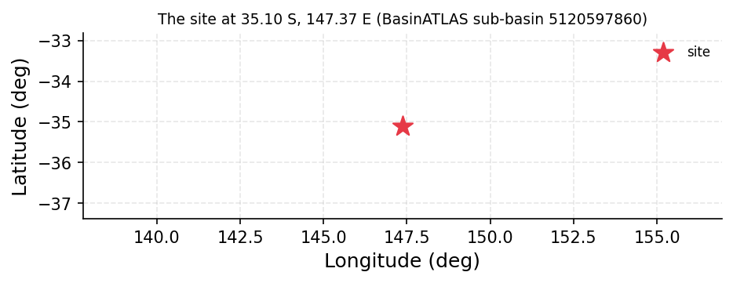
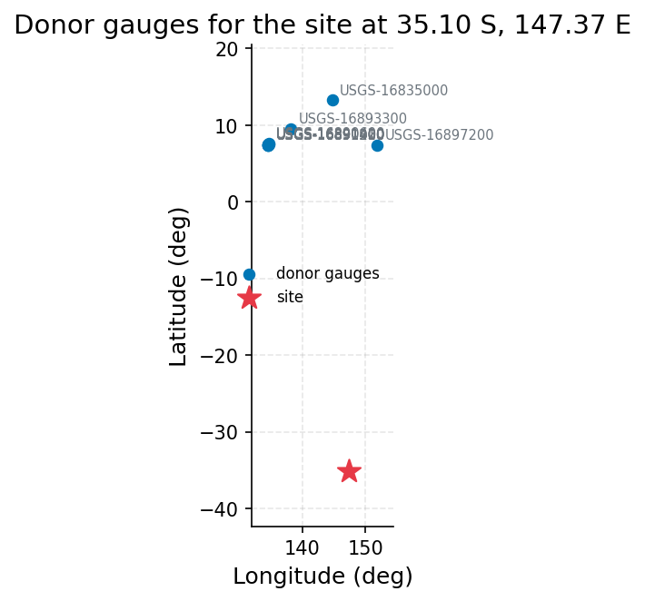
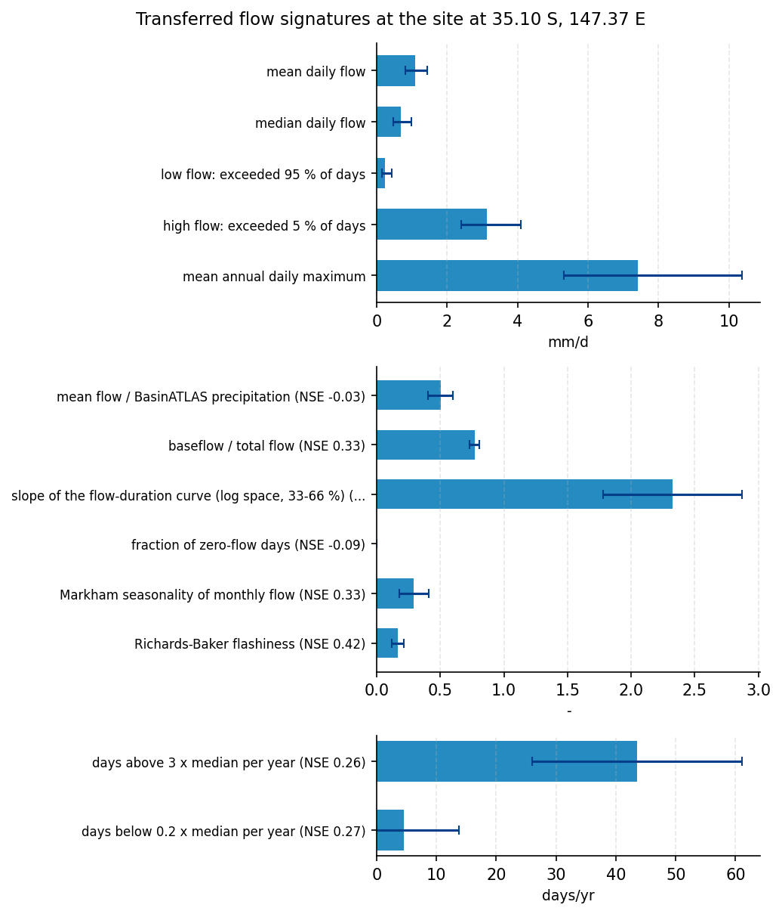
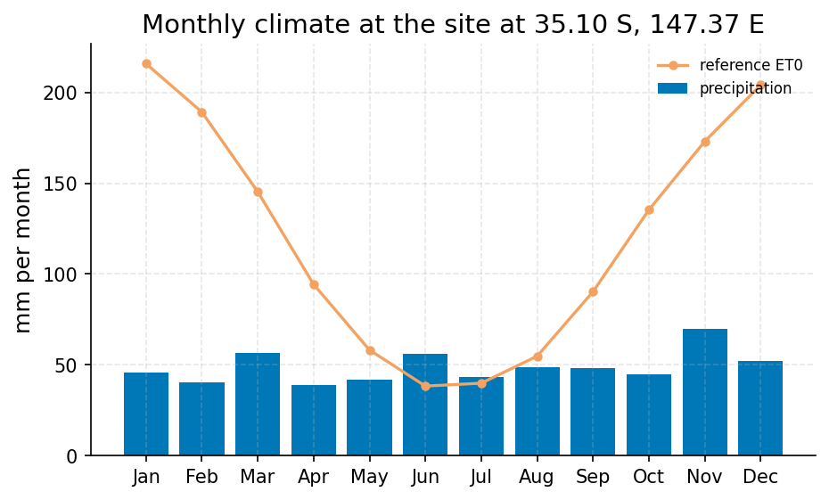
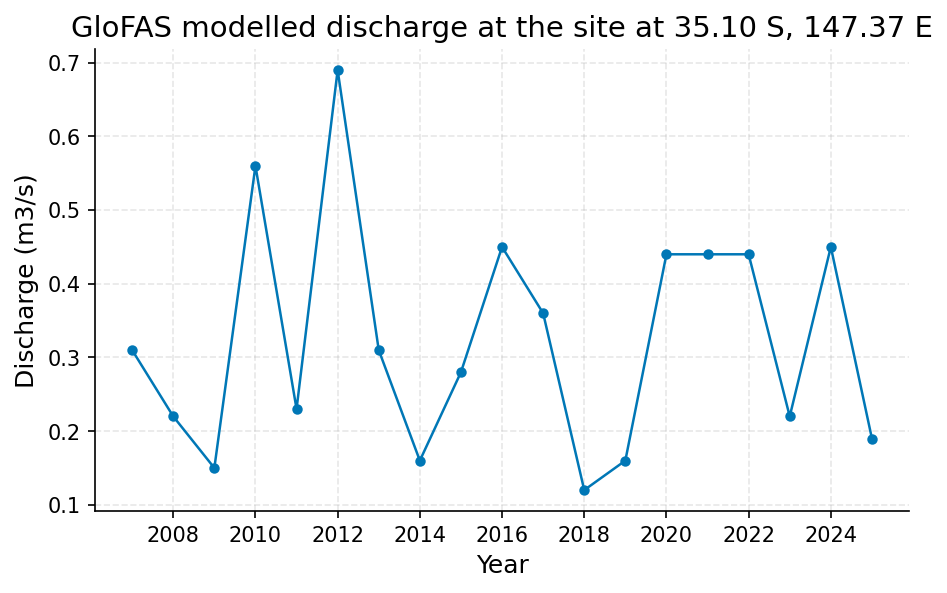

# Design Flood Assessment for the Wagga Wagga Levee Upgrade, Murrumbidgee River

**Author:** AquaScope Studio  
**Date:** 2026-09-14  
**Description:** set the design flood capacity for the Wagga Wagga levee upgrade using a defensible estimate of the 100-year flow, and state how much confidence that estimate can carry  
**Data Sources:** BasinATLAS (HydroATLAS v1.0), ERA5 via Open-Meteo, bom, similar_basins  
**Version:** 1.0  

**Site:** 35.1000 S, 147.3700 E

**Answer.** Notice: the Critic's fix requests on decision, limitations, summary were not all resolved; read the report with the list of what this study does not establish.

No number in the results answers the design decision at an established grade; the finding is not_established. Two lines of evidence were produced. First, a donor-regionalised mean annual daily flood peak (specific discharge) of 7.424 mm/d, band 5.315 to 10.369 mm/d, transferred from 10 similarity-matched gauges against BasinATLAS HydroATLAS v1.0 attributes, leave-one-out median absolute percent error 0.37 for this signature. This is a mean annual maximum, not a 100-year quantile, and cannot be converted to a 100-year flow without a distributional assumption that the donor data do not support. Second, two curve fits to the GloFAS v4 grid-cell discharge series at the site cell (2007 to 2025, 19 annual maxima): GEV by L-moments gives a 100-year return level of 0.8165 m3/s and Log-Pearson III gives 0.8885 m3/s, a ratio of 1.09 between the two fits. Neither line of evidence is defensible for setting levee design capacity. Until an at-site or a truly climatically and physically comparable donor gauge record is obtained, the 100-year flow at Wagga Wagga on the Murrumbidgee is not established from this evidence base, and no confidence band can be carried into design from the figures produced here.

*Key numbers*

| Quantity | Value | Unit | Step |
| --- | --- | --- | --- |
| Upstream area | 27040.0 | km2 | s1 |
| Donor gauges | 10.0 |  | s2 |
| mean daily flow | 1.083 | mm/d | s3 |
| mean daily flow band, low | 0.8211 | mm/d | s3 |
| mean daily flow band, high | 1.429 | mm/d | s3 |
| low flow: exceeded 95 % of days | 0.2469 | mm/d | s3 |
| low flow: exceeded 95 % of days band, low | 0.1444 | mm/d | s3 |
| low flow: exceeded 95 % of days band, high | 0.422 | mm/d | s3 |
| high flow: exceeded 5 % of days | 3.125 | mm/d | s3 |
| high flow: exceeded 5 % of days band, low | 2.391 | mm/d | s3 |
| high flow: exceeded 5 % of days band, high | 4.084 | mm/d | s3 |
| mean annual daily maximum | 7.424 | mm/d | s3 |
| mean annual daily maximum band, low | 5.315 | mm/d | s3 |
| mean annual daily maximum band, high | 10.37 | mm/d | s3 |
| mean flow / BasinATLAS precipitation | 0.5018 | - | s3 |
| mean flow / BasinATLAS precipitation band, low | 0.4017 | - | s3 |
| mean flow / BasinATLAS precipitation band, high | 0.602 | - | s3 |
| baseflow / total flow | 0.7692 | - | s3 |
| baseflow / total flow band, low | 0.7317 | - | s3 |
| baseflow / total flow band, high | 0.8067 | - | s3 |
| ERA5 precipitation | 588.0 | mm per year | s4 |
| ERA5 reference evapotranspiration | 1428.0 | mm per year | s4 |
| Aridity index | 0.4117 |  | s4 |
| GloFAS mean discharge (cell) | 0.0313 | m3/s | s4 |

## Summary

The brief asks for a defensible 100-year peak flow at Wagga Wagga on the Murrumbidgee to size a levee upgrade, and for a statement of how far that estimate can be trusted. The site has no streamflow gauge; the BOM stations found nearby (for example GW273167.1.1 HAMPDEN 1 WAGGA, GW273168.1.1 WILKS 1 WAGGA, and water-quality station 410001 M/BIDGEE R at WAGGA) are groundwater or water-quality records, not streamflow gauges, so at-site flood-frequency analysis is not possible. The plan instead described the catchment from BasinATLAS, searched a 34,786-gauge pool for 10 similarity donors, transferred flow signatures with a spread band and leave-one-out skill, and cross-checked against a GloFAS grid-cell discharge series. The outcome is that neither the donor-regionalised signature nor the GloFAS-based curve fits reach a defensible design-grade 100-year flow: the donor pools returned are climatically mismatched (tropical Pacific islands and wet European headwater streams against a semi-arid, heavily regulated 27,041 km2 Australian basin), and the GloFAS cell's mean discharge is inconsistent by three orders of magnitude with the basin's own modelled mean annual discharge.

## The decision

Decide with: none of the current figures at design grade; the study returns a not_established finding for the 100-year flow at Wagga Wagga. No band can be carried into the levee design from this evidence. This holds under the following conditions: the Wagga Wagga site is treated as fully ungauged, with the two local BOM record types being groundwater (for example GW030475.1.1 Wagga Wagga) and water-quality (410001 M/BIDGEE R at WAGGA) stations rather than streamflow gauges; the only donors available for regionalisation are the stations returned by the similarity search, none of which match the target's semi-arid, large-area, temperate, heavily regulated setting; the GloFAS grid-cell series is accepted as the only source of an explicit 100-year return-period calculation despite its mean discharge being inconsistent with the basin's known scale; and no CMIP6 or downscaled climate adjustment is applied, so any estimate reflects historical and current climate and regulation conditions only. What would change this: an observed annual-maximum streamflow record at or near Wagga Wagga to run an at-site GEV or LP3 fit directly; a re-run of the donor search restricted to gauged, climatically and physically comparable semi-arid, large-area, temperate Australian catchments; and confirmation, or correction, of the GloFAS grid-cell location against the true Murrumbidgee channel, since its 0.0313 m3/s mean is not credible for a 27,041 km2 basin with a documented mean annual discharge near 115 m3/s.

## Findings

Four findings anchor this assessment. First, HydroATLAS's own modelled mean annual natural discharge for this basin outlet is 114.97 m3/s, the only basin-scale flow reference available, and it is itself a modelled rather than observed quantity (screening grade). Second, the regionalised mean annual daily maximum specific discharge for the site is 7.424 mm/d, band 5.315 to 10.369 mm/d, but this is a mean annual maximum signature, not a 100-year return-period estimate (screening grade). Third, GloFAS reanalysis discharge for the grid cell gives a GEV by L-moments 100-year return level of 0.8165 m3/s (not_established grade). Fourth, the same GloFAS series gives a Log-Pearson III 100-year return level of 0.8885 m3/s, close to the GEV value, but built on the same mis-scaled series (not_established grade). Two consistency checks matter. The GloFAS GEV and LP3 100-year return levels agree closely, ratio 1.09, but agreement between two fits to the same flawed series does not make either usable for design. A further mismatch: several of the 10 donor catchments have precipitation up to about 4 times the target's, being tropical Pacific-island or wet European headwater streams, so transferred flow signatures reflect a different hydrological regime than the semi-arid target basin.

## Problem and decision

The decision is to set the design flood capacity for the Wagga Wagga levee upgrade using a defensible estimate of the Murrumbidgee's 100-year peak flow (m3/s) and to state how much confidence that estimate can carry. The requested quantities are the 100-year return-period peak flow at the Wagga Wagga site and an uncertainty range or confidence bound on it. Assumptions carried through this assessment: site discharge is treated as ungauged, since the nearby BOM stations found are groundwater and water-quality sites rather than streamflow gauges and so cannot support at-site flood frequency; regionalisation uses the 10 donor catchments identified plus GloFAS reanalysis discharge as a cross-check, per the sufficiency assessment; catchment descriptors (area, precipitation, aridity, dam index) are taken from BasinATLAS HydroATLAS v1.0 for the matched basin; no CMIP6 or downscaled climate adjustment is applied, so the estimate reflects historical and current climate and regulation conditions only; and GloFAS discharge is a roughly 5 km grid-cell model output, not a gauge reading, so its return levels are indicative rather than confirmatory.

## Site and data

The Wagga Wagga sub-basin (HydroBASINS hybas_id 5120597860, pfaf_id 564270701000, next_down 5120597910) has an upstream drainage area of 27,041.2 km2 (total delineated catchment 27,983.8 km2 across 203 level-12 sub-basins). BasinATLAS upstream attributes: mean elevation 715 m, mean slope 6.7 degrees, mean annual precipitation 868 mm/yr, potential evapotranspiration 1223 mm/yr, actual evapotranspiration 681 mm/yr, aridity index (P/PET) 0.74, mean annual air temperature 12.3 degrees C, snow cover 1 percent of the year, area-weighted annual runoff 140.95 mm/yr, and a HydroATLAS-modelled mean annual natural discharge at the outlet of 114.97 m3/s. Land cover is 40 percent forest, 25 percent pasture, 5 percent cropland, 1 percent urban, 0 percent irrigated, 1 percent wetland, 0.3 percent lake, 9 percent karst. Soils are 26 percent clay, 17 percent silt, 57 percent sand, with 29 t/ha soil organic carbon and 61 percent annual soil water content; groundwater table depth is 464.14 cm. Population is 523,789 people at a density of 19.51 people/km2, human footprint (2009) is 8.6, and the degree of regulation by reservoirs is 114.9 percent with 4164 million m3 of upstream reservoir volume, marking this as an already-regulated river. Source: HydroATLAS v1.0 (BasinATLAS), CC BY 4.0, Linke, S., Lehner, B., Ouellet Dallaire, C., et al. (2019), Scientific Data 6:283.

## Methodology

The catchment was first described from BasinATLAS to fix the area, climate and regulation context needed to match donors. A pool of 34,786 gauges was searched for the 10 catchments most similar to this one in standardised BasinATLAS attribute space (log area, elevation, slope, precipitation, aridity, temperature, snow, forest, cropland, urban, clay, sand, population density, regulation). Flow signatures, including the mean annual daily maximum, were then transferred from a donor pool (1155 donors available for the signature transfer step) with a spread band and leave-one-out skill quoted for each signature. GloFAS modelled discharge for the site grid cell was pulled as an independent, model-based cross-check, with annual maxima fitted by GEV (L-moments) and Log-Pearson III. No CMIP6 or downscaled climate adjustment was applied. Both the at-site flood-frequency and trend approaches were ruled out from the start because the site is ungauged.

## Results: step s1

describe_catchment (source: HydroATLAS v1.0 BasinATLAS) returned the sub-basin above, passing the not_empty and max_area_km2 gates (27,983.8 km2 against a ceiling of 27,984 km2). Key figures: upstream area 27,041.2 km2, mean elevation 715 m, mean slope 6.7 degrees, precipitation 868 mm/yr, aridity index 0.74, temperature 12.3 degrees C, degree of regulation 114.9 percent, HydroATLAS mean annual natural discharge 114.97 m3/s. This is the only basin-scale flow reference available and is itself modelled, not observed.


*The site, in longitude and latitude (no basemap); no catalogue station was listed with it.*

*Catchment attributes from BasinATLAS for the site at 35.10 S, 147.37 E.*

| attribute | label | value | unit | source | note |
| --- | --- | --- | --- | --- | --- |
| n_sub_basins |  | 203.0 |  |  |  |
| area_km2 |  | 27983.8 |  |  |  |
| outlet_hybas_id |  | 5120597860.0 |  |  |  |
| upstream_area_km2 |  | 27041.2 |  |  |  |
| elevation_m | mean elevation | 715.0 | m | basinatlas_upstream |  |
| slope_deg | mean slope | 6.7 | degrees | basinatlas_upstream |  |
| precipitation_mm_yr | annual precipitation (WorldClim) | 868.0 | mm/yr | basinatlas_upstream |  |
| pet_mm_yr | annual potential evapotranspiration | 1223.0 | mm/yr | basinatlas_upstream |  |
| aet_mm_yr | annual actual evapotranspiration | 681.0 | mm/yr | basinatlas_upstream |  |
| aridity_index | aridity index (P/PET) | 0.74 | P/PET | basinatlas_upstream |  |
| temperature_c | mean annual air temperature | 12.3 | °C | basinatlas_upstream |  |
| snow_cover_pct | annual snow cover extent | 1.0 | % | basinatlas_upstream |  |
| runoff_mm_yr | annual land-surface runoff | 140.95 | mm/yr | area_weighted_mean |  |
| discharge_m3s | mean annual natural discharge at the outlet | 114.97 | m3/s | basinatlas_upstream |  |
| forest_pct | forest cover | 40.0 | % | basinatlas_upstream |  |
| cropland_pct | cropland | 5.0 | % | basinatlas_upstream |  |
| pasture_pct | pasture | 25.0 | % | basinatlas_upstream |  |
| urban_pct | urban extent | 1.0 | % | basinatlas_upstream |  |
| irrigated_pct | irrigated area | 0.0 | % | basinatlas_upstream |  |
| glacier_pct | glacier extent | 0.0 | % | basinatlas_upstream |  |
| wetland_pct | wetlands (all classes) | 1.0 | % | basinatlas_upstream |  |
| lake_pct | lake area | 0.3 | % | basinatlas_upstream |  |
| karst_pct | karst extent | 9.0 | % | basinatlas_upstream |  |
| clay_pct | clay fraction in soil | 26.0 | % | basinatlas_upstream |  |
| silt_pct | silt fraction in soil | 17.0 | % | basinatlas_upstream |  |
| sand_pct | sand fraction in soil | 57.0 | % | basinatlas_upstream |  |
| soil_organic_carbon_t_ha | soil organic carbon | 29.0 | t/ha | basinatlas_upstream |  |
| soil_water_pct | annual soil water content | 61.0 | % | basinatlas_upstream |  |
| groundwater_table_cm | groundwater table depth | 464.14 | cm | area_weighted_mean |  |
| population_density | population density | 19.51 | people/km2 | basinatlas_upstream |  |
| population | population count | 523789.0 | people | basinatlas_upstream |  |
| degree_of_regulation_pct | degree of regulation by reservoirs | 114.9 | % | basinatlas_upstream |  |
| human_footprint_2009 | human footprint (2009) | 8.6 | index 0-50 | basinatlas_upstream |  |
| reservoir_volume_mcm | reservoir volume upstream | 4164.0 | million m3 | basinatlas_upstream |  |

## Results: step s2

similar_basins searched 34,786 candidate gauges and returned the 10 nearest by combined physical-similarity and proximity distance, meeting the min_donors and not_empty gates. The returned donors are all in the tropical Pacific: USGS-16897200 Tumunu Stream (Chuuk, FSM), USGS-16891300 Edeng River, USGS-16891310 Kmekumel River, USGS-16890900 Tabecheding River, USGS-16891200 Ngerimel River, USGS-16891400 SF Ngerdorch River, USGS-16891420 NF Ngerdorch River nr Melekeok, and USGS-16890600 Diongradid River (all Babelthuap, Palau), an unnamed USGS-16893300 station near 9.54 N 138.19 E, and USGS-16835000 Inarajan River (Guam). Their precipitation ranges from about 2353 to 3527 mm/yr against the target's 868 mm/yr, aridity from 1.79 to 2.64 against 0.74, temperature around 27 degrees C against 12.3 degrees C, and regulation 0 percent against the target's 114.9 percent. Distances from the site range from about 4747 to 5387 km. These donors are climatically and physically distant from the semi-arid, heavily regulated target basin.


*The site and the 10 donor gauges the similarity search selected, in longitude and latitude (no basemap); labels are the station ids.*

*Donor gauges selected for the site at 35.10 S, 147.37 E.*

| source | station_id | name | latitude | longitude | distance_km | score | similarity_distance | up_area_km2 | period_start | period_end |
| --- | --- | --- | --- | --- | --- | --- | --- | --- | --- | --- |
| usgs | USGS-16897200 | Tumunu Stream, Dublon, Chuuk IS, FSM | 7.37606944444444 | 151.874166666667 | 4746.7 | 9.9531 | 2.9898 | 174.6 | 1968-05-31 | 1978-01-30 |
| usgs | USGS-16891300 | Edeng River, Babelthuap, Palau | 7.383333333333334 | 134.55194444444444 | 4911.7 | 10.2252 | 2.8383 | 427.8 | 1969-10-01 | 1983-09-29 |
| usgs | USGS-16891310 | Kmekumel River, Babelthuap, Palau | 7.387611111111111 | 134.54322222222223 | 4912.4 | 10.2351 | 2.8688 | 427.8 | 1978-08-31 | 2005-05-24 |
| usgs | USGS-16890900 | Tabecheding River, Babelthuap, Palau | 7.450805555555556 | 134.525 | 4919.7 | 10.2385 | 2.8307 | 427.8 | 1970-09-30 | 2005-02-02 |
| usgs | USGS-16891200 | Ngerimel River, Babelthuap, Palau | 7.371666666666666 | 134.52694444444447 | 4911.1 | 10.2391 | 2.8917 | 427.8 | 1969-10-01 | 1978-04-29 |
| usgs | USGS-16891400 | SF Ngerdorch River, Babelthuap, Palau | 7.440055555555555 | 134.5768611111111 | 4917.1 | 10.2395 | 2.8526 | 427.8 | 1971-02-28 | 1992-01-14 |
| usgs | USGS-16891420 | NF Ngerdorch River nr Melekeok, Babelthuap, Palau | 7.509305555555556 | 134.60302777777778 | 4923.7 | 10.2556 | 2.8642 | 427.8 | 1993-11-02 | 2004-02-13 |
| usgs | USGS-16890600 | Diongradid River, Babelthuap, Palau | 7.60388888888889 | 134.586388888889 | 4934.4 | 10.2685 | 2.8373 | 427.8 | 1969-10-01 | 2005-05-23 |
| usgs | USGS-16893300 |  | 9.537777777777778 | 138.18805555555556 | 5056.6 | 10.3898 | 2.3816 | 125.1 | 1968-03-31 | 1974-09-29 |
| usgs | USGS-16835000 | Inarajan River nr Inarajan, Guam | 13.279527777777778 | 144.73988888888888 | 5386.7 | 10.9339 | 1.8666 | 374.9 | 1952-09-30 | 1983-01-04 |

## Results: step s3

regionalize_signatures drew on a donor pool of 1155 gauges (broader than the 10-station search in s2) and returned, with not_empty gates satisfied for estimates and skill: mean daily flow 1.0834 mm/d (band 0.8211 to 1.4294 mm/d), median daily flow 0.6895 mm/d, low flow (q95) 0.2469 mm/d, high flow (q05) 3.1251 mm/d, mean annual daily maximum (the flood-relevant signature) 7.4238 mm/d with a band of 5.3153 to 10.3687 mm/d across 10 donors, runoff ratio 0.5018, baseflow index 0.7692, flow-duration-curve slope 2.3252, high-flow frequency 43.5213 days/yr, low-flow frequency 4.559 days/yr, zero-flow fraction 0.0, seasonality index 0.2925, and flashiness index 0.1653. Leave-one-out skill for the mean annual daily maximum signature had a median absolute percent error of 0.37 in log space across 1153 donors, worse than mean daily flow (0.251) and better than low flow q95 (0.534). The 10 example donors listed for this transfer step are French Hub'Eau streams (for example A735201001 Le Rupt de Mad a Onville, A623201001 La Plaine a Raon-l'Etape, A615103001 La Meurthe a Raon-l'Etape), wetter and cooler headwater catchments generally smaller than the target's upstream area, with precipitation from about 717 to 884 mm/yr and regulation from 0 to 82.3 percent, again not a close climatic match for a semi-arid, large, heavily regulated Australian basin. This mean annual daily maximum is a flood-relevant signature but is not itself a 100-year quantile.


*Flow signatures transferred to the site from 10 donor catchments, with the one-standard-deviation band across donors as error bars and the leave-one-out skill (NSE) where published.*

*Flow signatures at the site at 35.10 S, 147.37 E.*

| signature | label | value | low | high | unit | n_donors | nse |
| --- | --- | --- | --- | --- | --- | --- | --- |
| q_mean_mm | mean daily flow | 1.0834 | 0.8211 | 1.4294 | mm/d | 10 |  |
| q_median_mm | median daily flow | 0.6895 | 0.4778 | 0.9951 | mm/d | 10 |  |
| q95_mm | low flow: exceeded 95 % of days | 0.2469 | 0.1444 | 0.422 | mm/d | 10 |  |
| q05_mm | high flow: exceeded 5 % of days | 3.1251 | 2.3913 | 4.0841 | mm/d | 10 |  |
| q_annual_max_mm | mean annual daily maximum | 7.4238 | 5.3153 | 10.3687 | mm/d | 10 |  |
| runoff_ratio | mean flow / BasinATLAS precipitation | 0.5018 | 0.4017 | 0.602 | - | 10 | -0.027 |
| baseflow_index | baseflow / total flow | 0.7692 | 0.7317 | 0.8067 | - | 10 | 0.33 |
| fdc_slope | slope of the flow-duration curve (log space, 33-66 %) | 2.3252 | 1.7808 | 2.8697 | - | 10 | 0.169 |
| high_flow_frequency | days above 3 x median per year | 43.5213 | 25.9787 | 61.0639 | days/yr | 10 | 0.263 |
| low_flow_frequency | days below 0.2 x median per year | 4.559 | 0.0 | 13.7352 | days/yr | 10 | 0.269 |
| zero_flow_fraction | fraction of zero-flow days | 0.0 | 0.0 | 0.0 | - | 10 | -0.087 |
| seasonality_index | Markham seasonality of monthly flow | 0.2925 | 0.1776 | 0.4075 | - | 10 | 0.332 |
| flashiness_index | Richards-Baker flashiness | 0.1653 | 0.1187 | 0.2119 | - | 10 | 0.421 |

*Donor gauges selected for the site at 35.10 S, 147.37 E.*

| source | station_id | name | latitude | longitude | distance_km | score | similarity_distance | up_area_km2 | period_start | period_end |
| --- | --- | --- | --- | --- | --- | --- | --- | --- | --- | --- |
| hubeau_hydrometrie | A735201001 | Le Rupt de Mad à Onville | 49.012193042 | 5.961532525 |  | 1.0736 | 1.0736 | 398.8 | 1964-08-01 |  |
| hubeau_hydrometrie | A623201001 | La Plaine à Raon-l'Étape [La Trouche] | 48.416320357 | 6.877878865 |  | 1.1868 | 1.1868 | 130.3 | 1969-11-09 |  |
| hubeau_hydrometrie | A615103001 | La Meurthe à Raon-l'Étape | 48.402032182 | 6.845062409 |  | 1.2075 | 1.2075 | 1096.2 | 1973-11-01 |  |
| hubeau_hydrometrie | F041000201 | La Digeanne à Montmoyen | 47.740042453 | 4.786663807 |  | 1.2279 | 1.2279 | 109.6 | 2006-05-15 |  |
| hubeau_hydrometrie | A631101003 | La Meurthe à Baccarat - amont | 48.447732868 | 6.740048847 |  | 1.2289 | 1.2289 | 1096.2 | 2015-07-16 |  |
| hubeau_hydrometrie | A631101001 | La Meurthe à Baccarat - aval | 48.44923718 | 6.738612663 |  | 1.2289 | 1.2289 | 1096.2 | 1981-01-01 |  |
| hubeau_hydrometrie | A215030001 | Le ruisseau le Strengbach à Ribeauvillé | 48.200033318 | 7.301208506 |  | 1.2339 | 1.2339 | 585.2 | 1971-06-25 |  |
| hubeau_hydrometrie | A343021001 | La Zinsel du Sud à Eckartswiller [Oberhof] | 48.799588457 | 7.310495367 |  | 1.2407 | 1.2407 | 177.4 | 2006-07-05 |  |
| hubeau_hydrometrie | A932215050 | L'Horn à Bousseviller | 49.127103129 | 7.47209323 |  | 1.2417 | 1.2417 | 153.4 | 1969-10-01 |  |
| hubeau_hydrometrie | A643112002 | La Vezouze à Blâmont - amont | 48.588299085 | 6.845033347 |  | 1.2428 | 1.2428 | 152.1 | 2007-01-01 |  |

## Results: step s4

The anywhere tool returned ERA5 climate context for the grid cell (precipitation 587.9526 mm/yr, reference evapotranspiration 1428.1816 mm/yr, aridity index 0.4117, classed semi-arid) and a GloFAS v4 modelled discharge series for the site cell, 2006-09-07 to 2026-09-07, 7306 daily values. The GloFAS series has a mean of 0.0313 m3/s and a median of 0.02 m3/s. Annual maxima for 19 years (2007-2025) range from 0.12 to 0.69 m3/s, with the record maximum of 0.69 m3/s in 2012 (empirical return period about 20 years by Weibull plotting position). No trend was detected in annual maxima (Mann-Kendall p-value 0.8056, Sen's slope 0.001 per year) or in annual mean discharge (p-value 0.7264). Flood-frequency fits to these annual maxima gave, at the 100-year return period, 0.8165 m3/s (GEV by L-moments) and 0.8885 m3/s (Log-Pearson III), a ratio of 1.09 between the two.


*Mean monthly precipitation (bars) and FAO-56 reference evapotranspiration (line) for the ERA5 cell at the site at 35.10 S, 147.37 E, 20 years ending 2026-09-07.*


*Annual maxima of the modelled discharge from GloFAS v4 (Open-Meteo) for the grid cell at the site at 35.10 S, 147.37 E, 2006 to 2026: a model output, indicative only, not a gauge reading.*

*Mean monthly precipitation and reference evapotranspiration for the ERA5 cell at the site at 35.10 S, 147.37 E.*

| month | precipitation_mm | et0_mm |
| --- | --- | --- |
| 1 | 45.7827 | 215.7587 |
| 2 | 40.2024 | 189.1472 |
| 3 | 56.3582 | 145.3053 |
| 4 | 38.7146 | 94.3356 |
| 5 | 41.8059 | 58.2131 |
| 6 | 55.8828 | 38.361 |
| 7 | 43.4654 | 39.9545 |
| 8 | 48.8317 | 54.8161 |
| 9 | 48.1823 | 90.307 |
| 10 | 44.6339 | 135.3294 |
| 11 | 69.6873 | 173.0123 |
| 12 | 51.9935 | 204.0143 |

*GloFAS modelled discharge for the grid cell at the site at 35.10 S, 147.37 E (indicative).*

| item | value |
| --- | --- |
| variable | discharge |
| unit | m3/s |
| n | 7306 |
| start | 2006-09-07 |
| end | 2026-09-07 |
| years | 20.0 |
| stats.mean | 0.0313 |
| stats.median | 0.02 |
| stats.min | 0.0 |
| stats.max | 0.69 |
| sampling.n | 7306 |
| sampling.span_years | 20.0 |
| sampling.per_year | 365.3 |
| sampling.inferred_resolution | daily |
| trend.on | annual mean |
| trend.p_value | 0.7264 |
| trend.tau | 0.0643 |
| trend.trend | no trend |
| trend.sens_slope_per_year | 0.0003 |
| trend.n_years | 19 |
| source | GloFAS v4 (modelled) via Open-Meteo |
| modelled | True |
| return_level_T2_gev | 0.3015 |
| return_level_T5_gev | 0.4473 |
| return_level_T10_gev | 0.5405 |
| return_level_T25_gev | 0.6547 |
| return_level_T50_gev | 0.7369 |
| return_level_T100_gev | 0.8165 |
| q10 | 0.08 |
| q50 | 0.02 |
| q95 | 0.0 |

## Limitations and what this study does not establish

Design-flood guidance under climate change is immature; the estimate here is stationary and any climate scenario would be an overlay on it, not a nonstationary fit, per Wasko et al. (2024, HESS). Rare quantiles move with the distribution and the estimator: the GEV and LP3 fits to the GloFAS series agree within about 9 percent here, but that agreement is on a series that is itself not credible for this basin, so it should not be read as confirmation. The catchment has substantial upstream regulation, degree of regulation 114.9 percent in BasinATLAS, so any annual-maximum signal transferred or fit reflects the operated river, not the natural flood regime. The donor pools used in both the similarity search and the signature transfer are climatically and physically distant from the target catchment: Pacific-island and Guam gauges in one case and wetter, cooler, smaller French headwater streams in the other, none matching the semi-arid, large-area, heavily regulated Murrumbidgee setting at Wagga Wagga.

## Caveats

- Design-flood guidance under climate change is immature (Wasko et al. 2024, HESS): the estimate here is stationary, and any climate scenario is an overlay on it, not a nonstationary fit.
- Rare quantiles move with the distribution and the estimator. Two fits (GEV by L-moments and Log-Pearson III) are quoted with their intervals and the spread between them; a spread above 25 percent is reported as disagreement, not averaged away.
- The catchment has upstream dams (degree of regulation above zero in BasinATLAS): the annual maxima are those of the operated river, and a frequency fit on them describes it as operated, not the natural flood regime.
- GloFAS discharge is a model output for a grid cell of about 5 km, not a gauge reading; return levels from it are indicative only.

## Recommendations

Obtain an observed annual-maximum flow series from a Murrumbidgee gauge at or near Wagga Wagga; this is the only route to an established-grade 100-year flow, since nothing in the current evidence is an at-site flood record. Re-run the donor search with selection constrained to gauged, climatically and physically comparable catchments, ideally Australian or otherwise semi-arid and large-drainage-area, since the present donors differ from the target by 3 to 5 times in precipitation and by orders of magnitude in catchment area, which undermines the signature transfer used in the regionalisation step. Until these steps are taken, do not adopt either the donor-regionalised mean annual daily maximum or the GloFAS-based 100-year return levels as the design flow for the levee upgrade.

## References

1. Oudin, L. et al. (2008). Spatial proximity, physical similarity, regression and ungaged catchments. Water Resour. Res. 44, W03413.
2. Harrigan, S. et al. (2020). GloFAS-ERA5 operational global river discharge reanalysis 1979-present. Earth Syst. Sci. Data, 12, 2043-2060.
3. Bloeschl, G., Sivapalan, M., Wagener, T., Viglione, A., Savenije, H. (eds.) (2013). Runoff Prediction in Ungauged Basins. Cambridge University Press; Oudin, L. et al. (2008). Spatial proximity, physical similarity, regression and ungaged catchments. Water Resour. Res. 44, W03413. Attributes: HydroATLAS v1.0 (BasinATLAS), CC BY 4.0. Linke, S., Lehner, B., Ouellet Dallaire, C., et al. (2019). Global hydro-environmental sub-basin and river reach characteristics at high spatial resolution. Scientific Data 6: 283. https://doi.org/10.1038/s41597-019-0300-6
4. Bloeschl, G. et al. (eds.) (2013). Runoff Prediction in Ungauged Basins. Cambridge University Press
5. Addor, N. et al. (2018). A ranking of hydrological signatures based on their predictability in space. Water Resour. Res. 54, 8792-8812.
6. Hersbach, H. et al. (2020). The ERA5 global reanalysis. Q. J. R. Meteorol. Soc., 146, 1999-2049
7. Open-Meteo.com (CC BY 4.0).
8. Allen, R. G., Pereira, L. S., Raes, D., & Smith, M. (1998). Crop evapotranspiration. FAO Irrigation and Drainage Paper 56.
9. Hosking, J. R. M. (1990). L-moments: analysis and estimation of distributions using linear combinations of order statistics. J. R. Stat. Soc. B, 52(1), 105-124.
10. England, J. F. Jr. et al. (2018). Guidelines for determining flood flow frequency, Bulletin 17C. USGS Techniques and Methods 4-B5.
11. England, J. F. et al. (2019). Guidelines for determining flood flow frequency, Bulletin 17C. USGS Techniques and Methods 4-B5.
12. Wasko, C. et al. (2024). A systematic review of climate change science for flood and design guidance. Hydrol. Earth Syst. Sci. 28, 1251-1285. doi:10.5194/hess-28-1251-2024
13. Nonstationary flood frequency estimates are parameter-fragile: Stoch. Environ. Res. Risk Assess. (2024), doi:10.1007/s00477-024-02680-9
14. Multi-approach cross-checks in infrastructure flood practice: J. Hydrol. (2024), doi:10.1016/j.jhydrol.2024.130698
15. Wasko et al. 2024, HESS
16. Rekin226 and contributors (2026). AquaScope: Open-source water data aggregation toolkit (version 0.16.0) [Software]. Zenodo. https://doi.org/10.5281/zenodo.21903143

## Appendix: reproducibility

Re-run the same steps with no model: `aquascope run study.yaml`. Resume the workspace: `aquascope studio --resume workspace.json`.

Model: claude-sonnet-5 via anthropic; ledger: consultant 1 call(s), 4269 tokens, methodologist 1 call(s), 13769 tokens, interpreter 1 call(s), 36437 tokens, author 1 call(s), 34406 tokens, critic 1 call(s), 34584 tokens. aquascope 0.16.0.

```yaml
# An AquaScope study (version 3): the plan behind an answer, its gates, and what happened.
#   aquascope run study.yaml
version: 3
title: "Establish a defensible 100-year peak flow estimate for the M: -35.1, 147.37"
question: "Design flood for a levee upgrade on the Murrumbidgee at Wagga Wagga: the 100-year flow, and how far the evidence can be trusted."
created: "2026-09-14T23:25:29+00:00"
aquascope_version: "0.16.0"
author: "methodologist"
model: "claude-sonnet-5"
problem:
  kind: "flood_risk"
  site: {"lat": -35.1, "lon": 147.37}
  params: {"return_period": 100, "decision": "design flow"}
  text: "Design flood for a levee upgrade on the Murrumbidgee at Wagga Wagga: the 100-year flow, and how far the evidence can be trusted."
plan:
  author: "methodologist"
  playbook: "flood_risk"
  objective: "Establish a defensible 100-year peak flow estimate for the Murrumbidgee at Wagga Wagga to size the levee upgrade, and state the confidence that estimate can carry given the site is ungauged."
  decision: "set the design flood capacity for the Wagga Wagga levee upgrade using a regionalised 100-year flow estimate (donor-basin transfer cross-checked against GloFAS), carrying an explicit uncertainty band and a regulation caveat, rather than an at-site flood-frequency analysis"
  methodology: ["Describe the catchment at the site from BasinATLAS to fix the area, climate and regulation context that any donor transfer must match.", "Identify a pool of donor gauges whose catchments most resemble this one in BasinATLAS attribute space, drawing the requested 10 donors from the 34,786-gauge pool.", "Transfer flow signatures, including the annual-maximum flow, from those donors with a spread band and leave-one-out skill quoted alongside every number.", "Cross-check the regionalised flood estimate against GloFAS modelled discharge for the site cell as an independent, model-based line of evidence.", "Report the 100-year flow as the donor-regionalised estimate bounded by the donor spread and the GloFAS ratio, flagging that both the at-site flood-frequency and trend methods are not defensible here and that the record reflects an already-regulated river."]
  assumptions: ["site discharge is treated as ungauged; the nearby BOM stations found are groundwater and water-quality sites, not streamflow gauges, so they cannot support at-site flood frequency", "regionalisation uses the 10 donor catchments identified plus GloFAS reanalysis discharge as a cross-check, per the sufficiency assessment", "catchment descriptors (area, precipitation, aridity, dam index) are taken from BasinATLAS HydroATLAS v1.0 for the matched basin", "no CMIP6 or downscaled climate adjustment is applied; the estimate reflects historical/current climate and regulation conditions only", "Site discharge is treated as ungauged; the nearby BOM stations found are groundwater and water-quality sites, not streamflow gauges, so they cannot support at-site flood frequency.", "Regionalisation uses the 10 donor catchments identified plus GloFAS reanalysis discharge as a cross-check, per the sufficiency assessment.", "Catchment descriptors (area, precipitation, aridity, dam index) are taken from BasinATLAS HydroATLAS v1.0 for the matched basin.", "No CMIP6 or downscaled climate adjustment is applied; the estimate reflects historical/current climate and regulation conditions only.", "GloFAS discharge is a ~5 km grid-cell model output, not a gauge reading, so its return levels are indicative rather than confirmatory."]
  alternatives: [{"method": "at_site_flood_frequency", "why_not": "no discharge gauge with a usable record within 50 km of the site makes at-site flood frequency analysis not defensible"}, {"method": "trend_mann_kendall", "why_not": "there is no discharge record at this site to test for trend"}]
  limitations_expected: ["Design-flood guidance under climate change is immature; the estimate here is stationary and any climate scenario would be an overlay on it, not a nonstationary fit.", "Rare quantiles move with the distribution and the estimator; if donor-transferred and GloFAS-derived 100-year flows disagree by more than about 25-30 percent, that disagreement should be reported, not averaged away.", "The catchment has substantial upstream regulation (dam index 114.9 in BasinATLAS); any annual-maximum signal transferred or fit reflects the operated river, not the natural flood regime.", "GloFAS discharge is a model output for a grid cell of about 5 km, not a gauge reading; return levels from it are indicative only."]
  citations: ["England, J. F. et al. (2019). Guidelines for determining flood flow frequency, Bulletin 17C. USGS Techniques and Methods 4-B5.", "Hosking, J. R. M. (1990). L-moments: analysis and estimation of distributions using linear combinations of order statistics. J. R. Stat. Soc. B 52, 105-124.", "Wasko, C. et al. (2024). A systematic review of climate change science for flood and design guidance. Hydrol. Earth Syst. Sci. 28, 1251-1285. doi:10.5194/hess-28-1251-2024", "Nonstationary flood frequency estimates are parameter-fragile: Stoch. Environ. Res. Risk Assess. (2024), doi:10.1007/s00477-024-02680-9", "Multi-approach cross-checks in infrastructure flood practice: J. Hydrol. (2024), doi:10.1016/j.jhydrol.2024.130698", "Oudin, L. et al. (2008). Spatial proximity, physical similarity, regression and ungaged catchments. Water Resour. Res. 44, W03413.", "Harrigan, S. et al. (2020). GloFAS-ERA5 operational global river discharge reanalysis 1979-present. Earth Syst. Sci. Data 12, 2043-2060.", "Wasko et al. 2024, HESS"]
  caveats: ["Design-flood guidance under climate change is immature (Wasko et al. 2024, HESS): the estimate here is stationary, and any climate scenario is an overlay on it, not a nonstationary fit.", "Rare quantiles move with the distribution and the estimator. Two fits (GEV by L-moments and Log-Pearson III) are quoted with their intervals and the spread between them; a spread above 25 percent is reported as disagreement, not averaged away.", "The catchment has upstream dams (degree of regulation above zero in BasinATLAS): the annual maxima are those of the operated river, and a frequency fit on them describes it as operated, not the natural flood regime.", "GloFAS discharge is a model output for a grid cell of about 5 km, not a gauge reading; return levels from it are indicative only."]
  rationale: "Establish a defensible 100-year peak flow estimate for the Murrumbidgee at Wagga Wagga to size the levee upgrade, and state the confidence that estimate can carry given the site is ungauged."
  recon_notes: ["10 donor gauges from a pool of 34,786 gauged catchments.", "ERA5 temperature and forcing and GloFAS discharge are assumed reachable for any point on land (Open-Meteo); not checked here.", "CMIP6 change factors need model output you supply (aquascope.climate works on downloaded data); not counted.", "No gauge with a usable record within 50 km: at-site methods are not defensible; what remains is the regionalisation path (similar_basins, regionalize_signatures) and the GloFAS cross-check."]
steps:
  - tool: "describe_catchment"
    id: "s1"
    rationale: "Establishes the catchment attributes (area, climate, regulation) that anchor the donor-similarity search."
    arguments:
      lat: -35.1
      lon: 147.37
      upstream: true
    expects:
      - {"check": "not_empty", "path": "sub_basin"}
      - {"check": "max_area_km2", "path": "sub_basin.up_area", "value": 27983.8}
    outputs: [{"kind": "figure", "id": "s1_site_map", "caption": "site map from describe_catchment"}, {"kind": "table", "id": "s1_catchment_attributes", "caption": "catchment attributes (area 27041.2 km2, precipitation 868 mm/yr, aridity 0.74, dam index 114.9) from BasinATLAS"}]
  - tool: "similar_basins"
    id: "s2"
    rationale: "Finds the 10 donor gauges whose catchments most closely match this one, as required by the brief's regionalisation constraint."
    method: "similar_basins"
    arguments:
      lat: -35.1
      lon: 147.37
      k: 10
    expects:
      - {"check": "min_donors", "path": "k", "value": 10}
      - {"check": "not_empty", "path": "stations"}
    depends_on: ["s1"]
    outputs: [{"kind": "figure", "id": "s2_donors_map", "caption": "donors map from similar_basins"}, {"kind": "table", "id": "s2_donors", "caption": "10 donor gauges from similar_basins"}]
  - tool: "regionalize_signatures"
    id: "s3"
    rationale: "Transfers flow signatures, including the annual-maximum flow that anchors the 100-year estimate, from the 10 donors with a band and leave-one-out skill."
    method: "regionalize_signatures"
    arguments:
      lat: -35.1
      lon: 147.37
      k: 10
    expects:
      - {"check": "not_empty", "path": "estimates"}
      - {"check": "not_empty", "path": "skill"}
    depends_on: ["s2"]
    outputs: [{"kind": "figure", "id": "s3_signatures_band", "caption": "signatures band from regionalize_signatures"}, {"kind": "table", "id": "s3_signatures", "caption": "regionalised flow signatures (mean, Q95, Q05, annual max) from regionalize_signatures"}, {"kind": "table", "id": "s3_donors", "caption": "donor weights used in the transfer from regionalize_signatures"}]
  - tool: "anywhere"
    id: "s4"
    rationale: "Provides an independent, model-based GloFAS discharge frequency fit for the cell to cross-check the donor-regionalised 100-year flow."
    method: "glofas_cross_check"
    arguments:
      lat: -35.1
      lon: 147.37
      years: 20
    expects:
      - {"check": "not_empty", "path": "climate"}
    depends_on: ["s3"]
    outputs: [{"kind": "figure", "id": "s4_glofas_series", "caption": "GloFAS discharge series from anywhere"}, {"kind": "table", "id": "s4_glofas_summary", "caption": "GloFAS indicative return-level summary from anywhere"}]
results:
  s1: {"ok": true, "gates": [{"check": "not_empty", "passed": true, "detail": "'sub_basin' is present"}, {"check": "max_area_km2", "passed": true, "detail": "catchment of 27,041 km2 against a ceiling of 27,984 km2"}], "summary": "latitude=-35.1, longitude=147.37, license=CC-BY-4.0, attribution=HydroATLAS v1.0 (BasinATLAS), CC BY 4.0. Linke, S., Lehner, B., Ouellet Dallaire, C., et al. (2019). Global hydro-environmental sub-bas", "fallback_used": false, "sha256": "1bf59bc4ec7fe83b"}
  s2: {"ok": true, "gates": [{"check": "min_donors", "passed": true, "detail": "10 donors, 10 needed"}, {"check": "not_empty", "passed": true, "detail": "'stations' is present"}], "summary": "k=10, method=combined", "fallback_used": false, "sha256": "bb99ac5d3f639717"}
  s3: {"ok": true, "gates": [{"check": "not_empty", "passed": true, "detail": "'estimates' is present"}, {"check": "not_empty", "passed": true, "detail": "'skill' is present"}], "summary": "method=similarity", "fallback_used": false, "sha256": "1a885cd3846cad0f"}
  s4: {"ok": true, "gates": [{"check": "not_empty", "passed": true, "detail": "'climate' is present"}], "summary": "years=20, start=2006-09-07, end=2026-09-07", "fallback_used": false, "sha256": "72932c28d6f2dcbc"}
```

## Cite this software

AquaScope Studio (2026). AquaScope: Open-source water data aggregation toolkit (version 0.16.0) [Software]. Zenodo. https://doi.org/10.5281/zenodo.21903143


---

*{'model': 'claude-sonnet-5', 'provider': 'anthropic', 'prose': 'model', 'tokens': {'consultant': {'calls': 1, 'prompt_tokens': 3208, 'completion_tokens': 1061, 'cost_usd': 0.017026}, 'methodologist': {'calls': 1, 'prompt_tokens': 10362, 'completion_tokens': 3407, 'cost_usd': 0.054794}, 'interpreter': {'calls': 1, 'prompt_tokens': 24858, 'completion_tokens': 11579, 'cost_usd': 0.165506}, 'author': {'calls': 2, 'prompt_tokens': 55658, 'completion_tokens': 16969, 'cost_usd': 0.281006}, 'critic': {'calls': 1, 'prompt_tokens': 25091, 'completion_tokens': 9493, 'cost_usd': 0.145112}}, 'total_tokens': 161686, 'total_usd': 0.663444, 'budget': None, 'dropped': 9, 'aquascope_version': '0.16.0', 'date': '2026-09-14 23:32 UTC', 'workspace': '5d58590cfc06', 'plan_author': 'methodologist', 'written_by': {'answer': 'model', 'summary': 'model', 'decision': 'model', 'findings': 'model', 'problem': 'model', 'site_data': 'model', 'methodology': 'model', 'results-s1': 'model', 'results-s2': 'model', 'results-s3': 'model', 'results-s4': 'model', 'limitations': 'model', 'recommendations': 'model', 'references': 'template', 'appendix': 'template'}}*
